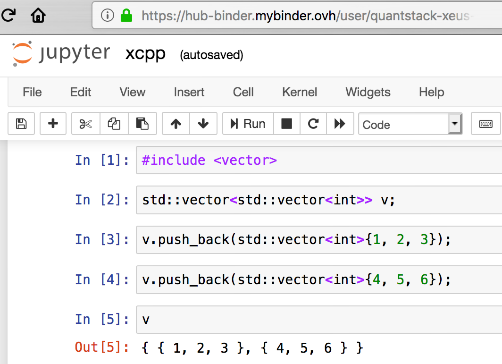
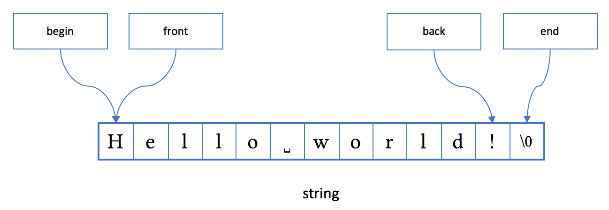
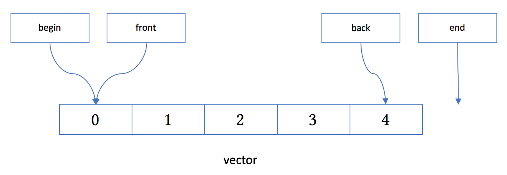
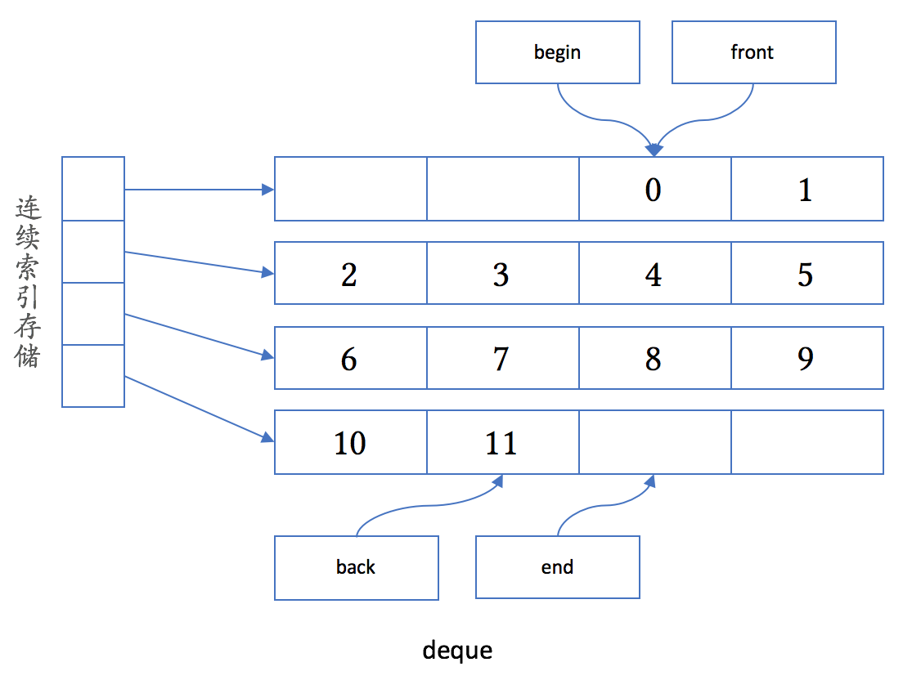
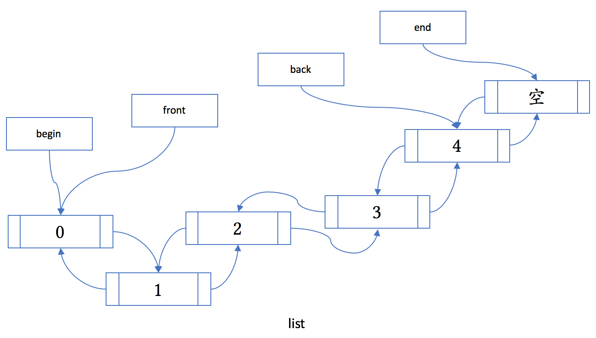
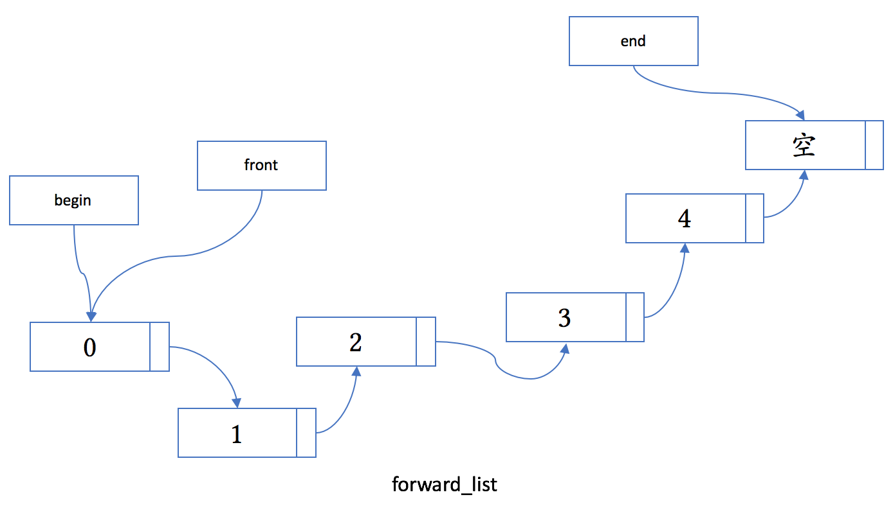
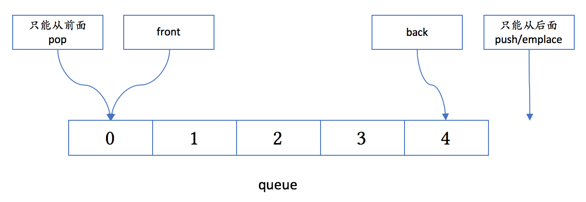
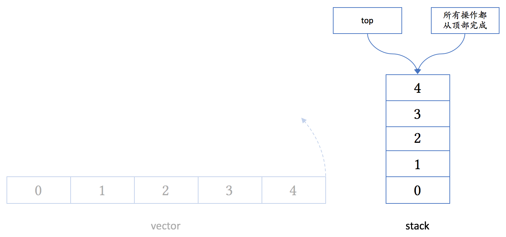

# 容器汇编 I：比较简单的若干容器

你好，我是吴咏炜。

上几讲我们学习了 C++ 的资源管理和值类别。今天我们换一个话题，来看一下 C++ 里的容器。

关于容器，已经存在不少的学习资料了。在 cppreference 上有很完备的参考资料（**[1]**）。今天我们采取一种非正规的讲解方式，尽量不重复已有的参考资料，而是让你加深对于重要容器的理解。

对于容器，学习上的一个麻烦点是你无法直接输出容器的内容——如果你定义了一个 **vector&lt;int&gt; v**，你是没法简单输出 **v** 的内容的。有人也许会说用 **copy(v.begin(), v.end(), ostream_iterator(…))**，可那既啰嗦，又对像 **map** 或 **vector&lt;vector&lt;…&gt;&gt;** 这样的复杂类型无效。因此，我们需要一个更好用的工具。在此，我向你大力推荐 xeus-cling **[2]**。它的便利性无与伦比——你可以直接在浏览器里以交互的方式运行代码，不需要本机安装任何编译器（点击“Trying it online”下面的 binder 链接）。下面是在线运行的一个截图：



xeus-cling 也可以在本地安装。对于使用 Linux 的同学，安装应当是相当便捷的。有兴趣的话，使用其他平台的同学也可以尝试一下。

如果你既没有本地运行的条件，也不方便远程使用互联网来运行代码，我个人还为本专栏写了一个小小的工具 **[3]**。在你的代码中包含这个头文件，也可以方便地得到类似于上面的输出。示例代码如下所示：

```cpp
#include <iostream>
#include <map>
#include <vector>
#include "output_container.h"

using namespace std;

int main()
{
  map<int, int> mp{
    {1, 1}, {2, 4}, {3, 9}};
  cout << mp << endl;
  vector<vector<int>> vv{
    {1, 1}, {2, 4}, {3, 9}};
  cout << vv << endl;
}
```

我们会得到下面的输出：

这个代码中用到了很多我们目前专栏还没有讲的知识，所以你暂且不用关心它的实现原理。如果你能看得懂这个代码，那就太棒了。如果你看不懂，唔，不急，慢慢来，你会明白的。

工具在手，天下我有。下面我们正式开讲容器篇。

## string 

**string** 一般并不被认为是一个 C++ 的容器。但鉴于其和容器有很多共同点，我们先拿 **string** 类来开说。

**string** 是模板 **basic_string** 对于 **char** 类型的特化，可以认为是一个只存放字符 **char** 类型数据的容器。“真正”的容器类与 **string** 的最大不同点是里面可以存放任意类型的对象。

跟其他大部分容器一样， **string** 具有下列成员函数：

- **begin** 可以得到对象起始点

- **end** 可以得到对象的结束点

- **empty** 可以得到容器是否为空

- **size** 可以得到容器的大小

- **swap** 可以和另外一个容器交换其内容

（对于不那么熟悉容器的人，需要知道 C++ 的 **begin** 和 **end** 是半开半闭区间：在容器非空时，**begin** 指向一个第一个元素，而 **end** 指向最后一个元素后面的位置；在容器为空时，**begin** 等于 **end**。在 **string** 的情况下，由于考虑到和 C 字符串的兼容，**end** 指向代表字符串结尾的 **\0** 字符。）

上面就几乎是所有容器的共同点了。也就是说：

- 容器都有开始和结束点

- 容器会记录其状态是否非空

- 容器有大小

- 容器支持交换

当然，这只是容器的“共同点”而已。每个容器都有其特殊的用途。

**string** 的内存布局大致如下图所示：



下面你会看到，不管是内存布局，还是成员函数，**string** 和 **vector** 是非常相似的。

**string** 当然是为了存放字符串。和简单的 C 字符串不同：

- **string** 负责自动维护字符串的生命周期

- **string** 支持字符串的拼接操作（如之前说过的 **+** 和 **+=**）

- **string** 支持字符串的查找操作（如 **find** 和 **rfind**）

- **string** 支持从 **istream** 安全地读入字符串（使用 **getline**）

- **string** 支持给期待 **const char*** 的接口传递字符串内容（使用 **c_str**）

- **string** 支持到数字的互转（**stoi** 系列函数和 **to_string**）

- 等等

推荐你在代码中尽量使用 **string** 来管理字符串。不过，对于对外暴露的接口，情况有一点复杂。我一般不建议在接口中使用 **const string&amp;**，除非确知调用者已经持有 **string**：如果函数里不对字符串做复杂处理的话，使用 **const char*** 可以避免在调用者只有 C 字符串时编译器自动构造 **string**，这种额外的构造和析构代价并不低。反过来，如果实现较为复杂、希望使用 **string** 的成员函数的话，那就应该考虑下面的策略：

- 如果不修改字符串的内容，使用 **const string&** 或 C++17 的 **string_view** 作为参数类型。后者是最理想的情况，因为即使在只有 C 字符串的情况，也不会引发不必要的内存复制。

- 如果需要在函数内修改字符串内容、但不影响调用者的该字符串，使用 **string** 作为参数类型（自动拷贝）。

- 如果需要改变调用者的字符串内容，使用 **string&** 作为参数类型（通常不推荐）。

估计大部分同学对 **string** 已经很熟悉了。我们在此只给出一个非常简单的小例子：

```cpp
string name;
cout << "What's your name? ";
getline(cin, name);
cout << "Nice to meet you, " << name
     << "!\n";
```

## vector 

**vector** 应该是最常用的容器了。它的名字“向量”来源于数学术语，但在实际应用中，我们把它当成动态数组更为合适。它基本相当于 Java 的 **ArrayList** 和 Python 的 **list**。

和 **string** 相似，**vector** 的成员在内存里连续存放，同时 **begin**、**end**、**front**、**back** 成员函数指向的位置也和 **string** 一样，大致如下图所示：



除了容器类的共同点，**vector** 允许下面的操作（不完全列表）：

- 可以使用中括号的下标来访问其成员（同 **string**）

- 可以使用 **data** 来获得指向其内容的裸指针（同 **string**）

- 可以使用 **capacity** 来获得当前分配的存储空间的大小，以元素数量计（同 **string**）

- 可以使用 **reserve** 来改变所需的存储空间的大小，成功后 **capacity()** 会改变（同 **string**）

- 可以使用 **resize** 来改变其大小，成功后 **size()** 会改变（同 **string**）

- 可以使用 **pop_back** 来删除最后一个元素（同 **string**）

- 可以使用 **push_back** 在尾部插入一个元素（同 **string**）

- 可以使用 **insert** 在指定位置前插入一个元素（同 **string**）

- 可以使用 **erase** 在指定位置删除一个元素（同 **string**）

- 可以使用 **emplace** 在指定位置构造一个元素

- 可以使用 **emplace_back** 在尾部新构造一个元素

大家可以留意一下 **push_…** 和 **pop_…** 成员函数。它们存在时，说明容器对指定位置的删除和插入性能较高。**vector** 适合在尾部操作，这是它的内存布局决定的。只有在尾部插入和删除时，其他元素才会不需要移动，除非内存空间不足导致需要重新分配内存空间。

当 **push_back**、**insert**、**reserve**、**resize** 等函数导致内存重分配时，或当 **insert**、**erase** 导致元素位置移动时，**vector** 会试图把元素“移动”到新的内存区域。**vector** 通常保证强异常安全性，如果元素类型没有提供一个**保证不抛异常的移动构造函数**，**vector** 通常会使用拷贝构造函数。因此，对于拷贝代价较高的自定义元素类型，我们应当定义移动构造函数，并标其为 **noexcept**，或只在容器中放置对象的智能指针。这就是为什么我之前需要在 **smart_ptr** 的实现中标上 **noexcept** 的原因。

下面的代码可以演示这一行为：

```cpp
#include <iostream>
#include <vector>

using namespace std;

class Obj1 {
public:
  Obj1()
  {
    cout << "Obj1()\n";
  }
  Obj1(const Obj1&)
  {
    cout << "Obj1(const Obj1&)\n";
  }
  Obj1(Obj1&&)
  {
    cout << "Obj1(Obj1&&)\n";
  }
};

class Obj2 {
public:
  Obj2()
  {
    cout << "Obj2()\n";
  }
  Obj2(const Obj2&)
  {
    cout << "Obj2(const Obj2&)\n";
  }
  Obj2(Obj2&&) noexcept
  {
    cout << "Obj2(Obj2&&)\n";
  }
};

int main()
{
  vector<Obj1> v1;
  v1.reserve(2);
  v1.emplace_back();
  v1.emplace_back();
  v1.emplace_back();

  vector<Obj2> v2;
  v2.reserve(2);
  v2.emplace_back();
  v2.emplace_back();
  v2.emplace_back();
}
```

我们可以立即得到下面的输出：

**Obj1** 和 **Obj2** 的定义只差了一个 **noexcept**，但这个小小的差异就导致了 **vector** 是否会移动对象。这点非常重要。

C++11 开始提供的 **emplace…** 系列函数是为了提升容器的性能而设计的。你可以试试把 **v1.emplace_back()** 改成 **v1.push_back(Obj1())**。对于 **vector** 里的内容，结果是一样的；但使用 **push_back** 会额外生成临时对象，多一次拷贝构造和一次析构。

现代处理器的体系架构使得对连续内存访问的速度比不连续的内存要快得多。因而，**vector** 的连续内存使用是它的一大优势所在。当你不知道该用什么容器时，缺省就使用 **vector** 吧。

**vector** 的一个主要缺陷是大小增长时导致的元素移动。如果可能，尽早使用 **reserve** 函数为 **vector** 保留所需的内存，这在 **vector** 预期会增长很大时能带来很大的性能提升。

## deque 

**deque** 的意思是 double-ended queue，双端队列。它主要是用来满足下面这个需求：

- 容器不仅可以从尾部自由地添加和删除元素，也可以从头部自由地添加和删除。

**deque** 的接口和 **vector** 相比，有如下的区别：

- **deque** 提供 **push_front**、**emplace_front** 和 **pop_front** 成员函数。

- **deque** 不提供 **data**、**capacity** 和 **reserve** 成员函数。

**deque** 的内存布局一般是这样的：



可以看到：

- 如果只从头、尾两个位置对 **deque** 进行增删操作的话，容器里的对象永远不需要移动。

- 容器里的元素只是部分连续的（因而没法提供 **data** 成员函数）。

- 由于元素的存储大部分仍然连续，它的遍历性能是比较高的。

- 由于每一段存储大小相等，**deque** 支持使用下标访问容器元素，大致相当于 **index[i / chunk_size][i % chunk_size]**，也保持高效。

如果你需要一个经常在头尾增删元素的容器，那 **deque** 会是个合适的选择。

## list 

**list** 在 C++ 里代表双向链表。和 **vector** 相比，它优化了在容器中间的插入和删除：

- **list** 提供高效的、O(1) 复杂度的任意位置的插入和删除操作。

- **list** 不提供使用下标访问其元素。

- **list** 提供 **push_front**、**emplace_front** 和 **pop_front** 成员函数（和 **deque** 相同）。

- **list** 不提供 **data**、**capacity** 和 **reserve** 成员函数（和 **deque** 相同）。

它的内存布局一般是下图这个样子：



需要指出的是，虽然 **list** 提供了任意位置插入新元素的灵活性，但由于每个元素的内存空间都是单独分配、不连续，它的遍历性能比 **vector** 和 **deque** 都要低。这在很大程度上抵消了它在插入和删除操作时不需要移动元素的理论性能优势。如果你不太需要遍历容器、又需要在中间频繁插入或删除元素，可以考虑使用 **list**。

另外一个需要注意的地方是，因为某些标准算法在 **list** 上会导致问题，list 提供了成员函数作为替代，包括下面几个：

- merge

- remove

- remove_if

- reverse

- sort

- unique

下面是一个示例（以 xeus-cling 的交互为例）：

```cpp
#include <algorithm>
#include <list>
#include <vector>
using namespace std;
```

```cpp
list<int> lst{1, 7, 2, 8, 3};
vector<int> vec{1, 7, 2, 8, 3};
```

```javascript
sort(vec.begin(), vec.end());     //  正常
// sort(lst.begin(), lst.end());  //  会出错
lst.sort();                       //  正常
```

```javascript
lst  //  输出  { 1, 2, 3, 7, 8 }
```

```javascript
vec  //  输出  { 1, 2, 3, 7, 8 }
```

如果不用 xeus-cling 的话，我们需要做点转换：

- 把 **using namespace std;** 后面的部分放到 **main** 函数里。

- 文件开头加上 **#include "output_container.h"** 和 **#include <iostream>**。

- 把输出语句改写成 **cout << … << endl;**。

这次我会给一下改造的示例（下次就请你自行改写了😉）：

```cpp
#include "output_container.h"
#include <iostream>
#include <algorithm>
#include <list>
#include <vector>
using namespace std;

int main()
{
  list<int> lst{1, 7, 2, 8, 3};
  vector<int> vec{1, 7, 2, 8, 3};

  sort(vec.begin(), vec.end());    //  正常
  // sort(lst.begin(), lst.end()); //  会出错
  lst.sort();                      //  正常

  cout << lst << endl;
  //  输出  { 1, 2, 3, 7, 8 }

  cout << vec << endl;
  //  输出  { 1, 2, 3, 7, 8 }
}
```

## forward_list 

既然 **list** 是双向链表，那么 C++ 里有没有单向链表呢？答案是肯定的。从 C++11 开始，前向列表 **forward_list** 成了标准的一部分。

我们先看一下它的内存布局：



大部分 C++ 容器都支持 **insert** 成员函数，语义是从指定的位置之前插入一个元素。对于 **forward_list**，这不是一件容易做到的事情（想一想，为什么？）。标准库提供了一个 **insert_after** 作为替代。此外，它跟 **list** 相比还缺了下面这些成员函数：

- back

- size

- push_back

- emplace_back

- pop_back

为什么会需要这么一个阉割版的 list 呢？原因是，在元素大小较小的情况下，**forward_list** 能节约的内存是非常可观的；在列表不长的情况下，不能反向查找也不是个大问题。提高内存利用率，往往就能提高程序性能，更不用说在内存可能不足时的情况了。

目前你只需要知道这个东西的存在就可以了。如果你觉得不需要用到它的话，也许你真的不需要它。

## queue 

在结束本讲之前，我们再快速讲两个类容器。它们的特别点在于它们都不是完整的实现，而是依赖于某个现有的容器，因而被称为容器适配器（container adaptor）。

我们先看一下队列 **queue**，先进先出（FIFO）的数据结构。

**queue** 缺省用 **deque** 来实现。它的接口跟 **deque** 比，有如下改变：

- 不能按下标访问元素

- 没有 **begin**、**end** 成员函数

- 用 **emplace** 替代了 **emplace_back**，用 **push** 替代了 **push_back**，用 **pop** 替代了 **pop_front**；没有其他的 **push_…**、**pop_…**、**emplace…**、**insert**、**erase** 函数

它的实际内存布局当然是随底层的容器而定的。从概念上讲，它的结构可如下所示：



鉴于 **queue** 不提供 **begin** 和 **end** 方法，无法无损遍历，我们只能用下面的代码约略展示一下其接口：

```cpp
#include <iostream>
#include <queue>

int main()
{
  std::queue<int> q;
  q.push(1);
  q.push(2);
  q.push(3);
  while (!q.empty()) {
    std::cout << q.front()
              << std::endl;
    q.pop();
  }
}
```

这个代码的输出就不用解释了吧。哈哈。

## stack 

类似地，栈 **stack** 是后进先出（LIFO）的数据结构。

**queue** 缺省也是用 **deque** 来实现，但它的概念和 **vector** 更相似。它的接口跟 **vector** 比，有如下改变：

- 不能按下标访问元素

- 没有 **begin**、**end** 成员函数

- **back** 成了 **top**，没有 **front**

- 用 **emplace** 替代了 **emplace_back**，用 **push** 替代了 **push_back**，用 **pop** 替代了 **pop_back**；没有其他的 **push_…**、**pop_…**、**emplace…**、**insert**、**erase** 函数

一般图形表示法会把 **stack** 表示成一个竖起的 **vector**：



这里有一个小细节需要注意。**stack** 跟我们前面讨论内存管理时的栈有一个区别：在这里下面是低地址，向上则地址增大；而我们讨论内存管理时，高地址在下面，向上则地址减小，方向正好相反。提这一点，是希望你在有需要检查栈结构时不会因此而发生混淆；在使用 **stack** 时，这个区别通常无关紧要。

示例代码和上面的 **stack** 相似，但输出正好相反：

```cpp
#include <iostream>
#include <stack>

int main()
{
  std::stack<int> s;
  s.push(1);
  s.push(2);
  s.push(3);
  while (!s.empty()) {
    std::cout << s.top()
              << std::endl;
    s.pop();
  }
}
```

## 内容小结 

本讲我们介绍了 C++ 里面的序列容器和两个容器适配器。通过本讲的介绍，你应该已经对容器有了一定的理解和认识。下一讲我们会讲完剩余的标准容器。

## 课后思考 

留几个问题请你思考一下：

1. 今天讲的容器有哪些共同的特点？

2. 为什么 C++ 有这么多不同的序列容器类型？

3. 为什么 **stack**（或 **queue**）的 **pop** 函数返回类型为 **void**，而不是直接返回容器的 **top**（或 **front**）成员？

欢迎留言和我交流你的看法。

## <span data-slate-string="true">参考资料</span> 

**[1] cppreference.com, “Containers library”.**[https://en.cppreference.com/w/cpp/container](https://en.cppreference.com/w/cpp/container)

**[1a] cppreference.com, “容器库”.**[https://zh.cppreference.com/w/cpp/container](https://zh.cppreference.com/w/cpp/container)

**[2] QuantStack, xeus-cling.**[https://github.com/QuantStack/xeus-cling](https://github.com/QuantStack/xeus-cling)

**[3] 吴咏炜, output_container.**[https://github.com/adah1972/output_container/blob/master/output_container.h](https://github.com/adah1972/output_container/blob/master/output_container.h)

