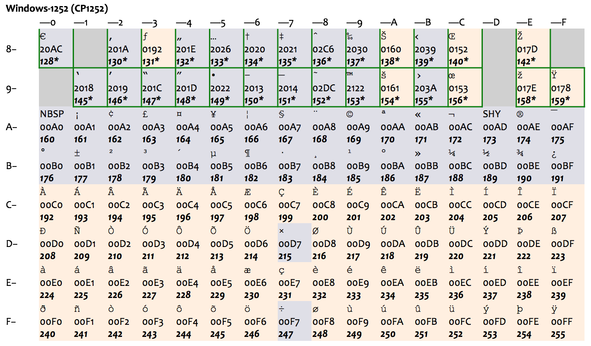
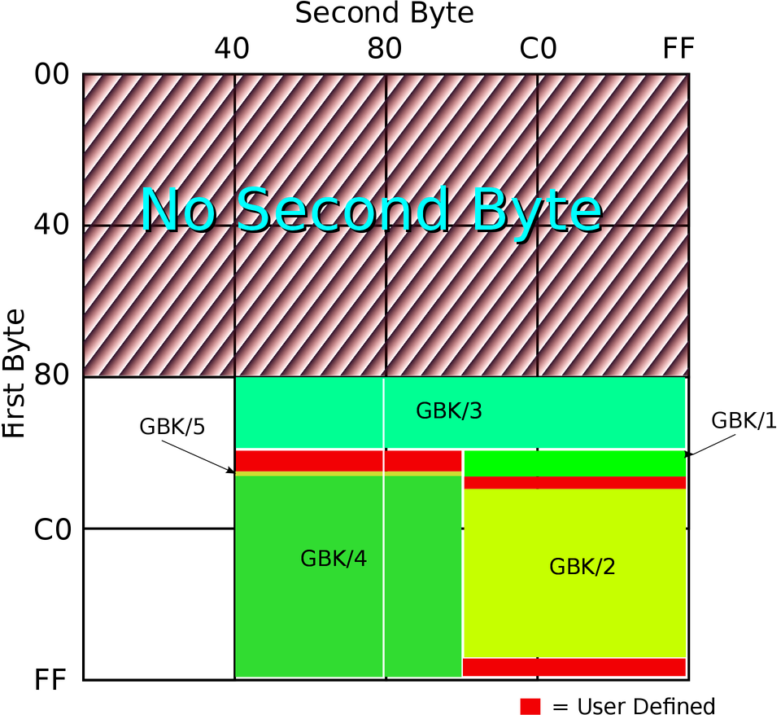

# Unicode：进入多文字支持的世界

你好，我是吴咏炜。

这一讲我们来讲一个新话题，Unicode。我们会从编码的历史谈起，讨论编程中对中文和多语言的支持，然后重点看一下 C++ 中应该如何处理这些问题。

## 一些历史 

ASCII **[1]** 是一种创立于 1963 年的 7 位编码，用 0 到 127 之间的数值来代表最常用的字符，包含了控制字符（很多在今天已不再使用）、数字、大小写拉丁字母、空格和基本标点。它在编码上具有简单性，字母和数字的编码位置非常容易记忆（相比之下，设计 EBCDIC **[2]** 的人感觉是脑子进了水，哦不，进了穿孔卡片了；难怪它和 IBM 的那些过时老古董一起已经几乎被人遗忘）。时至今日，ASCII 可以看作是字符编码的基础，主要的编码方式都保持着与 ASCII 的兼容性。


ASCII 里只有基本的拉丁字母，它既没有带变音符的拉丁字母（如 é 和 ä ），也不支持像希腊字母（如 α、β、γ）、西里尔字母（如 Пушкин）这样的其他欧洲文字（也难怪，毕竟它是 American Standard Code for Information Interchange）。很多其他编码方式纷纷应运而生，包括 ISO 646 系列、ISO/IEC 8859 系列等等；大部分编码方式都是头 128 个字符与 ASCII 兼容，后 128 个字符是自己的扩展，总共最多是 256 个字符。每次只有一套方式可以生效，称之为一个代码页（code page）。这种做法，只能适用于文字相近、且字符数不多的国家。比如，下图表示了 ISO-8859-1（也称作 Latin-1）和后面的 Windows 扩展代码页 1252（下图中绿框部分为 Windows 的扩展），就只能适用于西欧国家。



最早的中文字符集标准是 1980 年的国标 GB2312 **[3]**，其中收录了 6763 个常用汉字和 682 个其他符号。我们平时会用到编码 GB2312，其实更正确的名字是 EUC-CN **[4]**，它是一种与 ASCII 兼容的编码方式。它用单字节表示 ASCII 字符而用双字节表示 GB2312 中的字符；由于 GB2312 中本身也含有 ASCII 中包含的字符，在使用中逐渐就形成了“半角”和“全角”的区别。

国标字符集后面又有扩展，这个扩展后的字符集就是 GBK **[5]**，是中文版 Windows 使用的标准编码方式。GB2312 和 GBK 所占用的编码位置可以参看下面的图（由 John M. Długosz 为 Wikipedia 绘制）：



图中 GBK/1 和 GBK/2 为 GB2312 中已经定义的区域，其他的则是后面添加的字符，总共定义了两万多个编码点，支持了绝大部分现代汉语中还在使用的字。

Unicode **[6]** 作为一种统一编码的努力，诞生于八十年代末九十年代初，标准的第一版出版于 1991—1992 年。由于最初发明者的目标放得太低，只期望对活跃使用中的现代文字进行编码，他们认为 16 比特的“宽 ASCII”就够用了。这就导致了早期采纳 Unicode 的组织，特别是微软，在其操作系统和工具链中广泛采用了 16 比特的编码方式。在今天，微软的系统中宽字符类型 wchar_t 仍然是 16 位的，操作系统底层接口大量使用 16 位字符编码的 API，说到 Unicode 编码时仍然指的是 16 位的编码 UTF-16（这一不太正确的名字，跟中文 GBK 编码居然可以被叫做 ANSI 相比，实在是小巫见大巫了）。在微软以外的世界，Unicode 本身不作编码名称用，并且最主流的编码方式并不是 UTF-16，而是和 ASCII 全兼容的 UTF-8。

早期 Unicode 组织的另一个决定是不同语言里的同一个字符使用同一个编码点，来减少总编码点的数量。中日韩三国使用的汉字就这么被统一了：像“将”、“径”、“网”等字，每个字在 Unicode 中只占一个编码点。这对网页的字体选择也造成了不少麻烦，时至今日我们仍然可以看到这个问题 **[10]**。不过这和我们的主题无关，就不再多费笔墨了。

## Unicode 简介 

Unicode 在今天已经大大超出了最初的目标。到 Unicode 12.1 为止，Unicode 已经包含了 137,994 个字符，囊括所有主要语言（使用中的和已经不再使用的），并包含了表情符号、数学符号等各种特殊字符。仍然要指出一下，Unicode 字符是根据含义来区分的，而非根据字形。除了前面提到过中日韩汉字没有分开，像斜体（italics）、小大写字母（small caps）等排版效果在 Unicode 里也没有独立的对应。不过，因为 Unicode 里包含了很多数学、物理等自然科学中使用的特殊符号，某些情况下你也可以找到对应的符号，可以用在聊天中耍酷，如 𝒷𝒶𝒹（但不适合严肃的排版）。

Unicode 的编码点是从 0x0 到 0x10FFFF，一共 1,114,112 个位置。一般用“U+”后面跟 16 进制的数值来表示一个 Unicode 字符，如 U+0020 表示空格，U+6C49 表示“汉”，U+1F600 表示“😀”，等等（不足四位的一般写四位）。

Unicode 字符的常见编码方式有：

- UTF-32 **[7]**：32 比特，是编码点的直接映射。

- UTF-16 **[8]**：对于从 U+0000 到 U+FFFF 的字符，使用 16 比特的直接映射；对于大于 U+FFFF 的字符，使用 32 比特的特殊映射关系——在 Unicode 的 16 比特编码点中 0xD800–0xDFFF 是一段空隙，使得这种变长编码成为可能。在一个 UTF-16 的序列中，如果看到内容是 0xD800–0xDBFF，那这就是 32 比特编码的前 16 比特；如果看到内容是 0xDC00–0xDFFF，那这是 32 比特编码的后 16 比特；如果内容在 0xD800–0xDFFF 之外，那就是一个 16 比特的映射。

- UTF-8 **[9]**：1 到 4 字节的变长编码。在一个合法的 UTF-8 的序列中，如果看到一个字节的最高位是 0，那就是一个单字节的 Unicode 字符；如果一个字节的最高两比特是 10，那这是一个 Unicode 字符在编码后的后续字节；否则，这就是一个 Unicode 字符在编码后的首字节，且最高位开始连续 1 的个数表示了这个字符按 UTF-8 的方式编码有几个字节。

在上面三种编码方式里，只有 UTF-8 完全保持了和 ASCII 的兼容性，目前得到了最广泛的使用。在我们下面讲具体编码方式之前，我们先看一下上面提到的三个字符在这三种方式下的编码结果：

- UTF-32：U+0020 映射为 0x00000020，U+6C49 映射为 0x00006C49，U+1F600 映射为 0x0001F600。

- UTF-16：U+0020 映射为 0x0020，U+6C49 映射为 0x6C49，而 U+1F600 会映射为 0xD83D DE00。

- UTF-8：U+0020 映射为 0x20，U+6C49 映射为 0xE6 B1 89，而 U+1F600 会映射为 0xF0 9F 98 80。

Unicode 有好几种（上面还不是全部）不同的编码方式，上面的 16 比特和 32 比特编码方式还有小头党和大头党之争（“汉”按字节读取时是 6C 49 呢，还是 49 6C？）；同时，任何一种编码方式还需要跟传统的编码方式容易区分。因此，Unicode 文本文件通常有一个使用 BOM（byte order mark）字符的约定，即字符 U+FEFF **[11]**。由于 Unicode 不使用 U+FFFE，在文件开头加一个 BOM 即可区分各种不同编码：

- 如果文件开头是 0x00 00 FE FF，那这是大头在前的 UTF-32 编码；

- 否则如果文件开头是 0xFF FE 00 00，那这是小头在前的 UTF-32 编码；

- 否则如果文件开头是 0xFE FF，那这是大头在前的 UTF-16 编码；

- 否则如果文件开头是 0xFF FE，那这是小头在前的 UTF-16 编码（注意，这条规则和第二条的顺序不能相反）；

- 否则如果文件开头是 0xEF BB BF，那这是 UTF-8 编码；

- 否则，编码方式使用其他算法来确定。

编辑器可以（有些在配置之后）根据 BOM 字符来自动决定文本文件的编码。比如，我一般在 Vim 中配置 **set fileencodings=ucs-bom,utf-8,gbk,latin1**。这样，Vim 在读入文件时，会首先检查 BOM 字符，有 BOM 字符按 BOM 字符决定文件编码；否则，试图将文件按 UTF-8 来解码（由于 UTF-8 有格式要求，非 UTF-8 编码的文件通常会导致失败）；不行，则试图按 GBK 来解码（失败的概率就很低了）；还不行，就把文件当作 Latin1 来处理（永远不会失败）。

在 UTF-8 编码下使用 BOM 字符并非必需，尤其在 Unix 上。但 Windows 上通常会使用 BOM 字符，以方便区分 UTF-8 和传统编码。

## C++ 中的 Unicode 字符类型 

C++98 中有 **char** 和 **wchar_t** 两种不同的字符类型，其中 **char** 的长度是单字节，而 **wchar_t** 的长度不确定。在 Windows 上它是双字节，只能代表 UTF-16，而在 Unix 上一般是四字节，可以代表 UTF-32。为了解决这种混乱，目前我们有了下面的改进：

- C++11 引入了 **char16_t** 和 **char32_t** 两个独立的字符类型（不是类型别名），分别代表 UTF-16 和 UTF-32。

- C++20 将引入 **char8_t** 类型，进一步区分了可能使用传统编码的窄字符类型和 UTF-8 字符类型。

- 除了 **string** 和 **wstring**，我们也相应地有了 **u16string**、**u32string**（和将来的 **u8string**）。

- 除了传统的窄字符 / 字符串字面量（如 **"hi"**）和宽字符 / 字符串字面量（如 **L"hi"**），引入了新的 UTF-8、UTF-16 和 UTF-32 字面量，分别形如 **u8"hi"**、**u"hi"** 和 **U"hi"**。

- 为了确保非 ASCII 字符在源代码中可以简单地输入，引入了新的 Unicode 换码序列。比如，我们前面说到的三个字符可以这样表达成一个 UTF-32 字符串字面量：**U" \u6C49\U0001F600"**。要生成 UTF-16 或 UTF-8 字符串字面量只需要更改前缀即可。

使用这些新的字符（串）类型，我们可以用下面的代码表达出 UTF-32 和其他两种 UTF 编码间是如何转换的：

```cpp
#include <iomanip>
#include <iostream>
#include <stdexcept>
#include <string>

using namespace std;

const char32_t unicode_max =
  0x10FFFF;

void to_utf_16(char32_t ch,
               u16string& result)
{
  if (ch > unicode_max) {
    throw runtime_error(
      "invalid code point");
  }
  if (ch < 0x10000) {
    result += char16_t(ch);
  } else {
    char16_t first =
      0xD800 |
      ((ch - 0x10000) >> 10);
    char16_t second =
      0xDC00 | (ch & 0x3FF);
    result += first;
    result += second;
  }
}

void to_utf_8(char32_t ch,
              string& result)
{
  if (ch > unicode_max) {
    throw runtime_error(
      "invalid code point");
  }
  if (ch < 0x80) {
    result += ch;
  } else if (ch < 0x800) {
    result += 0xC0 | (ch >> 6);
    result += 0x80 | (ch & 0x3F);
  } else if (ch < 0x10000) {
    result += 0xE0 | (ch >> 12);
    result +=
      0x80 | ((ch >> 6) & 0x3F);
    result += 0x80 | (ch & 0x3F);
  } else {
    result += 0xF0 | (ch >> 18);
    result +=
      0x80 | ((ch >> 12) & 0x3F);
    result +=
      0x80 | ((ch >> 6) & 0x3F);
    result += 0x80 | (ch & 0x3F);
  }
}

int main()
{
  char32_t str[] =
    U" \u6C49\U0001F600";
  u16string u16str;
  string u8str;
  for (auto ch : str) {
    if (ch == 0) {
      break;
    }
    to_utf_16(ch, u16str);
    to_utf_8(ch, u8str);
  }
  cout << hex << setfill('0');
  for (char16_t ch : u16str) {
    cout << setw(4) << unsigned(ch)
         << ' ';
  }
  cout << endl;
  for (unsigned char ch : u8str) {
    cout << setw(2) << unsigned(ch)
         << ' ';
  }
  cout << endl;
}
```

输出结果是：

> 0020 6c49 d83d de00
> 
> 20 e6 b1 89 f0 9f 98 80
> 


## 平台区别 

下面我们看一下在两个主流的平台上一般是如何处理 Unicode 编码问题的。

### Unix 

现代 Unix 系统，包括 Linux 和 macOS 在内，已经全面转向了 UTF-8。这样的系统中一般直接使用 **char[]** 和 **string** 来代表 UTF-8 字符串，包括输入、输出和文件名，非常简单。不过，由于一个字符单位不能代表一个完整的 Unicode 字符，在需要真正进行文字处理的场合转换到 UTF-32 往往会更简单。在以前及需要和 C 兼容的场合，会使用 **wchar_t**、**uint32_t** 或某个等价的类型别名；在新的纯 C++ 代码里，就没有理由不使用 **char32_t** 和 **u32string** 了。

Unix 下输出宽字符串需要使用 **wcout**（这点和 Windows 相同），并且需要进行区域设置，通常使用 **setlocale(LC_ALL, "en_US.UTF-8");** 即足够。由于没有什么额外好处，Unix 平台下一般只用 **cout**，不用 **wcout**。

### Windows 

Windows 由于历史原因和保留向后兼容性的需要（Windows 为了向后兼容性已经到了大规模放弃优雅的程度了），一直用 **char** 表示传统编码（如，英文 Windows 上是 Windows-1252，简体中文 Windows 上是 GBK），用 **wchar_t** 表示 UTF-16。由于传统编码一次只有一种、且需要重启才能生效，要得到好的多语言支持，在和操作系统交互时必须使用 UTF-16。

对于纯 Windows 编程，全面使用宽字符（串）是最简单的处理方式。当然，源代码和文本很少用 UTF-16 存储，通常还是 UTF-8（除非是纯 ASCII，否则需要加入 BOM 字符来和传统编码相区分）。这时可能会有一个小小的令人惊讶的地方：微软的编译器会把源代码里窄字符串字面量中的非 ASCII 字符转换成传统编码。换句话说，同样的源代码在不同编码的 Windows 下编译可能会产生不同的结果！如果你希望保留 UTF-8 序列的话，就应该使用 UTF-8 字面量（并在将来使用 **char8_t** 字符类型）。

```cpp
#include <stdio.h>

template <typename T>
void dump(const T& str)
{
  for (char ch : str) {
    printf(
      "%.2x ",
      static_cast<unsigned char>(ch));
  }
  putchar('\n');
}

int main()
{
  char str[] = "你好";
  char u8str[] = u8"你好";
  dump(str);
  dump(u8str);
}
```

下面展示的是以上代码在 Windows 下系统传统编码设置为简体中文时的编译、运行结果：

> c4 e3 ba c3 00
> 
> e4 bd a0 e5 a5 bd 00
> 


Windows 下的 **wcout** 主要用在配合宽字符的输出，此外没什么大用处。原因一样，只有进行了正确的区域设置，才能输出含非 ASCII 字符的宽字符串。如果要输出中文，得写 **setlocale(LC_ALL, "Chinese_China.936");**，这显然就让“统一码”输出失去意义了。

由于窄字符在大部分 Windows 系统上只支持传统编码，要打开一个当前编码不支持的文件名称，就必需使用宽字符的文件名。微软的 **fstream** 系列类及其 **open** 成员函数都支持 **const wchar_t*** 类型的文件名，这是 C++ 标准里所没有的。

### 统一化处理 

要想写出跨平台的处理字符串的代码，我们一般考虑两种方式之一：

- 源代码级兼容，但内码不同

- 源代码和内码都完全兼容

微软推荐的方式一般是前者。做 Windows 开发的人很多都知道 tchar.h 和 **_T** 宏，它们就起着类似的作用（虽然目的不同）。根据预定义宏的不同，系统会在同一套代码下选择不同的编码方式及对应的函数。拿一个最小的例子来说：

```cpp
#include <stdio.h>
#include <tchar.h>

int _tmain(int argc, TCHAR* argv[])
{
  _putts(_T("Hello world!\n"));
}
```

如果用缺省的命令行参数进行编译，上面的代码相当于：

```cpp
#include <stdio.h>

int main(int argc, char* argv[])
{
  puts("Hello world!\n");
}
```

而如果在命令行上加上了 **/D_UNICODE**，那代码则相当于：

```cpp
#include <stdio.h>

int wmain(int argc, wchar_t* argv[])
{
  _putws(L"Hello world!\n");
}
```

当然，这个代码还是只能在 Windows 上用，并且仍然不漂亮（所有的字符和字符串字面量都得套上 **_T**）。后者无解，前者则可以找到替代方案（甚至自己写也不复杂）。C++ REST SDK 中就提供了类似的封装，可以跨平台地开发网络应用。但可以说，这种方式是一种主要照顾 Windows 的开发方式。

相应的，对 Unix 开发者而言更自然的方式是全面使用 UTF-8，仅在跟操作系统、文件系统打交道时把字符串转换成需要的编码。利用临时对象的生命周期，我们可以像下面这样写帮助函数和宏。

utf8_to_native.hpp：

```cpp
#ifndef UTF8_TO_NATIVE_HPP
#define UTF8_TO_NATIVE_HPP

#include <string>

#if defined(_WIN32) || \
    defined(_UNICODE)

std::wstring utf8_to_wstring(
  const char* str);
std::wstring utf8_to_wstring(
  const std::string& str);

#define NATIVE_STR(s) \
  utf8_to_wstring(s).c_str()

#else

inline const char*
to_c_str(const char* str)
{
  return str;
}

inline const char*
to_c_str(const std::string& str)
{
  return str.c_str();
}

#define NATIVE_STR(s) \
  to_c_str(s)

#endif

#endif // UTF8_TO_NATIVE_HPP
```

utf8_to_native.cpp：

```cpp
#include "utf8_to_native.hpp"

#if defined(_WIN32) || \
    defined(_UNICODE)
#include <windows.h>
#include <system_error>

namespace {

void throw_system_error(
  const char* reason)
{
  std::string msg(reason);
  msg += " failed";
  std::error_code ec(
    GetLastError(),
    std::system_category());
  throw std::system_error(ec, msg);
}

} /* unnamed namespace */

std::wstring utf8_to_wstring(
  const char* str)
{
  int len = MultiByteToWideChar(
    CP_UTF8, 0, str, -1,
    nullptr, 0);
  if (len == 0) {
    throw_system_error(
      "utf8_to_wstring");
  }
  std::wstring result(len - 1,
                      L'\0');
  if (MultiByteToWideChar(
        CP_UTF8, 0, str, -1,
        result.data(), len) == 0) {
    throw_system_error(
      "utf8_to_wstring");
  }
  return result;
}

std::wstring utf8_to_wstring(
  const std::string& str)
{
  return utf8_to_wstring(
    str.c_str());
}

#endif
```

在头文件里，定义了在 Windows 下会做 UTF-8 到 UTF-16 的转换；在其他环境下则不真正做转换，而是不管提供的是字符指针还是 **string** 都会转换成字符指针。在 Windows 下每次调用 **NATIVE_STR** 会生成一个临时对象，当前语句执行结束后这个临时对象会自动销毁。

使用该功能的代码是这样的：

```cpp
#include <fstream>
#include "utf8_to_native.hpp"

int main()
{
  using namespace std;
  const char filename[] =
    u8"测试.txt";
  ifstream ifs(
    NATIVE_STR(filename));
  //  对  ifs  进行操作
｝
```

上面这样的代码可以同时适用于现代 Unix 和现代 Windows（任何语言设置下），用来读取名为“测试.txt”的文件。

## 编程支持 

结束之前，我们快速介绍一下其他的一些支持 Unicode 及其转换的 API。

### Windows API 

上一节的代码在 Windows 下用到了 **MultiByteToWideChar** **[12]**，从某个编码转到 UTF-16。Windows 也提供了反向的 **WideCharToMultiByte** **[13]**，从 UTF-16 转到某个编码。从上面可以看到，C 接口用起来并不方便，可以考虑自己封装一下。

### iconv 

Unix 下最常用的底层编码转换接口是 iconv **[14]**，提供 **iconv_open**、**iconv_close** 和 **iconv** 三个函数。这同样是 C 接口，实践中应该封装一下。

### ICU4C 

ICU **[15]** 是一个完整的 Unicode 支持库，提供大量的方法，ICU4C 是其 C/C++ 的版本。ICU 有专门的字符串类型，内码是 UTF-16，但可以直接用于 IO streams 的输出。下面的程序应该在所有平台上都有同样的输出（但在 Windows 上要求当前系统传统编码能支持待输出的字符）：

```cpp
#include <iostream>
#include <string>
#include <unicode/unistr.h>
#include <unicode/ustream.h>

using namespace std;
using icu::UnicodeString;

int main()
{
  auto str = UnicodeString::fromUTF8(
    u8"你好");
  cout << str << endl;
  string u8str;
  str.toUTF8String(u8str);
  cout << "In UTF-8 it is "
       << u8str.size() << " bytes"
       << endl;
}
```

### codecvt 

C++11 曾经引入了一个头文件 &lt;codecvt&gt; **[16]** 用作 UTF 编码间的转换，但很遗憾，那个头文件目前已因为存在安全性和易用性问题被宣告放弃（deprecated）**[17]**。&lt;locale&gt; 中有另外一个 **codecvt** 模板 **[18]**，本身接口不那么好用，而且到 C++20 还会发生变化，这儿也不详细介绍了。有兴趣的话可以直接看参考资料。

## 内容小结 

本讲我们讨论了 Unicode，以及 C++ 中对 Unicode 的支持。我们也讨论了在两大主流桌面平台上关于 Unicode 编码支持的一些惯用法。希望你在本讲之后，能清楚地知道 Unicode 和各种 UTF 编码是怎么回事。

## 课后思考 

请思考一下：

1. 为什么说 UTF-32 处理会比较简单？

2. 你知道什么情况下 UTF-32 也并不那么简单吗？

3. 哪种 UTF 编码方式空间存储效率比较高？

欢迎留言一起讨论一下。

## <span data-slate-string="true">参考资料</span> 

**[1] Wikipedia, “ASCII”.**[https://en.wikipedia.org/wiki/ASCII](https://en.wikipedia.org/wiki/ASCII)

**[2] Wikipedia, “EBCDIC”.**[https://en.wikipedia.org/wiki/EBCDIC](https://en.wikipedia.org/wiki/EBCDIC)

**[3] Wikipedia, “GB 2312”.**[https://en.wikipedia.org/wiki/GB_2312](https://en.wikipedia.org/wiki/GB_2312)

**[3a] 维基百科, “GB 2312”.**[https://zh.wikipedia.org/zh-cn/GB_2312](https://zh.wikipedia.org/zh-cn/GB_2312)

**[4] Wikipedia, “EUC-CN”.**[https://en.wikipedia.org/wiki/Extended_Unix_Code#EUC-CN](https://en.wikipedia.org/wiki/Extended_Unix_Code#EUC-CN)

**[4a] 维基百科, “EUC-CN”.**[https://zh.wikipedia.org/zh-cn/EUC#EUC-CN](https://zh.wikipedia.org/zh-cn/EUC#EUC-CN)

**[5] Wikipedia, “GBK”.**[https://en.wikipedia.org/wiki/GBK_(character_encoding)](https://en.wikipedia.org/wiki/GBK_(character_encoding))

**[5a] 维基百科, “汉字内码扩展规范”.**[https://zh.wikipedia.org/zh-cn/ 汉字内码扩展规范](https://zh.wikipedia.org/zh-cn/ 汉字内码扩展规范)

**[6] Wikipedia, “Unicode”.**[https://en.wikipedia.org/wiki/Unicode](https://en.wikipedia.org/wiki/Unicode)

**[6a] 维基百科, “Unicode”.**[https://zh.wikipedia.org/zh-cn/Unicode](https://zh.wikipedia.org/zh-cn/Unicode)

**[7] Wikipedia, “UTF-32”.**[https://en.wikipedia.org/wiki/UTF-32](https://en.wikipedia.org/wiki/UTF-32)

**[8] Wikipedia, “UTF-16”.**[https://en.wikipedia.org/wiki/UTF-16](https://en.wikipedia.org/wiki/UTF-16)

**[9] Wikipedia, “UTF-8”.**[https://en.wikipedia.org/wiki/UTF-8](https://en.wikipedia.org/wiki/UTF-8)

**[10] 吴咏炜, “Specify LANG in a UTF-8 web page”.**[http://wyw.dcweb.cn/lang_utf8.htm](http://wyw.dcweb.cn/lang_utf8.htm)

**[11] Wikipedia, “Byte order mark”.**[https://en.wikipedia.org/wiki/Byte_order_mark](https://en.wikipedia.org/wiki/Byte_order_mark)

**[11a] 维基百科, “字节顺序标记”.**[https://zh.wikipedia.org/zh-cn/ 位元組順序記號](https://zh.wikipedia.org/zh-cn/ 位元組順序記號)

**[12] Microsoft, “MultiByteToWideChar function”.**[https://docs.microsoft.com/en-us/windows/win32/api/stringapiset/nf-stringapiset-multibytetowidechar](https://docs.microsoft.com/en-us/windows/win32/api/stringapiset/nf-stringapiset-multibytetowidechar)

**[13] Microsoft, “WideCharToMultiByte function”.**[https://docs.microsoft.com/en-us/windows/win32/api/stringapiset/nf-stringapiset-widechartomultibyte](https://docs.microsoft.com/en-us/windows/win32/api/stringapiset/nf-stringapiset-widechartomultibyte)

**[14] Wikipedia, “iconv”.**[https://en.wikipedia.org/wiki/Iconv](https://en.wikipedia.org/wiki/Iconv)

**[15] ICU Technical Committee, ICU—International Components for Unicode.**[http://site.icu-project.org/](http://site.icu-project.org/)

**[16] cppreference.com, “Standard library header &lt;codecvt&gt;”.**[https://en.cppreference.com/w/cpp/header/codecvt](https://en.cppreference.com/w/cpp/header/codecvt)

**[17] Alisdair Meredith, “Deprecating &lt;codecvt&gt;”.**[http://www.open-std.org/jtc1/sc22/wg21/docs/papers/2017/p0618r0.html](http://www.open-std.org/jtc1/sc22/wg21/docs/papers/2017/p0618r0.html)

**[18] cppreference.com, “std::codecvt”.**[https://en.cppreference.com/w/cpp/locale/codecvt](https://en.cppreference.com/w/cpp/locale/codecvt)

