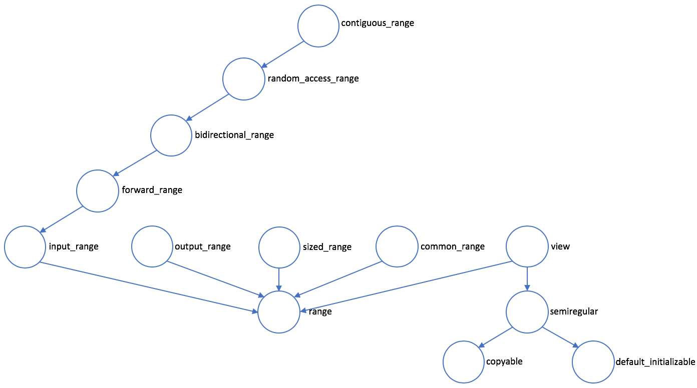
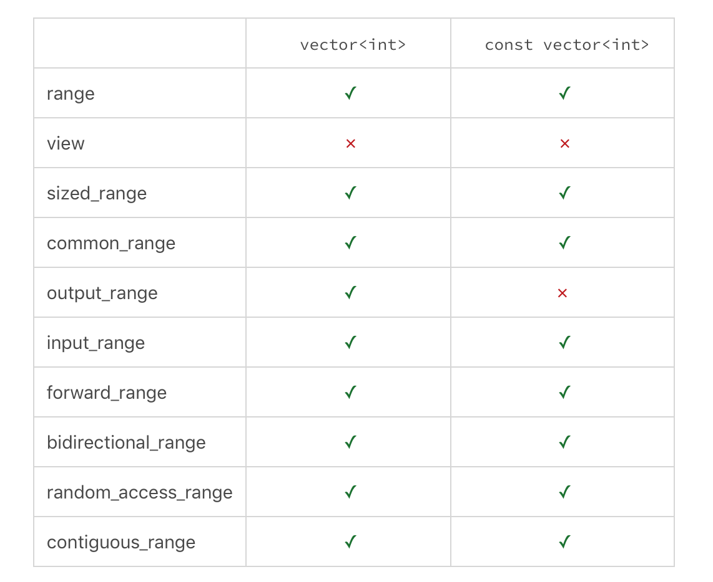
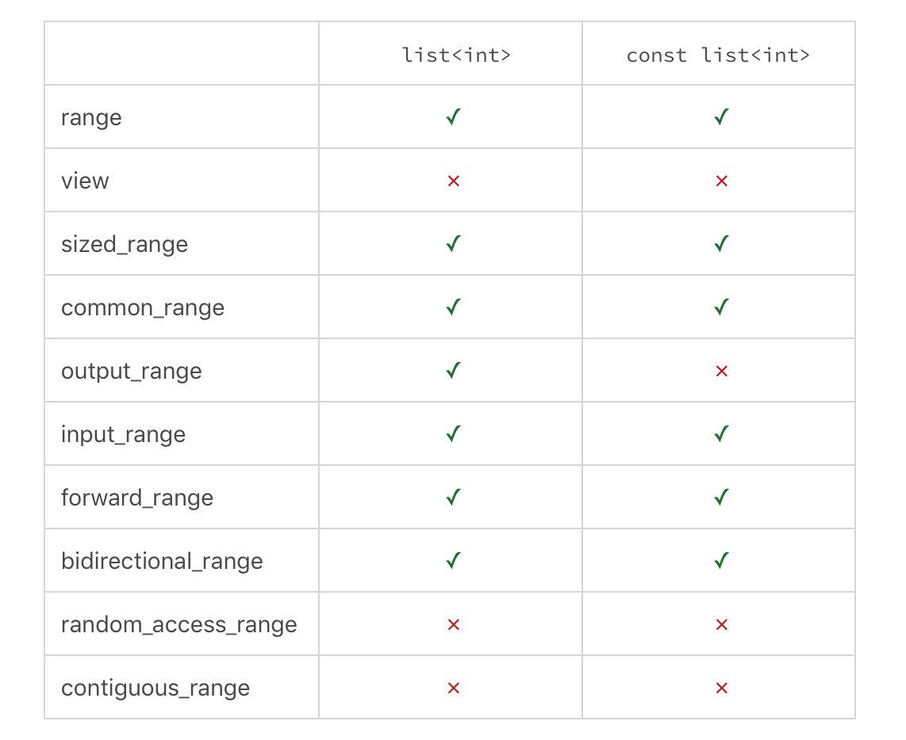
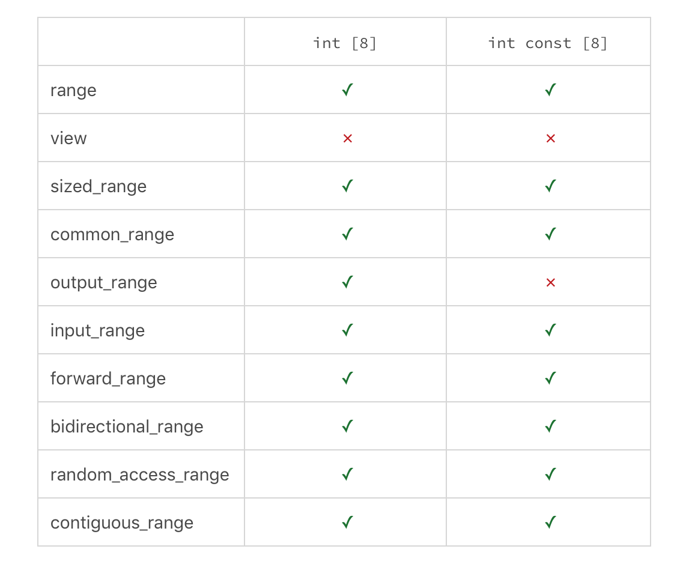
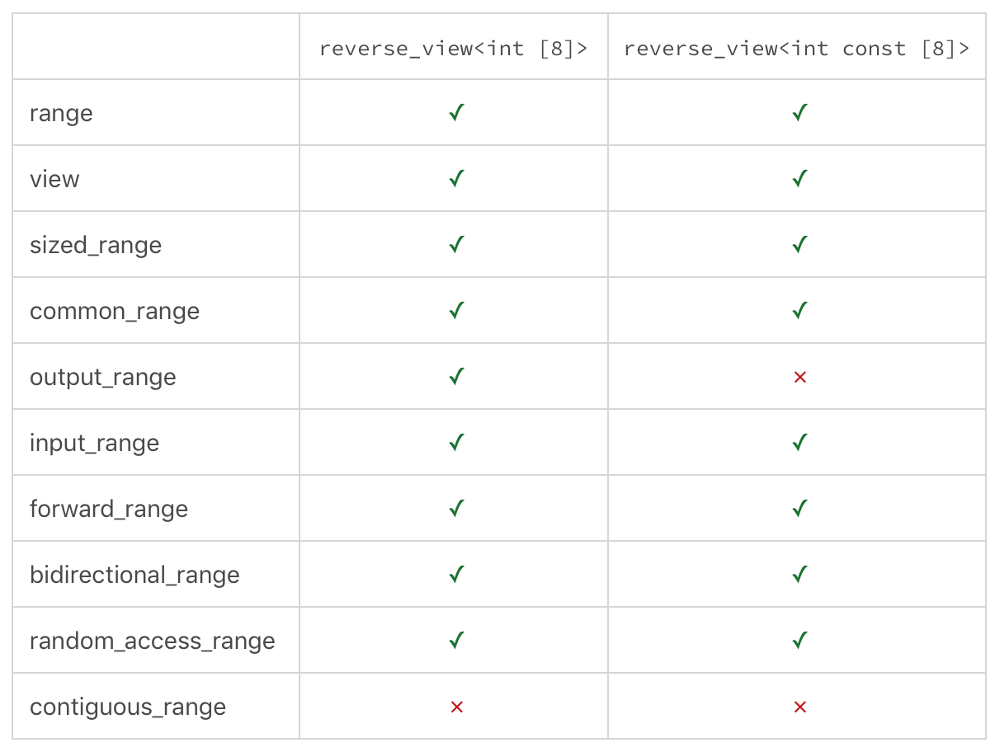
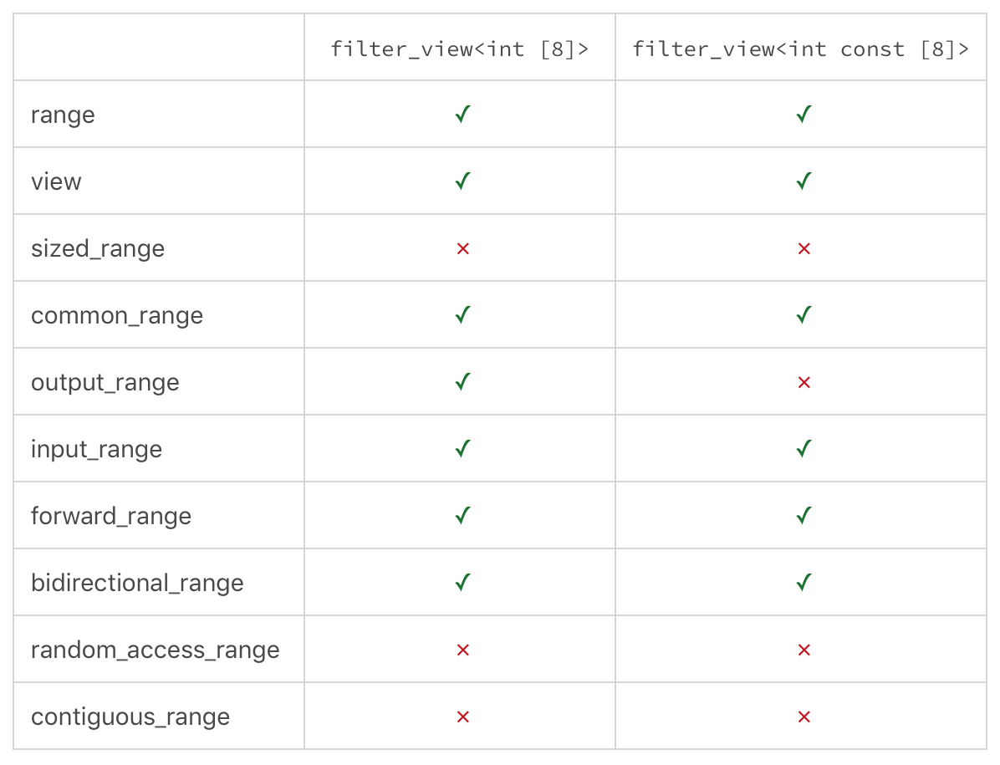
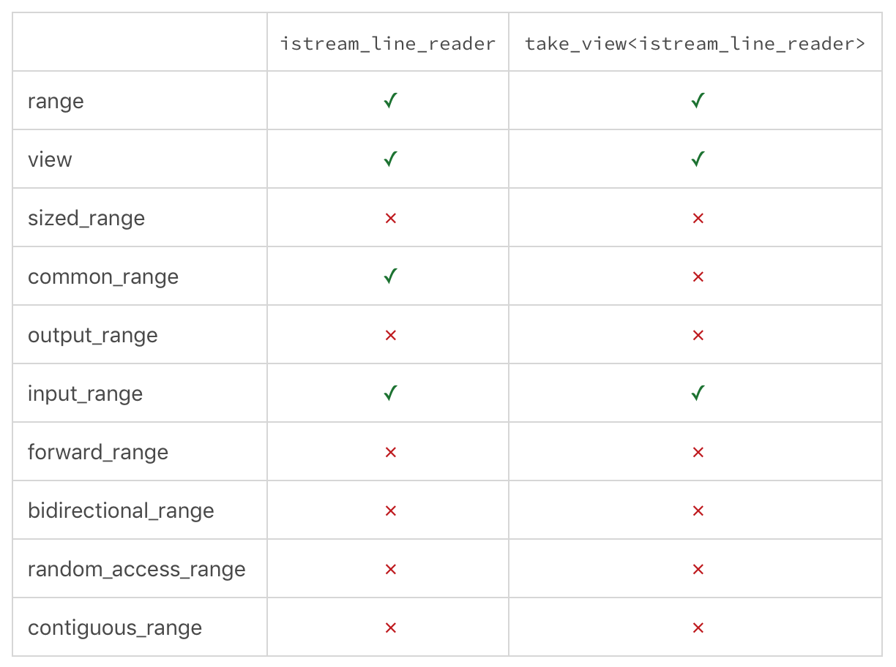
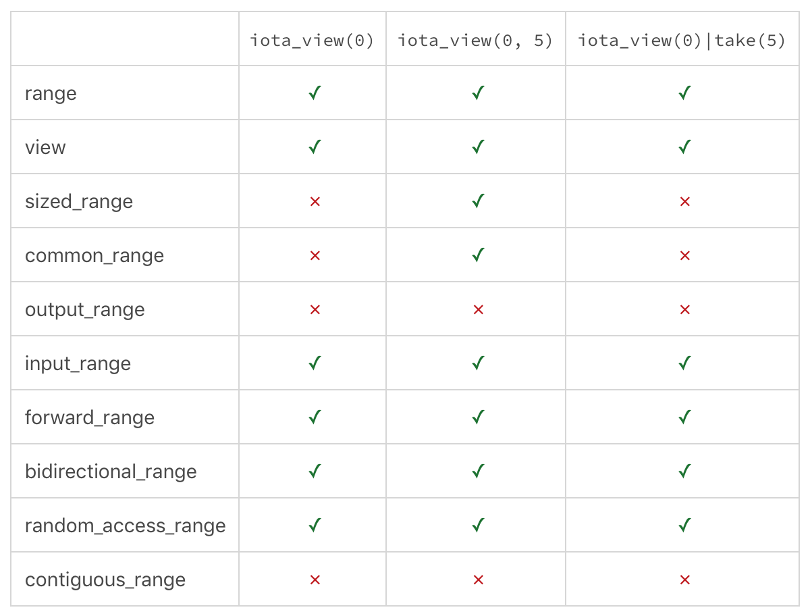
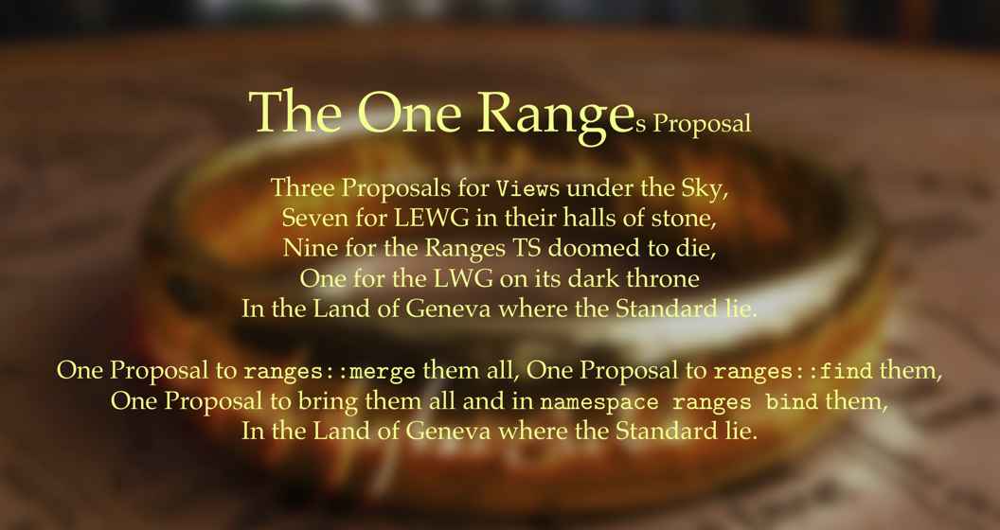

# Ranges：无迭代器的迭代和更方便的组合

你好，我是吴咏炜。

今天，我们继续上一讲开始的话题，讨论 ranges（范围）。

## Ranges 简介 

像下面这样的代码：

```cpp
#include <algorithm>
#include <iostream>
#include <iterator>

int main()
{
  using namespace std;
  int a[] = {1, 7, 3, 6,
             5, 2, 4, 8};
  copy(begin(a), end(a),
       ostream_iterator<int>(
         std::cout, " "));
  std::cout << std::endl;
  sort(begin(a), end(a));
  copy(begin(a), end(a),
       ostream_iterator<int>(
         std::cout, " "));
  std::cout << std::endl;
}
```

你应该已经见到过好多次了。有没有觉得这个代码有点重复、有点无聊呢？尤其是里面的 **begin** 和 **end**？

很多人都留意到了迭代器虽然灵活，但不是一个足够高级的抽象——尤其是我们已经对 C 数组都可以进行基于“范围”的循环之后。如果我们把数组看作一个抽象的“范围”，我们就可以得到下面的代码：

```cpp
#include <experimental/ranges/algorithm>
#include <experimental/ranges/iterator>
#include <iostream>

int main()
{
  using namespace std::
    experimental::ranges;
  int a[] = {1, 7, 3, 6,
             5, 2, 4, 8};
  copy(a, ostream_iterator<int>(
            std::cout, " "));
  std::cout << std::endl;
  sort(a);
  copy(a, ostream_iterator<int>(
            std::cout, " "));
  std::cout << std::endl;
}
```

这是真正可以编译的代码，用我们上一讲讲过的环境——最新版的 MSVC（编译命令行上需要额外加 **/permissive-** 选项）或 GCC 7+——都可以。不过，这一次即使最新版的 MSVC 也不能靠编译器本身支持 ranges 库的所有特性了：在两种环境下我们都必须使用 CMCSTL2 **[1]**，也只能（在 C++20 之前临时）使用 `std::experimental::ranges` 而不是 **std::ranges**。注意我只引入了 **ranges** 名空间，而没有引入 **std** 名空间，这是因为 **copy**、**sort** 等名称同时出现在了这两个名空间里，同时引入两个名空间会在使用 **sort** 等名字时导致冲突。

这个程序的输出，当然是毫不意外的：

> 1 7 3 6 5 2 4 8
> 
> 1 2 3 4 5 6 7 8
> 


下面我们看“视图”。比如下面的代码展示了一个反转的视图：

```cpp
#include <experimental/ranges/algorithm>
#include <experimental/ranges/iterator>
#include <experimental/ranges/ranges>
#include <iostream>

int main()
{
  using namespace std::
    experimental::ranges;
  int a[] = {1, 7, 3, 6,
             5, 2, 4, 8};
  copy(a, ostream_iterator<int>(
            std::cout, " "));
  std::cout << std::endl;
  auto r = reverse_view(a);
  copy(r, ostream_iterator<int>(
            std::cout, " "));
  std::cout << std::endl;
}
```

这个程序的输出是：

> 1 7 3 6 5 2 4 8
> 
> 8 4 2 5 6 3 7 1
> 


为什么 **r** 是视图，而不是反向复制出的内容？我们可以在输出 **r** 之前（15 行之后，16 行之前）插入下面这行：

```null
  a[0] = 9;
```

我们可以看到最后那行输出变成了：

> 8 4 2 5 6 3 7 9
> 


这就证明了，**r** 没有复制 **a** 的内容。

视图的大小也不一定跟原先的“范围”一样。下面是我们在 [[第 17 讲]]([第 17 讲]) 讨论过的过滤视图在 ranges 里的实现的用法：

```cpp
  auto r =
    filter_view(a, [](int i) {
      return i % 2 == 0;
    });
```

拿这个来替换上面用到 **reverse_view** 的那行，我们就能得到：

> 6 2 4 8
> 


这些视图还能进行组合：我们可以写 **reverse_view(filter_view(…))**。不过，在组合的情况下，下面这样的写法（使用 **|** 和视图适配器）可能更清晰些：

```cpp
  auto r = a |
           views::filter([](int i) {
             return i % 2 == 0;
           }) |
           views::reverse;
```

这个程序的执行结果是：

> 8 4 2 6
> 


如果你用过 Unix 的管道符，你一定会觉得这种写法非常自然、容易组合吧……

## 范围相关的概念 

整个 ranges 库是基于概念来定义的。下面这张图展示了 range 相关的概念：



从图的右下角，我们可以看到上一讲讨论过的几个概念，包括 copyable 和 semiregular。再往上，我们看到了 view——视图——也看到了视图是一个 range。现在我们就先来看一下 range 和 view 的定义。

在 CMCSTL2 里，range 是这样定义的：

```cpp
template <class T>
concept _RangeImpl =
  requires(T&& t) {
    begin(static_cast<T&&>(t));
    end(static_cast<T&&>(t));
  };

template<class T>
concept range = _RangeImpl<T&>;
```

换句话说，一个 range 允许执行 **begin** 和 **end** 操作（注意这是在 **ranges** 名空间下的 **begin** 和 **end**，和 **std** 下的有些小区别）。所以，一个数组，一个容器，通常也能当作一个 range。

我们已经提到了视图，我们接下来就看一下 view 的定义：

```cpp
template <class T>
concept view =
  range<T> &&
  semiregular<T> &&
  enable_view<__uncvref<T>>;
```

可以看到，view 首先是一个 range，其次它是 semiregular，也就是，可以被移动和复制（对 range 没有这个要求）。然后 **enable_view** 是个实现提供的概念，它的实际要求就是，视图应该不是一个容器，可以在 O(1) 复杂度完成拷贝或移动操作。我们常用的 **string** 满足 range，不满足 view；而 **string_view** 则同时满足 range 和 view。

下面，我们看 common_range，它的意思是这是个普通的 range，对其应用 **begin()** 和 **end()**，结果是同一类型：

```cpp
template <class T>
concept common_range =
  range<T> &&
  same_as<iterator_t<T>,
          sentinel_t<T>>;
```

然后，sized_range 的意思就是这个 range 是有大小的，可以取出其大小（注意我们刚才的 **filter_view** 就是没有大小的）：

```cpp
template <class T>
concept sized_range =
  range<T> &&
  requires(T& r) { size(r); };
```

自然，output_range 的意思是这个 range 的迭代器满足输出迭代器的条件：

```cpp
template <class R, class T>
concept output_range =
  range<R> &&
  output_iterator<iterator_t<R>, T>;
```

当然，input_range 的意思是这个 range 的迭代器满足输入迭代器的条件：

```cpp
template <class T>
concept input_range =
  range<T> &&
  input_iterator<iterator_t<T>>;
```

再往上的这些概念，我想我就不用再啰嗦了……

### Sentinel 

我估计其他概念你理解起来应该问题不大，但 common_range 也许会让有些人迷糊：什么样的 range 会**不**是 common_range 呢？

答案是，有些 range 的结束点，不是固定的位置，而是某个条件：如遇到 0，或者某个谓词满足了 10 次之后……从 C++17 开始，基于范围的 for 循环也接受 **begin** 和 **end** 的结果不是同一类型了——我们把前者返回的结果类型叫 iterator（迭代器），而把后者返回的结果类型叫 sentinel（标记）。

下面展示了一个实际的例子：

```cpp
#include <experimental/ranges/algorithm>
#include <experimental/ranges/iterator>
#include <iostream>

using namespace std::experimental::
  ranges;

struct null_sentinel {};

template <input_iterator I>
bool operator==(I i, null_sentinel)
{
  return *i == 0;
}

template <input_iterator I>
bool operator==(null_sentinel, I i)
{
  return *i == 0;
}

template <input_iterator I>
bool operator!=(I i, null_sentinel)
{
  return *i != 0;
}

template <input_iterator I>
bool operator!=(null_sentinel, I i)
{
  return *i != 0;
}

int main(int argc, char* argv[])
{
  if (argc != 2) {
    std::cout << "Please provide "
                 "an argument!"
              << std::endl;
    return 1;
  }
  for_each(argv[1], null_sentinel(),
           [](char ch) {
             std::cout << ch;
           });
  std::cout << std::endl;
}
```

在这个程序里，**null_sentinel** 就是一个“空值标记”。这个类型存在的唯一意义，就是允许 **==** 和 **!=** 根据重载规则做一些特殊的事情：在这里，就是判断当前迭代器指向的位置是否为 0。上面程序的执行结果是把命令行上传入的第一个参数输出到终端上。

## 概念测试 

我们现在对概念来做一下检查，看看常用的一些容器和视图满足哪些 ranges 里的概念。



这张表里没有什么意外的东西。除了 view，**vector&lt;int&gt;** 满足所有的 range 概念。另外，**const vector&lt;int&gt;** 不能满足 output_range，不能往里写内容，也一切正常。



这张表，同样表达了我们已知的事实：**list** 不满足 random_access_range 和 contiguous_range。



这张表，说明了从 range 的角度，C 数组和 **vector** 是没啥区别的。



这张就有点意思了，展示了反转视图的特点。我们可以看到它几乎和原始容器可满足的概念一样，就多了 view，少了 contiguous_range。应该没有让你感到意外的内容吧。



但过滤视图就不一样了：我们不能预知元素的数量，所以它不能满足 sized_range。



我们前面说过，istream_line_reader 的迭代器是输入迭代器，所以它也只能是个 input_range。我们在设计上对 **begin()** 和 **end** 的返回值采用了相同的类型，因此它仍是个 common_range。用 take_view 可以取一个范围的前若干项，它就不是一个 commom_range 了。因为输入可能在到达预定项数之前结束，所以它也不是 sized_range。



我们再来介绍一个新的视图，**iota_view**。它代表一个从某个数开始的递增序列。单参数的 **iota_view** 是无穷序列，双参数的是有限序列，从它们能满足的概念上就能看出来。这儿比较有趣的事实是，虽然 **iota_view(0, 5)** 和 **iota_view(0) | take(5)** 的结果相同，都是序列 {0, 1, 2, 3, 4}，但编译器看起来，前者比后者要多满足两个概念。这应该也不难理解。

## 抽象和性能 

说了这么多，你可能还是有点好奇，那 ranges 的用途是什么呢？为了少写 **begin()** 和 **end()**？为了方便函数式编程？

当然，上面的说法都对，但最基本的目的，还是为了抽象和表达能力。我们可以看一眼下面的 Python 代码：

```python
reduce(lambda x, y: x + y,
       map(lambda x: x * x, range(1, 101)))
```

你应该不难看出，这个表达式做的是 <span class="katex-html" aria-hidden="true"><span class="base"><span class="strut" style="height:0.897438em;vertical-align:-0.08333em;"></span><span class="mord"><span class="mord">1</span><span class="msupsub"><span class="vlist-t"><span class="vlist-r"><span class="vlist" style="height:0.8141079999999999em;"><span style="top:-3.063em;margin-right:0.05em;"><span class="pstrut" style="height:2.7em;"></span><span class="sizing reset-size6 size3 mtight"><span class="mord mtight">2</span></span></span></span></span></span></span></span><span class="mspace" style="margin-right:0.2222222222222222em;"></span><span class="mbin">+</span><span class="mspace" style="margin-right:0.2222222222222222em;"></span></span><span class="base"><span class="strut" style="height:0.897438em;vertical-align:-0.08333em;"></span><span class="mord"><span class="mord">2</span><span class="msupsub"><span class="vlist-t"><span class="vlist-r"><span class="vlist" style="height:0.8141079999999999em;"><span style="top:-3.063em;margin-right:0.05em;"><span class="pstrut" style="height:2.7em;"></span><span class="sizing reset-size6 size3 mtight"><span class="mord mtight">2</span></span></span></span></span></span></span></span><span class="mspace" style="margin-right:0.2222222222222222em;"></span><span class="mbin">+</span><span class="mspace" style="margin-right:0.2222222222222222em;"></span></span><span class="base"><span class="strut" style="height:0.897438em;vertical-align:-0.08333em;"></span><span class="mord"><span class="mord">3</span><span class="msupsub"><span class="vlist-t"><span class="vlist-r"><span class="vlist" style="height:0.8141079999999999em;"><span style="top:-3.063em;margin-right:0.05em;"><span class="pstrut" style="height:2.7em;"></span><span class="sizing reset-size6 size3 mtight"><span class="mord mtight">2</span></span></span></span></span></span></span></span><span class="mspace" style="margin-right:0.2222222222222222em;"></span><span class="mbin">+</span><span class="mspace" style="margin-right:0.2222222222222222em;"></span></span><span class="base"><span class="strut" style="height:0.66666em;vertical-align:-0.08333em;"></span><span class="minner">⋯</span><span class="mspace" style="margin-right:0.2222222222222222em;"></span><span class="mbin">+</span><span class="mspace" style="margin-right:0.2222222222222222em;"></span></span><span class="base"><span class="strut" style="height:0.8141079999999999em;vertical-align:0em;"></span><span class="mord">1</span><span class="mord">0</span><span class="mord"><span class="mord">0</span><span class="msupsub"><span class="vlist-t"><span class="vlist-r"><span class="vlist" style="height:0.8141079999999999em;"><span style="top:-3.063em;margin-right:0.05em;"><span class="pstrut" style="height:2.7em;"></span><span class="sizing reset-size6 size3 mtight"><span class="mord mtight">2</span></span></span></span></span></span></span></span></span></span>。C++ 里我们该怎么做呢？

当然，手工循环是可以的：

```cpp
auto square = [](int x) {
  return x * x;
};

int sum = 0;
for (int i = 1; i < 101; ++i) {
  sum += square(i);
}
```

比起 Python 的代码来，似乎上面这个写法有点啰嗦？我们试试使用 ranges：

```cpp
int sum = nvwa::reduce(
  std::plus<int>(),
  views::iota(1, 101) |
    views::transform(
      [](int x) { return x * x; }));
```

我不知道你喜不喜欢上面这个表达方式，但它至少能在单个表达式里完成同样的功能。唯一遗憾的是，标准算法 **accumulate** 或 **reduce** 在上面不可用（没有针对 ranges 的改造），我只好拿我的非标 **reduce** **[2]** 来凑凑数了。

同样重要的是，上面的代码性能很高……多高呢？看下面这行汇编输出的代码就知道了：

```null
movl  $338350, -4(%rbp)
```

## ranges 名空间 

我们现在再来看一下 ranges 名空间（我们目前代码里的 `std::experimental::ranges`，C++20 的 **std::ranges**）。这个名空间有 ranges 特有的内容：

- 视图（如 **reverse_view**）和视图适配器（如 **views::reverse**）

- ranges 相关的概念（如 **range**、**view** 等）

但也有些名称是从 **std** 名空间“复制”过来的，包括：

- 标准算法（如 **copy**、**transform**、**sort**、**all_of**、**for_each** 等；但是，如前面所说，没有 **accumulate** 或 **reduce**）

- **begin** 和 **end**

**std::copy** 接受的是迭代器，而 **ranges::copy** 接受的是范围，似乎还有点道理。那 **begin** 和 **end** 呢？本来接受的参数就是一个范围啊……

Eric Niebler（Ranges TS 的作者）引入 **ranges::begin** 的目的是解决下面的代码可能产生的问题（他的例子 **[3]**）：

```cpp
extern std::vector<int> get_data();
auto it = std::begin(get_data());
int i = *it; // BOOM
```

注意在读取 ***it** 的时候，**get_data()** 返回的 **vector** 已经被销毁了——所以这个读取操作是未定义行为（undefined behavior）。

Eric Niebler 和 Casey Carter（CMCSTL2 的主要作者）使用了一个特殊的技巧，把 **begin** 和 **end** 实现成了有特殊约束的函数对象，使得下面这样的代码无法通过编译：

```cpp
extern std::vector<int> get_data();
auto it = ranges::begin(get_data());
int i = *it; // BOOM
```

如果你对此有兴趣的话，可以看一下 CMCSTL2 里的 include/stl2/detail/range/access.hpp。

对一般的用户而言，记住 **ranges::begin** 和 **ranges::end** 是将来 **std::begin** 和 **std::end** 的更好的替代品就行了。

## 一点历史 

对于标准算法里的迭代器的问题早就有人看到了，并且有不少人提出了改进的方案。最早在 2003 年，Boost.Range 就已经出现（但影响似乎不大）。Andrei Alexandresu 在 2009 年发了一篇很有影响力的文章，“Iterators must go” **[4]**，讨论迭代器的问题，及他在 D 语言里实现 ranges 的经验，但在 C++ 界没有开花结果。Eric Niebler 在 2013 年开始了 range-v3 **[5]** 的工作，这才是目前的 ranges 的基础。他把 ranges 写成了一个标准提案 **[6]**，并在 2017 年被 ISO 出版成为正式的 Ranges TS。2018 年末，好消息传来，C++ 委员会通过了决议，Ranges 正式被并入了 C++20 的草案！



谁说程序员都是无趣的？这篇内容申请把 Ranges 并入 C++ 标准草案的纯技术文档 The One Ranges Proposal **[7]**，开头绝对是激情四射啊。

## 批评和未来 

如果我只说好的方面、问题一点不说，对于学习道路上的你，也不是件好事。最有名的对 C++ Ranges 的批评，就是 Unity 开发者 Aras Pranckevičius 发表的一篇文章 **[8]**。我不完全认同文中的观点，但我觉得读一下反面的意见也很重要。

此外，C++20 里的 ranges 不是一个概念的终点。即便在 range-v3 库里，也有很多东西仍然没有进入 C++ 标准。比如，看一眼下面的代码：

```cpp
#include <iostream>
#include <string>
#include <vector>
#include <range/v3/all.hpp>

int main()
{
  std::vector<int> vd{1, 7, 3, 6,
                      5, 2, 4, 8};
  std::vector<std::string> vs{
    "one",  "seven", "three",
    "six",  "five",  "two",
    "four", "eight"};
  auto v =
    ranges::views::zip(vd, vs);
  ranges::sort(v);
  for (auto i : vs) {
    std::cout << i << std::endl;
  }
}
```

上面的代码展示了标准 ranges 中还没有的 zip 视图，并且，zip 视图的结果还可以被排序，结果将使得原始的两个 **vector** 都重新排序。上述程序的运行结果是：

> one
> 
> two
> 
> three
> 
> four
> 
> five
> 
> six
> 
> seven
> 
> eight
> 


这个非标的 range-v3 库的另外一个好处是，它不依赖于概念的支持，因而可以用在更多的环境中，包括目前还不支持概念的 Clang。

如果你希望自己尝试一下这个代码的话，需要在命令行上使用 **-I** 选项来包含 range-v3 的 include 目录，此外 MSVC 还需要几个特殊选项：

> cl /EHsc /std:c++latest /permissive- /experimental:preprocessor …
> 


## 内容小结 

本讲讨论了 C++20 的又一重要特性 ranges。虽然这一特性比起 concepts 来争议要多，但无疑它展示了 C++ 语言的一些新的可能性，并可以产生非常紧凑的高性能代码。

## 课后思考 

你怎么看待 ranges 和对它的批评？你会想用 ranges 吗？欢迎留言与我交流。

## <span data-slate-string="true">参考资料 </span> 

**[1] Casey Carter et al., cmcstl2.**[https://github.com/CaseyCarter/cmcstl2](https://github.com/CaseyCarter/cmcstl2)

**[2] 吴咏炜, nvwa/functional.h.**[https://github.com/adah1972/nvwa/blob/master/nvwa/functional.h](https://github.com/adah1972/nvwa/blob/master/nvwa/functional.h)

**[3] Eric Niebler, “Standard ranges”.**[http://ericniebler.com/2018/12/05/standard-ranges/](http://ericniebler.com/2018/12/05/standard-ranges/)

**[4] Andrei Alexandrescu, “Iterators must go”,**[http://accu.org/content/conf2009/AndreiAlexandrescu_iterators-must-go.pdf](http://accu.org/content/conf2009/AndreiAlexandrescu_iterators-must-go.pdf)

**[5] Eric Niebler, range-v3.**[https://github.com/ericniebler/range-v3](https://github.com/ericniebler/range-v3)

**[6] Eric Niebler and Casey Carter, “Working draft, C++ extensions for ranges”.**[http://www.open-std.org/jtc1/sc22/wg21/docs/papers/2015/n4560.pdf](http://www.open-std.org/jtc1/sc22/wg21/docs/papers/2015/n4560.pdf)

**[7] Eric Niebler, Casey Carter, and Christopher Di Bella, “The one ranges proposal”.**[http://www.open-std.org/jtc1/sc22/wg21/docs/papers/2018/p0896r4.pdf](http://www.open-std.org/jtc1/sc22/wg21/docs/papers/2018/p0896r4.pdf)

**[8] Aras Pranckevičius, “ ‘Modern’ C++ lamentations”.**[https://aras-p.info/blog/2018/12/28/Modern-C-Lamentations/](https://aras-p.info/blog/2018/12/28/Modern-C-Lamentations/)**；CSDN 的翻译见**[https://blog.csdn.net/csdnnews/article/details/86386281](https://blog.csdn.net/csdnnews/article/details/86386281)

