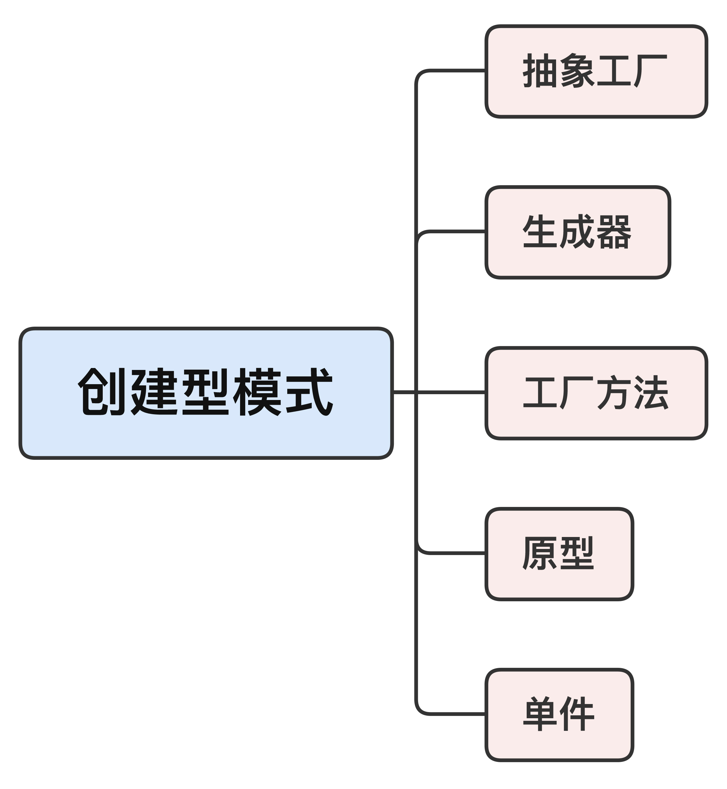
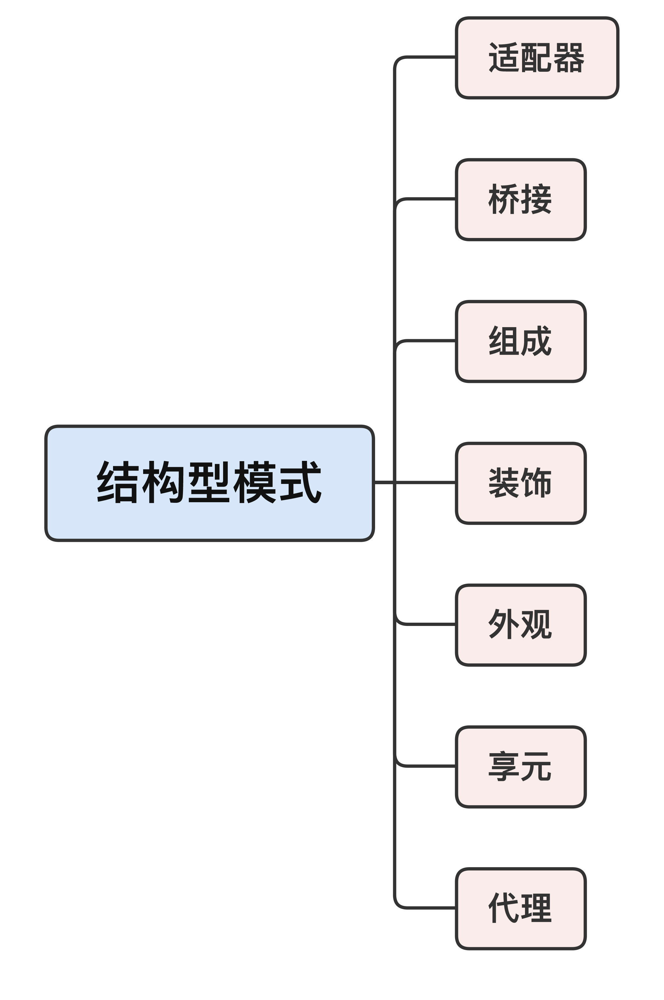
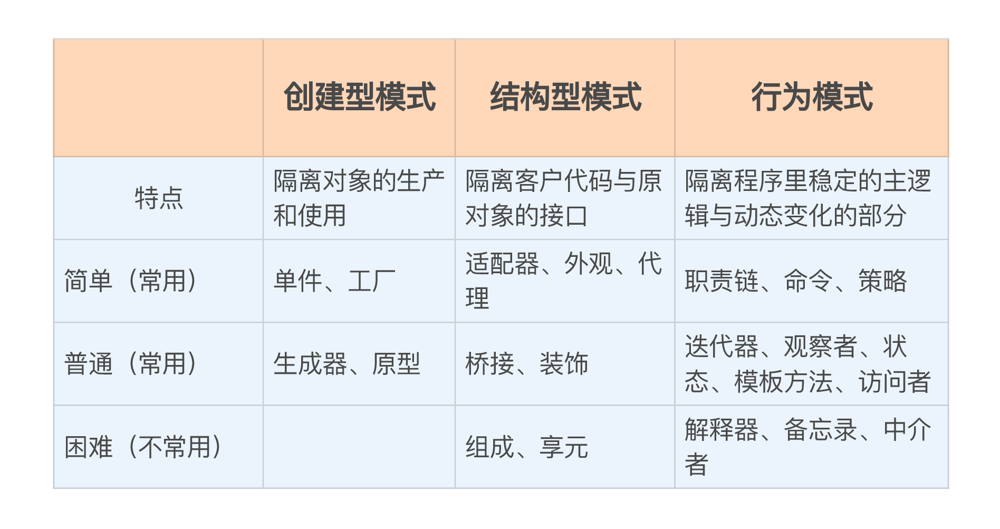
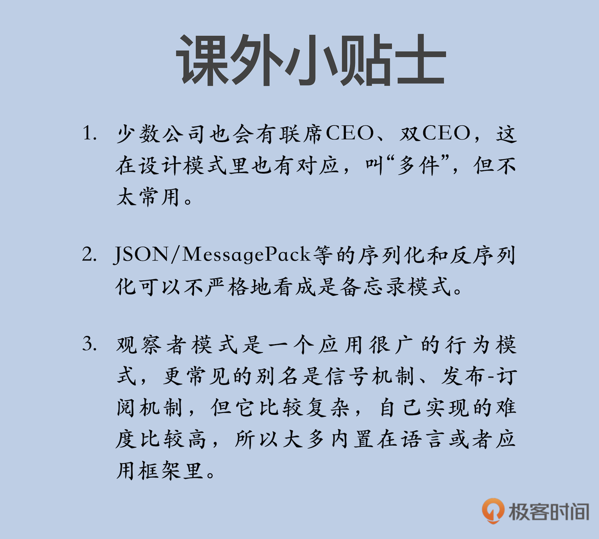

# 设计模式（下）：C++是怎么应用设计模式的？

你好，我是 Chrono。

上节课，我谈了设计模式和设计原则。今天，我就具体说说，在 C++ 里，该怎么应用单件、工厂、适配器、代理、职责链等这些经典的设计模式，用到的有 call_once()、make_unique()、async() 等 C++ 工具，希望能够给你一些在实际编码时的启发。

（在接下来学的时候，你也可以同时思考一下它们都符合哪些设计原则，把设计模式和设计原则结合起来学习。）

## 创建型模式 

首先来看看创建型模式，**它隐藏了类的实例化过程和细节，让对象的创建独立于系统的其他部分**。

创建型模式不多，一共有 5 个，我觉得最有用的是**单件和工厂**。



单件很简单，要点在于控制对象的创建数量，只能有一个实例，就像是公司的 CEO 一样，有且唯一。

关于它的使用方式、应用场景，存在着一些争议，但我个人觉得，它很好地体现了设计模式的基本思想，足够简单，可以作为范例，用来好好学习模式里的各个要素。

关于单件模式，一个“老生常谈”的话题是“双重检查锁定”，你可能也有所了解，它可以用来避免在多线程环境里多次初始化单件，写起来特别繁琐。

使用[第 14 讲](第 14 讲)里提到的 call_once，可以很轻松地解决这个问题，但如果你想要更省事的话，其实在 C++ 里还有一种方法（C++ 11 之后），就是**直接使用函数内部的 static 静态变量**。C++ 语言会保证静态变量的初始化是线程安全的，绝对不会有线程冲突。比如：

```cpp
auto& instance()    // 生产单件对象的函数
{
  static T obj;     // 静态变量
  return obj;       // 返回对象的引用
}
```

说完了单件，再来看工厂模式吧。

工厂模式是我个人的“笼统”说法，指的是抽象工厂、工厂方法这两个模式，因为它们就像是现实世界里的工厂一样，专门用来生产对象。

抽象工厂是一个类，而工厂方法是一个函数，在纯面向对象范式里，两者的区别很大。而 C++ 支持泛型编程，不需要特意派生出子类，只要接口相同就行，所以，这两个模式在 C++ 里用起来也就更自由一些，界限比较模糊。

为什么非要用工厂来创建对象呢？这样做的好处在哪里呢？

我觉得，你可以用 DRY（Don’t Repeate Yourself）原则来理解，也就是说尽量避免重复的代码，简单地认为它就是“**对 new 的封装**”。

想象一下，如果程序里到处都是“硬编码”的 new，一旦设计发生变动，比如说把“new 苹果”改成“new 梨子”，你就需要把代码里所有出现 new 的地方都改一遍，不仅麻烦，而且很容易遗漏，甚至是出错。

如果把 new 用工厂封装起来，就形成了一个“中间层”，隔离了客户代码和创建对象，两边只能通过工厂交互，彼此不知情，也就实现了解耦，由之前的强联系转变成了弱联系。所以，你就可以在工厂模式里拥有对象的“生杀大权”，随意控制生产的方式、生产的时机、生产的内容。

在[第 8 讲](第 8 讲)里说到的 make_unique()、make_shared() 这两个函数，就是工厂模式的具体应用，它们封装了创建的细节，看不见 new，直接返回智能指针对象，而且接口更简洁，内部有更多的优化。

```cpp
auto ptr1 = make_unique<int>(42);
auto ptr2 = make_shared<string>("metroid");
```

还有之前课程里的用函数抛出异常（[第 9 讲](第 9 讲)）、创建正则对象（[第 11 讲](第 11 讲)）、创建 Lua 虚拟机（[第 17 讲](第 17 讲)），其实也都是应用了工厂模式。这些你可以结合课程的具体内容，再回顾一下，我就不多说了。

使用工厂模式的关键，就是**要理解它面对的问题和解决问题的思路**，比如说创建专属的对象、创建成套的对象，重点是“如何创建对象、创建出什么样的对象”，用函数或者类会比单纯用 new 更灵活。

## 结构型模式 

接下来说说结构型模式，它关注的是对象的**静态联系，以灵活、可拆卸、可装配的方式组合出新的对象**。

这里你要注意结构型模式的重要特点：虽然它会有多个参与者，但最后必定得到且使用的是“**一个**”对象，而不是“多个”对象。

结构型模式一共有 7 个，其中，我觉得在 C++ 里比较有用、常用的是**适配器、外观和代理**。



**1. 适配器模式**

适配器模式的目的是接口转换，不需要修改源码，就能够把一个对象转换成可以在本系统中使用的形式。

打个比方，就像是拿到了一个英式电源插头，无法插到国标插座上，但你不必拿工具去拆开插头改造，只要买个转换头就行。

适配器模式在 C++ 里多出现在有第三方库或者外部接口的时候，通常这些接口不会恰好符合我们自己的系统，功能很好，但不能直接用，想改源码很难，甚至是不可能的。所以，就需要用适配器模式给“适配”一下，让外部工具能够“match”我们的系统，而两边都不需要变动，“皆大欢喜”。

还记得[第 12 讲](第 12 讲)里的容器 array 吗？它就是一个适配器，包装了 C++ 的原生数组，转换成了容器的形式，让“裸内存数据”也可以接入标准库的泛型体系。

```cpp
array<int, 5> arr = {0,1,2,3,4};
auto b = begin(arr);
auto e = end(arr);
for_each(b, e, [](int x){...});
```

**2. 外观模式**

再来看外观模式，它封装了一组对象，目的是简化这组对象的通信关系，提供一个高层次的易用接口，让外部用户更容易使用，降低系统的复杂度。

外观模式的特点是内部会操作很多对象，然后对外表现成一个对象。使用它的话，你就可以不用“事必躬亲”了，只要发一个指令，后面的杂事就都由它代劳了，就像是一个“大管家”。

不过要注意，外观模式并不绝对控制、屏蔽内部包装的那些对象。如果你觉得外观不好用，完全可以越过它，自己“深入基层”，去实现外观没有提供的功能。

第 14 讲里提到的函数 async() 就是外观模式的一个例子，它封装了线程的创建、调度等细节，用起来很简单，但也不排斥你直接使用 thread、mutex 等底层线程工具。

```cpp
auto f = std::async([](){...});
f.wait();
```

**3. 代理模式**

它和适配器有点像，都是包装一个对象，但关键在于它们的目的、意图有差异：不是为了适配插入系统，而是要“控制”对象，不允许外部直接与内部对象通信，所以叫作“代理”。

代理模式的应用非常广泛，如果你想限制、屏蔽、隐藏、增强或者优化一个类，就可以使用代理。这样，客户代码看到的只是代理对象，不知道原始对象（被代理的对象）是什么样，只能用代理对象给出的接口，这样就实现了控制的目的。

代理在 C++ 里的一个典型应用就是智能指针（[第 8 讲](第 8 讲)），它接管了原始指针，限制了某些危险操作，并且添加了自动生命周期管理，虽然少了些自由，但获得了更多的安全。

## 行为模式 

看完了适配器、外观和代理这三个结构型模式，再来看行为模式，**它描述了对象之间动态的消息传递，也就是对象的“行为”、工作的方式**。

行为模式比较多，有 11 个，这是因为，面向对象的设计更注重运行时的组合，比静态的组合更能增加系统的灵活性和可扩展性。


因为行为模式都是在运行时才建立联系，所以通常都很复杂，不太好理解对象之间的关系和通信机制。

我觉得比较难用，或者说是要尽量避免使用的模式有解释器和中介者，它们的结构比较难懂，会增加系统的复杂度。而比较容易理解、容易使用的有**职责链、命令和策略**，所以我重点说说它们。

职责链和命令这两个模式经常联合起来使用。职责链把多个对象串成一个“链条”，让链条里的每个对象都有机会去处理请求。而请求通常使用的是命令模式，把相关的数据打包成一个对象，解耦请求的发送方和接收方。

其实，你仔细想一下就会发现，C++ 的异常处理机制（[第 9 讲](第 9 讲)）就是“职责链 + 命令”的一个实际应用。

在异常处理的过程中，异常类 exception 就是一个命令对象，throw 抛出异常就是发起了一个请求处理流程。而一系列的 try-catch 块就构成了处理异常的职责链，异常会自下而上地走过函数调用栈——也就是职责链，直到在链条中找到一个能够处理的 catch 块。

策略模式的要点是“策略”这两个字，它封装了不同的算法，可以在运行的时候灵活地互相替换，从而在外部“非侵入”地改变系统的行为内核。

策略模式有点像装饰模式和状态模式，你可不要弄混了。跟它们相比，策略模式的的特点是不会改变类的外部表现和内部状态，只是动态替换一个很小的算法功能模块。

前面讲过的容器和算法用到的比较函数、散列函数，还有 for_each 算法里的 lambda 表达式，它们都可以算是策略模式的具体应用。

另外，策略模式也非常适合应用在有 if-else/switch-case 这样“分支决策”的代码里，你可以把每个分支逻辑都封装成类或者 lambda 表达式，再把它们存进容器，让容器来帮你查找最合适的处理策略。

## 小结 

好了，今天说了几个我个人认为比较重要的模式，还列出了 C++ 里的具体例子，两者互相参照，你就能更好地理解设计模式和 C++ 语言。接下来你可以去借鉴这些用法，尝试看看自己以前写的程序，是不是能应用工厂、适配器、代理、策略等模式去重构，让代码更加优雅、灵活。

再小结一下今天的内容：

1. 创建型模式里常用的有单件和工厂，封装了对象的创建过程，隔离了对象的生产和使用；

2. 结构型模式里常用的有适配器、外观和代理，通过对象组合，得到一个新对象，目的是适配、简化或者控制，隔离了客户代码与原对象的接口；

3. 行为模式里常用的有职责链、命令和策略，只有在运行时才会建立联系，封装、隔离了程序里动态变化的那部分。

按照这些模式的使用的难易程度，我又画了一个表格，你可以对比着看一下。



今天虽然说了不少，但除了这些经典的设计模式，还有很多其他的设计模式，比如对象池、空对象、反应器、前摄器、包装外观，等等。

虽然它们也流传比较广，但还不那么“权威”，用得也不是很多，你不需要重点掌握，所以我就不多讲了，课下你可以再去找些资料学习。

## 课下作业 

最后是课下作业时间，给你留两个思考题：

1. 你觉得创建型模式有什么好处？

2. 你能说一下适配器、外观和代理这三个模式的相同点和不同点吗？

欢迎在留言区写下你的思考和答案，如果觉得今天的内容对你有所帮助，也欢迎分享给你的朋友。我们下节课见。



