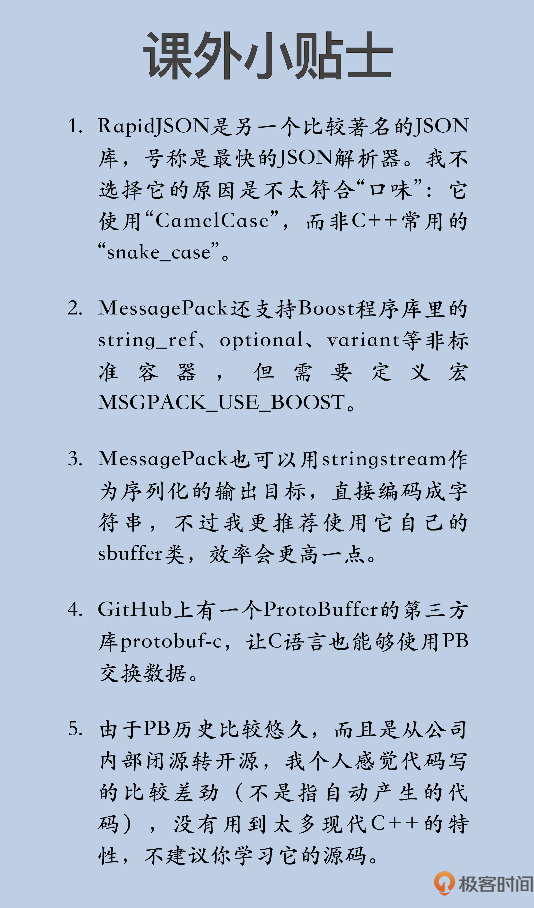

# 序列化：简单通用的数据交换格式有哪些？

你好，我是 Chrono。

在前面的三个单元里，我们学习了 C++ 的语言特性和标准库，算是把 C++ 的编程范式、生命周期、核心特性、标准库的内容整体过了一遍。从今天起，我们的学习之旅又将开启一个新的篇章。

C++ 语言和标准库很强大，功能灵活，组件繁多，但也只能说是构建软件这座大厦的基石。想要仅凭它们去“包打天下”，不能说是绝对不可行，但至少是“吃力难讨好”。

还是那句老话：“不要重复发明轮子。”（Reinventing the wheel）虽然很多 C++ 程序员都热衷于此，但我觉得对于你我这样的“凡人”，还是要珍惜自己的时间和精力，把有限的资源投入到能有更多产出的事情上。

所以，接下来的这几节课，我会介绍一些第三方工具，精选出序列化 / 反序列化、网络通信、脚本语言混合编程和性能分析这四类工具，弥补标准库的不足，节约你的开发成本，让你的工作更有效率。

今天，我先来说一下序列化和反序列化。这两个功能在软件开发中经常遇到，你可能很熟悉了，所以我只简单解释一下。

序列化，就是把内存里“活的对象”转换成静止的字节序列，便于存储和网络传输；而反序列化则是反向操作，从静止的字节序列重新构建出内存里可用的对象。

我借用《三体》里的内容，打一个形象的比喻：序列化就是“三体人”的脱水，变成干纤维，在乱纪元方便存储运输；反序列化就是“三体人”的浸泡，在恒纪元由干纤维再恢复成活生生的人。（即使没读过《三体》，也是很好理解的吧？）

接下来，我就和你介绍三种既简单又高效的数据交换格式：JSON、MessagePack 和 ProtoBuffer，看看在 C++ 里怎么对数据做序列化和反序列化。

## JSON 

JSON 是一种轻量级的数据交换格式，采用纯文本表示，所以是“human readable”，阅读和修改都很方便。

由于 JSON 起源于“最流行的脚本语言”JavaScript，所以它也随之得到了广泛的应用，在 Web 开发领域几乎已经成为了事实上的标准，而且还渗透到了其他的领域。比如很多数据库就支持直接存储 JSON 数据，还有很多应用服务使用 JSON 作为配置接口。

在[JSON 的官方网站](JSON 的官方网站)上，你可以找到大量的 C++ 实现，不过用起来都差不多。因为 JSON 本身就是个 KV 结构，很容易映射到类似 map 的关联数组操作方式。

如果不是特别在意性能的话，选个你自己喜欢的就好。否则，你就要做一下测试，看哪一个更适合你的应用场景。

不过我觉得，JSON 格式注重的是方便易用，在性能上没有太大的优势，所以**一般选择 JSON 来交换数据，通常都不会太在意性能（不然肯定会改换其他格式了），还是自己用着顺手最重要**。

下面就来说说我的个人推荐：“[JSON for Modern C++](JSON for Modern C++)”这个库。

JSON for Modern C++ 可能不是最小最快的 JSON 解析工具，但功能足够完善，而且使用方便，仅需要包含一个头文件“json.hpp”，没有外部依赖，也不需要额外的安装、编译、链接工作，适合快速上手开发。

JSON for Modern C++ 可以用“git clone”下载源码，或者更简单一点，直接用 wget 获取头文件就行：

```python
git clone git@github.com:nlohmann/json.git    # git clone
wget https://github.com/nlohmann/json/releases/download/v3.7.3/json.hpp  # wget 
```

JSON for Modern C++ 使用一个 json 类来表示 JSON 数据，为了避免说的时候弄混，我给这个类起了个别名 json_t：

```cpp
using json_t = nlohmann::json;
```

json_t 的序列化功能很简单，和标准容器 map 一样，用关联数组的“[]”来添加任意数据。

你不需要特别指定数据的类型，它会自动推导出恰当的类型。比如，连续多个“[]”就是嵌套对象，array、vector 或者花括号形式的初始化列表就是 JSON 数组，map 或者是花括号形式的 pair 就是 JSON 对象，非常自然：

```cpp
json_t j;                                   // JSON对象
j["age"] = 23;                              // "age":23
j["name"] = "spiderman";                    // "name":"spiderman"
j["gear"]["suits"] = "2099";                // "gear":{"suits":"2099"}
j["jobs"] = {"superhero"};                  // "jobs":["superhero"]  
vector<int> v = {1,2,3};                   // vector容器
j["numbers"] = v;                          // "numbers":[1,2,3]
map<string, int> m =                       // map容器
    {{"one",1}, {"two", 2}};               // 初始化列表 
j["kv"] = m;                               // "kv":{"one":1,"two":2}
```

添加完之后，用成员函数 dump() 就可以序列化，得到它的 JSON 文本形式。默认的格式是紧凑输出，没有缩进，如果想要更容易阅读的话，可以加上指示缩进的参数：

```cpp
cout << j.dump() << endl;         // 序列化，无缩进
cout << j.dump(2) << endl;        // 序列化，有缩进，2个空格
```

json_t 的反序列化功能同样也很简单，只要调用静态成员函数 parse() 就行，直接得到 JSON 对象，而且可以用 auto 自动推导类型：

```cpp
string str = R"({                // JSON文本，原始字符串
    "name": "peter",
    "age" : 23,
    "married" : true
})";
auto j = json_t::parse(str);    // 从字符串反序列化
assert(j["age"] == 23);        // 验证序列化是否正确
assert(j["name"] == "peter");
```

json_t 使用异常来处理解析时可能发生的错误，如果你不能保证 JSON 数据的完整性，就要使用 try-catch 来保护代码，防止错误数据导致程序崩溃：

```cpp
auto txt = "bad:data"s;        // 不是正确的JSON数据
try                             // try保护代码
{
    auto j = json_t::parse(txt);// 从字符串反序列化
}
catch(std::exception& e)        // 捕获异常
{
    cout << e.what() << endl;
}
```

对于通常的应用来说，掌握了基本的序列化和反序列化就够用了，不过 JSON for Modern C++ 里还有很多高级用法，比如 SAX、BSON、自定义类型转换等。如果你需要这些功能，可以去看[它的文档](它的文档)，里面写得都很详细。

## MessagePack 

说完 JSON，再来说另外第二种格式：MessagePack。

它也是一种轻量级的数据交换格式，与 JSON 的不同之处在于它不是纯文本，而是二进制。所以 MessagePack 就比 JSON 更小巧，处理起来更快，不过也就没有 JSON 那么直观、易读、好修改了。

由于二进制这个特点，MessagePack 也得到了广泛的应用，著名的有 Redis、Pinterest。

MessagePack 支持几乎所有的编程语言，你可以在[官网](官网)上找到它的 C++ 实现。

我常用的是官方库 msgpack-c，可以用 apt-get 直接安装。

```javascript
apt-get install libmsgpack-dev
```

但这种安装方式有个问题，可能发行方仓库里的是老版本（像 Ubuntu 16.04 就是 0.57），缺失很多功能，所以最好是从[GitHub](GitHub)上下载最新版，编译时手动指定包含路径：

```java
git clone git@github.com:msgpack/msgpack-c.git
g++ msgpack.cpp -std=c++14 -I../common/include -o a.out
```

和 JSON for Modern C++ 一样，msgpack-c 也是仅头文件的库（head only），只要包含一个头文件“msgpack.hpp”就行了，不需要额外的编译链接选项（C 版本需要用“-lmsgpackc”链接）。

但 MessagePack 的设计理念和 JSON 是完全不同的，它没有定义 JSON 那样的数据结构，而是比较底层，只能对基本类型和标准容器序列化 / 反序列化，需要你自己去组织、整理要序列化的数据。

我拿 vector 容器来举个例子，调用 pack() 函数序列化为 MessagePack 格式：

```cpp
vector<int> v = {1,2,3,4,5};              // vector容器
msgpack::sbuffer sbuf;                    // 输出缓冲区
msgpack::pack(sbuf, v);                   // 序列化
```

从代码里你可以看到，它的用法不像 JSON 那么简单直观，**必须同时传递序列化的输出目标和被序列化的对象**。

输出目标 sbuffer 是个简单的缓冲区，你可以把它理解成是对字符串数组的封装，和**vector&lt;char&gt;**很像，也可以用 data() 和 size() 方法获取内部的数据和长度。

```cpp
cout << sbuf.size() << endl;            // 查看序列化后数据的长度
```

除了 sbuffer，你还可以选择另外的 zbuffer、fbuffer。它们是压缩输出和文件输出，和 sbuffer 只是格式不同，用法是相同的，所以后面我就都用 sbuffer 来举例说明。

MessagePack 反序列化的时候略微麻烦一些，要用到函数 unpack() 和两个核心类：object_handle 和 object。

函数 unpack() 反序列化数据，得到的是一个 object_handle，再调用 get()，就是 object：

```cpp
auto handle = msgpack::unpack(          // 反序列化
            sbuf.data(), sbuf.size());  // 输入二进制数据
auto obj = handle.get();                // 得到反序列化对象
```

这个 object 是 MessagePack 对数据的封装，相当于 JSON for Modern C++ 的 JSON 对象，但你不能直接使用，必须知道数据的原始类型，才能转换还原：

```cpp
vector<int> v2;                       // vector容器
obj.convert(v2);                      // 转换反序列化的数据
assert(std::equal(                    // 算法比较两个容器
      begin(v), end(v), begin(v2)));
```

因为 MessagePack 不能直接打包复杂数据，所以用起来就比 JSON 麻烦一些，你必须自己把数据逐个序列化，连在一起才行。

好在 MessagePack 又提供了一个 packer 类，可以实现串联的序列化操作，简化代码：

```cpp
msgpack::sbuffer sbuf;                         // 输出缓冲区
msgpack::packer<decltype(sbuf)> packer(sbuf);  // 专门的序列化对象
packer.pack(10).pack("monado"s)                // 连续序列化多个数据
      .pack(vector<int>{1,2,3});
```

对于多个对象连续序列化后的数据，反序列化的时候可以用一个偏移量（offset）参数来同样连续操作：

```cpp
for(decltype(sbuf.size()) offset = 0;          // 初始偏移量是0
    offset != sbuf.size();){                   // 直至反序列化结束
    auto handle = msgpack::unpack(            // 反序列化
            sbuf.data(), sbuf.size(), offset);  // 输入二进制数据和偏移量
    auto obj = handle.get();                  // 得到反序列化对象
}
```

但这样还是比较麻烦，能不能像 JSON 那样，直接对类型序列化和反序列化呢？

MessagePack 为此提供了一个特别的宏：MSGPACK_DEFINE，把它放进你的类定义里，就可以像标准类型一样被 MessagePack 处理。

下面定义了一个简单的 Book 类：

```cpp
class Book final                       // 自定义类
{
public:
    int         id;
    string      title;
    set<string> tags;
public:
    MSGPACK_DEFINE(id, title, tags);   // 实现序列化功能的宏
};
```

它可以直接用于 pack() 和 unpack()，基本上和 JSON 差不多了：

```cpp
Book book1 = {1, "1984", {"a","b"}};  // 自定义类
msgpack::sbuffer sbuf;                    // 输出缓冲区
msgpack::pack(sbuf, book1);              // 序列化
auto obj = msgpack::unpack(              // 反序列化
      sbuf.data(), sbuf.size()).get();   // 得到反序列化对象
Book book2;
obj.convert(book2);                      // 转换反序列化的数据
assert(book2.id == book1.id);
assert(book2.tags.size() == 2);
cout << book2.title << endl;
```

使用 MessagePack 的时候，你也要注意数据不完整的问题，必须要用 try-catch 来保护代码，捕获异常：

```cpp
auto txt = ""s;                      // 空数据
try                                  // try保护代码
{
    auto handle = msgpack::unpack(   // 反序列化
        txt.data(), txt.size());
}
catch(std::exception& e)            // 捕获异常
{
    cout << e.what() << endl;
}
```

## ProtoBuffer 

第三个要说的库就是著名的[ProtoBuffer](ProtoBuffer)，通常简称为 PB，由 Google 出品。

PB 也是一种二进制的数据格式，但毕竟是工业级产品，所以没有 JSON 和 MessagePack 那么“轻”，相关的东西比较多，要安装一个预处理器和开发库，编译时还要链接动态库（-lprotobuf）：

```sql
apt-get install protobuf-compiler
apt-get install libprotobuf-dev
g++ protobuf.cpp -std=c++14 -lprotobuf -o a.out
```

**PB 的另一个特点是数据有“模式”（schema）**，必须要先写一个 IDL（Interface Description Language）文件，在里面定义好数据结构，只有预先定义了的数据结构，才能被序列化和反序列化。

这个特点既有好处也有坏处：一方面，接口就是清晰明确的规范文档，沟通交流简单无歧义；而另一方面，就是缺乏灵活性，改接口会导致一连串的操作，有点繁琐。

下面是一个简单的 PB 定义：

```go
syntax = "proto2";                    // 使用第2版
package sample;                        // 定义名字空间
message Vendor                        // 定义消息
{
    required uint32     id      = 1;  // required表示必须字段
    required string     name    = 2;  // 有int32/string等基本类型
    required bool       valid   = 3;  // 需要指定字段的序号，序列化时用
    optional string     tel     = 4;  // optional字段可以没有
}
```

有了接口定义文件，需要再用 protoc 工具生成对应的 C++ 源码，然后把源码文件加入自己的项目中，就可以使用了：

```javascript
protoc --cpp_out=. sample.proto       // 生成C++代码
```

由于 PB 相关的资料实在太多了，这里我就只简单说一下重要的接口：

- 字段名会生成对应的 has/set 函数，检查是否存在和设置值；

- IsInitialized() 检查数据是否完整（required 字段必须有值）；

- DebugString() 输出数据的可读字符串描述；

- ByteSize() 返回序列化数据的长度；

- SerializeToString() 从对象序列化到字符串；

- ParseFromString() 从字符串反序列化到对象；

- SerializeToArray()/ParseFromArray() 序列化的目标是字节数组。

下面的代码示范了 PB 的用法：

```cpp
using vendor_t = sample::Vendor;        // 类型别名
vendor_t v;                             // 声明一个PB对象
assert(!v.IsInitialized());            // required等字段未初始化
v.set_id(1);                            // 设置每个字段的值    
v.set_name("sony");
v.set_valid(true);
assert(v.IsInitialized());             // required等字段都设置了，数据完整
assert(v.has_id() && v.id() == 1); 
assert(v.has_name() && v.name() == "sony");
assert(v.has_valid() && v.valid());
cout << v.DebugString() << endl;       // 输出调试字符串
string enc;
v.SerializeToString(&enc);              // 序列化到字符串 
vendor_t v2; 
assert(!v2.IsInitialized());
v2.ParseFromString(enc);               // 反序列化
```

虽然业界很多大厂都在使用 PB，但我觉得它真不能算是最好的，IDL 定义和接口都太死板生硬，还只能用最基本的数据类型，不支持标准容器，在现代 C++ 里显得“不太合群”，用起来有点别扭。

不过它后面有 Google“撑腰”，而且最近几年又有 gRPC“助拳”，所以很多时候也不得不用。

PB 的另一个缺点是官方支持的编程语言太少，通用性较差，最常用的 proto2 只有 C++、Java 和 Python。后来的 proto3 增加了对 Go、Ruby 等的支持，但仍然不能和 JSON、MessagePack 相比。

## 小结 

好了，今天我讲了三种数据交换格式：JSON、MessagePack 和 ProtoBuffer。

这三种数据格式各有特色，在很多领域都得到了广泛的应用，我来简单小结一下：

1. JSON 是纯文本，容易阅读，方便编辑，适用性最广；

2. MessagePack 是二进制，小巧高效，在开源界接受程度比较高；

3. ProtoBuffer 是工业级的数据格式，注重安全和性能，多用在大公司的商业产品里。

有很多开源库支持这些数据格式，官方的、民间的都有，你应该选择适合自己的高质量库，必要的时候可以做些测试。

再补充一点，除了今天说的这三种，你还可以尝试其他的数据格式，比较知名的有 Avro、Thrift，虽然它们有点冷门，但也有自己的独到之处（比如，天生支持 RPC、可选择多种序列化格式和传输方式）。

## 课下作业 

最后是课下作业时间，给你留两个思考题：

1. 为什么要有序列化和反序列化，直接 memcpy 内存数据行不行呢？

2. 你最常用的是哪种数据格式？它有什么优缺点？

欢迎你在留言区写下你的思考和答案，如果觉得今天的内容对你有所帮助，也欢迎分享给你的朋友。我们下节课见。



