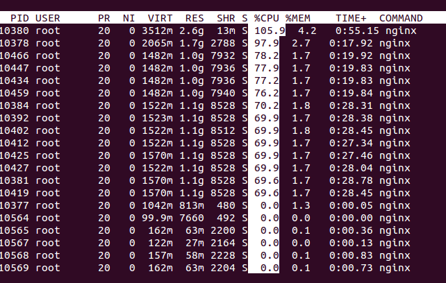
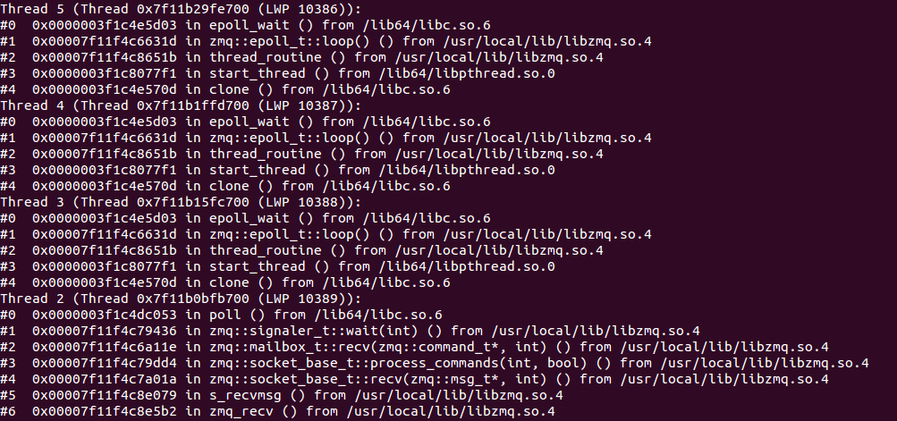
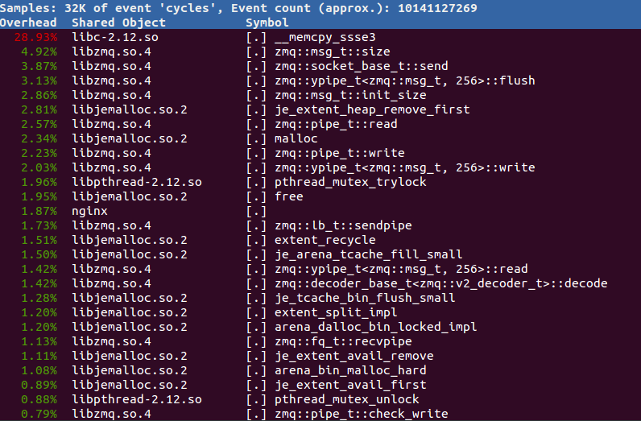
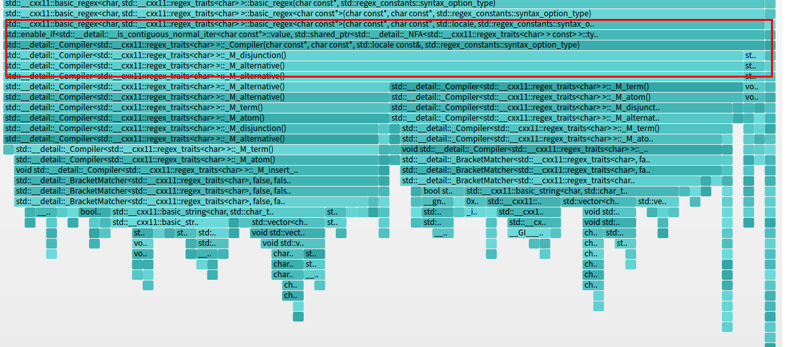
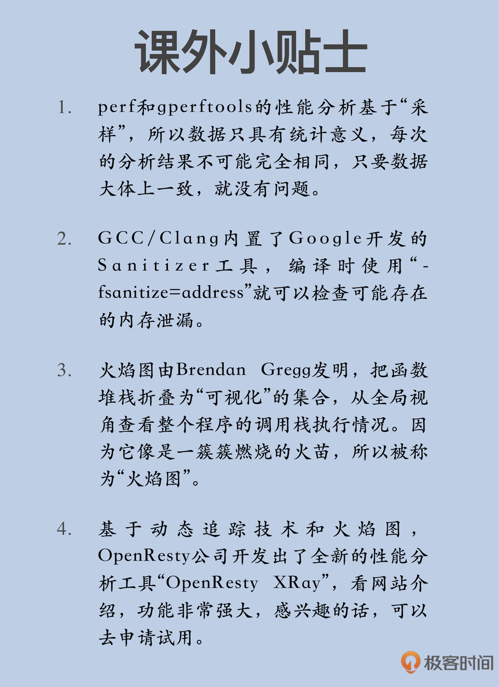

# 性能分析：找出程序的瓶颈

你好，我是 Chrono。

今天是“技能进阶”单元的最后一节课，我也要兑现刚开始在“概论”里的承诺，讲一讲在运行阶段我们能做什么。

## 运行阶段能做什么 

在编码阶段，你会运用之前学习的各种范式和技巧，写出优雅、高效的代码，然后把它交给编译器。经过预处理和编译这两个阶段，源码转换成了二进制的可执行程序，就能够在 CPU 上“跑”起来。

在运行阶段，C++ 静态程序变成了动态进程，是一个实时、复杂的状态机，由 CPU 全程掌控。但因为 CPU 的速度实在太快，程序的状态又实在太多，所以前几个阶段的思路、方法在这个时候都用不上。

所以，我认为，在运行阶段能做、应该做的事情主要有三件：**调试**（Debug）**、测试**（Test）**和性能分析**（Performance Profiling）。

调试你一定很熟悉了，常用的工具是 GDB，我在前面的“[轻松话题](轻松话题)”里也讲过一点它的使用技巧。它的关键是让高速的 CPU 慢下来，把它降速到和人类大脑一样的程度，于是，我们就可以跟得上 CPU 的节奏，理清楚程序的动态流程。

测试的目标是检验程序的功能和性能，保证软件的质量，它与调试是相辅相成的关系。测试发现 Bug，调试去解决 Bug，再返回给测试验证。好的测试对于软件的成功至关重要，有很多现成的测试理论、应用、系统（你可以参考下，我就不多说了）。

一般来说，程序经过调试和测试这两个步骤，就可以上线运行了，进入第三个、也是最难的性能分析阶段。

什么是性能分析呢？

你可以把它跟 Code Review 对比一下。Code Review 是一种静态的程序分析方法，在编码阶段通过观察源码来优化程序、找出隐藏的 Bug。而性能分析是一种动态的程序分析方法，在运行阶段采集程序的各种信息，再整合、研究，找出软件运行的“瓶颈”，为进一步优化性能提供依据，指明方向。

从这个粗略的定义里，你可以看到，性能分析的关键就是“**测量**”，用数据说话。没有实际数据的支撑，优化根本无从谈起，即使做了，也只能是漫无目的的“不成熟优化”，即使成功了，也只是“瞎猫碰上死耗子”而已。

性能分析的范围非常广，可以从 CPU 利用率、内存占用率、网络吞吐量、系统延迟等许多维度来评估。

今天，我只讲多数时候最看重的 CPU 性能分析。因为 CPU 利用率通常是评价程序运行的好坏最直观、最容易获取的指标，优化它是提升系统性能最快速的手段。而其他的几个维度也大多与 CPU 分析相关，可以达到“以点带面”的效果。

## 系统级工具 

刚才也说了，性能分析的关键是测量，而测量就需要使用工具，那么，你该选什么、又该怎么用工具呢？

其实，Linux 系统自己就内置了很多用于性能分析的工具，比如 top、sar、vmstat、netstat，等等。但是，Linux 的性能分析工具太多、太杂，有点“乱花渐欲迷人眼”的感觉，想要学会并用在实际项目里，不狠下一番功夫是不行的。

所以，为了让你能够快速入门性能分析，我根据我这些年的经验，挑选了四个“高性价比”的工具：top、pstack、strace 和 perf。它们用起来很简单，而且实用性很强，可以观测到程序的很多外部参数和内部函数调用，由内而外、由表及里地分析程序性能。

第一个要说的是“**top**”，它通常是性能分析的“起点”。无论你开发的是什么样的应用程序，敲个 top 命令，就能够简单直观地看到 CPU、内存等几个最关键的性能指标。

top 展示出来的各项指标的含义都非常丰富，我来说几个操作要点吧，帮助你快速地抓住它的关键信息。

一个是按“M”，看内存占用（RES/MEM），另一个是按“P”，看 CPU 占用，这两个都会从大到小自动排序，方便你找出最耗费资源的进程。

另外，你也可以按组合键“xb”，然后用“&lt;&gt;”手动选择排序的列，这样查看起来更自由。

我曾经做过一个“魔改”Nginx 的实际项目，下面的这个截图展示的就是一次 top 查看的性能：



从 top 的输出结果里，你可以看到进程运行的概况，知道 CPU、内存的使用率。如果你发现某个指标超出了预期，就说明可能存在问题，接下来，你就应该采取更具体的措施去进一步分析。

比如说，这里面的一个进程 CPU 使用率太高，我怀疑有问题，那我就要深入进程内部，看看到底是哪些操作消耗了 CPU。

这时，我们可以选用两个工具：**pstack 和 strace**。

pstack 可以打印出进程的调用栈信息，有点像是给正在运行的进程拍了个快照，你能看到某个时刻的进程里调用的函数和关系，对进程的运行有个初步的印象。

下面这张截图显示了一个进程的部分调用栈，可以看到，跑了好几个 ZMQ 的线程在收发数据：



不过，pstack 显示的只是进程的一个“静态截面”，信息量还是有点少，而 strace 可以显示出进程的正在运行的系统调用，实时查看进程与系统内核交换了哪些信息：


把 pstack 和 strace 结合起来，你大概就可以知道，进程在用户空间和内核空间都干了些什么。当进程的 CPU 利用率过高或者过低的时候，我们有很大概率能直接发现瓶颈所在。

不过，有的时候，你也可能会“一无所获”，毕竟这两个工具获得的信息只是“表象”，数据的“含金量”太低，做不出什么有效的决策，还是得靠“猜”。要拿到更有说服力的“数字”，就得 **perf** 出场了。

perf 可以说是 pstack 和 strace 的“高级版”，它按照固定的频率去“采样”，相当于连续执行多次的 pstack，然后再统计函数的调用次数，算出百分比。只要采样的频率足够大，把这些“瞬时截面”组合在一起，就可以得到进程运行时的可信数据，比较全面地描述出 CPU 使用情况。

我常用的 perf 命令是“**perf top -K -p xxx**”，按 CPU 使用率排序，只看用户空间的调用，这样很容易就能找出最耗费 CPU 的函数。

比如，下面这张图显示的是大部分 CPU 时间都消耗在了 ZMQ 库上，其中，内存拷贝调用居然达到了近 30%，是不折不扣的“大户”。所以，只要能把这些拷贝操作减少一点，就能提升不少性能。



总之，**使用 perf 通常可以快速定位系统的瓶颈，帮助你找准性能优化的方向**。课下你也可以自己尝试多分析各种进程，比如 Redis、MySQL，等等，观察它们都在干什么。

## 源码级工具 

top、pstack、strace 和 perf 属于“非侵入”式的分析工具，不需要修改源码，就可以在软件的外部观察、收集数据。它们虽然方便易用，但毕竟是“隔岸观火”，还是不能非常细致地分析软件，效果不是太理想。

所以，我们还需要有“侵入”式的分析工具，在源码里“埋点”，直接写特别的性能分析代码。这样针对性更强，能够有目的地对系统的某个模块做精细化分析，拿到更准确、更详细的数据。

其实，这种做法你并不陌生，比如计时器、计数器、关键节点打印日志，等等，只是通常并没有上升到性能分析的高度，手法比较“原始”。

在这里，我要推荐一个专业的源码级性能分析工具：**Google Performance Tools**，一般简称为 gperftools。它是一个 C++ 工具集，里面包含了几个专门的性能分析工具（还有一个高效的内存分配器 tcmalloc），分析效果直观、友好、易理解，被广泛地应用于很多系统，经过了充分的实际验证。

```sql
apt-get install google-perftools
apt-get install libgoogle-perftools-dev
```

gperftools 的性能分析工具有 CPUProfiler 和 HeapProfiler 两种，用来分析 CPU 和内存。不过，如果你听从我的建议，总是使用智能指针、标准容器，不使用 new/delete，就完全可以不用关心 HeapProfiler。

CPUProfiler 的原理和 perf 差不多，也是按频率采样，默认是每秒 100 次（100Hz），也就是每 10 毫秒采样一次程序的函数调用情况。

它的用法也比较简单，只需要在源码里添加三个函数：

- **ProfilerStart()**，开始性能分析，把数据存入指定的文件里；

- **ProfilerRegisterThread()**，允许对线程做性能分析；

- **ProfilerStop()**，停止性能分析。

所以，你只要把想做性能分析的代码“夹”在这三个函数之间就行，运行起来后，gperftools 就会自动产生分析数据。

为了写起来方便，我用 shared_ptr 实现一个自动管理功能。这里利用了 void* 和空指针，可以在智能指针析构的时候执行任意代码（简单的 RAII 惯用法）：

```cpp
auto make_cpu_profiler =            // lambda表达式启动性能分析
[](const string& filename)          // 传入性能分析的数据文件名
{
  ProfilerStart(filename.c_str());  // 启动性能分析
  ProfilerRegisterThread();         // 对线程做性能分析
  return std::shared_ptr<void>(     // 返回智能指针
    nullptr,                        // 空指针，只用来占位
    [](void*){                      // 删除函数执行停止动作
        ProfilerStop();             // 停止性能分析
    }   
  );  
};
```

下面我写一小段代码，测试正则表达式处理文本的性能：

```cpp
auto cp = make_cpu_profiler("case1.perf");     // 启动性能分析
auto str = "neir:automata"s;
for(int i = 0; i < 1000; i++) {               // 循环一千次
  auto reg  = make_regex(R"(^(\w+)\:(\w+)$)");// 正则表达式对象
  auto what = make_match();
  assert(regex_match(str, what, reg));        // 正则匹配
}
```

注意，我特意在 for 循环里定义了正则对象，现在就可以用 gperftools 来分析一下，这样做是不是成本很高。

编译运行后会得到一个“case1.perf”的文件，里面就是 gperftools 的分析数据，但它是二进制的，不能直接查看，如果想要获得可读的信息，还需要另外一个工具脚本 pprof。

但是，pprof 脚本并不含在 apt-get 的安装包里，所以，你还要从[GitHub](GitHub)上下载源码，然后用“**--text**”选项，就可以输出文本形式的分析报告：

```cpp
git clone git@github.com:gperftools/gperftools.git
pprof --text ./a.out case1.perf > case1.txt
Total: 72 samples
  4   5.6%   5.6%   4   5.6% __gnu_cxx::__normal_iterator::base
  4   5.6%  11.1%   4   5.6% _init
  4   5.6%  16.7%   4   5.6% std::vector::begin
  3   4.2%  20.8%   4   5.6% __gnu_cxx::operator-
  3   4.2%  25.0%   5   6.9% std::__distance
  2   2.8%  27.8%   2   2.8% __GI___strnlen
  2   2.8%  30.6%   6   8.3% __GI___strxfrm_l
  2   2.8%  33.3%   3   4.2% __dynamic_cast
  2   2.8%  36.1%   2   2.8% __memset_sse2
  2   2.8%  38.9%   2   2.8% operator new[]
```

pprof 的文本分析报告和 perf 的很像，也是列出了函数的采样次数和百分比，但因为是源码级的采样，会看到大量的内部函数细节，虽然很详细，但很难找出重点。

好在 pprof 也能输出图形化的分析报告，支持有向图和火焰图，需要你提前安装 Graphviz 和 FlameGraph：

```sql
apt-get install graphviz
git clone git@github.com:brendangregg/FlameGraph.git
```

然后，你就可以使用“**--svg**”“**--collapsed**”等选项，生成更直观易懂的图形报告了：

```null
pprof --svg ./a.out case1.perf > case1.svg
pprof --collapsed ./a.out case1.perf > case1.cbt
flamegraph.pl case1.cbt > flame.svg
flamegraph.pl --invert --color aqua case1.cbt > icicle.svg
```

我就拿最方便的火焰图来“看图说话”吧。你也可以在[GitHub](GitHub)上找到原图。



这张火焰图实际上是“倒置”的冰柱图，显示的是自顶向下查看函数的调用栈。

由于 C++ 有名字空间、类、模板等特性，函数的名字都很长，看起来有点费劲，不过这样也比纯文本要直观一些，可以很容易地看出，正则表达式占用了绝大部分的 CPU 时间。再仔细观察的话，就会发现，_Compiler() 这个函数是真正的“罪魁祸首”。

找到了问题所在，现在我们就可以优化代码了，把创建正则对象的语句提到循环外面：

```cpp
auto reg  = make_regex(R"(^(\w+)\:(\w+)$)");  // 正则表达式对象
auto what = make_match();
for(int i = 0; i < 1000; i++) {               // 循环一千次
  assert(regex_match(str, what, reg));        // 正则匹配
}
```

再运行程序，你会发现程序瞬间执行完毕，而且因为优化效果太好，gperftools 甚至都来不及采样，不会产生分析数据。

基本的 gperftools 用法就这么多了，你可以再去看它的[官方文档](官方文档)了解更多的用法，比如使用环境变量和信号来控制启停性能分析，或者链接 tcmalloc 库，优化 C++ 的内存分配速度。

## 小结 

好了，今天主要讲了运行阶段里的性能分析，它能够回答为什么系统“不够好”（not good enough），而调试和测试回答的是为什么系统“不好”（not good）。

简单小结一下今天的内容：

1. 最简单的性能分析工具是 top，可以快速查看进程的 CPU、内存使用情况；

2. pstack 和 strace 能够显示进程在用户空间和内核空间的函数调用情况；

3. perf 以一定的频率采样分析进程，统计各个函数的 CPU 占用百分比；

4. gperftools 是“侵入”式的性能分析工具，能够生成文本或者图形化的分析报告，最直观的方式是火焰图。

性能分析与优化是一门艰深的课题，也是一个广泛的议题，CPU、内存、网络、文件系统、数据库等等，每一个方向都可以再引出无数的话题。

今天介绍的这些，是我挑选的对初学者最有用的内容，学习难度不高，容易上手，见效快。希望你能以此为契机，在今后的日子里多用、多实际操作，并且不断去探索、应用其他的分析工具，综合运用它们给程序“把脉”，才能让 C++ 在运行阶段跑得更好更快更稳，才能不辜负前面编码、预处理和编译阶段的苦心与努力。

## 课下作业 

最后还是留两个思考题吧：

1. 你觉得在运行阶段还能够做哪些事情？

2. 你有性能分析的经验吗？听了今天的这节课之后，你觉得什么方式比较适合自己？

欢迎你在留言区写下你的思考和答案，如果觉得今天的内容对你有所帮助，也欢迎分享给你的朋友。我们下节课见。



