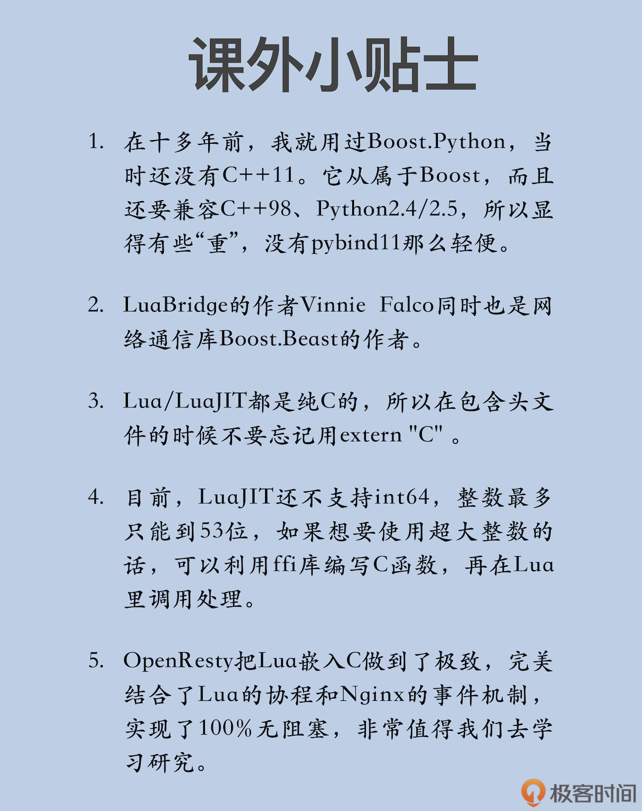

# 脚本语言：搭建高性能的混合系统

你好，我是 Chrono。

经过了前面这么多节课的学习，相信你已经认识到了 C++ 的高效、灵活和强大。使用现代特性，再加上标准库和第三方库，C++ 几乎“无所不能”。

但是，C++ 也有自己的“阿喀琉斯之踵”，那就是语言复杂、学习曲线陡峭、开发周期长、排错 / 维护成本高。

所以，C++ 不能完全适应现在的快速开发和迭代的节奏，最终只能退到后端、底层等领域。要想充分发挥 C++ 的功力，就要辅助其他的语言搭建混合系统，尽量扬长避短，做好那最关键、最核心的部分，这样才能展现出它应有的价值。

由于当前的操作系统、虚拟机、解释器、引擎很多都是用 C 或者 C++ 编写的，所以，使用 C++，可以很容易地编写各种底层模块，为上层的 Java、Go 等语言提供扩展功能。

不过，今天我不去说这些大型语言，而是讲两种轻便的脚本语言：Python 和 Lua，看看 C++ 怎么和它们俩实现无缝对接：以 C++ 为底层基础，Python 和 Lua 作为上层建筑，共同搭建起高性能、易维护、可扩展的混合系统。

## Python 

Python 应该是除了 JavaScript 以外最流行的一种脚本语言了，一直在 TIOBE 榜单里占据前三名的位置。而且，在新兴的大数据、人工智能、科学计算等领域，也都有着广泛的应用。很多大公司都长期招聘 Python 程序员，就是看中了它的高生产率。

Python 本身就有 C 接口，可以用 C 语言编写扩展模块，把一些低效耗时的功能改用 C 实现，有的时候，会把整体性能提升几倍甚至几十倍。

但是，使用纯 C 语言写扩展模块非常麻烦，那么，能不能利用 C++ 的那些高级特性来简化这部分的工作呢？

很多人都想到了这个问题，于是，就出现了一些专门的 C++/Python 工具，使用 C++ 来开发 Python 扩展。其中，我认为最好的一个就是[pybind11](pybind11)。

pybind11 借鉴了“前辈”Boost.Python，能够在 C++ 和 Python 之间自由转换，任意翻译两者的语言要素，比如把 C++ 的 vector 转换为 Python 的列表，把 Python 的元组转换为 C++ 的 tuple，既可以在 C++ 里调用 Python 脚本，也可以在 Python 里调用 C++ 的函数、类。

pybind11 名字里的“11”表示它完全基于现代 C++ 开发（C++11 以上），所以没有兼容旧系统的负担。它使用了大量的现代 C++ 特性，不仅代码干净整齐，运行效率也更高。

下面，我就带你看看怎么用 pybind11，让 C++ 来辅助 Python，提升 Python 的性能。

pybind11 是一个纯头文件的库，但因为必须结合 Python，所以首先要有 Python 的开发库，然后再用 pip 工具安装。

pybind11 支持 Python2.7、Python3 和 PyPy，这里我用的是 Python3：

```sql
apt-get install python3-dev
apt-get install python3-pip
pip3 install pybind11
```

pybind11 充分利用了 C++ 预处理和模板元编程，把原本无聊重复的代码都隐藏了起来，展现了“神奇的魔法”——只需要短短几行代码，就可以实现一个 Python 扩展模块。具体怎么实现呢？

实际上，你只要用一个宏“**PYBIND11_MODULE**”，再给它两个参数，Python 模块名和 C++ 实例对象名，就可以了。

```cpp
#include <pybind11/pybind11.h>        // pybind11的头文件
PYBIND11_MODULE(pydemo, m)            // 定义Python模块pydemo
{
  m.doc() = "pybind11 demo doc";      // 模块的说明文档
}                                     // Python模块定义结束
```

代码里的 pydemo 就是 Python 里的模块名，之后在 Python 脚本里必须用这个名字才能 import。

第二个参数“m”其实是 pybind11::module 的一个实例对象，封装了所有的操作，比如这里的 doc() 就是模块的说明文档。它只是个普通的变量，起什么名字都可以，但为了写起来方便，一般都用“m”。

假设这个 C++ 源文件名是“pybind.cpp”，现在你就可以用 g++ 把它编译成在 Python 里调用的模块了，不过编译命令比较复杂：

```python
g++ pybind.cpp               \                  #编译的源文件
   -std=c++11 -shared -fPIC   \                 #编译成动态库
  `python3 -m pybind11 --includes` \            #获得包含路径
  -o pydemo`python3-config --extension-suffix`  #生成的动态库名字
```

我来稍微解释一下。第一行是指定编译的源文件，第二行是指定编译成动态库，这两个不用多说。第三行调用了 Python，获得 pybind11 所在的包含路径，让 g++ 能够找得到头文件。第四行最关键，是生成的动态库名字，**前面必须是源码里的模块名**，而后面那部分则是 Python 要求的后缀名，否则 Python 运行时会找不到模块。

编译完后会生成一个大概这样的文件：pydemo.cpython-35m-x86_64-linux-gnu.so，现在就可以在 Python 里验证了，使用 import 导入，然后用 help 就能查看模块说明：

```python
$ python3
>>> import pydemo
>>> help(pydemo)
```

刚才的代码非常简单，只是个空模块，里面什么都没有，现在，我们来看看怎么把 C++ 的函数导入 Python。

你需要用的是 **def() 函数**，传递一个 Python 函数名和 C++ 的函数、函数对象或者是 lambda 表达式，形式上和 Python 的函数也差不多：

```go
namespace py = pybind11;               // 名字空间别名，简化代码
PYBIND11_MODULE(pydemo, m)             // 定义Python模块pydemo
{
  m.def("info",                        // 定义Python函数
    []()                              // 定义一个lambda表达式
    {
      py::print("c++ version =", __cplusplus);  // pybind11自己的打印函数
      py::print("gcc version =", __VERSION__);
      py::print("libstdc++   =", __GLIBCXX__);
    }
  );  
  m.def("add",                       // 定义Python函数
    [](int a, int b)                 // 有参数的lambda表达式
    {
      return a + b;
    }
  );  
}                                     // Python模块定义结束
```

这样我们就非常轻松地实现了两个 Python 函数，在 Python 里可以验证效果：

```python
import pydemo            # 导入pybind11模块
pydemo.info()            # 调用C++写的函数
x = pydemo.add(1,2)      # 调用C++写的函数
```

pybind11 也支持函数的参数、返回值使用标准容器，会自动转换成 Python 里的 list、dict，不过你需要额外再包含一个“stl.h”的头文件。

下面的示例代码演示了 C++ 的 string、tuple 和 vector 是如何用于 Python 的：

```cpp
#include <pybind11/stl.h>              // 转换标准容器必须的头文件
PYBIND11_MODULE(pydemo, m)             // 定义Python模块pydemo
{
  m.def("use_str",                     // 定义Python函数
    [](const string& str)              // 入参是string
    {
        py::print(str);
        return str + "!!";            // 返回string
    }
  );  
  m.def("use_tuple",                  // 定义Python函数
    [](tuple<int, int, string> x)     // 入参是tuple
    {
        get<0>(x)++;
        get<1>(x)++;
        get<2>(x)+= "??";
        return x;                     // 返回元组
    }
  );  
  m.def("use_list",                   // 定义Python函数
    [](const vector<int>& v)          // 入参是vector
    {
        auto vv = v;
        py::print("input :", vv);
        vv.push_back(100);
        return vv;                    // 返回列表       
    }
}
```

因为都是面向对象的编程语言，C++ 里的类也能够等价地转换到 Python 里面调用，这要用到一个特别的模板类 class_，注意，它有意模仿了关键字 class，后面多了一个下划线。

我拿一个简单的 Point 类来举个例子：

```java
class Point final
{
public:
    Point() = default;
    Point(int a)；
public:
    int get() const;
    void set(int a);
};
```

使用 pybind11，你需要在模板参数里写上这个类名，然后在构造函数里指定它在 Python 里的名字。

导出成员函数还是调用函数 def()，但它会返回对象自身的引用，所以就可以连续调用，在一句话里导出所有接口：

```cpp
py::class_<Point>(m, "Point")           // 定义Python类
    .def(py::init())                    // 导出构造函数
    .def(py::init<int>())               // 导出构造函数
    .def("get", &Point::get)            // 导出成员函数
    .def("set", &Point::set)            // 导出成员函数
    ;
```

对于一般的成员函数来说，定义的方式和普通函数一样，只是你必须加上取地址操作符“&amp;”，把它写成函数指针的形式。而构造函数则比较特殊，必须调用 init() 函数来表示，如果有参数，还需要在 init() 函数的模板参数列表里写清楚。

pybind11 的功能非常丰富，我们不可能一下子学完全部的功能，刚才说的这些只是最基本，也是非常实用的功能。除了这些，它还支持异常、枚举、智能指针等很多 C++ 特性，你可以再参考一下它的[文档](文档)，学习一下具体的方法，挖掘出它的更多价值。

如果你在工作中重度使用 Python，那么 pybind11 绝对是你的得力助手，它能够让 C++ 紧密地整合进 Python 应用里，让 Python 跑得更快、更顺畅，建议你有机会就尽量多用。

## Lua 

接下来我要说的第二个脚本语言是小巧高效的 Lua，号称是“最快的脚本语言”。

你可能对 Lua 不太了解，但你一定听说过《魔兽世界》《愤怒的小鸟》吧，它们就在内部大量使用了 Lua 来编写逻辑。在游戏开发领域，Lua 可以说是一种通用的工作语言。

Lua 与其他语言最大的不同点在于它的设计目标：不追求“大而全”，而是“小而美”。Lua 自身只有很小的语言核心，能做的事情很少。但正是因为它小，才能够很容易地嵌入到其他语言里，为“宿主”添加脚本编程的能力，让“宿主”更容易扩展和定制。

标准的 Lua（PUC-Rio Lua）使用解释器运行，速度虽然很快，但和 C/C++ 比起来还是有差距的。所以，你还可以选择另一个兼容的项目：LuaJIT（[https://luajit.org/](https://luajit.org/)）。它使用了 JIT（Just in time）技术，能够把 Lua 代码即时编译成机器码，速度几乎可以媲美原生 C/C++ 代码。

不过，LuaJIT 也有一个问题，它是一个个人项目，更新比较慢，最新的 2.1.0-beta3 已经是三年前的事情了。所以，我推荐你改用它的一个非官方分支：OpenResty-LuaJIT（[https://github.com/openresty/luajit2](https://github.com/openresty/luajit2)）。它由 OpenResty 负责维护，非常活跃，修复了很多小错误。

```go
git clone git@github.com:openresty/luajit2.git
make && make install
```

和 Python 一样，Lua 也有 C 接口用来编写扩展模块，但因为它比较小众，所以 C++ 项目不是很多。现在我用的是 LuaBridge，虽然它没有用到太多的 C++11 新特性，但也足够好。

LuaBridge 是一个纯头文件的库，只要下载下来，把头文件拷贝到包含路径，就能够直接用：

```java
git clone git@github.com:vinniefalco/LuaBridge.git
```

我们先来看看在 Lua 里怎么调 C++ 的功能。

和前面说的 pybind11 类似，LuaBridge 也定义了很多的类和方法，可以把 C++ 函数、类注册到 Lua 里，让 Lua 调用。

但我不建议你用这种方式，因为我们现在有 LuaJIT。它内置了一个 ffi 库（Foreign Function Interface），能够在 Lua 脚本里直接声明接口函数、直接调用，不需要任何的注册动作，更加简单方便。而且这种做法还越过了 Lua 传统的栈操作，速度也更快。

使用 ffi 唯一要注意的是，**它只能识别纯 C 接口，不认识 C++**，所以，写 Lua 扩展模块的时候，内部可以用 C++，但对外的接口必须转换成纯 C 函数。

下面我写了一个简单的 add() 函数，还有一个全局变量，注意里面必须要用 extern "C"声明：

```cpp
extern "C" {                // 使用纯C语言的对外接口
int num = 10; 
int my_add(int a, int b); 
}
int my_add(int a, int b)    // 一个简单的函数，供Lua调用
{
    return a + b;
}
```

然后就可以用 g++ 把它编译成动态库，不像 pybind11，它没有什么特别的选项：

```cpp
g++ lua_shared.cpp -std=c++11 -shared -fPIC -o liblua_shared.so
```

在 Lua 脚本里，你首先要用 ffi.cdef 声明要调用的接口，再用 ffi.load 加载动态库，这样就会把动态库所有的接口都引进 Lua，然后就能随便使用了：

```java
local ffi = require "ffi"            -- 加载ffi库
local ffi_load = ffi.load            -- 函数别名
local ffi_cdef = ffi.cdef
ffi_cdef[[                           // 声明C接口
int num;
int my_add(int a, int b);
]]
local shared = ffi_load("./liblua_shared.so")    -- 加载动态库 
print(shared.num)                                -- 调用C接口
local x = shared.my_add(1, 2)                    -- 调用C接口
```

在 ffi 的帮助下，让 Lua 调用 C 接口几乎是零工作量，但这并不能完全发挥出 Lua 的优势。

因为和 Python 不一样，Lua 很少独立运行，大多数情况下都要嵌入在宿主语言里，被宿主调用，然后再“回调”底层接口，利用它的“胶水语言”特性去粘合业务逻辑。

要在 C++ 里嵌入 Lua，首先要调用函数 **luaL_newstate()**，创建出一个 Lua 虚拟机，所有的 Lua 功能都要在它上面执行。

因为 Lua 是用 C 语言写的，Lua 虚拟机用完之后必须要用函数 **lua_close()** 关闭，所以最好用 RAII 技术写一个类来自动管理。可惜的是，LuaBridge 没有对此封装，所以只能自己动手了。这里我用了智能指针 shared_ptr，在一个 lambda 表达式里创建虚拟机，顺便再打开 Lua 基本库：

```cpp
auto make_luavm = []()              // lambda表达式创建虚拟机
{
    std::shared_ptr<lua_State> vm(  // 智能指针
        luaL_newstate(), lua_close  // 创建虚拟机对象，设置删除函数
        );
    luaL_openlibs(vm.get());        // 打开Lua基本库
    return vm; 
};
#define L vm.get()                  // 获取原始指针，宏定义方便使用
```

在 LuaBridge 里，一切 Lua 数据都被封装成了 **LuaRef** 类，完全屏蔽了 Lua 底层那难以理解的栈操作。它可以隐式或者显式地转换成对应的数字、字符串等基本类型，如果是表，就可以用“[]”访问成员，如果是函数，也可以直接传参调用，非常直观易懂。

使用 LuaBridge 访问 Lua 数据时，还要注意一点，它只能用函数 **getGlobal()** 看到全局变量，所以，如果想在 C++ 里调用 Lua 功能，就一定不能加“local”修饰。

给你看一小段代码，它先创建了一个 Lua 虚拟机，然后获取了 Lua 内置的 package 模块，输出里面的默认搜索路径 path 和 cpath：

```go
auto vm = make_luavm();                  // 创建Lua虚拟机
auto package = getGlobal(L, "package");  // 获取内置的package模块
string path  = package["path"];          // 默认的lua脚本搜索路径
string cpath = package["cpath"];         // 默认的动态库搜索路径
```

你还可以调用 **luaL_dostring() 和 luaL_dofile()** 这两个函数，直接执行 Lua 代码片段或者外部的脚本文件。注意，luaL_dofile() 每次调用都会从磁盘载入文件，所以效率较低。如果是频繁调用，最好把代码读进内存，存成一个字符串，再用 luaL_dostring() 运行：

```javascript
luaL_dostring(L, "print('hello lua')");  // 执行Lua代码片段
luaL_dofile(L, "./embedded.lua");        // 执行外部的脚本文件
```

在 C++ 里嵌入 Lua，还有另外一种方式：**提前在脚本里写好一些函数，加载后在 C++ 里逐个调用**，这种方式比执行整个脚本更灵活。

具体的做法也很简单，先用 luaL_dostring() 或者 luaL_dofile() 加载脚本，然后调用 getGlobal() 从全局表里获得封装的 LuaRef 对象，就可以像普通函数一样执行了。由于 Lua 是动态语言，变量不需要显式声明类型，所以写起来就像是 C++ 的泛型函数，但却更简单：

```cpp
string chunk = R"(                    -- Lua代码片段
    function say(s)                   -- Lua函数1
        print(s)
    end
    function add(a, b)                -- Lua函数2
        return a + b
    end
)";
luaL_dostring(L, chunk.c_str());      // 执行Lua代码片段
auto f1 = getGlobal(L, "say");        // 获得Lua函数
f1("say something");                  // 执行Lua函数
auto f2 = getGlobal(L, "add");        // 获得Lua函数
auto v = f2(10, 20);                  // 执行Lua函数
```

只要掌握了上面的这些基本用法，并合理地划分出 C++ 与 Lua 的职责边界，就可以搭建出“LuaJIT + LuaBridge + C++”的高性能应用，运行效率与开发效率兼得。比如说用 C++ 写底层的框架、引擎，暴露出各种调用接口作为“业务零件”，再用灵活的 Lua 脚本去组合这些“零件”，写上层的业务逻辑。

## 小结 

好了，今天我讲了怎么基于 C++ 搭建混合系统，介绍了 Python 和 Lua 这两种脚本语言。

Python 很“大众”，但比较复杂、性能不是特别高；而 Lua 比较“小众”，很小巧，有 LuaJIT 让它运行速度极快。你可以结合自己的实际情况来选择，比如语言的熟悉程度、项目的功能 / 性能需求、开发的难易度，等等。

今天的内容也比较多，我简单小结一下要点：

1. C++ 高效、灵活，但开发周期长、成本高，在混合系统里可以辅助其他语言，编写各种底层模块提供扩展功能，从而扬长避短；

2. pybind11 是一个优秀的 C++/Python 绑定库，只需要写很简单的代码，就能够把函数、类等 C++ 要素导入 Python；

3. Lua 是另一种小巧快速的脚本语言，它的兼容项目 LuaJIT 速度更快；

4. 使用 LuaBridge 可以导出 C++ 的函数、类，但直接用 LuaJIT 的 ffi 库更好；

5. 使用 LuaBridge 也可以很容易地执行 Lua 脚本、调用 Lua 函数，让 Lua 跑在 C++ 里。

## 课下作业 

最后是课下作业时间，给你留两个思考题：

1. 你觉得使用脚本语言与 C++ 搭建混合系统有什么优势？

2. 你觉得“把 C++ 嵌入脚本语言”和“把脚本语言嵌入 C++”有什么区别，哪种方式更好？

欢迎你在留言区写下你的思考和答案，如果觉得今天的内容对你有所帮助，也欢迎分享给你的朋友。我们下节课见。



