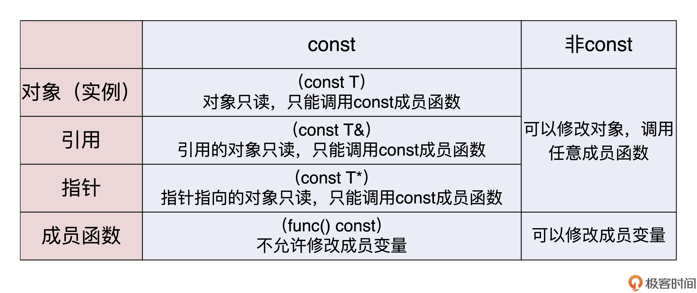
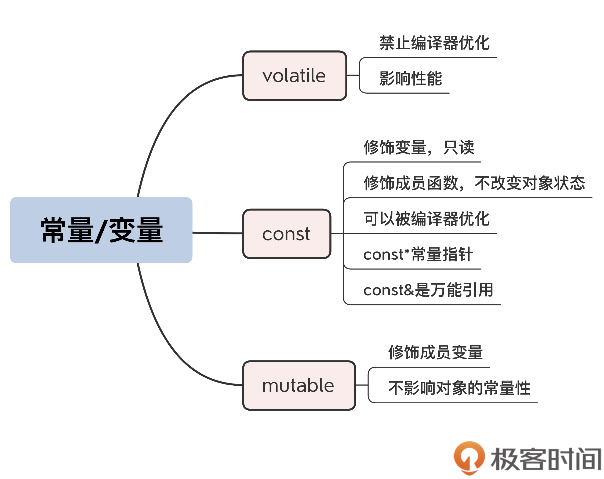
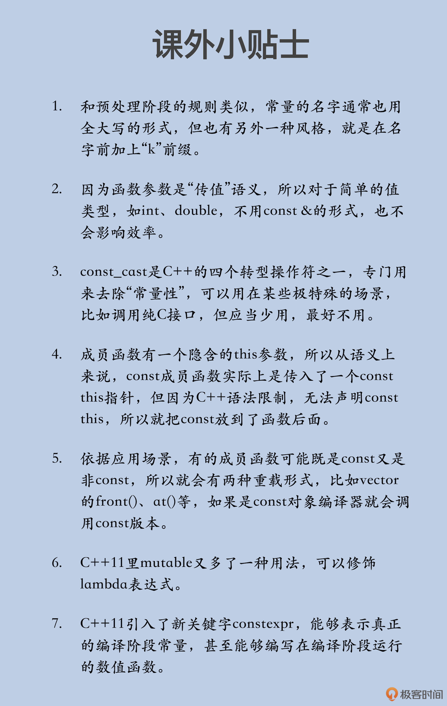

# const/volatile/mutable：常量/变量究竟是怎么回事？

你好，我是 Chrono。

上节课我讲了自动类型推导，提到 auto 推导出的类型可以附加 const、volatile 修饰（通常合称为“cv 修饰符”）。别看就这么两个关键字，里面的“门道”其实挺多的，用好了可以让你的代码更安全、运行得更快。今天我就来说说它们俩，以及比较少见的另一个关键字 mutable。

## const 与 volatile 

先来看 **const** 吧，你一定对它很熟悉了。正如它的字面含义，表示“常量”。最简单的用法就是，**定义程序用到的数字、字符串常量，代替宏定义**。

```cpp
const int MAX_LEN       = 1024;
const std::string NAME  = "metroid";
```

但如果我们从 C++ 程序的生命周期角度来看的话，就会发现，它和宏定义还是有本质区别的：**const 定义的常量在预处理阶段并不存在，而是直到运行阶段才会出现**。

所以，准确地说，它实际上是运行时的“变量”，只不过不允许修改，是“只读”的（read only），叫“只读变量”更合适。

既然它是“变量”，那么，使用指针获取地址，再“强制”写入也是可以的。但这种做法破坏了“常量性”，绝对不提倡。这里，我只是给你做一个示范性质的实验，还要用到另外一个关键字 volatile。

```cpp
// 需要加上volatile修饰，运行时才能看到效果
const volatile int MAX_LEN  = 1024;
auto ptr = (int*)(&MAX_LEN);
*ptr = 2048;
cout << MAX_LEN << endl;      // 输出2048
```

可以看到，这段代码最开始定义的常数是 1024，但是输出的却是 2048。

你可能注意到了，const 后面多出了一个 volatile 的修饰，它是这段代码的关键。如果没有这个 volatile，那么，即使用指针得到了常量的地址，并且尝试进行了各种修改，但输出的仍然会是常数 1024。

这是为什么呢？

因为“真正的常数”对于计算机来说有特殊意义，它是绝对不变的，所以编译器就要想各种办法去优化。

const 常量虽然不是“真正的常数”，但在大多数情况下，它都可以被认为是常数，在运行期间不会改变。编译器看到 const 定义，就会采取一些优化手段，比如把所有 const 常量出现的地方都替换成原始值。

所以，对于没有 volatile 修饰的 const 常量来说，虽然你用指针改了常量的值，但这个值在运行阶段根本没有用到，因为它在编译阶段就被优化掉了。

现在就来看看 **volatile** 的作用。

它的含义是“不稳定的”“易变的”，在 C++ 里，表示变量的值可能会以“难以察觉”的方式被修改（比如操作系统信号、外界其他的代码），所以要禁止编译器做任何形式的优化，每次使用的时候都必须“老老实实”地去取值。

现在，再去看刚才的那段示例代码，你就应该明白了。MAX_LEN 虽然是个“只读变量”，但加上了 volatile 修饰，就表示它不稳定，可能会悄悄地改变。编译器在生成二进制机器码的时候，不会再去做那些可能有副作用的优化，而是用最“保守”的方式去使用 MAX_LEN。

也就是说，编译器不会再把 MAX_LEN 替换为 1024，而是去内存里取值（而它已经通过指针被强制修改了）。所以，这段代码最后输出的是 2048，而不是最初的 1024。

看到这里，你是不是也被 const 和 volatile 这两个关键字的表面意思迷惑了呢？我的建议是，你最好把 const 理解成 read only（虽然是“只读”，但在运行阶段没有什么是不可以改变的，也可以强制写入），把变量标记成 const 可以让编译器做更好的优化。

而 volatile 会禁止编译器做优化，所以除非必要，应当少用 volatile，这也是你几乎很少在代码里见到它的原因，我也建议你最好不要用（除非你真的知道变量会如何被“悄悄地”改变）。

## 基本的 const 用法 

作为一个类型修饰符，const 的用途非常多，除了我刚才提到的修饰变量外，下面我再带你看看它的常量引用、常量指针等其他用法。而 volatile 因为比较“危险”，我就不再多说了。

在 C++ 里，除了最基本的值类型，还有引用类型和指针类型，它们加上 const 就成了**常量引用**和**常量指针**：

```java
int x = 100;
const int& rx = x;
const int* px = &x;
```

const &amp; 被称为**万能引用**，也就是说，它可以引用任何类型，即不管是值、指针、左引用还是右引用，它都能“照单全收”。

而且，它还会给变量附加上 const 特性，这样“变量”就成了“常量”，只能读、禁止写。编译器会帮你检查出所有对它的写操作，发出警告，在编译阶段防止有意或者无意的修改。这样一来，const 常量用起来就非常安全了。

因此，**在设计函数的时候，我建议你尽可能地使用它作为入口参数，一来保证效率，二来保证安全**。

const 用于指针的情况会略微复杂一点。常见的用法是，const 放在声明的最左边，表示指向常量的指针。这个其实很好理解，指针指向的是一个“只读变量”，不允许修改：

```cpp
string name = "uncharted";
const string* ps1 = &name; // 指向常量
*ps1 = "spiderman";        // 错误，不允许修改
```

另外一种比较“恶心”的用法是，const 在“*”的右边，表示指针不能被修改，而指向的变量可以被修改：

```cpp
string* const ps2 = &name;  // 指向变量，但指针本身不能被修改
*ps2 = "spiderman";        // 正确，允许修改
```

再进一步，那就是“*”两边都有 const，你看看是什么意思呢：

```cpp
const string* const ps3 = &name;  // 很难看懂
```

实话实说，我对 const 在“*”后面的用法“深恶痛绝”，每次看到这种形式，脑子里都会“绕一下”，实在是太难理解了，似乎感觉到了代码作者“深深的恶意”。

还是那句名言：“代码是给人看的，而不是给机器看的。”

所以，我从来不用“* const”的形式，也建议你最好不要用，而且这种形式在实际开发时也确实没有多大作用（除非你想“炫技”）。如果真有必要，也最好换成其他实现方式，让代码好懂一点，将来的代码维护者会感谢你的。

## 与类相关的 const 用法 

刚才说的 const 用法都是面向过程的，在面向对象里，const 也很有用。

定义 const 成员变量很简单，但你用过 const 成员函数吗？像这样：

```java
class DemoClass final
{
private:
    const long  MAX_SIZE = 256;    // const成员变量
    int         m_value;           // 成员变量
public:
    int get_value() const        // const成员函数
    {
        return m_value;
    }
};
```

注意，这里 const 的用法有点特别。它被放在了函数的后面，表示这个函数是一个“常量”。（如果在前面，就代表返回值是 const int）

“const 成员函数”的意思并不是说函数不可修改。实际上，在 C++ 里，函数并不是变量（lambda 表达式除外），所以，“只读”对于函数来说没有任何意义。它的真正含义是：函数的执行过程是 const 的，不会修改对象的状态（即成员变量），也就是说，**成员函数是一个“只读操作”**。

听起来有点平淡无奇吧，但如果你把它和刚才讲的“常量引用”“常量指针”结合起来，就不一样了。

因为“常量引用”“常量指针”关联的对象是只读、不可修改的，那么也就意味着，对它的任何操作也应该是只读、不可修改的，否则就无法保证它的安全性。所以，编译器会检查 const 对象相关的代码，如果成员函数不是 const，就不允许调用。

这其实也是对“常量”语义的一个自然延伸，既然对象是 const，那么它所有的相关操作也必然是 const。同样，保证了安全之后，编译器确认对象不会变，也可以去做更好的优化。

看到这里，你会不会觉得常量引用、常量指针、常量函数这些概念有些“绕”呢？别担心，我给你总结了一个表格，看了它，以后你写代码的时候就不会晕了。



这方面你还可以借鉴一下标准库，比如 vector，它的 empty()、size()、capacity() 等查看基本属性的操作都是 const 的，而 reserve()、clear()、erase() 则是非 const 的。

## 关键字 mutable 

说到这里，就要牵扯出另一个关键字“**mutable**”了。

mutable 与 volatile 的字面含义有点像，但用法、效果却大相径庭。volatile 可以用来修饰任何变量，而 mutable 却只能修饰类里面的成员变量，表示变量即使是在 const 对象里，也是可以修改的。

换句话说，就是标记为 mutable 的成员不会改变对象的状态，也就是不影响对象的常量性，所以允许 const 成员函数改写 mutable 成员变量。

你是不是有些奇怪：“这个 mutable 好像有点‘多此一举’啊，它有什么用呢？”

在我看来，mutable 像是 C++ 给 const 对象打的一个“补丁”，让它部分可变。因为对象与普通的 int、double 不同，内部会有很多成员变量来表示状态，但因为“封装”特性，外界只能看到一部分状态，判断对象是否 const 应该由这些外部可观测的状态特征来决定。

比如说，对象内部用到了一个 mutex 来保证线程安全，或者有一个缓冲区来暂存数据，再或者有一个原子变量做引用计数……这些属于内部的私有实现细节，外面看不到，变与不变不会改变外界看到的常量性。这时，如果 const 成员函数不允许修改它们，就有点说不过去了。

所以，**对于这些有特殊作用的成员变量，你可以给它加上 mutable 修饰，解除 const 的限制，让任何成员函数都可以操作它**。

```cpp
class DemoClass final
{
private:
    mutable mutex_type  m_mutex;    // mutable成员变量
public:
    void save_data() const          // const成员函数
    {
        // do someting with m_mutex
    }
};
```

不过要当心，mutable 也不要乱用，太多的 mutable 就丧失了 const 的好处。在设计类的时候，我们一定要仔细考虑，和 volatile 一样要少用、慎用。

## 小结 

好了，今天我和你聊了 const、volatile、mutable 这三个关键字，在这里简单小结一下。

1.const

- 它是一个类型修饰符，可以给任何对象附加上“只读”属性，保证安全；

- 它可以修饰引用和指针，“const &”可以引用任何类型，是函数入口参数的最佳类型；

- 它还可以修饰成员函数，表示函数是“只读”的，const 对象只能调用 const 成员函数。

2.volatile

它表示变量可能会被“不被察觉”地修改，禁止编译器优化，影响性能，应当少用。

3.mutable

它用来修饰成员变量，允许 const 成员函数修改，mutable 变量的变化不影响对象的常量性，但要小心不要误用损坏对象。

你今后再写类的时候，就要认真想一想，哪些操作改变了内部状态，哪些操作没改变内部状态，对于只读的函数，就要加上 const 修饰。写错了也不用怕，编译器会帮你检查出来。

总之就是一句话：**尽可能多用 const，让代码更安全。**



这在多线程编程时尤其有用，让编译器帮你检查对象的所有操作，把“只读”属性持续传递出去，避免有害的副作用。

## 课下作业 

最后是课下作业时间，给你留两个思考题：

1. 学完了这节课，你觉得今后应该怎么用 const 呢？

2. 给函数的返回值加上 const，也就是说返回一个常量对象，有什么好处？

欢迎你在留言区写下你的思考和答案，如果觉得文章对你有所帮助，也欢迎把文章分享给你的朋友，我们下节课见。



