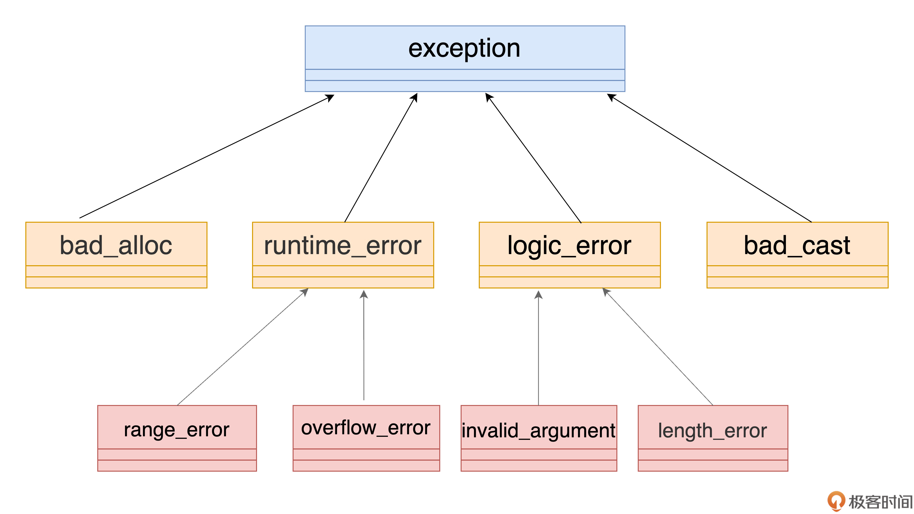

# exception：怎样才能用好异常？

你好，我是 Chrono。

上节课，我建议尽量不用裸指针、new 和 delete，因为它们很危险，容易导致严重错误。这就引出了一个问题，如何正确且优雅地处理运行时的错误。

实际上，想要达成这个目标，还真不是件简单的事情。

程序在运行的时候不可能“一帆风顺”，总会遇到这样那样的内外部故障，而我们写程序的人就要尽量考虑周全，准备各种“预案”，让程序即使遇到问题也能够妥善处理，保证“健壮性”。

C++ 处理错误的标准方案是“异常”（exception）。虽然它已经在 Java、C#、Python 等语言中得到了广泛的认可和应用，但在 C++ 里却存在诸多争议。

你也可能在其他地方听到过一种说法：“**现代 C++ 里应该使用异常**。”但这之后呢？应该怎么去用异常呢？

所以，今天我就和你好好聊聊“异常那些事”，说一说为什么要有异常，该怎么用好异常，有哪些要注意的地方。

## 为什么要有异常？ 

很多人认为，C++ 里的“异常”非常可怕，一旦发生异常就是“了不得的大事”，这其实是因为没有理解异常的真正含义。

实际上，你可以按照它的字面意思，把它理解成“**异于正常**”，就是正常流程之外发生的一些特殊情况、严重错误。一旦遇到这样的错误，程序就会跳出正常流程，甚至很难继续执行下去。

归根到底，**异常只是 C++ 为了处理错误而提出的一种解决方案，当然也不会是唯一的一种**。

在 C++ 之前，处理异常的基本手段是“错误码”。函数执行后，需要检查返回值或者全局的 errno，看是否正常，如果出错了，就执行另外一段代码处理错误：

```java
int n = read_data(fd, ...);    // 读取数据
if (n == 0) {
  ...                    // 返回值不太对，适当处理
}
if (errno == EAGAIN) {
  ...                    // 适当处理错误
}
```

这种做法很直观，但也有一个问题，那就是**正常的业务逻辑代码与错误处理代码混在了一起**，看起来很乱，你的思维要在两个本来不相关的流程里来回跳转。而且，有的时候，错误处理的逻辑要比正常业务逻辑复杂、麻烦得多，看了半天，你可能都会忘了它当初到底要干什么了，容易引起新的错误。（你可以对比一下预处理代码与 C++ 代码混在一起的情景。）

错误码还有另一个更大的问题：**它是可以被忽略的**。也就是说，你完全可以不处理错误，“假装”程序运行正常，继续跑后面的代码，这就可能导致严重的安全隐患。（可能是无意的，因为你确实不知道发生了什么错误。）

“没有对比就没有伤害”，现在你就应该明白了，作为一种新的错误处理方式，异常就是针对错误码的缺陷而设计的，它有三个特点。

1. **异常的处理流程是完全独立的**，throw 抛出异常后就可以不用管了，错误处理代码都集中在专门的 catch 块里。这样就彻底分离了业务逻辑与错误逻辑，看起来更清楚。

2. **异常是绝对不能被忽略的，必须被处理**。如果你有意或者无意不写 catch 捕获异常，那么它会一直向上传播出去，直至找到一个能够处理的 catch 块。如果实在没有，那就会导致程序立即停止运行，明白地提示你发生了错误，而不会“坚持带病工作”。

3. **异常可以用在错误码无法使用的场合**，这也算是 C++ 的“私人原因”。因为它比 C 语言多了构造 / 析构函数、操作符重载等新特性，有的函数根本就没有返回值，或者返回值无法表示错误，而全局的 errno 实在是“太不优雅”了，与 C++ 的理念不符，所以也必须使用异常来报告错误。

记住这三个关键点，是在 C++ 里用好异常的基础，它们能够帮助你在本质上理解异常的各种用法。

## 异常的用法和使用方式 

C++ 里异常的用法想必你已经知道了：**用 try 把可能发生异常的代码“包”起来，然后编写 catch 块捕获异常并处理**。

刚才的错误码例子改用异常，就会变得非常干净清晰：

```java
try
{
  int n = read_data(fd, ...);    // 读取数据，可能抛出异常
  
  ...                         // do some right thing
  
catch(...)
{
    ...                       // 集中处理各种错误情况
}
```

基本的 try-catch 谁都会写，那么，怎样才能用好异常呢？

首先你要知道，C++ 里对异常的定义非常宽松，任何类型都可以用 throw 抛出，也就是说，你可以直接把错误码（int）、或者错误消息（char*、string）抛出，catch 也能接住，然后处理。

但我建议你最好不要“图省事”，因为 C++ 已经为处理异常设计了一个配套的异常类型体系，定义在标准库的 &lt;stdexcept&gt; 头文件里。

下面我画了个简单的示意图，你可以看一下。



标准异常的继承体系有点复杂，最上面是基类 exception，下面是几个基本的异常类型，比如 bad_alloc、bad_cast、runtime_error、logic_error，再往下还有更细致的错误类型，像 runtime_error 就有 range_error、overflow_error，等等。

我在[第 5 节课](第 5 节课)讲过，如果继承深度超过三层，就说明有点“过度设计”，很明显现在就有这种趋势了。所以，我建议你最好选择上面的第一层或者第二层的某个类型作为基类，不要再加深层次。

比如说，你可以从 runtime_error 派生出自己的异常类：

```cpp
class my_exception : public std::runtime_error
{
public:
    using this_type     = my_exception;        // 给自己起个别名
    using super_type    = std::runtime_error;  // 给父类也起个别名
public:
    my_exception(const char* msg):            // 构造函数
        super_type(msg)                      // 别名也可以用于构造
    {}  
    my_exception() = default;                // 默认构造函数
   ~my_exception() = default;                // 默认析构函数
private:
    int code = 0;                            // 其他的内部私有数据
};
```

在抛出异常的时候，我建议你最好不要直接用 throw 关键字，而是要封装成一个函数，这和不要直接用 new、delete 关键字是类似的道理——**通过引入一个“中间层”来获得更多的可读性、安全性和灵活性**。

抛异常的函数不会有返回值，所以应该用[第 4 节课](第 4 节课)里的“属性”做编译阶段优化：

```java
[[noreturn]]                      // 属性标签
void raise(const char* msg)      // 函数封装throw，没有返回值
{
    throw my_exception(msg);     // 抛出异常，也可以有更多的逻辑
}
```

使用 catch 捕获异常的时候也要注意，C++ 允许编写多个 catch 块，捕获不同的异常，再分别处理。但是，**异常只能按照 catch 块在代码里的顺序依次匹配，而不会去找最佳匹配**。

这个特性导致实际开发的时候有点麻烦，特别是当异常类型体系比较复杂的时候，有可能会因为写错了顺序，进入你本不想进的 catch 块。所以，**我建议你最好只用一个 catch 块，绕过这个“坑”**。

写 catch 块就像是写一个标准函数，所以入口参数也应当使用“const &amp;”的形式，避免对象拷贝的代价：

```cpp
try
{
    raise("error occured");     // 函数封装throw，抛出异常
}
catch(const exception& e)      // const &捕获异常，可以用基类
{
    cout << e.what() << endl;  // what()是exception的虚函数
}
```

关于 try-catch，还有一个很有用的形式：**function-try。**我一直都觉得非常奇怪的是，这个形式如此得简单清晰，早在 C++98 的时候就已经出现了，但知道的人却非常少。

所谓 function-try，就是把整个函数体视为一个大 try 块，而 catch 块放在后面，与函数体同级并列，给你看个示例：

```java
void some_function()
try                          // 函数名之后直接写try块
{
    ...
}
catch(...)                   // catch块与函数体同级并列
{
    ...
}
```

这样做的好处很明显，不仅能够捕获函数执行过程中所有可能产生的异常，而且少了一级缩进层次，处理逻辑更清晰，我也建议你多用。

## 谨慎使用异常 

掌握了异常和它的处理方式，下面我结合我自己的经验，和你讨论一下应该在什么时候使用异常来处理错误。

目前的 C++ 世界里有三种使用异常的方式（或者说是观点）。

第一种，是绝不使用异常，就像是 C 语言那样，只用传统的错误码来检查错误。

选择禁止异常的原因当然有很多，有的也很合理，但我觉得这就等于浪费了异常机制，对于改善代码质量没有帮助，属于“**因噎废食**”。

第二种则与第一种相反，主张全面采用异常，所有的错误都用异常的形式来处理。

但你要知道，异常也是有成本的。

异常的抛出和处理需要特别的栈展开（stack unwind）操作，如果异常出现的位置很深，但又没有被及时处理，或者频繁地抛出异常，就会对运行性能产生很大的影响。这个时候，程序全忙着去处理异常了，正常逻辑反而被搁置。

这种观点我认为是“**暴饮暴食**”，也不可取。

所以，第三种方式就是两者的折中：区分“非”错误、“轻微”错误和“严重”错误，谨慎使用异常。我认为这应该算是“**均衡饮食**”。

具体来说，就是要仔细分析程序中可能发生的各种错误情况，按严重程度划分出等级，把握好“度”。

对于正常的返回值，或者不太严重、可以重试 / 恢复的错误，我建议你不使用异常，把它们归到正常的流程里。

比如说字符串未找到（不是错误）、数据格式不对（轻微错误）、数据库正忙（可重试错误），这样的错误比较轻微，而且在业务逻辑里会经常出现，如果你用异常处理，就会“小题大做”，影响性能。

剩下的那些中级、高级错误也不是都必须用异常，你还要再做分析，尽量降低引入异常的成本。

我自己总结了几个应当使用异常的判断准则：

1. 不允许被忽略的错误；

2. 极少数情况下才会发生的错误；

3. 严重影响正常流程，很难恢复到正常状态的错误；

4. 无法本地处理，必须“穿透”调用栈，传递到上层才能被处理的错误。

规则听起来可能有点不好理解，我给你举几个例子。

比如说构造函数，如果内部初始化失败，无法创建，那后面的逻辑也就进行不下去了，所以这里就可以用异常来处理。

再比如，读写文件，通常文件系统很少会出错，总会成功，如果用错误码来处理不存在、权限错误等，就显得太啰嗦，这时也应该使用异常。

相反的例子就是 socket 通信。因为网络链路的不稳定因素太多，收发数据失败简直是“家常便饭”。虽然出错的后果很严重，但它出现的频率太高了，使用异常会增加很多的处理成本，为了性能考虑，还是检查错误码重试比较好。

## 保证不抛出异常 

看到这里，你是不是觉得异常是把“双刃剑”呢？优点缺点都有，难以取舍。

有没有什么办法既能享受异常的好处，又不用承担异常的成本呢？

还真有这样的“好事”，毕竟，写 C++ 程序追求的就是性能，所以，C++ 标准就又提出了一个新的编译阶段指令：**noexcept**，但它也有一点局限，不是“万能药”。

noexcept 专门用来修饰函数，告诉编译器：这个函数不会抛出异常。编译器看到 noexcept，就得到了一个“保证”，就可以对函数做优化，不去加那些栈展开的额外代码，消除异常处理的成本。

和 const 一样，noexcept 要放在函数后面：

```cpp
void func_noexcept() noexcept            // 声明绝不会抛出异常
{
    cout << "noexcept" << endl;
}
```

不过你要注意，noexcept 只是做出了一个“不可靠的承诺”，不是“强保证”，编译器无法彻底检查它的行为，标记为 noexcept 的函数也有可能抛出异常：

```cpp
void func_maybe_noexcept() noexcept          // 声明绝不会抛出异常
{
    throw "Oh My God";                    // 但也可以抛出异常
}
```

noexcept 的真正意思是：“我对外承诺不抛出异常，我也不想处理异常，如果真的有异常发生，请让我死得干脆点，直接崩溃（crash、core dump）。”

所以，你也不要一股脑地给所有函数都加上 noexcept 修饰，毕竟，你无法预测内部调用的那些函数是否会抛出异常。

## 小结 

今天的话题是错误处理和异常，因为它实在太大了，想要快速说清、说透实在是“不可能的任务”，我们可以在课后继续讨论。

异常也与上一讲的智能指针密切相关，如果你决定使用异常，为了确保出现异常的时候资源会正确释放，就必须禁用裸指针，改成智能指针，用 RAII 来管理内存。

由于异常出现和处理的时机都不好确定，当前的 C++ 也没有在语言层面提出更好的机制，所以，你还要在编码阶段写好文档和注释，说清楚哪些函数、什么情况下会抛出什么样的异常，应如何处理，加上一些“软约束”。

再简单小结一下今天的内容：

1. 异常是针对错误码的缺陷而设计的，它不能被忽略，而且可以“穿透”调用栈，逐层传播到其他地方去处理；

2. 使用 try-catch 机制处理异常，能够分离正常流程与错误处理流程，让代码更清晰；

3. throw 可以抛出任何类型作为异常，但最好使用标准库里定义的 exception 类；

4. 完全用或不用异常处理错误都不可取，而是应该合理分析，适度使用，降低异常的成本；

5. 关键字 noexcept 标记函数不抛出异常，可以让编译器做更好的优化。

## 课下作业 

最后是课下作业时间，给你留两个思考题：

1. 结合自己的实际情况，谈一下使用异常有什么好处和坏处。

2. 你觉得用好异常还有哪些要注意的地方？

欢迎你在留言区写下你的思考和答案，如果觉得今天的内容对你有所帮助，也欢迎分享给你的朋友，我们下节课见。


