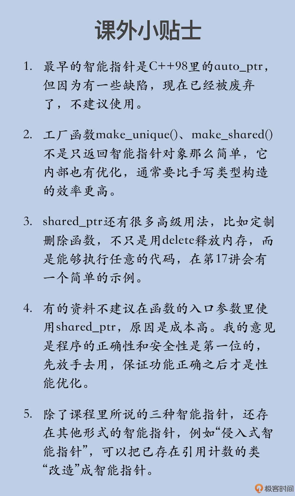

# smart_ptr：智能指针到底“智能”在哪里？

你好，我是 Chrono。

上节课在讲 const 的时候，说到 const 可以修饰指针，不过今天我要告诉你：请忘记这种用法，在现代 C++ 中，绝对不要再使用“裸指针（naked pointer）”了，而是应该使用“智能指针（smart pointer）”。

你肯定或多或少听说过、用过智能指针，也可能看过实现源码，那么，你心里有没有一种疑惑，智能指针到底“智能”在哪里？难道它就是解决一切问题的“灵丹妙药”吗？

学完了今天的这节课，我想你就会有个明确的答案了。

## 什么是智能指针？ 

所谓的“智能指针”，当然是相对于“不智能指针”，也就是“裸指针”而言的。

所以，我们就先来看看裸指针，它有时候也被称为原始指针，或者直接简称为指针。

指针是源自 C 语言的概念，本质上是一个内存地址索引，代表了一小片内存区域（也可能会很大），能够直接读写内存。

因为它完全映射了计算机硬件，所以操作效率高，是 C/C++ 高效的根源。当然，这也是引起无数麻烦的根源。访问无效数据、指针越界，或者内存分配后没有及时释放，就会导致运行错误、内存泄漏、资源丢失等一系列严重的问题。

其他的编程语言，比如 Java、Go 就没有这方面的顾虑，因为它们内置了一个“垃圾回收”机制，会检测不再使用的内存，自动释放资源，让程序员不必为此费心。

其实，C++ 里也是有垃圾回收的，不过不是 Java、Go 那种严格意义上的垃圾回收，而是广义上的垃圾回收，这就是**构造 / 析构函数**和 **RAII 惯用法**（Resource Acquisition Is Initialization）。

我们可以应用代理模式，把裸指针包装起来，在构造函数里初始化，在析构函数里释放。这样当对象失效销毁时，C++ 就会**自动**调用析构函数，完成内存释放、资源回收等清理工作。

和 Java、Go 相比，这算是一种“微型”的垃圾回收机制，而且回收的时机完全“自主可控”，非常灵活。当然也有一点代价——你必须要针对每一个资源手写包装代码，又累又麻烦。

智能指针就是代替你来干这些“脏活累活”的。它完全实践了 RAII，包装了裸指针，而且因为重载了 * 和 -&gt; 操作符，用起来和原始指针一模一样。

不仅如此，它还综合考虑了很多现实的应用场景，能够自动适应各种复杂的情况，防止误用指针导致的隐患，非常“聪明”，所以被称为“智能指针”。

常用的有两种智能指针，分别是 **unique_ptr** 和 **shared_ptr**，下面我就来分别介绍一下。

## 认识 unique_ptr 

unique_ptr 是最简单、最容易使用的一个智能指针，在声明的时候必须用模板参数指定类型：

```cpp
unique_ptr<int> ptr1(new int(10));      // int智能指针
assert(*ptr1 = 10);                     // 可以使用*取内容
assert(ptr1 != nullptr);                // 可以判断是否为空指针
unique_ptr<string> ptr2(new string("hello"));  // string智能指针
assert(*ptr2 == "hello");                // 可以使用*取内容
assert(ptr2->size() == 5);               // 可以使用->调用成员函数
```

你需要注意的是，unique_ptr 虽然名字叫指针，用起来也很像，但**它实际上并不是指针，而是一个对象。所以，不要企图对它调用 delete，它会自动管理初始化时的指针，在离开作用域时析构释放内存。**

另外，它也没有定义加减运算，不能随意移动指针地址，这就完全避免了指针越界等危险操作，可以让代码更安全：

```javascript
ptr1++;                        // 导致编译错误
ptr2 += 2;                     // 导致编译错误
```

除了调用 delete、加减运算，初学智能指针还有一个容易犯的错误是把它当成普通对象来用，不初始化，而是声明后直接使用：

```cpp
unique_ptr<int> ptr3;                // 未初始化智能指针
*ptr3 = 42 ;                         // 错误！操作了空指针
```

未初始化的 unique_ptr 表示空指针，这样就相当于直接操作了空指针，运行时就会产生致命的错误（比如 core dump）。

为了避免这种低级错误，你可以调用工厂函数 **make_unique()**，强制创建智能指针的时候必须初始化。同时还可以利用自动类型推导（[第 6 讲](第 6 讲)）的 auto，少写一些代码：

```cpp
auto ptr3 = make_unique<int>(42);               // 工厂函数创建智能指针
assert(ptr3 && *ptr3 == 42);
auto ptr4 = make_unique<string>("god of war");  // 工厂函数创建智能指针
assert(!ptr4->empty());
```

不过，make_unique() 要求 C++14，好在它的原理比较简单。如果你使用的是 C++11，也可以自己实现一个简化版的 make_unique()，可以参考下面的代码：

```cpp
template<class T, class... Args>              // 可变参数模板
std::unique_ptr<T>                            // 返回智能指针
my_make_unique(Args&&... args)                // 可变参数模板的入口参数
{
    return std::unique_ptr<T>(                // 构造智能指针
            new T(std::forward<Args>(args)...));    // 完美转发
}
```

## unique_ptr 的所有权 

使用 unique_ptr 的时候还要特别注意指针的“**所有权**”问题。

正如它的名字，表示指针的所有权是“唯一”的，不允许共享，任何时候只能有一个“人”持有它。

为了实现这个目的，unique_ptr 应用了 C++ 的“转移”（move）语义，同时禁止了拷贝赋值，所以，在向另一个 unique_ptr 赋值的时候，要特别留意，必须用 **std::move()** 函数显式地声明所有权转移。

赋值操作之后，指针的所有权就被转走了，原来的 unique_ptr 变成了空指针，新的 unique_ptr 接替了管理权，保证所有权的唯一性：

```cpp
auto ptr1 = make_unique<int>(42);    // 工厂函数创建智能指针
assert(ptr1 && *ptr1 == 42);         // 此时智能指针有效
auto ptr2 = std::move(ptr1);         // 使用move()转移所有权
assert(!ptr1 && ptr2);               // ptr1变成了空指针
```

如果你对右值、转移这些概念不是太理解，也没关系，它们用起来也的确比较“微妙”，这里你只要记住，**尽量不要对 unique_ptr 执行赋值操作**就好了，让它“自生自灭”，完全自动化管理。

## 认识 shared_ptr 

接下来要说的是 shared_ptr，它是一个比 unique_ptr 更“智能”的智能指针。

初看上去 shared_ptr 和 unique_ptr 差不多，也可以使用工厂函数来创建，也重载了 * 和 -&gt; 操作符，用法几乎一样——只是名字不同，看看下面的代码吧：

```cpp
shared_ptr<int> ptr1(new int(10));     // int智能指针
assert(*ptr1 = 10);                    // 可以使用*取内容
shared_ptr<string> ptr2(new string("hello"));  // string智能指针
assert(*ptr2 == "hello");                      // 可以使用*取内容
auto ptr3 = make_shared<int>(42);  // 工厂函数创建智能指针
assert(ptr3 && *ptr3 == 42);       // 可以判断是否为空指针
auto ptr4 = make_shared<string>("zelda");  // 工厂函数创建智能指针
assert(!ptr4->empty());                   // 可以使用->调用成员函数
```

但 shared_ptr 的名字明显表示了它与 unique_ptr 的最大不同点：**它的所有权是可以被安全共享的**，也就是说支持拷贝赋值，允许被多个“人”同时持有，就像原始指针一样。

```java
auto ptr1 = make_shared<int>(42);    // 工厂函数创建智能指针
assert(ptr1 && ptr1.unique() );     // 此时智能指针有效且唯一
auto ptr2 = ptr1;                  // 直接拷贝赋值，不需要使用move()
assert(ptr1 && ptr2);              // 此时两个智能指针均有效
assert(ptr1 == ptr2);             // shared_ptr可以直接比较
// 两个智能指针均不唯一，且引用计数为2
assert(!ptr1.unique() && ptr1.use_count() == 2); 
assert(!ptr2.unique() && ptr2.use_count() == 2); 
```

shared_ptr 支持安全共享的秘密在于**内部使用了“引用计数”**。

引用计数最开始的时候是 1，表示只有一个持有者。如果发生拷贝赋值——也就是共享的时候，引用计数就增加，而发生析构销毁的时候，引用计数就减少。只有当引用计数减少到 0，也就是说，没有任何人使用这个指针的时候，它才会真正调用 delete 释放内存。

因为 shared_ptr 具有完整的“值语义”（即可以拷贝赋值），所以，**它可以在任何场合替代原始指针，而不用再担心资源回收的问题**，比如用于容器存储指针、用于函数安全返回动态创建的对象，等等。

## shared_ptr 的注意事项 

那么，既然 shared_ptr 这么好，是不是就可以只用它而不再考虑 unique_ptr 了呢？

答案当然是否定的，不然也就没有必要设计出来多种不同的智能指针了。

虽然 shared_ptr 非常“智能”，但天下没有免费的午餐，它也是有代价的，**引用计数的存储和管理都是成本**，这方面是 shared_ptr 不如 unique_ptr 的地方。

如果不考虑应用场合，过度使用 shared_ptr 就会降低运行效率。不过，你也不需要太担心，shared_ptr 内部有很好的优化，在非极端情况下，它的开销都很小。

另外一个要注意的地方是 **shared_ptr 的销毁动作**。

因为我们把指针交给了 shared_ptr 去自动管理，但在运行阶段，引用计数的变动是很复杂的，很难知道它真正释放资源的时机，无法像 Java、Go 那样明确掌控、调整垃圾回收机制。

你要特别小心对象的析构函数，不要有非常复杂、严重阻塞的操作。一旦 shared_ptr 在某个不确定时间点析构释放资源，就会阻塞整个进程或者线程，“整个世界都会静止不动”（也许用过 Go 的同学会深有体会）。这也是我以前遇到的实际案例，排查起来费了很多功夫，真的是“血泪教训”。

```java
class DemoShared final      //  危险的类，不定时的地雷   
{
public:
    DemoShared() = default;
   ~DemoShared()            // 复杂的操作会导致shared_ptr析构时世界静止
   {
       // Stop The World ...
   }
};
```

shared_ptr 的引用计数也导致了一个新的问题，就是“**循环引用**”，这在把 shared_ptr 作为类成员的时候最容易出现，典型的例子就是**链表节点**。

下面的代码演示了一个简化的场景：

```cpp
class Node final
{
public:
    using this_type     = Node;
    using shared_type   = std::shared_ptr<this_type>;
public:
    shared_type     next;      // 使用智能指针来指向下一个节点
};
auto n1 = make_shared<Node>();   // 工厂函数创建智能指针
auto n2 = make_shared<Node>();   // 工厂函数创建智能指针
assert(n1.use_count() == 1);    // 引用计数为1
assert(n2.use_count() == 1);
n1->next = n2;                 // 两个节点互指，形成了循环引用
n2->next = n1;
assert(n1.use_count() == 2);    // 引用计数为2
assert(n2.use_count() == 2);    // 无法减到0，无法销毁，导致内存泄漏
```

在这里，两个节点指针刚创建时，引用计数是 1，但指针互指（即拷贝赋值）之后，引用计数都变成了 2。

这个时候，shared_ptr 就“犯傻”了，意识不到这是一个循环引用，多算了一次计数，后果就是引用计数无法减到 0，无法调用析构函数执行 delete，最终导致内存泄漏。

这个例子很简单，你一下子就能看出存在循环引用。但在实际开发中，指针的关系可不像例子那么清晰，很有可能会不知不觉形成一个链条很长的循环引用，复杂到你根本无法识别，想要找出来基本上是不可能的。

想要从根本上杜绝循环引用，光靠 shared_ptr 是不行了，必须要用到它的“小帮手”：**weak_ptr**。

weak_ptr 顾名思义，功能很“弱”。它专门为打破循环引用而设计，只观察指针，不会增加引用计数（弱引用），但在需要的时候，可以调用成员函数 lock()，获取 shared_ptr（强引用）。

刚才的例子里，只要你改用 weak_ptr，循环引用的烦恼就会烟消云散：

```cpp
class Node final
{
public:
    using this_type     = Node;
    // 注意这里，别名改用weak_ptr
    using shared_type   = std::weak_ptr<this_type>;
public:
    shared_type     next;    // 因为用了别名，所以代码不需要改动
};
auto n1 = make_shared<Node>();  // 工厂函数创建智能指针
auto n2 = make_shared<Node>();  // 工厂函数创建智能指针
n1->next = n2;             // 两个节点互指，形成了循环引用
n2->next = n1;
assert(n1.use_count() == 1);    // 因为使用了weak_ptr，引用计数为1
assert(n2.use_count() == 1);   // 打破循环引用，不会导致内存泄漏
if (!n1->next.expired()) {     // 检查指针是否有效
    auto ptr = n1->next.lock();  // lock()获取shared_ptr
    assert(ptr == n2);
}
```

## 小结 

好了，今天就先到这里。智能指针的话题很大，但是学习的时候我们不可能一下子把所有知识点都穷尽，而是要有优先级。所以我会捡最要紧的先介绍给你，剩下的接口函数等细节，还是需要你根据自己的情况，再去参考一些其他资料深入学习的。

我们来回顾一下这节课的重点。

1. 智能指针是代理模式的具体应用，它使用 RAII 技术代理了裸指针，能够自动释放内存，无需程序员干预，所以被称为“智能指针”。

2. 如果指针是“独占”使用，就应该选择 unique_ptr，它为裸指针添加了很多限制，更加安全。

3. 如果指针是“共享”使用，就应该选择 shared_ptr，它的功能非常完善，用法几乎与原始指针一样。

4. 应当使用工厂函数 make_unique()、make_shared() 来创建智能指针，强制初始化，而且还能使用 auto 来简化声明。

5. shared_ptr 有少量的管理成本，也会引发一些难以排查的错误，所以不要过度使用。

我还有一个很重要的建议：

**既然你已经理解了智能指针，就尽量不要再使用裸指针、new 和 delete 来操作内存了**。

如果严格遵守这条建议，用好 unique_ptr、shared_ptr，那么，你的程序就不可能出现内存泄漏，你也就不需要去费心研究、使用 valgrind 等内存调试工具了，生活也会更“美好”一点。

## 课下作业 

最后是课下作业时间，给你留两个思考题：

1. 你觉得 unique_ptr 和 shared_ptr 的区别有哪些？列举一下。

2. 你觉得应该如何在程序里“消灭”new 和 delete？

欢迎你在留言区写下你的思考和答案，如果觉得今天的内容对你有所帮助，也欢迎分享给你的朋友，我们下节课见。



