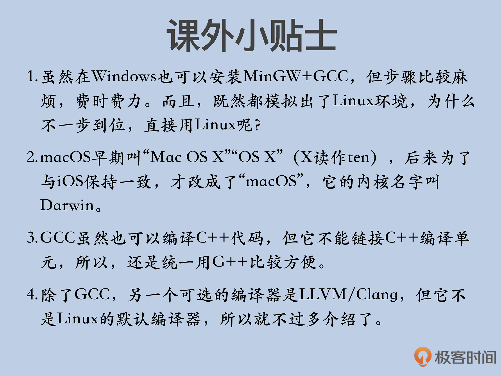

# 搭建实验环境

你好，我是 Chrono。

在开始正式的学习之前，我们需要先做一点准备工作——在自己的电脑上搭建出课程使用的实验环境。

我会给你推荐具体的操作系统、编译器，带你一步步搭建环境，还会给你分享我的[GitHub 链接](GitHub 链接)，之后课程里的所有代码，你都可以在这里找到。

## 操作系统 

首先说一下操作系统。

目前流行的操作系统有三种：Windows、macOS 和 Linux。

Windows 是应用得最广泛的一个系统了，是绝对的主流，但是，作为 C++ 开发环境来说，Windows 并不能算是首选。

一个原因是，Windows 上的标准 C++ 开发工具 Visual Studio 不是免费的，尽管它提供了可自由下载的社区版，但有各种限制（你可以看下社区版和其他版本的[差异](差异)），用来做实验还行，如果要用来开发正式的软件，就不是那么合适了。

另一个更重要的原因是，Windows 现在已经不再是 C++ 的“主战场”了，现在开发 Windows 程序，更多的是用 C#、Java、TypeScript 等其他语言，在 Windows 上写 C++ 程序，很难有大的作为，会有种“英雄无用武之地”的感觉。

macOS 是苹果的专用系统，比较“小众精英”，用户比较少。必须要承认，它是一个很高效易用的开发环境，但也有点“曲高和寡”，不是每个人都能有一台 MacBook 的。而且，macOS 虽然也是 UNIX，但它源自 FreeBSD，内部结构、使用方式与 Linux 有一些差异。

macOS 也有与 Windows 相同的问题，它的官方开发语言是 Objective-C、Swift，几乎没有纯粹使用 C++ 开发出的 Mac 应用。

所以，**我建议你使用 Linux 操作系统**，它是完全自由、免费的系统，不受任何人的控制，开发工具链非常完善，而且，目前差不多所有的商业网站的服务器（当然还有 Android）上跑的都是 Linux，而 C++ 也正好能在开发后台应用服务方面大显身手，两者可谓是“绝配”。

## 编译器 

选好了 Linux 操作系统，接下来就要选择编译器了。

虽然 C++20 马上就要发布了，但现在 C++ 标准的实际普及情况还是相当落后的。据我多年的观察，很多企业因为各式各样的原因，还在用着老旧的操作系统和编译器，别说 C++20 了，连 C++17 都很少用到。

所以，从应用现状出发，我不会使用那么“超前”的标准和编译器，而是选择更贴合实际、更“接地气”的编译器，让你在工作中能够立即用得上，不用苦等操作系统、编译器的升级。

好了，说一下我对编译器的要求：**至少要支持 C++11，支持到 C++14 最好，对再往上的 17/20 则不强求，在今后的课程中，也会尽量不涉及 17/20 里的特性**。

把这几点要求落实到 Linux 上的默认编译器 GCC，就是 4.6 或者是 4.8 版本，越高越好。至于具体版本 GCC 对 C++ 的支持程度，可以在它的[官网](官网)上找到。

GCC 通常是和 Linux 系统绑定在一起的，选编译器也就相当于选择 Linux 的版本。

Linux 也是版本众多，最常见的是 **RedHat 系的 CentOS** 和 **Debian 系的 Ubuntu**。

这两个被很多企业广泛采用，但 CentOS 通常比较“稳定”，更新较慢，像 CentOS 6 一直用的是 GCC 4.4，CentOS 7 也才是 4.8，对 C++ 标准的支持很不完善，极大地限制了 C++ 能力的发挥。

所以，**我建议使用的 Linux 操作系统是 Ubuntu，最低版本是 16.04**。这个系统里的 GCC 版本是 5.4，完美支持 C++11/14。当然，你要是愿意安装更新的 18.04、20.04 也没有问题，它们里面的 GCC 版本更高，支持 C++17，只不过有点“功能过剩”。

## 搭建环境 

确定了操作系统和编译器以后，该去哪里找一个这样的开发环境呢？

你的公司里或许就有现成的 Linux 服务器，可以直接登录上去用，但公司服务器的环境不一定满足刚才说的那几点要求，而且还得小心，别把系统搞乱了，所以，还是弄一个自己的实验环境最保险。

好在如今的虚拟技术非常成熟，只要安装一个虚拟机软件，再去 Ubuntu 官网下载一个光盘镜像，然后按部就班地点点鼠标就行了。

这里我选择的是免费的 VirtualBox，版本任意，Ubuntu 则是[64 位的桌面版](64 位的桌面版)。至于它们俩具体的安装过程，网上有很多资料，而且我相信，即使没有资料，也难不倒你，所以我就不再多说了。

弄好 VirtualBox 和 Ubuntu 环境之后，还有一个小小的“收尾”步骤。

Linux 系统里通常默认只有 GCC，没有 G++，所以还要再执行一个 apt-get 命令：

```javascript
sudo apt-get install g++
```

安装完成后，在命令行里敲一下“g++”命令，看一下它的版本号是否满足我们的要求：

```sql
g++ --version

g++ (Ubuntu 5.4.0-6ubuntu1~16.04.9) 5.4.0 20160609
Copyright (C) 2015 Free Software Foundation, Inc.
```

## GitHub 项目 

和之前的[《透视 HTTP 协议》](《透视 HTTP 协议》)一样，我也在 GitHub 上为这个课程建立了一个项目：[cpp_study](cpp_study)，里面有很多示例代码和有用的资料链接，你可以在 Linux 环境里用“git clone”下载。

不过，说起来不怕你笑话，我写了二十来年的 C++ 程序，但一直不怎么会写 Makefile。都说写 Makefile 是 C++ 程序员的“基本功”，但我在这方面的确是“缺失”了，有点惭愧啊。

最早，我用的是 Windows+VC 自带的工程文件；后来转到 Linux 开发，用的是 Boost 的构建工具 b2（Boost Build v2），写的是 jamfile；再后来又定制开发 Nginx，用的是 Nginx 自成体系的 Shell config。

你看，这么多年来我就基本没正经写过 Makefile，而且也没怎么用过其他的构建工具，比如 cmake、scons。

所以呢，在这个 GitHub 项目里，我也就没有办法提供专门的 Makefile，只能麻烦你在命令行上手动敲 GCC 的编译命令了。好在示例代码都很短很小，没有复杂的依赖关系，简简单单就能搞定，比如：

```cpp
g++ xxx.cpp -std=c++14 -o a.out
```

这里需要注意的是参数“**-std=c++14**”，它告诉编译器，在处理 C++ 代码的时候使用 C++14 标准，而不是 11/17/20。

手敲命令还是挺麻烦的，所以，我在源码文件里还用注释的形式给出了编译命令，你可以直接拷贝粘贴使用，希望能够给你带来一点点的方便。

```javascript
// Copyright (c) 2020 by Chrono
//
// g++ test.cpp -std=c++11 -o a.out;./a.out
// g++ test.cpp -std=c++14 -o a.out;./a.out
// g++ test.cpp -std=c++14 -I../common -o a.out;./a.out
```

在目录“section0”里，有一个最基本的示例程序，如果你能够正确地编译并运行，就说明实验环境搭建成功了。

在我的虚拟机里，这个程序的输出是（使用 -std=c++14）：

```null
c++ version = 201402
gcc version = 5.4.0 20160609
gcc major = 5
gcc minor = 4
gcc patch = 0
libstdc++ = 20160609
```

显示使用的是 C++14 标准，GCC 版本是 5.4.0，标准库版本是 20160609。

当然，如果你是写 Makefile 的高手，欢迎你给这个项目提 Pull Request，让其他同学都能用 make 来轻松地编译代码。

## 小结 

作为正式开课前的“热身工作”，今天我介绍了课程使用的实验环境，简单小结一下：

1. 我们选择的操作系统是 Linux，具体是 Ubuntu 16.04，也可以是更新的版本。

2. 我们选择的编译器是 GCC，最低要求是 4.6 或者 4.8，推荐使用 5.4 或者更高的版本。

3. 使用虚拟机软件搭建环境最方便，完全“自主可控”，推荐使用免费的 VirtualBox。

4. GitHub 上有配套的示例代码和参考资料，可以下载后编译验证环境是否搭建成功。

那么，行动起来吧，下节课让我们在 Linux 上愉快地一起“玩耍”。



