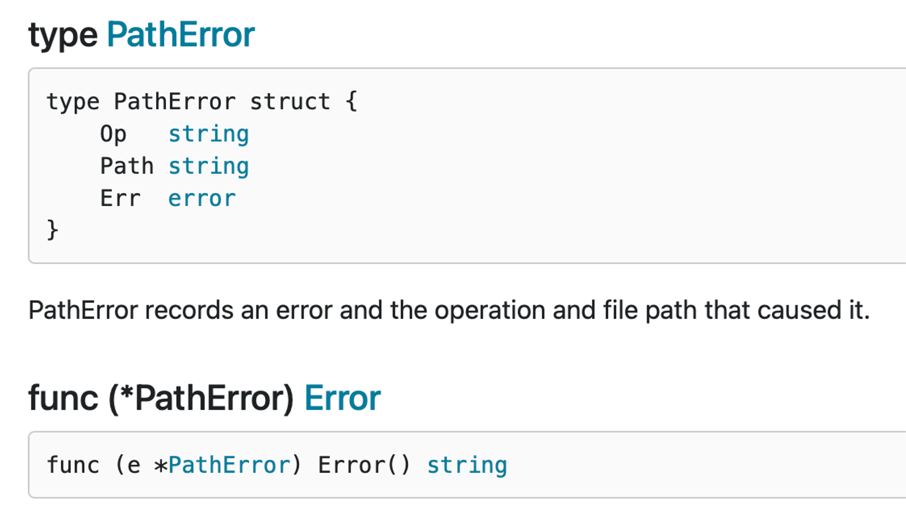

# Error

## Error Vs Exception

### Go中Error的实现

Go语言中`error`就是普通的一个接口，普通的值。

```go
// https://golang.org/src/builtin/builtin.go
type error interface {
	Error() string
}

// https://golang.org/src/errors/errors.go
type errorString struct {
	s string
}

func (e *errorString) Error() string {
	return e.s
}
```

我们经常使用`errors.New()`来返回一个 `error` 对象。

```go
func Sqrt(f float64) (float64, error) {
    if f < 0 {
        return 0, errors.New("math: square root of negative number")
    }
    // 实现
}
```

在下面的例子中，我们在调用Sqrt的时候传递的一个负数，然后就得到了non-nil的error对象，将此对象与nil比较，结果为true，所以fmt.Println(fmt包在处理error时会调用Error方法)被调用，以输出错误，请看下面调用的示例代码：

```go
result, err:= Sqrt(-1)

if err != nil {
   fmt.Println(err)
}
```

在Go的基础库中有大量自定义的`error`。

```go
// https://golang.org/src/bufio/bufio.go
var (
	ErrInvalidUnreadByte = errors.New("bufio: invalid use of UnreadByte")
	ErrInvalidUnreadRune = errors.New("bufio: invalid use of UnreadRune")
	ErrBufferFull        = errors.New("bufio: buffer full")
	ErrNegativeCount     = errors.New("bufio: negative count")
)
```

值得注意的是`errors.New()` 返回的是内部 `errorString` 对象的**指针**。

**如果不返回指针：**

```go
package main

import (
	"errors"
	"fmt"
)

type errorString string;

func (e errorString) Error() string {
	return string(e)
}

func New(text string) error {
	return errorString(text)
}

var ErrNameType = New("EOF");
var ErrStructType = errors.New("EOF");

func main()  {
	if ErrNameType == New("EOF") {
		fmt.Println("Named type Error")
	}

	if ErrStructType == errors.New("EOF") {
		fmt.Println("Struct Type Error")
	}
}
```

输出：`Named type Error`

[深入理解Go之==](https://juejin.cn/post/6844903923166232589#heading-6)

### 异常处理历史发展

**C**

单返回值，一般通过传递指针作为入参，返回值为 int 表示成功还是失败。

```c
ngx_int_t ngx_create_path(ngx_file_t *file, ngx_path_t *path);
```

**C++**

引入了 exception，但是无法知道被调用方会抛出什么异常。

**Java**

引入了 checked exception，方法的所有者必须申明，调用者必须处理。在启动时抛出大量的异常是司空见惯的事情，并在它们的调用堆栈中尽职地记录下来。Java 异常不再是异常，而是变得司空见惯了。它们从良性到灾难性都有使用，异常的严重性由函数的调用者来区分。

**Go**

Go 的处理异常逻辑是不引入 exception，支持多参数返回，所以你很容易的在函数签名中带上实现了 `error` interface 的对象，交由调用者来判定。

**如果一个函数返回了 value, error，你不能对这个 value 做任何假设**，必须先判定 error。唯一可以忽略 error 的是，如果你连 value 也不关心。

Go 中有 panic 的机制，如果你认为和其他语言的 exception 一样，那你就错了。当我们抛出异常的时候，相当于你把 exception 扔给了调用者来处理。

比如，你在 C++ 中，把 string 转为 int，如果转换失败，会抛出异常。或者在 java 中转
换 string 为 date 失败时，会抛出异常。

Go panic 意味着 fatal error(就是挂了)。不能假设调用者来解决 panic，意味着代码不能继续运行。

使用多个返回值和一个简单的约定，Go 解决了让程序员知道什么时候出了问题，并为真正的异常情况保留了 panic。

对于真正意外的情况，那些表示不可恢复的程序错误，例如索引越界、不可恢复的环境问题、栈溢出，我们才使用 panic。对于其他的错误情况，我们应该是期望使用 error 来进行判定。

- 简单。
- 考虑失败，而不是成功(Plan for failure, not success)。
- 没有隐藏的控制流。
- 完全交给你来控制 error。
- Error are values。

## Error Type

### Sentinel Error 哨兵Error

预定义的特定错误，我们叫为 `sentinel error`，这个名字来源于计算机编程中使用一个特定值来表示不可能进行进一步处理的做法。所以对于 Go，我们使用特定的值来表示错误。

`if err == ErrSomething { … }`

类似的 `io.EOF`，更底层的 `syscall.ENOENT`。

使用 sentinel 值是最不灵活的错误处理策略，因为调用方必须使用 == 将结果与预先声明的值进行比较。当您想要提供更多的上下文时，这就出现了一个问题，因为返回一个不同的错误将破坏相等性检查。

甚至是一些有意义的 fmt.Errorf 携带一些上下文，也会破坏调用者的 == ，调用者将被迫查看 error.Error() 方法的输出，以查看它是否与特定的字符串匹配。

- 不依赖检查 error.Error 的输出。

不应该依赖检测 error.Error 的输出，Error 方法存在于 error 接口主要用于方便程序员使用，但不是程序(编写测试可能会依赖这个返回)。这个输出的字符串用于记录日志、输出到 stdout 等。

- Sentinel errors 成为你 API 公共部分。

如果您的公共函数或方法返回一个特定值的错误，那么该值必须是公共的，当然要有文档记录，这会增加 API 的表面积。

如果 API 定义了一个返回特定错误的 interface，则该接口的所有实现都将被限制为仅返回该错误，即使它们可以提供更具描述性的错误。

比如 io.Reader。像 io.Copy 这类函数需要 reader 的实现者比如返回 io.EOF 来告诉调用者没有更多数据了，但这又不是错误。

- Sentinel errors 在两个包之间创建了依赖。

sentinel errors 最糟糕的问题是它们在两个包之间创建了源代码依赖关系。例如，检查错误是否等于 io.EOF，您的代码必须导入 io 包。这个特定的例子听起来并不那么糟糕，因为它非常常见，但是想象一下，当项目中的许多包导出错误值时，存在耦合，项目中的其他包必须导入这些错误值才能检查特定的错误条件(in the form of an import loop)。

- 结论: 尽可能避免 sentinel errors。

我的建议是避免在编写的代码中使用 sentinel errors。在标准库中有一些使用它们的情况，但这不是一个您应该模仿的模式。

### Error使用姿势

#### 姿势1

Error type 是实现了 `error` 接口的自定义类型。例如 `MyError` 类型记录了文件和行号以展示发生了什么。

```go
type MyError struct{
    Msg string
    File string
    line int
}

func(e *MyError) Error() string{
    return fmt.Sprintf("%s:%d:%s",e.File,e.Line,e.Msg);
}

func test() error{
    return &MyError{ "Something happened","server.go",42 }
}
```

因为 `MyError` 是一个 type，调用者可以使用断言转换成这个类型，来获取更多的上下文信息。 

```go
func main(){
    err := test()
    switch err := err.(type){
          case nil:
          // call succeeded,nothing to do
          case *MyError:
              fmt.Println("error occurred on line:" , err.Line)
          default:
          //unknow error
    }
}
```

与错误值相比，错误类型的一大改进是它们能够包装底层错误以提供更多上下文。

一个不错的例子就是 `os.PathError` 他提供了底层执行了什么操作、那个路径出了什么问题。



调用者要使用类型断言和类型 `switch`，就要让自定义的 `error` 变为 public。这种模型会导致和调用者产生强耦合，从而导致 API 变得脆弱。

结论是尽量避免使用 error types，虽然错误类型比 sentinel errors 更好，因为它们可以捕获关于出错的更多上下文，但是 error types 共享 error values 许多相同的问题。

因此，我的建议是避免错误类型，或者至少避免将它们作为公共 API 的一部分。

#### 姿势2

在我看来，这是最灵活的错误处理策略，因为它要求代码和调用者之间的耦合最少。

我将这种风格称为不透明错误处理，因为虽然您知道发生了错误，但您没有能力看到错误的内部。作为调用者，关于操作的结果，您所知道的就是它起作用了，或者没有起作用(成功还是失败)。

这就是不透明错误处理的全部功能–只需返回错误而不假设其内容。

```go
import "github.com/quux/bar"

func fn() err{
    x,err := bar.Foo()
    if err != nil{
        return err
    }
}
```

#### 姿势3

Assert errors for behaviour, not type

在少数情况下，这种二分错误处理方法是不够的。例如，与进程外的世界进行交互(如网络活动)，需要调用方调查错误的性质，以确定重试该操作是否合理。在这种情况下，我们可以断言错误实现了特定的行为，而不是断言错误是特定的类型或值。考虑这个例子：

```go
package net

type Error interface{
    error
    Timeout() bool // Is the error a timeout?
    Temporary() bool // Is the error temporary?
}

if nerr,ok := err.(net.Error); ok && nerr.Temporary(){
    time.Sleep(1e9)
    continue
}

if err != nil{
    log.Fatal(err)
}
```

这里的关键是，这个逻辑可以在不导入定义错误的包或者实际上不了解 err 的底层类型的情况下实现——我们只对它的行为感兴趣。

## Handling Error

### 用缩进方式处理错误

`Indented flow is for errors`

无错误的正常流程代码，将成为一条直线，而不是缩进的代码。

```go
f,err := os.Open(path)
if err != nil{
    //handle error
}
//do stuff

f,err := os.Open(path)
if err != nil{
    //handle error
}
//do stuff
```

### 通过消除错误消除错误处理

参考: [Eliminate error handling by eliminating errors](https://lingchao.xin/post/eliminate-error-handling-by-eliminating-errors.html)

下面的代码：

```go
func AuthenticateRequest(r *Request) error{
    err := authenticate(r.User)
    if err != nil {
        return err
    }
    return nil
}
```

```go
func AuthenticateRequest(r *Request) error{
    return authenticate(r.User)
}
```

### Wrap errors

还记得之前我们 `auth` 的代码吧，如果 `authenticate` 返回错误，则 `AuthenticateRequest` 会将错误返回给调用方，调用者可能也会这样做，依此类推。在程序的顶部，程序的主体将把错误打印到屏幕或日志文件中，打印出来的只是：没有这样的文件或目录。

没有生成错误的 `file:line` 信息。没有导致错误的调用堆栈的堆栈跟踪。这段代码的作者将被迫进行长时间的代码分割，以发现是哪个代码路径触发了文件未找到错误。

但是正如我们前面看到的，这种模式与 sentinel errors 或 type assertions 的使用不兼容，因为将错误值转换为字符串，将其与另一个字符串合并，然后将其转换回 `fmt.Errorf` 破坏了原始错误，导致等值判定失败。

通过使用 `pkg/errors` 包，您可以向错误值添加上下文，这种方式既可以由人也可以由机器检查。

- 在你的应用代码中，使用 `errors.New` 或者  `errros.Errorf` 返回错误。

```go
func parseArgs(arg []string) error{
    if len(args) < 3 {
        return errors.Errorf("not enough arguments,expected at least")
    }
}
```

- 如果调用其他的函数，通常简单的直接返回。

```go
if err != nil {
    return err
}
```

- 如果和其他库进行协作，考虑使用 `errors.Wrap` 或者 `errors.Wrapf` 保存堆栈信息。同样适用于和标准库协作的时候。 

```go
f,err := os.Open(path)
if err != nil{
    return errors.Wrapf(err, "failed to open %q" , path)
}
```

- 直接返回错误，而不是每个错误产生的地方到处打日志。

- 在程序的顶部或者是工作的 goroutine 顶部(请求入口)，使用 `%+v` 把堆栈详情记录。

```go
func main(){
    err := app.Run()
    if err != nil{
        fmt.Printf("FATAL: %+v\n" , err)
        os.Exit(1)
    }
}
```

- 使用 errors.Cause 获取 root error，再进行和 sentinel error 判定。

### 总结

- Packages that are reusable across many projects only return root error values.

选择 wrap error 是只有 applications 可以选择应用的策略。具有最高可重用性的包只能返回根错误值。此机制与 Go 标准库中使用的相同(kit 库的 sql.ErrNoRows)。

- If the error is not going to be handled, wrap and return up the call stack.

这是关于函数/方法调用返回的每个错误的基本问题。如果函数/方法不打算处理错误，那么用足够的上下文 wrap errors 并将其返回到调用堆栈中。例如，额外的上下文可以是使用的输入参数或失败的查询语句。确定您记录的上下文是足够多还是太多的一个好方法是检查日志并验证它们在开发期间是否为您工作。

- Once an error is handled, it is not allowed to be passed up the call stack any longer.

一旦确定函数/方法将处理错误，错误就不再是错误。如果函数/方法仍然需要发出返回，则它不能返回错误值。它应该只返回零(比如降级处理中，你返回了降级数据，然后需要 return nil)。

## Go 2 Error Inspection

[https://go.googlesource.com/proposal/+/master/design/29934-error-values.md](https://go.googlesource.com/proposal/+/master/design/29934-error-values.md)