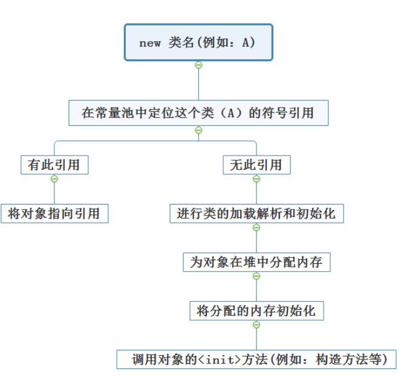
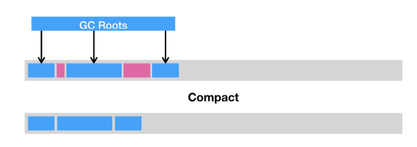
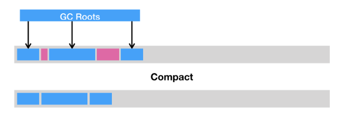
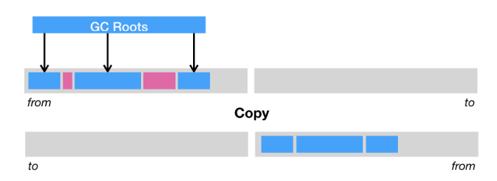
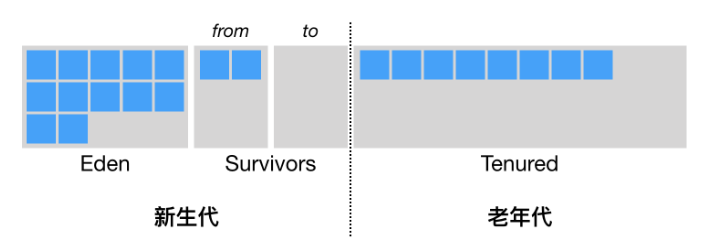

# 自动内存管理机制

## 运行时数据区域


###  程序计数器 
&#160; &#160; &#160; &#160;程序计数器（Program Counter Register）是一块较小的内存空间，它可以看作是当前线程所执行的字节码的行号指示器。在虚拟机的概念模型里（仅是概念模型，各种虚拟机可能会通过一些更高效的方式去实现），字节码解释器工作时就是通过改变这个数器的值来选取下一条需要执行的字节码指令，分支、循环、跳转、异常处理、线程恢复等基础功能都需较小的区域，可以看作当前线程执行的字节码的行号指示器，且每个线程都有自己独立的程序计数器。此区域没有规定内存溢出的情况，因为**我们开发人员不会操作到此区域**。

### Java虚拟机栈

&#160; &#160; &#160; &#160;在运行过程中，每当调用进入一个 Java 方法，Java 虚拟机会在当前线程的 Java 方法栈中生成一个栈帧，用以存放局部变量以及字节码的操作数。这个栈帧的大小是提前计算好的，而且 Java 虚拟机不要求栈帧在内存空间里连续分布。

&#160; &#160; &#160; &#160;当退出当前执行的方法时，不管是正常返回还是异常返回，Java 虚拟机均会弹出当前线程的当前栈帧，并将之舍弃。

&#160; &#160; &#160; &#160;举例：若A方法中调用了B方法，创建A的栈帧，进入栈，开始执行A方法，执行到A调用B的时候，创建B的栈帧，进入栈，开始执行B方法，B方法执行完毕后，B的栈帧出栈，随后被销毁。A方法继续执行余下部分，直至执行完毕，A的栈帧出栈，随后被销毁。

&#160; &#160; &#160; &#160;在使用递归的时候，如果处理不好临界值，很容易就会出现栈内存溢出问题（StackOverFlow）。

### 本地方法栈

&#160; &#160; &#160; &#160;为虚拟机执行native方法服务（Native Method就是一个java调用非java代码的接口。一个Native Method是这样一个java的方法：定义被native关键字修饰的接口，该接口的实现由非java语言实现），其他与虚拟机栈完全一致。

### Java堆

&#160; &#160; &#160; &#160;用于存放对象的实例，是垃圾回收器的主要工作区域，分为**新生代**和**老年代**，新生代中又划分Eden区，Survivor1区和Survivor2区，当堆内存不足的时候，就会抛出OutOfMemory异常，我们可以通过-Xms和-Xmx来指定堆内存空间。

### 方法堆

&#160; &#160; &#160; &#160;存储虚拟机加载的类的信息（字段，方法，接口），常量，静态变量以及编译器编译之后的代码。当方法区内存不足的时候，就会抛出OutOfMemory异常。方法区很重要的一部分就是运行时常量池，在类和方法被加载到JVM中，对应的运行时常量池就被创建出来，并非Class文件常量池中的内容才能进入运行时常量池，在运行期间也可将新的常量放入运行时常量池中，比如String的intern方法。

## 虚拟机对象探秘

### 对象的创建

&#160; &#160; &#160; &#160;New 类名 → 根据new的参数在常量池中定位一个类的符号引用 → 如果当前常量池中没有这个符号引用，说明这个类还没有被加载，则进行类的加载，解析和初始化 → 虚拟机为对象在堆中分配内存  →  将分配的内存初始化（不包括对象头） → 调用对象的<init>方法(构造方法等)

```java
String str1 = "abc";
String str2 = "abc";

System.out.println(str1 == str2);

String str3 = new String("abc");

System.out.println(str1 == str3);

System.out.println(str1 == str3.intern());
```



### 对象的结构

#### Header（对象头）
  - 自身运行时数据（Mark Word）
    - 哈希值
    -  GC分代年龄
    - 锁状态标志
    - 线程持有的锁
    - 便向线程ID
    - 偏向时间戳
    
  - 类型指针

    &#160; &#160; &#160; &#160;即对象指向它的类元数据的指针，虚拟机通过这个指针来确定这个对象是哪个类的实例。并不是所有的虚拟机实现都必须在对象数据上保留类型指针，换句话说，查找对象的元数据信息并不一定要经过对象本身。另外，如果对象是一个Java数组，那在对象头中还必须有一块用于记录数组长度的数据，因为虚拟机可以通过普通Java对象的元数据信息确定Java对象的大小，但是从数组的元数据中却无法确定数组的大小。

#### InstanceData实例数据

&#160; &#160; &#160; &#160;实例数据部分是对象真正存储的有效信息，也是在程序代码中所定义的各种类型的字段内容。无论是从父类继承下来的，还是在子类中定义的，都需要记录起来。这部分的存储顺序会受到虚拟机分配策略参数（FicldsAlTlocationStyle）和字段在java源码中定义顺序的影响。HotSpot虚拟机默认的分配策略为longs/doublesints、shorts/clharsbytes）booleans、oops（Ordinary Object Pointers）从分配策略中可以看出，相同宽度的字段总是被分配到一起。在满足这个前提条件的情况下在交类中定义的变量会由现在子类之前。如果CompactFields.参数值为true（默认为true）那么子类之中较窄的变量也可能会插入到父类变量的空隙之中。

#### Padding对齐填充

&#160; &#160; &#160; &#160;对齐填充并不是必然存在的，也没有特别的含义，它仅仅起着占位符的作用。由于-HotSpot VM的自动内存管理系统要求对象起始地址必须是8字节的整数倍，换句话：就是对象的小必须是8字节的整数倍。而对象头部分证好是8字节的倍数（1倍或者2倍），因此，当对象实例数据部分没行对齐时，就需要通过对齐填充来补全。

&#160; &#160; &#160; &#160;默认情况下，Java 虚拟机堆中对象的起始地址需要对齐至 8 的倍数。如果一个对象用不到 8N 个字节，那么空白的那部分空间就浪费掉了。这些浪费掉的空间我们称之为对象间的填充（padding）。

# 垃圾收集器与内存分配策略

## 垃圾收集算法

&#160; &#160; &#160; &#160;垃圾回收，顾名思义，便是将已经分配出去的，但却不再使用的内存回收回来，以便能够再次分配。在 Java 虚拟机的语境下，垃圾指的是死亡的对象所占据的堆空间。

### 标记清除算法

&#160; &#160; &#160; &#160;它的做法是为每个对象添加一个引用计数器，用来统计指向该对象的引用个数。一旦某个对象的引用计数器为 0，则说明该对象已经死亡，便可以被回收了。

&#160; &#160; &#160; &#160;它的具体实现是这样子的：如果有一个引用，被赋值为某一对象，那么将该对象的引用计数器 +1。如果一个指向某一对象的引用，被赋值为其他值，那么将该对象的引用计数器 -1。也就是说，我们需要截获所有的引用更新操作，并且相应地增减目标对象的引用计数器。

&#160; &#160; &#160; &#160;除了需要额外的空间来存储计数器，以及繁琐的更新操作，引用计数法还有一个重大的漏洞，那便是无法处理循环引用对象。

&#160; &#160; &#160; &#160;举个例子，假设对象 a 与 b 相互引用，除此之外没有其他引用指向 a 或者 b。在这种情况下，a 和 b 实际上已经死了，但由于它们的引用计数器皆不为 0，在引用计数法的心中，这两个对象还活着。因此，这些循环引用对象所占据的空间将不可回收，从而造成了内存泄露。

### 可达性分析算法

&#160; &#160; &#160; &#160;这个算法的实质在于将一系列 GC Roots 作为初始的存活对象合集（live set），然后从该合集出发，探索所有能够被该集合引用到的对象，并将其加入到该集合中，这个过程我们也称之为标记（mark）。最终，未被探索到的对象便是死亡的，是可以回收的。

&#160; &#160; &#160; &#160;那么什么是 GC Roots 呢？我们可以暂时理解为由堆外指向堆内的引用，一般而言，GC Roots 包括（但不限于）如下几种：

- Java 方法栈桢中的局部变量；

- 已加载类的静态变量；

- JNI handles；

- 已启动且未停止的 Java 线程。

&#160; &#160; &#160; &#160;可达性分析可以解决引用计数法所不能解决的循环引用问题。举例来说，即便对象 a 和 b 相互引用，只要从 GC Roots 出发无法到达 a 或者 b，那么可达性分析便不会将它们加入存活对象合集之中。

## 垃圾回收算法

### 清除（sweep）

&#160; &#160; &#160; &#160;即把死亡对象所占据的内存标记为空闲内存，并记录在一个空闲列表（free list）之中。当需要新建对象时，内存管理模块便会从该空闲列表中寻找空闲内存，并划分给新建的对象。



&#160; &#160; &#160; &#160;清除这种回收方式的原理及其简单，但是有两个缺点。一是会造成内存碎片。由于 Java 虚拟机的堆中对象必须是连续分布的，因此可能出现总空闲内存足够，但是无法分配的极端情况。

&#160; &#160; &#160; &#160;另一个则是分配效率较低。如果是一块连续的内存空间，那么我们可以通过指针加法（pointer bumping）来做分配。而对于空闲列表，Java 虚拟机则需要逐个访问列表中的项，来查找能够放入新建对象的空闲内存。

### 压缩（compact）

&#160; &#160; &#160; &#160;即把存活的对象聚集到内存区域的起始位置，从而留下一段连续的内存空间。这种做法能够解决内存碎片化的问题，但代价是压缩算法的性能开销。


### 复制（copy）

&#160; &#160; &#160; &#160;即把内存区域分为两等分，分别用两个指针 from 和 to 来维护，并且只是用 from 指针指向的内存区域来分配内存。当发生垃圾回收时，便把存活的对象复制到 to 指针指向的内存区域中，并且交换 from 指针和 to 指针的内容。复制这种回收方式同样能够解决内存碎片化的问题，但是它的缺点也极其明显，即堆空间的使用效率极其低下。


## 分代回收

### Java 虚拟机的堆划分

&#160; &#160; &#160; &#160;前面提到，Java 虚拟机将堆划分为新生代和老年代。其中，新生代又被划分为 Eden 区，以及两个大小相同的 Survivor 区。

&#160; &#160; &#160; &#160;默认情况下，Java 虚拟机采取的是一种动态分配的策略（对应 Java 虚拟机参数 -XX:+UsePSAdaptiveSurvivorSizePolicy），根据生成对象的速率，以及 Survivor 区的使用情况动态调整 Eden 区和 Survivor 区的比例。

&#160; &#160; &#160; &#160;当然，你也可以通过参数 -XX:SurvivorRatio 来固定这个比例。但是需要注意的是，其中一个 Survivor 区会一直为空，因此比例越低浪费的堆空间将越高。




### Java 虚拟机中的垃圾回收器

&#160; &#160; &#160; &#160;针对新生代的垃圾回收器共有三个：Serial，Parallel Scavenge 和 Parallel New。这三个采用的都是标记 - 复制算法。其中，Serial 是一个单线程的，Parallel New 可以看成 Serial 的多线程版本。Parallel Scavenge 和 Parallel New 类似，但更加注重吞吐率。此外，Parallel Scavenge 不能与 CMS 一起使用。

&#160; &#160; &#160; &#160;针对老年代的垃圾回收器也有三个：刚刚提到的 Serial Old 和 Parallel Old，以及 CMS。Serial Old 和 Parallel Old 都是标记 - 压缩算法。同样，前者是单线程的，而后者可以看成前者的多线程版本。

&#160; &#160; &#160; &#160;CMS 采用的是标记 - 清除算法，并且是并发的。除了少数几个操作需要 Stop-the-world 之外，它可以在应用程序运行过程中进行垃圾回收。在并发收集失败的情况下，Java 虚拟机会使用其他两个压缩型垃圾回收器进行一次垃圾回收。由于 G1 的出现，CMS 在 Java 9 中已被废弃 。

&#160; &#160; &#160; &#160;G1（Garbage First）是一个横跨新生代和老年代的垃圾回收器。实际上，它已经打乱了前面所说的堆结构，直接将堆分成极其多个区域。每个区域都可以充当 Eden 区、Survivor 区或者老年代中的一个。它采用的是标记 - 压缩算法，而且和 CMS 一样都能够在应用程序运行过程中并发地进行垃圾回收。

&#160; &#160; &#160; &#160;G1 能够针对每个细分的区域来进行垃圾回收。在选择进行垃圾回收的区域时，它会优先回收死亡对象较多的区域。这也是 G1 名字的由来。

# 虚拟机类加载机制

## 类加载过程

### 加载（双亲委派机制）

&#160; &#160; &#160; &#160;加载，是指查找字节流，并且据此创建类的过程。前面提到，对于数组类来说，它并没有对应的字节流，而是由 Java 虚拟机直接生成的。对于其他的类来说，Java 虚拟机则需要借助类加载器来完成查找字节流的过程。

&#160; &#160; &#160; &#160;以盖房子为例，村里的 Tony 要盖个房子，那么按照流程他得先找个建筑师，跟他说想要设计一个房型，比如说“一房、一厅、四卫”。你或许已经听出来了，这里的房型相当于类，而建筑师，就相当于类加载器。

&#160; &#160; &#160; &#160;村里有许多建筑师，他们等级森严，但有着共同的祖师爷，叫启动类加载器（boot class loader）。启动类加载器是由 C++ 实现的，没有对应的 Java 对象，因此在 Java 中只能用 null 来指代。换句话说，祖师爷不喜欢像 Tony 这样的小角色来打扰他，所以谁也没有祖师爷的联系方式。

&#160; &#160; &#160; &#160;除了启动类加载器之外，其他的类加载器都是 java.lang.ClassLoader 的子类，因此有对应的 Java 对象。这些类加载器需要先由另一个类加载器，比如说启动类加载器，加载至 Java 虚拟机中，方能执行类加载。

&#160; &#160; &#160; &#160;村里的建筑师有一个潜规则，就是接到单子自己不能着手干，得先给师傅过过目。师傅不接手的情况下，才能自己来。在 Java 虚拟机中，这个潜规则有个特别的名字，叫双亲委派模型。每当一个类加载器接收到加载请求时，它会先将请求转发给父类加载器。在父类加载器没有找到所请求的类的情况下，该类加载器才会尝试去加载。

&#160; &#160; &#160; &#160;在 Java 9 之前，启动类加载器负责加载最为基础、最为重要的类，比如存放在 JRE 的 lib 目录下 jar 包中的类（以及由虚拟机参数 -Xbootclasspath 指定的类）。除了启动类加载器之外，另外两个重要的类加载器是扩展类加载器（extension class loader）和应用类加载器（application class loader），均由 Java 核心类库提供。

&#160; &#160; &#160; &#160;扩展类加载器的父类加载器是启动类加载器。它负责加载相对次要、但又通用的类，比如存放在 JRE 的 lib/ext 目录下 jar 包中的类（以及由系统变量 java.ext.dirs 指定的类）。

&#160; &#160; &#160; &#160;应用类加载器的父类加载器则是扩展类加载器。它负责加载应用程序路径下的类。（这里的应用程序路径，便是指虚拟机参数 -cp/-classpath、系统变量 java.class.path 或环境变量 CLASSPATH 所指定的路径。）默认情况下，应用程序中包含的类便是由应用类加载器加载的。

&#160; &#160; &#160; &#160;Java 9 引入了模块系统，并且略微更改了上述的类加载器[1](https://docs.oracle.com/javase/9/migrate/toc.htm#JSMIG-GUID-A868D0B9-026F-4D46-B979-901834343F9E)。扩展类加载器被改名为平台类加载器（platform class loader）。Java SE 中除了少数几个关键模块，比如说 java.base 是由启动类加载器加载之外，其他的模块均由平台类加载器所加载。

&#160; &#160; &#160; &#160;除了由 Java 核心类库提供的类加载器外，我们还可以加入自定义的类加载器，来实现特殊的加载方式。举例来说，我们可以对 class 文件进行加密，加载时再利用自定义的类加载器对其解密。

&#160; &#160; &#160; &#160;除了加载功能之外，类加载器还提供了命名空间的作用。这个很好理解，打个比方，咱们这个村不讲究版权，如果你剽窃了另一个建筑师的设计作品，那么只要你标上自己的名字，这两个房型就是不同的。

&#160; &#160; &#160; &#160;在 Java 虚拟机中，类的唯一性是由类加载器实例以及类的全名一同确定的。即便是同一串字节流，经由不同的类加载器加载，也会得到两个不同的类。在大型应用中，我们往往借助这一特性，来运行同一个类的不同版本。

### 链接

&#160; &#160; &#160; &#160;链接，是指将创建成的类合并至 Java 虚拟机中，使之能够执行的过程。它可分为验证、准备以及解析三个阶段。

&#160; &#160; &#160; &#160;验证阶段的目的，在于确保被加载类能够满足 Java 虚拟机的约束条件。这就好比 Tony 需要将设计好的房型提交给市政部门审核。只有当审核通过，才能继续下面的建造工作。

&#160; &#160; &#160; &#160;通常而言，Java 编译器生成的类文件必然满足 Java 虚拟机的约束条件。

&#160; &#160; &#160; &#160;准备阶段的目的，则是为被加载类的静态字段分配内存。Java 代码中对静态字段的具体初始化，则会在稍后的初始化阶段中进行。过了这个阶段，咱们算是盖好了毛坯房。虽然结构已经完整，但是在没有装修之前是不能住人的。

&#160; &#160; &#160; &#160;除了分配内存外，部分 Java 虚拟机还会在此阶段构造其他跟类层次相关的数据结构，比如说用来实现虚方法的动态绑定的方法表。

&#160; &#160; &#160; &#160;在 class 文件被加载至 Java 虚拟机之前，这个类无法知道其他类及其方法、字段所对应的具体地址，甚至不知道自己方法、字段的地址。因此，每当需要引用这些成员时，Java 编译器会生成一个符号引用。在运行阶段，这个符号引用一般都能够无歧义地定位到具体目标上。

&#160; &#160; &#160; &#160;举例来说，对于一个方法调用，编译器会生成一个包含目标方法所在类的名字、目标方法的名字、接收参数类型以及返回值类型的符号引用，来指代所要调用的方法。

&#160; &#160; &#160; &#160;解析阶段的目的，正是将这些符号引用解析成为实际引用。如果符号引用指向一个未被加载的类，或者未被加载类的字段或方法，那么解析将触发这个类的加载（但未必触发这个类的链接以及初始化。）

&#160; &#160; &#160; &#160;如果将这段话放在盖房子的语境下，那么符号引用就好比“Tony 的房子”这种说法，不管它存在不存在，我们都可以用这种说法来指代 Tony 的房子。实际引用则好比实际的通讯地址，如果我们想要与 Tony 通信，则需要启动盖房子的过程。

&#160; &#160; &#160; &#160;Java 虚拟机规范并没有要求在链接过程中完成解析。它仅规定了：如果某些字节码使用了符号引用，那么在执行这些字节码之前，需要完成对这些符号引用的解析。

### 初始化

&#160; &#160; &#160; &#160;在 Java 代码中，如果要初始化一个静态字段，我们可以在声明时直接赋值，也可以在静态代码块中对其赋值。

&#160; &#160; &#160; &#160;如果直接赋值的静态字段被 final 所修饰，并且它的类型是基本类型或字符串时，那么该字段便会被 Java 编译器标记成常量值（ConstantValue），其初始化直接由 Java 虚拟机完成。除此之外的直接赋值操作，以及所有静态代码块中的代码，则会被 Java 编译器置于同一方法中，并把它命名为 < clinit >。

&#160; &#160; &#160; &#160;类加载的最后一步是初始化，便是为标记为常量值的字段赋值，以及执行 < clinit > 方法的过程。Java 虚拟机会通过加锁来确保类的 < clinit > 方法仅被执行一次。

&#160; &#160; &#160; &#160;只有当初始化完成之后，类才正式成为可执行的状态。这放在我们盖房子的例子中就是，只有当房子装修过后，Tony 才能真正地住进去。

## 类加载时机

&#160; &#160; &#160; &#160;那么，类的初始化何时会被触发呢？JVM 规范枚举了下述多种触发情况：

1. 当虚拟机启动时，初始化用户指定的主类；
2. 当遇到用以新建目标类实例的 new 指令时，初始化 new 指令的目标类；
3. 当遇到调用静态方法的指令时，初始化该静态方法所在的类；
4. 当遇到访问静态字段的指令时，初始化该静态字段所在的类；
5. 子类的初始化会触发父类的初始化；
6. 如果一个接口定义了 default 方法，那么直接实现或者间接实现该接口的类的初始化，会触发该接口的初始化；
7. 使用反射 API 对某个类进行反射调用时，初始化这个类；
8. 当初次调用 MethodHandle 实例时，初始化该 MethodHandle 指向的方法所在的类。

