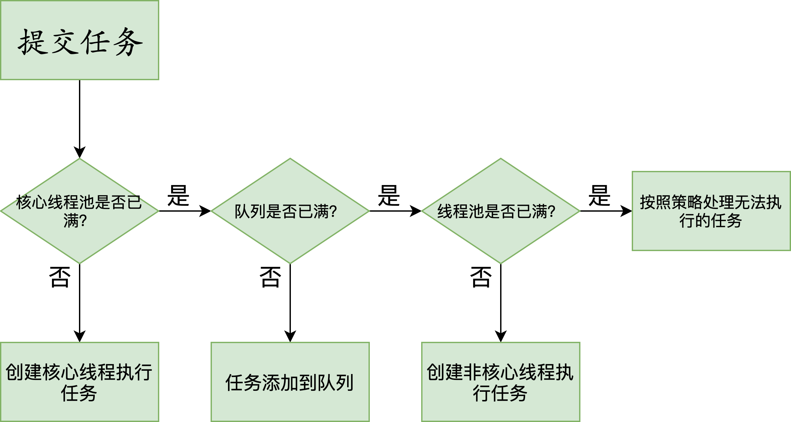
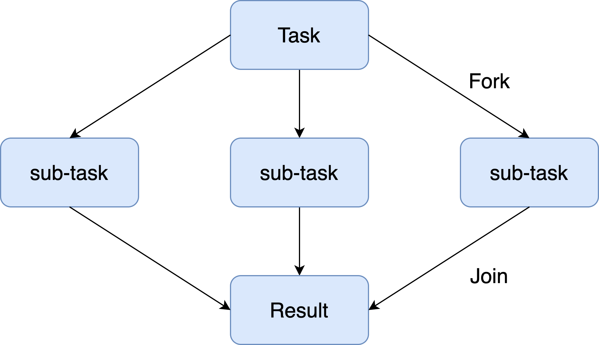
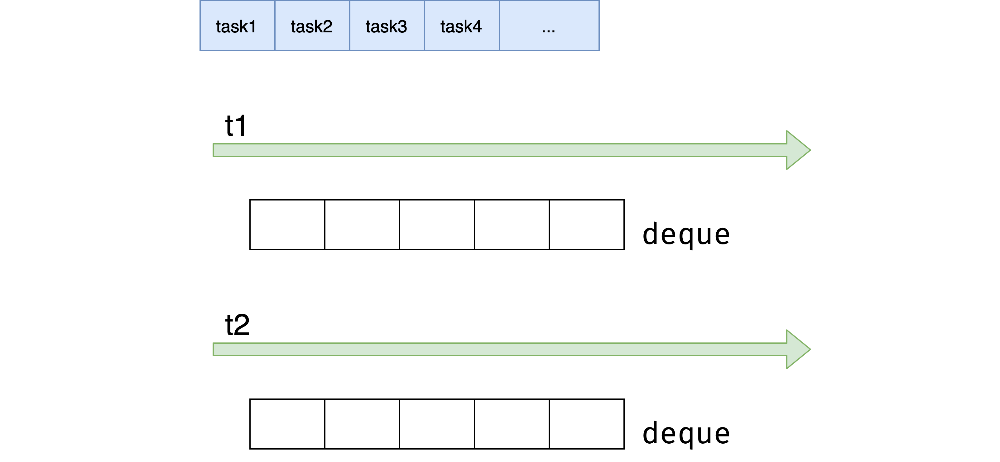

# 线程池

## 使用线程池比手动创建线程好在哪里？

### 为什么要使用线程池

如果我们的任务量突然飙升到 10000 会怎么样？我们先来看看依然用 for 循环的实现方式：

```java
for (int i = 0; i < 10000; i++) { 
    Thread thread = new Thread(new Task());
    thread.start();
}
```

创建线程时会产生系统开销，并且每个线程还会占用一定的内存等资源，更重要的是我们创建如此多的线程也会给稳定性带来危害，因为每个系统中，可创建线程的数量是有一个上限的，不可能无限的创建。线程执行完需要被回收，大量的线程又会给垃圾回收带来压力。但我们的任务确实非常多，如果都在主线程串行执行，那效率也太低了，那应该怎么办呢？于是便诞生了线程池来平衡线程与系统资源之间的关系。

我们来总结下如果每个任务都创建一个线程会带来哪些问题：

- 第一点，反复创建线程系统开销比较大，每个线程创建和销毁都需要时间，如果任务比较简单，那么就有可能导致创建和销毁线程消耗的资源比线程执行任务本身消耗的资源还要大。
- 第二点，过多的线程会占用过多的内存等资源，还会带来过多的上下文切换，同时还会导致系统不稳定。

### 线程池解决问题思路

针对上面的两点问题，线程池有两个解决思路。

首先，针对反复创建线程开销大的问题，线程池用一些固定的线程一直保持工作状态并反复执行任务。

其次，针对过多线程占用太多内存资源的问题，解决思路更直接，线程池会根据需要创建线程，控制线程的总数量，避免占用过多内存资源。

#### 如何使用线程池

线程池就好比一个池塘，池塘里的水是有限且可控的，比如我们选择线程数固定数量的线程池，假设线程池有 5 个线程，但此时的任务大于 5 个，线程池会让余下的任务进行排队，而不是无限制的扩张线程数量，保障资源不会被过度消耗。如代码所示，我们往 5 个线程的线程池中放入 10000 个任务并打印当前线程名字，结果会是怎么样呢？

```java
/** 
* 描述：     用固定线程数的线程池执行10000个任务 
*/ 
public class ThreadPoolDemo { 
 
    public static void main(String[] args) { 
        ExecutorService service = Executors.newFixedThreadPool(5);
        for (int i = 0; i < 10000; i++) { 
            service.execute(new Task());
        } 
    System.out.println(Thread.currentThread().getName());
    } 
 
    static class Task implements Runnable { 
 
        public void run() { 
            System.out.println("Thread Name: " + Thread.currentThread().getName());
        } 
    } 
}
```

执行效果：

```
Thread Name: pool-1-thread-1
Thread Name: pool-1-thread-2
Thread Name: pool-1-thread-3
Thread Name: pool-1-thread-4
Thread Name: pool-1-thread-5
Thread Name: pool-1-thread-5
Thread Name: pool-1-thread-5
Thread Name: pool-1-thread-5
Thread Name: pool-1-thread-5
Thread Name: pool-1-thread-2
Thread Name: pool-1-thread-1
Thread Name: pool-1-thread-5
Thread Name: pool-1-thread-3
Thread Name: pool-1-thread-5
 
...
```

如打印结果所示，打印的线程名始终在 Thread Name: pool-1-thread-1~5 之间变化，并没有超过这个范围，也就证明了线程池不会无限制地扩张线程的数量，始终是这5个线程在工作。

#### 使用线程池的好处

使用线程池比手动创建线程主要有三点好处。

- 第一点，线程池可以解决线程生命周期的系统开销问题，同时还可以加快响应速度。因为线程池中的线程是可以复用的，我们只用少量的线程去执行大量的任务，这就大大减小了线程生命周期的开销。而且线程通常不是等接到任务后再临时创建，而是已经创建好时刻准备执行任务，这样就消除了线程创建所带来的延迟，提升了响应速度，增强了用户体验。
- 第二点，线程池可以统筹内存和 CPU 的使用，避免资源使用不当。线程池会根据配置和任务数量灵活地控制线程数量，不够的时候就创建，太多的时候就回收，避免线程过多导致内存溢出，或线程太少导致 CPU 资源浪费，达到了一个完美的平衡。
- 第三点，线程池可以统一管理资源。比如线程池可以统一管理任务队列和线程，可以统一开始或结束任务，比单个线程逐一处理任务要更方便、更易于管理，同时也有利于数据统计，比如我们可以很方便地统计出已经执行过的任务的数量。

## 线程池的各个参数的含义？

### 线程池的参数

|         参数名         | 含义                     |
| :--------------------: | ------------------------ |
|      corePoolSize      | 核心线程数               |
|      maxPoolSize       | 最大线程数               |
| keepAliveTime+时间单位 | 空闲线程的存活时间       |
|     ThreadFactory      | 线程工厂、用来创建新线程 |
|       workQueue        | 用于存放任务队列         |
|        Handler         | 处理被拒绝的任务         |

首先，我们来看下线程池中各个参数的含义，如表所示线程池主要有 6 个参数，其中第 3 个参数由 keepAliveTime + 时间单位组成。我们逐一看下它们各自的含义，corePoolSize 是核心线程数，也就是常驻线程池的线程数量，与它对应的是 maximumPoolSize，表示线程池最大线程数量，当我们的任务特别多而 corePoolSize 核心线程数无法满足需求的时候，就会向线程池中增加线程，以便应对任务突增的情况。

### 线程创建的时机



接下来，我们来具体看下这两个参数所代表的含义，以及线程池中创建线程的时机。如上图所示，当提交任务后，线程池首先会检查当前线程数，如果此时线程数小于核心线程数，比如最开始线程数量为 0，则新建线程并执行任务，随着任务的不断增加，线程数会逐渐增加并达到核心线程数，此时如果仍有任务被不断提交，就会被放入 workQueue 任务队列中，等待核心线程执行完当前任务后重新从 workQueue 中提取正在等待被执行的任务。

此时，假设我们的任务特别的多，已经达到了 workQueue 的容量上限，这时线程池就会启动后备力量，也就是 maximumPoolSize 最大线程数，线程池会在 corePoolSize 核心线程数的基础上继续创建线程来执行任务，假设任务被不断提交，线程池会持续创建线程直到线程数达到 maximumPoolSize 最大线程数，如果依然有任务被提交，这就超过了线程池的最大处理能力，这个时候线程池就会拒绝这些任务，我们可以看到实际上任务进来之后，线程池会逐一判断 corePoolSize、workQueue、maximumPoolSize，如果依然不能满足需求，则会拒绝任务。

#### corePoolSize 与 maximumPoolSize 

通过上面的流程图，我们了解了 corePoolSize 和 maximumPoolSize 的具体含义，corePoolSize 指的是核心线程数，线程池初始化时线程数默认为 0，当有新的任务提交后，会创建新线程执行任务，如果不做特殊设置，此后线程数通常不会再小于 corePoolSize ，因为它们是核心线程，即便未来可能没有可执行的任务也不会被销毁。随着任务量的增加，在任务队列满了之后，线程池会进一步创建新线程，最多可以达到 maximumPoolSize 来应对任务多的场景，如果未来线程有空闲，大于 corePoolSize 的线程会被合理回收。所以正常情况下，线程池中的线程数量会处在 corePoolSize 与 maximumPoolSize 的闭区间内。

#### “长工”与“临时工”

我们可以把 corePoolSize 与 maximumPoolSize 比喻成长工与临时工，通常古代一个大户人家会有几个固定的长工，负责日常的工作，而大户人家起初肯定也是从零开始雇佣长工的。假如长工数量被老爷设定为 5 人，也就对应了 corePoolSize，不管这 5 个长工是忙碌还是空闲，都会一直在大户人家待着，可到了农忙或春节，长工的人手显然就不够用了，这时就需要雇佣更多的临时工，这些临时工就相当于在 corePoolSize 的基础上继续创建新线程，但临时工也是有上限的，也就对应了 maximumPoolSize，随着农忙或春节结束，老爷考虑到人工成本便会解约掉这些临时工，家里工人数量便会从 maximumPoolSize 降到 corePoolSize，所以老爷家的工人数量会一致保持在 corePoolSize 和 maximumPoolSize 的区间。

我们总结出线程池的几个特点。

- 线程池希望保持较少的线程数，并且只有在负载变得很大时才增加线程。

- 线程池只有在任务队列填满时才创建多于 corePoolSize 的线程，如果使用的是无界队列（例如 LinkedBlockingQueue），那么由于队列不会满，所以线程数不会超过 corePoolSize。

- 通过设置 corePoolSize 和 maximumPoolSize 为相同的值，就可以创建固定大小的线程池。

- 通过设置 maximumPoolSize 为很高的值，例如 Integer.MAX_VALUE，就可以允许线程池创建任意多的线程。

### keepAliveTime+时间单位     

第三个参数是 keepAliveTime + 时间单位，当线程池中线程数量多于核心线程数时，而此时又没有任务可做，线程池就会检测线程的 keepAliveTime，如果超过规定的时间，无事可做的线程就会被销毁，以便减少内存的占用和资源消耗。如果后期任务又多了起来，线程池也会根据规则重新创建线程，所以这是一个可伸缩的过程，比较灵活，我们也可以用 setKeepAliveTime 方法动态改变 keepAliveTime 的参数值。

### ThreadFactory   

第四个参数是 ThreadFactory，ThreadFactory 实际上是一个线程工厂，它的作用是生产线程以便执行任务。我们可以选择使用默认的线程工厂，创建的线程都会在同一个线程组，并拥有一样的优先级，且都不是守护线程，我们也可以选择自己定制线程工厂，以方便给线程自定义命名，不同的线程池内的线程通常会根据具体业务来定制不同的线程名。

### workQueue 和 Handler     

最后两个参数是 workQueue 和 Handler，它们分别对应阻塞队列和任务拒绝策略，在后面的课时会对它们进行详细展开讲解。

## 线程池有哪 4 种拒绝策略？

### 拒绝时机

首先，新建线程池时可以指定它的任务拒绝策略，例如：

```java
newThreadPoolExecutor(5, 10, 5, TimeUnit.SECONDS, new LinkedBlockingQueue<>(),
   new ThreadPoolExecutor.DiscardOldestPolicy());
```

以便在必要的时候按照我们的策略来拒绝任务，那么拒绝任务的时机是什么呢？线程池会在以下两种情况下会拒绝新提交的任务。

- 第一种情况是当我们调用 shutdown 等方法关闭线程池后，即便此时可能线程池内部依然有没执行完的任务正在执行，但是由于线程池已经关闭，此时如果再向线程池内提交任务，就会遭到拒绝。
- 第二种情况是线程池没有能力继续处理新提交的任务，也就是工作已经非常饱和的时候。
  

我们具体讲一下第二种情况，也就是由于工作饱和导致的拒绝。比如新建一个线程池，使用容量上限为 10 的 ArrayBlockingQueue 作为任务队列，并且指定线程池的核心线程数为 5，最大线程数为 10，假设此时有 20 个耗时任务被提交，在这种情况下，线程池会首先创建核心数量的线程，也就是5个线程来执行任务，然后往队列里去放任务，队列的 10 个容量被放满了之后，会继续创建新线程，直到达到最大线程数 10。此时线程池中一共有 20 个任务，其中 10 个任务正在被 10 个线程执行，还有 10 个任务在任务队列中等待，而且由于线程池的最大线程数量就是 10，所以已经不能再增加更多的线程来帮忙处理任务了，这就意味着此时线程池工作饱和，这个时候再提交新任务时就会被拒绝。

### 拒绝策略

- 第一种拒绝策略是 AbortPolicy，这种拒绝策略在拒绝任务时，会直接抛出一个类型为 RejectedExecutionException 的 RuntimeException，让你感知到任务被拒绝了，于是你便可以根据业务逻辑选择重试或者放弃提交等策略。

- 第二种拒绝策略是 DiscardPolicy，这种拒绝策略正如它的名字所描述的一样，当新任务被提交后直接被丢弃掉，也不会给你任何的通知，相对而言存在一定的风险，因为我们提交的时候根本不知道这个任务会被丢弃，可能造成数据丢失。

- 第三种拒绝策略是 DiscardOldestPolicy，如果线程池没被关闭且没有能力执行，则会丢弃任务队列中的头结点，通常是存活时间最长的任务，这种策略与第二种不同之处在于它丢弃的不是最新提交的，而是队列中存活时间最长的，这样就可以腾出空间给新提交的任务，但同理它也存在一定的数据丢失风险。

- 第四种拒绝策略是 CallerRunsPolicy，相对而言它就比较完善了，当有新任务提交后，如果线程池没被关闭且没有能力执行，则把这个任务交于提交任务的线程执行，也就是谁提交任务，谁就负责执行任务。这样做主要有两点好处。

    - 第一点新提交的任务不会被丢弃，这样也就不会造成业务损失。
    
    - 第二点好处是，由于谁提交任务谁就要负责执行任务，这样提交任务的线程就得负责执行任务，而执行任务又是比较耗时的，在这段期间，提交任务的线程被占用，也就不会再提交新的任务，减缓了任务提交的速度，相当于是一个负反馈。在此期间，线程池中的线程也可以充分利用这段时间来执行掉一部分任务，腾出一定的空间，相当于是给了线程池一定的缓冲期。

## 有哪 6 种常见的线程池？什么是 Java8 的 ForkJoinPool？

在本课时我们主要学习常见的 6 种线程池，并详细讲解 Java 8 新增的 ForkJoinPool 线程池，6 种常见的线程池如下。

- FixedThreadPool

- CachedThreadPool

- ScheduledThreadPool

- SingleThreadExecutor

- SingleThreadScheduledExecutor

- ForkJoinPool

### FixedThreadPool

第一种线程池叫作 FixedThreadPool，它的核心线程数和最大线程数是一样的，所以可以把它看作是固定线程数的线程池，它的特点是线程池中的线程数除了初始阶段需要从 0 开始增加外，之后的线程数量就是固定的，就算任务数超过线程数，线程池也不会再创建更多的线程来处理任务，而是会把超出线程处理能力的任务放到任务队列中进行等待。而且就算任务队列满了，到了本该继续增加线程数的时候，由于它的最大线程数和核心线程数是一样的，所以也无法再增加新的线程了。

### CachedThreadPool

第二种线程池是 CachedThreadPool，可以称作可缓存线程池，它的特点在于线程数是几乎可以无限增加的（实际最大可以达到 Integer.MAX_VALUE，为 2^31-1，这个数非常大，所以基本不可能达到），而当线程闲置时还可以对线程进行回收。也就是说该线程池的线程数量不是固定不变的，当然它也有一个用于存储提交任务的队列，但这个队列是 SynchronousQueue，队列的容量为0，实际不存储任何任务，它只负责对任务进行中转和传递，所以效率比较高。

当我们提交一个任务后，线程池会判断已创建的线程中是否有空闲线程，如果有空闲线程则将任务直接指派给空闲线程，如果没有空闲线程，则新建线程去执行任务，这样就做到了动态地新增线程。让我们举个例子，如下方代码所示。

```java
ExecutorService service = Executors.newCachedThreadPool();
    for (int i = 0; i < 1000; i++) { 
        service.execute(new Task() { 
    });
 }
```

使用 for 循环提交 1000 个任务给 CachedThreadPool，假设这些任务处理的时间非常长，会发生什么情况呢？因为 for 循环提交任务的操作是非常快的，但执行任务却比较耗时，就可能导致 1000 个任务都提交完了但第一个任务还没有被执行完，所以此时 CachedThreadPool 就可以动态的伸缩线程数量，随着任务的提交，不停地创建 1000 个线程来执行任务，而当任务执行完之后，假设没有新的任务了，那么大量的闲置线程又会造成内存资源的浪费，这时线程池就会检测线程在 60 秒内有没有可执行任务，如果没有就会被销毁，最终线程数量会减为 0。

### ScheduledThreadPool

第三个线程池是 ScheduledThreadPool，它支持定时或周期性执行任务。比如每隔 10 秒钟执行一次任务，而实现这种功能的方法主要有 3 种，如代码所示：

```java
ScheduledExecutorService service = Executors.newScheduledThreadPool(10);
 
service.schedule(new Task(), 10, TimeUnit.SECONDS);
 
service.scheduleAtFixedRate(new Task(), 10, 10, TimeUnit.SECONDS);
 
service.scheduleWithFixedDelay(new Task(), 10, 10, TimeUnit.SECONDS);
```

那么这 3 种方法有什么区别呢？

- 第一种方法 schedule 比较简单，表示延迟指定时间后执行一次任务，如果代码中设置参数为 10 秒，也就是 10 秒后执行一次任务后就结束。

- 第二种方法 scheduleAtFixedRate 表示以固定的频率执行任务，它的第二个参数 initialDelay 表示第一次延时时间，第三个参数 period 表示周期，也就是第一次延时后每次延时多长时间执行一次任务。

- 第三种方法 scheduleWithFixedDelay 与第二种方法类似，也是周期执行任务，区别在于对周期的定义，之前的 scheduleAtFixedRate 是以任务开始的时间为时间起点开始计时，时间到就开始执行第二次任务，而不管任务需要花多久执行；而 scheduleWithFixedDelay 方法以任务结束的时间为下一次循环的时间起点开始计时。

举个例子，假设某个同学正在熬夜写代码，需要喝咖啡来提神，假设每次喝咖啡都需要花10分钟的时间，如果此时采用第2种方法 scheduleAtFixedRate，时间间隔设置为 1 小时，那么他将会在每个整点喝一杯咖啡，以下是时间表：

- 00:00: 开始喝咖啡

- 00:10: 喝完了

- 01:00: 开始喝咖啡

- 01:10: 喝完了

- 02:00: 开始喝咖啡

- 02:10: 喝完了

但是假设他采用第3种方法 scheduleWithFixedDelay，时间间隔同样设置为 1 小时，那么由于每次喝咖啡需要10分钟，而 scheduleWithFixedDelay 是以任务完成的时间为时间起点开始计时的，所以第2次喝咖啡的时间将会在1:10，而不是1:00整，以下是时间表：

- 00:00: 开始喝咖啡

- 00:10: 喝完了

- 01:10: 开始喝咖啡

- 01:20: 喝完了

- 02:20: 开始喝咖啡

- 02:30: 喝完了

### SingleThreadExecutor

第四种线程池是 SingleThreadExecutor，它会使用唯一的线程去执行任务，原理和 FixedThreadPool 是一样的，只不过这里线程只有一个，如果线程在执行任务的过程中发生异常，线程池也会重新创建一个线程来执行后续的任务。这种线程池由于只有一个线程，所以非常适合用于所有任务都需要按被提交的顺序依次执行的场景，而前几种线程池不一定能够保障任务的执行顺序等于被提交的顺序，因为它们是多线程并行执行的。

### SingleThreadScheduledExecutor

第五个线程池是 SingleThreadScheduledExecutor，它实际和第三种 ScheduledThreadPool 线程池非常相似，它只是 ScheduledThreadPool 的一个特例，内部只有一个线程，如源码所示：

```java
new ScheduledThreadPoolExecutor(1)
```

它只是将 ScheduledThreadPool 的核心线程数设置为了 1。

| 参数          | FixedThreadPool | CachedThreadPool  | ScheduledThreadPool | SingleThreadPool | SingleThreadScheduledExecutor |
| ------------- | --------------- | ----------------- | ------------------- | ---------------- | ----------------------------- |
| corePoolSize  | 构造函数传入    | 0                 | 构造函数传入        | 1                | 1                             |
| maxPoolSize   | 构造函数传入    | Integer.MAX_VAlUE | Integer.MAX_VAlUE   | 1                | Integer.MAX_VAlUE             |
| keepAliveTime | 0               | 60秒              | 0                   | 0                | 0                             |

总结上述的五种线程池，我们以核心线程数、最大线程数，以及线程存活时间三个维度进行对比，如表格所示。

第一个线程池 FixedThreadPool，它的核心线程数和最大线程数都是由构造函数直接传参的，而且它们的值是相等的，所以最大线程数不会超过核心线程数，也就不需要考虑线程回收的问题，如果没有任务可执行，线程仍会在线程池中存活并等待任务。

第二个线程池 CachedThreadPool 的核心线程数是 0，而它的最大线程数是 Integer 的最大值，线程数一般是达不到这么多的，所以如果任务特别多且耗时的话，CachedThreadPool 就会创建非常多的线程来应对。

同理，你可以课后按照同样的方法来分析后面三种线程池的参数，来加深对知识的理解。

### ForkJoinPool

最后，我们来看下第六种线程池 ForkJoinPool，这个线程池是在 JDK 7 加入的，它的名字 ForkJoin 也描述了它的执行机制，主要用法和之前的线程池是相同的，也是把任务交给线程池去执行，线程池中也有任务队列来存放任务。但是 ForkJoinPool 线程池和之前的线程池有两点非常大的不同之处。第一点它非常适合执行可以产生子任务的任务。



如图所示，我们有一个 Task，这个 Task 可以产生三个子任务，三个子任务并行执行完毕后将结果汇总给 Result，比如说主任务需要执行非常繁重的计算任务，我们就可以把计算拆分成三个部分，这三个部分是互不影响相互独立的，这样就可以利用 CPU 的多核优势，并行计算，然后将结果进行汇总。这里面主要涉及两个步骤，第一步是拆分也就是 Fork，第二步是汇总也就是 Join，到这里你应该已经了解到 ForkJoinPool 线程池名字的由来了。

我们来看第二点不同，第二点不同之处在于内部结构，之前的线程池所有的线程共用一个队列，但 ForkJoinPool 线程池中每个线程都有自己独立的任务队列，如图所示。



ForkJoinPool 线程池内部除了有一个共用的任务队列之外，每个线程还有一个对应的双端队列 deque，这时一旦线程中的任务被 Fork 分裂了，分裂出来的子任务放入线程自己的 deque 里，而不是放入公共的任务队列中。如果此时有三个子任务放入线程 t1 的 deque 队列中，对于线程 t1 而言获取任务的成本就降低了，可以直接在自己的任务队列中获取而不必去公共队列中争抢也不会发生阻塞（除了后面会讲到的 steal 情况外），减少了线程间的竞争和切换，是非常高效的。

我们再考虑一种情况，此时线程有多个，而线程 t1 的任务特别繁重，分裂了数十个子任务，但是 t0 此时却无事可做，它自己的 deque 队列为空，这时为了提高效率，t0 就会想办法帮助 t1 执行任务，这就是“work-stealing”的含义。

双端队列 deque 中，线程 t1 获取任务的逻辑是后进先出，也就是LIFO（Last In Frist Out），而线程 t0 在“steal”偷线程 t1 的 deque 中的任务的逻辑是先进先出，也就是FIFO（Fast In Frist Out），如图所示，图中很好的描述了两个线程使用双端队列分别获取任务的情景。你可以看到，使用 “work-stealing” 算法和双端队列很好地平衡了各线程的负载。

最后，我们用一张全景图来描述 ForkJoinPool 线程池的内部结构，你可以看到 ForkJoinPool 线程池和其他线程池很多地方都是一样的，但重点区别在于它每个线程都有一个自己的双端队列来存储分裂出来的子任务。ForkJoinPool 非常适合用于递归的场景，例如树的遍历、最优路径搜索等场景。

## 线程池常用的阻塞队列有哪些？

### 线程池内部结构

线程池的内部结构主要由四部分组成。

- 第一部分是线程池管理器，它主要负责管理线程池的创建、销毁、添加任务等管理操作，它是整个线程池的管家。

- 第二部分是工作线程，也就是图中的线程 t0~t9，这些线程勤勤恳恳地从任务队列中获取任务并执行。

- 第三部分是任务队列，作为一种缓冲机制，线程池会把当下没有处理的任务放入任务队列中，由于多线程同时从任务队列中获取任务是并发场景，此时就需要任务队列满足线程安全的要求，所以线程池中任务队列采用 BlockingQueue 来保障线程安全。

- 第四部分是任务，任务要求实现统一的接口，以便工作线程可以处理和执行。

### 阻塞队列

| 线程池              | 队列                |
| ------------------- | ------------------- |
| FixedThreadPool     | LinkedBlockingQueue |
| SingleThreadPool    | LinkedBlockingQueue |
| CachedThreadPool    | SynchronousQueue    |
| ScheduledThreadPool | DelayedWorkQueue    |
|    SingleThreadScheduledExecutor    | DelayedWorkQueue |

线程池中的这四个主要组成部分最值得我们关注的就是阻塞队列了，如表格所示，不同的线程池会选用不同的阻塞队列。

表格左侧是线程池，右侧为它们对应的阻塞队列，你可以看到 5 种线程池对应了 3 种阻塞队列，我们接下来对它们进行逐一的介绍。

#### LinkedBlockingQueue

对于 FixedThreadPool 和 SingleThreadExector 而言，它们使用的阻塞队列是容量为 Integer.MAX_VALUE 的 LinkedBlockingQueue，可以认为是无界队列。由于 FixedThreadPool 线程池的线程数是固定的，所以没有办法增加特别多的线程来处理任务，这时就需要 LinkedBlockingQueue 这样一个没有容量限制的阻塞队列来存放任务。这里需要注意，由于线程池的任务队列永远不会放满，所以线程池只会创建核心线程数量的线程，所以此时的最大线程数对线程池来说没有意义，因为并不会触发生成多于核心线程数的线程。

#### SynchronousQueue

第二种阻塞队列是 SynchronousQueue，对应的线程池是 CachedThreadPool。线程池 CachedThreadPool 的最大线程数是 Integer 的最大值，可以理解为线程数是可以无限扩展的。CachedThreadPool 和上一种线程池 FixedThreadPool 的情况恰恰相反，FixedThreadPool 的情况是阻塞队列的容量是无限的，而这里 CachedThreadPool 是线程数可以无限扩展，所以 CachedThreadPool 线程池并不需要一个任务队列来存储任务，因为一旦有任务被提交就直接转发给线程或者创建新线程来执行，而不需要另外保存它们。

我们自己创建使用 SynchronousQueue 的线程池时，如果不希望任务被拒绝，那么就需要注意设置最大线程数要尽可能大一些，以免发生任务数大于最大线程数时，没办法把任务放到队列中也没有足够线程来执行任务的情况。

#### DelayedWorkQueue

第三种阻塞队列是DelayedWorkQueue，它对应的线程池分别是 ScheduledThreadPool 和 SingleThreadScheduledExecutor，这两种线程池的最大特点就是可以延迟执行任务，比如说一定时间后执行任务或是每隔一定的时间执行一次任务。DelayedWorkQueue 的特点是内部元素并不是按照放入的时间排序，而是会按照延迟的时间长短对任务进行排序，内部采用的是“堆”的数据结构。之所以线程池 ScheduledThreadPool 和 SingleThreadScheduledExecutor 选择 DelayedWorkQueue，是因为它们本身正是基于时间执行任务的，而延迟队列正好可以把任务按时间进行排序，方便任务的执行。

## 为什么不应该自动创建线程池？

在本课时我们主要学习为什么不应该自动创建线程池，所谓的自动创建线程池就是直接调用 Executors 的各种方法来生成前面学过的常见的线程池，例如 Executors.newCachedThreadPool()。但这样做是有一定风险的，接下来我们就来逐一分析自动创建线程池可能带来哪些问题。

### FixedThreadPool

首先我们来看第一种线程池 FixedThreadPool， 它是线程数量固定的线程池，如源码所示，newFixedThreadPool 内部实际还是调用了 ThreadPoolExecutor 构造函数。

```java
public static ExecutorService newFixedThreadPool(int nThreads) { 
    return new ThreadPoolExecutor(nThreads, nThreads,0L, TimeUnit.MILLISECONDS,new LinkedBlockingQueue<Runnable>());
}
```

通过往构造函数中传参，创建了一个核心线程数和最大线程数相等的线程池，它们的数量也就是我们传入的参数，这里的重点是使用的队列是容量没有上限的 LinkedBlockingQueue，如果我们对任务的处理速度比较慢，那么随着请求的增多，队列中堆积的任务也会越来越多，最终大量堆积的任务会占用大量内存，并发生 OOM ，也就是OutOfMemoryError，这几乎会影响到整个程序，会造成很严重的后果。

### SingleThreadExecutor

第二种线程池是 SingleThreadExecutor，我们来分析下创建它的源码。

```java
public static ExecutorService newSingleThreadExecutor() { 
    return new FinalizableDelegatedExecutorService (new ThreadPoolExecutor(1, 1,0L, TimeUnit.MILLISECONDS,new LinkedBlockingQueue<Runnable>()));
}
```

你可以看出，newSingleThreadExecutor 和 newFixedThreadPool 的原理是一样的，只不过把核心线程数和最大线程数都直接设置成了 1，但是任务队列仍是无界的 LinkedBlockingQueue，所以也会导致同样的问题，也就是当任务堆积时，可能会占用大量的内存并导致 OOM。

### CachedThreadPool

第三种线程池是 CachedThreadPool，创建它的源码下所示。

```java
public static ExecutorService newCachedThreadPool() { 
    return new ThreadPoolExecutor(0, Integer.MAX_VALUE,60L, TimeUnit.SECONDS,new SynchronousQueue<Runnable>());
}
```

这里的 CachedThreadPool 和前面两种线程池不一样的地方在于任务队列使用的是 SynchronousQueue，SynchronousQueue 本身并不存储任务，而是对任务直接进行转发，这本身是没有问题的，但你会发现构造函数的第二个参数被设置成了 Integer.MAX_VALUE，这个参数的含义是最大线程数，所以由于 CachedThreadPool 并不限制线程的数量，当任务数量特别多的时候，就可能会导致创建非常多的线程，最终超过了操作系统的上限而无法创建新线程，或者导致内存不足。

### ScheduledThreadPool 和 SingleThreadScheduledExecutor

第四种线程池 ScheduledThreadPool 和第五种线程池 SingleThreadScheduledExecutor 的原理是一样的，创建 ScheduledThreadPool 的源码如下所示。

```java
public static ScheduledExecutorService newScheduledThreadPool(int corePoolSize) { 
    return new ScheduledThreadPoolExecutor(corePoolSize);
}
```

而这里的 ScheduledThreadPoolExecutor 是 ThreadPoolExecutor 的子类，调用的它的构造方法如下所示。

```java
public ScheduledThreadPoolExecutor(int corePoolSize) { 
    super(corePoolSize, Integer.MAX_VALUE, 0, NANOSECONDS,new DelayedWorkQueue());
}
```

我们通过源码可以看出，它采用的任务队列是 DelayedWorkQueue，这是一个延迟队列，同时也是一个无界队列，所以和 LinkedBlockingQueue 一样，如果队列中存放过的任务，就可能导致 OOM。

你可以看到，这几种自动创建的线程池都存在风险，相比较而言，我们自己手动创建会更好，因为我们可以更加明确线程池的运行规则，不仅可以选择适合自己的线程数量，更可以在必要的时候拒绝新任务的提交，避免资源耗尽的风险。

## 合适的线程数量是多少？CPU 核心数和线程数的关系？

### CPU 密集型任务

首先，我们来看 CPU 密集型任务，比如加密、解密、压缩、计算等一系列需要大量耗费 CPU 资源的任务。对于这样的任务最佳的线程数为 CPU 核心数的 1~2 倍，如果设置过多的线程数，实际上并不会起到很好的效果。此时假设我们设置的线程数量是 CPU 核心数的 2 倍以上，因为计算任务非常重，会占用大量的 CPU 资源，所以这时 CPU 的每个核心工作基本都是满负荷的，而我们又设置了过多的线程，每个线程都想去利用 CPU 资源来执行自己的任务，这就会造成不必要的上下文切换，此时线程数的增多并没有让性能提升，反而由于线程数量过多会导致性能下降。

针对这种情况，我们最好还要同时考虑在同一台机器上还有哪些其他会占用过多 CPU 资源的程序在运行，然后对资源使用做整体的平衡。

### 耗时 IO 型任务    

第二种任务是耗时 IO 型，比如数据库、文件的读写，网络通信等任务，这种任务的特点是并不会特别消耗 CPU 资源，但是 IO 操作很耗时，总体会占用比较多的时间。对于这种任务最大线程数一般会大于 CPU 核心数很多倍，因为 IO 读写速度相比于 CPU 的速度而言是比较慢的，如果我们设置过少的线程数，就可能导致 CPU 资源的浪费。而如果我们设置更多的线程数，那么当一部分线程正在等待 IO 的时候，它们此时并不需要 CPU 来计算，那么另外的线程便可以利用 CPU 去执行其他的任务，互不影响，这样的话在任务队列中等待的任务就会减少，可以更好地利用资源。

《Java并发编程实战》的作者 Brain Goetz 推荐的计算方法：

```
线程数 = CPU 核心数 *（1+平均等待时间/平均工作时间）
```

通过这个公式，我们可以计算出一个合理的线程数量，如果任务的平均等待时间长，线程数就随之增加，而如果平均工作时间长，也就是对于我们上面的 CPU 密集型任务，线程数就随之减少。

太少的线程数会使得程序整体性能降低，而过多的线程也会消耗内存等其他资源，所以如果想要更准确的话，可以进行压测，监控 JVM 的线程情况以及 CPU 的负载情况，根据实际情况衡量应该创建的线程数，合理并充分利用资源。

### 结论

综上所述我们就可以得出一个结论：

- 线程的平均工作时间所占比例越高，就需要越少的线程；

- 线程的平均等待时间所占比例越高，就需要越多的线程；

- 针对不同的程序，进行对应的实际测试就可以得到最合适的选择。

## 如何根据实际需要，定制自己的线程池？

### 核心线程数

第一个需要设置的参数往往是 corePoolSize 核心线程数，在上一课时我们讲过，合理的线程数量和任务类型，以及 CPU 核心数都有关系，基本结论是线程的平均工作时间所占比例越高，就需要越少的线程；线程的平均等待时间所占比例越高，就需要越多的线程。而对于最大线程数而言，如果我们执行的任务类型不是固定的，比如可能一段时间是 CPU 密集型，另一段时间是 IO 密集型，或是同时有两种任务相互混搭。那么在这种情况下，我们可以把最大线程数设置成核心线程数的几倍，以便应对任务突发情况。当然更好的办法是用不同的线程池执行不同类型的任务，让任务按照类型区分开，而不是混杂在一起，这样就可以按照上一课时估算的线程数或经过压测得到的结果来设置合理的线程数了，达到更好的性能。

### 阻塞队列

对于阻塞队列这个参数而言，我们可以选择之前介绍过的 LinkedBlockingQueue 或者 SynchronousQueue 或者 DelayedWorkQueue，不过还有一种常用的阻塞队列叫 ArrayBlockingQueue，它也经常被用于线程池中，这种阻塞队列内部是用数组实现的，在新建对象的时候要求传入容量值，且后期不能扩容，所以 ArrayBlockingQueue 的最大的特点就是容量是有限的。这样一来，如果任务队列放满了任务，而且线程数也已经达到了最大值，线程池根据规则就会拒绝新提交的任务，这样一来就可能会产生一定的数据丢失。

但相比于无限增加任务或者线程数导致内存不足，进而导致程序崩溃，数据丢失还是要更好一些的，如果我们使用了 ArrayBlockingQueue 这种阻塞队列，再加上我们限制了最大线程数量，就可以非常有效地防止资源耗尽的情况发生。此时的队列容量大小和 maxPoolSize 是一个 trade-off，如果我们使用容量更大的队列和更小的最大线程数，就可以减少上下文切换带来的开销，但也可能因此降低整体的吞吐量；如果我们的任务是 IO 密集型，则可以选择稍小容量的队列和更大的最大线程数，这样整体的效率就会更高，不过也会带来更多的上下文切换。

### 线程工厂

对于线程工厂 threadFactory 这个参数，我们可以使用默认的 defaultThreadFactory，也可以传入自定义的有额外能力的线程工厂，因为我们可能有多个线程池，而不同的线程池之间有必要通过不同的名字来进行区分，所以可以传入能根据业务信息进行命名的线程工厂，以便后续可以根据线程名区分不同的业务进而快速定位问题代码。比如可以通过com.google.common.util.concurrent.ThreadFactory

Builder 来实现，如代码所示。

```java
ThreadFactoryBuilder builder = new ThreadFactoryBuilder();
ThreadFactory rpcFactory = builder.setNameFormat("rpc-pool-%d").build();
```

我们生成了名字为 rpcFactory 的 ThreadFactory，它的 nameFormat 为 "rpc-pool-%d" ，那么它生成的线程的名字是有固定格式的，它生成的线程的名字分别为"rpc-pool-1"，"rpc-pool-2" ，以此类推。

### 拒绝策略

最后一个参数是拒绝策略，我们可以根据业务需要，选择第 11 讲里的四种拒绝策略之一来使用：AbortPolicy，DiscardPolicy，DiscardOldestPolicy 或者 CallerRunsPolicy。除此之外，我们还可以通过实现 RejectedExecutionHandler 接口来实现自己的拒绝策略，在接口中我们需要实现 rejectedExecution 方法，在 rejectedExecution 方法中，执行例如打印日志、暂存任务、重新执行等自定义的拒绝策略，以便满足业务需求。如代码所示。

```java
private static class CustomRejectionHandler implements RejectedExecutionHandler { 
    @Override
    public void rejectedExecution(Runnable r, ThreadPoolExecutor executor) { 
        //打印日志、暂存任务、重新执行等拒绝策略
    } 
}
```

## 如何正确关闭线程池？shutdown 和 shutdownNow 的区别？

在本课时我们主要学习如何正确关闭线程池？以及 shutdown() 与 shutdownNow() 方法的区别？首先，我们创建一个线程数固定为 10 的线程池，并且往线程池中提交 100 个任务，如代码所示。

```java
ExecutorService service = Executors.newFixedThreadPool(10);
 for (int i = 0; i < 100; i++) { 
    service.execute(new Task());
 }
```

那么如果现在我们想关闭该线程池该如何做呢？本课时主要介绍 5 种在 ThreadPoolExecutor 中涉及关闭线程池的方法，如下所示。

- void shutdown;

- boolean isShutdown;

- boolean isTerminated;

- boolean awaitTermination(long timeout, TimeUnit unit) throws InterruptedException;

- List\<Runnable> shutdownNow;

下面我们就对这些方法逐一展开。

### shutdown()

第一种方法叫作 shutdown()，它可以安全地关闭一个线程池，调用 shutdown() 方法之后线程池并不是立刻就被关闭，因为这时线程池中可能还有很多任务正在被执行，或是任务队列中有大量正在等待被执行的任务，调用 shutdown() 方法后线程池会在执行完正在执行的任务和队列中等待的任务后才彻底关闭。但这并不代表 shutdown() 操作是没有任何效果的，调用 shutdown() 方法后如果还有新的任务被提交，线程池则会根据拒绝策略直接拒绝后续新提交的任务。

### isShutdown()

第二个方法叫作 isShutdown()，它可以返回 true 或者 false 来判断线程池是否已经开始了关闭工作，也就是是否执行了 shutdown 或者 shutdownNow 方法。这里需要注意，如果调用 isShutdown() 方法的返回的结果为 true 并不代表线程池此时已经彻底关闭了，这仅仅代表线程池开始了关闭的流程，也就是说，此时可能线程池中依然有线程在执行任务，队列里也可能有等待被执行的任务。

### isTerminated()

第三种方法叫作 isTerminated()，这个方法可以检测线程池是否真正“终结”了，这不仅代表线程池已关闭，同时代表线程池中的所有任务都已经都执行完毕了，因为我们刚才说过，调用 shutdown 方法之后，线程池会继续执行里面未完成的任务，不仅包括线程正在执行的任务，还包括正在任务队列中等待的任务。比如此时已经调用了 shutdown 方法，但是有一个线程依然在执行任务，那么此时调用 isShutdown 方法返回的是 true ，而调用 isTerminated 方法返回的便是 false ，因为线程池中还有任务正在在被执行，线程池并没有真正“终结”。直到所有任务都执行完毕了，调用 isTerminated() 方法才会返回 true，这表示线程池已关闭并且线程池内部是空的，所有剩余的任务都执行完毕了。

### awaitTermination()

第四个方法叫作 awaitTermination()，它本身并不是用来关闭线程池的，而是主要用来判断线程池状态的。比如我们给 awaitTermination 方法传入的参数是 10 秒，那么它就会陷入 10 秒钟的等待，直到发生以下三种情况之一：

- 等待期间（包括进入等待状态之前）线程池已关闭并且所有已提交的任务（包括正在执行的和队列中等待的）都执行完毕，相当于线程池已经“终结”了，方法便会返回 true；
- 等待超时时间到后，第一种线程池“终结”的情况始终未发生，方法返回 false；
- 等待期间线程被中断，方法会抛出 InterruptedException 异常。

也就是说，调用 awaitTermination 方法后当前线程会尝试等待一段指定的时间，如果在等待时间内，线程池已关闭并且内部的任务都执行完毕了，也就是说线程池真正“终结”了，那么方法就返回 true，否则超时返回 fasle。

我们则可以根据 awaitTermination() 返回的布尔值来判断下一步应该执行的操作。

### shutdownNow()

最后一个方法是 shutdownNow()，也是 5 种方法里功能最强大的，它与第一种 shutdown 方法不同之处在于名字中多了一个单词 Now，也就是表示立刻关闭的意思。在执行 shutdownNow 方法之后，首先会给所有线程池中的线程发送 interrupt 中断信号，尝试中断这些任务的执行，然后会将任务队列中正在等待的所有任务转移到一个 List 中并返回，我们可以根据返回的任务 List 来进行一些补救的操作，例如记录在案并在后期重试。shutdownNow() 的源码如下所示。

```java
public List<Runnable> shutdownNow() { 
    List<Runnable> tasks;
    final ReentrantLock mainLock = this.mainLock;
    mainLock.lock();

    try { 
        checkShutdownAccess();
        advanceRunState(STOP);
        interruptWorkers();
        tasks = drainQueue();
    } finally { 
        mainLock.unlock();
    } 
 
    tryTerminate();
    return tasks;
 }
```

你可以看到源码中有一行 interruptWorkers() 代码，这行代码会让每一个已经启动的线程都中断，这样线程就可以在执行任务期间检测到中断信号并进行相应的处理，提前结束任务。这里需要注意的是，由于 Java 中不推荐强行停止线程的机制的限制，即便我们调用了 shutdownNow 方法，如果被中断的线程对于中断信号不理不睬，那么依然有可能导致任务不会停止。可见我们在开发中落地最佳实践是很重要的，我们自己编写的线程应当具有响应中断信号的能力，正确停止线程的方法在第 2 讲有讲过，应当利用中断信号来协同工作。

在掌握了这 5 种关闭线程池相关的方法之后，我们就可以根据自己的业务需要，选择合适的方法来停止线程池，比如通常我们可以用 shutdown() 方法来关闭，这样可以让已提交的任务都执行完毕，但是如果情况紧急，那我们就可以用 shutdownNow 方法来加快线程池“终结”的速度。

## 线程池实现“线程复用”的原理？

### 线程复用原理

线程池可以把线程和任务进行解耦，线程归线程，任务归任务，摆脱了之前通过 Thread 创建线程时的一个线程必须对应一个任务的限制。在线程池中，同一个线程可以从 BlockingQueue 中不断提取新任务来执行，其核心原理在于线程池对 Thread 进行了封装，并不是每次执行任务都会调用 Thread.start() 来创建新线程，而是让每个线程去执行一个“循环任务”，在这个“循环任务”中，不停地检查是否还有任务等待被执行，如果有则直接去执行这个任务，也就是调用任务的 run 方法，把 run 方法当作和普通方法一样的地位去调用，相当于把每个任务的 run() 方法串联了起来，所以线程数量并不增加。

可以看出，在 execute 方法中，多次调用 addWorker 方法把任务传入，addWorker 方法会添加并启动一个 Worker，这里的 Worker 可以理解为是对 Thread 的包装，Worker 内部有一个 Thread 对象，它正是最终真正执行任务的线程，所以一个 Worker 就对应线程池中的一个线程，addWorker 就代表增加线程。线程复用的逻辑实现主要在 Worker 类中的 run 方法里执行的 runWorker 方法中，简化后的 runWorker 方法代码如下所示。

```java
runWorker(Worker w) {
    Runnable task = w.firstTask;
    while (task != null || (task = getTask()) != null) {
        try {
            task.run();
        } finally {
            task = null;
        }
    }
}
```

可以看出，实现线程复用的逻辑主要在一个不停循环的 while 循环体中。

- 通过取 Worker 的 firstTask 或者通过 getTask 方法从 workQueue 中获取待执行的任务。

- 直接调用 task 的 run 方法来执行具体的任务（而不是新建线程）。

在这里，我们找到了最终的实现，通过取 Worker 的 firstTask 或者 getTask方法从 workQueue 中取出了新任务，并直接调用 Runnable 的 run 方法来执行任务，也就是如之前所说的，每个线程都始终在一个大循环中，反复获取任务，然后执行任务，从而实现了线程的复用。