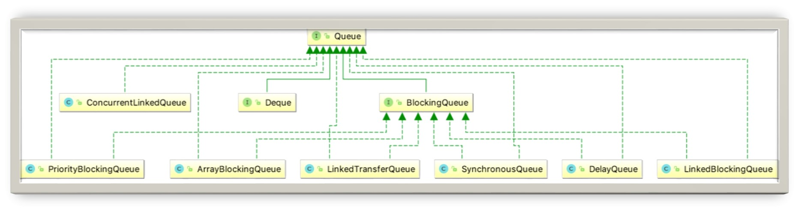

# 阻塞队列

## 什么是阻塞队列？

### 阻塞队列的作用

阻塞队列，也就是 BlockingQueue，它是一个接口，如代码所示：

```java
public interface BlockingQueue<E> extends Queue<E>{...}
```

BlockingQueue 继承了 Queue 接口，是队列的一种。Queue 和 BlockingQueue 都是在 Java 5 中加入的。

BlockingQueue 是线程安全的，我们在很多场景下都可以利用线程安全的队列来优雅地解决我们业务自身的线程安全问题。比如说，使用生产者/消费者模式的时候，我们生产者只需要往队列里添加元素，而消费者只需要从队列里取出它们就可以了，如图所示：


在图中，左侧有三个生产者线程，它会把生产出来的结果放到中间的阻塞队列中，而右侧的三个消费者也会从阻塞队列中取出它所需要的内容并进行处理。因为阻塞队列是线程安全的，所以生产者和消费者都可以是多线程的，不会发生线程安全问题。

既然队列本身是线程安全的，队列可以安全地从一个线程向另外一个线程传递数据，所以我们的生产者/消费者直接使用线程安全的队列就可以，而不需要自己去考虑更多的线程安全问题。这也就意味着，考虑锁等线程安全问题的重任从“你”转移到了“队列”上，降低了我们开发的难度和工作量。

同时，队列它还能起到一个隔离的作用。比如说我们开发一个银行转账的程序，那么生产者线程不需要关心具体的转账逻辑，只需要把转账任务，如账户和金额等信息放到队列中就可以，而不需要去关心银行这个类如何实现具体的转账业务。而作为银行这个类来讲，它会去从队列里取出来将要执行的具体的任务，再去通过自己的各种方法来完成本次转账。

这样就实现了具体任务与执行任务类之间的解耦，任务被放在了阻塞队列中，而负责放任务的线程是无法直接访问到我们银行具体实现转账操作的对象的，实现了隔离，提高了安全性。

### 主要并发队列关系图



上图展示了 Queue 最主要的实现类，可以看出 Java 提供的线程安全的队列（也称为并发队列）分为**阻塞队列**和**非阻塞队列**两大类。

阻塞队列的典型例子就是 BlockingQueue 接口的实现类，BlockingQueue 下面有 6 种最主要的实现，分别是 ArrayBlockingQueue、LinkedBlockingQueue、SynchronousQueue、DelayQueue、PriorityBlockingQueue 和 LinkedTransferQueue，它们各自有不同的特点，对于这些常见的阻塞队列的特点，我们会在第 36 课时中展开说明。

非阻塞并发队列的典型例子是 ConcurrentLinkedQueue，这个类不会让线程阻塞，利用 CAS 保证了线程安全。

我们可以根据需要自由选取阻塞队列或者非阻塞队列来满足业务需求。

还有一个和 Queue 关系紧密的 Deque 接口，它继承了 Queue，如代码所示：

```java
public interface Deque<E> extends Queue<E> {//...}
```

Deque 的意思是双端队列，音标是 [dek]，是 double-ended-queue 的缩写，它从头和尾都能添加和删除元素；而普通的 Queue 只能从一端进入，另一端出去。这是 Deque 和 Queue 的不同之处，Deque 其他方面的性质都和 Queue 类似。

### 阻塞队列的特点

阻塞队列区别于其他类型的队列的最主要的特点就是“阻塞”这两个字，所以下面重点介绍阻塞功能：阻塞功能使得生产者和消费者两端的能力得以平衡，当有任何一端速度过快时，阻塞队列便会把过快的速度给降下来。实现阻塞最重要的两个方法是 take 方法和 put 方法。

#### take 方法

take 方法的功能是获取并移除队列的头结点，通常在队列里有数据的时候是可以正常移除的。可是一旦执行 take 方法的时候，队列里无数据，则阻塞，直到队列里有数据。一旦队列里有数据了，就会立刻解除阻塞状态，并且取到数据。过程如图所示：

#### put 方法

put 方法插入元素时，如果队列没有满，那就和普通的插入一样是正常的插入，但是如果队列已满，那么就无法继续插入，则阻塞，直到队列里有了空闲空间。如果后续队列有了空闲空间，比如消费者消费了一个元素，那么此时队列就会解除阻塞状态，并把需要添加的数据添加到队列中。过程如图所示：

以上过程中的阻塞和解除阻塞，都是 BlockingQueue 完成的，不需要我们自己处理。

#### 是否有界（容量有多大）

此外，阻塞队列还有一个非常重要的属性，那就是容量的大小，分为有界和无界两种。

无界队列意味着里面可以容纳非常多的元素，例如 LinkedBlockingQueue 的上限是 Integer.MAX_VALUE，约为 2 的 31 次方，是非常大的一个数，可以近似认为是无限容量，因为我们几乎无法把这个容量装满。

但是有的阻塞队列是有界的，例如 ArrayBlockingQueue 如果容量满了，也不会扩容，所以一旦满了就无法再往里放数据了。

## 阻塞队列包含哪些常用的方法？add、offer、put 等方法的区别？

在本课时中我们主要讲解阻塞队列包含哪些常用的方法，以及 add，offer，put 等方法的区别。

在阻塞队列中有很多方法，而且它们都非常相似，所以非常有必要对这些类似的方法进行辨析，所以本课时会用分类的方式，和你一起，把阻塞队列中常见的方法进行梳理和讲解。

我们把 BlockingQueue 中最常用的和添加、删除相关的 8 个方法列出来，并且把它们分为三组，每组方法都和添加、移除元素相关。

这三组方法由于功能很类似，所以比较容易混淆。它们的区别仅在于特殊情况：当队列满了无法添加元素，或者是队列空了无法移除元素时，不同组的方法对于这种特殊情况会有不同的处理方式：

- 抛出异常：add、remove、element
- 返回结果但不抛出异常：offer、poll、peek
- 阻塞：put、take

### 第一组：add、remove、element

#### add 方法

add 方法是往队列里添加一个元素，如果队列满了，就会抛出异常来提示队列已满。示例代码如下：

```java
private static void addTest() {
    BlockingQueue<Integer> blockingQueue = new ArrayBlockingQueue<Integer>(2);
    blockingQueue.add(1);
    blockingQueue.add(1);
    blockingQueue.add(1);
}
```

在这段代码中，我们创建了一个容量为 2 的 BlockingQueue，并且尝试往里面放 3 个值，超过了容量上限，那么在添加第三个值的时候就会得到异常：

```java
Exception in thread "main" java.lang.IllegalStateException:Queue full
```

#### remove 方法

remove 方法的作用是删除元素，如果我们删除的队列是空的，由于里面什么都没有，所以也无法删除任何元素，那么 remove 方法就会抛出异常。示例代码如下：

```java
private static void removeTest() {
    ArrayBlockingQueue<Integer> blockingQueue = new     ArrayBlockingQueue<Integer>(2);
    blockingQueue.add(1);
    blockingQueue.add(1);
    blockingQueue.remove();
    blockingQueue.remove();
    blockingQueue.remove();
}
```

在这段代码中，我们往一个容量为 2 的 BlockingQueue 里放入 2 个元素，并且删除 3 个元素。在删除前面两个元素的时候会正常执行，因为里面依然有元素存在，但是在删除第三个元素时，由于队列里面已经空了，所以便会抛出异常：

```java
Exception in thread "main" java.util.NoSuchElementException
```

#### element 方法

element 方法是返回队列的头部节点，但是并不删除。和 remove 方法一样，如果我们用这个方法去操作一个空队列，想获取队列的头结点，可是由于队列是空的，我们什么都获取不到，会抛出和前面 remove 方法一样的异常：NoSuchElementException。示例代码如下：

```java
private static void elementTest() {
    ArrayBlockingQueue<Integer> blockingQueue = new ArrayBlockingQueue<Integer>(2);
    blockingQueue.element();
}
```

我们新建了一个容量为 2 的 ArrayBlockingQueue，直接调用 element 方法，由于之前没有往里面添加元素，默认为空，那么会得到异常：

```java
Exception in thread "main" java.util.NoSuchElementException
```

### 第二组：offer、poll、peek

实际上我们通常并不想看到第一组方法抛出的异常，这时我们可以优先采用第二组方法。第二组方法相比于第一组而言要友好一些，当发现队列满了无法添加，或者队列为空无法删除的时候，第二组方法会给一个提示，而不是抛出一个异常。

#### offer 方法

offer 方法用来插入一个元素，并用返回值来提示插入是否成功。如果添加成功会返回 true，而如果队列已经满了，此时继续调用 offer 方法的话，它不会抛出异常，只会返回一个错误提示：false。示例代码如下：

```java
private static void offerTest() {
    ArrayBlockingQueue<Integer> blockingQueue = new ArrayBlockingQueue<Integer>(2);
    System.out.println(blockingQueue.offer(1));
    System.out.println(blockingQueue.offer(1));
    System.out.println(blockingQueue.offer(1));
}
```

我们创建了一个容量为 2 的 ArrayBlockingQueue，并且调用了三次 offer方法尝试添加，每次都把返回值打印出来，运行结果如下：

```java
true
true
false
```

可以看出，前面两次添加成功了，但是第三次添加的时候，已经超过了队列的最大容量，所以会返回 false，表明添加失败。

#### poll 方法

poll 方法和第一组的 remove 方法是对应的，作用也是移除并返回队列的头节点。但是如果当队列里面是空的，没有任何东西可以移除的时候，便会返回 null 作为提示。正因如此，我们是不允许往队列中插入 null 的，否则我们没有办法区分返回的 null 是一个提示还是一个真正的元素。示例代码如下：

```java
private static void pollTest() {
    ArrayBlockingQueue<Integer> blockingQueue = new ArrayBlockingQueue<Integer>(3);
    blockingQueue.offer(1);
    blockingQueue.offer(2);
    blockingQueue.offer(3);
    System.out.println(blockingQueue.poll());
    System.out.println(blockingQueue.poll());
    System.out.println(blockingQueue.poll());
    System.out.println(blockingQueue.poll());
}
```

在这个代码中我们创建了一个容量为 3 的 ArrayBlockingQueue，并且先往里面放入 3 个元素，然后四次调用 poll 方法，运行结果如下：

```java
1
2
3
null
```

前面三次 poll 都运行成功了，并且返回了元素内容 1、2、3，是先进先出的顺序。第四次的 poll 方法返回 null，代表此时已经没有元素可以移除了。

#### peek 方法

peek 方法和第一组的 element 方法是对应的，意思是返回队列的头元素但并不删除。如果队列里面是空的，它便会返回 null 作为提示。示例代码如下：

```java
private static void peekTest() {
    ArrayBlockingQueue<Integer> blockingQueue = new ArrayBlockingQueue<Integer>(2);
    System.out.println(blockingQueue.peek());
}
```

运行结果：

```java
null
```

我们新建了一个空的 ArrayBlockingQueue，然后直接调用 peek，返回结果 null，代表此时并没有东西可以取出。

#### 带超时时间的 offer 和 poll

第二组还有一些额外值得讲解的内容，offer 和 poll 都有带超时时间的重载方法。

```java
offer(E e, long timeout, TimeUnit unit)
```

它有三个参数，分别是元素、超时时长和时间单位。通常情况下，这个方法会插入成功并返回 true；如果队列满了导致插入不成功，在调用带超时时间重载方法的 offer 的时候，则会等待指定的超时时间，如果时间到了依然没有插入成功，就会返回 false。

```java
poll(long timeout, TimeUnit unit)
```

带时间参数的 poll 方法和 offer 类似：如果能够移除，便会立刻返回这个节点的内容；如果队列是空的就会进行等待，等待时间正是我们指定的时间，直到超时时间到了，如果队列里依然没有元素可供移除，便会返回 null 作为提示。

### 第三组：put、take

第三组是我们比较熟悉的、阻塞队列最大特色的 put 和 take 方法，我们复习一下 34 课时里对于 put 和 take 方法的讲解。

#### put 方法

put 方法的作用是插入元素。通常在队列没满的时候是正常的插入，但是如果队列已满就无法继续插入，这时它既不会立刻返回 false 也不会抛出异常，而是让插入的线程陷入阻塞状态，直到队列里有了空闲空间，此时队列就会让之前的线程解除阻塞状态，并把刚才那个元素添加进去。

#### take 方法

take 方法的作用是获取并移除队列的头结点。通常在队列里有数据的时候会正常取出数据并删除；但是如果执行 take 的时候队列里无数据，则阻塞，直到队列里有数据；一旦队列里有数据了，就会立刻解除阻塞状态，并且取到数据。

## 有哪几种常见的阻塞队列？

BlockingQueue 接口的实现类都被放在了 J.U.C 包中，本课时将对常见的和常用的实现类进行介绍，包括 ArrayBlockingQueue、LinkedBlockingQueue、SynchronousQueue、PriorityBlockingQueue，以及 DelayQueue。

#### ArrayBlockingQueue

让我们先从最基础的 ArrayBlockingQueue 说起。ArrayBlockingQueue 是最典型的有界队列，其内部是用数组存储元素的，利用 ReentrantLock 实现线程安全。

我们在创建它的时候就需要指定它的容量，之后也不可以再扩容了，在构造函数中我们同样可以指定是否是公平的，代码如下：

```java
ArrayBlockingQueue(int capacity, boolean fair)
```

第一个参数是容量，第二个参数是是否公平。正如 ReentrantLock 一样，如果 ArrayBlockingQueue 被设置为非公平的，那么就存在插队的可能；如果设置为公平的，那么等待了最长时间的线程会被优先处理，其他线程不允许插队，不过这样的公平策略同时会带来一定的性能损耗，因为非公平的吞吐量通常会高于公平的情况。

#### LinkedBlockingQueue

正如名字所示，这是一个内部用链表实现的 BlockingQueue。如果我们不指定它的初始容量，那么它容量默认就为整型的最大值 Integer.MAX_VALUE，由于这个数非常大，我们通常不可能放入这么多的数据，所以 LinkedBlockingQueue 也被称作无界队列，代表它几乎没有界限。

#### SynchronousQueue

如图所示，SynchronousQueue 最大的不同之处在于，它的容量为 0，所以没有一个地方来暂存元素，导致每次取数据都要先阻塞，直到有数据被放入；同理，每次放数据的时候也会阻塞，直到有消费者来取。

需要注意的是，SynchronousQueue 的容量不是 1 而是 0，因为 SynchronousQueue 不需要去持有元素，它所做的就是直接传递（direct handoff）。由于每当需要传递的时候，SynchronousQueue 会把元素直接从生产者传给消费者，在此期间并不需要做存储，所以如果运用得当，它的效率是很高的。

另外，由于它的容量为 0，所以相比于一般的阻塞队列，SynchronousQueue 的很多方法的实现是很有意思的，我们来举几个例子：

SynchronousQueue 的 peek 方法永远返回 null，代码如下：

```java
public E peek() {
    return null;
}
```

因为 peek 方法的含义是取出头结点，但是 SynchronousQueue 的容量是 0，所以连头结点都没有，peek 方法也就没有意义，所以始终返回 null。同理，element 始终会抛出 NoSuchElementException 异常。

而 SynchronousQueue 的 size 方法始终返回 0，因为它内部并没有容量，代码如下：

```java
public int size() {
    return 0;
}
```

直接 return 0，同理，isEmpty 方法始终返回 true：

```java
public boolean isEmpty() {
    return true;
}
```

因为它始终都是空的。

#### PriorityBlockingQueue

前面我们所说的 ArrayBlockingQueue 和 LinkedBlockingQueue 都是采用先进先出的顺序进行排序，可是如果有的时候我们需要自定义排序怎么办呢？这时就需要使用 PriorityBlockingQueue。

PriorityBlockingQueue 是一个支持优先级的无界阻塞队列，可以通过自定义类实现 compareTo() 方法来指定元素排序规则，或者初始化时通过构造器参数 Comparator 来指定排序规则。同时，插入队列的对象必须是可比较大小的，也就是 Comparable 的，否则会抛出 ClassCastException 异常。

它的 take 方法在队列为空的时候会阻塞，但是正因为它是无界队列，而且会自动扩容，所以它的队列永远不会满，所以它的 put 方法永远不会阻塞，添加操作始终都会成功，也正因为如此，它的成员变量里只有一个 Condition：

```java
private final Condition notEmpty;
```

这和之前的 ArrayBlockingQueue 拥有两个 Condition（分别是 notEmpty 和 notFull）形成了鲜明的对比，我们的 PriorityBlockingQueue 不需要 notFull，因为它永远都不会满，真是“有空间就可以任性”。

#### DelayQueue

DelayQueue 这个队列比较特殊，具有“延迟”的功能。我们可以设定让队列中的任务延迟多久之后执行，比如 10 秒钟之后执行，这在例如“30 分钟后未付款自动取消订单”等需要延迟执行的场景中被大量使用。

它是无界队列，放入的元素必须实现 Delayed 接口，而 Delayed 接口又继承了 Comparable 接口，所以自然就拥有了比较和排序的能力，代码如下：

```java
public interface Delayed extends Comparable<Delayed> {
    long getDelay(TimeUnit unit);
}
```

可以看出这个 Delayed 接口继承自 Comparable，里面有一个需要实现的方法，就是  getDelay。这里的 getDelay 方法返回的是“还剩下多长的延迟时间才会被执行”，如果返回 0 或者负数则代表任务已过期。

元素会根据延迟时间的长短被放到队列的不同位置，越靠近队列头代表越早过期。

DelayQueue 内部使用了 PriorityQueue 的能力来进行排序，而不是自己从头编写，我们在工作中可以学习这种思想，对已有的功能进行复用，不但可以减少开发量，同时避免了“重复造轮子”，更重要的是，对学到的知识进行合理的运用，让知识变得更灵活，做到触类旁通。

## 阻塞和非阻塞队列的并发安全原理是什么？

之前我们探究了常见的阻塞队列的特点，在本课时，我们以 ArrayBlockingQueue 为例，首先分析 BlockingQueue 即阻塞队列的线程安全原理，然后再看看它的兄弟——非阻塞队列的并发安全原理。通过本课时的学习，我们就可以了解到关于并发队列的底层原理了。

### ArrayBlockingQueue 源码分析

我们首先看一下 ArrayBlockingQueue 的源码，ArrayBlockingQueue 有以下几个重要的属性：

```java
// 用于存放元素的数组
final Object[] items;
// 下一次读取操作的位置
int takeIndex;
// 下一次写入操作的位置
int putIndex;
// 队列中的元素数量
int count;
```

第一个就是最核心的、用于存储元素的 Object 类型的数组；然后它还会有两个位置变量，分别是 takeIndex 和 putIndex，这两个变量就是用来标明下一次读取和写入位置的；另外还有一个 count 用来计数，它所记录的就是队列中的元素个数。

另外，我们再来看下面这三个变量：

```java
// 以下3个是控制并发用的工具
final ReentrantLock lock;
private final Condition notEmpty;
private final Condition notFull;
```

这三个变量也非常关键，第一个就是一个 ReentrantLock，而下面两个 Condition 分别是由 ReentrantLock 产生出来的，这三个变量就是我们实现线程安全最核心的工具。

ArrayBlockingQueue 实现并发同步的原理就是利用 ReentrantLock 和它的两个 Condition，读操作和写操作都需要先获取到 ReentrantLock 独占锁才能进行下一步操作。进行读操作时如果队列为空，线程就会进入到读线程专属的 notEmpty 的 Condition 的队列中去排队，等待写线程写入新的元素；同理，如果队列已满，这个时候写操作的线程会进入到写线程专属的 notFull 队列中去排队，等待读线程将队列元素移除并腾出空间。

下面，我们来分析一下最重要的 put 方法：

```java
public void put(E e) throws InterruptedException {
    checkNotNull(e);
    final ReentrantLock lock = this.lock;
    lock.lockInterruptibly();
    try {
        while (count == items.length)
        notFull.await();
        enqueue(e);
    } finally {
        lock.unlock();
    }
}
```

在 put 方法中，首先用 checkNotNull 方法去检查插入的元素是不是 null。如果不是 null，我们会用 ReentrantLock 上锁，并且上锁方法是 lock.lockInterruptibly()。这个方法我们在第 23 课时的时候讲过，在获取锁的同时是可以响应中断的，这也正是我们的阻塞队列在调用 put 方法时，在尝试获取锁但还没拿到锁的期间可以响应中断的底层原因。

紧接着 ，是一个非常经典的 try  finally 代码块，finally 中会去解锁，try 中会有一个 while 循环，它会检查当前队列是不是已经满了，也就是 count 是否等于数组的长度。如果等于就代表已经满了，于是我们便会进行等待，直到有空余的时候，我们才会执行下一步操作，调用 enqueue 方法让元素进入队列，最后用 unlock 方法解锁。

你看到这段代码不知道是否眼熟，在第 5 课时我们讲过，用 Condition 实现生产者/消费者模式的时候，写过一个 put 方法，代码如下：

```java
public void put(Object o) throws InterruptedException {
    lock.lock();
    try {
        while (queue.size() == max) {
        notFull.await();
    }
    queue.add(o);
    notEmpty.signalAll();
    } finally {
        lock.unlock();
    }
}
```

可以看出，这两个方法几乎是一模一样的，所以当时在第 5 课时的时候我们就说过，我们自己用 Condition 实现生产者/消费者模式，实际上其本质就是自己实现了简易版的 BlockingQueue。你可以对比一下这两个 put 方法的实现，这样对 Condition 的理解就会更加深刻。

和 ArrayBlockingQueue 类似，其他各种阻塞队列如 LinkedBlockingQueue、PriorityBlockingQueue、DelayQueue、DelayedWorkQueue 等一系列 BlockingQueue 的内部也是利用了 ReentrantLock 来保证线程安全，只不过细节有差异，比如 LinkedBlockingQueue 的内部有两把锁，分别锁住队列的头和尾，比共用同一把锁的效率更高，不过总体思想都是类似的。

### 非阻塞队列ConcurrentLinkedQueue

看完阻塞队列之后，我们就来看看非阻塞队列 ConcurrentLinkedQueue。顾名思义，ConcurrentLinkedQueue 是使用链表作为其数据结构的，我们来看一下关键方法 offer 的源码：

```java
public boolean offer(E e) {
    checkNotNull(e);
    final Node<E> newNode = new Node<E>(e);

    for (Node<E> t = tail, p = t;;) {
        Node<E> q = p.next;
        if (q == null) {
            // p is last node
            if (p.casNext(null, newNode)) {
                // Successful CAS is the linearization point
                // for e to become an element of this queue,
                // and for newNode to become "live".
                if (p != t) // hop two nodes at a time
                    casTail(t, newNode);  // Failure is OK.
                return true;
            }
            // Lost CAS race to another thread; re-read next
        }
        else if (p == q)
            // We have fallen off list.  If tail is unchanged, it
            // will also be off-list, in which case we need to
            // jump to head, from which all live nodes are always
            // reachable.  Else the new tail is a better bet.
            p = (t != (t = tail)) ? t : head;
        else
            // Check for tail updates after two hops.
            p = (p != t && t != (t = tail)) ? t : q;
    }
}
```

在这里我们不去一行一行分析具体的内容，而是把目光放到整体的代码结构上，在检查完空判断之后，可以看到它整个是一个大的 for 循环，而且是一个非常明显的死循环。在这个循环中有一个非常亮眼的 p.casNext 方法，这个方法正是利用了 CAS 来操作的，而且这个死循环去配合 CAS 也就是典型的乐观锁的思想。我们就来看一下 p.casNext 方法的具体实现，其方法代码如下：

```java
boolean casNext(Node<E> cmp, Node<E> val) {
    return UNSAFE.compareAndSwapObject(this, nextOffset, cmp, val);
}
```

可以看出这里运用了 UNSAFE.compareAndSwapObject 方法来完成 CAS 操作，而 compareAndSwapObject 是一个 native 方法，最终会利用 CPU 的 CAS 指令保证其不可中断。

可以看出，非阻塞队列 ConcurrentLinkedQueue 使用 CAS 非阻塞算法 + 不停重试，来实现线程安全，适合用在不需要阻塞功能，且并发不是特别剧烈的场景。

## 如何选择适合自己的阻塞队列？

所以我们就首先来复习一下这些非常经典的线程池是如何挑选阻塞队列的，借鉴它们的经验之后，我们再去总结一套规则，来归纳出自己在选取阻塞队列时可以对哪些点进行考虑。

### 线程池对于阻塞队列的选择

### 阻塞队列

| 线程池                        | 队列                |
| ----------------------------- | ------------------- |
| FixedThreadPool               | LinkedBlockingQueue |
| SingleThreadPool              | LinkedBlockingQueue |
| CachedThreadPool              | SynchronousQueue    |
| ScheduledThreadPool           | DelayedWorkQueue    |
| SingleThreadScheduledExecutor | DelayedWorkQueue    |

### 归纳

下面让我们总结一下经验，通常我们可以从以下 5 个角度考虑，来选择合适的阻塞队列：

#### 功能

第 1 个需要考虑的就是功能层面，比如是否需要阻塞队列帮我们排序，如优先级排序、延迟执行等。如果有这个需要，我们就必须选择类似于 PriorityBlockingQueue 之类的有排序能力的阻塞队列。

#### 容量

第 2 个需要考虑的是容量，或者说是否有存储的要求，还是只需要“直接传递”。在考虑这一点的时候，我们知道前面介绍的那几种阻塞队列，有的是容量固定的，如 ArrayBlockingQueue；有的默认是容量无限的，如 LinkedBlockingQueue；而有的里面没有任何容量，如 SynchronousQueue；而对于 DelayQueue 而言，它的容量固定就是 Integer.MAX_VALUE。

所以不同阻塞队列的容量是千差万别的，我们需要根据任务数量来推算出合适的容量，从而去选取合适的 BlockingQueue。

#### 能否扩容

第 3 个需要考虑的是能否扩容。因为有时我们并不能在初始的时候很好的准确估计队列的大小，因为业务可能有高峰期、低谷期。

如果一开始就固定一个容量，可能无法应对所有的情况，也是不合适的，有可能需要动态扩容。如果我们需要动态扩容的话，那么就不能选择 ArrayBlockingQueue ，因为它的容量在创建时就确定了，无法扩容。相反，PriorityBlockingQueue 即使在指定了初始容量之后，后续如果有需要，也可以自动扩容。

所以我们可以根据是否需要扩容来选取合适的队列。

#### 内存结构

第 4 个需要考虑的点就是内存结构。在上一课时我们分析过 ArrayBlockingQueue 的源码，看到了它的内部结构是“数组”的形式。

和它不同的是，LinkedBlockingQueue 的内部是用链表实现的，所以这里就需要我们考虑到，ArrayBlockingQueue 没有链表所需要的“节点”，空间利用率更高。所以如果我们对性能有要求可以从内存的结构角度去考虑这个问题。

#### 性能

第 5 点就是从性能的角度去考虑。比如 LinkedBlockingQueue 由于拥有两把锁，它的操作粒度更细，在并发程度高的时候，相对于只有一把锁的 ArrayBlockingQueue 性能会更好。


另外，SynchronousQueue 性能往往优于其他实现，因为它只需要“直接传递”，而不需要存储的过程。如果我们的场景需要直接传递的话，可以优先考虑 SynchronousQueue。