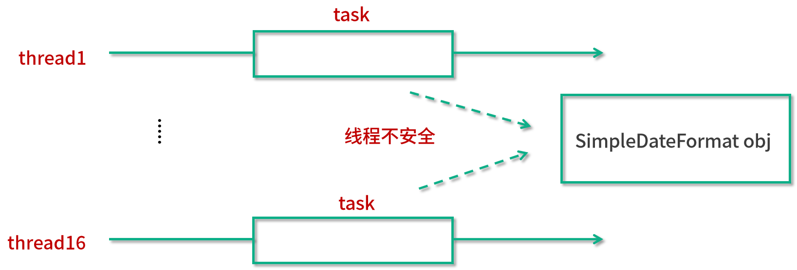
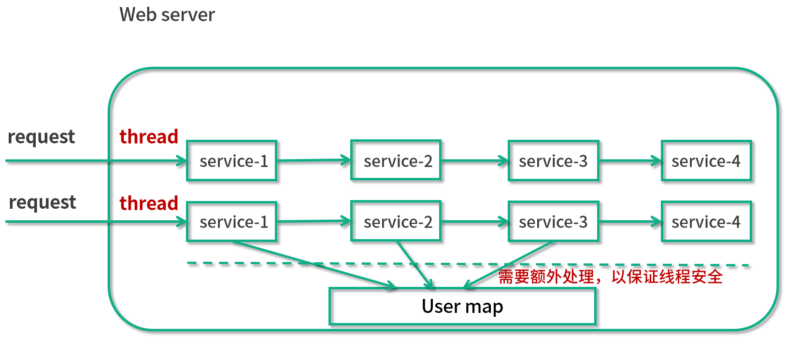
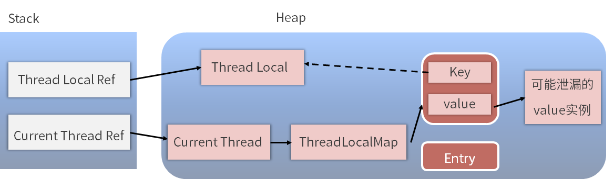

# ThreadLocal

## ThreadLocal 适合用在哪些实际生产的场景中？

我们在学习一个工具之前，首先应该知道这个工具的作用，能带来哪些好处，而不是一上来就闷头进入工具的 API、用法等，否则就算我们把某个工具的用法学会了，也不知道应该在什么场景下使用。所以，我们先来看看究竟哪些场景下需要用到 ThreadLocal。

在通常的业务开发中，ThreadLocal 有两种典型的使用场景。

**场景1**，ThreadLocal 用作**保存每个线程独享的对象**，为每个线程都创建一个副本，这样每个线程都可以修改自己所拥有的副本, 而不会影响其他线程的副本，确保了线程安全。

**场景2**，ThreadLocal 用作**每个线程内需要独立保存信息**，以便**供其他方法更方便地获取**该信息的场景。每个线程获取到的信息可能都是不一样的，前面执行的方法保存了信息后，后续方法可以通过 ThreadLocal 直接获取到，避免了传参，类似于全局变量的概念。

### 典型场景1

这种场景通常用于保存线程不安全的工具类，典型的需要使用的类就是 SimpleDateFormat。

#### 场景介绍

在这种情况下，每个 Thread 内都有自己的实例副本，且该副本只能由当前 Thread 访问到并使用，相当于每个线程内部的本地变量，这也是 ThreadLocal 命名的含义。因为每个线程独享副本，而不是公用的，所以不存在多线程间共享的问题。

我们来做一个比喻，比如饭店要做一道菜，但是有 5 个厨师一起做，这样的话就很乱了，因为如果一个厨师已经放过盐了，假如其他厨师都不知道，于是就都各自放了一次盐，导致最后的菜很咸。这就好比多线程的情况，线程不安全。我们用了 ThreadLocal 之后，相当于每个厨师只负责自己的一道菜，一共有 5 道菜，这样的话就非常清晰明了了，不会出现问题。

#### SimpleDateFormat 的进化之路

##### 1.2 个线程都要用到 SimpleDateFormat

下面我们用一个案例来说明这种典型的第一个场景。假设有个需求，即 2 个线程都要用到 SimpleDateFormat。代码如下所示：

```java08
public class ThreadLocalDemo01 {

    public static void main(String[] args) throws InterruptedException {
        new Thread(() -> {
            String date = new ThreadLocalDemo01().date(1);
            System.out.println(date);
        }).start();
        Thread.sleep(100);
        new Thread(() -> {
            String date = new ThreadLocalDemo01().date(2);
            System.out.println(date);
        }).start();
    }

    public String date(int seconds) {
        Date date = new Date(1000 * seconds);
        SimpleDateFormat simpleDateFormat = new SimpleDateFormat("mm:ss");
        return simpleDateFormat.format(date);
    }
}
```

在以上代码中可以看出，两个线程分别创建了一个自己的 SimpleDateFormat 对象，如图所示：


这样一来，有两个线程，那么就有两个 SimpleDateFormat 对象，它们之间互不干扰，这段代码是可以正常运转的，运行结果是：

```bash
  00:01
  00:02
```

##### 2.10 个线程都要用到 SimpleDateFormat

假设我们的需求有了升级，不仅仅需要 2 个线程，而是需要 10 个，也就是说，有 10 个线程同时对应 10 个 SimpleDateFormat 对象。我们就来看下面这种写法：

```java
public class ThreadLocalDemo02 {

    public static void main(String[] args) throws InterruptedException {
        for (int i = 0; i < 10; i++) {
            int finalI = i;
            new Thread(() -> {
                String date = new ThreadLocalDemo02().date(finalI);
                System.out.println(date);
            }).start();
            Thread.sleep(100);
        }
    }

    public String date(int seconds) {
        Date date = new Date(1000 * seconds);
        SimpleDateFormat simpleDateFormat = new SimpleDateFormat("mm:ss");
        return simpleDateFormat.format(date);
    }
}
```

上面的代码利用了一个 for 循环来完成这个需求。for 循环一共循环 10 次，每一次都会新建一个线程，并且每一个线程都会在 date 方法中创建一个 SimpleDateFormat 对象，示意图如下：


可以看出一共有 10 个线程，对应 10 个 SimpleDateFormat 对象。

代码的运行结果：

```bash
00:00
00:01
00:02
00:03
00:04
00:05
00:06
00:07
00:08
00:09
```

##### 3. 需求变成了 1000 个线程都要用到 SimpleDateFormat

但是线程不能无休地创建下去，因为线程越多，所占用的资源也会越多。假设我们需要 1000 个任务，那就不能再用 for 循环的方法了，而是应该使用线程池来实现线程的复用，否则会消耗过多的内存等资源。

在这种情况下，我们给出下面这个代码实现的方案：

```java
public class ThreadLocalDemo03 {

    public static ExecutorService threadPool = Executors.newFixedThreadPool(16);

    public static void main(String[] args) throws InterruptedException {
        for (int i = 0; i < 1000; i++) {
            int finalI = i;
            threadPool.submit(new Runnable() {
                @Override
                public void run() {
                    String date = new ThreadLocalDemo03().date(finalI);
                    System.out.println(date);
                }
            });
        }
        threadPool.shutdown();
    }

    public String date(int seconds) {
        Date date = new Date(1000 * seconds);
        SimpleDateFormat dateFormat = new SimpleDateFormat("mm:ss");
        return dateFormat.format(date);
    }
}
```

可以看出，我们用了一个 16 线程的线程池，并且给这个线程池提交了 1000 次任务。每个任务中它做的事情和之前是一样的，还是去执行 date 方法，并且在这个方法中创建一个 simpleDateFormat 对象。程序的一种运行结果是（多线程下，运行结果不唯一）：

```java
00:00
00:07
00:04
00:02
...
16:29
16:28
16:27
16:26
16:39
```

程序运行结果正确，把从 00:00 到 16:39 这 1000 个时间给打印了出来，并且没有重复的时间。我们把这段代码用图形化给表示出来，如图所示：


图的左侧是一个线程池，右侧是 1000 个任务。我们刚才所做的就是每个任务都创建了一个 simpleDateFormat 对象，也就是说，1000 个任务对应 1000 个 simpleDateFormat 对象。

但是这样做是没有必要的，因为这么多对象的创建是有开销的，并且在使用完之后的销毁同样是有开销的，而且这么多对象同时存在在内存中也是一种内存的浪费。

现在我们就来优化一下。既然不想要这么多的 simpleDateFormat 对象，最简单的就是只用一个就可以了。

##### 4. 所有的线程都共用一个 simpleDateFormat 对象

我们用下面的代码来演示只用一个 simpleDateFormat 对象的情况：

```java
public class ThreadLocalDemo04 {

    public static ExecutorService threadPool = Executors.newFixedThreadPool(16);
    static SimpleDateFormat dateFormat = new SimpleDateFormat("mm:ss");

    public static void main(String[] args) throws InterruptedException {
        for (int i = 0; i < 1000; i++) {
            int finalI = i;
            threadPool.submit(new Runnable() {
                @Override
                public void run() {
                    String date = new ThreadLocalDemo04().date(finalI);
                    System.out.println(date);
                }
            });
        }
        threadPool.shutdown();
    }

    public String date(int seconds) {
        Date date = new Date(1000 * seconds);
        return dateFormat.format(date);
    }
}
```

在代码中可以看出，其他的没有变化，变化之处就在于，我们把这个 simpleDateFormat 对象给提取了出来，变成 static 静态变量，需要用的时候直接去获取这个静态对象就可以了。看上去省略掉了创建 1000 个 simpleDateFormat 对象的开销，看上去没有问题，我们用图形的方式把这件事情给表示出来：



从图中可以看出，我们有不同的线程，并且线程会执行它们的任务。但是不同的任务所调用的 simpleDateFormat 对象都是同一个，所以它们所指向的那个对象都是同一个，但是这样一来就会有线程不安全的问题。

##### 5. 线程不安全，出现了并发安全问题

控制台会打印出（多线程下，运行结果不唯一）：

```java
00:04
00:04
00:05
00:04
...
16:15
16:14
16:13
```

执行上面的代码就会发现，控制台所打印出来的和我们所期待的是不一致的。我们所期待的是打印出来的时间是不重复的，但是可以看出在这里出现了重复，比如第一行和第二行都是 04 秒，这就代表它内部已经出错了。

##### 6. 加锁

出错的原因就在于，simpleDateFormat 这个对象本身不是一个线程安全的对象，不应该被多个线程同时访问。所以我们就想到了一个解决方案，用 synchronized 来加锁。于是代码就修改成下面的样子：

```java
public class ThreadLocalDemo05 {

    public static ExecutorService threadPool = Executors.newFixedThreadPool(16);
    static SimpleDateFormat dateFormat = new SimpleDateFormat("mm:ss");

    public static void main(String[] args) throws InterruptedException {
        for (int i = 0; i < 1000; i++) {
            int finalI = i;
            threadPool.submit(new Runnable() {
                @Override
                public void run() {
                    String date = new ThreadLocalDemo05().date(finalI);
                    System.out.println(date);
                }
            });
        }
        threadPool.shutdown();
    }

    public String date(int seconds) {
        Date date = new Date(1000 * seconds);
        String s = null;
        synchronized (ThreadLocalDemo05.class) {
            s = dateFormat.format(date);
        }
        return s;
    }
}
```

可以看出在 date 方法中加入了 synchronized 关键字，把 simpleDateFormat 的调用给上了锁。

运行这段代码的结果（多线程下，运行结果不唯一）：

```java
00:00
00:01
00:06
...
15:56
16:37
16:36
```

这样的结果是正常的，没有出现重复的时间。但是由于我们使用了 synchronized 关键字，就会陷入一种排队的状态，多个线程不能同时工作，这样一来，整体的效率就被大大降低了。有没有更好的解决方案呢？

我们希望达到的效果是，既不浪费过多的内存，同时又想保证线程安全。经过思考得出，可以让每个线程都拥有一个自己的 simpleDateFormat 对象来达到这个目的，这样就能两全其美了。

##### 7. 使用 ThreadLocal

那么，要想达到这个目的，我们就可以使用 ThreadLocal。示例代码如下所示：

```java
public class ThreadLocalDemo06 {

    public static ExecutorService threadPool = Executors.newFixedThreadPool(16);

    public static void main(String[] args) throws InterruptedException {
        for (int i = 0; i < 1000; i++) {
            int finalI = i;
            threadPool.submit(new Runnable() {
                @Override
                public void run() {
                    String date = new ThreadLocalDemo06().date(finalI);
                    System.out.println(date);
                }
            });
        }
        threadPool.shutdown();
    }

    public String date(int seconds) {
        Date date = new Date(1000 * seconds);
        SimpleDateFormat dateFormat = ThreadSafeFormatter.dateFormatThreadLocal.get();
        return dateFormat.format(date);
    }
}

class ThreadSafeFormatter {
    public static ThreadLocal<SimpleDateFormat> dateFormatThreadLocal = new ThreadLocal<SimpleDateFormat>() {
        @Override
        protected SimpleDateFormat initialValue() {
            return new SimpleDateFormat("mm:ss");
        }
    };
}
```

在这段代码中，我们使用了 ThreadLocal 帮每个线程去生成它自己的 simpleDateFormat 对象，对于每个线程而言，这个对象是独享的。但与此同时，这个对象就不会创造过多，一共只有 16 个，因为线程只有 16 个。

代码运行结果（多线程下，运行结果不唯一）：

```java
00:05
00:04
00:01
...
16:37
16:36
16:32
```

这个结果是正确的，不会出现重复的时间。

我们用图来看一下当前的这种状态：


在图中的左侧可以看到，这个线程池一共有 16 个线程，对应 16 个 simpleDateFormat 对象。而在这个图画的右侧是 1000 个任务，任务是非常多的，和原来一样有 1000 个任务。但是这里最大的变化就是，虽然任务有 1000 个，但是我们不再需要去创建 1000 个 simpleDateFormat 对象了。即便任务再多，最终也只会有和线程数相同的 simpleDateFormat 对象。这样既高效地使用了内存，又同时保证了线程安全。

以上就是第一种非常典型的适合使用 ThreadLocal 的场景。

### 典型场景2

每个线程内需要保存类似于全局变量的信息（例如在拦截器中获取的用户信息），可以让不同方法直接使用，避免参数传递的麻烦却不想被多线程共享（因为不同线程获取到的用户信息不一样）。

例如，用 ThreadLocal 保存一些业务内容（用户权限信息、从用户系统获取到的用户名、用户ID 等），这些信息在同一个线程内相同，但是不同的线程使用的业务内容是不相同的。

在线程生命周期内，都通过这个静态 ThreadLocal 实例的 get() 方法取得自己 set 过的那个对象，避免了将这个对象（如 user 对象）作为参数传递的麻烦。

我们用图画的形式举一个实例：


比如说我们是一个用户系统。假设不使用 ThreadLocal，那么当一个请求进来的时候，一个线程会负责执行这个请求，然后这个请求就会依次调用 service-1()、service-2()、service-3()、service-4()，这 4 个方法可能是分布在不同的类中的。

在 service-1() 的时候它会创建一个 user 的对象，用于保存比如说这个用户的用户名等信息，后面 service-2/3/4() 都需要用到这个对象的信息，比如说 service-2() 代表下订单、service-3() 代表发货、service-4() 代表完结订单，在这种情况下，每一个方法都需要用户信息，所以就需要把这个 user 对象层层传递下去，从 service-1() 传到 service-2()，再从 service-2() 传到 service-3()，以此类推。

这样做会导致代码非常冗余，那有没有什么办法可以解决这个问题呢？我们首先想到的方法就是使用一个 HashMap，如下图所示：


比如说我们使用了这样的 Map 之后，就不需要把 user 对象层层传递了，而是在执行 service-1() 的时候，把这个用户信息给 put 进去，然后后面需要拿用户信息的时候，直接从静态的 User map 里面 get 就可以了。这样一来，无论你执行哪个方法，都可以直接获取到这个用户信息。当然，我们也要考虑到 web 服务器通常都是多线程的，当多个线程同时工作的时候，我们也需要保证线程安全。

所以在这里，如果我们使用 HashMap 是不够的，因为它是线程不安全的，那我们就可以使用 synchronized，或者直接把 HashMap 替换成 ConcurrentHashMap，用类似的方法来保证线程安全，这样的改进如下图所示：



在这个图中，可以看出有两个线程，并且每个线程所做的事情都是访问 service-1/2/3/4()。那么当它们同时运行的时候，都会同时访问这个 User map，于是就需要 User map 是线程安全的。

无论我们使用 synchronized 还是使用 ConcurrentHashMap，它对性能都是有所影响的，因为即便是使用性能比较好的 ConcurrentHashMap，它也是包含少量的同步，或者是 cas 等过程。相比于完全没有同步，它依然是有性能损耗的。所以在此一个更好的办法就是使用 ThreadLocal。

这样一来，我们就可以在不影响性能的情况下，也无需层层传递参数，就可以达到保存当前线程所对应的用户信息的目的。如下图所示：


在这个图中可以看出，同样是多个线程同时去执行，但是这些线程同时去访问这个 ThreadLocal 并且能利用 ThreadLocal 拿到只属于自己的独享对象。这样的话，就无需任何额外的措施，保证了线程安全，因为每个线程是独享 user 对象的。代码如下所示：

```java
public class ThreadLocalDemo07 {

    public static void main(String[] args) {
        new Service1().service1();

    }
}

class Service1 {

    public void service1() {
        User user = new User("拉勾教育");
        UserContextHolder.holder.set(user);
        new Service2().service2();
    }
}

class Service2 {

    public void service2() {
        User user = UserContextHolder.holder.get();
        System.out.println("Service2拿到用户名：" + user.name);
        new Service3().service3();
    }
}

class Service3 {

    public void service3() {
        User user = UserContextHolder.holder.get();
        System.out.println("Service3拿到用户名：" + user.name);
        UserContextHolder.holder.remove();
    }
}

class UserContextHolder {

    public static ThreadLocal<User> holder = new ThreadLocal<>();
}

class User {

    String name;

    public User(String name) {
        this.name = n
    }
}
```

在这个代码中我们可以看出，我们有一个 UserContextHolder，里面保存了一个 ThreadLocal，在调用 Service1 的方法的时候，就往里面存入了 user 对象，而在后面去调用的时候，直接从里面用 get 方法取出来就可以了。没有参数层层传递的过程，非常的优雅、方便。

代码运行结果：

```java
Service2拿到用户名：拉勾教育
Service3拿到用户名：拉勾教育
```

总结
下面我们进行总结。

本讲主要介绍了 ThreadLocal 的两个典型的使用场景。

场景1，ThreadLocal 用作保存每个线程独享的对象，为每个线程都创建一个副本，每个线程都只能修改自己所拥有的副本, 而不会影响其他线程的副本，这样就让原本在并发情况下，线程不安全的情况变成了线程安全的情况。

场景2，ThreadLocal 用作每个线程内需要独立保存信息的场景，供其他方法更方便得获取该信息，每个线程获取到的信息都可能是不一样的，前面执行的方法设置了信息后，后续方法可以通过 ThreadLocal 直接获取到，避免了传参。

## ThreadLocal 是用来解决共享资源的多线程访问的问题吗？

这是一个常见的面试问题，如果被问到了 ThreadLocal，则有可能在你介绍完它的作用、注意点等内容之后，再问你：ThreadLocal 是不是用来解决共享资源的多线程访问的呢？假如遇到了这样的问题，其思路一定要清晰。这里我给出一个参考答案。

### 面试时被问到应如何回答

这道题的答案很明确——不是，ThreadLocal 并不是用来解决共享资源问题的。虽然 ThreadLocal 确实可以用于解决多线程情况下的线程安全问题，但其资源并不是共享的，而是每个线程独享的。所以这道题其实是有一定陷阱成分在内的。

ThreadLocal 解决线程安全问题的时候，相比于使用“锁”而言，换了一个思路，把资源变成了各线程独享的资源，非常巧妙地避免了同步操作。具体而言，它可以在 initialValue 中 new 出自己线程独享的资源，而多个线程之间，它们所访问的对象本身是不共享的，自然就不存在任何并发问题。这是 ThreadLocal 解决并发问题的最主要思路。

如果我们把放到 ThreadLocal 中的资源用 static 修饰，让它变成一个共享资源的话，那么即便使用了 ThreadLocal，同样也会有线程安全问题。比如我们对第 44 讲中的例子进行改造，如果我们在 SimpleDateFormat 之前加上一个 static 关键字来修饰，并且把这个静态对象放到 ThreadLocal 中去存储的话，代码如下所示：

```java
public class ThreadLocalStatic {

    public static ExecutorService threadPool = Executors.newFixedThreadPool(16);
    static SimpleDateFormat dateFormat = new SimpleDateFormat("mm:ss");


    public static void main(String[] args) throws InterruptedException {
        for (int i = 0; i < 1000; i++) {
            int finalI = i;
            threadPool.submit(new Runnable() {
                @Override
                public void run() {
                    String date = new ThreadLocalStatic().date(finalI);
                    System.out.println(date);
                }
            });
        }
        threadPool.shutdown();
    }

    public String date(int seconds) {
        Date date = new Date(1000 * seconds);
        SimpleDateFormat dateFormat = ThreadSafeFormatter.dateFormatThreadLocal.get();
        return dateFormat.format(date);
    }
}

class ThreadSafeFormatter {

    public static ThreadLocal<SimpleDateFormat> dateFormatThreadLocal = new ThreadLocal<SimpleDateFormat>() {
        @Override
        protected SimpleDateFormat initialValue() {
            return ThreadLocalStatic.dateFormat;
        }
    }
}
```

那么在多线程中去获取这个资源并且同时使用的话，同样会出现时间重复的问题，运行结果如下。

```bash
00:15
00:15
00:05
00:16
...
```

可以看出，00:15 被多次打印了，发生了线程安全问题。也就是说，如果我们需要放到 ThreadLocal 中的这个对象是共享的，是被 static 修饰的，那么此时其实根本就不需要用到 ThreadLocal，即使用了 ThreadLocal 并不能解决线程安全问题。

相反，我们对于这种共享的变量，如果想要保证它的线程安全，应该用其他的方法，比如说可以使用 synchronized 或者是加锁等其他的方法来解决线程安全问题，而不是使用 ThreadLocal，因为这不是 ThreadLocal 应该使用的场景。

这个问题回答到这里，可能会引申出下面这个问题。

### ThreadLocal 和 synchronized 是什么关系

面试官可能会问：你既然说 ThreadLocal 和 synchronized 它们两个都能解决线程安全问题，那么 ThreadLocal 和 synchronized 是什么关系呢？

我们先说第一种情况。当 ThreadLocal 用于解决线程安全问题的时候，也就是把一个对象给每个线程都生成一份独享的副本的，在这种场景下，ThreadLocal 和 synchronized 都可以理解为是用来保证线程安全的手段。例如，在第 44 讲 SimpleDateFormat 的例子中，我们既使用了 synchronized 来达到目的，也使用了 ThreadLocal 作为实现方案。但是效果和实现原理不同：

- ThreadLocal 是通过让每个线程独享自己的副本，避免了资源的竞争。
- synchronized 主要用于临界资源的分配，在同一时刻限制最多只有一个线程能访问该资源。

相比于 ThreadLocal 而言，synchronized 的效率会更低一些，但是花费的内存也更少。在这种场景下，ThreadLocal 和 synchronized 虽然有不同的效果，不过都可以达到线程安全的目的。

但是对于 ThreadLocal 而言，它还有不同的使用场景。比如当 ThreadLocal 用于让多个类能更方便地拿到我们希望给每个线程独立保存这个信息的场景下时（比如每个线程都会对应一个用户信息，也就是 user 对象），在这种场景下，ThreadLocal 侧重的是避免传参，所以此时 ThreadLocal 和 synchronized 是两个不同维度的工具。

## 多个 ThreadLocal 在 Thread 中的 threadlocals 里是怎么存储的？

### Thread、 ThreadLocal 及 ThreadLocalMap 三者之间的关系

在讲解本课时之前，先要搞清楚 Thread、 ThreadLocal 及 ThreadLocalMap 三者之间的关系。我们用最直观、最容易理解的图画的方式来看看它们三者的关系：


我们看到最左下角的 Thread 1，这是一个线程，它的箭头指向了  ThreadLocalMap 1，其要表达的意思是，每个 Thread 对象中都持有一个 ThreadLocalMap 类型的成员变量，在这里 Thread 1 所拥有的成员变量就是 ThreadLocalMap 1。

而这个 ThreadLocalMap 自身类似于是一个 Map，里面会有一个个 key value 形式的键值对。那么我们就来看一下它的 key 和 value 分别是什么。可以看到这个表格的左侧是 ThreadLocal 1、ThreadLocal 2…… ThreadLocal n，能看出这里的 key 就是 ThreadLocal 的引用。

而在表格的右侧是一个一个的 value，这就是我们希望 ThreadLocal 存储的内容，例如 user 对象等。

这里需要重点看到它们的数量对应关系：一个 Thread 里面只有一个ThreadLocalMap ，而在一个 ThreadLocalMap 里面却可以有很多的 ThreadLocal，每一个 ThreadLocal 都对应一个 value。因为一个 Thread 是可以调用多个 ThreadLocal 的，所以 Thread 内部就采用了 ThreadLocalMap 这样 Map 的数据结构来存放 ThreadLocal 和 value。

通过这张图片，我们就可以搞清楚 Thread、 ThreadLocal 及 ThreadLocalMap 三者在宏观上的关系了。

### 源码分析

知道了它们的关系之后，我们再来进行源码分析，来进一步地看到它们内部的实现。

#### get 方法

首先我们来看一下 get 方法，源码如下所示：

```java
public T get() {
    //获取到当前线程
    Thread t = Thread.currentThread();
    //获取到当前线程内的 ThreadLocalMap 对象，每个线程内都有一个 ThreadLocalMap 对象
    ThreadLocalMap map = getMap(t);
    if (map != null) {
        //获取 ThreadLocalMap 中的 Entry 对象并拿到 Value
        ThreadLocalMap.Entry e = map.getEntry(this);
        if (e != null) {
            @SuppressWarnings("unchecked")
            T result = (T)e.value;
            return result;
        }
    }
    //如果线程内之前没创建过 ThreadLocalMap，就创建
    return setInitialValue();
}
```

这是 ThreadLocal 的 get 方法，可以看出它利用了 Thread.currentThread 来获取当前线程的引用，并且把这个引用传入到了 getMap 方法里面，来拿到当前线程的 ThreadLocalMap。

然后就是一个 if ( map != null ) 条件语句，那我们先来看看 if (map == null) 的情况，如果 map == null，则说明之前这个线程中没有创建过 ThreadLocalMap，于是就去调用 setInitialValue 来创建；如果 map != null，我们就应该通过 this 这个引用（也就是当前的 ThreadLocal 对象的引用）来获取它所对应的 Entry，同时再通过这个 Entry 拿到里面的 value，最终作为结果返回。

值得注意的是，这里的 ThreadLocalMap 是保存在线程 Thread 类中的，而不是保存在 ThreadLocal 中的。

#### getMap 方法

下面我们来看一下 getMap 方法，源码如下所示：

```java
ThreadLocalMap getMap(Thread t) {
    return t.threadLocals;
}
```

可以看到，这个方法很清楚地表明了 Thread 和 ThreadLocalMap 的关系，可以看出 ThreadLocalMap 是线程的一个成员变量。这个方法的作用就是获取到当前线程内的 ThreadLocalMap 对象，每个线程都有 ThreadLocalMap 对象，而这个对象的名字就叫作 threadLocals，初始值为 null，代码如下：

```java
ThreadLocal.ThreadLocalMap threadLocals = null;
```

#### set 方法

下面我们再来看一下 set 方法，源码如下所示：

```java
public void set(T value) {
    Thread t = Thread.currentThread();
    ThreadLocalMap map = getMap(t);
    if (map != null)
        map.set(this, value);
    else
        createMap(t, value);
}
```

set 方法的作用是把我们想要存储的 value 给保存进去。可以看出，首先，它还是需要获取到当前线程的引用，并且利用这个引用来获取到 ThreadLocalMap ；然后，如果 map == null 则去创建这个 map，而当 map != null 的时候就利用 map.set 方法，把 value 给 set 进去。

可以看出，map.set(this, value)  传入的这两个参数中，第一个参数是 this，就是当前 ThreadLocal 的引用，这也再次体现了，在 ThreadLocalMap 中，它的 key 的类型是 ThreadLocal；而第二个参数就是我们所传入的 value，这样一来就可以把这个键值对保存到 ThreadLocalMap 中去了。

### ThreadLocalMap 类，也就是 Thread.threadLocals

下面我们来看一下 ThreadLocalMap 这个类，下面这段代码截取自定义在 ThreadLocal 类中的 ThreadLocalMap 类：

```java
static class ThreadLocalMap {

    static class Entry extends WeakReference<ThreadLocal<?>> {
        /** The value associated with this ThreadLocal. */
        Object value;


        Entry(ThreadLocal<?> k, Object v) {
            super(k);
            value = v;
        }
    }
   private Entry[] table;
//...
}
```

ThreadLocalMap 类是每个线程 Thread 类里面的一个成员变量，其中最重要的就是截取出的这段代码中的 Entry 内部类。在 ThreadLocalMap 中会有一个 Entry 类型的数组，名字叫 table。我们可以把 Entry 理解为一个 map，其键值对为：

- 键，当前的 ThreadLocal；
- 值，实际需要存储的变量，比如 user 用户对象或者 simpleDateFormat 对象等。

ThreadLocalMap 既然类似于 Map，所以就和 HashMap 一样，也会有包括 set、get、rehash、resize 等一系列标准操作。但是，虽然思路和 HashMap 是类似的，但是具体实现会有一些不同。

比如其中一个不同点就是，我们知道 HashMap 在面对 hash 冲突的时候，采用的是拉链法。它会先把对象 hash 到一个对应的格子中，如果有冲突就用链表的形式往下链，如下图所示：


但是 ThreadLocalMap 解决 hash 冲突的方式是不一样的，它采用的是线性探测法。如果发生冲突，并不会用链表的形式往下链，而是会继续寻找下一个空的格子。这是 ThreadLocalMap 和 HashMap 在处理冲突时不一样的点。

## 内存泄漏——为何每次用完 ThreadLocal 都要调用 remove()？

### 什么是内存泄漏

内存泄漏指的是，当某一个对象不再有用的时候，占用的内存却不能被回收，这就叫作内存泄漏。

因为通常情况下，如果一个对象不再有用，那么我们的垃圾回收器 GC，就应该把这部分内存给清理掉。这样的话，就可以让这部分内存后续重新分配到其他的地方去使用；否则，如果对象没有用，但一直不能被回收，这样的垃圾对象如果积累的越来越多，则会导致我们可用的内存越来越少，最后发生内存不够用的 OOM 错误。

下面我们来分析一下，在 ThreadLocal 中这样的内存泄漏是如何发生的。

### Key 的泄漏

在上一讲中，我们分析了 ThreadLocal 的内部结构，知道了每一个 Thread 都有一个 ThreadLocal.ThreadLocalMap 这样的类型变量，该变量的名字叫作 threadLocals。线程在访问了 ThreadLocal 之后，都会在它的 ThreadLocalMap 里面的 Entry 中去维护该 ThreadLocal 变量与具体实例的映射。

我们可能会在业务代码中执行了 ThreadLocal instance = null 操作，想清理掉这个 ThreadLocal 实例，但是假设我们在 ThreadLocalMap 的 Entry 中强引用了 ThreadLocal 实例，那么，虽然在业务代码中把 ThreadLocal 实例置为了 null，但是在 Thread 类中依然有这个引用链的存在。

GC 在垃圾回收的时候会进行可达性分析，它会发现这个 ThreadLocal 对象依然是可达的，所以对于这个 ThreadLocal 对象不会进行垃圾回收，这样的话就造成了内存泄漏的情况。

JDK 开发者考虑到了这一点，所以 ThreadLocalMap 中的 Entry 继承了 WeakReference 弱引用，代码如下所示：

```java
static class Entry extends WeakReference<ThreadLocal<?>> {
    /** The value associated with this ThreadLocal. */
    Object value;

    Entry(ThreadLocal<?> k, Object v) {
        super(k);
        value = v;
    }
}
```

可以看到，这个 Entry 是 extends WeakReference。弱引用的特点是，如果这个对象只被弱引用关联，而没有任何强引用关联，那么这个对象就可以被回收，所以弱引用不会阻止 GC。因此，这个弱引用的机制就避免了 ThreadLocal 的内存泄露问题。

这就是为什么 Entry 的 key 要使用弱引用的原因。

### Value 的泄漏

可是，如果我们继续研究的话会发现，虽然 ThreadLocalMap 的每个 Entry 都是一个对 key 的弱引用，但是这个 Entry 包含了一个对 value 的强引用，还是刚才那段代码：

```java
static class Entry extends WeakReference<ThreadLocal<?>> {
    /** The value associated with this ThreadLocal. */
    Object value;


    Entry(ThreadLocal<?> k, Object v) {
        super(k);
        value = v;
    }
}
```

可以看到，value = v 这行代码就代表了强引用的发生。

正常情况下，当线程终止，key 所对应的 value 是可以被正常垃圾回收的，因为没有任何强引用存在了。但是有时线程的生命周期是很长的，如果线程迟迟不会终止，那么可能 ThreadLocal 以及它所对应的 value 早就不再有用了。在这种情况下，我们应该保证它们都能够被正常的回收。

为了更好地分析这个问题，我们用下面这张图来看一下具体的引用链路（实线代表强引用，虚线代表弱引用）：



可以看到，左侧是引用栈，栈里面有一个 ThreadLocal 的引用和一个线程的引用，右侧是我们的堆，在堆中是对象的实例。

我们重点看一下下面这条链路：Thread Ref → Current Thread → ThreadLocalMap → Entry → Value → 可能泄漏的value实例。

这条链路是随着线程的存在而一直存在的，如果线程执行耗时任务而不停止，那么当垃圾回收进行可达性分析的时候，这个 Value 就是可达的，所以不会被回收。但是与此同时可能我们已经完成了业务逻辑处理，不再需要这个 Value 了，此时也就发生了内存泄漏问题。

JDK 同样也考虑到了这个问题，在执行 ThreadLocal 的 set、remove、rehash 等方法时，它都会扫描 key 为 null 的 Entry，如果发现某个 Entry 的 key 为 null，则代表它所对应的 value 也没有作用了，所以它就会把对应的 value 置为 null，这样，value 对象就可以被正常回收了。

但是假设 ThreadLocal 已经不被使用了，那么实际上 set、remove、rehash 方法也不会被调用，与此同时，如果这个线程又一直存活、不终止的话，那么刚才的那个调用链就一直存在，也就导致了 value 的内存泄漏。

### 如何避免内存泄露

分析完这个问题之后，该如何解决呢？解决方法就是我们本课时的标题：调用 ThreadLocal 的 remove 方法。调用这个方法就可以删除对应的 value 对象，可以避免内存泄漏。

我们来看一下 remove 方法的源码：

```java
public void remove() {
    ThreadLocalMap m = getMap(Thread.currentThread());
    if (m != null)
        m.remove(this);
}
```

可以看出，它是先获取到 ThreadLocalMap 这个引用的，并且调用了它的 remove 方法。这里的 remove 方法可以把 key 所对应的 value 给清理掉，这样一来，value 就可以被 GC 回收了。

所以，在使用完了 ThreadLocal 之后，我们应该手动去调用它的 remove 方法，目的是防止内存泄漏的发生。