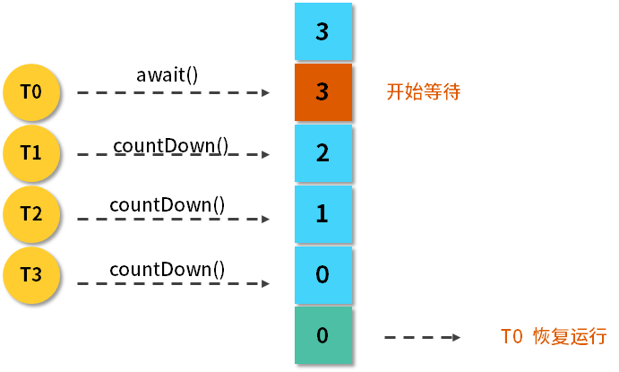

# 线程协作

## 信号量能被 FixedThreadPool 替代吗？

这篇文章我们将介绍控制并发流程的工具类，作用就是更容易地让线程之间相互配合，比如让线程 A 等待线程 B 执行完毕后再继续执行，来满足业务逻辑。这篇文章我们从 Semaphore（信号量）开始介绍。

### Semaphore 信号量


从图中可以看出，信号量的一个最主要的作用就是，来控制那些需要限制并发访问量的资源。具体来讲，信号量会维护“许可证”的计数，而线程去访问共享资源前，必须先拿到许可证。线程可以从信号量中去“获取”一个许可证，一旦线程获取之后，信号量持有的许可证就转移过去了，所以信号量手中剩余的许可证要减一。

同理，线程也可以“释放”一个许可证，如果线程释放了许可证，这个许可证相当于被归还给信号量了，于是信号量中的许可证的可用数量加一。当信号量拥有的许可证数量减到 0 时，如果下个线程还想要获得许可证，那么这个线程就必须等待，直到之前得到许可证的线程释放，它才能获取。由于线程在没有获取到许可证之前不能进一步去访问被保护的共享资源，所以这就控制了资源的并发访问量，这就是整体思路。

### 用法

讲完了场景之后，我们来看一下具体的用法，使用流程主要分为以下三步。

首先初始化一个信号量，并且传入许可证的数量，这是它的带公平参数的构造函数：public Semaphore(int permits, boolean fair)，传入两个参数，第一个参数是许可证的数量，另一个参数是是否公平。如果第二个参数传入 true，则代表它是公平的策略，会把之前已经等待的线程放入到队列中，而当有新的许可证到来时，它会把这个许可证按照顺序发放给之前正在等待的线程；如果这个构造函数第二个参数传入 false，则代表非公平策略，也就有可能插队，就是说后进行请求的线程有可能先得到许可证。

第二个流程是在建立完这个构造函数，初始化信号量之后，我们就可以利用 acquire() 方法。在调用慢服务之前，让线程来调用 acquire 方法或者 acquireUninterruptibly方法，这两个方法的作用是要获取许可证，这同时意味着只有这个方法能顺利执行下去的话，它才能进一步访问这个代码后面的调用慢服务的方法。如果此时信号量已经没有剩余的许可证了，那么线程就会等在 acquire 方法的这一行代码中，所以它也不会进一步执行下面调用慢服务的方法。我们正是用这种方法，保护了我们的慢服务。

acquire() 和 acquireUninterruptibly() 的区别是：是否能响应中断。acquire() 是可以支持中断的，也就是说，它在获取信号量的期间，假设这个线程被中断了，那么它就会跳出 acquire() 方法，不再继续尝试获取了。而 acquireUninterruptibly() 方法是不会被中断的。

第三步就是在任务执行完毕之后，调用 release() 来释放许可证，比如说我们在执行完慢服务这行代码之后，再去执行 release() 方法，这样一来，许可证就会还给我们的信号量了。

#### 其他主要方法介绍

除了这几个主要方法以外，还有一些其他的方法，我再来介绍一下。

##### （1）public boolean tryAcquire()

tryAcquire 和之前介绍锁的 trylock 思维是一致的，是尝试获取许可证，相当于看看现在有没有空闲的许可证，如果有就获取，如果现在获取不到也没关系，不必陷入阻塞，可以去做别的事。

##### （2）public boolean tryAcquire(long timeout, TimeUnit unit)

同样有一个重载的方法，它里面传入了超时时间。比如传入了 3 秒钟，则意味着最多等待 3 秒钟，如果等待期间获取到了许可证，则往下继续执行；如果超时时间到，依然获取不到许可证，它就认为获取失败，且返回 false。

##### （3）availablePermits()

这个方法用来查询可用许可证的数量，返回一个整型的结果。

#### 示例代码

下面我们来看一段示例代码：

```java
public class SemaphoreDemo2 {

    static Semaphore semaphore = new Semaphore(3);

    public static void main(String[] args) {
        ExecutorService service = Executors.newFixedThreadPool(50);
        for (int i = 0; i < 1000; i++) {
            service.submit(new Task());
        }
        service.shutdown();
    }

    static class Task implements Runnable {

        @Override
        public void run() {
            try {
                semaphore.acquire();
            } catch (InterruptedException e) {
                e.printStackTrace();
            }
            System.out.println(Thread.currentThread().getName() + "拿到了许可证，花费2秒执行慢服务");
            try {
                Thread.sleep(2000);
            } catch (InterruptedException e) {
                e.printStackTrace();
            }
            System.out.println("慢服务执行完毕，" + Thread.currentThread().getName() + "释放了许可证");
            semaphore.release();
        }
    }
}
```

### 注意点

信号量还有几个注意点：

- 获取和释放的许可证数量尽量保持一致，否则比如每次都获取 2 个但只释放 1 个甚至不释放，那么信号量中的许可证就慢慢被消耗完了，最后导致里面没有许可证了，那其他的线程就再也没办法访问了；
- 在初始化的时候可以设置公平性，如果设置为 true 则会让它更公平，但如果设置为 false 则会让总的吞吐量更高。
- 信号量是支持跨线程、跨线程池的，而且并不是哪个线程获得的许可证，就必须由这个线程去释放。事实上，对于获取和释放许可证的线程是没有要求的，比如线程 A 获取了然后由线程 B 释放，这完全是可以的，只要逻辑合理即可。

### 信号量能被 FixedThreadPool 替代吗？

让我们回到本课时的题目：信号量能不能被 FixedThreadPool 代替呢？这个问题相当于，信号量是可以限制同时访问的线程数，那为什么不直接用固定数量线程池去限制呢？这样不是更方便吗？比如说线程池里面有 3 个线程，那自然最多只有 3 个线程去访问了。

这是一个很好的问题，我们在实际业务中会遇到这样的情况：假如，在调用慢服务之前需要有个判断条件，比如只想在每天的零点附近去访问这个慢服务时受到最大线程数的限制（比如 3 个线程），而在除了每天零点附近的其他大部分时间，我们是希望让更多的线程去访问的。所以在这种情况下就应该把线程池的线程数量设置为 50 ，甚至更多，然后在执行之前加一个 if 判断，如果符合时间限制了（比如零点附近），再用信号量去额外限制，这样做是比较合理的。

再说一个例子，比如说在大型应用程序中会有不同类型的任务，它们也是通过不同的线程池来调用慢服务的。因为调用方不只是一处，可能是 Tomcat 服务器或者网关，我们就不应该限制，或者说也无法做到限制它们的线程池的大小。但可以做的是，在执行任务之前用信号量去限制一下同时访问的数量，因为我们的信号量具有跨线程、跨线程池的特性，所以即便这些请求来自于不同的线程池，我们也可以限制它们的访问。如果用 FixedThreadPool 去限制，那就做不到跨线程池限制了，这样的话会让功能大大削弱。

基于以上的理由，如果想要限制并发访问的线程数，用信号量是更合适的。

## CountDownLatch 是如何安排线程执行顺序的？

我们先来介绍一下 CountDownLatch，它是 JDK 提供的**并发流程控制**的工具类，它是在 java.util.concurrent 包下，在 JDK1.5 以后加入的。下面举个例子来说明它主要在什么场景下使用。

比如我们去游乐园坐激流勇进，有的时候游乐园里人不是那么多，这时，管理员会让你稍等一下，等人坐满了再开船，这样的话可以在一定程度上节约游乐园的成本。座位有多少，就需要等多少人，这就是 **CountDownLatch** 的核心思想，等到一个设定的数值达到之后，才能出发。

### 流程图

我们把激流勇进的例子用流程图的方式来表示：



可以看到，最开始 CountDownLatch 设置的初始值为 3，然后 T0 线程上来就调用 await 方法，它的作用是让这个线程开始等待，等待后面的 T1、T2、T3，它们每一次调用 countDown 方法，3 这个数值就会减 1，也就是从 3 减到 2，从 2 减到 1，从 1 减到 0，一旦减到 0 之后，这个 T0 就相当于达到了自己触发继续运行的条件，于是它就恢复运行了。

### 主要方法介绍

下面介绍一下 CountDownLatch 的主要方法。

**（1）构造函数：**public CountDownLatch(int count) {  };

它的构造函数是传入一个参数，该参数 count 是需要倒数的数值。

**（2）await()：**调用 await() 方法的线程开始等待，直到倒数结束，也就是 count 值为 0 的时候才会继续执行。

**（3）await(long timeout, TimeUnit unit)：**await() 有一个重载的方法，里面会传入超时参数，这个方法的作用和 await() 类似，但是这里可以设置超时时间，如果超时就不再等待了。

**（4）countDown()：**把数值倒数 1，也就是将 count 值减 1，直到减为 0 时，之前等待的线程会被唤起。

### 用法

接着来介绍一下 CountDownLatch 的两个典型用法。

#### 用法一：一个线程等待其他多个线程都执行完毕，再继续自己的工作

在实际场景中，很多情况下需要我们初始化一系列的前置条件（比如建立连接、准备数据），在这些准备条件都完成之前，是不能进行下一步工作的，所以这就是利用 CountDownLatch 的一个很好场景，我们可以让应用程序的主线程在其他线程都准备完毕之后再继续执行。

举个生活中的例子，那就是运动员跑步的场景，比如在比赛跑步时有 5 个运动员参赛，终点有一个裁判员，什么时候比赛结束呢？那就是当所有人都跑到终点之后，这相当于裁判员等待 5 个运动员都跑到终点，宣布比赛结束。我们用代码的形式来写出运动员跑步的场景，代码如下：

```java
public class RunDemo1 {

    public static void main(String[] args) throws InterruptedException {
        CountDownLatch latch = new CountDownLatch(5);
        ExecutorService service = Executors.newFixedThreadPool(5);
        for (int i = 0; i < 5; i++) {
            final int no = i + 1;
            Runnable runnable = new Runnable() {

                @Override
                public void run() {
                    try {
                        Thread.sleep((long) (Math.random() * 10000));
                        System.out.println(no + "号运动员完成了比赛。");
                    } catch (InterruptedException e) {
                        e.printStackTrace();
                    } finally {
                        latch.countDown();
                    }
                }
            };
            service.submit(runnable);
        }
        System.out.println("等待5个运动员都跑完.....");
        latch.await();
        System.out.println("所有人都跑完了，比赛结束。");
    }
}
```

在这段代码中，我们新建了一个初始值为 5 的 CountDownLatch，然后建立了一个固定 5 线程的线程池，用一个 for 循环往这个线程池中提交 5 个任务，每个任务代表一个运动员，这个运动员会首先随机等待一段时间，代表他在跑步，然后打印出他完成了比赛，在跑完了之后，同样会调用 countDown 方法来把计数减 1。

之后我们再回到主线程，主线程打印完“等待 5 个运动员都跑完”这句话后，会调用 await() 方法，代表让主线程开始等待，在等待之前的那几个子线程都执行完毕后，它才会认为所有人都跑完了比赛。这段程序的运行结果如下所示：

```bash
等待5个运动员都跑完.....
4号运动员完成了比赛。
3号运动员完成了比赛。
1号运动员完成了比赛。
5号运动员完成了比赛。
2号运动员完成了比赛。
所有人都跑完了，比赛结束。
```

可以看出，直到 5 个运动员都完成了比赛之后，主线程才会继续，而且由于子线程等待的时间是随机的，所以各个运动员完成比赛的次序也是随机的。

#### 用法二：多个线程等待某一个线程的信号，同时开始执行

这和第一个用法有点相反，我们再列举一个实际的场景，比如在运动会上，刚才说的是裁判员等运动员，现在是运动员等裁判员。在运动员起跑之前都会等待裁判员发号施令，一声令下运动员统一起跑，我们用代码把这件事情描述出来，如下所示：

```java
public class RunDemo2 {

    public static void main(String[] args) throws InterruptedException {
        System.out.println("运动员有5秒的准备时间");
        CountDownLatch countDownLatch = new CountDownLatch(1);
        ExecutorService service = Executors.newFixedThreadPool(5);
        for (int i = 0; i < 5; i++) {
            final int no = i + 1;
            Runnable runnable = new Runnable() {
                @Override
                public void run() {
                    System.out.println(no + "号运动员准备完毕，等待裁判员的发令枪");
                    try {
                        countDownLatch.await();
                        System.out.println(no + "号运动员开始跑步了");
                    } catch (InterruptedException e) {
                        e.printStackTrace();
                    }
                }
            };
            service.submit(runnable);
        }
        Thread.sleep(5000);
        System.out.println("5秒准备时间已过，发令枪响，比赛开始！");
        countDownLatch.countDown();
    }
}
```

在这段代码中，首先打印出了运动员有 5 秒的准备时间，然后新建了一个 CountDownLatch，其倒数值只有 1；接着，同样是一个 5 线程的线程池，并且用 for 循环的方式往里提交 5 个任务，而这 5 个任务在一开始时就让它调用 await() 方法开始等待。

接下来我们再回到主线程。主线程会首先等待 5 秒钟，这意味着裁判员正在做准备工作，比如他会喊“各就各位，预备”这样的话语；然后 5 秒之后，主线程会打印出“5 秒钟准备时间已过，发令枪响，比赛开始”的信号，紧接着会调用 countDown 方法，一旦主线程调用了该方法，那么之前那 5 个已经调用了 await() 方法的线程都会被唤醒，所以这段程序的运行结果如下：

```bash
运动员有5秒的准备时间
2号运动员准备完毕，等待裁判员的发令枪
1号运动员准备完毕，等待裁判员的发令枪
3号运动员准备完毕，等待裁判员的发令枪
4号运动员准备完毕，等待裁判员的发令枪
5号运动员准备完毕，等待裁判员的发令枪
5秒准备时间已过，发令枪响，比赛开始！
2号运动员开始跑步了
1号运动员开始跑步了
5号运动员开始跑步了
4号运动员开始跑步了
3号运动员开始跑步了
```

可以看到，运动员首先会有 5 秒钟的准备时间，然后 5 个运动员分别都准备完毕了，等待发令枪响，紧接着 5 秒之后，发令枪响，比赛开始，于是 5 个子线程几乎同时开始跑步了。

### 注意点

下面来讲一下 CountDownLatch 的注意点：

- 刚才讲了两种用法，其实这两种用法并不是孤立的，甚至可以把这两种用法结合起来，比如利用两个 CountDownLatch，第一个初始值为多个，第二个初始值为 1，这样就可以应对更复杂的业务场景了；
- CountDownLatch 是不能够重用的，比如已经完成了倒数，那可不可以在下一次继续去重新倒数呢？这是做不到的，如果你有这个需求的话，可以考虑使用 CyclicBarrier 或者创建一个新的 CountDownLatch 实例。

## CyclicBarrier 和 CountdownLatch 有什么异同？

### CyclicBarrier

CyclicBarrier 和 CountDownLatch 确实有一定的相似性，它们都能阻塞一个或者一组线程，直到某种预定的条件达到之后，这些之前在等待的线程才会统一出发，继续向下执行。正因为它们有这个相似点，你可能会认为它们的作用是完全一样的，其实并不是。

CyclicBarrier 可以构造出一个集结点，当某一个线程执行 await() 的时候，它就会到这个集结点开始等待，等待这个栅栏被撤销。直到预定数量的线程都到了这个集结点之后，这个栅栏就会被撤销，之前等待的线程就在此刻统一出发，继续去执行剩下的任务。

举一个生活中的例子。假设我们班级春游去公园里玩，并且会租借三人自行车，每个人都可以骑，但由于这辆自行车是三人的，所以要凑齐三个人才能骑一辆，而且从公园大门走到自行车驿站需要一段时间。那么我们模拟这个场景，写出如下代码：

```java
public class CyclicBarrierDemo {

    public static void main(String[] args) {
        CyclicBarrier cyclicBarrier = new CyclicBarrier(3);
        for (int i = 0; i < 6; i++) {
            new Thread(new Task(i + 1, cyclicBarrier)).start();
        }
    }

    static class Task implements Runnable {

        private int id;
        private CyclicBarrier cyclicBarrier;

        public Task(int id, CyclicBarrier cyclicBarrier) {
            this.id = id;
            this.cyclicBarrier = cyclicBarrier;
        }

        @Override
        public void run() {
            System.out.println("同学" + id + "现在从大门出发，前往自行车驿站");
            try {
                Thread.sleep((long) (Math.random() * 10000));
                System.out.println("同学" + id + "到了自行车驿站，开始等待其他人到达");
                cyclicBarrier.await();
                System.out.println("同学" + id + "开始骑车");
            } catch (InterruptedException e) {
                e.printStackTrace();
            } catch (BrokenBarrierException e) {
                e.printStackTrace();
            }
        }
    }
}
```

在这段代码中可以看到，首先建了一个参数为 3 的 CyclicBarrier，参数为 3 的意思是需要等待 3 个线程到达这个集结点才统一放行；然后我们又在 for 循环中去开启了 6 个线程，每个线程中执行的 Runnable 对象就在下方的 Task 类中，直接看到它的 run 方法，它首先会打印出"同学某某现在从大门出发，前往自行车驿站"，然后是一个随机时间的睡眠，这就代表着从大门开始步行走到自行车驿站的时间，由于每个同学的步行速度不一样，所以时间用随机值来模拟。

当同学们都到了驿站之后，比如某一个同学到了驿站，首先会打印出“同学某某到了自行车驿站，开始等待其他人到达”的消息，然后去调用 CyclicBarrier 的 await() 方法。一旦它调用了这个方法，它就会陷入等待，直到三个人凑齐，才会继续往下执行，一旦开始继续往下执行，就意味着 3 个同学开始一起骑车了，所以打印出“某某开始骑车”这个语句。

接下来我们运行一下这个程序，结果如下所示：

```java
同学1现在从大门出发，前往自行车驿站
同学3现在从大门出发，前往自行车驿站
同学2现在从大门出发，前往自行车驿站
同学4现在从大门出发，前往自行车驿站
同学5现在从大门出发，前往自行车驿站
同学6现在从大门出发，前往自行车驿站
同学5到了自行车驿站，开始等待其他人到达
同学2到了自行车驿站，开始等待其他人到达
同学3到了自行车驿站，开始等待其他人到达
同学3开始骑车
同学5开始骑车
同学2开始骑车
同学6到了自行车驿站，开始等待其他人到达
同学4到了自行车驿站，开始等待其他人到达
同学1到了自行车驿站，开始等待其他人到达
同学1开始骑车
同学6开始骑车
同学4开始骑车
```

### CyclicBarrier 和 CountDownLatch 的异同

下面我们来总结一下 CyclicBarrier 和 CountDownLatch 有什么异同。

相同点：都能阻塞一个或一组线程，直到某个预设的条件达成发生，再统一出发。

但是它们也有很多不同点，具体如下。

- 作用对象不同：CyclicBarrier 要等固定数量的线程都到达了栅栏位置才能继续执行，而 CountDownLatch 只需等待数字倒数到 0，也就是说 CountDownLatch 作用于事件，但 CyclicBarrier 作用于线程；CountDownLatch 是在调用了 countDown 方法之后把数字倒数减 1，而 CyclicBarrier 是在某线程开始等待后把计数减 1。

- 可重用性不同：CountDownLatch 在倒数到 0  并且触发门闩打开后，就不能再次使用了，除非新建一个新的实例；而 CyclicBarrier 可以重复使用，在刚才的代码中也可以看出，每 3 个同学到了之后都能出发，并不需要重新新建实例。CyclicBarrier 还可以随时调用 reset 方法进行重置，如果重置时有线程已经调用了 await 方法并开始等待，那么这些线程则会抛出 BrokenBarrierException 异常。

- 执行动作不同：CyclicBarrier 有执行动作 barrierAction，而 CountDownLatch 没这个功能。