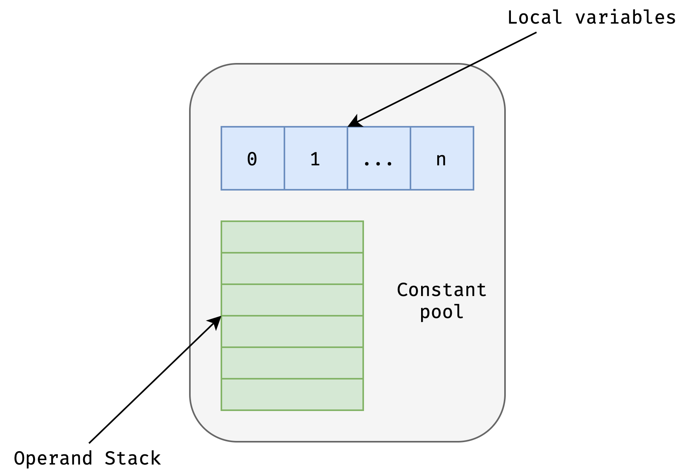

# JVM核心技术

## Java字节码技术

### 什么是字节码？

Java字节码由单字节的指令组成，理论上最多支持256个操作码。实际上Java只使用了200左右的操作码，还有一些操作码则保留给调试操作。由前缀+操作名称组成。

根据指令的性质分为：

1. 栈操作指令，包括与局部变量操作指令

2. 程序流程控制指令

3. 对象操作指令，包括方法调用指令

4. 算术运算以及类型转换指令

### 获取字节码

在`run/yuyang/java`文件夹下编写`Hello.java`：

```java
package run.yuyang.java;

public class Hello{

    public static void main(String[] args){

        Hello Hello = new Hello();

    }

}
```

编译代码：

```bash
javac run/yuyang/java/Hello.java
```

查看字节码:

```bash
javap -c run.yuyang.java.Hello
```

得到：

```java
Compiled from "Hello.java"
public class run.yuyang.java.Hello {
  public run.yuyang.java.Hello();
    Code:
       0: aload_0
       1: invokespecial #1                  // Method java/lang/Object."<init>":()V
       4: return

  public static void main(java.lang.String[]);
    Code:
       0: new           #2                  // class run/yuyang/java/Hello
       3: dup
       4: invokespecial #3                  // Method "<init>":()V
       7: astore_1
       8: return
}
```

### 字节码的运行时结构



JVM 是一台基于栈的计算机器。

每个线程都有一个独属于自己的线程栈（JVM Stack），用于存储栈帧（Frame）。

每一次方法调用，JVM 都会自动创建一个栈帧。

栈帧由操作数栈， 局部变量数组以及一个 Class 引用组成。

Class 引用 指向当前方法在运行时常量池中对应的 Class。