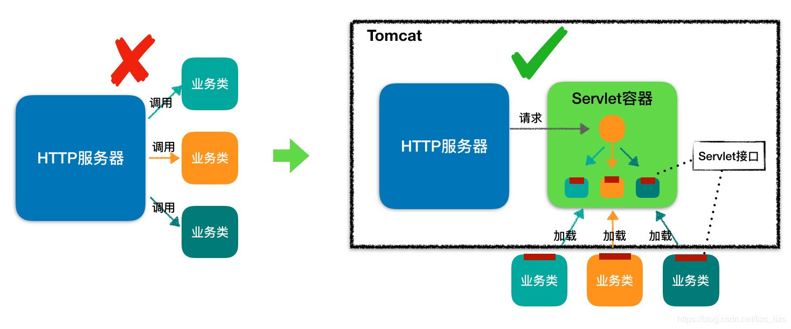
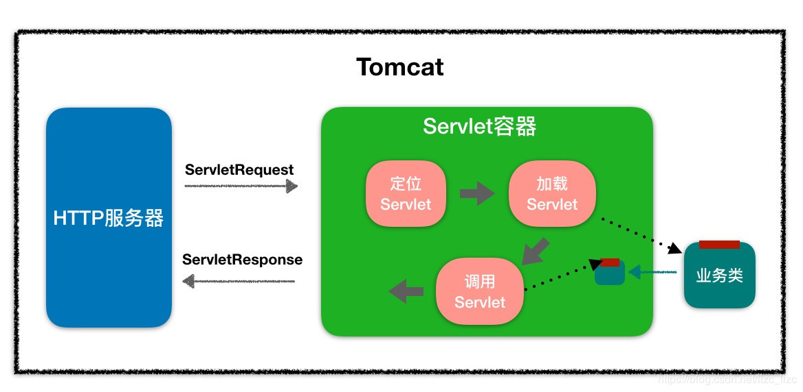

# Servlet

**Servlet3.1规范中文译本**[Servlet3.1-Specification.pdf](/notes/Java/进阶课程/小马哥的Java项目实战营/file/Servlet3.1-Specification.pdf ':ignore')

浏览器发给服务端的是一个 HTTP 格式的请求，HTTP 服务器收到这个请求后，需要调用服务端程序来处理，所谓的服务端程序就是你写的 Java 类，一般来说不同的请求需要由不同的 Java 类来处理。

那么问题来了，HTTP 服务器怎么知道要调用哪个 Java 类的哪个方法呢。最直接的做法是在 HTTP 服务器代码里写一大堆 if else 逻辑判断：如果是 A 请求就调 X 类的 M1 方法，如果是 B 请求就调 Y 类的 M2 方法。但这样做明显有问题，因为 HTTP 服务器的代码跟业务逻辑耦合在一起了，如果新加一个业务方法还要改 HTTP 服务器的代码。

那该怎么解决这个问题呢？我们知道，面向接口编程是解决耦合问题的法宝，于是有一伙人就定义了一个接口，各种业务类都必须实现这个接口，这个接口就叫 Servlet 接口，有时我们也把实现了 Servlet 接口的业务类叫作 Servlet。

但是这里还有一个问题，对于特定的请求，HTTP 服务器如何知道由哪个 Servlet 来处理呢？Servlet 又是由谁来实例化呢？显然 HTTP 服务器不适合做这个工作，否则又和业务类耦合了。

于是，还是那伙人又发明了 Servlet 容器，Servlet 容器用来加载和管理业务类。HTTP 服务器不直接跟业务类打交道，而是把请求交给 Servlet 容器去处理，Servlet 容器会将请求转发到具体的 Servlet，如果这个 Servlet 还没创建，就加载并实例化这个 Servlet，然后调用这个 Servlet 的接口方法。因此 Servlet 接口其实是 Servlet 容器跟具体业务类之间的接口。下面我们通过一张图来加深理解。



**常见的Web服务器**

- Tomcat
- Jetty
- Resin
- Apache
- Nginx
- WebSphere
- WebLogic
- JBoss

## Servlet 简介

### 什么是 Servlet

Servlet（Server Applet），即小服务程序或服务连接器。Servlet 是 Java 编写的服务器端程序，具有独立于平台和协议的特性，主要功能在于交互式地浏览和生成数据，生成动态 Web 内容。

- 狭义的 Servlet 是指 Java 实现的一个接口。
- 广义的 Servlet 是指任何实现了这个 Servlet 接口的类。

Servlet 运行于支持 Java 的应用服务器中。从原理上讲，Servlet 可以响应任何类型的请求，但绝大多数情况下 Servlet 只用来扩展基于 HTTP 协议的 Web 服务器。

### Servlet 和 CGI 的区别

Servlet 技术出现之前，Web 主要使用 CGI 技术。它们的区别如下：

- Servlet 是基于 Java 编写的，处于服务器进程中，他能够通过多线程方式运行 service() 方法，一个实例可以服务于多个请求，而且一般不会销毁；
- CGI(Common Gateway Interface)，即通用网关接口。它会为每个请求产生新的进程，服务完成后销毁，所以效率上低于 Servlet。

### 工作流程

当客户请求某个资源时，HTTP 服务器会用一个 ServletRequest 对象把客户的请求信息封装起来，然后调用 Servlet 容器的 service 方法，Servlet 容器拿到请求后，根据请求的 URL 和 Servlet 的映射关系，找到相应的 Servlet，如果 Servlet 还没有被加载，就用反射机制创建这个 Servlet，并调用 Servlet 的 init 方法来完成初始化，接着调用 Servlet 的 service 方法来处理请求，把 ServletResponse 对象返回给 HTTP 服务器，HTTP 服务器会把响应发送给客户端。同样我通过一张图来帮助你理解。



### Servlet 版本以及主要特性


| 版本        | 日期          | JAVA EE/JDK 版本   | 特性                                                         |
| ----------- | ------------- | ------------------ | ------------------------------------------------------------ |
| Servlet 4.0 | 2017 年 10 月 | JavaEE 8           | HTTP2                                                        |
| Servlet 3.1 | 2013 年 5 月  | JavaEE 7           | 非阻塞 I/O，HTTP 协议升级机制                                |
| Servlet 3.0 | 2009 年 12 月 | JavaEE 6, JavaSE 6 | 可插拔性，易于开发，异步 Servlet，安全性，文件上传           |
| Servlet 2.5 | 2005 年 10 月 | JavaEE 5, JavaSE 5 | 依赖 JavaSE 5，支持注解                                      |
| Servlet 2.4 | 2003 年 11 月 | J2EE 1.4, J2SE 1.3 | web.xml 使用 XML Schema                                      |
| Servlet 2.3 | 2001 年 8 月  | J2EE 1.3, J2SE 1.2 | Filter                                                       |
| Servlet 2.2 | 1999 年 8 月  | J2EE 1.2, J2SE 1.2 | 成为 J2EE 标准                                               |
| Servlet 2.1 | 1998 年 11 月 | 未指定             | First official specification, added RequestDispatcher, ServletContext |
| Servlet 2.0 |               | JDK 1.1            | Part of Java Servlet Development Kit 2.0                     |
| Servlet 1.0 | 1997 年 6 月  |                    |                                                              |

## Servlet API

### Servlet 包

Java Servlet 是运行在带有支持 Java Servlet 规范的解释器的 web 服务器上的 Java 类。

Servlet 可以使用 **javax.servlet** 和 **javax.servlet.http** 包创建，它是 Java 企业版的标准组成部分，Java 企业版是支持大型开发项目的 Java 类库的扩展版本。

Java Servlet 就像任何其他的 Java 类一样已经被创建和编译。在您安装 Servlet 包并把它们添加到您的计算机上的 Classpath 类路径中之后，您就可以通过 JDK 的 Java 编译器或任何其他编译器来编译 Servlet。

### Servlet 接口

Servlet 接口定义了下面五个方法：

```java
public interface Servlet {
    void init(ServletConfig var1) throws ServletException;

    ServletConfig getServletConfig();

    void service(ServletRequest var1, ServletResponse var2) throws ServletException, IOException;

    String getServletInfo();

    void destroy();
}
```

#### init() 方法

init 方法被设计成只调用一次。它在第一次创建 Servlet 时被调用，在后续每次用户请求时不再调用。因此，它是用于一次性初始化，就像 Applet 的 init 方法一样。

Servlet 创建于用户第一次调用对应于该 Servlet 的 URL 时，但是您也可以指定 Servlet 在服务器第一次启动时被加载。

当用户调用一个 Servlet 时，就会创建一个 Servlet 实例，每一个用户请求都会产生一个新的线程，适当的时候移交给 doGet 或 doPost 方法。init() 方法简单地创建或加载一些数据，这些数据将被用于 Servlet 的整个生命周期。

init 方法的定义如下：

```java
public void init() throws ServletException {
  // 初始化代码...
}
```

#### service() 方法

`service()` **方法是执行实际任务的核心方法**。Servlet 容器（即 Web 服务器）调用 `service()` 方法来处理来自客户端（浏览器）的请求，并把格式化的响应写回给客户端。

`service()` 方法有两个参数：`ServletRequest` 和 `ServletResponse`。`ServletRequest` 用来封装请求信息，`ServletResponse` 用来封装响应信息，因此本质上这两个类是对通信协议的封装。

每次服务器接收到一个 Servlet 请求时，服务器会产生一个新的线程并调用服务。`service()` 方法检查 HTTP 请求类型（GET、POST、PUT、DELETE 等），并在适当的时候调用 `doGet`、`doPost`、`doPut`，`doDelete` 等方法。

下面是该方法的特征：

```java
public void service(ServletRequest request,
                    ServletResponse response)
      throws ServletException, IOException{
}
```

service() 方法由容器调用，service 方法在适当的时候调用 doGet、doPost、doPut、doDelete 等方法。所以，您不用对 service() 方法做任何动作，您只需要根据来自客户端的请求类型来重写 doGet() 或 doPost() 即可。

doGet() 和 doPost() 方法是每次服务请求中最常用的方法。下面是这两种方法的特征。

#### doGet() 方法

GET 请求来自于一个 URL 的正常请求，或者来自于一个未指定 METHOD 的 HTML 表单，它由 doGet() 方法处理。

```java
public void doGet(HttpServletRequest request,
                  HttpServletResponse response)
    throws ServletException, IOException {
    // Servlet 代码
}
```

#### doPost() 方法

POST 请求来自于一个特别指定了 METHOD 为 POST 的 HTML 表单，它由 doPost() 方法处理。

```java
public void doPost(HttpServletRequest request,
                   HttpServletResponse response)
    throws ServletException, IOException {
    // Servlet 代码
}
```

#### destroy() 方法

destroy() 方法只会被调用一次，在 Servlet 生命周期结束时被调用。destroy() 方法可以让您的 Servlet 关闭数据库连接、停止后台线程、把 Cookie 列表或点击计数器写入到磁盘，并执行其他类似的清理活动。

在调用 destroy() 方法之后，servlet 对象被标记为垃圾回收。destroy 方法定义如下所示：

```java
  public void destroy() {
    // 终止化代码...
  }
```

## 扩展机制

引入了 Servlet 规范后，你不需要关心 Socket 网络通信、不需要关心 HTTP 协议，也不需要关心你的业务类是如何被实例化和调用的，因为这些都被 Servlet 规范标准化了，你只要关心怎么实现的你的业务逻辑。这对于程序员来说是件好事，但也有不方便的一面。所谓规范就是说大家都要遵守，就会千篇一律，但是如果这个规范不能满足你的业务的个性化需求，就有问题了，因此设计一个规范或者一个中间件，要充分考虑到可扩展性。Servlet 规范提供了两种扩展机制：Filter 和 Listener。

**Filter** 是过滤器，这个接口允许你对请求和响应做一些统一的定制化处理，比如你可以根据请求的频率来限制访问，或者根据国家地区的不同来修改响应内容。过滤器的工作原理是这样的：Web 应用部署完成后，Servlet 容器需要实例化 Filter 并把 Filter 链接成一个 FilterChain。当请求进来时，获取第一个 Filter 并调用 doFilter 方法，doFilter 方法负责调用这个 FilterChain 中的下一个 Filter。

**Listener** 是监听器，这是另一种扩展机制。当 Web 应用在 Servlet 容器中运行时，Servlet 容器内部会不断的发生各种事件，如 Web 应用的启动和停止、用户请求到达等。 Servlet 容器提供了一些默认的监听器来监听这些事件，当事件发生时，Servlet 容器会负责调用监听器的方法。当然，你可以定义自己的监听器去监听你感兴趣的事件，将监听器配置在 web.xml 中。比如 Spring 就实现了自己的监听器，来监听 ServletContext 的启动事件，目的是当 Servlet 容器启动时，创建并初始化全局的 Spring 容器。

