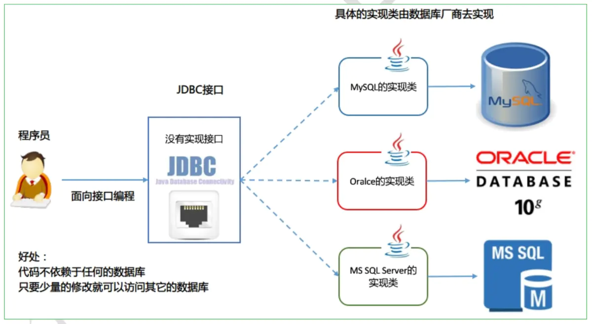

# 数据存储之JDBC

## JDBC介绍

JDBC: `Java DataBase Connectivity`

JDBC规范定义接口，具体的实现由各大数据库厂商来实现。

> JDBC是Java访问关系型数据库的标准规范接口，真正怎么操作数据库还需要具体的实现类，也就是**数据库驱动，数据库驱动由数据库厂商提供对应的jar包**。每个数据库厂商根据自家数据库的通信格式编写好自己数据库的驱动。所以我们只需要使用多态方式调用 JDBC 接口中的方法即可。

**使用JDBC的好处**

1. 调用JDBC接口中的方法，即可开发访问数据库的程序。
2. 使用同一套 Java 代码，进行少量的修改就可以访问其他 JDBC 支持的数据库



## JDBC连接过程

JDBC我们写Java的程序员实在是太过熟悉了，如今的后端系统不论大小几乎都抹不开和数据库存在联系。

JDBC是一个连接数据库的Java API，包含了相关的接口和类。但是，他不提供针对具体数据库（MySQL、MS、Oracle）的实际操作，而只是提供了接口，以及调用框架。和具体数据库的直接交互由对应的驱动程序完成，比如mysql的mysql-connector、oracle的ojdbc、MS的sqljdbc等。

现在ORM框架火热流行，程序员需要关注的数据库交互更加少了，需要做的基本上就是配框架，写sql就好了。

所以，让我们先回顾一下jdbc的一般连接过程。

1、加载JDBC驱动程序：

```java
Class.forName("com.mysql.jdbc.Driver") ;   
```

2、提供JDBC连接的URL

```java
String url = jdbc:mysql://localhost:3306/test?useUnicode=true&characterEncoding=utf8
```

3、创建数据库的连接

```java
    Connection con =    
             DriverManager.getConnection(url , username , password ) ;   
```

4、创建一个Statement

```java
PreparedStatement pstmt = con.prepareStatement(sql) ;   
```

5、执行SQL语句

```java
ResultSet rs = stmt.executeQuery("SELECT * FROM ...") ;   
```

6、处理结果

```java
     while(rs.next()){   
         //do something
     }  
```

7、关闭JDBC对象

### Class.forName作用

我们都知道，也听了无数遍，驱动的加载是由Class.forName 方法完成的。

但是，让我们深究一下，Class.forName是JSE里面加载一个类到JVM内存的方法，为什么又会关联了JDBC的驱动加载逻辑呢？

如果是的话，那么其他和JDBC无关的类加载也会调用JDBC驱动加载的相关逻辑吗？

是不是觉得问题很大，是不是觉得如果是我们来说设计JSE也不会做这样的事情？

### 给Class.forName正名

确实JDBC驱动的加载是在Class.forName这一步完成的，但是完成这个工作的是加载的具体的数据库驱动类的静态初始化块完成的。

这里看一下mysql的驱动类的代码：

```java
public class Driver extends NonRegisteringDriver implements java.sql.Driver {
    //
    // Register ourselves with the DriverManager
    //
    static {
        try {
            java.sql.DriverManager.registerDriver(new Driver());
        } catch (SQLException E) {
            throw new RuntimeException("Can't register driver!");
        }
    }
}
```

由于JVM对类的加载有一个逻辑是：在类被需要的时候，或者首次调用的时候就会把类加载到JVM。反过来也就是：如果类没有被需要的时候，一般是不会被加载到JVM的。

当连接数据库的时候我们调用了Class.forName语句之后，数据库驱动类被加载到JVM，那么静态初始化块就会被执行，从而完成驱动的注册工作，也就是注册到了JDBC的DriverManager类中。

由于是静态初始化块中完成的加载，所以也就不必担心驱动被加载多次，原因可以参考单例模式相关的知识。

### 抛弃Class.forName

在JDBC 4.0之后实际上我们不需要再调用Class.forName来加载驱动程序了，我们只需要把驱动的jar包放到工程的类加载路径里，那么驱动就会被自动加载。

这个自动加载采用的技术叫做SPI，数据库驱动厂商也都做了更新。可以看一下jar包里面的META-INF/services目录，里面有一个java.sql.Driver的文件，文件里面包含了驱动的全路径名。

比如mysql-connector里面的内容：

```
com.mysql.jdbc.Driver
com.mysql.fabric.jdbc.FabricMySQLDriver
```

那么SPI技术又是在什么阶段加载的数据库驱动呢？看一下JDBC的DriverManager类就知道了。

```java
public class DriverManager {
    static {
        loadInitialDrivers();//......1
        println("JDBC DriverManager initialized");
    }

    private static void loadInitialDrivers() {
        String drivers;
        try {
            drivers = AccessController.doPrivileged(new PrivilegedAction<String>() {
                public String run() {
                 return System.getProperty("jdbc.drivers");
                }
                });
           } catch (Exception ex) {
                drivers = null;
           }

           AccessController.doPrivileged(new PrivilegedAction<Void>() {
                public Void run() {
                    ServiceLoader<Driver> loadedDrivers = ServiceLoader.load(Driver.class);//.....2
                   Iterator driversIterator = loadedDrivers.iterator();

                //.....
}
```

上述代码片段标记…1的位置是在DriverManager类加载是执行的静态初始化块，这里会调用loadInitialDrivers方法。

再看loadInitialDrivers方法里面标记…2的位置，这里调用的 `ServiceLoader.load(Driver.class);` 就会加载所有在META-INF/services/java.sql.Driver文件里边的类到JVM内存，完成驱动的自动加载。

这就是SPI的优势所在，能够自动的加载类到JVM内存。这个技术在阿里的dubbo框架里面也占到了很大的分量，有兴趣的朋友可以看一下dubbo的代码，或者百度一下dubbo的扩展机制。

### JDBC如何区分多个驱动？

一个项目里边很可能会即连接MySQL，又连接Oracle，这样在一个工程里边就存在了多个驱动类，那么这些驱动类又是怎么区分的呢？

关键点就在于getConnection的步骤，DriverManager.getConnection中会遍历所有已经加载的驱动实例去创建连接，当一个驱动创建连接成功时就会返回这个连接，同时不再调用其他的驱动实例。DriverManager关键代码如下：

```java
private static Connection getConnection(
    //.....

    for(DriverInfo aDriver : registeredDrivers) {
        if(isDriverAllowed(aDriver.driver, callerCL)) {
            try {
                println("    trying " + aDriver.driver.getClass().getName());
                Connection con = aDriver.driver.connect(url, info);
                if (con != null) {
                    // Success!
                    println("getConnection returning " + aDriver.driver.getClass().getName());
                        return (con);
                }
            } catch (SQLException ex) {
                if (reason == null) {
                      reason = ex;
                }
            }
        } else {
            println("    skipping: " + aDriver.getClass().getName());
        }
     }

    //......
```

是不是每个驱动实例都真真实实的要尝试建立连接呢？不是的！

每个驱动实例在getConnetion的第一步就是按照url判断是不是符合自己的处理规则，是的话才会和db建立连接。比如，MySQL驱动类中的关键代码：

```java
 public boolean acceptsURL(String url) throws SQLException {
        return (parseURL(url, null) != null);
    }

    public Properties parseURL(String url, Properties defaults)
            throws java.sql.SQLException {
        Properties urlProps = (defaults != null) ? new Properties(defaults)
                : new Properties();

        if (url == null) {
            return null;
        }

        if (!StringUtils.startsWithIgnoreCase(url, URL_PREFIX)
                && !StringUtils.startsWithIgnoreCase(url, MXJ_URL_PREFIX)
                && !StringUtils.startsWithIgnoreCase(url,
                        LOADBALANCE_URL_PREFIX)
                && !StringUtils.startsWithIgnoreCase(url,
                        REPLICATION_URL_PREFIX)) { //$NON-NLS-1$

            return null;
        }
        //......
```

## 简单的ORM框架

### 内省 Introspector

经常需要使用java对象的属性来封装程序的数据，每次都使用反射技术完成此类操作过于麻烦，所以sun公司开发了一套API，专门用于操作java对象的属性。

内省(IntroSpector)是Java语言对JavaBean 类属性、事件的一种处理方法。 例如类A中有属性name,那我们可以通过getName,setName 来得到其值或者设置新的值。 通过getName/setName 来访问name属性，这就是默认的规则。

Java中提供了一套API 用来访问某个属性的getter/setter方法，通过这些API可以使你不需要了解这个规则，这些API存放于包java.beans 中。

一般的做法是通过类Introspector的getBeanInfo方法获取某个对象的BeanInfo信息,然后通过BeanInfo来获取属性的描述器(PropertyDescriptor),通过这个属性描述器就可以获取某个属性对应的getter/setter方法,然后我们就可以通过反射机制来调用这些方法。

我们又通常把javabean的实例对象称之为值对象，因为这些bean中通常只有一些信息字段和存储方法，没有功能性方法。

一个JavaBean类可以不当JavaBean用，而当成普通类用。JavaBean实际就是一种规范，当一个类满足这个规范，这个类就能被其它特定的类调用。一个类被当作javaBean使用时，JavaBean的属性是根据方法名推断出来的，它根本看不到java类内部的成员变量。去掉set前缀，然后取剩余部分，如果剩余部分的第二个字母是小写的，则把剩余部分的首字母改成小的。

**内省访问JavaBean有两种方法：**

1. 通过PropertyDescriptor来操作Bean对象

```java
public static void demo1() throws Exception {
    User user = new User("zhangsan", 21);
    String propertyName = "name";
    // 直接指定要访问的属性
    PropertyDescriptor pd = new PropertyDescriptor(propertyName, user.getClass());
    // 获取到读方法
    Method readMethod = pd.getReadMethod();
    // 反射机制调用
    Object invoke = readMethod.invoke(user, null);
    System.out.println("名字：" + invoke);
    pd.getWriteMethod().invoke(user, "lisi");
    invoke = readMethod.invoke(user, null);
    System.out.println("名字：" + invoke);
    }
}
```

2. 通过Introspector类获得Bean对象的 BeanInfo，然后通过 BeanInfo 来获取属性的描述器（ PropertyDescriptor ），通过这个属性描述器就可以获取某个属性对应的 getter/setter 方法，然后通过反射机制来调用这些方法。

```java
public static void demo2() throws Exception {
    // 获取整个Bean的信息
    // BeanInfo beanInfo= Introspector.getBeanInfo(user.getClass());
    // 在Object类时候停止检索，可以选择在任意一个父类停止
    BeanInfo beanInfo = Introspector.getBeanInfo(user.getClass(), Object.class);

    System.out.println("所有属性描述：");
    // 获取所有的属性描述
    PropertyDescriptor[] pds = beanInfo.getPropertyDescriptors();
    for (PropertyDescriptor propertyDescriptor : pds) {
        System.out.println(propertyDescriptor.getName());
    }
    System.out.println("所有方法描述：");
    for (MethodDescriptor methodDescriptor : beanInfo.getMethodDescriptors()) {
        System.out.println(methodDescriptor.getName());
        // Method method = methodDescriptor.getMethod();
    }
}
```

**User.java**

```java
public class User {
    private String name;
    private int age;
    public User(String name, int age) {
        this.name = name;
        this.age = age;
    }
    public String getName() {
        return name;
    }
    public void setName(String name) {
        this.name = name;
    }
    public int getAge() {
        return age;
    }
    public void setAge(int age) {
        this.age = age;
    }
}
```

### ORM映射

```java
for (PropertyDescriptor propertyDescriptor : userBeanInfo.getPropertyDescriptors()) {
    String fieldName = propertyDescriptor.getName();
    Class fieldType = propertyDescriptor.getPropertyType();
    String methodName = typeMethodMappings.get(fieldType);
    // 可能存在映射关系（不过此处是相等的）
    String columnLabel = mapColumnLabel(fieldName);
    Method resultSetMethod = ResultSet.class.getMethod(methodName, String.class);
    // 通过放射调用 getXXX(String) 方法
    Object resultValue = resultSetMethod.invoke(resultSet, columnLabel);
    // 获取 User 类 Setter方法
    // PropertyDescriptor ReadMethod 等于 Getter 方法
    // PropertyDescriptor WriteMethod 等于 Setter 方法
    Method setterMethodFromUser = propertyDescriptor.getWriteMethod();
    // 以 id 为例，  user.setId(resultSet.getLong("id"));
    setterMethodFromUser.invoke(user, resultValue);
}
```