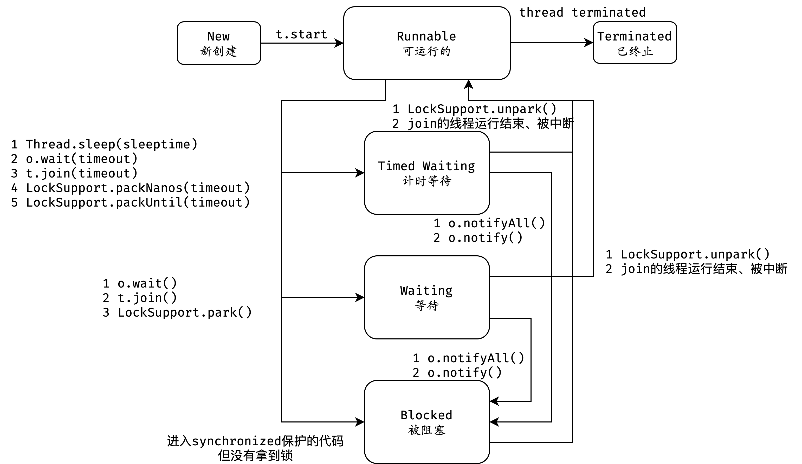
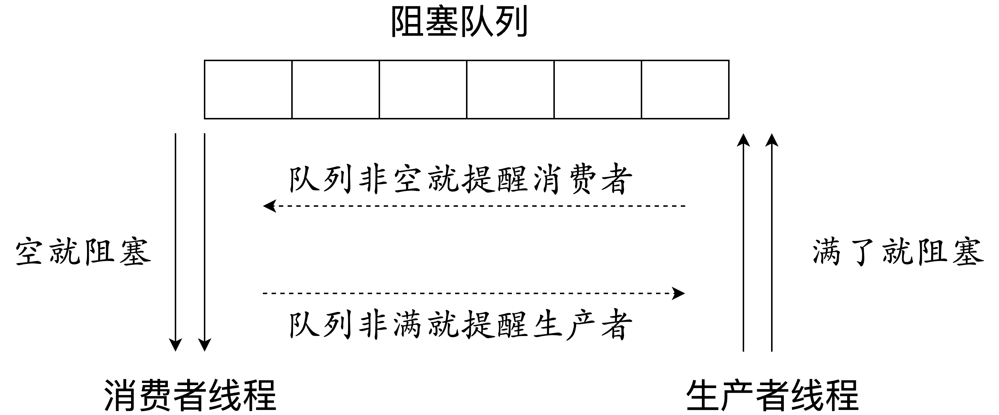

# 线程基础升华

## 为何说只有 1 种实现线程的方法？

### 实现 Runnable 接口

```java
public class RunnableThread implements Runnable {

    @Override
    public void run() {
        System.out.println('用实现Runnable接口实现线程');
    }
}

```

第 1 种方式是通过实现 Runnable 接口实现多线程，如代码所示，首先通过 RunnableThread 类实现 Runnable 接口，然后重写 run() 方法，之后只需要把这个实现了 run() 方法的实例传到 Thread 类中就可以实现多线程。

### 继承 Thread 类

```java
public class ExtendsThread extends Thread {

    @Override
    public void run() {
        System.out.println('用Thread类实现线程');
    }
}
```

第 2 种方式是继承 Thread 类，如代码所示，与第 1 种方式不同的是它没有实现接口，而是继承 Thread 类，并重写了其中的 run() 方法。

### 线程池创建线程

那么为什么说还有第 3 种或第 4 种方式呢？我们先来看看第 3 种方式：通过线程池创建线程。线程池确实实现了多线程，比如我们给线程池的线程数量设置成 10，那么就会有 10 个子线程来为我们工作，接下来，我们深入解析线程池中的源码，来看看线程池是怎么实现线程的？

```java
static class DefaultThreadFactory implements ThreadFactory {
 
    DefaultThreadFactory() {
        SecurityManager s = System.getSecurityManager();
        group = (s != null) ? s.getThreadGroup() :
            Thread.currentThread().getThreadGroup();
        namePrefix = "pool-" +
            poolNumber.getAndIncrement() +
            "-thread-";
    }
 

    public Thread newThread(Runnable r) {
        Thread t = new Thread(group, r,
                    namePrefix + threadNumber.getAndIncrement(),
0);

        if (t.isDaemon())
            t.setDaemon(false);
        if (t.getPriority() != Thread.NORM_PRIORITY)
            t.setPriority(Thread.NORM_PRIORITY);
        return t;
    }
}
```

对于线程池而言，本质上是通过线程工厂创建线程的，默认采用 DefaultThreadFactory ，它会给线程池创建的线程设置一些默认值，比如：线程的名字、是否是守护线程，以及线程的优先级等。但是无论怎么设置这些属性，最终它还是通过 new Thread() 创建线程的 ，只不过这里的构造函数传入的参数要多一些，由此可以看出通过线程池创建线程并没有脱离最开始的那两种基本的创建方式，因为本质上还是通过 new Thread() 实现的。

### 有返回值的 Callable 创建线程

```java
class CallableTask implements Callable<Integer> {

    @Override
    public Integer call() throws Exception {
        return new Random().nextInt();
    }
}

//创建线程池
ExecutorService service = Executors.newFixedThreadPool(10);
//提交任务，并用 Future提交返回结果
Future<Integer> future = service.submit(new CallableTask());
```

第 4 种线程创建方式是通过有返回值的 Callable 创建线程，Runnable 创建线程是无返回值的，而 Callable 和与之相关的 Future、FutureTask，它们可以把线程执行的结果作为返回值返回，如代码所示，实现了 Callable 接口，并且给它的泛型设置成 Integer，然后它会返回一个随机数。

但是，无论是 Callable 还是 FutureTask，它们首先和 Runnable 一样，都是一个任务，是需要被执行的，而不是说它们本身就是线程。它们可以放到线程池中执行，如代码所示， submit() 方法把任务放到线程池中，并由线程池创建线程，不管用什么方法，最终都是靠线程来执行的，而子线程的创建方式仍脱离不了最开始讲的两种基本方式，也就是实现 Runnable 接口和继承 Thread 类。

### 实现线程只有一种方式

关于这个问题，我们先不聚焦为什么说创建线程只有一种方式，先认为有两种创建线程的方式，而其他的创建方式，比如线程池或是定时器，它们仅仅是在 new Thread() 外做了一层封装，如果我们把这些都叫作一种新的方式，那么创建线程的方式便会千变万化、层出不穷，比如 JDK 更新了，它可能会多出几个类，会把 new Thread() 重新封装，表面上看又会是一种新的实现线程的方式，透过现象看本质，打开封装后，会发现它们最终都是基于 Runnable 接口或继承 Thread 类实现的。

接下来，我们进行更深层次的探讨，为什么说这两种方式本质上是一种呢？

```java
@Override
public void run() {
    if (target != null) {
        target.run();
    }
}
```

首先，启动线程需要调用 start() 方法，而 start() 方法最终还会调用 run() 方法，我们先来看看第一种方式中 run() 方法究竟是怎么实现的，可以看出 run() 方法的代码非常短小精悍，第 1 行代码 if (target != null) ，判断 target 是否等于 null，如果不等于 null，就执行第 2 行代码 target.run()，而 target 实际上就是一个 Runnable，即使用 Runnable 接口实现线程时传给Thread类的对象。

然后，我们来看第二种方式，也就是继承 Thread 方式，实际上，继承 Thread 类之后，会把上述的 run() 方法重写，重写后 run() 方法里直接就是所需要执行的任务，但它最终还是需要调用 thread.start() 方法来启动线程，而 start() 方法最终也会调用这个已经被重写的 run() 方法来执行它的任务，这时我们就可以彻底明白了，事实上创建线程只有一种方式，就是构造一个 Thread 类，这是创建线程的唯一方式。

我们上面已经了解了两种创建线程方式本质上是一样的，它们的不同点仅仅在于实现线程运行内容的不同，那么运行内容来自于哪里呢？

运行内容主要来自于两个地方，要么来自于 target，要么来自于重写的 run() 方法，在此基础上我们进行拓展，可以这样描述：本质上，实现线程只有一种方式，而要想实现线程执行的内容，却有两种方式，也就是可以通过 实现 Runnable 接口的方式，或是继承 Thread 类重写 run() 方法的方式，把我们想要执行的代码传入，让线程去执行，在此基础上，如果我们还想有更多实现线程的方式，比如线程池和 Timer 定时器，只需要在此基础上进行封装即可。

### 实现 Runnable 接口比继承 Thread 类实现线程要好

首先，我们从代码的架构考虑，实际上，Runnable 里只有一个 run() 方法，它定义了需要执行的内容，在这种情况下，实现了 Runnable 与 Thread 类的解耦，Thread 类负责线程启动和属性设置等内容，权责分明。

第二点就是在某些情况下可以提高性能，使用继承 Thread 类方式，每次执行一次任务，都需要新建一个独立的线程，执行完任务后线程走到生命周期的尽头被销毁，如果还想执行这个任务，就必须再新建一个继承了 Thread 类的类，如果此时执行的内容比较少，比如只是在 run() 方法里简单打印一行文字，那么它所带来的开销并不大，相比于整个线程从开始创建到执行完毕被销毁，这一系列的操作比 run() 方法打印文字本身带来的开销要大得多，相当于捡了芝麻丢了西瓜，得不偿失。如果我们使用实现 Runnable 接口的方式，就可以把任务直接传入线程池，使用一些固定的线程来完成任务，不需要每次新建销毁线程，大大降低了性能开销。

第三点好处在于 Java 语言不支持双继承，如果我们的类一旦继承了 Thread 类，那么它后续就没有办法再继承其他的类，这样一来，如果未来这个类需要继承其他类实现一些功能上的拓展，它就没有办法做到了，相当于限制了代码未来的可拓展性。

## 如何正确停止线程？为什么 volatile 标记位的停止方法是错误的？

### 为什么不强制停止？而是通知、协作

对于 Java 而言，最正确的停止线程的方式是使用 interrupt。但 interrupt 仅仅起到通知被停止线程的作用。而对于被停止的线程而言，它拥有完全的自主权，它既可以选择立即停止，也可以选择一段时间后停止，也可以选择压根不停止。那么为什么 Java 不提供强制停止线程的能力呢？

事实上，Java 希望程序间能够相互通知、相互协作地管理线程，因为如果不了解对方正在做的工作，贸然强制停止线程就可能会造成一些安全的问题，为了避免造成问题就需要给对方一定的时间来整理收尾工作。比如：线程正在写入一个文件，这时收到终止信号，它就需要根据自身业务判断，是选择立即停止，还是将整个文件写入成功后停止，而如果选择立即停止就可能造成数据不完整，不管是中断命令发起者，还是接收者都不希望数据出现问题。

### 如何用 interrupt 停止线程

```java
while (!Thread.currentThread().islnterrupted() && more work to do) {
    do more work
}
```

明白 Java 停止线程的设计原则之后，我们看看如何用代码实现停止线程的逻辑。我们一旦调用某个线程的 interrupt() 之后，这个线程的中断标记位就会被设置成 true。每个线程都有这样的标记位，当线程执行时，应该定期检查这个标记位，如果标记位被设置成 true，就说明有程序想终止该线程。回到源码，可以看到在 while 循环体判断语句中，首先通过 Thread.currentThread().isInterrupt() 判断线程是否被中断，随后检查是否还有工作要做。&& 逻辑表示只有当两个判断条件同时满足的情况下，才会去执行下面的工作。

我们再看看具体例子。

```java
public class StopThread implements Runnable {
 
    @Override
    public void run() {
        int count = 0;
        while (!Thread.currentThread().isInterrupted() && count < 1000) {
            System.out.println("count = " + count++);
        }
    }
 
    public static void main(String[] args) throws InterruptedException {
        Thread thread = new Thread(new StopThread());
        thread.start();
        Thread.sleep(5);
        thread.interrupt();
    }
}
```

在 StopThread 类的 run() 方法中，首先判断线程是否被中断，然后判断 count 值是否小于 1000。这个线程的工作内容很简单，就是打印 0~999 的数字，每打印一个数字 count 值加 1，可以看到，线程会在每次循环开始之前，检查是否被中断了。接下来在 main 函数中会启动该线程，然后休眠 5 毫秒后立刻中断线程，该线程会检测到中断信号，于是在还没打印完1000个数的时候就会停下来，这种就属于通过 interrupt 正确停止线程的情况。

### sleep 期间能否感受到中断

```java
Runnable runnable = () -> {
    int num = 0;
    try {
        while (!Thread.currentThread().isInterrupted() && 
        num <= 1000) {
            System.out.println(num);
            num++;
            Thread.sleep(1000000);
        }
    } catch (InterruptedException e) {
        e.printStackTrace();
    }
};
```

那么我们考虑一种特殊情况，改写上面的代码，如果线程在执行任务期间有休眠需求，也就是每打印一个数字，就进入一次 sleep ，而此时将 Thread.sleep() 的休眠时间设置为 1000 秒钟。

```java
public class StopDuringSleep {
 
    public static void main(String[] args) throws InterruptedException {
        Runnable runnable = () -> {
            int num = 0;
            try {
                while (!Thread.currentThread().isInterrupted() && num <= 1000) {
                    System.out.println(num);
                    num++;
                    Thread.sleep(1000000);
                }
            } catch (InterruptedException e) {
                e.printStackTrace();
            }
        };
        Thread thread = new Thread(runnable);
        thread.start();
        Thread.sleep(5);
        thread.interrupt();
    }
}
```

主线程休眠 5 毫秒后，通知子线程中断，此时子线程仍在执行 sleep 语句，处于休眠中。那么就需要考虑一点，在休眠中的线程是否能够感受到中断通知呢？是否需要等到休眠结束后才能中断线程呢？如果是这样，就会带来严重的问题，因为响应中断太不及时了。正因为如此，Java 设计者在设计之初就考虑到了这一点。

如果 sleep、wait 等可以让线程进入阻塞的方法使线程休眠了，而处于休眠中的线程被中断，那么线程是可以感受到中断信号的，并且会抛出一个 InterruptedException 异常，同时清除中断信号，将中断标记位设置成 false。这样一来就不用担心长时间休眠中线程感受不到中断了，因为即便线程还在休眠，仍然能够响应中断通知，并抛出异常。

### 两种最佳处理方式

在实际开发中肯定是团队协作的，不同的人负责编写不同的方法，然后相互调用来实现整个业务的逻辑。那么如果我们负责编写的方法需要被别人调用，同时我们的方法内调用了 sleep 或者 wait 等能响应中断的方法时，仅仅 catch 住异常是不够的。

```java
void subTas() {
    try {
        Thread.sleep(1000);
    } catch (InterruptedException e) {
        // 在这里不处理该异常是非常不好的
    }
}
```

我们可以在方法中使用 try/catch 或在方法签名中声明 throws  InterruptedException。

#### 方法签名抛异常，run() 强制 try/catch

我们先来看下 try/catch 的处理逻辑。如上面的代码所示，catch 语句块里代码是空的，它并没有进行任何处理。假设线程执行到这个方法，并且正在 sleep，此时有线程发送 interrupt 通知试图中断线程，就会立即抛出异常，并清除中断信号。抛出的异常被 catch 语句块捕捉。

但是，捕捉到异常的 catch 没有进行任何处理逻辑，相当于把中断信号给隐藏了，这样做是非常不合理的，那么究竟应该怎么处理呢？首先，可以选择在方法签名中抛出异常。


```java
void subTask2() throws InterruptedException {
    Thread.sleep(1000);
}
```

正如代码所示，要求每一个方法的调用方有义务去处理异常。调用方要不使用 try/catch 并在 catch 中正确处理异常，要不将异常声明到方法签名中。如果每层逻辑都遵守规范，便可以将中断信号层层传递到顶层，最终让 run() 方法可以捕获到异常。而对于 run() 方法而言，它本身没有抛出 checkedException 的能力，只能通过 try/catch 来处理异常。层层传递异常的逻辑保障了异常不会被遗漏，而对 run() 方法而言，就可以根据不同的业务逻辑来进行相应的处理。

#### 再次中断

```java
private void reInterrupt() {
    try {
        Thread.sleep(2000);
    } catch (InterruptedException e) {
        Thread.currentThread().interrupt();
        e.printStackTrace();
    }
}
```

除了刚才推荐的将异常声明到方法签名中的方式外，还可以在 catch 语句中再次中断线程。如代码所示，需要在 catch 语句块中调用 Thread.currentThread().interrupt() 函数。因为如果线程在休眠期间被中断，那么会自动清除中断信号。如果这时手动添加中断信号，中断信号依然可以被捕捉到。这样后续执行的方法依然可以检测到这里发生过中断，可以做出相应的处理，整个线程可以正常退出。

我们需要注意，我们在实际开发中不能盲目吞掉中断，如果不在方法签名中声明，也不在 catch 语句块中再次恢复中断，而是在 catch 中不作处理，我们称这种行为是“屏蔽了中断请求”。如果我们盲目地屏蔽了中断请求，会导致中断信号被完全忽略，最终导致线程无法正确停止。

### 为什么用 volatile 标记位的停止方法是错误的

接下来我们就用一个生产者/消费者模式的案例来演示为什么说  volatile 标记位的停止方法是不完美的。

```java
class Producer implements Runnable {
    public volatile boolean canceled = false;
    BlockingQueue storage;
    public Producer(BlockingQueue storage) {
        this.storage = storage;
    }
 
    @Override
    public void run() {
        int num = 0;
        try {
            while (num <= 100000 && !canceled) {
                if (num % 50 == 0) {
                    storage.put(num);
                    System.out.println(num + "是50的倍数,被放到仓库中了。");
                }
                num++;
            }
        } catch (InterruptedException e) {
            e.printStackTrace();
        } finally {
            System.out.println("生产者结束运行");
        }
    }
}
```

首先，声明了一个生产者 Producer，通过 volatile 标记的初始值为 false 的布尔值 canceled 来停止线程。而在 run() 方法中，while 的判断语句是 num 是否小于 100000 及 canceled 是否被标记。while 循环体中判断 num 如果是 50 的倍数就放到 storage 仓库中，storage 是生产者与消费者之间进行通信的存储器，当 num 大于 100000 或被通知停止时，会跳出 while 循环并执行 finally 语句块，告诉大家“生产者结束运行”。

```java
class Consumer {
    BlockingQueue storage;
    public Consumer(BlockingQueue storage) {
        this.storage = storage;
    }
    public boolean needMoreNums() {
        if (Math.random() > 0.97) {
            return false;
        }
        return true;
    }
}
```

而对于消费者 Consumer，它与生产者共用同一个仓库 storage，并且在方法内通过 needMoreNums() 方法判断是否需要继续使用更多的数字，刚才生产者生产了一些 50 的倍数供消费者使用，消费者是否继续使用数字的判断条件是产生一个随机数并与 0.97 进行比较，大于 0.97 就不再继续使用数字。

```java
public static void main(String[] args) throws InterruptedException {
        ArrayBlockingQueue storage = new ArrayBlockingQueue(8);

        Producer producer = new Producer(storage);
        Thread producerThread = new Thread(producer);
        producerThread.start();
        Thread.sleep(500);

        Consumer consumer = new Consumer(storage);
        while (consumer.needMoreNums()) {
            System.out.println(consumer.storage.take() + "被消费了");
            Thread.sleep(100);
        }
        System.out.println("消费者不需要更多数据了。");

        //一旦消费不需要更多数据了，我们应该让生产者也停下来，但是实际情况却停不下来
        producer.canceled = true;
        System.out.println(producer.canceled);
    }
}
```

下面来看下 main 函数，首先创建了生产者/消费者共用的仓库 BlockingQueue storage，仓库容量是 8，并且建立生产者并将生产者放入线程后启动线程，启动后进行 500 毫秒的休眠，休眠时间保障生产者有足够的时间把仓库塞满，而仓库达到容量后就不会再继续往里塞，这时生产者会阻塞，500 毫秒后消费者也被创建出来，并判断是否需要使用更多的数字，然后每次消费后休眠 100 毫秒，这样的业务逻辑是有可能出现在实际生产中的。

当消费者不再需要数据，就会将 canceled 的标记位设置为 true，理论上此时生产者会跳出 while 循环，并打印输出“生产者运行结束”。

然而结果却不是我们想象的那样，尽管已经把 canceled 设置成 true，但生产者仍然没有停止，这是因为在这种情况下，生产者在执行 storage.put(num) 时发生阻塞，在它被叫醒之前是没有办法进入下一次循环判断 canceled 的值的，所以在这种情况下用 volatile 是没有办法让生产者停下来的，相反如果用 interrupt 语句来中断，即使生产者处于阻塞状态，仍然能够感受到中断信号，并做响应处理。

### 线程是如何在 6 种状态之间转换的？

就像生物从出生到长大、最终死亡的过程一样，线程也有自己的生命周期，在 Java 中线程的生命周期中一共有 6 种状态。

- New（新创建）

- Runnable（可运行）

- Blocked（被阻塞）

- Waiting（等待）

- Timed Waiting（计时等待）

- Terminated（被终止）

如果想要确定线程当前的状态，可以通过 getState() 方法，并且线程在任何时刻只可能处于 1 种状态。



###  New 新创建

下面我们逐个介绍线程的 6 种状态，如图所示，首先来看下左上角的 New 状态。

New 表示线程被创建但尚未启动的状态：当我们用 new Thread() 新建一个线程时，如果线程没有开始运行 start() 方法，所以也没有开始执行 run() 方法里面的代码，那么此时它的状态就是 New。而一旦线程调用了 start()，它的状态就会从 New 变成 Runnable，也就是状态转换图中中间的这个大方框里的内容。

### Runnable 可运行

Java 中的 Runable 状态对应操作系统线程状态中的两种状态，分别是 Running 和 Ready，也就是说，Java 中处于 Runnable 状态的线程有可能正在执行，也有可能没有正在执行，正在等待被分配 CPU 资源。

所以，如果一个正在运行的线程是 Runnable 状态，当它运行到任务的一半时，执行该线程的 CPU 被调度去做其他事情，导致该线程暂时不运行，它的状态依然不变，还是 Runnable，因为它有可能随时被调度回来继续执行任务。

### 阻塞状态

接下来，我们来看下 Runnable 下面的三个方框，它们统称为阻塞状态，在 Java 中阻塞状态通常不仅仅是 Blocked，实际上它包括三种状态，分别是 Blocked(被阻塞）、Waiting(等待）、Timed Waiting(计时等待），这三 种状态统称为阻塞状态，下面我们来看看这三种状态具体是什么含义。 

#### Blocked 被阻塞

首先来看最简单的 Blocked，从箭头的流转方向可以看出，从 Runnable 状态进入 Blocked 状态只有一种可能，就是进入 synchronized 保护的代码时没有抢到 monitor 锁，无论是进入 synchronized 代码块，还是 synchronized 方法，都是一样。

我们再往右看，当处于 Blocked 的线程抢到 monitor 锁，就会从 Blocked 状态回到Runnable 状态。

#### Waiting 等待

我们再看看 Waiting 状态，线程进入 Waiting 状态有三种可能性。

- 没有设置 Timeout 参数的 Object.wait() 方法。

- 没有设置 Timeout 参数的 Thread.join() 方法。

- LockSupport.park() 方法。

刚才强调过，Blocked 仅仅针对 synchronized monitor 锁，可是在 Java 中还有很多其他的锁，比如 ReentrantLock，如果线程在获取这种锁时没有抢到该锁就会进入 Waiting 状态，因为本质上它执行了 LockSupport.park() 方法，所以会进入 Waiting 状态。同样，Object.wait() 和 Thread.join() 也会让线程进入 Waiting 状态。

Blocked 与 Waiting 的区别是 Blocked 在等待其他线程释放 monitor 锁，而 Waiting 则是在等待某个条件，比如 join 的线程执行完毕，或者是 notify()/notifyAll() 。

#### Timed Waiting 限期等待

在 Waiting 上面是 Timed Waiting 状态，这两个状态是非常相似的，区别仅在于有没有时间限制，Timed Waiting 会等待超时，由系统自动唤醒，或者在超时前被唤醒信号唤醒。

以下情况会让线程进入 Timed Waiting 状态。

- 设置了时间参数的 Thread.sleep(long millis) 方法；

- 设置了时间参数的 Object.wait(long timeout) 方法；

- 设置了时间参数的 Thread.join(long millis) 方法；

- 设置了时间参数的 LockSupport.parkNanos(long nanos) 方法和 LockSupport.parkUntil(long deadline) 方法。

讲完如何进入这三种状态，我们再来看下如何从这三种状态流转到下一个状态。

想要从 Blocked 状态进入 Runnable 状态，要求线程获取 monitor 锁，而从 Waiting 状态流转到其他状态则比较特殊，因为首先 Waiting 是不限时的，也就是说无论过了多长时间它都不会主动恢复。

只有当执行了 LockSupport.unpark()，或者 join 的线程运行结束，或者被中断时才可以进入 Runnable 状态。

如果其他线程调用 notify() 或 notifyAll()来唤醒它，它会直接进入 Blocked 状态，这是为什么呢？因为唤醒 Waiting 线程的线程如果调用 notify() 或 notifyAll()，要求必须首先持有该 monitor 锁，所以处于 Waiting 状态的线程被唤醒时拿不到该锁，就会进入 Blocked 状态，直到执行了 notify()/notifyAll() 的唤醒它的线程执行完毕并释放 monitor 锁，才可能轮到它去抢夺这把锁，如果它能抢到，就会从 Blocked 状态回到 Runnable 状态。

同样在 Timed Waiting 中执行 notify() 和 notifyAll() 也是一样的道理，它们会先进入 Blocked 状态，然后抢夺锁成功后，再回到 Runnable 状态。

当然对于 Timed Waiting 而言，如果它的超时时间到了且能直接获取到锁/join的线程运行结束/被中断/调用了LockSupport.unpark()，会直接恢复到 Runnable 状态，而无需经历 Blocked 状态。

### Terminated 终止

再来看看最后一种状态，Terminated 终止状态，要想进入这个状态有两种可能。

- run() 方法执行完毕，线程正常退出。

- 出现一个没有捕获的异常，终止了 run() 方法，最终导致意外终止。

### 注意点

最后我们再看线程转换的两个注意点。

- 线程的状态是需要按照箭头方向来走的，比如线程从 New 状态是不可以直接进入 Blocked 状态的，它需要先经历 Runnable 状态。

- 线程生命周期不可逆：一旦进入 Runnable 状态就不能回到 New 状态；一旦被终止就不可能再有任何状态的变化。所以一个线程只能有一次 New 和 Terminated 状态，只有处于中间状态才可以相互转换。

## wait/notify/notifyAll 方法的使用注意事项？

我们主要从三个问题入手：

- 为什么 wait 方法必须在 synchronized 保护的同步代码中使用？
- 为什么 wait/notify/notifyAll 被定义在 Object 类中，而 sleep 定义在 Thread 类中？
- wait/notify 和 sleep 方法的异同？

### wait 必须在 synchronized 保护的同步代码中使用

首先，我们来看第一个问题，为什么 wait 方法必须在 synchronized 保护的同步代码中使用？

我们先来看看 wait 方法的源码注释是怎么写的。

“wait method should always be used in a loop:

```java
 synchronized (obj) {
     while (condition does not hold)
         obj.wait();
     ... // Perform action appropriate to condition
}
```

This method should only be called by a thread that is the owner of this object's monitor.”

英文部分的意思是说，在使用 wait 方法时，必须把 wait 方法写在 synchronized 保护的 while 代码块中，并始终判断执行条件是否满足，如果满足就往下继续执行，如果不满足就执行 wait 方法，而在执行 wait 方法之前，必须先持有对象的 monitor 锁，也就是通常所说的 synchronized 锁。那么设计成这样有什么好处呢？

我们逆向思考这个问题，如果不要求 wait 方法放在 synchronized 保护的同步代码中使用，而是可以随意调用，那么就有可能写出这样的代码。

```java
class BlockingQueue {
    Queue<String> buffer = new LinkedList<String>();
    public void give(String data) {
        buffer.add(data);
        notify();  // Since someone may be waiting in take
    }
    public String take() throws InterruptedException {
        while (buffer.isEmpty()) {
            wait();
        }
        return buffer.remove();
    }
}
```

在代码中可以看到有两个方法，give 方法负责往 buffer 中添加数据，添加完之后执行 notify 方法来唤醒之前等待的线程，而 take 方法负责检查整个 buffer 是否为空，如果为空就进入等待，如果不为空就取出一个数据，这是典型的生产者消费者的思想。

但是这段代码并没有受 synchronized 保护，于是便有可能发生以下场景：

1、首先，消费者线程调用 take 方法并判断 buffer.isEmpty 方法是否返回 true，若为 true 代表buffer是空的，则线程希望进入等待，但是在线程调用 wait 方法之前，就被调度器暂停了，所以此时还没来得及执行 wait 方法。

2、此时生产者开始运行，执行了整个 give 方法，它往 buffer 中添加了数据，并执行了 notify 方法，但 notify 并没有任何效果，因为消费者线程的 wait 方法没来得及执行，所以没有线程在等待被唤醒。

3、此时，刚才被调度器暂停的消费者线程回来继续执行 wait 方法并进入了等待。

虽然刚才消费者判断了 buffer.isEmpty 条件，但真正执行 wait 方法时，之前的 buffer.isEmpty 的结果已经过期了，不再符合最新的场景了，因为这里的“判断-执行”不是一个原子操作，它在中间被打断了，是线程不安全的。

假设这时没有更多的生产者进行生产，消费者便有可能陷入无穷无尽的等待，因为它错过了刚才 give 方法内的 notify 的唤醒。

我们看到正是因为 wait 方法所在的 take 方法没有被 synchronized 保护，所以它的 while 判断和 wait 方法无法构成原子操作，那么此时整个程序就很容易出错。

我们把代码改写成源码注释所要求的被 synchronized 保护的同步代码块的形式，代码如下。

```java
public void give(String data) {
   synchronized (this) {
      buffer.add(data);
      notify();
  }
}
 
public String take() throws InterruptedException {
   synchronized (this) {
    while (buffer.isEmpty()) {
         wait();
       }
     return buffer.remove();
  }
}
```

这样就可以确保 notify 方法永远不会在 buffer.isEmpty 和 wait 方法之间被调用，提升了程序的安全性。

另外，wait 方法会释放 monitor 锁，这也要求我们必须首先进入到 synchronized 内持有这把锁。

这里还存在一个“虚假唤醒”（spurious wakeup）的问题，线程可能在既没有被notify/notifyAll，也没有被中断或者超时的情况下被唤醒，这种唤醒是我们不希望看到的。虽然在实际生产中，虚假唤醒发生的概率很小，但是程序依然需要保证在发生虚假唤醒的时候的正确性，所以就需要采用while循环的结构。

```java
while (condition does not hold)
    obj.wait();
```

这样即便被虚假唤醒了，也会再次检查while里面的条件，如果不满足条件，就会继续wait，也就消除了虚假唤醒的风险。

### wait/notify/notifyAll 被定义在 Object 类中，而 sleep 定义在 Thread 类中？

我们来看第二个问题，为什么 wait/notify/notifyAll 方法被定义在 Object 类中？而 sleep 方法定义在 Thread 类中？主要有两点原因：

- 因为 Java 中每个对象都有一把称之为 monitor 监视器的锁，由于每个对象都可以上锁，这就要求在对象头中有一个用来保存锁信息的位置。这个锁是对象级别的，而非线程级别的，wait/notify/notifyAll 也都是锁级别的操作，它们的锁属于对象，所以把它们定义在 Object 类中是最合适，因为 Object 类是所有对象的父类。
- 因为如果把 wait/notify/notifyAll 方法定义在 Thread 类中，会带来很大的局限性，比如一个线程可能持有多把锁，以便实现相互配合的复杂逻辑，假设此时 wait 方法定义在 Thread 类中，如何实现让一个线程持有多把锁呢？又如何明确线程等待的是哪把锁呢？既然我们是让当前线程去等待某个对象的锁，自然应该通过操作对象来实现，而不是操作线程。

### wait/notify 和 sleep 方法的异同？

第三个问题是对比 wait/notify 和 sleep 方法的异同，主要对比 wait 和 sleep 方法，我们先说相同点：

- 它们都可以让线程阻塞。

- 它们都可以响应 interrupt 中断：在等待的过程中如果收到中断信号，都可以进行响应，并抛出 InterruptedException 异常。

但是它们也有很多的不同点：

- wait 方法必须在 synchronized 保护的代码中使用，而 sleep 方法并没有这个要求。

- 在同步代码中执行 sleep 方法时，并不会释放 monitor 锁，但执行 wait 方法时会主动释放 monitor 锁。

- sleep 方法中会要求必须定义一个时间，时间到期后会主动恢复，而对于没有参数的 wait 方法而言，意味着永久等待，直到被中断或被唤醒才能恢复，它并不会主动恢复。

- wait/notify 是 Object 类的方法，而 sleep 是 Thread 类的方法。

以上就是关于 wait/notify 与 sleep 的异同点。

## 有哪几种实现生产者消费者模式的方法？

我们先来看看什么是生产者消费者模式，生产者消费者模式是程序设计中非常常见的一种设计模式，被广泛运用在解耦、消息队列等场景。在现实世界中，我们把生产商品的一方称为生产者，把消费商品的一方称为消费者，有时生产者的生产速度特别快，但消费者的消费速度跟不上，俗称“产能过剩”，又或是多个生产者对应多个消费者时，大家可能会手忙脚乱。如何才能让大家更好地配合呢？这时在生产者和消费者之间就需要一个中介来进行调度，于是便诞生了生产者消费者模式。



使用生产者消费者模式通常需要在两者之间增加一个阻塞队列作为媒介，有了媒介之后就相当于有了一个缓冲，平衡了两者的能力，整体的设计如图所示，最上面是阻塞队列，右侧的 1 是生产者线程，生产者在生产数据后将数据存放在阻塞队列中，左侧的 2 是消费者线程，消费者获取阻塞队列中的数据。而中间的 3 和 4 分别代表生产者消费者之间互相通信的过程，因为无论阻塞队列是满还是空都可能会产生阻塞，阻塞之后就需要在合适的时机去唤醒被阻塞的线程。

那么什么时候阻塞线程需要被唤醒呢？有两种情况。第一种情况是当消费者看到阻塞队列为空时，开始进入等待，这时生产者一旦往队列中放入数据，就会通知所有的消费者，唤醒阻塞的消费者线程。另一种情况是如果生产者发现队列已经满了，也会被阻塞，而一旦消费者获取数据之后就相当于队列空了一个位置，这时消费者就会通知所有正在阻塞的生产者进行生产，这便是对生产者消费者模式的简单介绍。

### 用 BlockingQueue 实现生产者消费者模式

我们接下来看如何用 wait/notify/Condition/BlockingQueue 实现生产者消费者模式，先从最简单的 BlockingQueue 开始讲起：

```java
public static void main(String[] args) {
 
  BlockingQueue<Object> queue = new ArrayBlockingQueue<>(10);
 
 Runnable producer = () -> {
    while (true) {
          queue.put(new Object());
  }
   };
 
new Thread(producer).start();
new Thread(producer).start();
 
Runnable consumer = () -> {
      while (true) {
           queue.take();
}
   };
new Thread(consumer).start();
new Thread(consumer).start();
}
```

如代码所示，首先，创建了一个 ArrayBlockingQueue 类型的 BlockingQueue，命名为 queue 并将它的容量设置为 10；其次，创建一个简单的生产者，while(true) 循环体中的queue.put() 负责往队列添加数据；然后，创建两个生产者线程并启动；同样消费者也非常简单，while(true) 循环体中的 queue.take() 负责消费数据，同时创建两个消费者线程并启动。为了代码简洁并突出设计思想，代码里省略了 try/catch 检测，我们不纠结一些语法细节。以上便是利用 BlockingQueue 实现生产者消费者模式的代码。虽然代码非常简单，但实际上 ArrayBlockingQueue 已经在背后完成了很多工作，比如队列满了就去阻塞生产者线程，队列有空就去唤醒生产者线程等。

### 如何用 Condition 实现生产者消费者模式

BlockingQueue 实现生产者消费者模式看似简单，背后却暗藏玄机，我们在掌握这种方法的基础上仍需要掌握更复杂的实现方法。我们接下来看如何在掌握了 BlockingQueue 的基础上利用 Condition 实现生产者消费者模式，它们背后的实现原理非常相似，相当于我们自己实现一个简易版的 BlockingQueue：

```java
public class MyBlockingQueueForCondition {
 
   private Queue queue;
   private int max = 16;
   private ReentrantLock lock = new ReentrantLock();
   private Condition notEmpty = lock.newCondition();
   private Condition notFull = lock.newCondition();
 
 
   public MyBlockingQueueForCondition(int size) {
       this.max = size;
       queue = new LinkedList();
   }
 
   public void put(Object o) throws InterruptedException {
       lock.lock();
       try {
           while (queue.size() == max) {
               notFull.await();
           }
           queue.add(o);
           notEmpty.signalAll();
       } finally {
           lock.unlock();
       }
   }
 
   public Object take() throws InterruptedException {
       lock.lock();
       try {
           while (queue.size() == 0) {
               notEmpty.await();
           }
           Object item = queue.remove();
           notFull.signalAll();
           return item;
       } finally {
           lock.unlock();
       }
   }
}
```

如代码所示，首先，定义了一个队列变量 queue 并设置最大容量为 16；其次，定义了一个 ReentrantLock 类型的 Lock 锁，并在 Lock 锁的基础上创建两个 Condition，一个是 notEmpty，另一个是 notFull，分别代表队列没有空和没有满的条件；最后，声明了 put 和 take 这两个核心方法。

因为生产者消费者模式通常是面对多线程的场景，需要一定的同步措施保障线程安全，所以在 put 方法中先将 Lock 锁上，然后，在 while 的条件里检测 queue 是不是已经满了，如果已经满了，则调用 notFull 的 await() 阻塞生产者线程并释放 Lock，如果没有满，则往队列放入数据并利用 notEmpty.signalAll() 通知正在等待的所有消费者并唤醒它们。最后在 finally 中利用 lock.unlock() 方法解锁，把 unlock 方法放在 finally 中是一个基本原则，否则可能会产生无法释放锁的情况。

下面再来看 take 方法，take 方法实际上是与 put 方法相互对应的，同样是通过 while 检查队列是否为空，如果为空，消费者开始等待，如果不为空则从队列中获取数据并通知生产者队列有空余位置，最后在 finally 中解锁。

这里需要注意，我们在 take() 方法中使用 while( queue.size() == 0 ) 检查队列状态，而不能用 if( queue.size() == 0 )。为什么呢？大家思考这样一种情况，因为生产者消费者往往是多线程的，我们假设有两个消费者，第一个消费者线程获取数据时，发现队列为空，便进入等待状态；因为第一个线程在等待时会释放 Lock 锁，所以第二个消费者可以进入并执行 if( queue.size() == 0 )，也发现队列为空，于是第二个线程也进入等待；而此时，如果生产者生产了一个数据，便会唤醒两个消费者线程，而两个线程中只有一个线程可以拿到锁，并执行 queue.remove 操作，另外一个线程因为没有拿到锁而卡在被唤醒的地方，而第一个线程执行完操作后会在 finally 中通过 unlock 解锁，而此时第二个线程便可以拿到被第一个线程释放的锁，继续执行操作，也会去调用 queue.remove 操作，然而这个时候队列已经为空了，所以会抛出 NoSuchElementException 异常，这不符合我们的逻辑。而如果用 while 做检查，当第一个消费者被唤醒得到锁并移除数据之后，第二个线程在执行 remove 前仍会进行 while 检查，发现此时依然满足 queue.size() == 0 的条件，就会继续执行 await 方法，避免了获取的数据为 null 或抛出异常的情况。

### 如何用 wait/notify 实现生产者消费者模式

最后我们再来看看使用 wait/notify 实现生产者消费者模式的方法，实际上实现原理和Condition 是非常类似的，它们是兄弟关系：

```java
class MyBlockingQueue {
 
   private int maxSize;
   private LinkedList<Object> storage;
 
   public MyBlockingQueue(int size) {
       this.maxSize = size;
       storage = new LinkedList<>();
   }
 
   public synchronized void put() throws InterruptedException {
       while (storage.size() == maxSize) {
           wait();
       }
       storage.add(new Object());
       notifyAll();
   }
 
   public synchronized void take() throws InterruptedException {
       while (storage.size() == 0) {
           wait();
       }
       System.out.println(storage.remove());
       notifyAll();
   }
}
```

如代码所示，最主要的部分仍是 take 与 put 方法，我们先来看 put 方法，put 方法被 synchronized 保护，while 检查队列是否为满，如果不满就往里放入数据并通过 notifyAll() 唤醒其他线程。同样，take 方法也被 synchronized 修饰，while 检查队列是否为空，如果不为空就获取数据并唤醒其他线程。使用这个 MyBlockingQueue 实现的生产者消费者代码如下：

```java
/**
* 描述：     wait形式实现生产者消费者模式
*/
public class WaitStyle {
 
   public static void main(String[] args) {
       MyBlockingQueue myBlockingQueue = new MyBlockingQueue(10);
       Producer producer = new Producer(myBlockingQueue);
       Consumer consumer = new Consumer(myBlockingQueue);
       new Thread(producer).start();
       new Thread(consumer).start();
   }
}
 
class Producer implements Runnable {
 
   private MyBlockingQueue storage;
 
   public Producer(MyBlockingQueue storage) {
       this.storage = storage;
   }
 
   @Override
   public void run() {
       for (int i = 0; i < 100; i++) {
           try {
               storage.put();
           } catch (InterruptedException e) {
               e.printStackTrace();
           }
       }
   }
}
 
class Consumer implements Runnable {
 
   private MyBlockingQueue storage;
 
   public Consumer(MyBlockingQueue storage) {
       this.storage = storage;
   }
 
   @Override
   public void run() {
       for (int i = 0; i < 100; i++) {
           try {
               storage.take();
           } catch (InterruptedException e) {
               e.printStackTrace();
           }
       }
   }
}
```

以上就是三种实现生产者消费者模式的讲解，其中，第一种 BlockingQueue 模式实现比较简单，但其背后的实现原理在第二种、第三种实现方法中得以体现，第二种、第三种实现方法本质上是我们自己实现了 BlockingQueue 的一些核心逻辑，供生产者与消费者使用。

