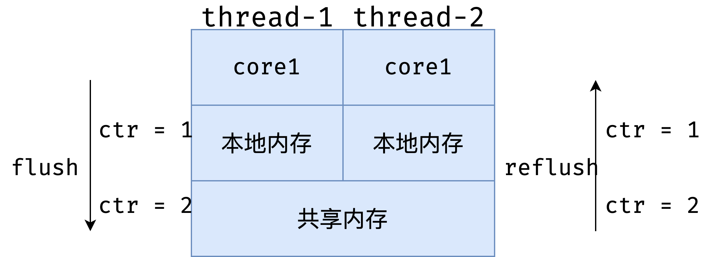

# 原子类

## 原子类是如何利用 CAS 保证线程安全的？

### 什么是原子类？原子类有什么作用？

要想回答这个问题，首先我们需要知道什么是原子类，以及它有什么作用。

在编程领域里，原子性意味着“一组操作要么全都操作成功，要么全都失败，不能只操作成功其中的一部分”。而 java.util.concurrent.atomic 下的类，就是具有原子性的类，可以原子性地执行添加、递增、递减等操作。比如之前多线程下的线程不安全的 i++ 问题，到了原子类这里，就可以用功能相同且线程安全的 getAndIncrement 方法来优雅地解决。

原子类的作用和锁有类似之处，是为了保证并发情况下线程安全。不过原子类相比于锁，有一定的优势：

- 粒度更细：原子变量可以把竞争范围缩小到变量级别，通常情况下，锁的粒度都要大于原子变量的粒度。
- 效率更高：除了高度竞争的情况之外，使用原子类的效率通常会比使用同步互斥锁的效率更高，因为原子类底层利用了 CAS 操作，不会阻塞线程。

### 6 类原子类纵览

下面我们来看下一共有哪些原子类，原子类一共可以分为以下这 6 类，我们来逐一介绍：

|                类型                |                            具体类                            |
| :--------------------------------: | :----------------------------------------------------------: |
|       Atomic* 基本类型原子类       |           AtomicInteger、AtomicLong、AtomicBoolean           |
|    Atomic*Array 数组类型原子类     |  AtomicIntegerArray、AtomicLongArray、AtomicReferenceArray   |
|  Atomic*Reference 引用类型原子类   | AtomicReference、AtomicStampedReference、AtomicMarkableReference |
| Atomic*FieldUpdater 升级类型原子类 | AtomicIntegerfieldupdater、AtomicLongFieldUpdater、AtomicReferenceFieldUpdater |
|            Adder 累加器            |                    LongAdder、DoubleAdder                    |
|         Accumulator 积累器         |              LongAccumulator、DoubleAccumulator              |

### Atomic\ 基本类型原子类

首先看到第一类 Atomic*，我们把它称为基本类型原子类，它包括三种，分别是 AtomicInteger、AtomicLong 和 AtomicBoolean。

我们来介绍一下最为典型的 AtomicInteger。对于这个类型而言，它是对于 int 类型的封装，并且提供了原子性的访问和更新。也就是说，我们如果需要一个整型的变量，并且这个变量会被运用在并发场景之下，我们可以不用基本类型 int，也不使用包装类型 Integer，而是直接使用 AtomicInteger，这样一来就自动具备了原子能力，使用起来非常方便。

#### AtomicInteger 类常用方法

AtomicInteger 类有以下几个常用的方法：

- public final int get() //获取当前的值
  因为它本身是一个 Java 类，而不再是一个基本类型，所以要想获取值还是需要一些方法，比如通过 get 方法就可以获取到当前的值。

- public final int getAndSet(int newValue) //获取当前的值，并设置新的值

接下来的几个方法和它平时的操作相关：

- public final int getAndIncrement() //获取当前的值，并自增
- public final int getAndDecrement() //获取当前的值，并自减
- public final int getAndAdd(int delta) //获取当前的值，并加上预期的值

这个参数就是我想让当前这个原子类改变多少值，可以是正数也可以是负数，如果是正数就是增加，如果是负数就是减少。而刚才的 getAndIncrement 和 getAndDecrement 修改的数值默认为 +1 或 -1，如果不能满足需求，我们就可以使用  getAndAdd 方法来直接一次性地加减我们想要的数值。

- boolean compareAndSet(int expect, int update) //如果输入的数值等于预期值，则以原子方式将该值更新为输入值（update）

这个方法也是 CAS 的一个重要体现。

### Array 数组类型原子类

下面我们来看第二大类 Atomic*Array 数组类型原子类，数组里的元素，都可以保证其原子性，比如 AtomicIntegerArray 相当于把 AtomicInteger 聚合起来，组合成一个数组。这样一来，我们如果想用一个每一个元素都具备原子性的数组的话， 就可以使用 Atomic*Array。

它一共分为 3 种，分别是：

- AtomicIntegerArray：整形数组原子类；
- AtomicLongArray：长整形数组原子类；
- AtomicReferenceArray ：引用类型数组原子类。

### Atomic\Reference 引用类型原子类

下面我们介绍第三种 AtomicReference 引用类型原子类。AtomicReference 类的作用和AtomicInteger 并没有本质区别， AtomicInteger 可以让一个整数保证原子性，而AtomicReference 可以让一个对象保证原子性。这样一来，AtomicReference 的能力明显比 AtomicInteger 强，因为一个对象里可以包含很多属性。

在这个类别之下，除了 AtomicReference 之外，还有：

- AtomicStampedReference：它是对 AtomicReference 的升级，在此基础上还加了时间戳，用于解决 CAS 的 ABA 问题。
- AtomicMarkableReference：和 AtomicReference 类似，多了一个绑定的布尔值，可以用于表示该对象已删除等场景。

### Atomic\FieldUpdater 原子更新器

第四类我们将要介绍的是 Atomic\FieldUpdater，我们把它称为原子更新器，一共有三种，分别是。

- AtomicIntegerFieldUpdater：原子更新整形的更新器；
- AtomicLongFieldUpdater：原子更新长整形的更新器；
- AtomicReferenceFieldUpdater：原子更新引用的更新器。

如果我们之前已经有了一个变量，比如是整型的 int，实际它并不具备原子性。可是木已成舟，这个变量已经被定义好了，此时我们有没有办法可以让它拥有原子性呢？办法是有的，就是利用 Atomic*FieldUpdater，如果它是整型的，就使用 AtomicIntegerFieldUpdater 把已经声明的变量进行升级，这样一来这个变量就拥有了 CAS 操作的能力。

这里的非互斥同步手段，是把我们已经声明好的变量进行 CAS 操作以达到同步的目的。那么你可能会想，既然想让这个变量具备原子性，为什么不在一开始就声明为 AtomicInteger？这样也免去了升级的过程，难道是一开始设计的时候不合理吗？这里有以下几种情况：

第一种情况是出于历史原因考虑，那么如果出于历史原因的话，之前这个变量已经被声明过了而且被广泛运用，那么修改它成本很高，所以我们可以利用升级的原子类。

另外还有一个使用场景，如果我们在大部分情况下并不需要使用到它的原子性，只在少数情况，比如每天只有定时一两次需要原子操作的话，我们其实没有必要把原来的变量声明为原子类型的变量，因为 AtomicInteger 比普通的变量更加耗费资源。所以如果我们有成千上万个原子类的实例的话，它占用的内存也会远比我们成千上万个普通类型占用的内存高。所以在这种情况下，我们可以利用 AtomicIntegerFieldUpdater 进行合理升级，节约内存。

下面我们看一段代码：

```java
public class AtomicIntegerFieldUpdaterDemo implements Runnable{
 
   static Score math;
   static Score computer;
 
   public static AtomicIntegerFieldUpdater<Score> scoreUpdater = AtomicIntegerFieldUpdater
           .newUpdater(Score.class, "score");
 
   @Override
   public void run() {
       for (int i = 0; i < 1000; i++) {
           computer.score++;
           scoreUpdater.getAndIncrement(math);
       }
   }
 
   public static class Score {
       volatile int score;
   }
 
   public static void main(String[] args) throws InterruptedException {
       math =new Score();
       computer =new Score();
       AtomicIntegerFieldUpdaterDemo2 r = new AtomicIntegerFieldUpdaterDemo2();
       Thread t1 = new Thread(r);
       Thread t2 = new Thread(r);
       t1.start();
       t2.start();
       t1.join();
       t2.join();
       System.out.println("普通变量的结果："+ computer.score);
       System.out.println("升级后的结果："+ math.score);
   }
}
```

这段代码就演示了这个类的用法，比如说我们有两个类，它们都是 Score 类型的，Score 类型内部会有一个分数，也叫作 core，那么这两个分数的实例分别叫作数学 math 和计算机  computer，然后我们还声明了一个 AtomicIntegerFieldUpdater，在它构造的时候传入了两个参数，第一个是 Score.class，这是我们的类名，第二个是属性名，叫作 score。

接下来我们看一下 run 方法，run 方法里面会对这两个实例分别进行自加操作。

第一个是 computer，这里的 computer 我们调用的是它内部的 score，也就是说我们直接调用了 int 变量的自加操作，这在多线程下是线程非安全的。

第二个自加是利用了刚才声明的 scoreUpdater 并且使用了它的 getAndIncrement 方法并且传入了 math，这是一种正确使用AtomicIntegerFieldUpdater 的用法，这样可以线程安全地进行自加操作。

接下来我们看下 main 函数。在 main 函数中，我们首先把 math 和 computer 定义了出来，然后分别启动了两个线程，每个线程都去执行我们刚才所介绍过的 run 方法。这样一来，两个 score，也就是 math 和 computer 都会分别被加 2000 次，最后我们在 join 等待之后把结果打印了出来，这个程序的运行结果如下：

普通变量的结果：1942
升级后的结果：2000

可以看出，正如我们所预料的那样，普通变量由于不具备线程安全性，所以在多线程操作的情况下，它虽然看似进行了 2000 次操作，但有一些操作被冲突抵消了，所以最终结果小于 2000。可是使用 AtomicIntegerFieldUpdater  这个工具之后，就可以做到把一个普通类型的 score 变量进行原子的自加操作，最后的结果也和加的次数是一样的，也就是 2000。可以看出，这个类的功能还是非常强大的。

下面我们继续看最后两种原子类。

### Adder 加法器

它里面有两种加法器，分别叫作 LongAdder 和 DoubleAdder。

### Accumulator 积累器

最后一种叫 Accumulator 积累器，分别是 LongAccumulator 和 DoubleAccumulator。

这两种原子类我们会在后面的课时中展开介绍。

### 以 AtomicInteger 为例，分析在 Java 中如何利用 CAS 实现原子操作？

让我们回到标题中的问题，在充分了解了原子类的作用和种类之后，我们来看下  AtomicInteger 是如何通过 CAS 操作实现并发下的累加操作的，以其中一个重要方法 getAndAdd 方法为突破口。

#### getAndAdd方法

这个方法的代码在 Java 1.8 中的实现如下：

```java
//JDK 1.8实现
public final int getAndAdd(int delta) {
   return unsafe.getAndAddInt(this, valueOffset, delta);
}
```

可以看出，里面使用了 Unsafe 这个类，并且调用了 unsafe.getAndAddInt 方法。所以这里需要简要介绍一下 Unsafe 类。

#### Unsafe 类

Unsafe 其实是 CAS 的核心类。由于 Java 无法直接访问底层操作系统，而是需要通过 native 方法来实现。不过尽管如此，JVM 还是留了一个后门，在 JDK 中有一个 Unsafe 类，它提供了硬件级别的原子操作，我们可以利用它直接操作内存数据。

那么我们就来看一下 AtomicInteger 的一些重要代码，如下所示：

```java
public class AtomicInteger extends Number implements java.io.Serializable {
   // setup to use Unsafe.compareAndSwapInt for updates
   private static final Unsafe unsafe = Unsafe.getUnsafe();
   private static final long valueOffset;
 
   static {
       try {
           valueOffset = unsafe.objectFieldOffset
               (AtomicInteger.class.getDeclaredField("value"));
       } catch (Exception ex) { throw new Error(ex); }
   }
 
   private volatile int value;
   public final int get() {return value;}
   ...
}
```

可以看出，在数据定义的部分，首先还获取了 Unsafe 实例，并且定义了 valueOffset。我们往下看到 static 代码块，这个代码块会在类加载的时候执行，执行时我们会调用 Unsafe 的 objectFieldOffset 方法，从而得到当前这个原子类的 value 的偏移量，并且赋给 valueOffset 变量，这样一来我们就获取到了 value 的偏移量，它的含义是在内存中的偏移地址，因为 Unsafe 就是根据内存偏移地址获取数据的原值的，这样我们就能通过 Unsafe 来实现 CAS 了。

value 是用 volatile 修饰的，它就是我们原子类存储的值的变量，由于它被 volatile 修饰，我们就可以保证在多线程之间看到的 value 是同一份，保证了可见性。

接下来继续看 Unsafe 的 getAndAddInt 方法的实现，代码如下：

```java
public final int getAndAddInt(Object var1, long var2, int var4) {
   int var5;
   do {
       var5 = this.getIntVolatile(var1, var2);
   } while(!this.compareAndSwapInt(var1, var2, var5, var5 + var4));
   return var5;
}
```

首先我们看一下结构，它是一个 do-while 循环，所以这是一个死循环，直到满足循环的退出条件时才可以退出。

那么我们来看一下 do 后面的这一行代码 var5 = this.getIntVolatile(var1, var2) 是什么意思。这是个 native 方法，作用就是获取在 var1 中的 var2 偏移处的值。

那传入的是什么呢？传入的两个参数，第一个就是当前原子类，第二个是我们最开始获取到的 offset，这样一来我们就可以获取到当前内存中偏移量的值，并且保存到 var5 里面。此时 var5 实际上代表当前时刻下的原子类的数值。

现在再来看 while 的退出条件，也就是 compareAndSwapInt 这个方法，它一共传入了 4 个参数，这 4 个参数是 var1、var2、var5、var5 + var4，为了方便理解，我们给它们取了新了变量名，分别 object、offset、expectedValue、newValue，具体含义如下：

- 第一个参数 object 就是将要操作的对象，传入的是 this，也就是 atomicInteger 这个对象本身；
- 第二个参数是 offset，也就是偏移量，借助它就可以获取到 value 的数值；
- 第三个参数 expectedValue，代表“期望值”，传入的是刚才获取到的 var5；
- 而最后一个参数 newValue 是希望修改的数值 ，等于之前取到的数值 var5 再加上 var4，而 var4 就是我们之前所传入的 delta，delta 就是我们希望原子类所改变的数值，比如可以传入 +1，也可以传入 -1。
  所以 compareAndSwapInt 方法的作用就是，判断如果现在原子类里 value 的值和之前获取到的 var5 相等的话，那么就把计算出来的 var5 + var4 给更新上去，所以说这行代码就实现了 CAS 的过程。

一旦 CAS 操作成功，就会退出这个 while 循环，但是也有可能操作失败。如果操作失败就意味着在获取到 var5 之后，并且在 CAS 操作之前，value 的数值已经发生变化了，证明有其他线程修改过这个变量。

这样一来，就会再次执行循环体里面的代码，重新获取 var5 的值，也就是获取最新的原子变量的数值，并且再次利用 CAS 去尝试更新，直到更新成功为止，所以这是一个死循环。

我们总结一下，Unsafe 的 getAndAddInt 方法是通过循环 + CAS 的方式来实现的，在此过程中，它会通过 compareAndSwapInt 方法来尝试更新 value 的值，如果更新失败就重新获取，然后再次尝试更新，直到更新成功。

## AtomicInteger 在高并发下性能不好，如何解决？为什么？

在并发的场景下，如果我们需要实现计数器，可以利用 AtomicInteger 和 AtomicLong，这样一来，就可以避免加锁和复杂的代码逻辑，有了它们之后，我们只需要执行对应的封装好的方法，例如对这两个变量进行原子的增操作或原子的减操作，就可以满足大部分业务场景的需求。

不过，虽然它们很好用，但是如果你的业务场景是并发量很大的，那么你也会发现，这两个原子类实际上会有较大的性能问题，这是为什么呢？就让我们从一个例子看起。

### AtomicLong 存在的问题

首先我们来看一段代码：

```java
/**
* 描述：     在16个线程下使用AtomicLong
*/
public class AtomicLongDemo {
 
   public static void main(String[] args) throws InterruptedException {
       AtomicLong counter = new AtomicLong(0);
       ExecutorService service = Executors.newFixedThreadPool(16);
       for (int i = 0; i < 100; i++) {
           service.submit(new Task(counter));
       }
 
       Thread.sleep(2000);
       System.out.println(counter.get());
   }
 
   static class Task implements Runnable {
 
       private final AtomicLong counter;
 
       public Task(AtomicLong counter) {
           this.counter = counter;
       }
 
       @Override
       public void run() {
           counter.incrementAndGet();
       }
   }
}
```

在这段代码中可以看出，我们新建了一个原始值为 0 的 AtomicLong。然后，有一个线程数为 16 的线程池，并且往这个线程池中添加了 100 次相同的一个任务。

那我们往下看这个任务是什么。在下面的 Task 类中可以看到，这个任务实际上就是每一次去调用 AtomicLong 的 incrementAndGet 方法，相当于一次自加操作。这样一来，整个类的作用就是把这个原子类从 0 开始，添加 100 个任务，每个任务自加一次。

这段代码的运行结果毫无疑问是 100，虽然是多线程并发访问，但是 AtomicLong 依然可以保证 incrementAndGet 操作的原子性，所以不会发生线程安全问题。

不过如果我们深入一步去看内部情景的话，你可能会感到意外。我们把模型简化成只有两个线程在同时工作的并发场景，因为两个线程和更多个线程本质上是一样的。如图所示：



我们可以看到在这个图中，每一个线程是运行在自己的 core 中的，并且它们都有一个本地内存是自己独用的。在本地内存下方，有两个 CPU 核心共用的共享内存。

对于 AtomicLong 内部的 value 属性而言，也就是保存当前 AtomicLong 数值的属性，它是被 volatile 修饰的，所以它需要保证自身可见性。

这样一来，每一次它的数值有变化的时候，它都需要进行 flush 和 refresh。比如说，如果开始时，ctr 的数值为 0 的话，那么如图所示，一旦  core 1 把它改成 1 的话，它首先会在左侧把这个 1 的最新结果给 flush 到下方的共享内存。然后，再到右侧去往上 refresh 到核心 2 的本地内存。这样一来，对于核心 2 而言，它才能感知到这次变化。

由于竞争很激烈，这样的 flush 和 refresh 操作耗费了很多资源，而且 CAS 也会经常失败。

### LongAdder 带来的改进和原理

在 JDK 8 中又新增了 LongAdder 这个类，这是一个针对 Long 类型的操作工具类。那么既然已经有了 AtomicLong，为何又要新增 LongAdder 这么一个类呢？

我们同样是用一个例子来说明。下面这个例子和刚才的例子很相似，只不过我们把工具类从  AtomicLong 变成了 LongAdder。其他的不同之处还在于最终打印结果的时候，调用的方法从原来的 get 变成了现在的 sum 方法。而其他的逻辑都一样。

我们来看一下使用 LongAdder 的代码示例：

```java
/**
* 描述：     在16个线程下使用LongAdder
*/
public class LongAdderDemo {
 
   public static void main(String[] args) throws InterruptedException {
       LongAdder counter = new LongAdder();
       ExecutorService service = Executors.newFixedThreadPool(16);
       for (int i = 0; i < 100; i++) {
           service.submit(new Task(counter));
       }
 
       Thread.sleep(2000);
       System.out.println(counter.sum());
   }
   static class Task implements Runnable {
 
       private final LongAdder counter;
 
       public Task(LongAdder counter) {
           this.counter = counter;
       }
 
       @Override
       public void run() {
           counter.increment();
       }
   }
}
```

代码的运行结果同样是 100，但是运行速度比刚才 AtomicLong 的实现要快。下面我们解释一下，为什么高并发下 LongAdder 比 AtomicLong 效率更高。

因为 LongAdder 引入了分段累加的概念，内部一共有两个参数参与计数：第一个叫作 base，它是一个变量，第二个是 Cell[] ，是一个数组。

其中的 base 是用在竞争不激烈的情况下的，可以直接把累加结果改到 base 变量上。

那么，当竞争激烈的时候，就要用到我们的 Cell[] 数组了。一旦竞争激烈，各个线程会分散累加到自己所对应的那个 Cell[] 数组的某一个对象中，而不会大家共用同一个。

这样一来，LongAdder 会把不同线程对应到不同的 Cell 上进行修改，降低了冲突的概率，这是一种分段的理念，提高了并发性，这就和 Java 7 的 ConcurrentHashMap 的 16 个 Segment 的思想类似。

竞争激烈的时候，LongAdder 会通过计算出每个线程的 hash 值来给线程分配到不同的 Cell 上去，每个 Cell 相当于是一个独立的计数器，这样一来就不会和其他的计数器干扰，Cell 之间并不存在竞争关系，所以在自加的过程中，就大大减少了刚才的 flush 和 refresh，以及降低了冲突的概率，这就是为什么 LongAdder 的吞吐量比 AtomicLong 大的原因，本质是空间换时间，因为它有多个计数器同时在工作，所以占用的内存也要相对更大一些。

那么 LongAdder 最终是如何实现多线程计数的呢？答案就在最后一步的求和 sum 方法，执行 LongAdder.sum() 的时候，会把各个线程里的 Cell 累计求和，并加上 base，形成最终的总和。代码如下：

```java
public long sum() {
   Cell[] as = cells; Cell a;
   long sum = base;
   if (as != null) {
       for (int i = 0; i < as.length; ++i) {
           if ((a = as[i]) != null)
               sum += a.value;
       }
   }
   return sum;
}
```

在这个 sum 方法中可以看到，思路非常清晰。先取 base 的值，然后遍历所有 Cell，把每个 Cell 的值都加上去，形成最终的总和。由于在统计的时候并没有进行加锁操作，所以这里得出的 sum 不一定是完全准确的，因为有可能在计算 sum 的过程中 Cell 的值被修改了。

那么我们已经了解了，为什么 AtomicLong 或者说 AtomicInteger 它在高并发下性能不好，也同时看到了性能更好的 LongAdder。下面我们就分析一下，对它们应该如何选择。

### 如何选择

在低竞争的情况下，AtomicLong 和 LongAdder 这两个类具有相似的特征，吞吐量也是相似的，因为竞争不高。但是在竞争激烈的情况下，LongAdder 的预期吞吐量要高得多，经过试验，LongAdder 的吞吐量大约是 AtomicLong 的十倍，不过凡事总要付出代价，LongAdder 在保证高效的同时，也需要消耗更多的空间。

### AtomicLong 可否被 LongAdder 替代？

那么我们就要考虑了，有了更高效的 LongAdder，那 AtomicLong 可否不使用了呢？是否凡是用到 AtomicLong 的地方，都可以用 LongAdder 替换掉呢？答案是不是的，这需要区分场景。

LongAdder 只提供了 add、increment 等简单的方法，适合的是统计求和计数的场景，场景比较单一，而 AtomicLong 还具有 compareAndSet 等高级方法，可以应对除了加减之外的更复杂的需要 CAS 的场景。

结论：如果我们的场景仅仅是需要用到加和减操作的话，那么可以直接使用更高效的 LongAdder，但如果我们需要利用 CAS 比如 compareAndSet 等操作的话，就需要使用 AtomicLong 来完成。

## 原子类和 volatile 有什么异同？

我们可以看出，volatile 和原子类的使用场景是不一样的，如果我们有一个可见性问题，那么可以使用 volatile 关键字，但如果我们的问题是一个组合操作，需要用同步来解决原子性问题的话，那么可以使用原子变量，而不能使用 volatile 关键字。

通常情况下，volatile 可以用来修饰 boolean 类型的标记位，因为对于标记位来讲，直接的赋值操作本身就是具备原子性的，再加上 volatile 保证了可见性，那么就是线程安全的了。

而对于会被多个线程同时操作的计数器 Counter 的场景，这种场景的一个典型特点就是，它不仅仅是一个简单的赋值操作，而是需要先读取当前的值，然后在此基础上进行一定的修改，再把它给赋值回去。这样一来，我们的 volatile 就不足以保证这种情况的线程安全了。我们需要使用原子类来保证线程安全。

## AtomicInteger 和 synchronized 的异同点？

下面我们就对这两种不同的方案进行分析。

第一点，我们来看一下它们背后原理的不同。

在第 21 课时中我们详细分析了 synchronized 背后的 monitor 锁，也就是 synchronized 原理，同步方法和同步代码块的背后原理会有少许差异，但总体思想是一致的：在执行同步代码之前，需要首先获取到 monitor 锁，执行完毕后，再释放锁。

而我们在第 39 课时中介绍了原子类，它保证线程安全的原理是利用了 CAS 操作。从这一点上看，虽然原子类和 synchronized 都能保证线程安全，但是其实现原理是大有不同的。

第二点不同是使用范围的不同。

对于原子类而言，它的使用范围是比较局限的。因为一个原子类仅仅是一个对象，不够灵活。而 synchronized 的使用范围要广泛得多。比如说 synchronized 既可以修饰一个方法，又可以修饰一段代码，相当于可以根据我们的需要，非常灵活地去控制它的应用范围。

所以仅有少量的场景，例如计数器等场景，我们可以使用原子类。而在其他更多的场景下，如果原子类不适用，那么我们就可以考虑用 synchronized 来解决这个问题。

第三个区别是粒度的区别。

原子变量的粒度是比较小的，它可以把竞争范围缩小到变量级别。通常情况下，synchronized 锁的粒度都要大于原子变量的粒度。如果我们只把一行代码用 synchronized 给保护起来的话，有一点杀鸡焉用牛刀的感觉。

第四点是它们性能的区别，同时也是悲观锁和乐观锁的区别。

因为 synchronized 是一种典型的悲观锁，而原子类恰恰相反，它利用的是乐观锁。所以，我们在比较 synchronized 和 AtomicInteger 的时候，其实也就相当于比较了悲观锁和乐观锁的区别。

从性能上来考虑的话，悲观锁的操作相对来讲是比较重量级的。因为 synchronized 在竞争激烈的情况下，会让拿不到锁的线程阻塞，而原子类是永远不会让线程阻塞的。不过，虽然 synchronized 会让线程阻塞，但是这并不代表它的性能就比原子类差。

因为悲观锁的开销是固定的，也是一劳永逸的。随着时间的增加，这种开销并不会线性增长。

而乐观锁虽然在短期内的开销不大，但是随着时间的增加，它的开销也是逐步上涨的。

所以从性能的角度考虑，它们没有一个孰优孰劣的关系，而是要区分具体的使用场景。在竞争非常激烈的情况下，推荐使用 synchronized；而在竞争不激烈的情况下，使用原子类会得到更好的效果。

值得注意的是，synchronized 的性能随着 JDK 的升级，也得到了不断的优化。synchronized 会从无锁升级到偏向锁，再升级到轻量级锁，最后才会升级到让线程阻塞的重量级锁。因此synchronized 在竞争不激烈的情况下，性能也是不错的，不需要“谈虎色变”。

## Java 8 中 Adder 和 Accumulator 有什么区别？

### Adder 的介绍

我们要知道 Adder 和 Accumulator 都是 Java 8 引入的，是相对比较新的类。对于 Adder 而言，比如最典型的 LongAdder，我们已经讲解过了，在高并发下 LongAdder 比 AtomicLong 效率更高，因为对于 AtomicLong 而言，它只适合用于低并发场景，否则在高并发的场景下，由于 CAS 的冲突概率大，会导致经常自旋，影响整体效率。

而 LongAdder 引入了分段锁的概念，当竞争不激烈的时候，所有线程都是通过 CAS 对同一个 Base 变量进行修改，但是当竞争激烈的时候，LongAdder 会把不同线程对应到不同的 Cell 上进行修改，降低了冲突的概率，从而提高了并发性。

### Accumulator 的介绍

那么 Accumulator 又是做什么的呢？Accumulator 和 Adder 非常相似，实际上 Accumulator 就是一个更通用版本的 Adder，比如 LongAccumulator 是 LongAdder 的功能增强版，因为 LongAdder 的 API 只有对数值的加减，而 LongAccumulator 提供了自定义的函数操作。

我这样讲解可能有些同学还是不太理解，那就让我们用一个非常直观的代码来举例说明一下，代码如下：

```java
public class LongAccumulatorDemo {

    public static void main(String[] args) throws InterruptedException {
        LongAccumulator accumulator = new LongAccumulator((x, y) -> x + y, 0);
        ExecutorService executor = Executors.newFixedThreadPool(8);
        IntStream.range(1, 10).forEach(i -> executor.submit(() -> accumulator.accumulate(i)));

        Thread.sleep(2000);
        System.out.println(accumulator.getThenReset());
    }
}
```

在这段代码中：

- 首先新建了一个 LongAccumulator，同时给它传入了两个参数；
- 然后又新建了一个 8 线程的线程池，并且利用整形流也就是 IntStream 往线程池中提交了从 1 ~ 9 这 9 个任务；
- 之后等待了两秒钟，这两秒钟的作用是等待线程池的任务执行完毕；
- 最后把 accumulator 的值打印出来。

这段代码的运行结果是 45，代表 0+1+2+3+...+8+9=45 的结果，这个结果怎么理解呢？我们先重点看看新建的 LongAccumulator 的这一行语句：

```java
LongAccumulator accumulator = new LongAccumulator((x, y) -> x + y, 0);
```

在这个语句中，我们传入了两个参数：LongAccumulator 的构造函数的第一个参数是二元表达式；第二个参数是 x 的初始值，传入的是 0。在二元表达式中，x 是上一次计算的结果（除了第一次的时候需要传入），y 是本次新传入的值。

### 适用场景

接下来我们说一下 LongAccumulator 的适用场景。

第一点需要满足的条件，就是需要大量的计算，并且当需要并行计算的时候，我们可以考虑使用 LongAccumulator。

当计算量不大，或者串行计算就可以满足需求的时候，可以使用 for 循环；如果计算量大，需要提高计算的效率时，我们则可以利用线程池，再加上 LongAccumulator 来配合的话，就可以达到并行计算的效果，效率非常高。

第二点需要满足的要求，就是计算的执行顺序并不关键，也就是说它不要求各个计算之间的执行顺序，也就是说线程 1 可能在线程 5 之后执行，也可能在线程 5 之前执行，但是执行的先后并不影响最终的结果。

一些非常典型的满足这个条件的计算，就是类似于加法或者乘法，因为它们是有交换律的。同样，求最大值和最小值对于顺序也是没有要求的，因为最终只会得出所有数字中的最大值或者最小值，无论先提交哪个或后提交哪个，都不会影响到最终的结果。