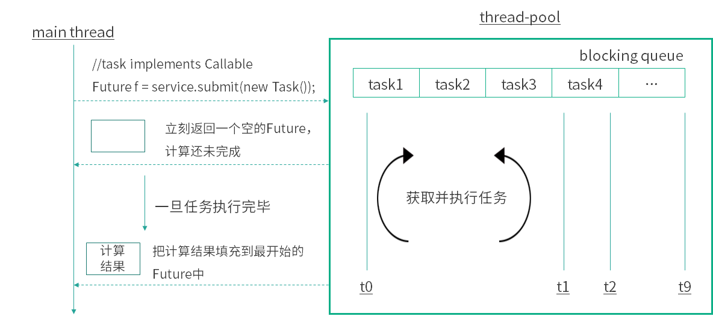
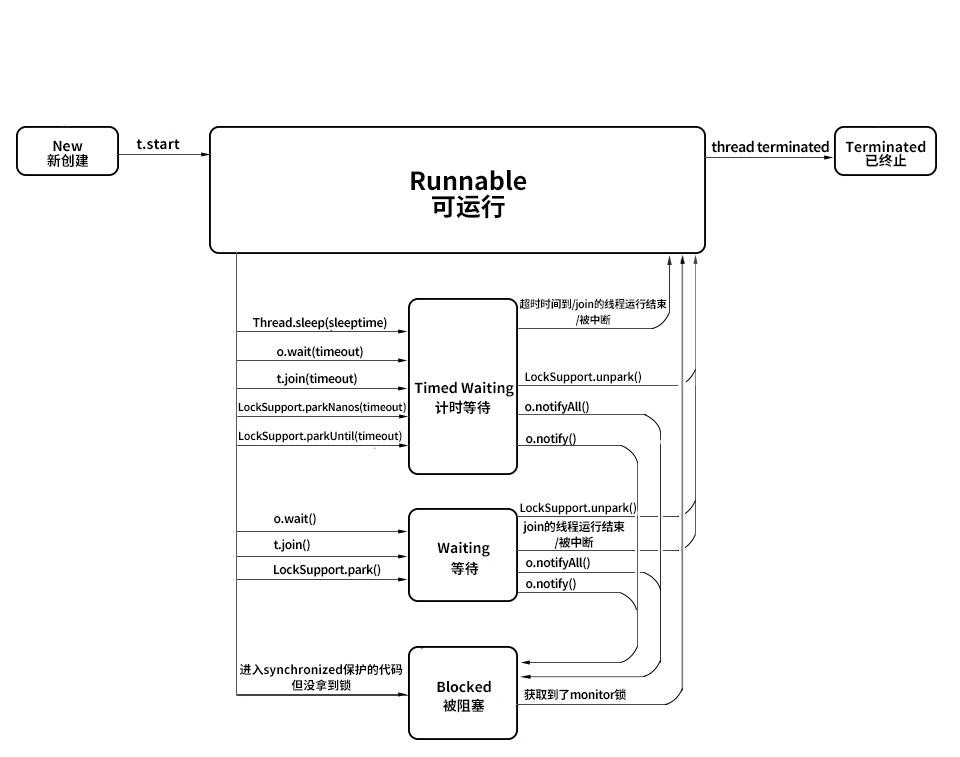

# Future掌握未来

## Callable 和 Runnable 的不同？

先来看一下，为什么需要 Callable？要想回答这个问题，我们先来看看现有的 Runnable 有哪些缺陷？

### 不能返回一个返回值

第一个缺陷，对于 Runnable 而言，它不能返回一个返回值，虽然可以利用其他的一些办法，比如在 Runnable 方法中写入日志文件或者修改某个共享的对象的办法，来达到保存线程执行结果的目的，但这种解决问题的行为千曲百折，属于曲线救国，效率着实不高。

实际上，在很多情况下执行一个子线程时，我们都希望能得到执行的任务的结果，也就是说，我们是需要得到返回值的，比如请求网络、查询数据库等。可是 Runnable 不能返回一个返回值，这是它第一个非常严重的缺陷。

### 不能抛出 checked Exception

第二个缺陷就是不能抛出 checked Exception，如下面这段代码所示：

```java
public class RunThrowException {
 
   /**
    * 普通方法内可以 throw 异常，并在方法签名上声明 throws
    */
   public void normalMethod() throws Exception {
       throw new IOException();
   }
 
   Runnable runnable = new Runnable() {
       /**
        *  run方法上无法声明 throws 异常，且run方法内无法 throw 出 checked Exception，除非使用try catch进行处理
        */
       @Override
       public void run() {
           try {
               throw new IOException();
           } catch (IOException e) {
               e.printStackTrace();
           }
       }
   }
}
```

在这段代码中，有两个方法，第一个方法是一个普通的方法，叫作 normalMethod，可以看到，在它的方法签名中有 throws Exception，并且在它的方法内也 throw 了一个 new IOException()。

然后在下面的的代码中，我们新建了一个 Runnable 对象，同时重写了它的 run 方法，我们没有办法在这个 run 方法的方法签名上声明 throws 一个异常出来。同时，在这个 run 方法里面也没办法 throw 一个 checked Exception，除非如代码所示，用 try catch 包裹起来，但是如果不用 try catch 是做不到的。

这就是对于 Runnable 而言的两个重大缺陷。

### 为什么有这样的缺陷

为什么有这样的缺陷呢？我们来看一下 Runnable 接口的定义：

```java
public interface Runnable {
   public abstract void run();
}
```

代码比较短小，Runnable 是一个 interface，并且里面只有一个方法，叫作 public abstract void run()。这个方法已经规定了 run() 方法的返回类型是 void，而且这个方法没有声明抛出任何异常。所以，当实现并重写这个方法时，我们既不能改返回值类型，也不能更改对于异常抛出的描述，因为在实现方法的时候，语法规定是不允许对这些内容进行修改的。

回顾课程之前小节的众多代码，从来没有出现过可以在 run 方法中返回一个返回值这样的情况。

### Runnable 为什么设计成这样

我们再深入思考一层，为什么 Java 要把它设计成这个样子呢？

假设 run() 方法可以返回返回值，或者可以抛出异常，也无济于事，因为我们并没有办法在外层捕获并处理，这是因为调用 run() 方法的类（比如 Thread 类和线程池）是 Java 直接提供的，而不是我们编写的。

所以就算它能有一个返回值，我们也很难把这个返回值利用到，如果真的想弥补 Runnable 的这两个缺陷，可以用下面的补救措施——使用 Callable。

### Callable 接口

Callable 是一个类似于 Runnable 的接口，实现 Callable 接口的类和实现 Runnable 接口的类都是可以被其他线程执行的任务。 我们看一下 Callable 的源码：

```java
public interface Callable<V> {
     V call() throws Exception;
}
```

可以看出它也是一个 interface，并且它的 call 方法中已经声明了 throws Exception，前面还有一个 V 泛型的返回值，这就和之前的 Runnable 有很大的区别。实现 Callable 接口，就要实现 call 方法，这个方法的返回值是泛型 V，如果把 call 中计算得到的结果放到这个对象中，就可以利用 call 方法的返回值来获得子线程的执行结果了。

### Callable 和 Runnable 的不同之处

最后总结一下 Callable 和 Runnable 的不同之处：

- 方法名，Callable 规定的执行方法是 call()，而 Runnable 规定的执行方法是 run()；
- 返回值，Callable 的任务执行后有返回值，而 Runnable 的任务执行后是没有返回值的；
- 抛出异常，call() 方法可抛出异常，而 run() 方法是不能抛出受检查异常的；
- 和 Callable 配合的有一个 Future 类，通过 Future 可以了解任务执行情况，或者取消任务的执行，还可获取任务执行的结果，这些功能都是 Runnable 做不到的，Callable 的功能要比 Runnable 强大。

## Future 的主要功能是什么？

### Future 类

#### Future 的作用

Future 最主要的作用是，比如当做一定运算的时候，运算过程可能比较耗时，有时会去查数据库，或是繁重的计算，比如压缩、加密等，在这种情况下，如果我们一直在原地等待方法返回，显然是不明智的，整体程序的运行效率会大大降低。我们可以把运算的过程放到子线程去执行，再通过 Future 去控制子线程执行的计算过程，最后获取到计算结果。这样一来就可以把整个程序的运行效率提高，是一种异步的思想。

#### Callable 和 Future 的关系

接下来我们介绍下 Callable 和 Future 的关系，前面讲过，Callable 接口相比于 Runnable 的一大优势是可以有返回结果，那这个返回结果怎么获取呢？就可以用 Future 类的 get 方法来获取 。因此，Future 相当于一个存储器，它存储了 Callable 的 call 方法的任务结果。除此之外，我们还可以通过 Future 的 isDone 方法来判断任务是否已经执行完毕了，还可以通过 cancel 方法取消这个任务，或限时获取任务的结果等，总之 Future 的功能比较丰富。有了这样一个从宏观上的概念之后，我们就来具体看一下 Future 类的主要方法。

#### Future 的方法和用法

首先看一下 Future 接口的代码，一共有 5 个方法，代码如下所示：

```java
public interface Future<V> {

    boolean cancel(boolean mayInterruptIfRunning);

    boolean isCancelled();

    boolean isDone();

    V get() throws InterruptedException, ExecutionException;

    V get(long timeout, TimeUnit unit)
        throws InterruptedException, ExecutionException, TimeoutExceptio
}
```

其中，第 5 个方法是对第 4 个方法的重载，方法名一样，但是参数不一样。

#### get() 方法：获取结果

get 方法最主要的作用就是获取任务执行的结果，该方法在执行时的行为取决于 Callable 任务的状态，可能会发生以下 5 种情况。

（1）最常见的就是**当执行 get 的时候，任务已经执行完毕了**，可以立刻返回，获取到任务执行的结果。

（2）**任务还没有结果**，这是有可能的，比如我们往线程池中放一个任务，线程池中可能积压了很多任务，还没轮到我去执行的时候，就去 get 了，在这种情况下，相当于任务还没开始；还有一种情况是任务正在执行中，但是执行过程比较长，所以我去 get 的时候，**它依然在执行的过程中**。无论是任务还没开始或在进行中，我们去调用 get 的时候，都会把当前的线程阻塞，直到任务完成再把结果返回回来。

（3）**任务执行过程中抛出异常**，一旦这样，我们再去调用 get 的时候，就会抛出 ExecutionException 异常，不管我们执行 call 方法时里面抛出的异常类型是什么，在执行 get 方法时所获得的异常都是 ExecutionException。

（4）**任务被取消了**，如果任务被取消，我们用 get 方法去获取结果时则会抛出 CancellationException。

（5）**任务超时**，我们知道 get 方法有一个重载方法，那就是带延迟参数的，调用了这个带延迟参数的 get 方法之后，如果 call 方法在规定时间内正常顺利完成了任务，那么 get 会正常返回；但是如果到达了指定时间依然没有完成任务，get 方法则会抛出 TimeoutException，代表超时了。

下面用图的形式让过程更清晰：



在图中，右侧是一个线程池，线程池中有一些线程来执行任务。重点在图的左侧，可以看到有一个 submit 方法，该方法往线程池中提交了一个 Task，这个 Task 实现了 Callable 接口，当我们去给线程池提交这个任务的时候，调用 submit 方法会立刻返回一个 Future 类型的对象，这个对象目前内容是空的，其中还不包含计算结果，因为此时计算还没有完成。

当计算一旦完成时，也就是当我们可以获取结果的时候，线程池便会把这个结果填入到之前返回的 Future 中去（也就是 f 对象），而不是在此时新建一个新的 Future。这时就可以利用 Future 的 get 方法来获取到任务的执行结果了。

我们来看一个代码示例：

```java
/**
 * 描述：     演示一个 Future 的使用方法
 */
public class OneFuture {

    public static void main(String[] args) {
        ExecutorService service = Executors.newFixedThreadPool(10);
        Future<Integer> future = service.submit(new CallableTask());
        try {
            System.out.println(future.get());
        } catch (InterruptedException e) {
            e.printStackTrace();
        } catch (ExecutionException e) {
            e.printStackTrace();
        }
        service.shutdown();
    }

    static class CallableTask implements Callable<Integer> {

        @Override
        public Integer call() throws Exception {
            Thread.sleep(3000);
            return new Random().nextInt();
        }
    }
}
```

在这段代码中，main 方法新建了一个 10 个线程的线程池，并且用 submit 方法把一个任务提交进去。这个任务如代码的最下方所示，它实现了 Callable 接口，它所做的内容就是先休眠三秒钟，然后返回一个随机数。接下来我们就直接把 future.get 结果打印出来，其结果是正常打印出一个随机数，比如 100192 等。这段代码对应了我们刚才那个图示的讲解，这也是 Future 最常用的一种用法。

#### isDone() 方法：判断是否执行完毕

下面我们再接着看看 Future 的一些其他方法，比如说 isDone() 方法，该方法是用来判断当前这个任务是否执行完毕了。

需要注意的是，这个方法如果返回 true 则代表执行完成了；如果返回 false 则代表还没完成。但这里如果返回 true，并不代表这个任务是成功执行的，比如说任务执行到一半抛出了异常。那么在这种情况下，对于这个 isDone 方法而言，它其实也是会返回 true 的，因为对它来说，虽然有异常发生了，但是这个任务在未来也不会再被执行，它确实已经执行完毕了。所以 isDone 方法在返回 true 的时候，不代表这个任务是成功执行的，只代表它执行完毕了。

我们用一个代码示例来看一看，代码如下所示：

```java
public class GetException {

    public static void main(String[] args) {
        ExecutorService service = Executors.newFixedThreadPool(20);
        Future<Integer> future = service.submit(new CallableTask());


        try {
            for (int i = 0; i < 5; i++) {
                System.out.println(i);
                Thread.sleep(500);
            }
            System.out.println(future.isDone());
            future.get();
        } catch (InterruptedException e) {
            e.printStackTrace();
        } catch (ExecutionException e) {
            e.printStackTrace();
        }
    }


    static class CallableTask implements Callable<Integer> {

        @Override
        public Integer call() throws Exception {
            throw new IllegalArgumentException("Callable抛出异常");
        }
    }
}
```

在这段代码中，可以看到有一个线程池，并且往线程池中去提交任务，这个任务会直接抛出一个异常。那么接下来我们就用一个 for 循环去休眠，同时让它慢慢打印出 0 ~ 4 这 5 个数字，这样做的目的是起到了一定的延迟作用。在这个执行完毕之后，再去调用 isDone() 方法，并且把这个结果打印出来，然后再去调用 future.get()。

这段代码的执行结果是这样的：

```java
0
1
2
3
4
true
java.util.concurrent.ExecutionException: java.lang.IllegalArgumentException: Callable抛出异常
...
```

这里要注意，我们知道这个异常实际上是在任务刚被执行的时候就抛出了，因为我们的计算任务中是没有其他逻辑的，只有抛出异常。我们再来看，控制台是什么时候打印出异常的呢？它是在 true 打印完毕后才打印出异常信息的，也就是说，在调用 get 方法时打印出的异常。

这段代码证明了三件事情：第一件事情，即便任务抛出异常，isDone 方法依然会返回 true；第二件事情，虽然抛出的异常是 IllegalArgumentException，但是对于 get 而言，它抛出的异常依然是 ExecutionException；第三个事情，虽然在任务执行一开始时就抛出了异常，但是真正要等到我们执行 get 的时候，才看到了异常。

#### cancel 方法：取消任务的执行

下面我们再来看一下 cancel 方法，如果不想执行某个任务了，则可以使用 cancel 方法，会有以下三种情况：

第一种情况最简单，那就是当任务还没有开始执行时，一旦调用 cancel，这个任务就会被正常取消，未来也不会被执行，那么 cancel 方法返回 true。

第二种情况也比较简单。如果任务已经完成，或者之前已经被取消过了，那么执行 cancel 方法则代表取消失败，返回 false。因为任务无论是已完成还是已经被取消过了，都不能再被取消了。

第三种情况比较特殊，就是这个任务正在执行，这个时候执行 cancel 方法是不会直接取消这个任务的，而是会根据我们传入的参数做判断。cancel 方法是必须传入一个参数，该参数叫作  mayInterruptIfRunning，它是什么含义呢？如果传入的参数是 true，执行任务的线程就会收到一个中断的信号，正在执行的任务可能会有一些处理中断的逻辑，进而停止，这个比较好理解。如果传入的是 false 则就代表不中断正在运行的任务，也就是说，本次 cancel 不会有任何效果，同时 cancel 方法会返回 false。

那么如何选择传入 true 还是 false 呢？

传入 true 适用的情况是，明确知道这个任务能够处理中断。

传入 false 适用于什么情况呢？

- 如果我们明确知道这个线程不能处理中断，那应该传入 false。
- 我们不知道这个任务是否支持取消（是否能响应中断），因为在大多数情况下代码是多人协作的，对于这个任务是否支持中断，我们不一定有十足的把握，那么在这种情况下也应该传入 false。
- 如果这个任务一旦开始运行，我们就希望它完全的执行完毕。在这种情况下，也应该传入 false。
  这就是传入 true 和 false 的不同含义和选择方法。

#### isCancelled() 方法：判断是否被取消

最后一个方法是 isCancelled 方法，判断是否被取消，它和 cancel 方法配合使用，比较简单。

以上就是关于 Future 的主要方法的介绍了。

### 用 FutureTask 来创建 Future

除了用线程池的 submit 方法会返回一个 future 对象之外，同样还可以用 FutureTask 来获取 Future 类和任务的结果。

FutureTask 首先是一个任务（Task），然后具有 Future 接口的语义，因为它可以在将来（Future）得到执行的结果。

我们来看一下 FutureTask 的代码实现：

```java
public class FutureTask<V> implements RunnableFuture<V>{
 ...
}
```

可以看到，它实现了一个接口，这个接口叫作 RunnableFuture。我们再来看一下 RunnableFuture 接口的代码实现：

```java
public interface RunnableFuture<V> extends Runnable, Future<V> {
    void run();
}
```

可以看出，它是 extends Runnable 和 Future 这两个接口的，它们的关系如下图所示：


既然 RunnableFuture 继承了 Runnable 接口和 Future 接口，而 FutureTask 又实现了 RunnableFuture 接口，所以 FutureTask 既可以作为 Runnable 被线程执行，又可以作为 Future 得到 Callable 的返回值。

典型用法是，把 Callable 实例当作 FutureTask 构造函数的参数，生成 FutureTask 的对象，然后把这个对象当作一个 Runnable 对象，放到线程池中或另起线程去执行，最后还可以通过 FutureTask 获取任务执行的结果。

下面我们就用代码来演示一下：

```java
/**
 * 描述：     演示 FutureTask 的用法
 */
public class FutureTaskDemo {

    public static void main(String[] args) {
        Task task = new Task();
        FutureTask<Integer> integerFutureTask = new FutureTask<>(task);
        new Thread(integerFutureTask).start();

        try {
            System.out.println("task运行结果："+integerFutureTask.get());
        } catch (InterruptedException e) {
            e.printStackTrace();
        } catch (ExecutionException e) {
            e.printStackTrace();
        }
    }
}

class Task implements Callable<Integer> {

    @Override
    public Integer call() throws Exception {
        System.out.println("子线程正在计算");
        int sum = 0;
        for (int i = 0; i < 100; i++) {
            sum += i;
        }
        return sum;
    }
}
```

在这段代码中可以看出，首先创建了一个实现了 Callable 接口的 Task，然后把这个 Task 实例传入到 FutureTask 的构造函数中去，创建了一个 FutureTask 实例，并且把这个实例当作一个 Runnable 放到 new Thread() 中去执行，最后再用 FutureTask 的 get 得到结果，并打印出来。

执行结果是 4950，正是任务里 0+1+2+...+99 的结果。

## 使用 Future 有哪些注意点？Future 产生新的线程了吗？

### Future 的注意点

#### 1. 当 for 循环批量获取 Future 的结果时容易 block，get 方法调用时应使用 timeout 限制

对于 Future 而言，第一个注意点就是，当 for 循环批量获取 Future 的结果时容易 block，在调用 get 方法时，应该使用 timeout 来限制。

下面我们具体看看这是一个什么情况。

首先，假设一共有四个任务需要执行，我们都把它放到线程池中，然后它获取的时候是按照从 1 到 4 的顺序，也就是执行 get() 方法来获取的，代码如下所示：

```java
public class FutureDemo {


    public static void main(String[] args) {
        //创建线程池
        ExecutorService service = Executors.newFixedThreadPool(10);
        //提交任务，并用 Future 接收返回结果
        ArrayList<Future> allFutures = new ArrayList<>();
        for (int i = 0; i < 4; i++) {
            Future<String> future;
            if (i == 0 || i == 1) {
                future = service.submit(new SlowTask());
            } else {
                future = service.submit(new FastTask());
            }
            allFutures.add(future);
        }

        for (int i = 0; i < 4; i++) {
            Future<String> future = allFutures.get(i);
            try {
                String result = future.get();
                System.out.println(result);
            } catch (InterruptedException e) {
                e.printStackTrace();
            } catch (ExecutionException e) {
                e.printStackTrace();
            }
        }
        service.shutdown();
    }

    static class SlowTask implements Callable<String> {

        @Override
        public String call() throws Exception {
            Thread.sleep(5000);
            return "速度慢的任务";
        }
    }

    static class FastTask implements Callable<String> {

        @Override
        public String call() throws Exception {
            return "速度快的任务";
        }
    }
}
```

可以看出，在代码中我们新建了线程池，并且用一个 list 来保存 4 个 Future。其中，前两个 Future 所对应的任务是慢任务，也就是代码下方的 SlowTask，而后两个 Future 对应的任务是快任务。慢任务在执行的时候需要 5 秒钟的时间才能执行完毕，而快任务很快就可以执行完毕，几乎不花费时间。

在提交完这 4 个任务之后，我们用 for 循环对它们依次执行 get 方法，来获取它们的执行结果，然后再把这个结果打印出来。

执行结果如下：

```java
速度慢的任务
速度慢的任务
速度快的任务
速度快的任务
```

可以看到，这个执行结果是打印 4 行语句，前面两个是速度慢的任务，后面两个是速度快的任务。虽然结果是正确的，但实际上在执行的时候会先等待 5 秒，然后再很快打印出这 4 行语句。


这里有一个问题，即第三个的任务量是比较小的，它可以很快返回结果，紧接着第四个任务也会返回结果。但是由于前两个任务速度很慢，所以我们在利用 get 方法执行时，会卡在第一个任务上。也就是说，虽然此时第三个和第四个任务很早就得到结果了，但我们在此时使用这种 for 循环的方式去获取结果，依然无法及时获取到第三个和第四个任务的结果。直到 5 秒后，第一个任务出结果了，我们才能获取到，紧接着也可以获取到第二个任务的结果，然后才轮到第三、第四个任务。

假设由于网络原因，第一个任务可能长达 1 分钟都没办法返回结果，那么这个时候，我们的主线程会一直卡着，影响了程序的运行效率。

此时我们就可以用 Future 的带超时参数的 get(long timeout, TimeUnit unit) 方法来解决这个问题。这个方法的作用是，如果在限定的时间内没能返回结果的话，那么便会抛出一个 TimeoutException 异常，随后就可以把这个异常捕获住，或者是再往上抛出去，这样就不会一直卡着了。

#### 2. Future 的生命周期不能后退

Future 的生命周期不能后退，一旦完成了任务，它就永久停在了“已完成”的状态，不能从头再来，也不能让一个已经完成计算的 Future 再次重新执行任务。

这一点和线程、线程池的状态是一样的，线程和线程池的状态也是不能后退的。关于线程的状态和流转路径，第 03 讲已经讲过了，如图所示。



这个图也是我们当时讲解所用的图，如果有些遗忘，可以回去复习一下当时的内容。这一讲，我推荐你采用看视频的方式，因为视频中会把各个路径都标明清楚，看起来会更加清晰。

### Future 产生新的线程了吗

最后我们再来回答这个问题：Future 是否产生新的线程了？

有一种说法是，除了继承 Thread 类和实现 Runnable 接口之外，还有第三种产生新线程的方式，那就是采用 Callable 和 Future，这叫作有返回值的创建线程的方式。这种说法是不正确的。

其实 Callable 和 Future 本身并不能产生新的线程，它们需要借助其他的比如 Thread 类或者线程池才能执行任务。例如，在把 Callable 提交到线程池后，真正执行 Callable 的其实还是线程池中的线程，而线程池中的线程是由 ThreadFactory 产生的，这里产生的新线程与 Callable、Future 都没有关系，所以 Future 并没有产生新的线程。

以上就是本讲的内容了。首先介绍了 Future 的两个注意点：第一个，在 get 的时候应当使用超时限制；第二个，Future 生命周期不能后退；然后又讲解了 Callable 和 Future 实际上并不是新建线程的第三种方式。

