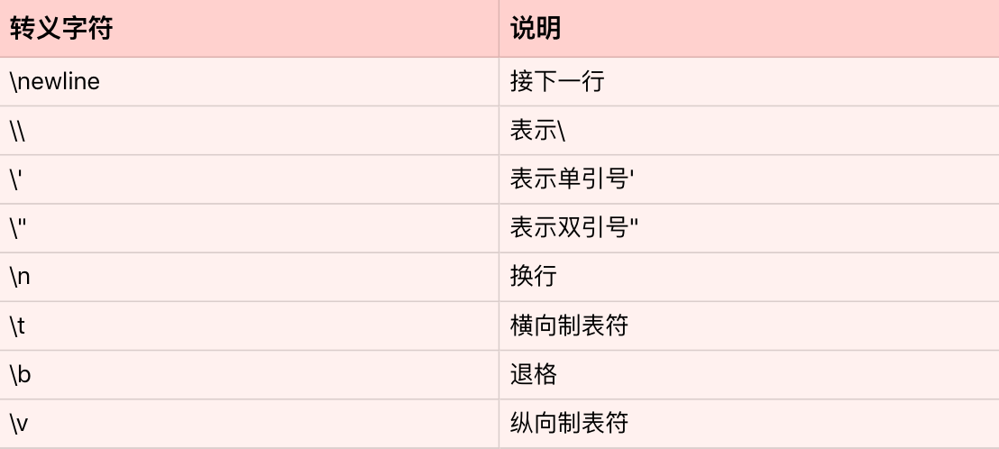

# 深入浅出字符串

你好，我是景霄。

Python 的程序中充满了字符串（string），在平常阅读代码时也屡见不鲜。字符串同样是 Python 中很常见的一种数据类型，比如日志的打印、程序中函数的注释、数据库的访问、变量的基本操作等等，都用到了字符串。

当然，我相信你本身对字符串已经有所了解。今天这节课，我主要带你回顾一下字符串的常用操作，并对其中的一些小 tricks 详细地加以解释。

## 字符串基础

什么是字符串呢？字符串是由独立字符组成的一个序列，通常包含在单引号（<code>''</code>）双引号（<code>""</code>）或者三引号之中（<code>''' '''</code>或<code>""" """</code>，两者一样），比如下面几种写法。

```
name = 'jason'
city = 'beijing'
text = "welcome to jike shijian"

```

这里定义了 name、city 和 text 三个变量，都是字符串类型。我们知道，Python 中单引号、双引号和三引号的字符串是一模一样的，没有区别，比如下面这个例子中的 s1、s2、s3 完全一样。

```
s1 = 'hello'
s2 = "hello"
s3 = """hello"""
s1 == s2 == s3
True

```

Python 同时支持这三种表达方式，很重要的一个原因就是，这样方便你在字符串中，内嵌带引号的字符串。比如：

```
"I'm a student"

```

Python 的三引号字符串，则主要应用于多行字符串的情境，比如函数的注释等等。

```
def calculate_similarity(item1, item2):
    """
    Calculate similarity between two items
    Args:
        item1: 1st item
        item2: 2nd item
    Returns:
      similarity score between item1 and item2
    """

```

同时，Python 也支持转义字符。所谓的转义字符，就是用反斜杠开头的字符串，来表示一些特定意义的字符。我把常见的的转义字符，总结成了下面这张表格。



为了方便你理解，我举一个例子来说明。

```
s = 'a\nb\tc'
print(s)
a
b	c

```

这段代码中的<code>'\n'</code>，表示一个字符——换行符；<code>'\t'</code>也表示一个字符——横向制表符。所以，最后打印出来的输出，就是字符 a，换行，字符 b，然后制表符，最后打印字符 c。不过要注意，虽然最后打印的输出横跨了两行，但是整个字符串 s 仍然只有 5 个元素。

```
len(s)
5

```

在转义字符的应用中，最常见的就是换行符<code>'\n'</code>的使用。比如文件读取，如果我们一行行地读取，那么每一行字符串的末尾，都会包含换行符<code>'\n'</code>。而最后做数据处理时，我们往往会丢掉每一行的换行符。

## 字符串的常用操作

讲完了字符串的基本原理，下面我们一起来看看字符串的常用操作。你可以把字符串想象成一个由单个字符组成的数组，所以，Python 的字符串同样支持索引，切片和遍历等等操作。

```
name = 'jason'
name[0]
'j'
name[1:3]
'as'

```

和其他数据结构，如列表、元组一样，字符串的索引同样从 0 开始，index=0 表示第一个元素（字符），[index:index+2] 则表示第 index 个元素到 index+1 个元素组成的子字符串。

遍历字符串同样很简单，相当于遍历字符串中的每个字符。

```
for char in name:
    print(char)   
j
a
s
o
n

```

特别要注意，Python 的字符串是不可变的（immutable）。因此，用下面的操作，来改变一个字符串内部的字符是错误的，不允许的。

```
s = 'hello'
s[0] = 'H'
Traceback (most recent call last):
  File "&lt;stdin&gt;", line 1, in &lt;module&gt;
TypeError: 'str' object does not support item assignment

```

Python 中字符串的改变，通常只能通过创建新的字符串来完成。比如上述例子中，想把<code>'hello'</code>的第一个字符<code>'h'</code>，改为大写的<code>'H'</code>，我们可以采用下面的做法：

```
s = 'H' + s[1:]
s = s.replace('h', 'H')

```

- 第一种方法，是直接用大写的'H'，通过加号'+'操作符，与原字符串切片操作的子字符串拼接而成新的字符串。
- 第二种方法，是直接扫描原字符串，把小写的'h'替换成大写的'H'，得到新的字符串。

你可能了解到，在其他语言中，如 Java，有可变的字符串类型，比如 StringBuilder，每次添加、改变或删除字符（串），无需创建新的字符串，时间复杂度仅为 O(1)。这样就大大提高了程序的运行效率。

但可惜的是，Python 中并没有相关的数据类型，我们还是得老老实实创建新的字符串。因此，每次想要改变字符串，往往需要 O(n) 的时间复杂度，其中，n 为新字符串的长度。

你可能注意到了，上述例子的说明中，我用的是“往往”、“通常”这样的字眼，并没有说“一定”。这是为什么呢？显然，随着版本的更新，Python 也越来越聪明，性能优化得越来越好了。

这里，我着重讲解一下，使用加法操作符<code>'+='</code>的字符串拼接方法。因为它是一个例外，打破了字符串不可变的特性。

操作方法如下所示：

```
str1 += str2  # 表示 str1 = str1 + str2

```

我们来看下面这个例子：

```
s = ''
for n in range(0, 100000):
    s += str(n)

```

你觉得这个例子的时间复杂度是多少呢？

每次循环，似乎都得创建一个新的字符串；而每次创建一个新的字符串，都需要 O(n) 的时间复杂度。因此，总的时间复杂度就为 O(1) + O(2) + … + O(n) = O(n^2)。这样到底对不对呢？

乍一看，这样分析确实很有道理，但是必须说明，这个结论只适用于老版本的 Python 了。自从 Python2.5 开始，每次处理字符串的拼接操作时（str1 += str2），Python 首先会检测 str1 还有没有其他的引用。如果没有的话，就会尝试原地扩充字符串 buffer 的大小，而不是重新分配一块内存来创建新的字符串并拷贝。这样的话，上述例子中的时间复杂度就仅为 O(n) 了。

因此，以后你在写程序遇到字符串拼接时，如果使用’+='更方便，就放心地去用吧，不用过分担心效率问题了。

另外，对于字符串拼接问题，除了使用加法操作符，我们还可以使用字符串内置的 join 函数。string.join(iterable)，表示把每个元素都按照指定的格式连接起来。

```
l = []
for n in range(0, 100000):
    l.append(str(n))
l = ' '.join(l) 

```

由于列表的 append 操作是 O(1) 复杂度，字符串同理。因此，这个含有 for 循环例子的时间复杂度为 n*O(1)=O(n)。

接下来，我们看一下字符串的分割函数 split()。string.split(separator)，表示把字符串按照 separator 分割成子字符串，并返回一个分割后子字符串组合的列表。它常常应用于对数据的解析处理，比如我们读取了某个文件的路径，想要调用数据库的 API，去读取对应的数据，我们通常会写成下面这样：

```
def query_data(namespace, table):
    """
    given namespace and table, query database to get corresponding
    data         
    """
 
path = 'hive://ads/training_table'
namespace = path.split('//')[1].split('/')[0] # 返回'ads'
table = path.split('//')[1].split('/')[1] # 返回 'training_table'
data = query_data(namespace, table) 

```

此外，常见的函数还有：

- string.strip(str)，表示去掉首尾的 str 字符串；
- string.lstrip(str)，表示只去掉开头的 str 字符串；
- string.rstrip(str)，表示只去掉尾部的 str 字符串。

这些在数据的解析处理中同样很常见。比如很多时候，从文件读进来的字符串中，开头和结尾都含有空字符，我们需要去掉它们，就可以用 strip() 函数：

```
s = ' my name is jason '
s.strip()
'my name is jason'

```

当然，Python 中字符串还有很多常用操作，比如，string.find(sub, start, end)，表示从 start 到 end 查找字符串中子字符串 sub 的位置等等。这里，我只强调了最常用并且容易出错的几个函数，其他内容你可以自行查找相应的文档、范例加以了解，我就不一一赘述了。

## 字符串的格式化

最后，我们一起来看看字符串的格式化。什么是字符串的格式化呢？

通常，我们使用一个字符串作为模板，模板中会有格式符。这些格式符为后续真实值预留位置，以呈现出真实值应该呈现的格式。字符串的格式化，通常会用在程序的输出、logging 等场景。

举一个常见的例子。比如我们有一个任务，给定一个用户的 userid，要去数据库中查询该用户的一些信息，并返回。而如果数据库中没有此人的信息，我们通常会记录下来，这样有利于往后的日志分析，或者是线上 bug 的调试等等。

我们通常会用下面的方法来表示：

```
print('no data available for person with id: {}, name: {}'.format(id, name))

```

其中的 string.format()，就是所谓的格式化函数；而大括号{}就是所谓的格式符，用来为后面的真实值——变量 name 预留位置。如果<code>id = '123'</code>、<code>name='jason'</code>，那么输出便是：

```
'no data available for person with id: 123, name: jason'

```

这样看来，是不是非常简单呢？

不过要注意，string.format() 是最新的字符串格式函数与规范。自然，我们还有其他的表示方法，比如在 Python 之前版本中，字符串格式化通常用 % 来表示，那么上述的例子，就可以写成下面这样：

```
print('no data available for person with id: %s, name: %s' % (id, name))

```

其中 %s 表示字符串型，%d 表示整型等等，这些属于常识，你应该都了解。

当然，现在你写程序时，我还是推荐使用 format 函数，毕竟这是最新规范，也是官方文档推荐的规范。

也许有人会问，为什么非要使用格式化函数，上述例子用字符串的拼接不也能完成吗？没错，在很多情况下，字符串拼接确实能满足格式化函数的需求。但是使用格式化函数，更加清晰、易读，并且更加规范，不易出错。

## 总结

这节课，我们主要学习了 Python 字符串的一些基本知识和常用操作，并且结合具体的例子与场景加以说明，特别需要注意下面几点。

- Python 中字符串使用单引号、双引号或三引号表示，三者意义相同，并没有什么区别。其中，三引号的字符串通常用在多行字符串的场景。
- Python 中字符串是不可变的（前面所讲的新版本 Python 中拼接操作’+='是个例外）。因此，随意改变字符串中字符的值，是不被允许的。
- Python 新版本（2.5+）中，字符串的拼接变得比以前高效了许多，你可以放心使用。
- Python 中字符串的格式化（string.format）常常用在输出、日志的记录等场景。

## 思考题

最后，给你留一道思考题。在新版本的 Python（2.5+）中，下面的两个字符串拼接操作，你觉得哪个更优呢？欢迎留言和我分享你的观点，也欢迎你把这篇文章分享给你的同事、朋友。

```
s = ''
for n in range(0, 100000):
    s += str(n)

```

```
l = []
for n in range(0, 100000):
    l.append(str(n))
    
s = ' '.join(l)

```

