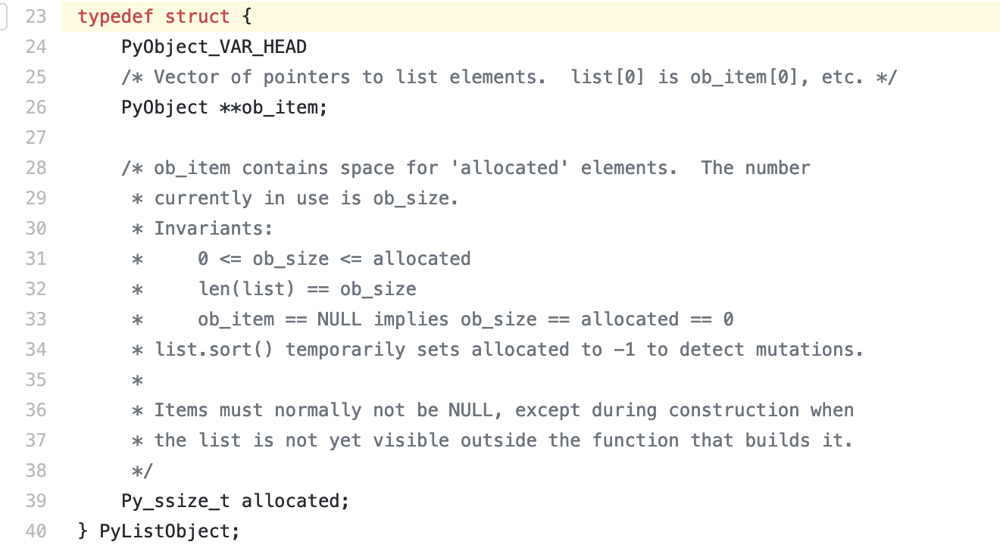
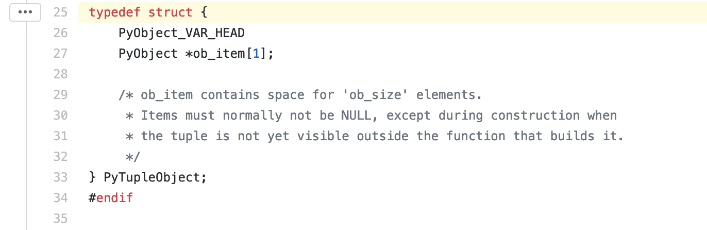
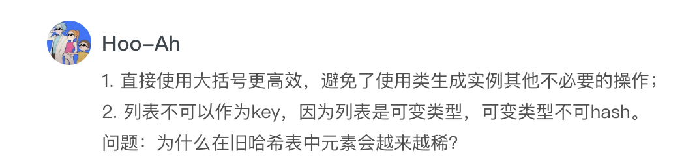
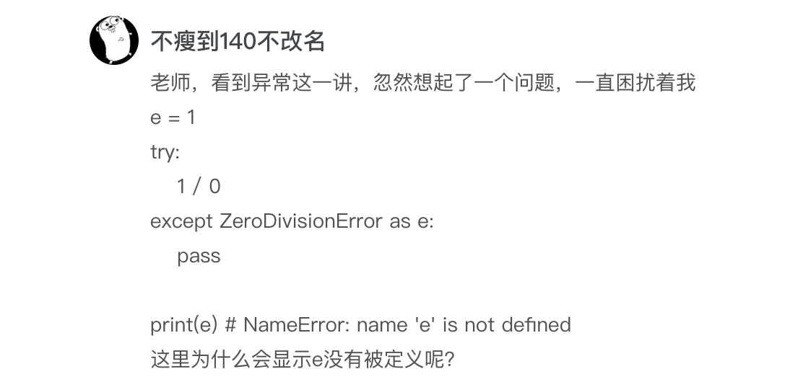
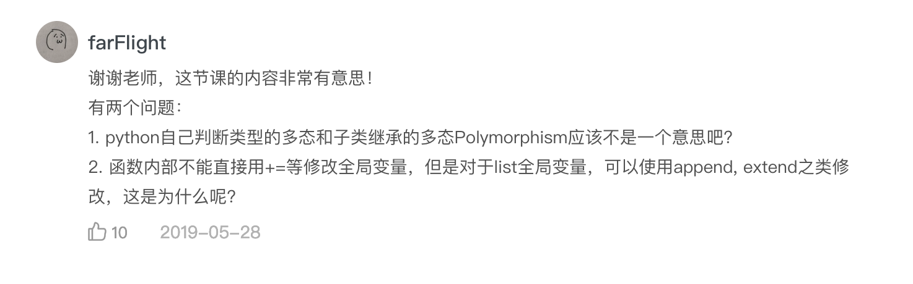

# 答疑（一）：列表和元组的内部实现是怎样的？

你好，我是景霄。

转眼间，专栏上线已经一个月了，而我们也在不知不觉中完成了第一大章基础篇的学习。我非常高兴看到很多同学一直在坚持积极地学习，并且留下了很多高质量的留言，值得我们互相思考交流。也有一些同学反复推敲，指出了文章中一些表达不严谨或是不当的地方，我也表示十分感谢。

大部分留言，我都在相对应的文章中回复过了。而一些手机上不方便回复，或是很有价值很典型的问题，我专门摘录了出来，作为今天的答疑内容，集中回复。

## 问题一：列表和元组的内部实现

第一个问题，是胡峣同学提出的，有关列表（list）和元组（tuple）的内部实现，想知道里边是 linked list 或 array，还是把 array linked 一下这样的方式？


关于这个问题，我们可以分别从源码来看。

先来看 Python 3.7 的 list 源码。你可以先自己阅读下面两个链接里的内容。

listobject.h：<a href="https://github.com/python/cpython/blob/949fe976d5c62ae63ed505ecf729f815d0baccfc/Include/listobject.h#L23">https://github.com/python/cpython/blob/949fe976d5c62ae63ed505ecf729f815d0baccfc/Include/listobject.h#L23</a>

listobject.c: <a href="https://github.com/python/cpython/blob/3d75bd15ac82575967db367c517d7e6e703a6de3/Objects/listobject.c#L33">https://github.com/python/cpython/blob/3d75bd15ac82575967db367c517d7e6e703a6de3/Objects/listobject.c#L33</a>

我把 list 的具体结构放在了下面：



可以看到，list 本质上是一个 over-allocate 的 array。其中，ob_item 是一个指针列表，里面的每一个指针都指向列表的元素。而 allocated 则存储了这个列表已经被分配的空间大小。

需要注意的是，allocated 与列表实际空间大小的区别。列表实际空间大小，是指 len(list) 返回的结果，即上述代码注释中的 ob_size，表示这个列表总共存储了多少个元素。实际情况下，为了优化存储结构，避免每次增加元素都要重新分配内存，列表预分配的空间 allocated 往往会大于 ob_size（详见正文中的例子）。

所以，它们的关系为：<code>allocated &gt;= len(list) = ob_size</code>。

如果当前列表分配的空间已满（即 allocated == len(list)），则会向系统请求更大的内存空间，并把原来的元素全部拷贝过去。列表每次分配空间的大小，遵循下面的模式：

```
0, 4, 8, 16, 25, 35, 46, 58, 72, 88, ...

```

我们再来分析元组。下面是 Python 3.7 的 tuple 源码，同样的，你可以先自己阅读一下。

tupleobject.h： <a href="https://github.com/python/cpython/blob/3d75bd15ac82575967db367c517d7e6e703a6de3/Include/tupleobject.h#L25">https://github.com/python/cpython/blob/3d75bd15ac82575967db367c517d7e6e703a6de3/Include/tupleobject.h#L25</a>

tupleobject.c：<a href="https://github.com/python/cpython/blob/3d75bd15ac82575967db367c517d7e6e703a6de3/Objects/tupleobject.c#L16">https://github.com/python/cpython/blob/3d75bd15ac82575967db367c517d7e6e703a6de3/Objects/tupleobject.c#L16</a>

同样的，下面为 tuple 的具体结构：



你可以看到，它和 list 相似，本质也是一个 array，但是空间大小固定。不同于一般 array，Python 的 tuple 做了许多优化，来提升在程序中的效率。

举个例子，当 tuple 的大小不超过 20 时，Python 就会把它缓存在内部的一个 free list 中。这样，如果你以后需要再去创建同样的 tuple，Python 就可以直接从缓存中载入，提高了程序运行效率。

## 问题二：为什么在旧哈希表中，元素会越来越稀疏？

第二个问题，是 Hoo 同学提出的，为什么在旧哈希表中，元素会越来越稀疏？



我们可以先来看旧哈希表的示意图：

```
--+-------------------------------+
  | 哈希值 (hash)  键 (key)  值 (value)
--+-------------------------------+
0 |    hash0      key0    value0
--+-------------------------------+
1 |    hash1      key1    value1
--+-------------------------------+
2 |    hash2      key2    value2
--+-------------------------------+
. |           ...
__+_______________________________+

```

你会发现，它是一个 over-allocate 的 array，根据元素键（key）的哈希值，来计算其应该被插入位置的索引。

因此，假设我有下面这样一个字典：

```
{'name': 'mike', 'dob': '1999-01-01', 'gender': 'male'}

```

那么这个字典便会存储为类似下面的形式：

```
entries = [
['--', '--', '--']
[-230273521, 'dob', '1999-01-01'],
['--', '--', '--'],
['--', '--', '--'],
[1231236123, 'name', 'mike'],
['--', '--', '--'],
[9371539127, 'gender', 'male']
]

```

这里的<code>’---‘</code>，表示这个位置没有元素，但是已经分配了内存。

我们知道，当哈希表剩余空间小于 1/3 时，为了保证相关操作的高效性并避免哈希冲突，就会重新分配更大的内存。所以，当哈希表中的元素越来越多时，分配了内存但里面没有元素的位置，也会变得越来越多。这样一来，哈希表便会越来越稀疏。

而新哈希表的结构，改变了这一点，也大大提高了空间的利用率。新哈希表的结构如下所示：

```
Indices
----------------------------------------------------
None | index | None | None | index | None | index ...
----------------------------------------------------
 
 
Entries
--------------------
hash0   key0  value0
---------------------
hash1   key1  value1
---------------------
hash2   key2  value2
---------------------
        ...
---------------------

```

你可以看到，它把存储结构分成了 Indices 和 Entries 这两个 array，而<code>’None‘</code>代表这个位置分配了内存但没有元素。

我们同样还用上面这个例子，它在新哈希表中的存储模式，就会变为下面这样：

```
indices = [None, 1, None, None, 0, None, 2]
entries = [
[1231236123, 'name', 'mike'],
[-230273521, 'dob', '1999-01-01'],
[9371539127, 'gender', 'male']
]

```

其中，Indices 中元素的值，对应 entries 中相应的索引。比如<code>indices</code>中的<code>1</code>，就对应着<code>entries[1]</code>，即<code>’'dob': '1999-01-01'‘</code>。

对比之下，我们会清晰感受到，新哈希表中的空间利用率，相比于旧哈希表有大大的提升。

## 问题三：有关异常的困扰

第三个问题，是“不瘦到 140 不改名”同学提出的，对“NameError”异常的困惑。这是很常见的一个错误，我在这里也解释一下。



这个问题其实有点 tricky，如果你查阅<a href="https://docs.python.org/3/reference/compound_stmts.html#the-try-statement">官方文档</a>，会看到这么一句话”When an exception has been assigned using as target, it is cleared at the end of the except clause. ”

这句话意思是，如果你在异常处理的 except block 中，把异常赋予了一个变量，那么这个变量会在 except block 执行结束时被删除，相当于下面这样的表示：

```
e = 1
try:
    1 / 0
except ZeroDivisionError as e:
    try:
        pass
    finally:
        del e

```

这里的 e 一开始指向整数 1，但是在 except block 结束时被删除了（del e），所以程序执行就会抛出“NameError”的异常。

因此，这里提醒我们，在平时写代码时，一定要保证 except 中异常赋予的变量，在之后的语句中不再被用到。

## 问题四：关于多态和全局变量的修改

最后的问题来自于 farFlight 同学，他提了两个问题：

1. Python 自己判断类型的多态和子类继承的多态 Polymorphism 是否相同？
2. 函数内部不能直接用 += 等修改全局变量，但是对于 list 全局变量，却可以使用 append、extend 之类修改，这是为什么呢?



我们分别来看这两个问题。对于第一个问题，要搞清楚多态的概念，多态是指有多种不同的形式。因此，判断类型的多态和子类继承的多态，在本质上都是一样的，只不过你可以把它们理解为多态的两种不同表现。

再来看第二个问题。当全局变量指向的对象不可变时，比如是整型、字符串等等，如果你尝试在函数内部改变它的值，却不加关键字 global，就会抛出异常：

```
x = 1
 
def func():
    x += 1
func()
x
 
## 输出
UnboundLocalError: local variable 'x' referenced before assignment

```

这是因为，程序默认函数内部的 x 是局部变量，而你没有为其赋值就直接引用，显然是不可行。

不过，如果全局变量指向的对象是可变的，比如是列表、字典等等，你就可以在函数内部修改它了：

```
x = [1]
 
def func():
    x.append(2)
func()
x
 
## 输出
[1, 2]

```

当然，需要注意的是，这里的<code>x.append(2)</code>，并没有改变变量 x，x 依然指向原来的列表。事实上，这句话的意思是，访问 x 指向的列表，并在这个列表的末尾增加 2。

今天主要回答这些问题，同时也欢迎你继续在留言区写下疑问和感想，我会持续不断地解答。希望每一次的留言和答疑，都能给你带来新的收获和价值。

