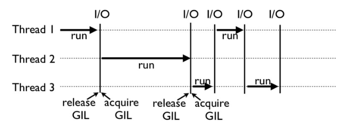
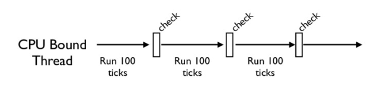

# 你真的懂Python GIL（全局解释器锁）吗？

你好，我是景霄。

前面几节课，我们学习了 Python 的并发编程特性，也了解了多线程编程。事实上，Python 多线程另一个很重要的话题——GIL（Global Interpreter Lock，即全局解释器锁）却鲜有人知，甚至连很多 Python“老司机”都觉得 GIL 就是一个谜。今天我就来为你解谜，带你一起来看 GIL。

## 一个不解之谜

耳听为虚，眼见为实。我们不妨先来看一个例子，让你感受下 GIL 为什么会让人不明所以。

比如下面这段很简单的 cpu-bound 代码：

```python
def CountDown(n):
    while n > 0:
        n -= 1

```

现在，假设一个很大的数字 n = 100000000，我们先来试试单线程的情况下执行 CountDown(n)。在我手上这台号称 8 核的 MacBook 上执行后，我发现它的耗时为 5.4s。

这时，我们想要用多线程来加速，比如下面这几行操作：

```python
from threading import Thread
 
n = 100000000
 
t1 = Thread(target=CountDown, args=[n // 2])
t2 = Thread(target=CountDown, args=[n // 2])
t1.start()
t2.start()
t1.join()
t2.join()

```

我又在同一台机器上跑了一下，结果发现，这不仅没有得到速度的提升，反而让运行变慢，总共花了 9.6s。

我还是不死心，决定使用四个线程再试一次，结果发现运行时间还是 9.8s，和 2 个线程的结果几乎一样。

这是怎么回事呢？难道是我买了假的 MacBook 吗？你可以先自己思考一下这个问题，也可以在自己电脑上测试一下。我当然也要自我反思一下，并且提出了下面两个猜想。

第一个怀疑：我的机器出问题了吗？

这不得不说也是一个合理的猜想。因此我又找了一个单核 CPU 的台式机，跑了一下上面的实验。这次我发现，在单核 CPU 电脑上，单线程运行需要 11s 时间，2 个线程运行也是 11s 时间。虽然不像第一台机器那样，多线程反而比单线程更慢，但是这两次整体效果几乎一样呀！

看起来，这不像是电脑的问题，而是 Python 的线程失效了，没有起到并行计算的作用。

顺理成章，我又有了第二个怀疑：Python 的线程是不是假的线程？

Python 的线程，的的确确封装了底层的操作系统线程，在 Linux 系统里是 Pthread（全称为 POSIX Thread），而在 Windows 系统里是 Windows Thread。另外，Python 的线程，也完全受操作系统管理，比如协调何时执行、管理内存资源、管理中断等等。

所以，虽然 Python 的线程和 C++ 的线程本质上是不同的抽象，但它们的底层并没有什么不同。

## 为什么有 GIL？

看来我的两个猜想，都不能解释开头的这个未解之谜。那究竟谁才是“罪魁祸首”呢？事实上，正是我们今天的主角，也就是 GIL，导致了 Python 线程的性能并不像我们期望的那样。

GIL，是最流行的 Python 解释器 CPython 中的一个技术术语。它的意思是全局解释器锁，本质上是类似操作系统的 Mutex。每一个 Python 线程，在 CPython 解释器中执行时，都会先锁住自己的线程，阻止别的线程执行。

当然，CPython 会做一些小把戏，轮流执行 Python 线程。这样一来，用户看到的就是“伪并行”——Python 线程在交错执行，来模拟真正并行的线程。

那么，为什么 CPython 需要 GIL 呢？这其实和 CPython 的实现有关。下一节我们会讲 Python 的内存管理机制，今天先稍微提一下。

CPython 使用引用计数来管理内存，所有 Python 脚本中创建的实例，都会有一个引用计数，来记录有多少个指针指向它。当引用计数只有 0 时，则会自动释放内存。

什么意思呢？我们来看下面这个例子：

```python
>>> import sys
>>> a = []
>>> b = a
>>> sys.getrefcount(a)
3

```

这个例子中，a 的引用计数是 3，因为有 a、b 和作为参数传递的 getrefcount 这三个地方，都引用了一个空列表。

这样一来，如果有两个 Python 线程同时引用了 a，就会造成引用计数的 race condition，引用计数可能最终只增加 1，这样就会造成内存被污染。因为第一个线程结束时，会把引用计数减少 1，这时可能达到条件释放内存，当第二个线程再试图访问 a 时，就找不到有效的内存了。

所以说，CPython  引进 GIL 其实主要就是这么两个原因：

- 一是设计者为了规避类似于内存管理这样的复杂的竞争风险问题（race condition）；
- 二是因为 CPython 大量使用 C 语言库，但大部分 C 语言库都不是原生线程安全的（线程安全会降低性能和增加复杂度）。

## GIL 是如何工作的？

下面这张图，就是一个 GIL 在 Python 程序的工作示例。其中，Thread 1、2、3 轮流执行，每一个线程在开始执行时，都会锁住 GIL，以阻止别的线程执行；同样的，每一个线程执行完一段后，会释放 GIL，以允许别的线程开始利用资源。



细心的你可能会发现一个问题：为什么 Python 线程会去主动释放 GIL 呢？毕竟，如果仅仅是要求 Python 线程在开始执行时锁住 GIL，而永远不去释放 GIL，那别的线程就都没有了运行的机会。

没错，CPython 中还有另一个机制，叫做 check_interval，意思是 CPython 解释器会去轮询检查线程 GIL 的锁住情况。每隔一段时间，Python 解释器就会强制当前线程去释放 GIL，这样别的线程才能有执行的机会。

不同版本的 Python 中，check interval 的实现方式并不一样。早期的 Python 是 100 个 ticks，大致对应了 1000 个 bytecodes；而 Python 3 以后，interval 是 15 毫秒。当然，我们不必细究具体多久会强制释放 GIL，这不应该成为我们程序设计的依赖条件，我们只需明白，CPython 解释器会在一个“合理”的时间范围内释放 GIL 就可以了。



整体来说，每一个 Python 线程都是类似这样循环的封装，我们来看下面这段代码：

```python
for (;;) {
    if (--ticker < 0) {
        ticker = check_interval;
    
        /* Give another thread a chance */
        PyThread_release_lock(interpreter_lock);
    
        /* Other threads may run now */
    
        PyThread_acquire_lock(interpreter_lock, 1);
    }
 
    bytecode = *next_instr++;
    switch (bytecode) {
        /* execute the next instruction ... */ 
    }
}

```

从这段代码中，我们可以看到，每个 Python 线程都会先检查 ticker 计数。只有在 ticker 大于 0 的情况下，线程才会去执行自己的 bytecode。

## Python 的线程安全

不过，有了 GIL，并不意味着我们 Python 编程者就不用去考虑线程安全了。即使我们知道，GIL 仅允许一个 Python 线程执行，但前面我也讲到了，Python 还有 check interval 这样的抢占机制。我们来考虑这样一段代码：

```python
import threading
 
n = 0
 
def foo():
    global n
    n += 1
 
threads = []
for i in range(100):
    t = threading.Thread(target=foo)
    threads.append(t)
 
for t in threads:
    t.start()
 
for t in threads:
    t.join()
 
print(n)

```

如果你执行的话，就会发现，尽管大部分时候它能够打印 100，但有时侯也会打印 99 或者 98。

这其实就是因为，<code>n+=1</code>这一句代码让线程并不安全。如果你去翻译 foo 这个函数的 bytecode，就会发现，它实际上由下面四行 bytecode 组成：

```python
>>> import dis
>>> dis.dis(foo)
LOAD_GLOBAL              0 (n)
LOAD_CONST               1 (1)
INPLACE_ADD
STORE_GLOBAL             0 (n)

```

而这四行 bytecode 中间都是有可能被打断的！

所以，千万别想着，有了 GIL 你的程序就可以高枕无忧了，我们仍然需要去注意线程安全。正如我开头所说，<strong>GIL 的设计，主要是为了方便 CPython 解释器层面的编写者，而不是 Python 应用层面的程序员</strong>。作为 Python 的使用者，我们还是需要 lock 等工具，来确保线程安全。比如我下面的这个例子：

```python
n = 0
lock = threading.Lock()
 
def foo():
    global n
    with lock:
        n += 1

```

## 如何绕过 GIL？

学到这里，估计有的 Python 使用者感觉自己像被废了武功一样，觉得降龙十八掌只剩下了一掌。其实大可不必，你并不需要太沮丧。Python 的 GIL，是通过 CPython 的解释器加的限制。如果你的代码并不需要 CPython 解释器来执行，就不再受 GIL 的限制。

事实上，很多高性能应用场景都已经有大量的 C 实现的 Python 库，例如 NumPy 的矩阵运算，就都是通过 C 来实现的，并不受 GIL 影响。

所以，大部分应用情况下，你并不需要过多考虑 GIL。因为如果多线程计算成为性能瓶颈，往往已经有 Python 库来解决这个问题了。

换句话说，如果你的应用真的对性能有超级严格的要求，比如 100us 就对你的应用有很大影响，那我必须要说，Python 可能不是你的最优选择。

当然，可以理解的是，我们难以避免的有时候就是想临时给自己松松绑，摆脱 GIL，比如在深度学习应用里，大部分代码就都是 Python 的。在实际工作中，如果我们想实现一个自定义的微分算子，或者是一个特定硬件的加速器，那我们就不得不把这些关键性能（performance-critical）代码在 C++ 中实现（不再受 GIL 所限），然后再提供 Python 的调用接口。

总的来说，你只需要重点记住，绕过 GIL 的大致思路有这么两种就够了：

1. 绕过 CPython，使用 JPython（Java 实现的 Python 解释器）等别的实现；
2. 把关键性能代码，放到别的语言（一般是 C++）中实现。

## 总结

今天这节课，我们先通过一个实际的例子，了解了 GIL 对于应用的影响；之后我们适度剖析了 GIL 的实现原理，你不必深究一些原理的细节，明白其主要机制和存在的隐患即可。

自然，我也为你提供了绕过 GIL 的两种思路。不过还是那句话，很多时候，我们并不需要过多纠结 GIL 的影响。

## 思考题

最后，我给你留下两道思考题。

第一问，在我们处理 cpu-bound 的任务（文中第一个例子）时，为什么有时候使用多线程会比单线程还要慢些？

第二问，你觉得 GIL 是一个好的设计吗？事实上，在 Python 3 之后，确实有很多关于 GIL 改进甚至是取消的讨论，你的看法是什么呢？你在平常工作中有被 GIL 困扰过的场景吗？

欢迎在留言区写下你的想法，也欢迎你把今天的内容分享给你的同事朋友，我们一起交流、一起进步。
