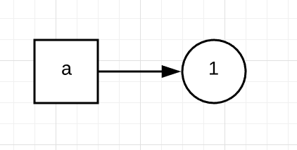
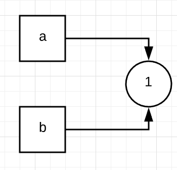
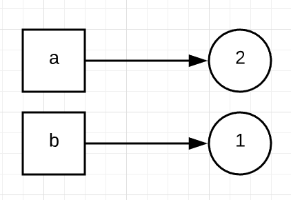
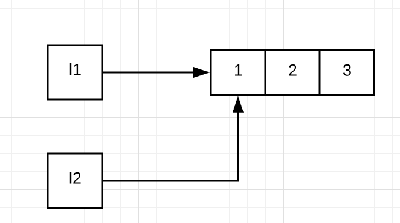
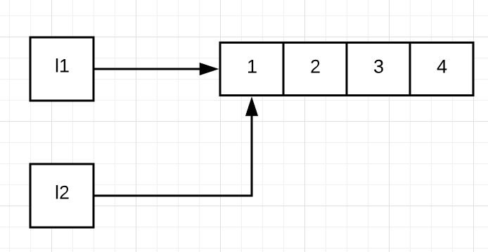

# 值传递，引用传递or其他，Python里参数是如何传递的？

你好，我是景霄。

在前面的第一大章节中，我们一起学习了 Python 的函数基础及其应用。我们大致明白了，所谓的传参，就是把一些参数从一个函数传递到另一个函数，从而使其执行相应的任务。但是你有没有想过，参数传递的底层是如何工作的，原理又是怎样的呢？

实际工作中，很多人会遇到这样的场景：写完了代码，一测试，发现结果和自己期望的不一样，于是开始一层层地 debug。花了很多时间，可到最后才发现，是传参过程中数据结构的改变，导致了程序的“出错”。

比如，我将一个列表作为参数传入另一个函数，期望列表在函数运行结束后不变，但是往往“事与愿违”，由于某些操作，它的值改变了，那就很有可能带来后续程序一系列的错误。

因此，了解 Python 中参数的传递机制，具有十分重要的意义，这往往能让我们写代码时少犯错误，提高效率。今天我们就一起来学习一下，Python 中参数是如何传递的。

## <strong>什么是值传递和引用传递</strong>

如果你接触过其他的编程语言，比如 C/C++，很容易想到，常见的参数传递有 2 种：<strong>值传递</strong>和<strong>引用传递</strong>。所谓值传递，通常就是拷贝参数的值，然后传递给函数里的新变量。这样，原变量和新变量之间互相独立，互不影响。

比如，我们来看下面的一段 C++ 代码：

```
#include &lt;iostream&gt;
using namespace std;
 
// 交换 2 个变量的值
void swap(int x, int y) {
int temp;
temp = x; // 交换 x 和 y 的值
 x = y;
 y = temp;
 return;
}
int main () {
 int a = 1;
 int b = 2;
 cout &lt;&lt; "Before swap, value of a :" &lt;&lt; a &lt;&lt; endl;
 cout &lt;&lt; "Before swap, value of b :" &lt;&lt; b &lt;&lt; endl;
 swap(a, b); 
 cout &lt;&lt; "After swap, value of a :" &lt;&lt; a &lt;&lt; endl;
 cout &lt;&lt; "After swap, value of b :" &lt;&lt; b &lt;&lt; endl;
 return 0;
}
Before swap, value of a :1
Before swap, value of b :2
After swap, value of a :1
After swap, value of b :2

```

这里的 swap() 函数，把 a 和 b 的值拷贝给了 x 和 y，然后再交换 x 和 y 的值。这样一来，x 和 y 的值发生了改变，但是 a 和 b 不受其影响，所以值不变。这种方式，就是我们所说的值传递。

所谓引用传递，通常是指把参数的引用传给新的变量，这样，原变量和新变量就会指向同一块内存地址。如果改变了其中任何一个变量的值，那么另外一个变量也会相应地随之改变。

还是拿我们刚刚讲到的 C++ 代码为例，上述例子中的 swap() 函数，如果改成下面的形式，声明引用类型的参数变量：

```
void swap(int&amp; x, int&amp; y) {
   int temp;
   temp = x; // 交换 x 和 y 的值
   x = y;
   y = temp;
   return;
}

```

那么输出的便是另一个结果：

```
Before swap, value of a :1
Before swap, value of b :2
After swap, value of a :2
After swap, value of b :1

```

原变量 a 和 b 的值被交换了，因为引用传递使得 a 和 x，b 和 y 一模一样，对 x 和 y 的任何改变必然导致了 a 和 b 的相应改变。

不过，这是 C/C++ 语言中的特点。那么 Python 中，参数传递到底是如何进行的呢？它们到底属于值传递、引用传递，还是其他呢？

在回答这个问题之前，让我们先来了解一下，Python 变量和赋值的基本原理。

## <strong>Python 变量及其赋值</strong>

我们首先来看，下面的 Python 代码示例：

```
a = 1
b = a
a = a + 1

```

这里首先将 1 赋值于 a，即 a 指向了 1 这个对象，如下面的流程图所示：



接着 b = a 则表示，让变量 b 也同时指向 1 这个对象。这里要注意，Python 里的对象可以被多个变量所指向或引用。



最后执行 a = a + 1。需要注意的是，Python 的数据类型，例如整型（int）、字符串（string）等等，是不可变的。所以，a = a + 1，并不是让 a 的值增加 1，而是表示重新创建了一个新的值为 2 的对象，并让 a 指向它。但是 b 仍然不变，仍然指向 1 这个对象。

因此，最后的结果是，a 的值变成了 2，而 b 的值不变仍然是 1。



通过这个例子你可以看到，这里的 a 和 b，开始只是两个指向同一个对象的变量而已，或者你也可以把它们想象成同一个对象的两个名字。简单的赋值 b = a，并不表示重新创建了新对象，只是让同一个对象被多个变量指向或引用。

同时，指向同一个对象，也并不意味着两个变量就被绑定到了一起。如果你给其中一个变量重新赋值，并不会影响其他变量的值。

明白了这个基本的变量赋值例子，我们再来看一个列表的例子：

```
l1 = [1, 2, 3]
l2 = l1
l1.append(4)
l1
[1, 2, 3, 4]
l2
[1, 2, 3, 4]

```

同样的，我们首先让列表 l1 和 l2 同时指向了 [1, 2, 3] 这个对象。



由于列表是可变的，所以 l1.append(4) 不会创建新的列表，只是在原列表的末尾插入了元素 4，变成 [1, 2, 3, 4]。由于 l1 和 l2 同时指向这个列表，所以列表的变化会同时反映在 l1 和 l2 这两个变量上，那么，l1 和 l2 的值就同时变为了 [1, 2, 3, 4]。



另外，需要注意的是，Python 里的变量可以被删除，但是对象无法被删除。比如下面的代码：

```
l = [1, 2, 3]
del l

```

del l 删除了 l 这个变量，从此以后你无法访问 l，但是对象 [1, 2, 3] 仍然存在。Python 程序运行时，其自带的垃圾回收系统会跟踪每个对象的引用。如果 [1, 2, 3] 除了 l 外，还在其他地方被引用，那就不会被回收，反之则会被回收。

由此可见，在 Python 中：

- 变量的赋值，只是表示让变量指向了某个对象，并不表示拷贝对象给变量；而一个对象，可以被多个变量所指向。
- 可变对象（列表，字典，集合等等）的改变，会影响所有指向该对象的变量。
- 对于不可变对象（字符串，整型，元祖等等），所有指向该对象的变量的值总是一样的，也不会改变。但是通过某些操作（+= 等等）更新不可变对象的值时，会返回一个新的对象。
- 变量可以被删除，但是对象无法被删除。

## <strong>Python 函数的参数传递</strong>

从上述 Python 变量的命名与赋值的原理讲解中，相信你能举一反三，大概猜出 Python 函数中参数是如何传递了吧？

这里首先引用 Python 官方文档中的一段说明：

> “Remember that arguments are passed by assignment in Python. Since assignment just creates references to objects, there’s no alias between an argument name in the caller and callee, and so no call-by-reference per Se.”

准确地说，Python 的参数传递是<strong>赋值传递</strong> （pass by assignment），或者叫作对象的<strong>引用传递</strong>（pass by object reference）。Python 里所有的数据类型都是对象，所以参数传递时，只是让新变量与原变量指向相同的对象而已，并不存在值传递或是引用传递一说。

比如，我们来看下面这个例子：

```
def my_func1(b):
	b = 2
 
a = 1
my_func1(a)
a
1

```

这里的参数传递，使变量 a 和 b 同时指向了 1 这个对象。但当我们执行到 b = 2 时，系统会重新创建一个值为 2 的新对象，并让 b 指向它；而 a 仍然指向 1 这个对象。所以，a 的值不变，仍然为 1。

那么对于上述例子的情况，是不是就没有办法改变 a 的值了呢？

答案当然是否定的，我们只需稍作改变，让函数返回新变量，赋给 a。这样，a 就指向了一个新的值为 2 的对象，a 的值也因此变为 2。

```
def my_func2(b):
	b = 2
	return b
 
a = 1
a = my_func2(a)
a
2

```

不过，当可变对象当作参数传入函数里的时候，改变可变对象的值，就会影响所有指向它的变量。比如下面的例子：

```
def my_func3(l2):
	l2.append(4)
 
l1 = [1, 2, 3]
my_func3(l1)
l1
[1, 2, 3, 4]

```

这里 l1 和 l2 先是同时指向值为 [1, 2, 3] 的列表。不过，由于列表可变，执行 append() 函数，对其末尾加入新元素 4 时，变量 l1 和 l2 的值也都随之改变了。

但是，下面这个例子，看似都是给列表增加了一个新元素，却得到了明显不同的结果。

```
def my_func4(l2):
	l2 = l2 + [4]
 
l1 = [1, 2, 3]
my_func4(l1)
l1
[1, 2, 3]

```

为什么 l1 仍然是 [1, 2, 3]，而不是 [1, 2, 3, 4] 呢？

要注意，这里 l2 = l2 + [4]，表示创建了一个“末尾加入元素 4“的新列表，并让 l2 指向这个新的对象。这个过程与 l1 无关，因此 l1 的值不变。当然，同样的，如果要改变 l1 的值，我们就得让上述函数返回一个新列表，再赋予 l1 即可：

```
def my_func5(l2):
	l2 = l2 + [4]
	return l2
 
l1 = [1, 2, 3]
l1 = my_func5(l1)
l1
[1, 2, 3, 4]

```

这里你尤其要记住的是，改变变量和重新赋值的区别：

- my_func3() 中单纯地改变了对象的值，因此函数返回后，所有指向该对象的变量都会被改变；
- 但 my_func4() 中则创建了新的对象，并赋值给一个本地变量，因此原变量仍然不变。

至于 my_func3() 和 my_func5() 的用法，两者虽然写法不同，但实现的功能一致。不过，在实际工作应用中，我们往往倾向于类似 my_func5() 的写法，添加返回语句。这样更简洁明了，不易出错。

## <strong>总结</strong>

今天，我们一起学习了 Python 的变量及其赋值的基本原理，并且解释了 Python 中参数是如何传递的。和其他语言不同的是，Python 中参数的传递既不是值传递，也不是引用传递，而是赋值传递，或者是叫对象的引用传递。

需要注意的是，这里的赋值或对象的引用传递，不是指向一个具体的内存地址，而是指向一个具体的对象。

- 如果对象是可变的，当其改变时，所有指向这个对象的变量都会改变。
- 如果对象不可变，简单的赋值只能改变其中一个变量的值，其余变量则不受影响。

清楚了这一点，如果你想通过一个函数来改变某个变量的值，通常有两种方法。一种是直接将可变数据类型（比如列表，字典，集合）当作参数传入，直接在其上修改；第二种则是创建一个新变量，来保存修改后的值，然后将其返回给原变量。在实际工作中，我们更倾向于使用后者，因为其表达清晰明了，不易出错。

## <strong>思考题</strong>

最后，我为你留下了两道思考题。

第一个问题，下面的代码中, l1、l2 和 l3 都指向同一个对象吗？

```
l1 = [1, 2, 3]
l2 = [1, 2, 3]
l3 = l2

```

第二个问题，下面的代码中，打印 d 最后的输出是什么呢？

```
def func(d):
    d['a'] = 10
	d['b'] = 20
	d = {'a': 1, 'b': 2}
 
func(d)
print(d)

```

欢迎留言和我分享，也欢迎你把这篇文章分享给你的同事、朋友，一起在交流中进步。


