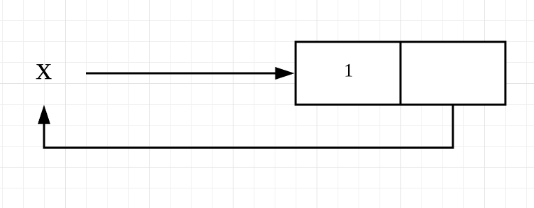
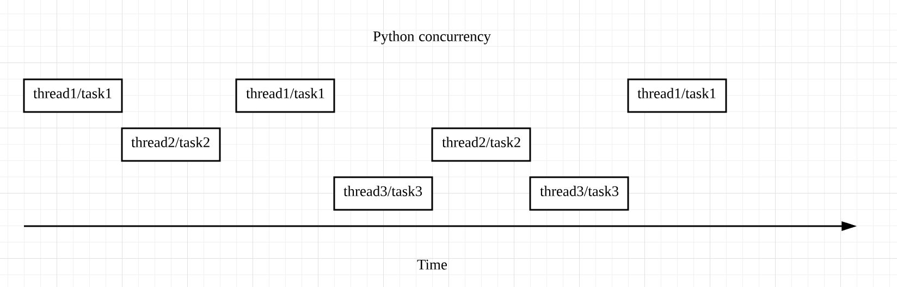

# 答疑（二）：GIL与多线程是什么关系呢？

你好，我是景霄。

不知不觉中，我们又一起完成了第二大章进阶篇的学习。我非常高兴看到很多同学一直在坚持积极地学习，并且留下了很多高质量的留言，值得我们互相思考交流。也有一些同学反复推敲，指出了文章中一些表达不严谨或是不当的地方，我也表示十分感谢。

大部分留言，我都在相对应的文章中回复过了。而一些手机上不方便回复，或是很有价值很典型的问题，我专门摘录了出来，作为今天的答疑内容，集中回复。

## 问题一：列表 self append 无限嵌套的原理


先来回答第一个问题，两个同学都问到了，下面这段代码中的 x，为什么是无限嵌套的列表？

```python
x = [1]
x.append(x)
x
[1, [...]]

```

我们可以将上述操作画一个图，便于你更直观地理解：



这里，x 指向一个列表，列表的第一个元素为 1；执行了 append 操作后，第二个元素又反过来指向 x，即指向了 x 所指向的列表，因此形成了一个无限嵌套的循环：[1, [1, [1, [1, …]]]]。

不过，虽然 x 是无限嵌套的列表，但 x.append(x) 的操作，并不会递归遍历其中的每一个元素。它只是扩充了原列表的第二个元素，并将其指向 x，因此不会出现 stack overflow 的问题，自然不会报错。

至于第二点，为什么 len(x) 返回的是 2？我们还是来看 x，虽然它是无限嵌套的列表，但 x 的 top level 只有 2 个元素组成，第一个元素为 1，第二个元素为指向自身的列表，因此 len(x) 返回 2。

## 问题二：装饰器的宏观理解


再来看第二个问题，胡峣同学对装饰器的疑问。事实上，装饰器的作用与意义，在于其可以通过自定义的函数或类，在不改变原函数的基础上，改变原函数的一些功能。

```python
Decorators is to modify the behavior of the function through a wrapper so we don't have to actually modify the function.

```

装饰器将额外增加的功能，封装在自己的装饰器函数或类中；如果你想要调用它，只需要在原函数的顶部，加上 @decorator 即可。显然，这样做可以让你的代码得到高度的抽象、分离与简化。

光说概念可能还是有点抽象，我们可以想象下面这样一个场景，从真实例子来感受装饰器的魅力。在一些社交网站的后台，有无数的操作在调用之前，都需要先检查用户是否登录，比如在一些帖子里发表评论、发表状态等等。

如果你不知道装饰器，用常规的方法来编程，写出来的代码大概是下面这样的：

```python
# 发表评论
def post_comment(request, ...):
    if not authenticate(request):
        raise Exception('U must log in first')
    ...
    
# 发表状态
def post_moment(request, ...):
    if not authenticate(request):
        raise Exception('U must log in first')
    ...

```

显然，这样重复调用认证函数 authenticate() 的步骤，就显得非常冗余了。更好的解决办法，就是将认证函数 authenticate() 单独分离出来，写成一个装饰器，就像我们下面这样的写法。这样一来，代码便得到了高度的优化：

```python
# 发表评论
@authenticate
def post_comment(request, ...):
 
# 发表状态
@authenticate
def post_moment(request, ...):

```

不过也要注意，很多情况下，装饰器并不是唯一的方法。而我这里强调的，主要是使用装饰器带来的好处：

- 代码更加简洁；
- 逻辑更加清晰；
- 程序的层次化、分离化更加明显。

而这也是我们应该遵循和优先选择的开发模式。

## 问题三：GIL 与多线程的关系


第三个问题，new 同学疑惑的是，GIL 只支持单线程，而 Python 支持多线程，这两者之间究竟是什么关系呢？

其实，GIL 的存在与 Python 支持多线程并不矛盾。前面我们讲过，GIL 是指同一时刻，程序只能有一个线程运行；而 Python 中的多线程，是指多个线程交替执行，造成一个“伪并行”的结果，但是具体到某一时刻，仍然只有 1 个线程在运行，并不是真正的多线程并行。这个机制，我画了下面这张图来表示：



举个例子来理解。比如，我用 10 个线程来爬取 50 个网站的内容。线程 1 在爬取第 1 个网站时，被 I/O block 住了，处于等待状态；这时，GIL 就会释放，而线程 2 就会开始执行，去爬取第 2 个网站，依次类推。等到线程 1 的 I/O 操作完成时，主程序便又会切回线程 1，让其完成剩下的操作。这样一来，从用户角度看到的，便是我们所说的多线程。

## 问题四：多进程与多线程的应用场景


第四个问题，这个在文章中多次提到，不过，我还是想在这里再次强调一下。

如果你想对 CPU 密集型任务加速，使用多线程是无效的，请使用多进程。这里所谓的 CPU 密集型任务，是指会消耗大量 CPU 资源的任务，比如求 1 到 100000000 的乘积，或者是把一段很长的文字编码后又解码等等。

使用多线程之所以无效，原因正是我们前面刚讲过的，Python 多线程的本质是多个线程互相切换，但同一时刻仍然只允许一个线程运行。因此，你使用多线程，和使用一个主线程，本质上来说并没有什么差别；反而在很多情况下，因为线程切换带来额外损耗，还会降低程序的效率。

而如果使用多进程，就可以允许多个进程之间 in parallel 地执行任务，所以能够有效提高程序的运行效率。

至于 I/O 密集型任务，如果想要加速，请优先使用多线程或 Asyncio。当然，使用多进程也可以达到目的，但是完全没有这个必要。因为对 I/O 密集型任务来说，大多数时间都浪费在了 I/O 等待上。因此，在一个线程 / 任务等待 I/O 时，我们只需要切换线程 / 任务去执行其他  I/O 操作就可以了。

不过，如果 I/O 操作非常多、非常 heavy，需要建立的连接也比较多时，我们一般会选择 Asyncio。因为 Asyncio 的任务切换更加轻量化，并且它能启动的任务数也远比多线程启动的线程数要多。当然，如果 I/O 的操作不是那么的 heavy，那么使用多线程也就足够了。

今天主要回答这几个问题，同时也欢迎你继续在留言区写下疑问和感想，我会持续不断地解答。希望每一次的留言和答疑，都能给你带来新的收获和价值。

