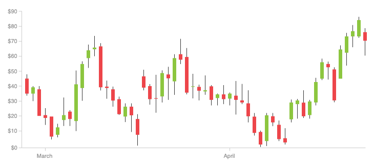
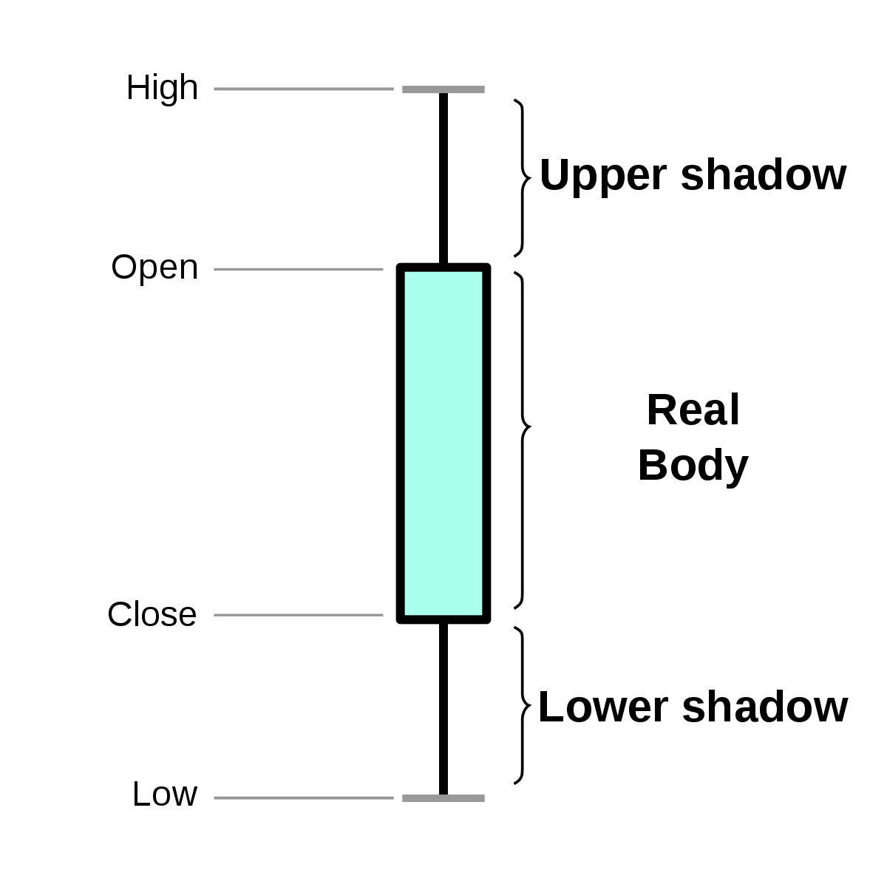
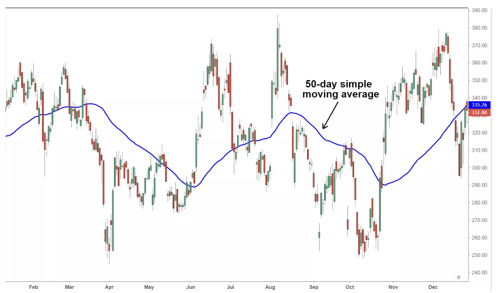
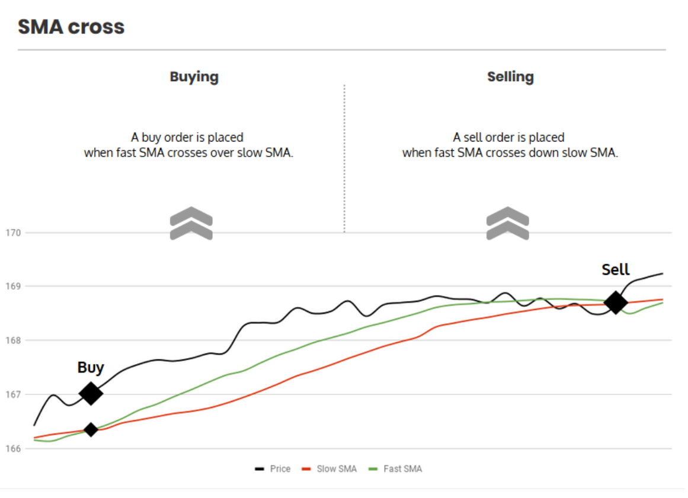

# Pandas &amp; Numpy: 策略与回测系统

大家好，我是景霄。

上节课，我们介绍了交易所的数据抓取，特别是 orderbook 和 tick 数据的抓取。今天这节课，我们考虑的是，怎么在这些历史数据上测试一个交易策略。

首先我们要明确，对于很多策略来说，我们上节课抓取的密集的 orderbook 和 tick 数据，并不能简单地直接使用。因为数据量太密集，包含了太多细节；而且长时间连接时，网络随机出现的不稳定，会导致丢失部分 tick 数据。因此，我们还需要进行合适的清洗、聚合等操作。

此外，为了进行回测，我们需要一个交易策略，还需要一个测试框架。目前已存在很多成熟的回测框架，但是为了 Python 学习，我决定带你搭建一个简单的回测框架，并且从中简单一窥 Pandas 的优势。

## OHLCV 数据

了解过一些股票交易的同学，可能知道 K 线这种东西。K 线又称“蜡烛线”，是一种反映价格走势的图线。它的特色在于，一个线段内记录了多项讯息，相当易读易懂且实用有效，因此被广泛用于股票、期货、贵金属、数字货币等行情的技术分析。下面便是一个 K 线示意图。



其中，每一个小蜡烛，都代表着当天的开盘价（Open）、最高价（High）、最低价（Low）和收盘价（Close），也就是我画的第二张图表示的这样。



类似的，除了日 K 线之外，还有周 K 线、小时 K 线、分钟 K 线等等。那么这个 K 线是怎么计算来的呢？

我们以小时 K 线图为例，还记得我们当时抓取的 tick 数据吗？也就是每一笔交易的价格和数量。那么，如果从上午 10:00 开始，我们开始积累 tick 的交易数据，以 10:00 开始的第一个交易作为 Open 数据，11:00 前的最后一笔交易作为 Close 值，并把这一个小时最低和最高的成交价格分别作为 High 和 Low 的值，我们就可以绘制出这一个小时对应的“小蜡烛”形状了。

如果再加上这一个小时总的成交量（Volumn），就得到了 OHLCV 数据。

所以，如果我们一直抓取着 tick 底层原始数据，我们就能在上层聚合出 1 分钟 K 线、小时 K 线以及日、周 k 线等等。如果你对这一部分操作有兴趣，可以把此作为今天的课后作业来实践。

接下来，我们将使用 Gemini 从 2015 年到 2019 年 7 月这个时间内，BTC 对 USD 每个小时的 OHLCV 数据，作为策略和回测的输入。你可以在<a href="https://github.com/caunion/simple_backtesting/blob/master/BTCUSD_GEMINI.csv">这里</a>下载数据。

数据下载完成后，我们可以利用 Pandas 读取，比如下面这段代码。

```python
def assert_msg(condition, msg):
    if not condition:
        raise Exception(msg)
    
def read_file(filename):
    # 获得文件绝对路径
    filepath = path.join(path.dirname(__file__), filename)
    
    # 判定文件是否存在
    assert_msg(path.exists(filepath), " 文件不存在 ")
    
    # 读取 CSV 文件并返回
    return pd.read_csv(filepath,
                       index_col=0, 
                       parse_dates=True,
                       infer_datetime_format=True)
 
BTCUSD = read_file('BTCUSD_GEMINI.csv')
assert_msg(BTCUSD.__len__() > 0, '读取失败')
print(BTCUSD.head())
 
 
########## 输出 ##########
Time                 Symbol      Open      High       Low     Close     Volume
Date                                                                          
2019-07-08 00:00:00  BTCUSD  11475.07  11540.33  11469.53  11506.43  10.770731
2019-07-07 23:00:00  BTCUSD  11423.00  11482.72  11423.00  11475.07  32.996559
2019-07-07 22:00:00  BTCUSD  11526.25  11572.74  11333.59  11423.00  48.937730
2019-07-07 21:00:00  BTCUSD  11515.80  11562.65  11478.20  11526.25  25.323908
2019-07-07 20:00:00  BTCUSD  11547.98  11624.88  11423.94  11515.80  63.211972

```

这段代码提供了两个工具函数。

- 一个是 read_file，它的作用是，用 pandas 读取 csv 文件。
- 另一个是 assert_msg，它的作用类似于 assert，如果传入的条件（contidtion）为否，就会抛出异常。不过，你需要提供一个参数，用于指定要抛出的异常信息。

## 回测框架

说完了数据，我们接着来看回测数据。常见的回测框架有两类。一类是向量化回测框架，它通常基于 Pandas+Numpy 来自己搭建计算核心；后端则是用 MySQL 或者 MongoDB 作为源。这种框架通过 Pandas+Numpy 对 OHLC 数组进行向量运算，可以在较长的历史数据上进行回测。不过，因为这类框架一般只用 OHLC，所以模拟会比较粗糙。

另一类则是事件驱动型回测框架。这类框架，本质上是针对每一个 tick 的变动或者 orderbook 的变动生成事件；然后，再把一个个事件交给策略进行执行。因此，虽然它的拓展性很强，可以允许更加灵活的策略，但回测速度是很慢的。

我们想要学习量化交易，使用大型成熟的回测框架，自然是第一选择。

- 比如 Zipline，就是一个热门的事件驱动型回测框架，背后有大型社区和文档的支持。
- PyAlgoTrade 也是事件驱动的回测框架，文档相对完整，整合了知名的技术分析（Techique Analysis）库 TA-Lib。在速度和灵活方面，它比 Zipline 强。不过，它的一大硬伤是不支持 Pandas 的模块和对象。

显然，对于我们 Python 学习者来说，第一类也就是向量型回测框架，才是最适合我们练手的项目了。那么，我们就开始吧。

首先，我先为你梳理下回测流程，也就是下面五步：

1. 读取 OHLC 数据；
2. 对 OHLC 进行指标运算；
3. 策略根据指标向量决定买卖；
4. 发给模拟的”交易所“进行交易；
5. 最后，统计结果。

对此，使用之前学到的面向对象思维方式，我们可以大致抽取三个类：

- 交易所类（ ExchangeAPI）：负责维护账户的资金和仓位，以及进行模拟的买卖；
- 策略类（Strategy）：负责根据市场信息生成指标，根据指标决定买卖；
- 回测类框架（Backtest）：包含一个策略类和一个交易所类，负责迭代地对每个数据点调用策略执行。

接下来，我们先从最外层的大框架开始。这样的好处在于，我们是从上到下、从外往内地思考，虽然还没有开始设计依赖项（Backtest 的依赖项是 ExchangeAPI 和 Strategy），但我们可以推测出它们应有的接口形式。推测接口的本质，其实就是推测程序的输入。

这也是我在一开始提到过的，对于程序这个“黑箱”，你在一开始设计的时候，就要想好输入和输出。

回到最外层 Backtest 类。我们需要知道，输出是最后的收益，那么显然，输入应该是初始输入的资金数量（cash）。

此外，为了模拟得更加真实，我们还要考虑交易所的手续费（commission）。手续费的多少取决于券商（broker）或者交易所，比如我们买卖股票的券商手续费可能是万七，那么就是 0.0007。但是在比特币交易领域，手续费通常会稍微高一点，可能是千分之二左右。当然，无论怎么多，一般也不会超过 5 %。否则我们大家交易几次就破产了，也就不会有人去交易了。

这里说一句题外话，不知道你有没有发现，无论数字货币的价格是涨还是跌，总有一方永远不亏，那就是交易所。因为只要有人交易，他们就有白花花的银子进账。

回到正题，至此，我们就确定了 Backtest 的输入和输出。

它的输入是：

- OHLC 数据；
- 初始资金；
- 手续费率；
- 交易所类；
- 策略类。

输出则是：

- 最后剩余市值。

对此，你可以参考下面这段代码：

```python
class Backtest:
    """
    Backtest 回测类，用于读取历史行情数据、执行策略、模拟交易并估计
    收益。
 
    初始化的时候调用 Backtest.run 来时回测
 
    instance, or `backtesting.backtesting.Backtest.optimize` to
    optimize it.
    """
 
    def __init__(self,
                 data: pd.DataFrame,
                 strategy_type: type(Strategy),
                 broker_type: type(ExchangeAPI),
                 cash: float = 10000,
                 commission: float = .0):
        """
        构造回测对象。需要的参数包括：历史数据，策略对象，初始资金数量，手续费率等。
        初始化过程包括检测输入类型，填充数据空值等。
 
        参数：
        :param data:            pd.DataFrame        pandas Dataframe 格式的历史 OHLCV 数据
        :param broker_type:     type(ExchangeAPI)   交易所 API 类型，负责执行买卖操作以及账户状态的维护
        :param strategy_type:   type(Strategy)      策略类型
        :param cash:            float               初始资金数量
        :param commission:       float               每次交易手续费率。如 2% 的手续费此处为 0.02
        """
 
        assert_msg(issubclass(strategy_type, Strategy), 'strategy_type 不是一个 Strategy 类型')
        assert_msg(issubclass(broker_type, ExchangeAPI), 'strategy_type 不是一个 Strategy 类型')
        assert_msg(isinstance(commission, Number), 'commission 不是浮点数值类型')
 
        data = data.copy(False)
 
        # 如果没有 Volumn 列，填充 NaN
        if 'Volume' not in data:
            data['Volume'] = np.nan
 
        # 验证 OHLC 数据格式
        assert_msg(len(data.columns &amp; {'Open', 'High', 'Low', 'Close', 'Volume'}) == 5,
                   (" 输入的`data`格式不正确，至少需要包含这些列："
                    "'Open', 'High', 'Low', 'Close'"))
 
        # 检查缺失值
        assert_msg(not data[['Open', 'High', 'Low', 'Close']].max().isnull().any(),
            ('部分 OHLC 包含缺失值，请去掉那些行或者通过差值填充. '))
 
        # 如果行情数据没有按照时间排序，重新排序一下
        if not data.index.is_monotonic_increasing:
            data = data.sort_index()
 
        # 利用数据，初始化交易所对象和策略对象。
        self._data = data  # type: pd.DataFrame
        self._broker = broker_type(data, cash, commission)
        self._strategy = strategy_type(self._broker, self._data)
        self._results = None
 
    def run(self):
        """
        运行回测，迭代历史数据，执行模拟交易并返回回测结果。
        Run the backtest. Returns `pd.Series` with results and statistics.
 
        Keyword arguments are interpreted as strategy parameters.
        """
        strategy = self._strategy
        broker = self._broker
 
        # 策略初始化
        strategy.init()
 
        # 设定回测开始和结束位置
        start = 100
        end = len(self._data)
 
        # 回测主循环，更新市场状态，然后执行策略
        for i in range(start, end):
            # 注意要先把市场状态移动到第 i 时刻，然后再执行策略。
            broker.next(i)
            strategy.next(i)
 
        # 完成策略执行之后，计算结果并返回
        self._results = self._compute_result(broker)
        return self._results
 
    def _compute_result(self, broker):
        s = pd.Series()
        s['初始市值'] = broker.initial_cash
        s['结束市值'] = broker.market_value
        s['收益'] = broker.market_value - broker.initial_cash
        return s

```

这段代码有点长，但是核心其实就两部分。

- 初始化函数（init）：传入必要参数，对 OHLC 数据进行简单清洗、排序和验证。我们从不同地方下载的数据，可能格式不一样；而排序的方式也可能是从前往后。所以，这里我们把数据统一设置为按照时间从之前往现在的排序。
- 执行函数（run）：这是回测框架的主要循环部分，核心是更新市场还有更新策略的时间。迭代完成所有的历史数据后，它会计算收益并返回。

你应该注意到了，此时，我们还没有定义策略和交易所 API 的结构。不过，通过回测的执行函数，我们可以确定这两个类的接口形式。

策略类（Strategy）的接口形式为：

- 初始化函数 init()，根据历史数据进行指标（Indicator）计算。
- 步进函数 next()，根据当前时间和指标，决定买卖操作，并发给交易所类执行。

交易所类（ExchangeAPI）的接口形式为：

- 步进函数 next()，根据当前时间，更新最新的价格；
- 买入操作 buy()，买入资产；
- 卖出操作 sell()，卖出资产。

## 交易策略

接下来我们来看交易策略。交易策略的开发是一个非常复杂的学问。为了达到学习的目的，我们来想一个简单的策略——移动均值交叉策略。

为了了解这个策略，我们先了解一下，什么叫做简单移动均值（Simple Moving Average，简称为 SMA，以下皆用 SMA 表示简单移动均值）。我们知道，N 个数的序列  x[0]、x[1] .……  x[N]  的均值，就是这 N 个数的和除以 N。

现在，我假设一个比较小的数 K，比 N 小很多。我们用一个 K 大小的滑动窗口，在原始的数组上滑动。通过对每次框住的 K 个元素求均值，我们就可以得到，原始数组的窗口大小为 K 的 SMA 了。

SMA，实质上就是对原始数组进行了一个简单平滑处理。比如，某支股票的价格波动很大，那么，我们用 SMA 平滑之后，就会得到下面这张图的效果。



你可以看出，如果窗口大小越大，那么 SMA 应该越平滑，变化越慢；反之，如果 SMA 比较小，那么短期的变化也会越快地反映在 SMA 上。

于是，我们想到，能不能对投资品的价格设置两个指标呢？这俩指标，一个是小窗口的 SMA，一个是大窗口的 SMA。

- 如果小窗口的 SMA 曲线从下面刺破或者穿过大窗口 SMA，那么说明，这个投资品的价格在短期内快速上涨，同时这个趋势很强烈，可能是一个买入的信号；
- 反之，如果大窗口的 SMA 从下方突破小窗口 SMA，那么说明，投资品的价格在短期内快速下跌，我们应该考虑卖出。

下面这幅图，就展示了这两种情况。



明白了这里的概念和原理后，接下来的操作就不难了。利用 Pandas，我们可以非常简单地计算 SMA 和 SMA 交叉。比如，你可以引入下面两个工具函数：

```python
def SMA(values, n):
    """
    返回简单滑动平均
    """
    return pd.Series(values).rolling(n).mean()
 
def crossover(series1, series2) -> bool:
    """
    检查两个序列是否在结尾交叉
    :param series1:  序列 1
    :param series2:  序列 2
    :return:         如果交叉返回 True，反之 False
    """
    return series1[-2] < series2[-2] and series1[-1] > series2[-1]

```

如代码所示，对于输入的一个数组，Pandas 的 rolling(k) 函数，可以方便地计算窗内口大小为 K 的 SMA 数组；而想要检查某个时刻两个 SMA 是否交叉，你只需要查看两个数组末尾的两个元素即可。

那么，基于此，我们就可以开发出一个简单的策略了。下面这段代码表示策略的核心思想，我做了详细的注释，你理解起来应该没有问题：

```python
    def next(self, tick):
        # 如果此时快线刚好越过慢线，买入全部
        if crossover(self.sma1[:tick], self.sma2[:tick]):
            self.buy()
 
        # 如果是慢线刚好越过快线，卖出全部
        elif crossover(self.sma2[:tick], self.sma1[:tick]):
            self.sell()
 
        # 否则，这个时刻不执行任何操作。
        else:
            pass

```

说完策略的核心思想，我们开始搭建策略类的框子。

首先，我们要考虑到，策略类 Strategy 应该是一个可以被继承的类，同时应该包含一些固定的接口。这样，回测器才能方便地调用。

于是，我们可以定义一个 Strategy 抽象类，包含两个接口方法 init 和 next，分别对应我们前面说的指标计算和步进函数。不过注意，抽象类是不能被实例化的。所以，我们必须定义一个具体的子类，同时实现了 init 和 next 方法才可以。

这个类的定义，你可以参考下面代码的实现：

```python
import abc
import numpy as np
from typing import Callable
 
class Strategy(metaclass=abc.ABCMeta):
    """
    抽象策略类，用于定义交易策略。
 
    如果要定义自己的策略类，需要继承这个基类，并实现两个抽象方法：
    Strategy.init
    Strategy.next
    """
    def __init__(self, broker, data):
        """
        构造策略对象。
 
        @params broker:  ExchangeAPI    交易 API 接口，用于模拟交易
        @params data:    list           行情数据数据
        """
        self._indicators = []
        self._broker = broker  # type: _Broker
        self._data = data  # type: _Data
        self._tick = 0
 
    def I(self, func: Callable, *args) -> np.ndarray:
        """
        计算买卖指标向量。买卖指标向量是一个数组，长度和历史数据对应；
        用于判定这个时间点上需要进行 " 买 " 还是 " 卖 "。
 
        例如计算滑动平均：
        def init():
            self.sma = self.I(utils.SMA, self.data.Close, N)
        """
        value = func(*args)
        value = np.asarray(value)
        assert_msg(value.shape[-1] == len(self._data.Close), '指示器长度必须和 data 长度相同')
 
        self._indicators.append(value)
        return value
 
    @property
    def tick(self):
        return self._tick
 
    @abc.abstractmethod
    def init(self):
        """
        初始化策略。在策略回测 / 执行过程中调用一次，用于初始化策略内部状态。
        这里也可以预计算策略的辅助参数。比如根据历史行情数据：
        计算买卖的指示器向量；
        训练模型 / 初始化模型参数
        """
        pass
 
    @abc.abstractmethod
    def next(self, tick):
        """
        步进函数，执行第 tick 步的策略。tick 代表当前的 " 时间 "。比如 data[tick] 用于访问当前的市场价格。
        """
        pass
 
    def buy(self):
        self._broker.buy()
 
    def sell(self):
        self._broker.sell()
 
    @property
    def data(self):
        return self._data

```

为了方便访问成员，我们还定义了一些 Python property。同时，我们的买卖请求是由策略类发出、由交易所 API 来执行的，所以我们的策略类里依赖于 ExchangeAPI 类。

现在，有了这个框架，我们实现移动均线交叉策略就很简单了。你只需要在 init 函数中，定义计算大小窗口 SMA 的逻辑；同时，在 next 函数中完成交叉检测和买卖调用就行了。具体实现，你可以参考下面这段代码：

```python
from utils import assert_msg, crossover, SMA
 
class SmaCross(Strategy):
    # 小窗口 SMA 的窗口大小，用于计算 SMA 快线
    fast = 10
 
    # 大窗口 SMA 的窗口大小，用于计算 SMA 慢线
    slow = 20
 
    def init(self):
        # 计算历史上每个时刻的快线和慢线
        self.sma1 = self.I(SMA, self.data.Close, self.fast)
        self.sma2 = self.I(SMA, self.data.Close, self.slow)
 
    def next(self, tick):
        # 如果此时快线刚好越过慢线，买入全部
        if crossover(self.sma1[:tick], self.sma2[:tick]):
            self.buy()
 
        # 如果是慢线刚好越过快线，卖出全部
        elif crossover(self.sma2[:tick], self.sma1[:tick]):
            self.sell()
 
        # 否则，这个时刻不执行任何操作。
        else:
            pass

```

## 模拟交易

到这里，我们的回测就只差最后一块儿了。胜利就在眼前，我们继续加油。

我们前面提到过，交易所类负责模拟交易，而模拟的基础，就是需要当前市场的价格。这里，我们可以用 OHLC 中的 Close，作为那个时刻的价格。

此外，为了简化设计，我们假设买卖操作都利用的是当前账户的所有资金、仓位，且市场容量足够大。这样，我们的下单请求就能够马上完全执行。

也别忘了手续费这个大头。考虑到有手续费的情况，此时，我们最核心的买卖函数应该怎么来写呢？

我们一起来想这个问题。假设，我们现在有 1000.0 元，此时 BTC 的价格是 100.00 元（当然没有这么好的事情啊，这里只是假设），并且交易手续费为 1%。那么，我们能买到多少 BTC 呢？

我们可以采用这种算法：

```
买到的数量 = 投入的资金 * (1.0 - 手续费) / 价格
```

那么此时，你就能收到 9.9 个 BTC。

类似的，卖出的时候结算方式如下，也不难理解：

```
卖出的收益 = 持有的数量 * 价格 *  (1.0 - 手续费)
```

所以，最终模拟交易所类的实现，你可以参考下面这段代码：

```python
from utils import read_file, assert_msg, crossover, SMA
 
class ExchangeAPI:
    def __init__(self, data, cash, commission):
        assert_msg(0 < cash, " 初始现金数量大于 0，输入的现金数量：{}".format(cash))
        assert_msg(0 <= commission <= 0.05, " 合理的手续费率一般不会超过 5%，输入的费率：{}".format(commission))
        self._inital_cash = cash
        self._data = data
        self._commission = commission
        self._position = 0
        self._cash = cash
        self._i = 0
 
    @property
    def cash(self):
        """
        :return: 返回当前账户现金数量
        """
        return self._cash
 
    @property
    def position(self):
        """
        :return: 返回当前账户仓位
        """
        return self._position
 
    @property
    def initial_cash(self):
        """
        :return: 返回初始现金数量
        """
        return self._inital_cash
 
    @property
    def market_value(self):
        """
        :return: 返回当前市值
        """
        return self._cash + self._position * self.current_price
 
    @property
    def current_price(self):
        """
        :return: 返回当前市场价格
        """
        return self._data.Close[self._i]
 
    def buy(self):
        """
        用当前账户剩余资金，按照市场价格全部买入
        """
        self._position = float(self._cash / (self.current_price * (1 + self._commission)))
        self._cash = 0.0
 
    def sell(self):
        """
        卖出当前账户剩余持仓
        """
        self._cash += float(self._position * self.current_price * (1 - self._commission))
        self._position = 0.0
 
    def next(self, tick):
        self._i = tick

```

其中的 current_price（当前价格），可以方便地获得模拟交易所当前时刻的商品价格；而 market_value，则可以获得当前总市值。在初始化函数的时候，我们检查手续费率和输入的现金数量，是不是在一个合理的范围。

有了所有的这些部分，我们就可以来模拟回测啦！

首先，我们设置初始资金量为 10000.00 美元，交易所手续费率为 0。这里你可以猜一下，如果我们从 2015 年到现在，都按照 SMA 来买卖，现在应该有多少钱呢？

```python
def main():
    BTCUSD = read_file('BTCUSD_GEMINI.csv')
    ret = Backtest(BTCUSD, SmaCross, ExchangeAPI, 10000.0, 0.00).run()
    print(ret)
 
if __name__ == '__main__':
    main()
```

铛铛铛，答案揭晓，程序将输出：

```
初始市值     10000.000000
结束市值     576361.772884
收益         566361.772884
```

哇，结束时，我们将有 57 万美元，翻了整整 57 倍啊！简直不要太爽。不过，等等，这个手续费率为 0，实在是有点碍眼，因为根本不可能啊。我们现在来设一个比较真实的值吧，大概千分之三，然后再来试试：

```
初始市值    10000.000000
结束市值     2036.562001
收益      -7963.437999
```

什么鬼？我们变成赔钱了，只剩下 2000 美元了！这是真的吗？

这是真的，也是假的。

我说的“真”是指，如果你真的用 SMA 交叉这种简单的方法去交易，那么手续费摩擦和滑点等因素，确实可能让你的高频策略赔钱。

而我说是“假”是指，这种模拟交易的方式非常粗糙。真实的市场情况，并非这么理想——比如买卖请求永远马上执行；再比如，我们在市场中进行交易的同时不会影响市场价格等，这些理想情况都是不可能的。所以，很多时候，回测永远赚钱，但实盘马上赔钱。

## 总结

这节课，我们继承上一节，介绍了回测框架的分类、数据的格式，并且带你从头开始写了一个简单的回测系统。你可以把今天的代码片段“拼”起来，这样就会得到一个简化的回测系统样例。同时，我们实现了一个简单的交易策略，并且在真实的历史数据上运行了回测结果。我们观察到，在加入手续费后，策略的收益情况发生了显著的变化。

## 思考题

最后，给你留一个思考题。之前我们介绍了如何抓取 tick 数据，你可以根据抓取的 tick 数据，生成 5 分钟、每小时和每天的 OHLCV 数据吗？欢迎在留言区写下你的答案和问题，也欢迎你把这篇文章分享出去。
