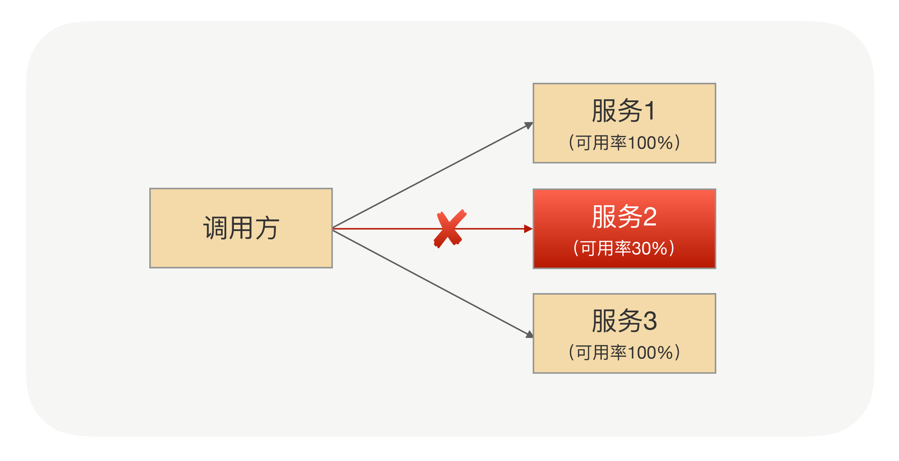

# 健康检测：这个节点都挂了，为啥还要疯狂发请求？

你好，我是何小锋。昨天我们讲了超大规模集群“服务发现”的挑战，服务发现的作用就是实时感知集群 IP 的变化，实现接口跟服务集群节点 IP 的映射。在超大规模集群实战中，我们更多需要考虑的是保证最终一致性。其实总结来说，就一关键词，你要记住“推拉结合，以拉为准”。接着昨天的内容，我们再来聊聊 RPC 中的健康检测。

因为有了集群，所以每次发请求前，RPC 框架会根据路由和负载均衡算法选择一个具体的 IP 地址。为了保证请求成功，我们就需要确保每次选择出来的 IP 对应的连接是健康的，这个逻辑你应该理解。

但你也知道，调用方跟服务集群节点之间的网络状况是瞬息万变的，两者之间可能会出现闪断或者网络设备损坏等情况，那怎么保证选择出来的连接一定是可用的呢？

从我的角度看，**终极的解决方案是让调用方实时感知到节点的状态变化**，这样他们才能做出正确的选择。这个道理像我们开车一样，车有各种各样的零件，我们不可能在开车之前先去挨个检查下他们的健康情况，转而是应该有一套反馈机制，比如今天我的大灯坏了，那中控台就可以给我提示；明天我的胎压不够了，中控台也能够收到提示。汽车中大部分关键零件的状态变化，我作为调用方，都能够第一时间了解。

那回到 RPC 框架里，我们应该怎么设计这套机制呢？你可以先停下来想想汽车的例子，看看他们是怎么做的。当然，回到我们 RPC 的框架里，这事用专业一点的词来说就是服务的健康检测。今天我们就来详细聊聊这个话题。

## 遇到的问题 

在进一步讲解服务健康检测之前，我想先和你分享一个我曾经遇到过的线上问题。

有一天，我们公司某个业务研发团队的负责人急匆匆跑过来，让我帮他解决个问题。仔细听完他的描述后，我才明白，原来是他们发现线上业务的某个接口可用性并不高，基本上十次调用里总会有几次失败。

查看了具体的监控数据之后，我们发现只有请求具体打到某台机器的时候才会有这个问题，也就是说，集群中有某台机器出了问题。于是快刀斩乱麻，我建议他们先把这台“问题机器”下线，以快速解决目前的问题。

但对于我来说，问题并没有结束，我开始进一步琢磨：“接口调用某台机器的时候已经出现不能及时响应了，那为什么 RPC 框架还会继续把请求发到这台有问题的机器上呢？RPC 框架还会把请求发到这台机器上，也就是说从调用方的角度看，它没有觉得这台服务器有问题。”

就像警察破案一样，为了进一步了解事情的真相，我查看了问题时间点的监控和日志，在案发现场发现了这样几个线索：

1. 通过日志发现请求确实会一直打到这台有问题的机器上，因为我看到日志里有很多超时的异常信息。

2. 从监控上看，这台机器还是有一些成功的请求，这说明当时调用方跟服务之间的网络连接没有断开。因为如果连接断开之后，RPC 框架会把这个节点标识为“不健康”，不会被选出来用于发业务请求。

3. 深入进去看异常日志，我发现调用方到目标机器的定时心跳会有间歇性失败。

4. 从目标机器的监控上可以看到该机器的网络指标有异常，出问题时间点 TCP 重传数比正常高 10 倍以上。

**有了对这四个线索的分析，我基本上可以得出这样的结论：**那台问题服务器在某些时间段出现了网络故障，但也还能处理部分请求。换句话说，它处于半死不活的状态。但是（是转折，也是关键点），它还没彻底“死”，还有心跳，这样，调用方就觉得它还正常，所以就没有把它及时挪出健康状态列表。

到这里，你应该也明白了，一开始，我们为了快速解决问题，手动把那台问题机器下线了。刨根问底之后，我们发现，其实更大的问题是我们的服务检测机制有问题，有的服务本来都已经病危了，但我们还以为人家只是个感冒。

接下来，我们就来看看服务检测的核心逻辑。

## 健康检测的逻辑 

刚刚我们提到了心跳机制，我估计你会想，搞什么心跳，是不是我们把问题复杂化了。当服务方下线，正常情况下我们肯定会收到连接断开的通知事件，在这个事件里面直接加处理逻辑不就可以了？是的，我们前面汽车的例子里检测都是这样做的。但咱们这里不行，因为应用健康状况不仅包括 TCP 连接状况，还包括应用本身是否存活，很多情况下 TCP 连接没有断开，但应用可能已经“僵死了”。

所以，业内常用的检测方法就是用心跳机制。心跳机制说起来也不复杂，其实就是服务调用方每隔一段时间就问一下服务提供方，“兄弟，你还好吧？”，然后服务提供方很诚实地告诉调用方它目前的状态。

结合前面的文章，你也不难想出来，服务方的状态一般会有三种情况，一个是我很好，一个是我生病了，一个是没回复。用专业的词来对应这三个状态就是：

1. 健康状态：建立连接成功，并且心跳探活也一直成功；

2. 亚健康状态：建立连接成功，但是心跳请求连续失败；

3. 死亡状态：建立连接失败。

节点的状态并不是固定不变的，它会根据心跳或者重连的结果来动态变化，具体状态间转换图如下：

这里你可以关注下几个状态之间的转换剪头，我再给你解释下。首先，一开始初始化的时候，如果建立连接成功，那就是健康状态，否则就是死亡状态。这里没有亚健康这样的中间态。紧接着，如果健康状态的节点连续出现几次不能响应心跳请求的情况，那就会被标记为亚健康状态，也就是说，服务调用方会觉得它生病了。

生病之后（亚健康状态），如果连续几次都能正常响应心跳请求，那就可以转回健康状态，证明病好了。如果病一直好不了，那就会被断定为是死亡节点，死亡之后还需要善后，比如关闭连接。

当然，死亡并不是真正死亡，它还有复活的机会。如果某个时间点里，死亡的节点能够重连成功，那它就可以重新被标记为健康状态。

这就是整个节点的状态转换思路，你不用死记，它很简单，除了不能复活，其他都和我们人的状态一样。当服务调用方通过心跳机制了解了节点的状态之后，每次发请求的时候，就可以优先从健康列表里面选择一个节点。当然，如果健康列表为空，为了提高可用性，也可以尝试从亚健康列表里面选择一个，这就是具体的策略了。

## 具体的解决方案 

理解了服务健康检测的逻辑，我们再回到开头我描述的场景里，看看怎么优化。现在你理解了，一个节点从健康状态过渡到亚健康状态的前提是“连续”心跳失败次数必须到达某一个阈值，比如 3 次（具体看你怎么配置了）。

而我们的场景里，节点的心跳日志只是间歇性失败，也就是时好时坏，这样，失败次数根本没到阈值，调用方会觉得它只是“生病”了，并且很快就好了。那怎么解决呢？我还是建议你先停下来想想。

你是不是会脱口而出，说改下配置，调低阈值呗。是的，这是最快的解决方法，但是我想说，它治标不治本。第一，像前面说的那样，调用方跟服务节点之间网络状况瞬息万变，出现网络波动的时候会导致误判。第二，在负载高情况，服务端来不及处理心跳请求，由于心跳时间很短，会导致调用方很快触发连续心跳失败而造成断开连接。

我们回到问题的本源，核心是服务节点网络有问题，心跳间歇性失败。我们现在判断节点状态只有一个维度，那就是心跳检测，那是不是可以再加上业务请求的维度呢？

起码我当时是顺着这个方向解决问题的。但紧接着，我又发现了新的麻烦：

1. 调用方每个接口的调用频次不一样，有的接口可能 1 秒内调用上百次，有的接口可能半个小时才会调用一次，所以我们不能把简单的把总失败的次数当作判断条件。

2. 服务的接口响应时间也是不一样的，有的接口可能 1ms，有的接口可能是 10s，所以我们也不能把 TPS 至来当作判断条件。

和同事讨论之后，我们找到了**可用率**这个突破口，应该相对完美了。可用率的计算方式是某一个时间窗口内接口调用成功次数的百分比（成功次数 / 总调用次数）。当可用率低于某个比例就认为这个节点存在问题，把它挪到亚健康列表，这样既考虑了高低频的调用接口，也兼顾了接口响应时间不同的问题。

## 总结 

这一讲我给你分享了 RPC 框架里面的一个核心的功能——健康检测，它能帮助我们从连接列表里面过滤掉一些存在问题的节点，避免在发请求的时候选择出有问题的节点而影响业务。但是在设计健康检测方案的时候，我们不能简单地从 TCP 连接是否健康、心跳是否正常等简单维度考虑，因为健康检测的目的就是要保证“业务无损”，所以在设计方案的时候，我们可以加入业务请求可用率因素，这样能最大化地提升 RPC 接口可用率。

正常情况下，我们大概 30S 会发一次心跳请求，这个间隔一般不会太短，如果太短会给服务节点造成很大的压力。但是如果太长的话，又不能及时摘除有问题的节点。

除了在 RPC 框架里面我们会有采用定时“健康检测”，其实在其它分布式系统设计的时候也会用到“心跳探活”机制。

比如在应用监控系统设计的时候，需要对不健康的应用实例进行报警，好让运维人员及时处理。和咱们 RPC 的例子一样，在这个场景里，你也不能简单地依赖端口的连通性来判断应用是否存活，因为在端口连通正常的情况下，应用也可能僵死了。

那有啥其他办法能处理应用僵死的情况吗？我们可以让每个应用实例提供一个“健康检测”的 URL，检测程序定时通过构造 HTTP 请求访问该 URL，然后根据响应结果来进行存活判断，这样就可以防止僵死状态的误判。你想想，这不就是咱们前面讲到的心跳机制吗？

不过，这个案例里，我还要卖个关子。**加完心跳机制，是不是就没有问题了呢？**当然不是，因为检测程序所在的机器和目标机器之间的网络可能还会出现故障，如果真出现了故障，不就会误判吗？你以为人家已经生病或者挂了，其实是心跳仪器坏了…

根据我的经验，有一个办法可以减少误判的几率，那就是把检测程序部署在多个机器里面，分布在不同的机架，甚至不同的机房。因为网络同时故障的概率非常低，所以只要任意一个检测程序实例访问目标机器正常，就可以说明该目标机器正常。

## 课后思考 

不知道看完今天的分享之后你有何感触，你在工作中会接触到健康检测的场景吗？你可以在留言区给我分享下你是怎么做的，或者给我的方案挑挑毛病，我会第一时间给你反馈。

当然，也欢迎你留言和我分享你的思考和疑惑，期待你能把今天的所学分享给身边的朋友，邀请他一同交流。我们下节课再见！

