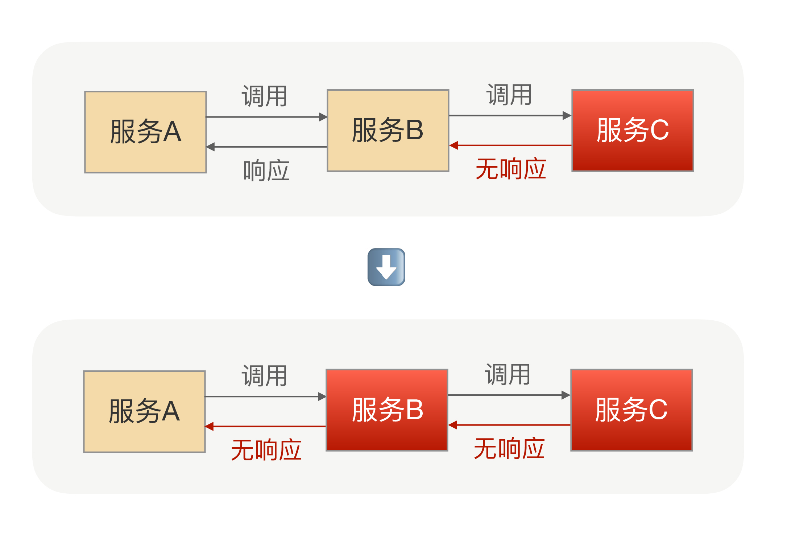
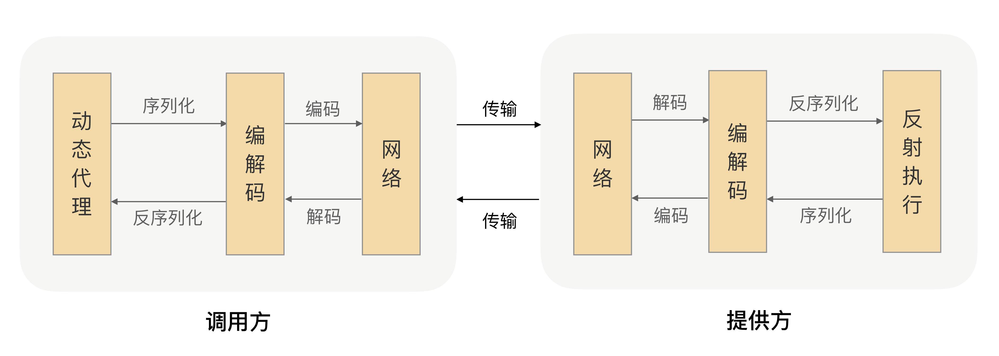

# 熔断限流：业务如何实现自我保护?

你好，我是何小锋。上一讲我讲解了 RPC 框架中的优雅启动，这块的重点就是启动预热与延迟暴露。今天，我们换一个新的话题，看看在使用 RPC 时，业务是如何实现自我保护的。

## 为什么需要自我保护？ 

我在[开篇词](开篇词)中说过，RPC 是解决分布式系统通信问题的一大利器，而分布式系统的一大特点就是高并发，所以说 RPC 也会面临高并发的场景。在这样的情况下，我们提供服务的每个服务节点就都可能由于访问量过大而引起一系列的问题，比如业务处理耗时过长、CPU 飘高、频繁 Full GC 以及服务进程直接宕机等等。但是在生产环境中，我们要保证服务的稳定性和高可用性，这时我们就需要业务进行自我保护，从而保证在高访问量、高并发的场景下，应用系统依然稳定，服务依然高可用。

**那么在使用 RPC 时，业务又如何实现自我保护呢？**

最常见的方式就是限流了，简单有效，但 RPC 框架的自我保护方式可不只有限流，并且 RPC 框架的限流方式可以是多种多样的。

我们可以将 RPC 框架拆开来分析，RPC 调用包括服务端和调用端，调用端向服务端发起调用。下面我就分享一下服务端与调用端分别是如何进行自我保护的。

## 服务端的自我保护 

我们先看服务端，举个例子，假如我们要发布一个 RPC 服务，作为服务端接收调用端发送过来的请求，这时服务端的某个节点负载压力过高了，我们该如何保护这个节点？

这个问题还是很好解决的，既然负载压力高，那就不让它再接收太多的请求就好了，等接收和处理的请求数量下来后，这个节点的负载压力自然就下来了。

那么就是限流吧？是的，在 RPC 调用中服务端的自我保护策略就是限流，那你有没有想过我们是如何实现限流的呢？是在服务端的业务逻辑中做限流吗？有没有更优雅的方式？

限流是一个比较通用的功能，我们可以在 RPC 框架中集成限流的功能，让使用方自己去配置限流阈值；我们还可以在服务端添加限流逻辑，当调用端发送请求过来时，服务端在执行业务逻辑之前先执行限流逻辑，如果发现访问量过大并且超出了限流的阈值，就让服务端直接抛回给调用端一个限流异常，否则就执行正常的业务逻辑。

**那服务端的限流逻辑又该如何实现呢？**

方式有很多，比如最简单的计数器，还有可以做到平滑限流的滑动窗口、漏斗算法以及令牌桶算法等等。其中令牌桶算法最为常用。上述这几种限流算法我就不一一讲解了，资料很多，不太清楚的话自行查阅下就可以了。

我们可以假设下这样一个场景：我发布了一个服务，提供给多个应用的调用方去调用，这时有一个应用的调用方发送过来的请求流量要比其它的应用大很多，这时我们就应该对这个应用下的调用端发送过来的请求流量进行限流。所以说我们在做限流的时候要考虑应用级别的维度，甚至是 IP 级别的维度，这样做不仅可以让我们对一个应用下的调用端发送过来的请求流量做限流，还可以对一个 IP 发送过来的请求流量做限流。

这时你可能会想，使用方该如何配置应用维度以及 IP 维度的限流呢？在代码中配置是不是不大方便？我之前说过，RPC 框架真正强大的地方在于它的治理功能，而治理功能大多都需要依赖一个注册中心或者配置中心，我们可以通过 RPC 治理的管理端进行配置，再通过注册中心或者配置中心将限流阈值的配置下发到服务提供方的每个节点上，实现动态配置。

看到这儿，你有没有发现，在服务端实现限流，配置的限流阈值是作用在每个服务节点上的。比如说我配置的阈值是每秒 1000 次请求，那么就是指一台机器每秒处理 1000 次请求；如果我的服务集群拥有 10 个服务节点，那么我提供的服务限流阈值在最理想的情况下就是每秒 10000 次。

接着看这样一个场景：我提供了一个服务，而这个服务的业务逻辑依赖的是 MySQL 数据库，由于 MySQL 数据库的性能限制，我们是需要对其进行保护。假如在 MySQL 处理业务逻辑中，SQL 语句的能力是每秒 10000 次，那么我们提供的服务处理的访问量就不能超过每秒 10000 次，而我们的服务有 10 个节点，这时我们配置的限流阈值应该是每秒 1000 次。那如果之后因为某种需求我们对这个服务扩容了呢？扩容到 20 个节点，我们是不是就要把限流阈值调整到每秒 500 次呢？这样操作每次都要自己去计算，重新配置，显然太麻烦了。

我们可以让 RPC 框架自己去计算，当注册中心或配置中心将限流阈值配置下发的时候，我们可以将总服务节点数也下发给服务节点，之后由服务节点自己计算限流阈值，这样就解决问题了吧？

解决了一部分，还有一个问题存在，那就是在实际情况下，一个服务节点所接收到的访问量并不是绝对均匀的，比如有 20 个节点，而每个节点限流的阈值是 500，其中有的节点访问量已经达到阈值了，但有的节点可能在这一秒内的访问量是 450，这时调用端发送过来的总调用量还没有达到 10000 次，但可能也会被限流，这样是不是就不精确了？那有没有比较精确的限流方式呢？

我刚才讲解的限流方式之所以不精确，是因为限流逻辑是服务集群下的每个节点独立去执行的，是一种单机的限流方式，而且每个服务节点所接收到的流量并不是绝对均匀的。

我们可以提供一个专门的限流服务，让每个节点都依赖一个限流服务，当请求流量打过来时，服务节点触发限流逻辑，调用这个限流服务来判断是否到达了限流阈值。我们甚至可以将限流逻辑放在调用端，调用端在发出请求时先触发限流逻辑，调用限流服务，如果请求量已经到达了限流阈值，请求都不需要发出去，直接返回给动态代理一个限流异常即可。

这种限流方式可以让整个服务集群的限流变得更加精确，但也由于依赖了一个限流服务，它在性能和耗时上与单机的限流方式相比是有很大劣势的。至于要选择哪种限流方式，就要结合具体的应用场景进行选择了。

## 调用端的自我保护 

刚才我讲解了服务端如何进行自我保护，最简单有效的方式就是限流。那么调用端呢？调用端是否需要自我保护呢？

举个例子，假如我要发布一个服务 B，而服务 B 又依赖服务 C，当一个服务 A 来调用服务 B 时，服务 B 的业务逻辑调用服务 C，而这时服务 C 响应超时了，由于服务 B 依赖服务 C，C 超时直接导致 B 的业务逻辑一直等待，而这个时候服务 A 在频繁地调用服务 B，服务 B 就可能会因为堆积大量的请求而导致服务宕机。

由此可见，服务 B 调用服务 C，服务 C 执行业务逻辑出现异常时，会影响到服务 B，甚至可能会引起服务 B 宕机。这还只是 A-&gt;B-&gt;C 的情况，试想一下 A-&gt;B-&gt;C-&gt;D-&gt;……呢？在整个调用链中，只要中间有一个服务出现问题，都可能会引起上游的所有服务出现一系列的问题，甚至会引起整个调用链的服务都宕机，这是非常恐怖的。

所以说，在一个服务作为调用端调用另外一个服务时，为了防止被调用的服务出现问题而影响到作为调用端的这个服务，这个服务也需要进行自我保护。**而最有效的自我保护方式就是熔断。**

我们可以先了解下熔断机制。

熔断器的工作机制主要是关闭、打开和半打开这三个状态之间的切换。在正常情况下，熔断器是关闭的；当调用端调用下游服务出现异常时，熔断器会收集异常指标信息进行计算，当达到熔断条件时熔断器打开，这时调用端再发起请求是会直接被熔断器拦截，并快速地执行失败逻辑；当熔断器打开一段时间后，会转为半打开状态，这时熔断器允许调用端发送一个请求给服务端，如果这次请求能够正常地得到服务端的响应，则将状态置为关闭状态，否则设置为打开。

了解完熔断机制，你就会发现，在业务逻辑中加入熔断器其实是不够优雅的。**那么在 RPC 框架中，我们该如何整合熔断器呢？**

熔断机制主要是保护调用端，调用端在发出请求的时候会先经过熔断器。我们可以回想下 RPC 的调用流程：

你看图的话，有没有想到在哪个步骤整合熔断器会比较合适呢？

我的建议是动态代理，因为在 RPC 调用的流程中，动态代理是 RPC 调用的第一个关口。在发出请求时先经过熔断器，如果状态是闭合则正常发出请求，如果状态是打开则执行熔断器的失败策略。

## 总结 

今天我们主要讲解了 RPC 框架是如何实现业务的自我保护。

服务端主要是通过限流来进行自我保护，我们在实现限流时要考虑到应用和 IP 级别，方便我们在服务治理的时候，对部分访问量特别大的应用进行合理的限流；服务端的限流阈值配置都是作用于单机的，而在有些场景下，例如对整个服务设置限流阈值，服务进行扩容时，限流的配置并不方便，我们可以在注册中心或配置中心下发限流阈值配置的时候，将总服务节点数也下发给服务节点，让 RPC 框架自己去计算限流阈值；我们还可以让 RPC 框架的限流模块依赖一个专门的限流服务，对服务设置限流阈值进行精准地控制，但是这种方式依赖了限流服务，相比单机的限流方式，在性能和耗时上有劣势。

调用端可以通过熔断机制进行自我保护，防止调用下游服务出现异常，或者耗时过长影响调用端的业务逻辑，RPC 框架可以在动态代理的逻辑中去整合熔断器，实现 RPC 框架的熔断功能。

## 课后思考 

在使用 RPC 的过程中业务要实现自我保护，针对这个问题你是否还有其他的解决方案？

欢迎留言分享你的思考，也欢迎你把文章分享给你的朋友，邀请他加入学习。我们下节课再见！

