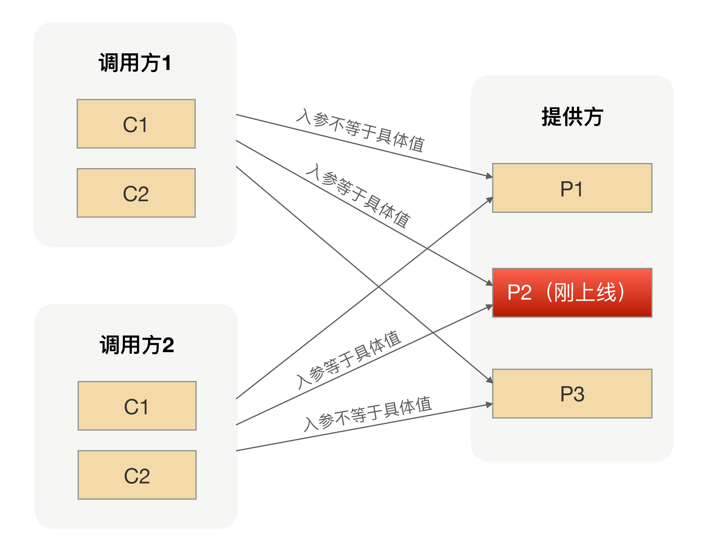

# 路由策略：怎么让请求按照设定的规则发到不同的节点上？

你好，我是何小锋。上一讲我们介绍了健康检测在 RPC 中的作用，简单来讲就是帮助调用方应用来管理所有服务提供方的连接，并动态维护每个连接的状态，方便服务调用方在每次发起请求的时候都可以拿到一个可用的连接。回顾完上一讲的重点，我们就切入今天的主题——RPC 中的路由策略。

## 为什么选择路由策略？ 

在前面我们提到过，在真实环境中我们的服务提供方是以一个集群的方式提供服务，这对于服务调用方来说，就是一个接口会有多个服务提供方同时提供服务，所以我们的 RPC 在每次发起请求的时候，都需要从多个服务提供方节点里面选择一个用于发请求的节点。

既然这些节点都可以用来完成这次请求，那么我们就可以简单地认为这些节点是同质的。这里的同质怎么理解呢？就是这次请求无论发送到集合中的哪个节点上，返回的结果都是一样的。

既然服务提供方是以集群的方式对外提供服务，那就要考虑一些实际问题。要知道我们每次上线应用的时候都不止一台服务器会运行实例，那上线就涉及到变更，只要变更就可能导致原本正常运行的程序出现异常，尤其是发生重大变动的时候，导致我们应用不稳定的因素就变得很多。

为了减少这种风险，我们一般会选择灰度发布我们的应用实例，比如我们可以先发布少量实例观察是否有异常，后续再根据观察的情况，选择发布更多实例还是回滚已经上线的实例。

但这种方式不好的一点就是，线上一旦出现问题，影响范围还是挺大的。因为对于我们的服务提供方来说，我们的服务会同时提供给很多调用方来调用，尤其是像一些基础服务的调用方会更复杂，比如商品、价格等等，一旦刚上线的实例有问题了，那将会导致所有的调用方业务都会受损。

那对于我们的 RPC 框架来说，有什么的办法可以减少上线变更导致的风险吗？这就不得不提路由在 RPC 中的应用。具体好在哪里，怎么实现，我们接着往下看。

## 如何实现路由策略？ 

可能你会说，我们可以在上线前把所有的场景都重新测试一遍啊？这也是一种方法，而且测试肯定是上线前的一个重要环节。但以我个人的经验来看，由于线上环境太复杂了，单纯从测试角度出发只能降低风险出现的概率，想要彻底验证所有场景基本是不可能的。

那如果没法 100% 规避风险，我们还能怎么办？我认为只有一条路可以尝试了，就是尽量减小上线出问题导致业务受损的范围。基于这个思路，我们是不是可以在上线完成后，先让一小部分调用方请求过来进行逻辑验证，待没问题后再接入其他调用方，从而实现流量隔离的效果。那在 RPC 框架里面我们具体该怎么实现呢？

我们在服务发现那讲讲过，在 RPC 里面服务调用方是通过服务发现的方式拿到了所有服务提供方的 IP 地址，那我们是不是就可以利用这个特点？当我们选择要灰度验证功能的时候，是不是就可以让注册中心在推送的时候区别对待，而不是一股脑的把服务提供方的 IP 地址推送到所有调用方。换句话说就是，注册中心只会把刚上线的服务 IP 地址推送到选择指定的调用方，而其他调用方是不能通过服务发现拿到这个 IP 地址的。

通过服务发现的方式来隔离调用方请求，从逻辑上来看确实可行，但注册中心在 RPC 里面的定位是用来存储数据并保证数据一致性的。如果把这种复杂的计算逻辑放到注册中心里面，当集群节点变多之后，就会导致注册中心压力很大，而且大部分情况下我们一般都是采用开源软件来搭建注册中心，要满足这种需求还需要进行二次开发。所以从实际的角度出发，通过影响服务发现来实现请求隔离并不划算。

那还有其他更合适的解决方案吗？在我给出方案前，你可以停下来思考下你的解决方案。

我们可以重新回到调用方发起 RPC 调用的流程。在 RPC 发起真实请求的时候，有一个步骤就是从服务提供方节点集合里面选择一个合适的节点（就是我们常说的负载均衡），那我们是不是可以在选择节点前加上“筛选逻辑”，把符合我们要求的节点筛选出来。那这个筛选的规则是什么呢？就是我们前面说的灰度过程中要验证的规则。

举个具体例子你可能就明白了，比如我们要求新上线的节点只允许某个 IP 可以调用，那我们的注册中心会把这条规则下发到服务调用方。在调用方收到规则后，在选择具体要发请求的节点前，会先通过筛选规则过滤节点集合，按照这个例子的逻辑，最后会过滤出一个节点，这个节点就是我们刚才新上线的节点。通过这样的改造，RPC 调用流程就变成了这样：

这个筛选过程在我们的 RPC 里面有一个专业名词，就是“路由策略”，而上面例子里面的路由策略是我们常见的 IP 路由策略，用于限制可以调用服务提供方的 IP。使用了 IP 路由策略后，整个集群的调用拓扑如下图所示：

## 参数路由 

有了 IP 路由之后，上线过程中我们就可以做到只让部分调用方请求调用到新上线的实例，相对传统的灰度发布功能来说，这样做我们可以把试错成本降到最低。

但在有些场景下，我们可能还需要更细粒度的路由方式。比如，在升级改造应用的时候，为了保证调用方能平滑地切调用我们的新应用逻辑，在升级过程中我们常用的方式是让新老应用并行运行一段时间，然后通过切流量百分比的方式，慢慢增大新应用承接的流量，直到新应用承担了 100% 且运行一段时间后才能去下线老应用。

在流量切换的过程中，为了保证整个流程的完整性，我们必须保证某个主题对象的所有请求都使用同一种应用来承接。假设我们改造的是商品应用，那主题对象肯定是商品 ID，在切流量的过程中，我们必须保证某个商品的所有操作都是用新应用（或者老应用）来完成所有请求的响应。

很显然，上面的 IP 路由并不能满足我们这个需求，因为 IP 路由只是限制调用方来源，并不会根据请求参数请求到我们预设的服务提供方节点上去。

那我们怎么利用路由策略实现这个需求呢？其实你只要明白路由策略的本质，就不难明白这种参数路由的实现。

我们可以给所有的服务提供方节点都打上标签，用来区分新老应用节点。在服务调用方发生请求的时候，我们可以很容易地拿到请求参数，也就是我们例子中的商品 ID，我们可以根据注册中心下发的规则来判断当前商品 ID 的请求是过滤掉新应用还是老应用的节点。因为规则对所有的调用方都是一样的，从而保证对应同一个商品 ID 的请求要么是新应用的节点，要么是老应用的节点。使用了参数路由策略后，整个集群的调用拓扑如下图所示：

相比 IP 路由，参数路由支持的灰度粒度更小，他为服务提供方应用提供了另外一个服务治理的手段。灰度发布功能是 RPC 路由功能的一个典型应用场景，通过 RPC 路由策略的组合使用可以让服务提供方更加灵活地管理、调用自己的流量，进一步降低上线可能导致的风险。

## 总结 

在日常工作中，我们几乎每天都在做线上变更，每次变更都有可能带来一次事故，为了降低事故发生的概率，我们不光要从流程上优化操作步骤，还要使我们的基础设施能支持更低的试错成本。

灰度发布功能作为 RPC 路由功能的一个典型应用场景，我们可以通过路由功能完成像定点调用、黑白名单等一些高级服务治理功能。在 RPC 里面，不管是哪种路由策略，其核心思想都是一样的，就是让请求按照我们设定的规则发送到目标节点上，从而实现流量隔离的效果。

## 课后思考 

你在使用 RPC 的过程中，除了用路由策略实现过灰度发布、定点调用等功能，还用它完成过其他功能吗？

欢迎留言和我分享你的思考，也欢迎你把文章分享给你的朋友，邀请他加入学习。我们下节课再见！

