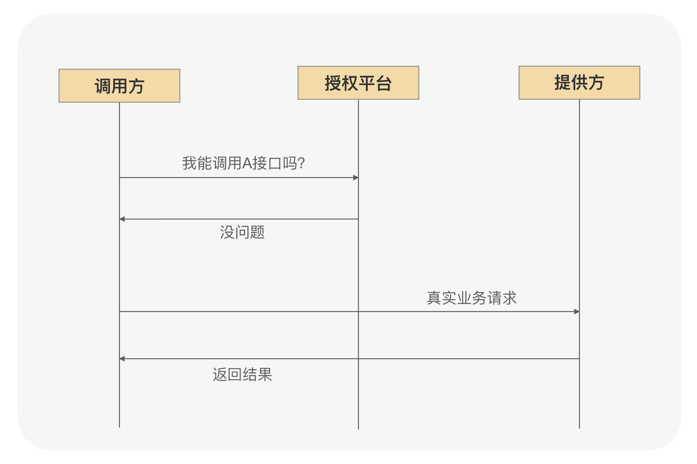

# 安全体系：如何建立可靠的安全体系？

你好，我是何小锋。上一讲我们学习了在 RPC 里面该如何提升单机资源的利用率，你要记住的关键点就一个，那就是“异步化”。调用方利用异步化机制实现并行调用多个服务，以缩短整个调用时间；而服务提供方则可以利用异步化把业务逻辑放到自定义线程池里面去执行，以提升单机的 OPS。

回顾完上一讲的重点，我们就切入今天的主题，一起来看看 RPC 里面的安全问题。

## 为什么需要考虑安全问题？ 

说起安全问题，你可能会想到像 SQL 注入、XSS 攻击等恶意攻击行为，还有就是相对更广义的安全，像网络安全、信息安全等，那在 RPC 里面我们说的安全一般指什么呢？

我们知道 RPC 是解决应用间互相通信的框架，而应用之间的远程调用过程一般不会暴露在公网，换句话讲就是说 RPC 一般用于解决内部应用之间的通信，而这个“内部”是指应用都部署在同一个大局域网内。相对于公网环境，局域网的隔离性更好，也就相对更安全，所以在 RPC 里面我们很少考虑像数据包篡改、请求伪造等恶意行为。

**那在 RPC 里面我们应该关心什么样的安全问题呢？**要搞清楚这个问题，我们可以先看一个完整的 RPC 应用流程。

我们一般是先由服务提供方定义好一个接口，并把这个接口的 Jar 包发布到私服上去，然后在项目中去实现这个接口，最后通过 RPC 提供的 API 把这个接口和其对应的实现类完成对外暴露，如果是 Spring 应用的话直接定义成一个 Bean 就好了。到这儿，服务提供方就完成了一个接口的对外发布了。

对于服务调用方来说就更简单了，只要拿到刚才上传到私服上的 Jar 的坐标，就可以把发布到私服的 Jar 引入到项目中来，然后借助 RPC 提供的动态代理功能，服务调用方直接就可以在项目完成 RPC 调用了。

这里面其实存在一个安全隐患问题，因为私服上所有的 Jar 坐标我们所有人都可以看到，只要拿到了 Jar 的坐标，我们就可以把发布到私服的 Jar 引入到项目中完成 RPC 调用了吗？

理论上确实是这样，当然我相信在公司内部这种不向服务提供方咨询就直接调用的行为很少发生，而且一般真实业务的接口出入参数都不会太简单，这样不经过咨询只靠调用方自己猜测完成调用的工作效率实在太低了。

虽然这种靠猜测调用的概率很小，但是当调用方在其它新业务场景里面要用之前项目中使用过的接口，就很有可能真的不跟服务提供方打招呼就直接调用了。这种行为对于服务提供方来说就很危险了，因为接入了新的调用方就意味着承担的调用量会变大，有时候很有可能新增加的调用量会成为压倒服务提供方的“最后一根稻草”，从而导致服务提供方无法正常提供服务，关键是服务提供方还不知道是被谁给压倒的。

当然你可能会说，这是一个流程问题，我们只要在公司内部规范好调用流程，就可以避免这种问题发生了。

确实是这样，我们可以通过流程宣贯让我们所有的研发人员达成一个“君子约定”，就是在应用里面每次要用一个接口的时候必须先向服务提供方进行报备，这样确实能在很大程度上避免这种情况的发生。但就 RPC 本身来说，我们是不是可以提供某种功能来解决这种问题呢？毕竟对于人数众多的团队来说，光靠口头约定的流程并不能彻底杜绝这类问题，依然存在隐患，且不可控。

## 调用方之间的安全保证 

那在 RPC 里面，我们该怎么解决这种问题呢？

我们先总结下刚才的问题，根本原因就是服务提供方收到请求后，不知道这次请求是哪个调用方发起的，没法判断这次请求是属于之前打过招呼的调用方还是没有打过招呼的调用方，所以也就没法选择拒绝这次请求还是继续执行。

问题说明白了就好解决了，我们只需要给每个调用方设定一个唯一的身份，每个调用方在调用之前都先来服务提供方这登记下身份，只有登记过的调用方才能继续放行，没有登记过的调用方一律拒绝。

这就好比我们平时坐火车，我们拿着身份证去购买火车票，买票成功就类似服务调用方去服务提供方这儿进行登记。当你进站准备上火车的时候，你必须同时出示你的身份证和火车票，这两个就是代表你能上这趟火车的“唯一身份”，只有验证了身份，负责检票的工作人员才会让你上车，否则会直接拒绝你乘车。

**现在方案有了，那在 RPC 里面我们该怎么实现呢？**

首先我们要有一个可以供调用方进行调用接口登记的地方，我们姑且称这个地方为“授权平台”，调用方可以在授权平台上申请自己应用里面要调用的接口，而服务提供方则可以在授权平台上进行审批，只有服务提供方审批后调用方才能调用。但这只是解决了调用数据收集的问题，并没有完成真正的授权认证功能，缺少一个检票的环节。

既然有了刚搭建的授权平台，而且接口的授权数据也在这个平台上，我们自然就很容易想到是不是可以把这个检票的环节放到这个授权平台上呢？调用方每次发起业务请求的时候先去发一条认证请求到授权平台上，就说：“哥们儿，我能调用这个接口吗？”只有授权平台返回“没问题”后才继续把业务请求发送到服务提供方那去。整个流程如下图所示：

从使用功能的角度来说，目前这种设计是没有问题的，而且整个认证过程对 RPC 使用者来说也是透明的。但有一个问题就是这个授权平台承担了公司内所有 RPC 请求的次数总和，当公司内部 RPC 使用程度高了之后，这个授权平台就会成为一个瓶颈点，而且必须保证超高可用，一旦这个授权平台出现问题，影响的可就是全公司的 RPC 请求了。

可能你会说我们可以改进下，我们是不是不需要把这个认证的逻辑放到业务请求过程中，而是可以把这个认证过程挪到初始化过程中呢？这样确实可以在很大程度上减少授权平台的压力，但本质并没有发生变化，还是一个集中式的授权平台。

**我们可以想一个更优雅一点的方案。**

其实调用方能不能调用相关接口，是由服务提供方说了算，我服务提供方认为你是可以的，你就肯定能调，那我们是不是就可以把这个检票过程放到服务提供方里面呢？在调用方启动初始化接口的时候，带上授权平台上颁发的身份去服务提供方认证下，当认证通过后就认为这个接口可以调用。

现在新的问题又来了，服务提供方验票的时候对照的数据来自哪儿，我总不能又去请求授权平台吧？否则就又会遇到和前面方案一样的问题。

你还记得我们加密算法里面有一种叫做不可逆加密算法吗？HMAC 就是其中一种具体实现。服务提供方应用里面放一个用于 HMAC 签名的私钥，在授权平台上用这个私钥为申请调用的调用方应用进行签名，这个签名生成的串就变成了调用方唯一的身份。服务提供方在收到调用方的授权请求之后，我们只要需要验证下这个签名跟调用方应用信息是否对应得上就行了，这样集中式授权的瓶颈也就不存在了。

## 服务发现也有安全问题？ 

好，现在我们已经解决了调用方之间的安全认证问题。那在 RPC 里面，我们还有其它的安全问题吗？

回到我们上面说的那个完整的 RPC 应用流程里面，服务提供方会把接口 Jar 发布到私服上，以方便调用方能引入到项目中快速完成 RPC 调用，那有没有可能有人拿到你这个 Jar 后，发布出来一个服务提供方呢？这样的后果就是导致调用方通过服务发现拿到的服务提供方 IP 地址集合里面会有那个伪造的提供方。

当然，这种情况相对上面说的调用方未经过咨询就直接调用的概率会小很多，但为了让我们的系统整体更安全，我们也需要在 RPC 里面考虑这种情况。要解决这个问题的根本就是需要把接口跟应用绑定上，一个接口只允许有一个应用发布提供者，避免其它应用也能发布这个接口。

那怎么实现呢？在[[第 08 讲]]([第 08 讲]) 我们提到过，服务提供方启动的时候，需要把接口实例在注册中心进行注册登记。我们就可以利用这个流程，注册中心可以在收到服务提供方注册请求的时候，验证下请求过来的应用是否跟接口绑定的应用一样，只有相同才允许注册，否则就返回错误信息给启动的应用，从而避免假冒的服务提供者对外提供错误服务。

## 总结 

安全问题在任何一个领域都很重要，但又经常被我们忽视，只有每次出安全事故后，我们才会意识到安全防护的重要性。所以在日常写代码的过程中，我们一定要保持一个严谨的态度，防止细小错误引入线上安全问题。

虽然 RPC 经常用于解决内网应用之间的调用，内网环境相对公网也没有那么恶劣，但我们也有必要去建立一套可控的安全体系，去防止一些错误行为。对于 RPC 来说，我们所关心的安全问题不会有公网应用那么复杂，我们只要保证让服务调用方能拿到真实的服务提供方 IP 地址集合，且服务提供方可以管控调用自己的应用就够了。

## 课后思考 

前面讲的调用方之间的安全问题，我们更多只是解决认证问题，并没有解决权限问题。在现实开发过程中，一个 RPC 接口定义里面一般会包含多个方法，但我们目前只是解决了你能不能调用接口的问题，并没有解决你能调用我接口里面的哪些方法。像这种问题，你有什么好方案吗？

欢迎留言和我分享你的答案，也欢迎你把文章分享给你的朋友，邀请他加入学习。我们下节课再见！

