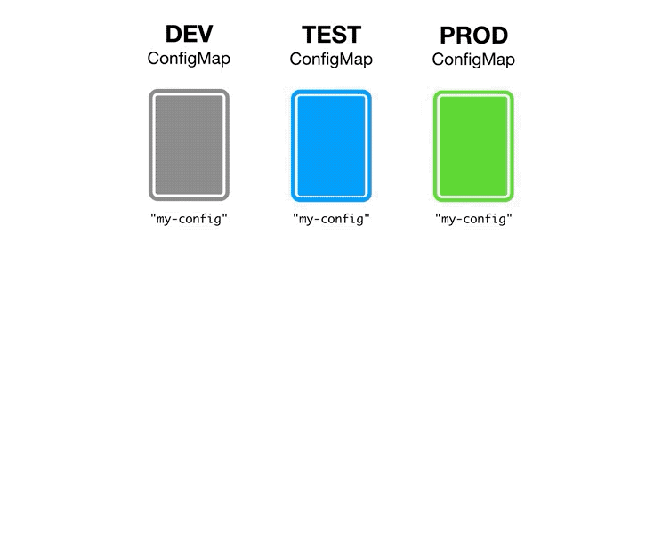

# Kubernetes 进阶：部署高可用的业务

## 无状态应用：剖析 Kubernetes 业务副本及水平扩展底层原理

每一个 Pod 都是应用的一个实例，但是通常来说你不会直接在 Kubernetes 中创建和运行单个 Pod。因为 Pod 的生命周期是短暂的，即“用后即焚”。理解这一点很重要，这也是“不可变基础设施”这一理念在 Kubernetes 中的最佳实践。同样，对于你后续进行业务改造和容器化上云也具有指导意义。

当一个 Pod 被创建出来，不管是由你直接创建，还是由其他工作负载控制器（Workload Controller）自动创建，经过调度器调度以后，就永久地“长”在某个节点上了，直到该 Pod 被删除，或者因为资源不够被驱逐，抑或由于对应的节点故障导致宕机等。因此单独地用一个 Pod 来承载业务，是没办法保证高可用、可伸缩、负载均衡等要求，而且 Pod 也无法“自愈”。

这时我们就需要在 Pod 之上做一层抽象，通过多个副本（Replica）来保证可用 Pod 的数量，避免业务不可用。在介绍 Kubernetes 中对这种抽象的实现之前，我们先来看看应用的业务类型。

### 有状态服务 VS 无状态服务

一般来说，业务的服务类型可分为无状态服务和有状态服务。举个简单的例子，像打网络游戏这类的服务，就是有状态服务，而正常浏览网页这类服务一般都是无状态服务。其实判断两种请求的关键在于，两个来自相同发起者的请求在服务器端是否具备上下文关系。

- 如果是有状态服务，其请求是状态化的，服务器端需要保存请求的相关信息，这样每个请求都可以默认地使用之前的请求上下文。

- 而无状态服务就不需要这样，每次请求都包含了需要的所有信息，每次请求都和之前的没有任何关系。

有状态服务和无状态服务分别有各自擅长的业务类型和技术优势，在 Kubernetes 中，分别有不同的工作负载控制器来负责承载这两类服务。

本节课，我们先介绍 Kubernetes 中的无状态工作负载。

### Kubernetes 中的无状态工作负载

Kubernetes 中各个对象的 metadata 字段都有 [label](https://kubernetes.io/zh/docs/concepts/overview/working-with-objects/labels/)（标签）和 [annotation](https://kubernetes.io/zh/docs/concepts/overview/working-with-objects/annotations/)（注解） 两个对象，可以用来标识一些元数据信息。不论是 label 还是 annotation，都是一组键值对，键值不允许相同。关于各个对象的 API 基本构成，可以参照此前中 API 的定义说明，Kubernetes 的各个对象的 API 都符合这个规范。

annotation 主要用来记录一些非识别的信息，并不用于标识和选择对象。

label 主要用来标识一些有意义且和对象密切相关的信息，用来支持labelSelector（标签选择器）以及一些查询操作，还有选择对象。

为了让这种抽象的对象可以跟 Pod 关联起来，Kubernetes 使用了labelSelector来跟 label 进行选择匹配，从而达到这种松耦合的关联效果。

```shell
$ kubectl get pod -l label1=value1,label2=value2 -n my-namespace
```

比如，我们就可以通过上述命令，查询出 my-namespace 这个命名空间下面，带有标签label1=value1和label2=value2的 pod。label 中的键值对在匹配的时候是“且”的关系。

### ReplicationController

Kubernetes 中有一系列的工作负载可以用来部署无状态服务。在最初，Kubernetes 中使用了ReplicationController来做 Pod 的副本控制，即确保该服务的 Pod 数量维持在特定的数量。为了简洁并便于使用，ReplicationController通常缩写为“rc”，并作为 kubectl 命令的快捷方式，例如：

```shell
$ kubectl get rc -n my-namespace
```

如果副本数少于预定的值，则创建新的 Pod。如果副本数大于预定的值，就删除多余的副本。因此即使你的业务应用只需要一个 Pod，你也可以使用 rc 来自动帮你维护和创建 Pod。

### ReplicaSet

随后社区开发了下一代的 Pod 控制器 ReplicaSet（可简写为 rs） 用来替代 ReplicaController。虽然 ReplicaController 目前依然可以使用，但是社区已经不推荐继续使用了。这两者的功能和目的完全相同，但是 ReplicaSet 具备更强大的[基于集合的标签选择器](https://kubernetes.io/zh/docs/concepts/overview/working-with-objects/labels/#基于集合-的需求)，这样你可以通过一组值来进行标签匹配选择。目前支持三种操作符：`in`、`notin`和`exists`。

例如，你可以用`environment in (production, qa)`来匹配 label 中带有`environment=production`或`environment=qa`的 Pod。

同样你也可以使用`tier notin (frontend,backend)`来匹配 label 中不带有`tier=frontend`或`tier=backend`的 Pod。

或者你可以用 partition来匹配 label 中带有 partition 这个 key 的 Pod。

了解了标签选择器，我们就可以通过如下的 kubectl 命令查找 Pod：

```shell
kubectl get pods -l environment=production,tier=frontend
```

或者使用：

```shell
kubectl get pods -l 'environment in (production),tier in (frontend)'
```

虽然 Replicaset 可以独立使用，但是为了能够更好地协调 Pod 的创建、删除以及更新等操作，我们都是直接**使用更高级的 Deployment**来管理 Replicaset，社区也是一直这么定位和推荐的。比如一些业务升级的场景，使用单一的 ReplicaController 或者 Replicaset 是无法实现滚动升级的诉求，至少需要定义两个该对象才能实现，而且这两个对象使用的标签选择器中的 label 至少要有一个不相同。通过不断地对这两个对象的副本进行增减，也可以称为**调和**（Reconcile），才可以完成滚动升级。这样使用起来不方便，也增加了用户的使用门槛，极大地降低了业务发布的效率。

### Deployment

通过 Deployment，我们就不需要再关心和操作 ReplicaSet 了。


Deployment、ReplicaSet 和 Pod 这三者之间的关系见上图。通过 Deployment，我们可以管理多个 label 各不相同的 ReplicaSet，每个 ReplicaSet 负责保证对应数目的 Pod 在运行。

我们来看一个定义 Deployment 的例子：

```yaml
apiVersion: apps/v1

kind: Deployment

metadata:

  name: nginx-deployment-demo

  namespace: demo

  labels:

    app: nginx

spec:

  replicas: 3

  selector:

    matchLabels:

      app: nginx

  template:

    metadata:

      labels:

        app: nginx

        version: v1

    spec:

      containers:

      - name: nginx

        image: nginx:1.14.2

        ports:

        - containerPort: 80
```

我们这里定义了副本数`spec.replicas`为 3，同时在`spec.selector.matchLabels`中设置了`app=nginx`的 label，用于匹配`spec.template.metadata.labels`的 label。我们还增加了`version=v1`的 label 用于后续滚动升级做比较。

我们将上述内容保存到`deploy-demo.yaml`文件中。

注意，`spec.selector.matchLabels`中写的 label 一定要能匹配得了`spec.template.metadata.labels`中的 label。否则该 Deployment 无法关联创建出来的 ReplicaSet。

然后我们通过下面这些命令，便可以在命名空间 demo 中创建名为 nginx-deployment-demo 的 Deployment。

```shell
$ kubectl create ns demo
$ kubectl create -f deploy-demo.yaml
deployment.apps/nginx-deployment-demo created
```

创建完成后，我们可以查看自动创建出来的 rs。

```shell
$ kubectl get rs -n demo
NAME                               DESIRED   CURRENT   READY   AGE
nginx-deployment-demo-5d65f98bd9   3         3         0       5s
```

接下来，我们可以通过如下的几个命令不断地查询系统，看看对应的 Pod 是否运行成功。

```shell
$ kubectl get pod -n demo -l app=nginx,version=v1
NAME                                     READY   STATUS              RESTARTS   AGE
nginx-deployment-demo-5d65f98bd9-7w5gp   0/1     ContainerCreating   0          30s
nginx-deployment-demo-5d65f98bd9-d78fx   0/1     ContainerCreating   0          30s
nginx-deployment-demo-5d65f98bd9-ssstk   0/1     ContainerCreating   0          30s
$ kubectl get pod -n demo -l app=nginx,version=v1
NAME                                     READY   STATUS    RESTARTS   AGE
nginx-deployment-demo-5d65f98bd9-7w5gp   1/1     Running   0          63s
nginx-deployment-demo-5d65f98bd9-d78fx   1/1     Running   0          63s
nginx-deployment-demo-5d65f98bd9-ssstk   1/1     Running   0          63s
```

我们可以看到，从 Deployment 到这里，最后的 Pod 已经创建成功了。

现在我们试着做下镜像更新看看。更改`spec.template.metadata.labels`中的`version=v1`为`version=v2`，同时更新镜像`nginx:1.14.2`为`nginx:1.19.2`。

你可以直接通过下述命令来直接更改：

```shell
kubectl edit deploy nginx-deployment-demo -n demo 
```

也可以更改`deploy-demo.yaml`这个文件：

```yaml
apiVersion: apps/v1
kind: Deployment
metadata:
  name: nginx-deployment-demo
  namespace: demo
  labels:
    app: nginx
spec:
  replicas: 3
  selector:
    matchLabels:
      app: nginx
  template:
    metadata:
      labels:
        app: nginx
        version: v2
    spec:
      containers:
      - name: nginx
        image: nginx:1.19.2
        ports:
        - containerPort: 80
```

然后运行这些命令：

```shell
$ kubectl apply -f deploy-demo.yaml
Warning: kubectl apply should be used on resource created by either kubectl create --save-config or kubectl apply
deployment.apps/nginx-deployment-demo configured
```

这个时候，我们来看看 ReplicaSet 有什么变化：

```shell
$ kubectl get rs -n demo
NAME                               DESIRED   CURRENT   READY   AGE
nginx-deployment-demo-5d65f98bd9   3         3         3       4m10s
nginx-deployment-demo-7594578db7   1         1         0       3s
```

可以看到，这个时候自动创建了一个新的 rs 出来：`nginx-deployment-demo-7594578db7`。一般 Deployment 的默认更新策略是 RollingUpdate，即先创建一个新的 Pod，并待其成功运行以后，再删除旧的。

还有一个更新策略是Recreate，即先删除现有的 Pod，再创建新的。关于 Deployment，我们还可以设置最大不可用（`maxUnavailable`）和最大增量（`maxSurge`），来更精确地控制滚动更新操作，具体配置可参照[这个文档](https://kubernetes.io/zh/docs/concepts/workloads/controllers/deployment/#滚动更新-deployment)。

我建议你使用默认的策略来保证可用性。后面 Deployment 控制器会不断对这两个 rs 进行调和，直到新的 rs 副本数为 3，老的 rs 副本数为 0。

我们可以通过如下命令，能够观察到 Deployment 的调和过程。

```shell
$ kubectl get pod -n demo -l app=nginx,version=v1
NAME                                     READY   STATUS    RESTARTS   AGE
nginx-deployment-demo-5d65f98bd9-7w5gp   1/1     Running   0          4m15s
nginx-deployment-demo-5d65f98bd9-d78fx   1/1     Running   0          4m15s
nginx-deployment-demo-5d65f98bd9-ssstk   1/1     Running   0          4m15s
$ kubectl get pod -n demo -l app=nginx
NAME                                     READY   STATUS              RESTARTS   AGE
nginx-deployment-demo-5d65f98bd9-7w5gp   1/1     Running             0          4m22s
nginx-deployment-demo-5d65f98bd9-d78fx   1/1     Running             0          4m22s
nginx-deployment-demo-5d65f98bd9-ssstk   1/1     Running             0          4m22s
nginx-deployment-demo-7594578db7-zk8jq   0/1     ContainerCreating   0          15s
$ kubectl get pod -n demo -l app=nginx,version=v2
NAME                                     READY   STATUS              RESTARTS   AGE
nginx-deployment-demo-7594578db7-zk8jq   0/1     ContainerCreating   0          19s
$ kubectl get pod -n demo -l app=nginx,version=v2
NAME                                     READY   STATUS              RESTARTS   AGE
nginx-deployment-demo-7594578db7-4g4fk   0/1     ContainerCreating   0          1s
nginx-deployment-demo-7594578db7-zk8jq   1/1     Running             0          31s
$ kubectl get pod -n demo -l app=nginx,version=v1
NAME                                     READY   STATUS        RESTARTS   AGE
nginx-deployment-demo-5d65f98bd9-7w5gp   1/1     Running       0          4m40s
nginx-deployment-demo-5d65f98bd9-d78fx   1/1     Running       0          4m40s
nginx-deployment-demo-5d65f98bd9-ssstk   1/1     Terminating   0          4m40s
$ kubectl get pod -n demo -l app=nginx,version=v2
NAME                                     READY   STATUS              RESTARTS   AGE
nginx-deployment-demo-7594578db7-4g4fk   1/1     Running             0          5s
nginx-deployment-demo-7594578db7-ftzmf   0/1     ContainerCreating   0          2s
nginx-deployment-demo-7594578db7-zk8jq   1/1     Running             0          35s
$ kubectl get pod -n demo -l app=nginx,version=v1
NAME                                     READY   STATUS        RESTARTS   AGE
nginx-deployment-demo-5d65f98bd9-7w5gp   0/1     Terminating   0          4m52s
nginx-deployment-demo-5d65f98bd9-ssstk   0/1     Terminating   0          4m52s
$ kubectl get pod -n demo -l app=nginx,version=v2
NAME                                     READY   STATUS    RESTARTS   AGE
nginx-deployment-demo-7594578db7-4g4fk   1/1     Running   0          17s
nginx-deployment-demo-7594578db7-ftzmf   1/1     Running   0          14s
nginx-deployment-demo-7594578db7-zk8jq   1/1     Running   0          47s
$ kubectl get rs -n demo
NAME                               DESIRED   CURRENT   READY   AGE
nginx-deployment-demo-5d65f98bd9   0         0         0       5m5s
nginx-deployment-demo-7594578db7   3         3         3       58s
$ kubectl get pod -n demo -l app=nginx,version=v1
No resources found in demo namespace.
```

或者可以通过 kubectl 的 watch 功能：

```shell
$ kubectl get pod -n demo -l app=nginx -w
```

至此，我们完成了 Deployment 的升级过程。

## 有状态应用：Kubernetes 如何通过 StatefulSet 支持有状态应用？

我们来一起看看Kubernetes 中的另外一种工作负载 StatefulSet。从名字就可以看出，这个工作负载主要用于有状态的服务发布。关于有状态服务和无状态服务，你可以参考上一节课的内容。

这节课，我们从一个具体的例子来逐渐了解、认识 StatefulSet。在 kubectl 命令行中，我们一般将 StatefulSet 简写为 sts。在部署一个 StatefulSet 的时候，有个前置依赖对象，即 Service（服务）。这个对象在 StatefulSet 中的作用，我们在下文中会一一道来。另外，关于这个对象的详细介绍和其他作用，我们会在后面的课程中单独讲解。在此，你可以先暂时略过对 Service 的感知。我们先看如下一个 Service：

```yaml
$ cat nginx-svc.yaml

apiVersion: v1

kind: Service

metadata:

  name: nginx-demo

  namespace: demo

  labels:

    app: nginx

spec:

  clusterIP: None

  ports:

  - port: 80

    name: web

  selector:

    app: nginx

```

上面这段 yaml 的意思是，在 demo 这个命名空间中，创建一个名为 nginx-demo 的服务，这个服务暴露了 80 端口，可以访问带有`app=nginx`这个 label 的 Pod。

我们现在利用上面这段 yaml 在集群中创建出一个 Service：

```shell
$ kubectl create ns demo
$ kubectl create -f nginx-svc.yaml
service/nginx-demo created
$ kubectl get svc -n demo
NAME         TYPE        CLUSTER-IP       EXTERNAL-IP   PORT(S)   AGE
nginx-demo   ClusterIP   None             <none>        80/TCP    5s
```

创建好了这个前置依赖的 Service，下面我们就可以开始创建真正的 StatefulSet 对象，可参照如下的 yaml 文件：

```shell
$ cat web-sts.yaml
apiVersion: apps/v1
kind: StatefulSet
metadata:
  name: web-demo
  namespace: demo
spec:
  serviceName: "nginx-demo"
  replicas: 2
  selector:
    matchLabels:
      app: nginx
  template:
    metadata:
      labels:
        app: nginx
    spec:
      containers:
      - name: nginx
        image: nginx:1.19.2-alpine
        ports:
        - containerPort: 80
          name: web
$ kubectl create -f web-sts.yaml
$ kubectl get sts -n demo
NAME       READY   AGE
web-demo   0/2     9s
```

可以看到，到这里我已经将名为web-demo的StatefulSet部署完成了。

下面我们来一点点探索 StatefulSet 的秘密，看看它有哪些特性，为何可以保障服务有状态的运行。

### StatefulSet 的特性

通过 kubectl 的**watch**功能（命令行加参数`-w`），我们可以观察到 Pod 状态的一步步变化。

```shell
$ kubectl get pod -n demo -w
NAME         READY   STATUS              RESTARTS   AGE
web-demo-0   0/1     ContainerCreating   0          18s
web-demo-0   1/1     Running             0          20s
web-demo-1   0/1     Pending             0          0s
web-demo-1   0/1     Pending             0          0s
web-demo-1   0/1     ContainerCreating   0          0s
web-demo-1   1/1     Running             0          2s
```

**通过 StatefulSet 创建出来的 Pod 名字有一定的规律**，即`$(statefulset名称)-$(序号)`，比如这个例子中的web-demo-0、web-demo-1。

这里面还有个有意思的点，web-demo-0 这个 Pod 比 web-demo-1 优先创建，而且在 web-demo-0 变为 Running 状态以后，才被创建出来。为了证实这个猜想，我们在一个终端窗口观察 StatefulSet 的 Pod：

```shell
$ kubectl get pod -n demo -w -l app=nginx
```

我们再开一个终端端口来 watch 这个 namespace 中的 event：

```shell
$ kubectl get event -n demo -w
```

现在我们试着改变这个 St]atefulSet 的副本数，将它改成 5：

```shell
$ kubectl scale sts web-demo -n demo --replicas=5
statefulset.apps/web-demo scaled
```

此时我们观察到另外两个终端端口的输出：

```shell
$ kubectl get pod -n demo -w
NAME         READY   STATUS    RESTARTS   AGE
web-demo-0   1/1     Running   0          20m
web-demo-1   1/1     Running   0          20m
web-demo-2   0/1     Pending   0          0s
web-demo-2   0/1     Pending   0          0s
web-demo-2   0/1     ContainerCreating   0          0s
web-demo-2   1/1     Running             0          2s
web-demo-3   0/1     Pending             0          0s
web-demo-3   0/1     Pending             0          0s
web-demo-3   0/1     ContainerCreating   0          0s
web-demo-3   1/1     Running             0          3s
web-demo-4   0/1     Pending             0          0s
web-demo-4   0/1     Pending             0          0s
web-demo-4   0/1     ContainerCreating   0          0s
web-demo-4   1/1     Running             0          3s
```

我们再一次看到了 StatefulSet 管理的 Pod 按照 2、3、4 的顺序依次创建，名称有规律，跟上一节通过 Deployment 创建的随机 Pod 名有很大的区别。

通过观察对应的 event 信息，也可以再次证实我们的猜想。

```shell
$ kubectl get event -n demo -w
LAST SEEN   TYPE     REASON             OBJECT                 MESSAGE
20m         Normal   Scheduled          pod/web-demo-0         Successfully assigned demo/web-demo-0 to kraken
20m         Normal   Pulling            pod/web-demo-0         Pulling image "nginx:1.19.2-alpine"
20m         Normal   Pulled             pod/web-demo-0         Successfully pulled image "nginx:1.19.2-alpine"
20m         Normal   Created            pod/web-demo-0         Created container nginx
20m         Normal   Started            pod/web-demo-0         Started container nginx
20m         Normal   Scheduled          pod/web-demo-1         Successfully assigned demo/web-demo-1 to kraken
20m         Normal   Pulled             pod/web-demo-1         Container image "nginx:1.19.2-alpine" already present on machine
20m         Normal   Created            pod/web-demo-1         Created container nginx
20m         Normal   Started            pod/web-demo-1         Started container nginx
20m         Normal   SuccessfulCreate   statefulset/web-demo   create Pod web-demo-0 in StatefulSet web-demo successful
20m         Normal   SuccessfulCreate   statefulset/web-demo   create Pod web-demo-1 in StatefulSet web-demo successful
0s          Normal   SuccessfulCreate   statefulset/web-demo   create Pod web-demo-2 in StatefulSet web-demo successful
0s          Normal   Scheduled          pod/web-demo-2         Successfully assigned demo/web-demo-2 to kraken
0s          Normal   Pulled             pod/web-demo-2         Container image "nginx:1.19.2-alpine" already present on machine
0s          Normal   Created            pod/web-demo-2         Created container nginx
0s          Normal   Started            pod/web-demo-2         Started container nginx
0s          Normal   SuccessfulCreate   statefulset/web-demo   create Pod web-demo-3 in StatefulSet web-demo successful
0s          Normal   Scheduled          pod/web-demo-3         Successfully assigned demo/web-demo-3 to kraken
0s          Normal   Pulled             pod/web-demo-3         Container image "nginx:1.19.2-alpine" already present on machine
0s          Normal   Created            pod/web-demo-3         Created container nginx
0s          Normal   Started            pod/web-demo-3         Started container nginx
0s          Normal   SuccessfulCreate   statefulset/web-demo   create Pod web-demo-4 in StatefulSet web-demo successful
0s          Normal   Scheduled          pod/web-demo-4         Successfully assigned demo/web-demo-4 to kraken
0s          Normal   Pulled             pod/web-demo-4         Container image "nginx:1.19.2-alpine" already present on machine
0s          Normal   Created            pod/web-demo-4         Created container nginx
0s          Normal   Started            pod/web-demo-4         Started container nginx
```

现在我们试着进行一次缩容：

```shell
$ kubectl scale sts web-demo -n demo --replicas=2
statefulset.apps/web-demo scaled
```

此时观察另外两个终端窗口，分别如下：

```shell
web-demo-4   1/1     Terminating   0          11m
web-demo-4   0/1     Terminating   0          11m
web-demo-4   0/1     Terminating   0          11m
web-demo-4   0/1     Terminating   0          11m
web-demo-3   1/1     Terminating   0          12m
web-demo-3   0/1     Terminating   0          12m
web-demo-3   0/1     Terminating   0          12m
web-demo-3   0/1     Terminating   0          12m
web-demo-2   1/1     Terminating   0          12m
web-demo-2   0/1     Terminating   0          12m
web-demo-2   0/1     Terminating   0          12m
web-demo-2   0/1     Terminating   0          12m
```

```shell
0s          Normal   SuccessfulDelete   statefulset/web-demo   delete Pod web-demo-4 in StatefulSet web-demo successful
0s          Normal   Killing            pod/web-demo-4         Stopping container nginx
0s          Normal   Killing            pod/web-demo-3         Stopping container nginx
0s          Normal   SuccessfulDelete   statefulset/web-demo   delete Pod web-demo-3 in StatefulSet web-demo successful
0s          Normal   SuccessfulDelete   statefulset/web-demo   delete Pod web-demo-2 in StatefulSet web-demo successful
0s          Normal   Killing            pod/web-demo-2         Stopping container nginx
```

可以看到，在缩容的时候，StatefulSet 关联的 Pod 按着 4、3、2 的顺序依次删除。

可见，**对于一个拥有 N 个副本的 StatefulSet 来说**，**Pod 在部署时按照 {0 …… N-1} 的序号顺序创建的**，**而删除的时候按照逆序逐个删除**，这便是我想说的第一个特性。

接着我们来看，**StatefulSet 创建出来的 Pod 都具有固定的、且确切的主机名**，比如：

```shell
$ for i in 0 1; do kubectl exec web-demo-$i -n demo -- sh -c 'hostname'; done
web-demo-0
web-demo-1
```

我们再看看上面 StatefulSet 的 API 对象定义，有没有发现跟我们上一节中 Deployment 的定义极其相似，主要的差异在于`spec.serviceName`这个字段。它很重要，StatefulSet 根据这个字段，为每个 Pod 创建一个 DNS 域名，这个**域名的格式**为`$(podname).(headless service name)`，下面我们通过例子来看一下。

当前 Pod 和 IP 之间的对应关系如下：

```shell
$ kubectl get pod -n demo -l app=nginx -o wide
NAME         READY   STATUS    RESTARTS   AGE     IP            NODE     NOMINATED NODE   READINESS GATES
web-demo-0   1/1     Running   0          3h17m   10.244.0.39   kraken   <none>           <none>
web-demo-1   1/1     Running   0          3h17m   10.244.0.40   kraken   <none>           <none>
```

Podweb-demo-0 的IP 地址是 10.244.0.39，web-demo-1的 IP 地址是 10.244.0.40。这里我们通过`kubectl run`在同一个命名空间`demo`中创建一个名为 dns-test 的 Pod，同时 attach 到容器中，类似于`docker run -it --rm`这个命令。
我么在容器中运行 nslookup 来查询它们在集群内部的 DNS 地址，如下所示：

```shell
$ kubectl run -it --rm --image busybox:1.28 dns-test -n demo
If you don't see a command prompt, try pressing enter.
/ # nslookup web-demo-0.nginx-demo
Server:    10.96.0.10
Address 1: 10.96.0.10 kube-dns.kube-system.svc.cluster.local
Name:      web-demo-0.nginx-demo
Address 1: 10.244.0.39 web-demo-0.nginx-demo.demo.svc.cluster.local
/ # nslookup web-demo-1.nginx-demo
Server:    10.96.0.10
Address 1: 10.96.0.10 kube-dns.kube-system.svc.cluster.local
Name:      web-demo-1.nginx-demo
Address 1: 10.244.0.40 web-demo-1.nginx-demo.demo.svc.cluster.local
```

可以看到，每个 Pod 都有一个对应的 [A 记录](https://baike.baidu.com/item/A记录/1188077?fr=aladdin)。
我们现在删除一下这些 Pod，看看会有什么变化：

```shell
$ kubectl delete pod -l app=nginx -n demo

pod "web-demo-0" deleted

pod "web-demo-1" deleted

$ kubectl get pod -l app=nginx -n demo -o wide

NAME         READY   STATUS    RESTARTS   AGE   IP            NODE     NOMINATED NODE   READINESS GATES

web-demo-0   1/1     Running   0          15s   10.244.0.50   kraken   <none>           <none>

web-demo-1   1/1     Running   0          13s   10.244.0.51   kraken   <none>           <none>
```

删除成功后，可以发现 StatefulSet 立即生成了新的 Pod，但是 Pod 名称维持不变。唯一变化的就是 IP 发生了改变。

我们再来看看 DNS 记录：

```shell
$ kubectl run -it --rm --image busybox:1.28 dns-test -n demo

If you don't see a command prompt, try pressing enter.

/ # nslookup web-demo-0.nginx-demo

Server:    10.96.0.10

Address 1: 10.96.0.10 kube-dns.kube-system.svc.cluster.local

Name:      web-demo-0.nginx-demo

Address 1: 10.244.0.50 web-demo-0.nginx-demo.demo.svc.cluster.local

/ # nslookup web-demo-1.nginx-demo

Server:    10.96.0.10

Address 1: 10.96.0.10 kube-dns.kube-system.svc.cluster.local

Name:      web-demo-1.nginx-demo

Address 1: 10.244.0.51 web-demo-1.nginx-demo.demo.svc.cluster.local
```

可以看出，**DNS 记录中 Pod 的域名没有发生变化**，**仅仅 IP 地址发生了更换**。因此当 Pod 所在的节点发生故障导致 Pod 飘移到其他节点上，或者 Pod 因故障被删除重建，Pod 的 IP 都会发生变化，但是 Pod 的域名不会有任何变化，这也就意味着**服务间可以通过不变的 Pod 域名来保障通信稳定**，**而不必依赖 Pod IP**。

有了`spec.serviceName`这个字段，保证了 StatefulSet 关联的 Pod 可以有稳定的网络身份标识，即 Pod 的序号、主机名、DNS 记录名称等。

最后一个我想说的是，对于有状态的服务来说，每个副本都会用到持久化存储，且各自使用的数据是不一样的。

StatefulSet 通过 PersistentVolumeClaim（PVC）可以保证 Pod 的存储卷之间一一对应的绑定关系。同时，删除 StatefulSet 关联的 Pod 时，不会删除其关联的 PVC。

我们会在后续网络存储的章节中来专门介绍，再次先略过。

### 如何更新升级 StatefulSet

那么，如果想对一个 StatefulSet 进行升级，该怎么办呢？

在 StatefulSet 中，支持两种更新升级策略，即 RollingUpdate 和 OnDelete。

RollingUpdate策略是**默认的更新策略**。可以实现 Pod 的滚动升级，跟我们上一节课中 Deployment 介绍的

RollingUpdate策略一样。比如我们这个时候做了镜像更新操作，那么整个的升级过程大致如下，先逆序删除所有的 Pod，然后依次用新镜像创建新的 Pod 出来。这里你可以通过`kubectl get pod -n demo -w -l app=nginx`来动手观察下。

同时使用 RollingUpdate 更新策略还支持通过 partition 参数来分段更新一个 StatefulSet。所有序号大于或者等于 partition 的Pod 都将被更新。你这里也可以手动更新 StatefulSet 的配置来实验下。

当你把更新策略设置为 OnDelete 时，我们就必须手动先删除 Pod，才能触发新的 Pod 更新。

现在我们就总结下 StatefulSet 的特点：

- 具备固定的网络标记，比如主机名，域名等；
- 支持持久化存储，而且最好能够跟实例一一绑定；
- 可以按照顺序来部署和扩展；
- 可以按照顺序进行终止和删除操作；
- 在进行滚动升级的时候，也会按照一定顺序。

## 配置管理：Kubernetes 管理业务配置方式有哪些？

在使用过程中，我们常常需要对 Pod 进行一些配置管理，比如参数配置文件怎么使用，敏感数据怎么保存传递，等等。有些人可能会觉得，为什么不把这些配置（不限于参数、配置文件、密钥等）打包到镜像中去啊？乍一听，好像有点可行，但是这种做法“硬伤”太多。

- 有些不变的配置是可以打包到镜像中的，那可变的配置呢？
- 信息泄漏，很容易引发安全风险，尤其是一些敏感信息，比如密码、密钥等。
- 每次配置更新后，都要重新打包一次，升级应用。镜像版本过多，也给镜像管理和镜像中心存储带来很大的负担。
- 定制化太严重，可扩展能力差，且不容易复用。

所以这里的一个最佳实践就是将配置信息和容器镜像进行解耦，以“不变应万变”。在 Kubernetes 中，一般有 ConfigMap 和 Secret 两种对象，可以用来做配置管理。

### ConfigMap

首先我们来讲一下 ConfigMap 这个对象，它主要用来保存一些非敏感数据，可以用作环境变量、命令行参数或者挂载到存储卷中。



ConfigMap 通过键值对来存储信息，是个 namespace 级别的资源。在 kubectl 使用时，我们可以简写成 cm。

我们来看一下两个 ConfigMap 的 API 定义：

```yaml
$ cat cm-demo-mix.yaml

apiVersion: v1

kind: ConfigMap

metadata:

  name: cm-demo-mix # 对象名字

  namespace: demo # 所在的命名空间

data: # 这是跟其他对象不太一样的地方，其他对象这里都是spec

  # 每一个键都映射到一个简单的值

  player_initial_lives: "3" # 注意这里的值如果数字的话，必须用字符串来表示

  ui_properties_file_name: "user-interface.properties"

  # 也可以来保存多行的文本

  game.properties: |

    enemy.types=aliens,monsters

    player.maximum-lives=5

  user-interface.properties: |

    color.good=purple

    color.bad=yellow

    allow.textmode=true

$ cat cm-demo-all-env.yaml

apiVersion: v1

kind: ConfigMap

metadata:

  name: cm-demo-all-env

  namespace: demo

data:

  SPECIAL_LEVEL: very

  SPECIAL_TYPE: charm
```

可见，我们通过 ConfigMap 既可以存储简单的键值对，也能存储多行的文本。

现在我们来创建这两个 ConfigMap：

```shell
$ kubectl create -f cm-demo-mix.yaml

configmap/cm-demo-mix created

$ kubectl create -f cm-demo-all-env.yaml

configmap/cm-demo-all-env created
```

创建 ConfigMap，你也可以通过`kubectl create cm`基于[目录](https://kubernetes.io/zh/docs/tasks/configure-pod-container/configure-pod-configmap/#create-configmaps-from-directories)、[文件](https://kubernetes.io/zh/docs/tasks/configure-pod-container/configure-pod-configmap/#create-configmaps-from-files)或者[字面值](https://kubernetes.io/zh/docs/tasks/configure-pod-container/configure-pod-configmap/#create-configmaps-from-literal-values)来创建，详细可参考这个[官方文档](https://kubernetes.io/zh/docs/tasks/configure-pod-container/configure-pod-configmap/#使用-kubectl-create-configmap-创建-configmap)。

创建成功后，我们可以通过如下方式来查看创建出来的对象。

```shell
$ kubectl get cm -n demo

NAME              DATA   AGE

cm-demo-all-env   2      30s

cm-demo-mix       4      2s

$ kubectl describe cm cm-demo-all-env -n demo

Name:         cm-demo-all-env

Namespace:    demo

Labels:       <none>

Annotations:  <none>

Data

====

SPECIAL_LEVEL:

----

very

SPECIAL_TYPE:

----

charm

Events:  <none>

$ kubectl describe cm cm-demo-mix -n demo

Name:         cm-demo-mix

Namespace:    demo

Labels:       <none>

Annotations:  <none>

Data

====

user-interface.properties:

----

color.good=purple

color.bad=yellow

allow.textmode=true

game.properties:

----

enemy.types=aliens,monsters

player.maximum-lives=5

player_initial_lives:

----

3

ui_properties_file_name:

----

user-interface.properties

Events:  <none>
```

下面我们看看怎么和 Pod 结合起来使用。在使用的时候，有几个地方需要特别注意：

- **Pod 必须和 ConfigMap 在同一个 namespace 下面；**
- **在创建 Pod 之前，请务必保证 ConfigMap 已经存在，否则 Pod 创建会报错。**

```yaml
$ cat cm-demo-pod.yaml

apiVersion: v1

kind: Pod

metadata:

  name: cm-demo-pod

  namespace: demo

spec:

  containers:

    - name: demo

      image: busybox:1.28

      command:

        - "bin/sh"

        - "-c"

        - "echo PLAYER_INITIAL_LIVES=$PLAYER_INITIAL_LIVES && sleep 10000"

      env:

        # 定义环境变量

        - name: PLAYER_INITIAL_LIVES # 请注意这里和 ConfigMap 中的键名是不一样的

          valueFrom:

            configMapKeyRef:

              name: cm-demo-mix         # 这个值来自 ConfigMap

              key: player_initial_lives # 需要取值的键

        - name: UI_PROPERTIES_FILE_NAME

          valueFrom:

            configMapKeyRef:

              name: cm-demo-mix

              key: ui_properties_file_name

      envFrom:  # 可以将 configmap 中的所有键值对都通过环境变量注入容器中

        - configMapRef:

            name: cm-demo-all-env

      volumeMounts:

      - name: full-config # 这里是下面定义的 volume 名字

        mountPath: "/config" # 挂载的目标路径

        readOnly: true

      - name: part-config

        mountPath: /etc/game/

        readOnly: true

  volumes: # 您可以在 Pod 级别设置卷，然后将其挂载到 Pod 内的容器中

    - name: full-config # 这是 volume 的名字

      configMap:

        name: cm-demo-mix # 提供你想要挂载的 ConfigMap 的名字

    - name: part-config

      configMap:

        name: cm-demo-mix

        items: # 我们也可以只挂载部分的配置

        - key: game.properties

          path: properties
```

在上面的这个例子中，几乎囊括了 ConfigMap 的几大使用场景：

- 命令行参数；
- 环境变量，可以只注入部分变量，也可以全部注入；
- 挂载文件，可以是单个文件，也可以是所有键值对，用每个键值作为文件名。

我们接着来创建：

```shell
$ kubectl create -f cm-demo-pod.yaml

pod/cm-demo-pod created
```

创建成功后，我们 exec 到容器中看看：

```shell
$ kubectl exec -it cm-demo-pod -n demo sh

kubectl exec [POD] [COMMAND] is DEPRECATED and will be removed in a future version. Use kubectl kubectl exec [POD] -- [COMMAND] instead.

/ # env

KUBERNETES_SERVICE_PORT=443

KUBERNETES_PORT=tcp://10.96.0.1:443

UI_PROPERTIES_FILE_NAME=user-interface.properties

HOSTNAME=cm-demo-pod

SHLVL=1

HOME=/root

SPECIAL_LEVEL=very

TERM=xterm

KUBERNETES_PORT_443_TCP_ADDR=10.96.0.1

PATH=/usr/local/sbin:/usr/local/bin:/usr/sbin:/usr/bin:/sbin:/bin

KUBERNETES_PORT_443_TCP_PORT=443

KUBERNETES_PORT_443_TCP_PROTO=tcp

KUBERNETES_SERVICE_PORT_HTTPS=443

KUBERNETES_PORT_443_TCP=tcp://10.96.0.1:443

PLAYER_INITIAL_LIVES=3

KUBERNETES_SERVICE_HOST=10.96.0.1

PWD=/

SPECIAL_TYPE=charm

/ # ls /config/

game.properties            ui_properties_file_name

player_initial_lives       user-interface.properties

/ # ls -alh /config/

total 12

drwxrwxrwx    3 root     root        4.0K Aug 27 09:54 .

drwxr-xr-x    1 root     root        4.0K Aug 27 09:54 ..

drwxr-xr-x    2 root     root        4.0K Aug 27 09:54 ..2020_08_27_09_54_31.007551221

lrwxrwxrwx    1 root     root          31 Aug 27 09:54 ..data -> ..2020_08_27_09_54_31.007551221

lrwxrwxrwx    1 root     root          22 Aug 27 09:54 game.properties -> ..data/game.properties

lrwxrwxrwx    1 root     root          27 Aug 27 09:54 player_initial_lives -> ..data/player_initial_lives

lrwxrwxrwx    1 root     root          30 Aug 27 09:54 ui_properties_file_name -> ..data/ui_properties_file_name

lrwxrwxrwx    1 root     root          32 Aug 27 09:54 user-interface.properties -> ..data/user-interface.properties

/ # cat /config/game.properties

enemy.types=aliens,monsters

player.maximum-lives=5

/ # cat /etc/game/properties

enemy.types=aliens,monsters

player.maximum-lives=5
```

可以看到，环境变量都已经正确注入，对应的文件和目录也都挂载进来了。

在上面`ls -alh /config/`后，我们看到挂载的文件中存在软链接，都指向了`..data`目录下的文件。这样做的好处，是 kubelet 会定期同步检查已经挂载的 ConfigMap 是否是最新的，如果更新了，就是创建一个新的文件夹存放最新的内容，并同步修改`..data`指向的软链接。

一般我们只把一些非敏感的数据保存到 ConfigMap 中，敏感的数据就要保存到 Secret 中了。

### Secret

我们可以用 Secret 来保存一些敏感的数据信息，比如密码、密钥、token 等。在使用的时候， 跟 ConfigMap 的用法基本保持一致，都可以用来作为环境变量或者文件挂载。

Kubernetes 自身也有一些内置的 Secret，主要用来保存访问 APIServer 的 service account token，我们放到后面权限部分一起讲解，在此先略过。

除此之外，还可以用来保存私有镜像中心的身份信息，这样 kubelet 可以拉取到镜像。

> 注： 如果你使用的是 Docker，也可以提前在目标机器上运行`docker login yourprivateregistry.com`来保存你的有效登录信息。Docker 一般会将私有仓库的密钥保存在`$HOME/.docker/config.json`文件中，将该文件分发到所有节点即可。

我们看看如何通过 kubectl 来创建 secret，通过命令行 help 可以看到 kubectl 能够创建多种类型的 Secret。

```shell
$ kubectl create secret  -h

 Create a secret using specified subcommand.

Available Commands:

   docker-registry Create a secret for use with a Docker registry

   generic         Create a secret from a local file, directory or literal value

   tls             Create a TLS secret

Usage:

   kubectl create secret [flags] [options]

Use "kubectl  --help" for more information about a given command.

 Use "kubectl options" for a list of global command-line options (applies to all commands).
```

我们先来创建一个 Secret 来保存访问私有容器仓库的身份信息：

```shell
$ kubectl create secret -n demo docker-registry regcred \

   --docker-server=yourprivateregistry.com \

   --docker-username=allen \

   --docker-password=mypassw0rd \

--docker-email=allen@example.com

 secret/regcred created

 $ kubectl get secret -n demo regcred

 NAME      TYPE                             DATA   AGE

 regcred   kubernetes.io/dockerconfigjson   1      28s
```

这里我们可以看到，创建出来的 Secret 类型是`kubernetes.io/dockerconfigjson`：

```shell
$ kubectl describe secret -n demo regcred

Name:         regcred

Namespace:    demo

Labels:       <none>

Annotations:  <none>

Type:  kubernetes.io/dockerconfigjson

Data

====

.dockerconfigjson:  144 bytes
```

为了防止 Secret 中的内容被泄漏，`kubectl get`和`kubectl describe`会避免直接显示密码的内容。但是我们可以通过拿到完整的 Secret 对象来进一步查看其数据：

```yaml
$ kubectl get secret -n demo regcred -o yaml

apiVersion: v1

data: # 跟 configmap 一样，这块用于保存数据信息

  .dockerconfigjson: eyJhdXRocyI6eyJ5b3VycHJpdmF0ZXJlZ2lzdHJ5LmNvbSI6eyJ1c2VybmFtZSI6ImFsbGVuIiwicGFzc3dvcmQiOiJteXBhc3N3MHJkIiwiZW1haWwiOiJhbGxlbkBleGFtcGxlLmNvbSIsImF1dGgiOiJZV3hzWlc0NmJYbHdZWE56ZHpCeVpBPT0ifX19

kind: Secret

metadata:

  creationTimestamp: "2020-08-27T12:18:35Z"

  managedFields:

  - apiVersion: v1

    fieldsType: FieldsV1

    fieldsV1:

      f:data:

        .: {}

        f:.dockerconfigjson: {}

      f:type: {}

    manager: kubectl

    operation: Update

    time: "2020-08-27T12:18:35Z"

  name: regcred

  namespace: demo

  resourceVersion: "1419452"

  selfLink: /api/v1/namespaces/demo/secrets/regcred

  uid: 6d34123e-4d79-406b-9556-409cfb4db2e7

type: kubernetes.io/dockerconfigjson
```

这里我们发现`.dockerconfigjson`是一段乱码，我们用 base64 解压试试看：

```shell
$ kubectl get secret regcred -n demo --output="jsonpath={.data.\.dockerconfigjson}" | base64 --decode

{"auths":{"yourprivateregistry.com":{"username":"allen","password":"mypassw0rd","email":"allen@example.com","auth":"YWxsZW46bXlwYXNzdzByZA=="}}}
```

这实际上跟我们通过 docker login 后的`~/.docker/config.json`中的内容一样。
至此，我们发现 Secret 和 ConfigMap 在数据保存上的最大不同。**Secret 保存的数据都是通过 base64 加密后的数据**。

我们平时使用较为广泛的还有另外一种`Opaque`类型的 Secret：

```yaml
$ cat secret-demo.yaml

apiVersion: v1

kind: Secret

metadata:

  name: dev-db-secret

  namespace: demo

type: Opaque

data: # 这里的值都是 base64 加密后的

  password: UyFCXCpkJHpEc2I9

  username: ZGV2dXNlcg==
```

或者我们也可以通过如下等价的 kubectl 命令来创建出来：

```shell
$ kubectl create secret generic dev-db-secret -n demo \

  --from-literal=username=devuser \

  --from-literal=password='S!B\*d$zDsb='
```

或通过文件来创建对象，比如：

```shell
$ echo -n 'username=devuser' > ./db_secret.txt

$ echo -n 'password=S!B\*d$zDsb=' >> ./db_secret.txt

$ kubectl create secret generic dev-db-secret -n demo \

  --from-file=./db_secret.txt
```

有时候为了方便，你也可以使用`stringData`，这样可以避免自己事先手动用 base64 进行加密。

```yaml
$ cat secret-demo-stringdata.yaml

apiVersion: v1

kind: Secret

metadata:

  name: dev-db-secret

  namespace: demo

type: Opaque

stringData:

  password: devuser

  username: S!B\*d$zDsb=
```

下面我们在 Pod 中使用 Secret：

```yaml
$ cat pod-secret.yaml

apiVersion: v1

kind: Pod

metadata:

  name: secret-test-pod

  namespace: demo

spec:

  containers:

    - name: demo-container

      image: busybox:1.28

      command: [ "/bin/sh", "-c", "env" ]

      envFrom:

      - secretRef:

          name: dev-db-secret

  restartPolicy: Never

$ kubectl create -f pod-secret.yaml

pod/secret-test-pod created
```

创建成功后，我们来查看下：

```shell
$ kubectl get pod -n demo secret-test-pod

NAME              READY   STATUS      RESTARTS   AGE

secret-test-pod   0/1     Completed   0          14s

$ kubectl logs -f -n demo secret-test-pod

KUBERNETES_SERVICE_PORT=443

KUBERNETES_PORT=tcp://10.96.0.1:443

HOSTNAME=secret-test-pod

SHLVL=1

username=devuser

HOME=/root

KUBERNETES_PORT_443_TCP_ADDR=10.96.0.1

PATH=/usr/local/sbin:/usr/local/bin:/usr/sbin:/usr/bin:/sbin:/bin

KUBERNETES_PORT_443_TCP_PORT=443

password=S!B\*d$zDsb=

KUBERNETES_PORT_443_TCP_PROTO=tcp

KUBERNETES_SERVICE_PORT_HTTPS=443

KUBERNETES_PORT_443_TCP=tcp://10.96.0.1:443

KUBERNETES_SERVICE_HOST=10.96.0.1

PWD=/
```

我们可以在日志中看到命令`env`的输出，看到环境变量`username`和`password`已经正确注入。类似地，我们也可以将 Secret 作为 Volume 挂载到 Pod 内，你~~大家~~可以课后实践一下。

## 存储类型：如何挑选合适的存储插件？

在以前玩虚拟机的时代，大家比较少考虑存储的问题，因为在通过底层 IaaS 平台申请虚拟机的时候，大多数情况下，我们都会事先预估好需要的容量，方便虚拟机起来后可以稳定的使用这些存储资源。

但是容器与生俱来就是按照可以“运行在任何地方”（run anywhere）这一想法来设计的，对外部存储有着天然的诉求和依赖，并且由于容器本身的生命周期很短暂，在容器内保存数据是件很危险的事情，所以 Docker 通过挂载 Volume 来解决这一问题，如下图所示。


一般来说，这些 Volume 都是和容器的生命周期进行绑定的。当然也可以单独创建，然后按需挂载到容器中。大家有兴趣可以查看目前 Docker 都适配了哪些 volume plugins（卷插件）。

现在，我们先来看看 Kubernetes 中的 Volume 跟 Docker 中的设计有什么不同。

### Kubernetes 中的 Volume 是如何设计的？

Kubernetes 中的 Volume 在设计上，跟 Docker 略有不同。

我们都知道在Kubernetes 中，Pod 里包含了一组容器，这些容器是可以共享存储的，如下图所示。同时 Pod 内的容器又受制于各自的重启策略（你可以回到 05 节课，回顾一下重启策略），我们需要保证容器重启不会对这些存储产生影响。因此 Kubernetes 中 Volume 的生命周期是直接和 Pod 挂钩的，而不是 Pod 内的某个容器，即 Pod 在 Volume 在。在 Pod 被删除时，才会对 Volume 进行解绑（unmount）、删除等操作。至于 Volume 中的数据是否会被删除，取决于Volume 的具体类型。


为了丰富可以对接的存储后端，Kubernetes 中提供了很多volume plugin可供使用。我将目前的一些 plugins 做了如下的分类，方便你进行初步的了解和比较。


如下图所示，Kubelet 内部调用相应的 plugin 实现，将外部的存储挂载到 Pod 内。类似于CephFS、NFS以及 awsEBS 这一类插件，是需要管理员提前在对应的存储系统中申请好的，Kubernetes 本身其实并不负责这些Volume 的申请。


### 常见的几种内置 Volume 插件

我们在前文的表格中列举了很多插件，我们在此不一一讲述其具体用法，大家有兴趣，可以到官方文档中进行进一步学习。

这里我介绍几个日常工作和生产环境中经常使用到的几个插件。

#### ConfigMap 和 Secret

首先来看 ConfigMap 和 Secret，这两类对象都可以通过 Volume 形式挂载到 Pod 内，我们在上一节课中其实已经有过例子来讲述其作用和用法，在此不再赘述。

#### Downward API

再来看看DownwardAPI，这是个非常有用的插件，可以帮助你获取 Pod 对象中定义的字段，比如 Pod 的标签（Labels）、Pod 的 IP 地址及 Pod 所在的命名空间（namespace）等。Downward API 有两种使用方法，既支持环境变量注入，也支持通过 Volume 挂载。

我们来看个 Volume 挂载的例子，如下是一个 Pod 的 yaml 文件：

```yaml
$ cat downwardapi-volume-demo.yaml
apiVersion: v1
kind: Pod
metadata:
  name: downwardapi-volume-demo
  namespace: demo
  labels:
    zone: us-east-coast
    cluster: downward-api-test-cluster1
    rack: rack-123
  annotations:
    annotation1: "345"
    annotation2: "456"
spec:
  containers:

   - name: volume-test-container
     image: busybox:1.28
     command: ["sh", "-c"]
     args:
     - while true; do
       if [[ -e /etc/podinfo/labels ]]; then
         echo -en '\n\n'; cat /etc/podinfo/labels; fi;
       if [[ -e /etc/podinfo/annotations ]]; then
         echo -en '\n\n'; cat /etc/podinfo/annotations; fi;
       sleep 5;
       done;
       volumeMounts:
       - name: podinfo
         mountPath: /etc/podinfo
         volumes:
         - name: podinfo
           downwardAPI:
           items:
         - path: "labels"
           fieldRef:
             fieldPath: metadata.labels
         - path: "annotations"
           fieldRef:
             fieldPath: metadata.annotations
```


我们先创建这个 Pod，并通过`kubectl logs`来查看它的输出日志：

```shell
$ kubectl create -f downwardapi-volume-demo.yaml
pod/downwardapi-volume-demo created
$ kubectl get pod -n demo
NAME                      READY   STATUS    RESTARTS   AGE
downwardapi-volume-demo   1/1     Running   0          5s
$ kubectl logs -n demo -f downwardapi-volume-demo
cluster="downward-api-test-cluster1"
rack="rack-123"
zone="us-east-coast"
annotation1="345"
annotation2="456"
kubernetes.io/config.seen="2020-09-03T12:01:58.1728583Z"
kubernetes.io/config.source="api"
cluster="downward-api-test-cluster1"
rack="rack-123"
zone="us-east-coast"
annotation1="345"
annotation2="456"
kubernetes.io/config.seen="2020-09-03T12:01:58.1728583Z"
kubernetes.io/config.source="api"
```


从上面的日志输出，我们可以看到 Downward API 可以通过 Volume 挂载到 Pod 里面，并被容器获取。

#### EmptyDir

在 Kubernetes 中，我们也可以使用临时存储，类似于创建一个 temp dir。我们将这种类型的插件叫作 EmptyDir，从名字就可以知道，在刚开始创建的时候，就是空的临时文件夹。在 Pod 被删除后，也一同被删除，所以并不适合保存关键数据。

在使用的时候，可以参照如下的方式使用 EmptyDir：

```yaml
apiVersion: v1
kind: Pod
metadata:
  name: empty-dir-vol-demo
  namespace: demo
spec:
  containers:

  - image: busybox:1.28
    name: volume-test-container
    volumeMounts:
    - mountPath: /cache
      name: cache-volume
      volumes:
  - name: cache-volume
    emptyDir: {}
```


一般来说，EmptyDir 可以用来做一些临时存储，比如为耗时较长的计算任务存储中间结果或者作为共享卷为同一个 Pod 内的容器提供数据等等。

除此之外，我们也可以将emptyDir.medium字段设置为“Memory”，来挂载 tmpfs （一种基于内存的文件系统）类型的 EmptyDir。比如下面这个例子:

```yaml
apiVersion: v1
kind: Pod
metadata:
  name: empty-dir-vol-memory-demo
  namespace: demo
spec:
  containers:

  - image: busybox:1.28
    imagePullPolicy: IfNotPresent
    name: myvolumes-container
    command: ['sh', '-c', 'echo container is Running ; df -h ; sleep 3600']
    volumeMounts:
    - mountPath: /demo
      name: demo-volume
      volumes:
  - name: demo-volume
    emptyDir:
      medium: Memory   
```

####  HostPath

我们再来看 HostPath，它和 EmptyDir 一样，都是利用宿主机的存储为容器分配资源。但是两者有个很大的区别，就是 HostPath 中的数据并不会随着 Pod 被删除而删除，而是会持久地存放在该节点上。

使用 HostPath 非常方便，既不需要依赖外部的存储系统，也不需要复杂的配置，还能持续存储数据。但是这里我要提醒你避免滥用：

避免通过容器恶意修改宿主机上的文件内容；

避免容器恶意占用宿主机上的存储资源而打爆宿主机；

要考虑到 Pod 自身的声明周期，而且 Pod 是会“漂移”重新“长”到别的节点上的，所以要避免过度依赖本地的存储。

同时使用的时候也需要额外注意，因为 Hostpath 中定义的路径是宿主机上真实的绝对路径，那么就会存在同一节点上的多个 Pod 共用一个 Hostpath 的情形，比如同一工作负载的不同实例调度到同一节点上，这会造成数据混乱，读写异常。这个时候我们就需要额外设置一些调度策略，避免这种情况发生。我们会在后面的课程中，来介绍相关的调度策略。

下面是一个使用 HostPath 的例子：

```yaml
apiVersion: v1

kind: Pod

metadata:

  name: hostpath-demo

  namespace: demo

spec:

  containers:

  - image: nginx:1.19.2

    name: container-demo

    volumeMounts:

      - mountPath: /test-pd

        name: hostpath-volume

  volumes:

  - name: hostpath-volume 

    hostPath:

      path: /data  # 对应宿主机上的绝对路径

      type: Directory # 可选字段，默认是 Directory

```

在上面的例子中，我们要注意hostpath.type这个可以缺省的字段。为了保证后向兼容性，默认值是 Directory。目前这个字段还支持 DirectoryOrCreate、FileOrCreate 、File 、Socket 、CharDevice 和 BlockDevice，你可以到官方文档中去了解这几个类型的具体含义。

这个 type 可以帮助你做一些预检查，比如你期望挂载的是单个文件，如果检测到挂载路径是个目录，这个时候就会报异常，这样可以有效地避免一些误配置。

上述介绍的这几款插件，目前依然能够照常使用，也是社区自身稳定支持的插件。但是对于一些云厂商和第三方的插件，社区已经不推荐继续使用内置的方式了，而是推荐你通过 CSI（Container Storage Interface，容器存储接口）来使用这些插件。

### 为什么社区要采用 CSI

一开始，上述这些云厂商以及第三方的卷插件（volume plugin），都是直接内置在 Kubernetes 代码库中进行开发的，目前代码库中包含 20 多个插件。但这种方式带来了很多问题。

- 这些插件对 Kubernetes 代码本身的稳定性以及安全性引入了很多未知的风险，一个很小的 Bug 都有可能导致集群受到攻击或者无法工作。

- 这些插件的维护和 Kubernetes 的正常迭代紧密耦合在一起，一起打包和编译。即便是某个单一插件出现了 Bug，都需要通过升级 Kubernetes 的版本来修复。

- 社区需要维护所有的 volume plugin，并且要经过完整的测试验证流程，来保证可用性，这给社区的正常迭代平添了很多麻烦。

- 各个卷插件依赖的包也都要算作 Kubernetes 项目的一部分，这会让 Kubernetes 的依赖变得臃肿。

- 开发者被迫要将这些插件代码进行开源。

为此，社区早在 v1.2 版本就开始尝试用 FlexVolume 插件来解决，在 v1.8 版本 GA，并停止接收任何新增的内置 volume plugin 了。用户需要遵循 FlexVolume 约定的接口规范，自己开发可执行的程序，比如二进制程序、Shell脚本等，以命令行参数作为输入，并返回 JSON 格式的结果，这样 Kubelet 就可以通过 exec 的方式调用用户的插件程序了，如下图所示。这种方式方便了各个插件的开发、更新、维护和升级，同时也和 Kubernetes 进行了解耦。在使用的时候，需要用户提前将这些二进制的文件放到各个节点上指定的目录里面（默认是`/usr/libexec/kubernetes/kubelet-plugins/volume/exec/`），方便 Kubelet 可以动态发现和调用。


但是在实际使用中，FlexVolume 还是有很多局限性的。比如:

- 需要一些前置依赖包，像 ceph 就需要安装`ceph-common`等依赖包;

- 部署很麻烦，而且往往需要很高的执行权限，要可以访问宿主机上的根文件系统。

为了彻底解决FlexVolume 开发过程中遇到的问题，CSI采用了容器化的方式进行部署，并基于 Kubernetes 的语义使用各种已定义的对象，比如下节课我们要讲的 PV、PVC、StorageClass，等等。各家厂商只需要按照 CSI 的规范实现各自的接口即可。大家可以通过[这份官方的清单列表](https://kubernetes-csi.github.io/docs/drivers.html)，来查看可以用于生产环境的 CSI Driver。

社区也希望用户可以尽快体会到 CSI 带来的好处，但是并不会强迫用户立马迁移并使用新的 CSI，所以社区也着手开发了`CSIMIgration`功能，来帮助用户进行“无感”迁移。目前`CSIMigration`在 v1.17 时已经变为了 Beta 版本。你可以根据自己使用的volume plugin 选择开启对应的功能。

CSI 为了能更通用，在设计的时候，也变得相对复杂了一些。幸好这些开发工作都由各个厂商进行开发了，我们只需要按照各家的要求进行部署即可。由于篇幅所限，我们在此不详细解释 CSI 的工作流程了。如果你想进一步了解如何开发一个 CSI driver，可以参考[这份官方开发文档](https://kubernetes-csi.github.io/docs/introduction.html)。

## 存储管理：怎样对业务数据进行持久化存储？

通过上一节课的学习，我们知道了如何在 Pod 中使用 Volume 来保存数据。Volume 跟 Pod 的生命周期是绑定的，当 Pod被删除后，Volume 中的数据有可能会一同被删除，具体需要看对应的 volume plugin 的使用要求，你可以看上节课的对比表格。

而这里我们还需要考虑如下几个问题。

1. **共享 Volume**。目前 Pod 内的 Volume 其实跟 Pod 是存在静态的一一绑定关系，即生命周期绑定。这导致不同 Pod 之间无法共享 Volume。
2. **复用 Volume 中的数据**。当 Pod 由于某种原因失败，被工作负载控制器删除重新创建后，我们需要能够复用 Volume 中的旧数据。
3. **Volume 自身的一些强关联诉求**。对于有状态工作负载 StatefulSet 来说，当其管理的 Pod 由于所在的宿主机出现一些硬件或软件问题，比如磁盘损坏、kernel 异常等，Pod 重新“长”到别的节点上，这时该如何保证 Volume 和 Pod 之间强关联的关系？
4. **Volume 功能及语义扩展**，比如容量大小、标签信息、扩缩容等。

为此我们在 Kubernetes 中引入了一个专门的对象 Persistent Volume（简称 PV），将计算和存储进行分离，可以使用不同的控制器来分别管理。

同时通过 PV，我们也可以和 Pod 自身的生命周期进行解耦。一个 PV 可以被几个 Pod 同时使用，即使 Pod 被删除后，PV 这个对象依然存在，其他新的 Pod 依然可以复用。为了更好地描述这种关联绑定关系，易于使用，并且屏蔽更多用户并不关心的细节参数（比如 PV 由谁提供、创建在哪个 zone/region、怎么去访问到，等等），我们通过一个抽象对象 Persistent Volume Claim（PVC）来使用 PV。

我们可以把 PV 理解成是对实际的物理存储资源描述，PVC 是便于使用的抽象 API。在 Kubernetes 中，我们都是在 Pod 中通过PVC 的方式来使用 PV 的，见下图。


在 Kubernetes 中，创建 PV（PV Provision） 有两种方式，即静态和动态，如下图所示。


### 静态 PV


我们先来看静态 PV（Static PV），管理员通过手动的方式在后端存储平台上创建好对应的 Volume，然后通过 PV 定义到 Kubernetes 中去。开发者通过 PVC 来使用。我们来看个 HostPath 类型的 PV 例子：

```yaml
apiVersion: v1

kind: PersistentVolume

metadata:

  name: task-pv-volume # pv 的名字

  labels: # pv 的一些label

    type: local

spec:

  storageClassName: manual

  capacity: # 该 pv 的容量

    storage: 10Gi

  accessModes: # 该 pv 的接入模式

    - ReadWriteOnce

  hostPath: # 该 pv 使用的 hostpath 类型，还支持通过 CSI 接入其他 plugin

    path: "/mnt/data"
```

这里，我们定义了一个名为task-pv-volume的 PV，PV 是集群的资源，并不属于某个 namespace。其中storageClassName这个字段是某个StorageClass对象的名字。我们会在下一段动态 PV 中讲解StorageClass的作用。

对于每一个 PV，我们都要为其设置存储能力，目前只支持对存储空间的设置，比如我们这里设置了 10G 的空间大小。未来社区还会加入其他的配置，诸如 IOPS（Input/Output Operations Per Second，每秒输入输出次数）、吞吐量等。

这里头accessMode可以指定该 PV 的几种访问挂载方式：

- ReadWriteOnce（RWO）表示该卷只可以以读写方式挂载到一个 Pod 内；
- ReadOnlyMany（ ROX）表示该卷可以挂载到多个节点上，并被多个 Pod 以只读方式挂载；
- ReadWriteMany（RWX）表示卷可以被多个节点以读写方式挂载供多个 Pod 同时使用。

注意一个 PV 只能有一种访问挂载模式。不同的 volume plugin 支持的 accessMode 并不相同，在使用的时候，你可以参照官方的[这个表格](https://kubernetes.io/zh/docs/concepts/storage/persistent-volumes/#access-modes)进行选择。

我们创建好后查看这个 PV：

复制代码

```
$ kubectl get pv task-pv-volume

NAME             CAPACITY   ACCESSMODES   RECLAIMPOLICY   STATUS      CLAIM     STORAGECLASS   REASON    AGE

task-pv-volume   10Gi       RWO           Retain          Available             manual                   4s
```

可以看到，这个 PV 的状态为Available（可用）。
这里我们还看到上面`kubectl get`的输出里面有个 ReclaimPolicy 字段，该字段表明对 PV 的回收策略，默认是 Retain，即 PV 使用完后数据保留，需要由管理员手动清理数据。除了 Retain 外，还支持如下策略：

- Recycle，即回收，这个时候会清除 PV 中的数据；
- Delete，即删除，这个策略常在云服务商的存储服务中使用到，比如 AWS EBS。

下面我们再创建一个 PVC：

```yaml
apiVersion: v1

kind: PersistentVolumeClaim

metadata:

  name: task-pv-claim

  namespace: dmeo

spec:

  storageClassName: manual

  accessModes:

    - ReadWriteOnce

  resources:

    requests:

      storage: 3Gi
```

创建好了以后，Kubernetes 会为 PVC 匹配满足条件的 PV。我们在 PVC 里面指定storageClassName为 manua，这个时候就只会去匹配storageClassName同样为 manual 的 PV。一旦发现合适的 PV 后，就可以绑定到该 PV 上。

PVC 是 namespace 级别的资源，我们来创建看看:

```
$ kubectl get pvc -n demo

NAME            STATUS   VOLUME           CAPACITY   ACCESS MODES   STORAGECLASS   AGE

task-pv-claim   Bound    task-pv-volume   10Gi       RWO            manual         9s
```

我们可以看到 这个 PVC 已经和我们上面的 PV 绑定起来了。我们再来查看下task-pv-volume这个 PV 对象，可以看到它的状态也从Available变成了 Bound。

```
$ kubectl get pv task-pv-volume

NAME             CAPACITY   ACCESS MODES   RECLAIM POLICY   STATUS   CLAIM                   STORAGECLASS   REASON   AGE

task-pv-volume   10Gi       RWO            Retain           Bound    default/task-pv-claim   manual                  2m12s
```

PV 一般会有如下五种状态：

1. Pending 表示目前该 PV 在后端存储系统中还没创建完成；
2. Available 即闲置可用状态，这个时候还没有被绑定到任何 PVC 上；
3. Bound 就像上面例子里似的，这个时候已经绑定到某个 PVC 上了；
4. Released 表示已经绑定的 PVC 已经被删掉了，但资源还未被回收掉；
5. Failed 表示回收失败。

同样，对于 PVC 来说，也有如下三种状态：

1. Pending 表示还未绑定任何 PV；
2. Bound 表示已经和某个 PV 进行了绑定；
3. Lost 表示关联的 PV 失联。

下面我们来看看，如何在 Pod 中使用静态的 PV。看如下的例子：

```yaml
apiVersion: v1

kind: Pod

metadata:

  name: task-pv-pod

  namespace: demo

spec:

  volumes:

    - name: task-pv-storage

      persistentVolumeClaim:

        claimName: task-pv-claim

  containers:

    - name: task-pv-container

      image: nginx:1.14.2

      ports:

        - containerPort: 80

          name: "http-server"

      volumeMounts:

        - mountPath: "/usr/share/nginx/html"

          name: task-pv-storage
```

创建完成以后：

```
$ kubectl get pod task-pv-pod -n demo

NAME          READY   STATUS    RESTARTS   AGE

task-pv-pod   1/1     Running   1          82s

$ kubectl exec -it task-pv-pod -n demo -- /bin/bash

root@task-pv-pod:/# df -h

Filesystem      Size  Used Avail Use% Mounted on

overlay          40G  5.0G   33G  14% /

tmpfs            64M     0   64M   0% /dev

tmpfs           996M     0  996M   0% /sys/fs/cgroup

/dev/vda1        40G  5.0G   33G  14% /etc/hosts

shm              64M     0   64M   0% /dev/shm

overlay         996M  4.0M  992M   1% /usr/share/nginx/html

tmpfs           996M   12K  996M   1% /run/secrets/kubernetes.io/serviceaccount

tmpfs           996M     0  996M   0% /proc/acpi

tmpfs           996M     0  996M   0% /sys/firmware
```

可以看到，PV 已经正确挂载到 Pod 内。
静态 PV 最大的问题就是使用起来不够方便，都是管理员提前创建好一批指定规格的 PV，无法做到按需创建。使用过程中，经常会遇到由于资源大小不匹配，规格不对等，造成 PVC 无法绑定 PV 的情况。同时还会造成资源浪费，比如一个只需要 1G 空间的 Pod，绑定了 10G 的 PV。

这些问题，都可以通过动态 PV 来解决。

### 动态 PV

要想动态创建 PV，我们需要一些参数来帮助我们创建 PV。这里我们用StorageClass这个对象来描述，你可以在 Kubernetes 中定义很多的 StorageClass，如下就是一个 Storage 的定义例子：

```yaml
apiVersion: storage.k8s.io/v1

kind: StorageClass

metadata:

  name: fast-rbd-sc

  annotation:

    storageclass.kubernetes.io/is-default-class: "true"

provisioner: kubernetes.io/rbd # 必填项，用来指定volume plugin来创建PV的物理资源

parameters: # 一些参数

  monitors: 10.16.153.105:6789

  adminId: kube

  adminSecretName: ceph-secret

  adminSecretNamespace: kube-system

  pool: kube

  userId: kube

  userSecretName: ceph-secret-user

  userSecretNamespace: default

  fsType: ext4

  imageFormat: "2"

  imageFeatures: "layering"
```

你可以通过注释`storageclass.kubernetes.io/is-default-class`来指定默认的 StorageClass。这样新创建出来的 PVC 中的 storageClassName 字段就会自动使用默认的 StorageClass。

这里有个 provisioner 字段是必填项，主要用于指定使用那个 volume plugin 来创建 PV。没错，这里正是对应我们上节课讲过的 CSI driver 的名字。

现在我们来讲一下动态 PV 工作的过程:


首先我们定义了一个 StorageClass。当用户创建好 Pod 以后，指定了 PVC，这个时候 Kubernetes 就会根据 StorageClass 中定义的 Provisioner 来调用对应的 plugin 来创建 PV。PV 创建成功后，跟 PVC 进行绑定，挂载到 Pod 中使用。

### StatefulSet 中怎么使用 PV 和 PVC？

还记得我们之前讲 StatefulSet 中遗留的问题吗？对于 StatefulSet 管理的 Pod，每个 Pod 使用的 Volume 中的数据都不一样，而且相互之间关系是需要强绑定的。这个时候就不能在 StatefulSet 的`spec.template`去直接指向 PV 和 PVC了。于是我们在 StatefulSet 中使用了volumeClaimTemplate，有了这个 template 我们就可以为每一个 Pod 生成一个单独的 PVC，并且绑定 PV 了，从而实现有状态服务各个 Pod 都有自己专属的存储。这里生成的 PVC 名字跟 StatefulSet 的 Pod 名字一样，都是带有特定的序列号的。

你可以看看这里 StatefulSet 的例子:

复制代码

```yaml
apiVersion: apps/v1

kind: StatefulSet

metadata:

  name: web

spec:

  serviceName: "nginx"

  replicas: 2

  selector:

    matchLabels:

      app: nginx

  template:

    metadata:

      labels:

        app: nginx

    spec:

      containers:

      - name: nginx

        image: k8s.gcr.io/nginx-slim:0.8

        ports:

        - containerPort: 80

          name: web

        volumeMounts:

        - name: www

          mountPath: /usr/share/nginx/html

  volumeClaimTemplates:

  - metadata:

      name: www

    spec:

      accessModes: [ "ReadWriteOnce" ]

      resources:

        requests:

          storage: 1Gi
```

