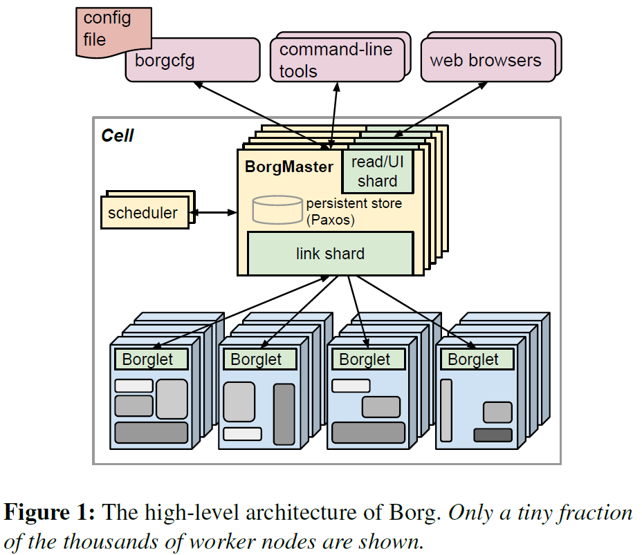
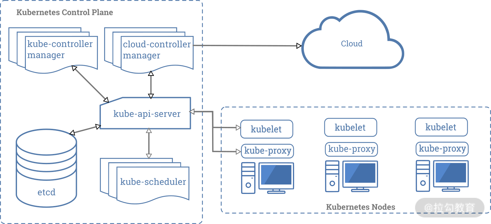

# 云原生基石：初识Kubernetes

## 前世今生：Kubernetes 是如何火起来的？

本课时，我们就开始正式进入 Kubernetes 的学习，或许你已经听过或简单了解过 Kubernetes，它是一款由 Google 开源的容器编排管理工具，而我们想要深入地掌握 Kubernetes 框架，就不得不先了解 Kubernetes 的前世今生，而这一切都要从“云计算”的兴起开始讲起。

### 云计算平台

说来也巧，“云计算”这个概念也是由 Google 提出的，可见这家公司对计算机技术发展的贡献有多大。自云计算 2006 年被提出后，已经逐渐成为信息技术产业发展的战略重点，你可能也会切身感受到变化。我们平时在讨论技术的时候，经常会被问到诸如“你们公司的业务是否要考虑上云”的问题，而国内相关的云计算大会近几年也如雨后春笋般地召开，可见其有多么火热。

而云计算之所以可以这么快地发展起来，主要原因还是可以为企业带来便利，同时又能降低成本，国内的各大传统型企业的基础设施纷纷向云计算转型，从阿里云、腾讯云每年的发展规模我们就可以看出来云计算市场对人才的需求有多大。

这里，我们可以将经典的云计算架构分为三大服务层：也就是 IaaS（Infrastructure as a Service，基础设施即服务）、PaaS（Platform as a Service，平台即服务）和 SaaS（Software as a Service，软件即服务）。

IaaS 层通过虚拟化技术提供计算、存储、网络等基础资源，可以在上面部署各种 OS 以及应用程序。开发者可以通过云厂商提供的 API 控制整个基础架构，无须对其进行物理上的维护和管理。

PaaS 层提供软件部署平台（runtime），抽象掉了硬件和操作系统，可以无缝地扩展（scaling）。开发者只需要关注自己的业务逻辑，不需要关注底层。

SaaS 层直接为开发者提供软件服务，将软件的开发、管理、部署等全部都交给第三方，用户不需要再关心技术问题，可以拿来即用。

以前主流的做法就是申请或创建一批云服务（Elastic Compute Service），比如亚马逊的 AWS EC2、阿里云 ECS 或者 OpenStack 的虚拟机，然后通过 Ansible、Puppet 这类部署工具在机器上部署应用。

但随着应用的规模变得越来越庞大，逻辑也越来越复杂，迭代更新也越来越频繁，这时我们就逐渐发现了一些问题，比如：

- **性价比低，资源利用率低**

有时候用户只是希望运行一些简单的程序而已，比如跑一个小进程，为了不相互影响，就要建立虚拟机。这显然会浪费不少资源，毕竟 IaaS 层产品都是按照资源进行收费的。同时操作也比较复杂，花费时间也会比较长；

- **迁移成本高**

如果想要迁移整个自己的服务程序，就要迁移整个虚拟机。显然，迁移过程也会很复杂；

- **环境不一致**

在进行业务部署发布的过程中，服务之间的各种依赖，比如操作系统、开发语言及其版本、依赖的库/包等，都给业务开发和升级带来很大的制约。

如果没有 Docker 的横空出世，这些问题解决起来似乎有些困难。

### Docker

Docker 这个新的容器管理引擎大大降低了使用容器技术的门槛，轻量、可移植、跨平台、镜像一致性保障等优异的特性，一下子解放了生产力。开发者可以根据自己的喜好选择合适的编程语言和框架，然后通过微服务的方式组合起来。交付同学可以利用容器保证交付版本和交付环境的一致性，也便于各个模块的单独升级。测试人员也可以只针对单个功能模块进行测试，加快测试验证的速度。

在某一段时期内，大家一提到 Docker，就和容器等价起来，认为 Docker 就是容器，容器就是Docker。其实容器是一个相当古老的概念，并不是 Docker发明的，但 Docker 却为其注入了新的灵魂——Docker 镜像。

Docker 镜像解决了环境打包的问题，它直接打包了应用运行所需要的整个“操作系统”，而且不会出现任何兼容性问题，它赋予了本地环境和云端环境无差别的能力，这样避免了用户通过“试错”来匹配不同环境之间差异的痛苦过程， 这便是 Docker 的精髓。

它通过简单的 Dockerfile 来描述整个环境，使开发者可以随时随地构建无差别的镜像，方便了镜像的分发和传播。相较于以往通过光盘、U盘、ISO文件等方式进行环境的拷贝复制，Docker镜像无疑把开发者体验提高到了前所未有的高度。这也是 Docker 风靡全球的一个重要原因。

有了 Docker，开发人员可以轻松地将其生产环境复制为可立即运行的容器应用程序，让工作更有效率。越来越多的机构在容器中运行着生产业务，而且这一使用比例也越来越高。我们来看看CNCF （Cloud Native Computing Foundation，云计算基金会）在2019年做的[调研报告](https://www.cncf.io/wp-content/uploads/2020/03/CNCF_Survey_Report.pdf)。

容器使用数量低于249 个的比例自2018年开始下降了 26%，而使用容器数目高于 250 个的比例增加了 28%。可以预见的是，未来企业应用容器化会越来越常见，使用容器进行交付、生产、部署是大势所趋，也是企业进行技术改造，业务快速升级的利器。

### 我们为什么需要容器调度平台

有了容器，开发人员就只需要考虑如何恰当地扩展、部署，以及管理他们新开发的应用程序。但如果我们大规模地使用容器，就不得不考虑容器调度、部署、跨多节点访问、自动伸缩等问题。

接下来，我们来看看一个容器编排引擎到底需要哪些能力才能解决上述这些棘手的问题。

|    能力     |                       解释                       |
| :---------: | :----------------------------------------------: |
|    调度     |                 自动生成容器实例                 |
| 亲和/反亲和 | 生成的容器可以相邻或者相隔，帮助提高可用性和性能 |
|  健康检查   |              自动监测容器的健康状态              |
|    容错     |           自动在健康节点上重新生成容器           |
|   可拓展    |         自动根据需要增加或者删除容器实例         |
|    网络     |               允许容器之间相互通信               |
|  服务发现   |               允许容器之间互相发现               |
|  滚动升级   | 容器升级可以避免对业务造成影响，同时可以出错回滚 |

如表所示，首先容器调度平台可以自动生成容器实例，然后是生成的容器可以相邻或者相隔，帮助提高可用性和性能，还有健康检查、容错、可扩展、网络等功能，它几乎完美地解决了需求与资源的匹配编排问题。

既然容器调度平台功能这样强大，市场竞争必定是风云逐鹿的，其实主流的容器管理调度平台有三个，分别是Docker Swarm、Mesos Marathon和Kubernetes，它们有各自的特点。但是同时满足上面所述的八大能力的容器调度平台，其实非 Kubernetes 莫属了。

Swarm 是 Docker 公司自己的产品，会直接调度 Docker 容器，并且使用标准的 Docker API 语义，为用户提供无缝衔接的使用体验。 Swarm 更多的是面向于开发者，而且对容错性支持不够好。

Mesos 是一个分布式资源管理平台，提供了 Framework 注册机制。接入的框架必须有一个Framework Scheduler 模块负责框架内部的任务调度，还有一个 Framework Executor 负责启动运行框架内的任务。Mesos 采用了双层调度架构，首先 Mesos 将资源分配给框架，然后每个框架使用自己的调度器将资源分配给内部的各个任务使用，比如 Marathon 就是这样的一个框架，主要负责为容器工作负载提供扩展、自我修复等功能。

Kubernetes 的目标就是消除编排物理或者虚拟计算、网络和存储等基础设施负担，让应用运营商和开发工作者可以专注在以容器为核心的应用上面，同时可以优化集群的资源利用率。Kubernetes 采用了 Pod 和 Label 这样的概念，把容器组合成一个个相互依赖的逻辑单元，相关容器被组合成 Pod 后被共同部署和调度，就形成了服务，这也是 Kuberentes 和其他两个调度管理系统最大的区别。

相对来说，Kubernetes 采用这样的方式简化了集群范围内相关容器被共同调度管理的复杂性。换种角度来说，Kubernetes 能够相对容易的支持更强大、更复杂的容器调度算法。

根据 StackRox 的统计数据表明，Kubernetes 在容器调度领域占据了 86% 的市场份额，虽说Kubernetes 的部署方式千差万别。以前绝大多数人都是采用自建的方式来管理 Kubernetes 集群的，现在已经逐渐采用公有云的 Kubernetes 服务。可见，Kubernetes 越来越成熟，也越来越受到市场的青睐。

依据 Google Trends 收集的数据，自 Kubernetes出现以后，便呈黑马态势一路开挂，迅速并牢牢占据头把交椅位置，最终成为容器调度的事实标准。

## 高屋建瓴：Kubernetes 的架构为什么是这样的？

Google 使用 Linux 容器有超过 15 年的时间，期间共创建了三套容器调度管理系统，分别是 Borg、Omega 和 Kubernetes。虽然是出于某些特殊诉求偏好先后开发出来的，但是在差异中我们仍然可以看到，后代系统中存在着前一代系统的影子，也就是说，它们之间传承了很多优良的设计。这也是为什么 Kubernetes 在登场之初，就可以吸引到诸多大厂的关注，自此一炮而红，名震江湖。

Kubernetes 的架构设计参考了 Borg 的架构设计，现在我们先来看看 Borg 架构长什么样？

### Borg的架构

论文：[https://ying-zhang.github.io/yi/2017/x-eurosys15-borg-cn/](https://ying-zhang.github.io/yi/2017/x-eurosys15-borg-cn/)

我们先来看看 Borg 定义的两个概念，Cell 和 Cluster。

Borg 用Cell 来定义一组机器资源。Google 内部一个中等规模的 Cell 可以管理 1 万台左右的服务器，这些服务器的配置可以是异构的，比如内存差异、CPU 差异、磁盘空间等。Cell 内的这些机器是通过高速网络进行连通的，以此保证网络的高性能。

Cluster 即集群，一个数据中心可以同时运行一个或者多个集群，每个集群又可以有多个 Cell，比如一个大 Cell 和多个小 Cell。通常来说尽量不要让一个 Cell 横跨两个机房，这样会带来一些性能损失。这也同样适用于 Kubernetes 集群，我们在规划和搭建 Kuberentes 集群的时候要注意这一点。

有了上面这两个概念，我们再来看看下面这幅 Borg 的架构图。



Borg 采用了分布式系统中比较常见的 Server/Agent 架构，主要模块包括 BorgMaster、Borglet 和调度器，这些组件都是通过 C++ 来实现的。

Borglet 运行在每个节点或机器上，这个 agent 程序主要负责任务的启停，如果任务失败了，它会对任务进行重启等一系列操作。运行的这些任务一般都是通过容器来做资源隔离，Borglet 会对任务的运行状态进行监控和汇报。

同时，每个集群中会有对应的 BorgMaster。为了避免单点故障，满足高可用的需要，我们往往需要部署多个 BorgMaster 副本，就如我们图里面显示的那样。这五个副本分别维护一份整个集群状态的内存拷贝，并持久化到一个高可用的、基于 Paxos 的存储上。

通过 Paxos，从这 5 个 BorgMaster 副本中选择出一个 Leader，负责处理整个集群的变更请求，而其余四个都处于 Standby 状态。如果该 Leader 宕机了，会重新选举出另外一个 Leader 来提供服务，整个过程一般在几秒内完成。如果集群规模非常大的话，估计需要近 1 分钟的时间。

BorgMaster 进程主要用于处理跟各个 Borglet 进程进行交互。除此之外，BorgMaster 还提供了Web UI，供用户通过浏览器访问。

Borg 在这里面有个特殊的设计，BorgMaster 和 Borglet 之间的交互方式是 BorgMaster 主动请求 Borglet 。即使出现诸如整个 Cell 突然意外断电恢复，也不会存在大量的 Borglet 主动连 BorgMaster，所以就避免了大规模的流量将 BorgMaster 打挂的情况出现。这种方式由 BorgMaster 自己做流控，还可以避免每次 BorgMaster 自己重启后，自己被打挂的情形发生。

我们再来仔细看下架构图，你会发现 BorgMaster 跟 Borglet 之间还加了一层。这是因为 BorgMaster 每次从 Borglet 拿到的数据都是全量的，通过 link shard 模块就可以只把 Borglet 的变化传给 BorgMaster，减少沟通的成本，也降低了 BorgMaster 的处理成本。如果 Borglet 有多次没有对 Borgmaster 的请求进行响应，Borgmaster 就认为运行 Borglet 的这台机器挂掉了，然后对其上的 task 进行重新调度。

下面我们来看看 Kuberenetes 的架构。

### kubernetes的架构

Kubernetes 借鉴了 Borg 的整体架构思想，主要由 Master 和 Node 共同组成。



我们需要注意 Master 和 Node 两个概念。其中 Master 是控制节点，部署着 Kubernetes 的控制面，负责整个集群的管理和控制。Node 为计算节点，或者叫作工作负载节点，每个 Node 上都会运行一些负载容器。

跟 Borg 一样，为了保证高可用，我们也需要部署多个 Master 实例。根据我的生产实践经验，最好为这些 Master 节点选择一些性能好且规格大的物理机或者虚拟机，毕竟控制面堪称 Kubernetes 集群的大脑，要尽力避免这些实例宕机导致集群故障。

同样在 Kubernetes 集群中也采用了分布式存储系统 Etcd，用于保存集群中的所有对象以及状态信息。有的时候，我们会将 Etcd 集群也一起部署到 Master 上。但是在集群节点资源足够的情况下，我个人建议可以考虑将 Etcd 集群单独部署，因为Etcd中的数据可是至关重要的，必须要保证 Etcd 数据的安全。Etcd 采用 Raft 协议实现，和 Borg 中基于 Paxos 的存储系统不太一样。关于 Raft 和 Paxos 这两个协议的差异对比，我们在这里就不展开讲了，你可以通过[《Paxos 和 Raft 的前世今生》](https://cloud.tencent.com/developer/article/1352070)这篇文章了解一二。

### kubernetes的组件

Kubernetes 的控制面包含着 kube-apiserver、kube-scheduler、kube-controller-manager 这三大组件，我们也称为 **Kubernetes** 的三大件。下面我们逐一来讲一下它们的功能及作用。

首先来看 **kube-apiserver**，它 是整个 Kubernetes 集群的“灵魂”，是信息的汇聚中枢，提供了所有内部和外部的 API 请求操作的唯一入口。同时也负责整个集群的认证、授权、访问控制、服务发现等能力。

用户可以通过命令行工具 kubectl 和 APIServer 进行交互，从而实现对集群中进行各种资源的增删改查等操作。APIServer 跟 BorgMaster 非常类似，会将所有的改动持久到 Etcd 中，同时也保存着一份内存拷贝。

这也是为什么我们希望 Master 节点可以性能好、资源规格大，尤其是当集群规模很大的时候，APIServer 的吞吐量以及占用的 CPU 和内存都要很大。APIServer 还提供很多可扩展的能力，方便增强自己的功能。我们会在后面的课程中慢慢介绍。

再来看**Kube-Controller-Manager**，它负责维护整个 Kubernetes 集群的状态，比如多副本创建、滚动更新等。Kube-controller-manager 并不是一个单一组件，内部包含了一组资源控制器，在启动的时候，会通过 goroutine 拉起多个资源控制器。这些控制器的逻辑仅依赖于当前状态，因为在分布式系统中没办法保证全局状态的同步。

同时在实现的时候避免使用过于复杂的状态机，因此每个控制器仅仅对自己对应的资源对象做操作。而且控制器做了很多容错处理，比如增加 retry 机制等。

最后来看**Kube-scheduler**，它的工作简单来说就是监听未调度的 Pod，按照预定的调度策略绑定到满足条件的节点上。这个工作虽说看起来是三大件中最简单的，但是做的事情可一点不少。

我们会在后续的课程里，专门讲 Kubernetes 的调度器原理，敬请期待。这个调度器是 Kubernetes 的默认调度器，可插拔，你可以根据需要使用其他的调度器，或者通过目前调度器的扩展功能增加自己的特性进去。

了解完了控制面组件，我们再来看看 Node 节点。一般来说 Node 节点上会运行以下组件。

- 容器运行时主要负责容器的镜像管理以及容器创建及运行。大家都知道的 Docker 就是很常用的容器，此外还有 Kata、Frakti等。只要符合 CRI（Container Runtime Interface，容器运行时接口）规范的运行时，都可以在 Kubernetes 中使用。

- Kubelet 负责维护 Pod 的生命周期，比如创建和删除 Pod 对应的容器。同时也负责存储和网络的管理。一般会配合 CSI、CNI 插件一起工作。

- Kube-Proxy 主要负责 Kubernetes 内部的服务通信，在主机上维护网络规则并提供转发及负载均衡能力。

除了上述这些核心组件外，通常我们还会在 Kubernetes 集群中部署一些 Add-on 组件，常见的有：

- CoreDNS 负责为整个集群提供 DNS 服务；

- Ingress Controller 为服务提供外网接入能力；

- Dashboard 提供 GUI 可视化界面；

- Fluentd + Elasticsearch 为集群提供日志采集、存储与查询等能力。

了解完 Kubernetes 的各大组件，我们再来看看 Master 和 Node 是如何交互的。

### Master 和 Node 的交互方式

在这一点上，Kubernetes 和 Borg 完全相反。Kubernetes 中所有的状态都是采用上报的方式实现的。APIServer 不会主动跟 Kubelet 建立请求链接，所有的容器状态汇报都是由 Kubelet 主动向 APIServer 发起的。到这里你也许有疑惑，这种方式会不会对 APIServer 产生很大的流量影响？这个问题，我们同样会在后续课程里，给你一一解答。

当集群资源不足的时候，可以按需增加Node 节点。一旦启动 Kubelet 进程以后，它会主动向 APIServer 注册自己，这是 Kubernetes 推荐的 Node 管理方式。当然你也可以在Kubelet 启动参数中去掉自动注册的功能，不过一般都是默认开启这个模式的。

一旦新增的 Node 被 APIServer 纳管进来后，Kubelet 进程就会定时向 APIServer 汇报“心跳”，即汇报自身的状态，包括自身健康状态、负载数据统计等。当一段时间内心跳包没有更新，那么此时 kube-controller-manager 就会将其标记为NodeLost（失联）。这也是 Kubernetes 跟 Borg 有区别的一个地方。

Kubernetes 中各个组件都是以 APIServer 为中心，通过松耦合的方式进行。借助声明式 API，各部件通过 watch 的机制就可以根据各个对象的变化，很快地做出相应的处理操作。

## 核心定义：Kubernetes 是如何搞定“不可变基础设施”的？

在了解 Pod 之前，我们先来看一下CNCF 官方是怎么定义云原生的。

> 云原生技术有利于各组织在公有云、私有云和混合云等新型动态环境中，构建和运行可弹性扩展的应用。云原生的代表技术包括容器、服务网格、微服务、不可变基础设施和声明式API。
> 这些技术能够构建容错性好、易于管理和便于观察的松耦合系统。结合可靠的自动化手段，云原生技术使工程师能够轻松地对系统作出频繁和可预测的重大变更。

有没有注意到，云原生的代表技术里面提到了一个概念——不可变基础设施（Immutable Infrastructure）。其他的代表技术，像容器、微服务等概念早已深入人心，声明式 API 我们在第一讲 Kubernetes 的前世今生中也有所提及。那么这个不可变基础设施到底是什么含义，又与我们今天要讲的 Pod 有什么关系？

### 怎么理解不可变基础设施？

不可变基础设施，这个名词最早由 Chad Fowler 于 2013 年在他的文章“*Trash Your Servers and Burn Your Code: Immutable Infrastructure and Disposable Components”*中提出来。随后，Docker 带来的“容器革命”以及 Kubernetes 引领的“云原生时代”，让不可变基础设施这个概念变得越来越流行。

这里的基础设施，我们可以理解为服务器、虚拟机或者是容器。

跟不可变基础设施相对的，我们称之为可变基础设施。在以往传统的开发运维体系中，软件开发完成后，需要工程师或管理员通过SSH 连接到他们的服务器上，然后进行一些脚本安装、deb/rpm 包的安装工作，并逐个机器地调整对应的配置参数及文件。后续还会根据需要对该环境进行不断更改，比如 kernel 升级、配置更新、打补丁等。

随着这种类似变更的操作越来越多，没有人能弄清楚这个环境具体经历了哪些操作，而后续的变更也经常会遇到各种意想不到的诡异事情，比如软件包的循环依赖、参数的配置不一致、版本漂移等问题。

基础设施会变得越来越脆弱、敏感，一些小的改动都有可能引发大的不可预知的结果，这令广大开发者和环境管理员异常抓狂，他们需要凭借自己丰富的技术积累，耗费大量的时间去排查解决。正如我们此前所说，云计算的出现降低了环境标准化的成本，但是业务的交付管理成本依然很高。

通常来说，这种可变基础设施会导致以下问题：

- 持续的变更修改给服务运行态引入过多的中间态，增加了不可预知的风险；

- 故障发生时，难以及时快速构建出新的服务副本；

- 不易标准化，交付运维过程异常痛苦，虽然可以通过 Ansible、Puppet 等部署工具进行交付，但是也很难保证对底层各种异构的环境支持得很好，还有随时会出现的版本漂移问题。比如你可能经常遇到的，某个软件包几个月之前安装还能够正常运行，现在到一个新环境安装后，竟然无法正常工作了。

- 不可变基础设施则是另一种思路，部署完成以后，便成为一种只读状态，不可对其进行任何更改。如果需要更新或修改，就使用新的环境或服务器去替代旧的。不可变基础设施带来了更一致、更可靠、更可预测的设计理念，可以缓解或完全避免可变基础设施中遇到的各种常见问题。

同时，借助容器技术我们可以自动化地构建出不可变的、可版本化管理的、可一致性交付的应用服务体系，这里包括了标准化实例、运行环境等。还可以依赖持续部署系统，进行应用服务的自动化部署更新，加快迭代和部署效率。

**Kubernetes 中的不可变基础设施就是 Pod。**

### Pod是什么

Pod 由一个或多个容器组成，如下图所示。Pod 中的容器不可分割，会作为一个整体运行在一个 Node 节点上，也就是说 Pod 是你在 Kubernetes 中可以创建和部署的最原子化的单位。


同一个 Pod 中的容器共享网络、存储资源。

- 每个 Pod 都会拥有一个独立的网络空间，其内部的所有容器都共享网络资源，即 IP 地址、端口。内部的容器直接通过 localhost 就可以通信。

- Pod 可以挂载多个共享的存储卷（Volume），这时内部的各个容器就可以访问共享的 Volume 进行数据的读写。

既然一个 Pod 内支持定义多个容器，是不是意味着我可以任意组合，甚至将无关紧要的容器放进来都无所谓？不！这不是我们推荐的方式，也不是使用 Pod 的正确打开方式。

通常来说，如果在一个 Pod 内有多个容器，那么这几个容器最好是密切相关的，且可以共享一些资源的，比如网络、存储等。

我们来看看[官方文档中给的一个例子](https://kubernetes.io/zh/docs/concepts/workloads/pods/#pod-怎样管理多个容器)。这个 Pod 里面运行了两个容器 File Puller 和 Web Server。其中 File Puller 负责定期地从外部 Content Manager 同步内容，更新到挂载的共享存储卷（Volume）中，而 Web Server 只负责对外提供访问服务。两个容器之间通过共享的存储卷共享数据。


类似这样紧密耦合的业务容器，就比较适合放置在同一个 Pod 中，可以保证很高的通信效率。

一般来说，在一个 Pod 内运行多个容器，比较适应于以下这些场景。

- 容器之间会发生文件交换等，上面提到的例子就是这样。一个写文件，一个读文件。

- 容器之间需要本地通信，比如通过 localhost 或者本地的 Socket。这种方式有时候可以简化业务的逻辑，因为此时业务就不用关心另外一个服务的地址，直接本地访问就可以了。

- 容器之间需要发生频繁的 RPC 调用，出于性能的考量，将它们放在一个 Pod 内。

- 希望为应用添加其他功能，比如日志收集、监控数据采集、配置中心、路由及熔断等功能。这时候可以考虑利用边车模式（Sidecar Pattern），既不需要改动原始服务本身的逻辑，还能增加一系列的功能。比如 Fluentd 就是利用边车模式注入一个对应 log agent 到 Pod 内，用于日志的收集和转发。 Istio 也是通过在 Pod 内放置一个 Sidecar 容器，来进行无侵入的服务治理。

### Pod 背后的设计理念

看完上面 Pod 的存在形式，你也许会有下面两个疑问。

#### 1. 为什么 Kubernetes 不直接管理容器，而用 Pod 来管理呢？

直接管理一个容器看起来更简单，但为了能够更好地管理容器，Kubernetes 在容器基础上做了更高层次的抽象，即 Pod。

因为使用一个新的逻辑对象 Pod 来管理容器，可以在不重载容器信息的基础上，添加更多的属性，而且也方便跟容器运行时进行解耦，兼容度高。比如：

- 存活探针（Liveness Probe）可以从应用程序的角度去探测一个进程是否还存活着，在容器出现问题之前，就可以快速检测到问题；

- 容器启动后和终止前可以进行的操作，比如，在容器停止前，可能需要做一些清理工作，或者不能马上结束进程；

- 定义了容器终止后要采取的策略，比如始终重启、正常退出才重启等；

这些能力我们会在下一节课“ 05 Pod：最小调度单元的使用进阶及实践”中逐一介绍。

#### 2. 为什么要允许一个 Pod 内可以包含多个容器？

再回答这个问题之前，我们思考一下另外一个问题 “为什么不直接在单个容器里运行多个程序？”。

**由于容器实际上是一个“单进程”的模型**，这点非常重要。因为如果你在容器里启动多个进程，这将会带来很多麻烦。不仅它们的日志记录会混在一起，它们各自的生命周期也无法管理。毕竟只有一个进程的 PID 可以为 1，如果 PID 为 1 的进程这个时候挂了，或者说失败退出了，那么其他几个进程就会自然而然地成为“孤儿”，无法管理，也无法回收资源。

很多公司在刚开始容器化改造的时候，都会这么去使用容器，把容器当作 VM 来使用，有时候也叫作**富容器模式**。这其实是一种非常不好的尝试，也不符合不可变基础设施的理念。我们可以接受将富容器当作容器化改造的一个短暂的过渡形态，但不能将其作为改造的终态。后续，还需要进一步对这些富容器进行拆分、解耦。

看到这里，第二个问题的答案已经呼之欲出了。用一个 Pod 管理多个容器，既能够保持容器之间的隔离性，还能保证相关容器的环境一致性。使用粒度更小的容器，不仅可以使应用间的依赖解耦，还便于使用不同技术栈进行开发，同时还可以方便各个开发团队复用，减少重复造轮子。

### 如何声明一个 Pod

在 Kubernetes 中，所有对象都可以通过一个相似的 API 模板来描述，即元数据 （metadata）、规范（spec）和状态（status）。这种方式也是从 Borg 吸取的经验，避免过多的 API 定义设计，不利于统一和对接。Kubernetes 有了这种统一风格的 API 定义，方便了通过 REST 接口进行开发和管理。

#### 元数据（metadata）

metadata 中一般要包含如下 3 个对该对象至关重要的元信息：namespace（命名空间）、name（对象名）和 uid（对象 ID）。

- namespace是 Kubernetes 中比较重要的一个概念，是对一组资源和对象的抽象集合，namespace 主要用于逻辑上的隔离。Kubernetes 中有几个内置的 namespace：

  - default，这是默认的缺省命名空间；

  - kube-system，主要是部署集群最关键的核心组件，比如一般会将 CoreDNS 声明在这个 namespace 中；

  - kube-public，是由 kubeadm 创建出来的，主要是保存一些集群 bootstrap 的信息，比如 token 等；

  - kube-node-lease，是从 v1.12 版本开始开发的，到 v1.14 版本变为 beta 可用版本，在 v1.17 的时候已经正式 GA 了，它要用于 node 汇报心跳（我们在第一节课已经解释过了心跳的概念），每一个节点都会有一个对应的 Lease 对象。

- 对象名比较好理解，就是用来标识对象的名称，在 namespace 内具有唯一性，在不同的 namespace 下，可以创建相同名字的对象。

- uid 是由系统自动生成的，主要用于 Kubernetes 内部标识使用，比如某个对象经历了删除重建，单纯通过名字是无法判断该对象的新旧，这个时候就可以通过 uid 来进行唯一确定。

当然， Kubernetes 中并不是所有对象都是 namespace 级别的，还有一些对象是集群级别的，并不需要 namespace 进行隔离，比如 Node 资源等。

除此以外，还可以在 metadata 里面用各种标签 （labels）和注释（annotations）来标识和匹配不同的对象，比如用户可以用标签env=dev来标识开发环境，用env=testing来标识测试环境。我们会在后面的课程中，具体介绍 labels 和 annotations 的一些用途以及它们扮演的角色。

#### 规范 （Spec）

在 Spec 中描述了该对象的详细配置信息，即用户希望的状态（Desired State）。Kubernetes 中的各大组件会根据这个配置进行一系列的操作，将这种定义从“抽象”变为“现实”，我们称之为调和（Reconcile）。用户不需要过度关心怎么达到终态，也不用参与。

#### 状态（Status）

在这个字段里面，包含了该对象的一些状态信息，会由各个控制器定期进行更新。也是不同控制器之间进行相互通信的一个渠道。在 Kubernetes 中，各个组件都是分布式部署的，围绕着 kube-apiserver 进行通信，那么不同组件之间进行信息同步，就可以通过 status 进行。像 Node 的 status 就记录了该节点的一些状态信息，其他的控制器，就可以通过 status 知道该 Node 的情况，做一些操作，比如节点宕机修复、可分配资源等。

现在我们来看一个 Pod 的 API 长什么样子。

### 一个 Pod 的真实例子

下面是我用 Yaml 写的一个 Pod 定义，我做了注释让你一目了然：

```yaml
apiVersion: v1 #指定当前描述文件遵循v1版本的Kubernetes API

kind: Pod #我们在描述一个pod

metadata:

  name: twocontainers #指定pod的名称

  namespace: default #指定当前描述的pod所在的命名空间

  labels: #指定pod标签

    app: twocontainers

  annotations: #指定pod注释

    version: v0.5.0

    releasedBy: david

    purpose: demo

spec:

  containers:

  - name: sise #容器的名称

    image: quay.io/openshiftlabs/simpleservice:0.5.0 #创建容器所使用的镜像

    ports:

    - containerPort: 9876 #应用监听的端口

  - name: shell #容器的名称

    image: centos:7 #创建容器所使用的镜像

    command: #容器启动命令

      - "bin/bash"

      - "-c"

      - "sleep 10000"
```

你可以通过 kubectl 命令在集群中创建这个 Pod。kubectl 的功能比较强大、也比较灵活。我们会在后面的课程中，慢慢会看到 kubectl 的各种使用方法。

```shell
$ kubectl create -f ./twocontainers.yaml

kubectl get pods

NAME                      READY     STATUS    RESTARTS   AGE

twocontainers             2/2       Running   0          7s
```

创建出来后，稍微等待一下，我们就可以看到，该 Pod 已经运行成功了。现在我们可以通过 exec 进入`shell`这个容器，来访问`sise`服务：

```shell
$ kubectl exec twocontainers -c shell -i -t -- bash

[root@twocontainers /]# curl -s localhost:9876/info

{"host": "localhost:9876", "version": "0.5.0", "from": "127.0.0.1"}
```

## K8s Pod：最小调度单元的使用进阶及实践

在实际生产使用的过程中，通过 kubectl 可以很方便地部署一个 Pod。但是 Pod 运行过程中还会出现一些意想不到的问题，比如：

- Pod 里的某一个容器异常退出了怎么办？

- 有没有“健康检查”方便你知道业务的真实运行情况，比如容器运行正常，但是业务不工作了？
- 容器在启动或删除前后，如果需要做一些特殊处理怎么办？比如做一些清理工作。
- 如果容器所在节点宕机，重启后会对你的容器产生影响吗？
- ……

在这一课时中，我将通过一些示例一一解答你的这些问题，并告诉你 Pod 最佳的使用方法。

在了解 Pod 的高阶用法之前，我们先聊聊 Pod 的运行状态。

### Pod 的运行状态

我们先回到上一节中的例子：

```yaml
apiVersion: v1 #指定当前描述文件遵循v1版本的Kubernetes API

kind: Pod #我们在描述一个pod

metadata:

  name: twocontainers #指定pod的名称

  namespace: default #指定当前描述的pod所在的命名空间

  labels: #指定pod标签

    app: twocontainers

  annotations: #指定pod注释

    version: v1

    releasedBy: david

    purpose: demo

spec:

  containers:

  - name: sise #容器的名称

    image: quay.io/openshiftlabs/simpleservice:0.5.0 #创建容器所使用的镜像

    ports:

    - containerPort: 9876 #应用监听的端口

  - name: shell #容器的名称

    image: centos:7 #创建容器所使用的镜像

    command: #容器启动命令

      - "bin/bash"

      - "-c"

      - "sleep 10000"
```

我们通过 kubectl 创建 Pod 成功后，可以通过如下命令看到 Pod 的状态:

```bash
$ kubectl get pod twocontainers -o=jsonpath='{.status.phase}'

Pending
```

> 注：我们这里使用了 kubectl 命令行 JSONPATH 模板能力，你可以将这条命令当作一个 tip，在日常工作中使用。在本专栏的最后，我们也会单独讲一些 kubectl 的使用秘笈，在此不展开讲。

我们看到，这个时候 Pod 处于`Pending`状态，具体的值来自 Pod 对象的`status.phase`字段。

你也可以使用 kubectl get 命令来查看容器的状态：

```bash
$ kubectl get pod twocontainers

NAME            READY   STATUS              RESTARTS   AGE

twocontainers   0/2     ContainerCreating   0          13s
```

看到这里，你会发现这个地方显示的是`ContainerCreating`，这和上面的`Pending`不一致啊！先别急，我们来 describe 一下（这里我只截取跟 Pod 状态最相关的片段）：

```bash
$ kubectl describe pod twocontainers

Name:         twocontainers

Namespace:    default

...

Status:       Pending

IP:

IPs:          <none>

Containers:

  sise:

    Container ID:

    Image:          quay.io/openshiftlabs/simpleservice:0.5.0

    ...

    State:          Waiting

      Reason:       ContainerCreating

    Ready:          False

    Restart Count:  0

    ...

  shell:

    Container ID:

    Image:         centos:7

    Image ID:

    ...

    State:          Waiting

      Reason:       ContainerCreating

    Ready:          False

    ...

...

Events:

  Type    Reason     Age        From               Message

  ----    ------     ----       ----               -------

  Normal  Scheduled  <unknown>  default-scheduler  Successfully assigned default/twocontainers to node-1

  Normal  Pulling    3m57s      kubelet, node-1    Pulling image "quay.io/openshiftlabs/simpleservice:0.5.0"
```

可以看到，这边 Status 依然是`Pending`。其实这是 kubectl 在显示时做的转换，它会遍历容器的 State，如果容器的状态为`Waiting`的话，就读取`State.Reason`字段作为 Pod 的 Status。这个时候由于镜像在本地不存在，需要去镜像中心拉取。

一般来说，处于`Pending`状态的 Pod，不外乎以下 2 个原因：

1. Pod 还未被调度；
2. Pod 内的容器镜像在待运行的节点上不存在，需要从镜像中心拉取。

等待镜像拉取结束，再来查看 Pod 的状态，已经变为`Running`状态。

```bash
$ kubectl get pod twocontainers -o=jsonpath='{.status.phase}'

Running

$ kubectl describe pod twocontainers

Name:         twocontainers

Namespace:    default

...

Start Time:   Wed, 26 Aug 2020 16:49:11 +0800

...

Status:       Running

...

Containers:

  sise:

    Container ID:   docker://4dc8244a19e6766b151b36d986b9b3661f3bf05260aedd2b76dd5f0fcd6e637f

    Image:          quay.io/openshiftlabs/simpleservice:0.5.0

    Image ID:       docker-pullable://quay.io/openshiftlabs/simpleservice@sha256:72bfe1acc54829c306dd6683fe28089d222cf50a2df9d10c4e9d32974a591673

    ...

    State:          Running

      Started:      Wed, 26 Aug 2020 17:00:52 +0800

    Ready:          True

    ...

  shell:

    Container ID:  docker://1b6137b4cef60d0309412f5cdba7f0ff743ee03c1112112f6aadd78f9981bbaa

    Image:         centos:7

    Image ID:      docker-pullable://centos@sha256:19a79828ca2e505eaee0ff38c2f3fd9901f4826737295157cc5212b7a372cd2b

    ...

    State:          Running

      Started:      Wed, 26 Aug 2020 17:01:46 +0800

    Ready:          True

    ...

Conditions:

  Type              Status

  Initialized       True

  Ready             True

  ContainersReady   True

  PodScheduled      True

...
```

这个时候，就标志着 Pod 内的所有容器均被创建出来了，且至少有一个容器为在运行状态中。那么如果想知道 Pod 内所有的容器是否都在运行中呢？我们可以通过 kubectl get 来看到：

```bash
$ kubectl get pod twocontainers

NAME            READY   STATUS    RESTARTS   AGE

twocontainers   2/2     Running   0          2m
```

在这里，我们看到`2/2`。前一个 2 表示目前正在运行的容器数量，后一个 2 表示定义的容器数量。当这两个数值相等的时候，就可以标识着 Pod 内所有容器均正常运行。

Pod 的 Status 除了上述的`Pending`、`Running`以外，官方还定义了下面这些状态：

- `Succeeded`来表示 Pod 内的所有容器均成功运行结束，即正常退出，退出码为 0；
- `Failed`来表示 Pod 内的所有容器均运行终止，且至少有一个容器终止失败了，一般这种情况，都是由于容器运行异常退出，或者被系统终止掉了；
- `Unknown`一般是由于 Node 失联导致的 Pod 状态无法获取到。

既然 Pod 内的容器会出现异常退出状态，那么有没有一些重启策略可以让 Kubelet 对容器进行重启呢？

### Pod 的重启策略

Kubernetes 中定义了如下三种重启策略，可以通过`spec.restartPolicy`字段在 Pod 定义中进行设置。

- Always 表示一直重启，这也是默认的重启策略。Kubelet 会定期查询容器的状态，一旦某个容器处于退出状态，就对其执行重启操作；
- OnFailure 表示只有在容器异常退出，即退出码不为 0 时，才会对其进行重启操作；
- Never 表示从不重启；

> 注：**在 Pod 中设置的重启策略适用于 Pod 内的所有容器**。

虽然我们可以设置一些重启策略，确保容器异常退出时可以重启。但是对于运行中的容器，是不是就意味着容器内的服务正常了呢？

比如某些 Java 进程启动速度非常慢，在容器启动阶段其实是无法提供服务的，虽然这个时候该容器是处于运行状态。

再比如，有些服务的进程发生阻塞，导致无法对外提供服务，这个时候容器对外还是显示为运行态。

那么我们该如何解决此类问题呢？有没有一些方法，比如可以通过一些周期性的检查，来确保容器中运行的业务没有任何问题。

### Pod 中的健康检查

为此，Kubernetes 中提供了一系列的健康检查，可以定制调用，来帮助解决类似的问题，我们称之为 Probe（探针）。

目前有如下三种 Probe：

- **livenessProbe**可以用来探测容器是否真的在“运行”，即“探活”。如果检测失败的话，这个时候 kubelet 就会停掉该容器，容器的后续操作会受到其[重启策略](https://kubernetes.io/docs/concepts/workloads/pods/pod-lifecycle/#restart-policy)的影响。
- **readinessProbe**常常用于指示容器是否可以对外提供正常的服务请求，即“就绪”，比如 nginx 容器在 reload 配置的时候无法对外提供 HTTP 服务。
- **startupProbe**则可以用于判断容器是否已经启动好，就比如上面提到的容器启动慢的例子。我们可以通过参数，保证有足够长的时间来应对“超长”的启动时间。 如果检测失败的话，同**livenessProbe**的操作。这个 Probe 是在 1.16 版本才加入进来的，到 1.18 版本变为 beta。也就是说如果你的 Kubernetes 版本小于 1.18 的话，你需要在 kube-apiserver 的启动参数中，显式地在 feature gate 中开启这个功能。可以参考[这个文档](https://kubernetes.io/zh/docs/reference/command-line-tools-reference/feature-gates/)查看如何配置该参数。

如果某个 Probe 没有设置的话，我们默认其是成功的。

为了简化一些通用的处理逻辑，Kubernetes 也为这些 Probe 内置了如下三个 Handler：

- [ExecAction](https://kubernetes.io/docs/resources-reference/v1.7/#execaction-v1-core) 可以在容器内执行 shell 脚本；
- [HTTPGetAction](https://kubernetes.io/docs/resources-reference/v1.7/#httpgetaction-v1-core) 方便对指定的端口和 IP 地址执行 HTTP Get 请求；
- [TCPSocketAction](https://kubernetes.io/docs/resources-reference/v1.7/#tcpsocketaction-v1-core) 可以对指定端口进行 TCP 检查；

在这里 Probe 还提供了其他配置字段，比如 failureThreshold （失败阈值）等，你可以到[这个官方文档](https://kubernetes.io/zh/docs/tasks/configure-pod-container/configure-liveness-readiness-startup-probes/#configure-probes)中查看更详细的解释。

> 注：对于每一种 Probe，Kubelet 只会执行其中一种 Handler。如果你定义了多个 Handler，则会按照 Exec、HTTPGet、TCPSocket 的优先级顺序，选择第一个定义的 Handler。

下面我们通过一个例子，来了解这三个 Probe 的工作流程。

```bash
apiVersion: v1

kind: Pod

metadata:

  name: probe-demo

  namespace: demo

spec:

  containers:

  - name: sise

    image: quay.io/openshiftlabs/simpleservice:0.5.0

    ports:

    - containerPort: 9876

    readinessProbe:

      tcpSocket:

        port: 9876

      periodSeconds: 10

    livenessProbe:

      periodSeconds: 5

      httpGet:

        path: /health

        port: 9876

    startupProbe:

      httpGet:

        path: /health

        port: 9876

      failureThreshold: 3

      periodSeconds: 2
```

在这个例子中，我们在命名空间 demo 下面创建了一个名为 probe-demo 的 Pod。在这个 Pod 里，我们配置了三种 Probe。在 Kubelet 创建好对应的容器以后，会先运行 startupProbe 中的配置，这里我们用 HTTP handler 每隔 2 秒钟通过 http://localhost:9876/health 来判断服务是不是启动好了。这里我们会尝试 3 次检测，如果 6 秒以后还未成功，那么这个容器就会被干掉。而是否重启，这就要看 Pod 定义的重启策略。

一旦容器通过了 startupProbe 后，Kubelet 会每隔 5 秒钟进行一次探活检测 （livenessProbe），每隔 10 秒进行一次就绪检测（readinessProbe）。

在平常使用中，建议你对全部服务同时设置 readiness 和 liveness 的健康检查。

有一点需要注意的是，通过 TCP 对端口进行检查，仅适用于端口已关闭或者进程停止的情况。因为即使服务异常，只要端口是打开状态，健康检查依然是通过的。

除了健康检查以外，我们有时候在容器退出前要做一些清理工作，比如利用 Nginx 自带的停止功能停掉进程，而不是强制杀掉该进程，这可以避免一些正在处理的请求中断。此时我们就需要一个 hook（钩子程序）来帮助我们达到这个目的了。

### 容器生命周期内的 hook

目前在 Kubernetes 中，有如下两种 hook。

- PostStart 可以在容器启动之后就执行。但需要注意的是，此 hook 和容器里的 ENTRYPOINT 命令的执行顺序是不确定的。
- PreStop 则在容器被终止之前被执行，是一种阻塞式的方式。执行完成后，Kubelet 才真正开始销毁容器。

同上面的 Probe 一样，hook 也有类似的 Handler：

- Exec 用来执行 Shell 命令；
- HTTPGet 可以执行 HTTP 请求。

我们来看个例子：

```yaml
apiVersion: v1

kind: Pod

metadata:

  name: lifecycle-demo

  namespace: demo

spec:

  containers:

  - name: lifecycle-demo-container

    image: nginx:1.19

    lifecycle:

      postStart:

        exec:

          command: ["/bin/sh", "-c", "echo Hello from the postStart handler > /usr/share/message"]

      preStop:

        exec:

          command: ["/usr/sbin/nginx","-s","quit"]
```

可以看出来，我们可以借助`preStop`以优雅的方式停掉 Nginx 服务，从而避免强制停止容器，造成正在处理的请求无法响应。

### init 容器

在 Kubernetes 中还有一种特殊的容器，即 init 容器。看名字就知道，这个容器工作在正常容器（为了方便区分，我们这里称为应用容器）启动之前，通常用来做一些初始化工作，比如环境检测、OSS 文件下载、工具安装，等等。

应用容器专注于业务处理，其他一些无关的初始化任务就可以放到 init 容器中。这种解耦有利于各自升级，也降低相互依赖。

一个 Pod 中允许有一个或多个 init 容器。init 容器和其他一般的容器非常像，其与众不同的特点主要有：

- 总是运行到完成，可以理解为一次性的任务，不可以运行常驻型任务，因为会 block 应用容器的启动运行；
- 顺序启动执行，下一个的 init 容器都必须在上一个运行成功后才可以启动；
- 禁止使用 readiness/liveness 探针，可以使用 Pod 定义的**activeDeadlineSeconds**，这其中包含了 Init Container 的启动时间；
- 禁止使用 lifecycle hook。

我们来看一个 Init 容器的例子：

```yaml
apiVersion: v1

kind: Pod

metadata:

  name: myapp-pod

  namespace: demo

  labels:

    app: myapp

spec:

  containers:

  - name: myapp-container

    image: busybox:1.31

    command: [‘sh’, ‘-c’, ‘echo The app is running! && sleep 3600‘]

  initContainers:

  - name: init-myservice

    image: busybox:1.31

    command: ['sh', '-c', 'until nslookup myservice; do echo waiting for myservice; sleep 2; done;']

  - name: init-mydb

    image: busybox:1.31

    command: ['sh', '-c', 'until nslookup mydb; do echo waiting for mydb; sleep 2; done;']
```

在 myapp-container 启动之前，它会依次启动 init-myservice、init-mydb，分别来检查依赖的服务是否可用。