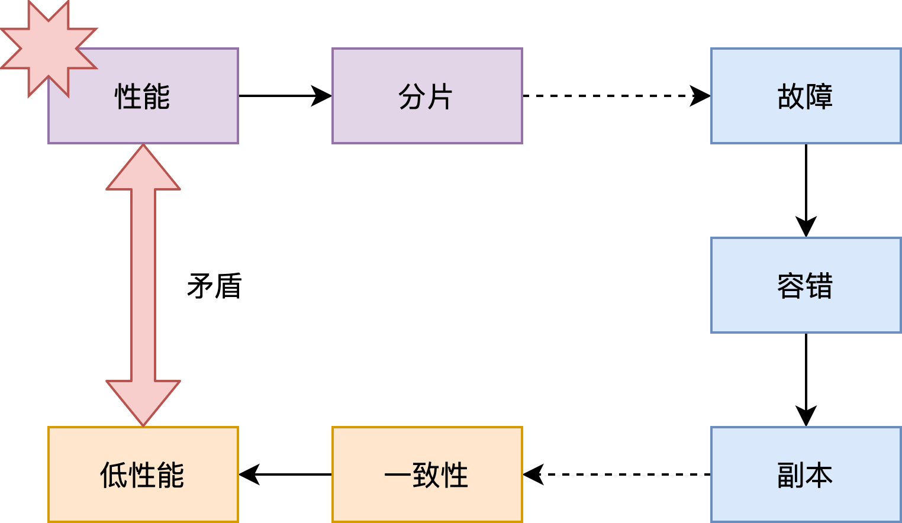
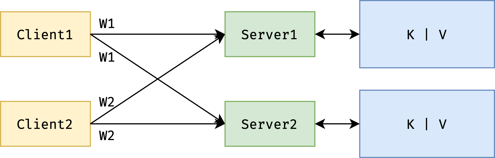

# GFS

## 概述

存储（Storage）是一个非常关键的抽象，用途广泛。

GFS 论文还提到了很多关于容错、备份和一致性的问题。

GFS 本身是 Google 内部一个很成功的实用系统，其关键点被很好的组织到一块发表成为了学术论文，从硬件到软件，涵盖了很多问题，值得我们学习。

## 为什么难

- 性能（High Performance）--> 分片（sharding）

分布式系统，自然想利用大量的机器提供成比例的性能，于是通常将数据分散到不同的机器上，以并行读取。我们称之为：分片（Sharding）。但分片一多，故障率就上来了。

- 故障（Faults）---> 容错（tolerance）

故障多了，就需要进行自动容错。最简单直接、通常也最有效的容错方法就是：备份（Replication，或译为冗余、副本）。如果副本是可修改的，就需要定期同步，这就引出了一致性的问题。

- 副本（Replication）---> 一致性（Consistency）

当然，通过精心的设计，可以维持系统的一致性，但这就意味着你需要损失性能。

- 一致性（Consistency）---> 低性能（Low Performance）

这有点类似于反证法，最后推出了矛盾，说明了构建分布式存储系统这件事的难点所在。在实践中，在**给定场景性**下，我们有更多的取舍余地，也就让设计一个合理的系统成为可能。

## 一致性

### 强一致性

即，尽管存储系统中有很多副本、很多机器，但是对外表现的行为却像单机一样：所有客户端都能够读到其他客户端之前所写内容。这个行为，或者说保证，看起来很简单、自然，但在分布式环境中，这确非易事。这部分想详细了解的可以看我翻译的一篇关于 CAP 的[经典文章](https://link.zhihu.com/?target=https%3A//www.qtmuniao.com/2020/02/16/not-cp-or-ap/)。

### 糟糕设计

为了使得所有副本保持一致性，可以在在客户端做同步：每次写操作，都并行的写多个备份。每个备份服务器接收到的写操作顺序可能并不一致，从而造成备份的不一致性。

## GFS

在谷歌三篇著名论文（MapReduce，GFS，Bigtable）出来之前，一些分布式的理论大多停留在学术界中，谷歌由于面临海量数据（youtube 视频、网页索引等等）的处理、存储和访问需求，最早开发出了实用的大规模的分布式框架。

### 特点

1. 体量大，速度快（Big，Fast）：海量数据的快速存取
2. 全球部署（Global）：不同 site 的数据访问和共享
3. 分片（Sharding）：多客户端并发访问，增大吞吐
4. 自动恢复（Auto recovery）：机器太多，自动化运维

不过接下来，我们只讨论具有以下限定的 GFS：

1. 部署在单个数据中心（datacenter）
2. 仅供内部使用，不用过多考虑安全性
3. 大数据的顺序读写，而非随机访问

GFS 可贵之处在于他是经过实践检验、部署过上千台机器的工业级系统，颠覆了之前学术界中很多的经典设计认知，比如：

1. 为了保证数据访问不出错，需要提供强一致性保证（GFS 仅提供某种弱一致性）
2. 为了系统的可靠性，用多机来保证主节点的可靠性（GFS 使用了单点 Master）

### 系统角色

Clients：客户端，通过接口访问系统。

Master：保存命名空间以及元信息

ChunkServer：存储节点。

### Master 数据结构

Master 数据：

主要有以下两张表（Map）：

1. 文件名到 chunk 句柄的映射：`filename`  →  `array of chunk handles（nv）`
2. chunk 句柄到 chunk元信息的映射（包括副本位置，chunk 版本号，主 chunk，租约过期时间）：

`chunk handle`  → ` list of chunk servers(v)/version(nv)/ Primary(v) / lease expire time(v)`

这两个数据结构都存在内存（RAM）中。但为了宕机恢复，需要把一些信息（标记为 nv：non-volatile）写到硬盘上，即：

1. 读取，从内存中读即可。
2. 写入，修改内存同时在磁盘上记操作日志（ LOG）+ 快照（CheckPoint）。

对于另外一些信息（标记为v：volatile），根据从 chunkserver 来的心跳构建即可。

使用日志（Log）而不是数据库（DB）来记录操作信息，是因为在磁盘上，前者更快。但如果操作特别多，恢复起来会很慢。能不能压缩？因此有了快照（snapshot）：将操作日志所对应的内存状态通过某种格式（比如说B-tree）做一个快照。两者结合：将历史息用快照存储、最近一段信息用操作日志存储。这样既提高了空间利用率，也降低了操作延迟。

### 读写流程

####  读取 READS

1. `文件名、偏移量` --`请求` →  `Master`
2. `Master` --`回应` → ` Chunk 句柄，Chunk 副本地址列表（Client 会缓存该信息）`
3. 客户端向某个副本（比如物理最近）所在的 chunk sever 请求数据，chunk server 返回相应数据

Q&A：

待访问数据跨 chunk 怎么办？GFS 会提供客户端 lib，自动将其拆成多次请求。客户端不需要关心这些细节。

#### 写入 WRITES 

这里只讲一下 Record Appends，分两种情况，

##### Master 上没有主副本信息（No Primary）

- 找到所有最新副本（即需要大于等于 Master 所知最新版本号）

1. Master 选择其中一个作为主副本（Primary），其他的即为从副本（Secondary）
2. Master 增加版本号
3. Master 将新版本号同步给所有主从副本；同时给主副本一个租约。
4. Master 将版本号持久化。

##### Master 有主副本信息

1. Primary 选定 offset（由于 append 存在并发，Primary 负责将并发的 append 安排一个写入顺序，即给每个 append 一个不同的 offset）。
2. 所有副本被通知在该 offset 写入数据。
3. 如果所有副本回复 Primary 写成功，Primary 回复 Client 写成功
4. 任何一个副本写失败，则 Primary 回复 Client 写失败。Client lib 会自动重试整个 Append 过程。

Q&A：

1. 如果 Client 写失败，则最终不同副本可能会存在不一致的区域（有些写成功了，有些写失败了）。但只要最终写成功了，会保证在返回的 offset 处，所有的数据都一致。中间写失败形成的不一致会在读取的时候被跳过。
2. 同步数据时，Client 只会同步给最近的一个 replica，然后该 replica 进一步同步给其他 replica。如此链式同步，以避免交换机带宽瓶颈。
3. 只有在 Master 认为所请求 chunk 没有主副本时，才会更新版本号。如果能在其内存表中找到主副本地址，则直接返回给 Client。
4. 当发生网络分区时，Primary 和 Client 可以正常连接，但是与 Master 失联。租约到期时，没有收到Primary 心跳（Primary 通过向 Master 心跳来续约），Master 就会认为 Primary 宕机，从而重新选择一个 Primary。此时就会形成 split brain。这种情况就比较难办了。一个解决办法是，Master 等旧 Primary 租约过期（旧 Primary 也知道自己的租约过期时间，没有正常续约时，会自动失去 Primary 身份）后再去选择一个新 Primary。
5. 如果要 Append 的某个文件还不存在怎么办？Master 会初始化一个版本号，然后随机选定一个 Primary 和几个 secondaries，然后回复给 Client。

# 参考笔记

6.824 2020 视频笔记三：GFS[https://zhuanlan.zhihu.com/p/113161014](https://zhuanlan.zhihu.com/p/113161014)

GFS —— 取舍的艺术 [https://www.qtmuniao.com/2019/05/26/gfs/](https://www.qtmuniao.com/2019/05/26/gfs/)

# 参考代码

a simple GFS: [https://github.com/lishuai87/asgfs](https://github.com/lishuai87/asgfs)

