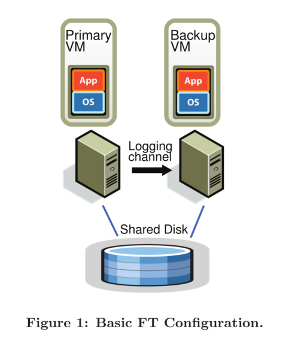
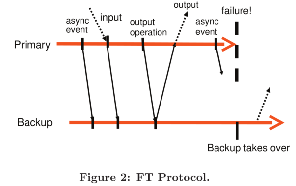

# Primary Backup Replication

## 背景

为实现可容错的服务器，主从备份是一种常用的解决方案：在开启了主动备份的系统中，备份服务器的状态需要在几乎任何时候都与主服务器保持一致，这样当主服务器失效后备份服务器才能立刻接管。实现主备间的状态同步主要包括以下两种方式：

- **State Transfer**（状态转移）：主服务器将状态的所有变化都传输给备份服务器。这样的方案会较为简单，但需传输的数据量较大
- **Replicated State Machine**（备份状态机）：将需要备份的服务器视为一个确定性状态机 —— 主备以相同的状态启动，导入相同的输入，最后它们就会进入相同的状态、给出相同的输出。这样的方案较为复杂，但需要传输的数据量会小很多

VMware 选用了状态机方法，因为对于虚拟机而言，其状态过于复杂，使用状态转移方法也不会简单多少。在虚拟机上应用备份状态机方法也会有一定的顾虑 —— 我们难以保证在虚拟机上运行的应用（即操作系统）是确定性的。实际上，在物理机上应用状态机方法是极其困难的，其所能接收到的输入很多都是不确定的（如定时器中断等），但虚拟机是运行在 Hypervisor（虚拟机管理程序）之上的抽象机器，通过 Hypervisor 这一隔离层便能很好地将非确定性的输入转变为确定性的输入（笔者注：这种将非确定转为确定的思路在数据库中也很常见，参考 MongoDB oplog）。

## Deterministic Replay

尽管目标很直白，但考虑到虚拟机的很多输入事件本身是不确定的，如时钟中断、网络中断和磁盘中断，这会为在虚拟机上实现状态机方法带来第一个挑战。这个问题可以被细分为三个问题：

1. 正确地捕获所有的输入事件以及它们的不确定性，以确保有足够地信息能够确定性地重放这些事件
2. 正确地在备份虚拟机上重放这些输入事件和不确定性
3. 保证性能不会因此降级

VMware 实现的主从备份方法名为 VMware vSphere Fault Tolerance，简称 VMware FT，它是基于 VMware Deterministic Replay 实现的。Deterministic Replay 解决了上面的前两个问题，而第三个问题则会由 VMware FT 来解决。

Deterministic Replay 会以日志记录的形式记录主服务器接收到的输入，这些日志信息则会由 VMware FT 传输到备份服务器并被重放。正如上面所提到的那样，真正的麻烦实际上来源于那些会产生不确定作用的输入。对于那些不确定的输入操作，Deterministic Replay 会记录足够多的信息，确保其在备份虚拟机上重新执行能够得到相同的状态和输出；而对于那些不确定的输入事件，如定时器、IO 操作完成中断等，Deterministic Replay 则会记录这些事件发生在哪个指令之后，这样在重放时备份服务器便能在指令流中相同的位置重放这些事件。

## VMware vSphere Fault Tolerance

由上节可见，Deterministic Replay 不过是一个可让虚拟机产生可重放日志信息的解决方案，单靠它是还不足以实现虚拟机主从备份的，而 VMware vSphere Fault Tolerance（简称 VMware FT）则是在使用 Deterministic Replay 为虚拟机生成日志信息的基础上实现了主备虚拟机间的同步备份。

首先我们先来看看 VMware FT 主从备份的架构：

如图所示，整个架构由一主一备组成，两个虚拟机运行在两个不同的物理机上，通过一个 Logging Channel 传输 Deterministic Replay 产生的日志信息，同时两个虚拟机都能访问一个 Shared Disk。

论文首先讲解了设计者对 VMware FT 的核心要求：

> **Output Requirement**: if the backup VM ever tasks over after a failure of the primary, the backup VM will continue executing in a way that is entirely consistent with all outputs that the primary VM has sent to the external world.
>
> **输出要求**：若在主虚拟机失效且由备份虚拟机接手后，备份虚拟机必须以一种与原主虚拟机已发送到外部的输出完全一致的方式运行

可见在发生故障切换后，VMware FT 并不要求备份虚拟机一定要以与主虚拟机完全一致的方式继续运行，只需要它能够一致地处理所有已经发出的输出即可。

为了实现这个核心要求，最简单的解决方案就是**延迟主虚拟机的输出操作，直到备份虚拟机已经接收到所有至少足以让它重放至该输出操作的所有日志信息**。要做到这一点，简单地确保备份虚拟机已接收到该输出操作之前的所有日志信息是不够的，因为如果主虚拟机在完成输出操作后立刻失效的话，备份虚拟机在重放该输出操作前仍可能出现其他不确定的事件（如计时中断）导致备份虚拟机进入其它执行路径。

为此，VMware FT 实现了如下功能：

> **Output Rule**: the primary VM may not send an output to the external world, until the backup VM has received and acknoledged the log entry associated with the operation producing the output.
>
> **输出规则**：主虚拟机必须延后将输出发送到外部世界的动作，直到备份虚拟机已经接收并 ack 与产生该输出的操作相关联的日志信息

由此，需要进行输出前，主备虚拟机间的时序关系大约是这样的：

值得注意的是，这项规则并不要求主虚拟机在接收到来自备份虚拟机的 ack 之前完全停止运行 —— 这项规则仅要求主虚拟机延迟输出操作。

由于 VMware FT 在处理与输出操作相关的日志时没有采用二阶段提交机制，VMware FT 并不保证输出是 Exactly Once 的。所幸的是，网络基础服务（如 TCP）通常能很好地处理重复的包，对磁盘同一位置的重复写入往往也不会有什么问题。

## 主从切换

首先，VMware FT 会使用两种不同的方式来检测虚拟机节点的失效事件：

1. 两个虚拟机所寄宿的物理机会相互之间发送 UDP 心跳信息，以判断对方是否仍存活
2. 持续监控 Logging Channel 上的流量：由于周期定时中断的存在，主虚拟机发往备份虚拟机的日志和备份虚拟机发往主虚拟机的 ack 应该是持续不断的，信息中断即意味着节点的失效

如果备份虚拟机失效，主虚拟机就会 go live，即退出日志记录模式，不再产生和发送日志信息，并以普通的方式继续运行；如果主虚拟机失效，备份虚拟机就会在消费完 Logging Channel 中的所有日志信息后升级为主虚拟机并 go live，开始对外界发送输出。

然而上述两种方案无法避免架构在主从虚拟机间发生网络隔离时出现 Split-Brain Syndrome（裂脑综合征，指在连接大脑左右脑的胼胝体受损到一定的程度后发生的因左右脑冲突导致的症状，在分布式系统领域指一个集群中存在多个 Master 角色所带来的问题）：主从虚拟机间的网络不通会导致备份虚拟机误以为主虚拟机已经宕机而自动升级为主虚拟机，导致集群中存在两个主虚拟机。

为了解决这个问题，无论主备，虚拟机在 go live 前首先会对存储在 Shared Disk 上的一个字段进行原子的 test-and-set 操作：如果操作成功，那么它便可以 go live；否则就意味着已经有另一个虚拟机 go live，它便会立刻关闭自己（形如因自身失效而导致另一个虚拟机 go live）。

## 需要考虑的问题

上一节中提到的只是 VMware FT 协议的核心设计。然而，为了确保该协议真实有用，还有其他的一些功能需要被添加进去。

### 虚拟机恢复

为了确保架构的高可用，VMware FT 在发生虚拟机失效后会自动地在另一台宿主机上启动备份虚拟机。如此便涉及到了另一个问题：**如何以与主虚拟机相同的状态启动一个虚拟机**。论文只中提到 VMware FT 用了 VMware VMotion 的变种来实现该功能，并未详细描述这一过程。感兴趣的同学可以参考[《Fast Transparent Migration for Virtual Machines》](http://ijcsonline.org/wp-content/uploads/2014/02/ysreenivasulu.pdf)一文。

除外，VMware vSphere 还实现了一个可以监控并管理集群资源的服务，可用于选取适合启动新虚拟机的宿主机。

### Logging Channel

首先，VMware FT 的 Logging Channel 会在发送和接收端启用 Buffer 机制来减少网络传输对虚拟机执行速度的影响。主虚拟机会在 Buffer 满时暂停运行，而备份虚拟机则会在 Buffer 空时暂停运行。

由于 Buffer 的存在，在某一时刻上，备份虚拟机有可能落后于主虚拟机。这样的延迟必然存在，但不宜过大，源于 Buffer 中堆积的数据不仅可能导致主虚拟机时常暂停运行，还会延长主虚拟机失效后备份虚拟机消费完所有日志并 go live 的耗时。要保证 Buffer 中不会产生过多的日志堆积，必须确保备份虚拟机的性能大于等于主虚拟机。为此，VMware FT 会采集每一条日志从发送到 ack 之间的延时，并动态地通过 Hypervisor 调整主虚拟机的 CPU 频率，最终确保主虚拟机以与备份虚拟机相近的速度运行。

## 论文 FAQ

> Q: Both GFS and VMware FT provide fault tolerance. How should we think about when one or the other is better?
>
> Q：GFS 和 VMware FT 都提供了容错性。我们该怎么比较它们呢？

FT 备份的是**计算**，你能用它为任何已有的网络服务器提供容错性。FT 提供了相当严谨的一致性而且对客户端和服务器都是透明的。例如，你可以将 FT 应用于一个已有的邮件服务器并为其提供容错性。

相比之下，GFS 只为**存储**提供容错性。因为 GFS 只针对一种简单的服务提供容错性，它的备份策略会比 FT 更为高效：例如，GFS 不需要让所有的中断都以相同的顺序应用在所有的 Replica 上。GFS 通常只会被用作一个对外提供完整容错服务的系统的一部分：例如，VMware FT 本身也依赖了一个在主备虚拟机间共享的有容错性的存储服务，而你则可以用类似于 GFS 的东西来实现这个模块（虽然从细节上来讲 GFS 不太适用于 FT）。

> Q: What is “an atomic test-and-set operation on the shared storage”?
>
> Q：论文中提到的“对共享存储的原子 test-and-set 操作”是什么？

意思就是说一个计算机可以在一个原子的操作中读取并且写入指定的磁盘块。如果两个计算机都调用了这个操作，那么两组读写操作不会交织在一起，而是其中一个计算机的读写操作会在另一个计算机的读写操作完成后再执行。

> Q: What happens if the primary fails just after it sends output to the external world?
>
> Q：如果主虚拟机在向外界进行输出后立刻就失效了会怎么样？

这个输出可能会执行两次：主虚拟机一次，备份虚拟机一次。对于网络和磁盘 IO 来说，这个重复不会产生任何问题。如果输出的是一个网络包，那么接收端的 TCP 栈会丢弃掉这个重复的包；如果是磁盘 IO，那么磁盘 IO 实际上是幂等的（两次操作会在同一个位置写入相同的数据，这之间也不会有其他的 IO）。

> Q: Is it reasonable to address only the fail-stop failures? What are other type of failures?
>
> Q：只去解决宕机失效的场景是合理的吗？还存在其他类型的失效吗？

这是合理的，因为现实世界中的多数失效本质上来讲都是宕机失效，例如各种网络失效和电源失效。要做到更好的话就需要处理那些似乎正在正常运行但其实正在产生错误结果的计算机 —— 在最坏的情况下，这样的失效可能是来源于一个恶意的攻击者。这类非宕机失效的失效通常被称为“拜占庭”（Byzantine）。我们实际上是有方法去应对拜占庭失效的，我们会在这节课的末尾学习这些方法，但 6.824 的主要内容还是关于宕机失效。

译者注：关于更多类型的失效，可参考[《Failure Modes in Distributed Systems》](http://alvaro-videla.com/2013/12/failure-modes-in-distributed-systems.html) 一文。

## 结语

鉴于虚拟机和计算机底层原理不是我所感兴趣的内容，论文 3.3 节以后的内容我也只是简单地浏览了一遍，这篇文章中也没有总结这些内容，有兴趣的读者可自行查阅论文的原文。

尽管如此，此文仍然是主从备份话题的一次不错的 case study，也确实系统地描述和对比了 Primary-Backup Replication 两种常见的解决思路。稍微了解过市面上常用的数据库系统的同学就会了解，主从备份可以说是数据库系统必备的高可用方案之一。论文第一章的背景部分讲述了目前常用的两种主从备份方法，课程资料中也稍微对比了一下两种方案的优缺点，尽管目前常见的数据库备份方式所使用的几乎都是这两种方案的结合（如 Redis、MongoDB）。即便如此，通过此次 case 来系统地学习主从备份的相关理论也是十分不错的。

# 参考文章

[Primary-Backup Replication 总结](https://mr-dai.github.io/primary-backup-replication/)

[Primary/Backup Replication](https://zhenghe.gitbook.io/open-courses/mit-6.824/di-san-ke-zhu-cong-fu-zhi)

