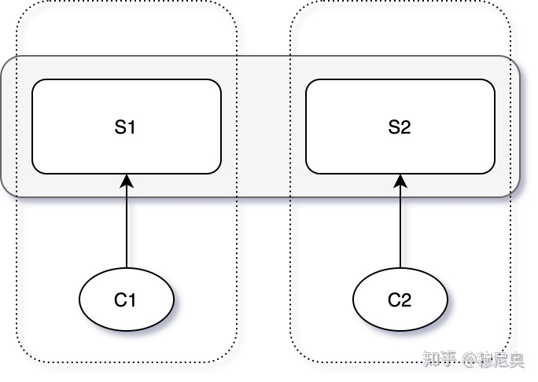
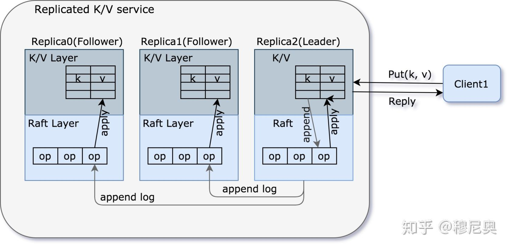
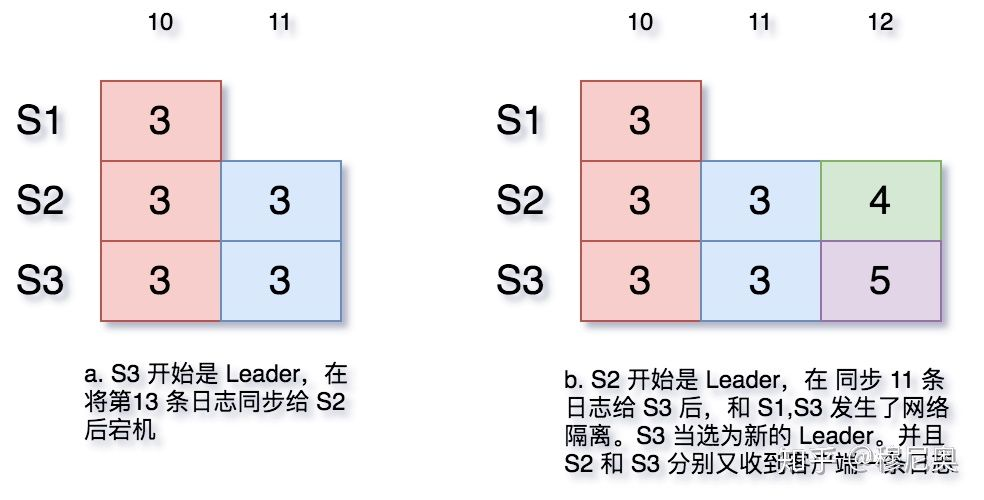

# Fault Tolerance - Raft 1

## 容错模式

我们已经学习了以下几种容错模式（fault-tolerance pattern）：

- 计算冗余：MapReduce，但是所有计算由单点 Master 进行调度。
- 数据冗余：GFS，也是依赖单点 Master 来对多个副本进行选主。
- 服务冗余：VMware-FT 依赖单个 TestAndSet 操作

可以看出他们都依赖单个组件来做一些关键决策。这样做的好处在于，单个组件不需要共识算法，不会产生不一致；不好的地方在于，该组件成为系统中的一个单点。当然，上述系统已经将单点问题压缩到了一个很小的部分，那么接下来，我们将进一步用一种共识算法——Raft，来将最后这个硬骨头啃下来。

## Split Brain

共识算法中最大的问题在于——如何避免 **Split Brain**。

那么 Split Brain 是如何产生的，其危害性为什么很大？

假设我们要对 test-and-set 服务进行备份。test-and-set，简而言之，就是一个锁服务。当多个 Client 同时请求服务时，只有其中一个能通过 Test（测试是否为0），获取锁，并设置 Server 状态为 1，则其他 Client 测试不能通过，从而不能获取锁。

考虑有以下四个系统角色：[C1, C2, S1, S2]，S1 和 S2 组成一个双备份的、可容错的系统，C1 和 C2 是使用此系统的客户端。假设 C1 可以和 S1 通信，但是与 S2 失联。那在只有 S1 的情况下，系统能够给 C1 正常提供服务么？

1. 如果 S2 真的宕机了，系统应当在 S2 缺席的情况下正常工作，否则系统就不能称之为是容错的（fault-tolerance）。
2. 如果 S2 没有宕机，但是和 C1 失联了。则系统不能够给 C1 提供服务，因为 S2 可能正在给 C2 提供服务，如果让 S1 同时给 C1 服务，则会造成系统状态不一致，从而使服务出错：C1 和 C2 同时获取到锁。




在此种情况下，我们面临一种选择的困境：

1. 要么不提供容错保证，尽管我们使用了双备份服务器。
2. 要么仍然回复客户端请求，但由于 Split Brain 可能会发生，不保证一致性。

但问题在于，服务器 S1 无法区分 S2 是失联了（"server crashed"）还是网络故障了（network broken）。因为在这两种情况下，S1 看到的现象是一样的：向 S2 的请求得不到回复。S1 能够和 C1 通信，S2 能够和 C2 通信；但是 S1+C1 收不到 S2+C2 的回复，我们称这种情况为出现了**网络分区**（network partitionn）。

网络分区可能会持续很久，可能需要引入一个外力（比如说运维人员），来判断何时网络可信、何时服务器可信，才能打破僵局。那我们如何可以将容错做到自动化？答曰：**多数票原则**（majority vote）。

## 多数票原则

多数票原则，要求系统集群包含奇数个服务器，以此来避免出现**同票困境**（symmetry）。如上面只有两个服务的情况，两方各执一词，就很难决定以谁为准。

在有奇数个服务器的系统中，我们只要获取多数票就可以保持系统正常运转，而不会陷入同票僵局（如 Raft 中的主选举、提交日志条目等）。多数票原则能够打破僵局，其原理也很简单：*不可能出现一个以上同时包含多数服务器的分区*。需要注意的是，这里的多数指的是构成系统所有的服务器的多数，而非存活服务器的多数。

如果集群由 2f + 1 个服务器构成，最多能够承受 f 个服务器宕机，而仍能对外提供服务。

多数票原则还有一个重要的性质就是，*任何两个投出多数票的集群必定相交*。如在 raft 中，前后相继的两次 Leader 选举所涉及到的投票集群肯定有交集，因此下一轮能够通过相交部分获取上一个 term 的决策信息（包括上一轮的 term 和上一轮的 commit 信息）。

上世纪九十年代左右，出现了两个算法 Paxos 和 View-Stamped Replication （VSR，MIT提出的），使用多数票原则来解决 Split-brain 问题。虽然现在前者更广为人知，但是后者在思想上与 Raft 更为接近。

## Raft 概览

Raft 一般表现为库的形式，运行在在每个副本（replica）服务器上，对**多副本状态机** （replicated state machine） 进行管理，主要负责对操作日志的同步。基于此，我们可以进一步构建可靠的 KV 存储层，主要负责状态的存储。





上图表现了一个典型的客户端与键值对服务的交互流程：

1. 客户端发送 "Put/Get" 请求到 Leader 的 k/v 层
2. Leader 将该请求转换为 Command（包括动作和参数），追加到本机日志文件中
3. Leader 通过 AppendEntries RPC 将该 Command 同步给 Followers
4. Followers 将该 Command 追加到本机日志文件中
5. Leader 等待包含自己内的多数 Server 回复
6. 获取多数Server 回复后，Leader 就会提交 Command 对应日志条目。提交意味着该 Command 条目不会被删除，即使部分服务器宕机后，仍然能够被下一轮次 Leader 所继承
7. Leader 执行该 Command，将其应用到状态机，然后回复给客户端
8. 在下一次执行 AppendEntries RPC 时，Leader 将捎带 commit 信息（即 commit 到的操作日志中的 offset）同步给各个 Followers
9. Followers 在收到 commit 信息后，将对应 Command 应用到状态机

### 操作日志

那么为什么要使用操作日志这种形式对用户的请求操作（Command）进行记录呢？

1. Leader 使用日志来决定 Command 的顺序。使得所有副本就请求（尤其是大量几乎同时到达的请求）顺序达成一致、并且保有同样顺序的日志条目。在这种情况下，日志充当一个带锁的队列
2. 暂存 Command 以备稍后 commit 之后进行提交
3. 保存 Command 以备由于网络/服务器异常导致 Leader 需要再次发送给 Follower
4. 服务器重启后进行状态重建

Q&A：

1. 如果请求过快，但是日志 append 速度不够怎么办？

因此一般不用 raft 做高并发中间件。基于这种假设，如果真遇到这种情况，可以限制 Leader 的请求处理速度。

每个服务器在重启时，并不立即执行日志中的 Command，因为他并不知道哪些已经被提交了（提交点没有被持久化），需要后面 Leader 告诉他。

### Raft 接口

Raft 对 KV 层提供的接口主要有两个：`Start(command)`，`ApplyMsg->ApplyCh`。

```
Start(command) (index, term, isleader)
```

Start 只在 Leader 上调用才有效，其含义在于让多数服务器在一个新的日志条目（Log Entry，其中包含 Command ）上达成一致。主要有以下几步：

1. Leader 将 Command 追加到本地日志中
2. 向各 Follower 发送 AppendEntries RPC
3. Start() 立即返回（给 k/v 层）而不等待各个 Follower 的回复（**异步**）
4. k/v 层需要监听 applyCh 以确定该 Command 是否被提交 （commit）

返回值有三个：

1. index：Command 将会被提交到的日志位置
2. term：Leader 的当前任期
3. isleader：如果其值为 false，则客户端需要尝试其他服务器直到试到 Leader。

```
ApplyMsg->ApplyCh
```

**ApplyMsg**，包含 Command 和 Index 两个字段；**applyCh**，k/v 监听 raft commit 后发来的 ApplyMsg 的 channel

1. 系统中每个服务器对于每个*提交了的*日志条目都要发送一个 ApplyMsg 给 applyCh
2. 系统中每个服务器，获取到 ApplyMsg 后，将其中的 Command 更新到本地状态机
3. Leader 负责回复请求给客户端（在对应日志条目 commit 之后）

在某个时刻，系统中的每个服务器的日志条目并不一定完全一致，比如说在 Leader 同步日志条目的过程中宕机了，那么 Leader 包括部分 Followers 已经追加了该日志条目，而另外的 Followers 没有收到该日志条目，此时系统中的每个服务器的的日志条目产生了分叉。

但好消息是，所有服务器的日志条目最终会被新的 Leader 统一。

## Leader 选举

说到 Leader 选举，首先需要思考的一个问题是：Leader 是必须的吗？我们必须得有一个 Leader 才能够完成所有服务器上的日志同步么？答案是否定的，比如 Paxos。

那为什么 Raft 会采取 Leader 做法呢？原因有很多，其中一个是，在系统和网络正常工作的情况下，有 Leader 做决策能够使得系统更为高效；客户端每次请求至多两次（第一次得到 Leader 位置，第二次向 Leader 发送请求）。

### 任期（term）

Raft 对 Leader 的序列进行了标号，即**任期**（term）：

1. 新 Leader 意味着新任期
2. 一个任期最多有一个 Leader，也可能没有 Leader
3. 任期帮助 Followers 追随最新的 Leader，而不是已经下台的 Leader

### 选举（election ）

当 Follower 在一定时间间隔（Raft 称之为选举**选举超时**，election timeout，具体实现时，我们会使用一个 election timer）内没有收到当前 Leader 的心跳信息，就会将将自己的 term 加一（因为一个 term 内不允许出现两个 Leader，因此只有先增加任期计数，才有可能在新的任期当选为新的 Leader），并且自封候选人，向自己投一票，然后向其他服务器进行要票。

需要注意的是：

1. 这个过程可能会引起不必要的选举，比如说某个服务器暂时与 Leader 失联，超过 election timeout 之后，发起选举，此时又连上了 Leader，则其会将整个集群带入新的任期，使得原来 Leader 失效。这种做法虽然有时候效率不高，但是很安全
2. 老的 Leader 可能还活着，并且认为自己是 Leader。比如发生了网络分区，Leader 被分到了少数服务器分区中，而多数服务器分区选出了新的 Leader。则老的 Leader 仍然会认为自己是 Leader，并且尝试行使 Leader 职能，比如接收客户端请求，并且尝试同步日志条目，但由于不可能获取多数回应，因此不可能 commit 进而回复客户端

Q&A：

如果网络发生了某种神奇的故障，只能单向通信，即 Leader 能够发送心跳给 Followers，抑制他们发起选举；但是却不能收到 Client 的请求。这种情况下 Raft 还能正常工作吗？

的确不能了，但是可以通过一些小手段来解决这个问题。比如说双向心跳，来及时排除这种"半连接"的服务器。

### Leader 和任期

那么如何保证在某个任期最多选出一个 Leader 呢？

1. 必须得到集群服务器的半数票以上才能成为 Leader
2. 每个服务器在每个 term 内，最多投出一票
3. 如果是 Candidate，无脑投自己
4. 如果不是 Candidate，投给第一个要票（且符合一定条件，下一节会提到）的 Candidate

并且，当发生网络分区时，仍然能保证最多有一个 Leader；即使有少量的服务器宕机，仍然能够正常选出 Leader。

### Leader 心跳

Candidate 通过获取多数票后当选为 Leader，但此时只有 Leader 自己知道自己是 Leader，而其他服务器无从得知。因此需要通过心跳，将此选举结果广播给其他服务器。收到心跳的服务器如果发现心跳 term 比自己的大，从而就认可该 Leader 为此 term 的 Leader，并且将自己所处 term 更新为 Leader term，然后变为 Follower。

此后，Leader 通过不断的心跳来抑制 Followers 转变为 Candidate，即抑制其他服务器发起选举。这也就要求 Leader 的心跳周期要比 election timeout 要小。

### 平票

在某个 term 内，有两种情况会导致选不出 Leader：

1. 没有任何多于半数的服务器互相可达
2. 多个 Candidate 同时发起选举，并且都没有获得多数票

为了避免多个 Candidate 不断的同时发起选举，同时超时而进入下一个 term，然后再次同时选举的死循环，Raft 引入随机值，即每个服务器的每次 election timeout 不是一个固定值，而是某个范围内的一个随机值。这样在某次选举撞车后，由于 election timeout 选择的不同，下一次发起选举就必然会错开。当然光错开还不行，必须错开的足够多，保证某个 Candidate 在其他服务器超时前，就开始对其发起投票，从而避免再次选举撞车。

### 选举超时

那么如何挑选 election timeout 呢？

1. 其最小值最好要大于几倍的（两个以上）心跳间隔；因为网络偶尔会丢包，从而导致丢掉某些心跳，进而引起不必要的选举
2. 随机区间尽可能的大，以使最快超时变成 Candidate 的服务器能及时向其他服务器发起选举，并成为 Leader
3. 但又不能过长，以防止系统失去 Leader 时，长时间陷入停顿
4. 在我们的实验中，过长会使得测试过不了（测试程序对选出 Leader 的过程是与时限要求的）

### 老的 Leader

当发生了网络隔离，Leader 和少数服务器被隔离到了一个分区，那么剩下的多数节点就会选出新的 Leader。如果老的 Leader 不能感受到新的 Leader 的产生，会出现什么问题吗？

1. 老的 Leader 不会提交任何日志条目，因为他不能让多数 Follower 同步日志条目
2. 虽然不会提交，但是部分服务器会接收老的 Leader 的日志条目，由此造成集群中服务器间的日志分歧

### 日志分歧

当系统一切运作正常时，情况很简单，Followers 只需要单方面的接受 Leader 同步给他的日志条目即可。但是当出现了异常，比如 Leader 只给集群中的部分机器同步了日志，然后宕机了，此时系统该如何往下进行？



当然，在上图 a 中，第 11 条日志可能被老 Leader 提交了，也可能没有。但是新的 Leader 如果无从得知，就只等根据多数票原则（有半数以上的服务器有该日志条目）当做其提交了。

# 参考资料

[6.824 2020 视频笔记六：Fault Tolerate Raft 1](https://zhuanlan.zhihu.com/p/140967467)

[Raft论文中文翻译](https://github.com/maemual/raft-zh_cn)

