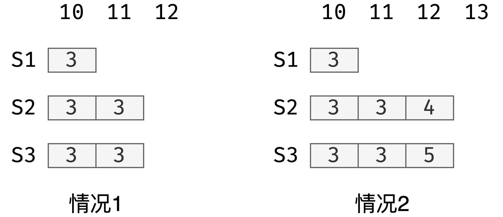
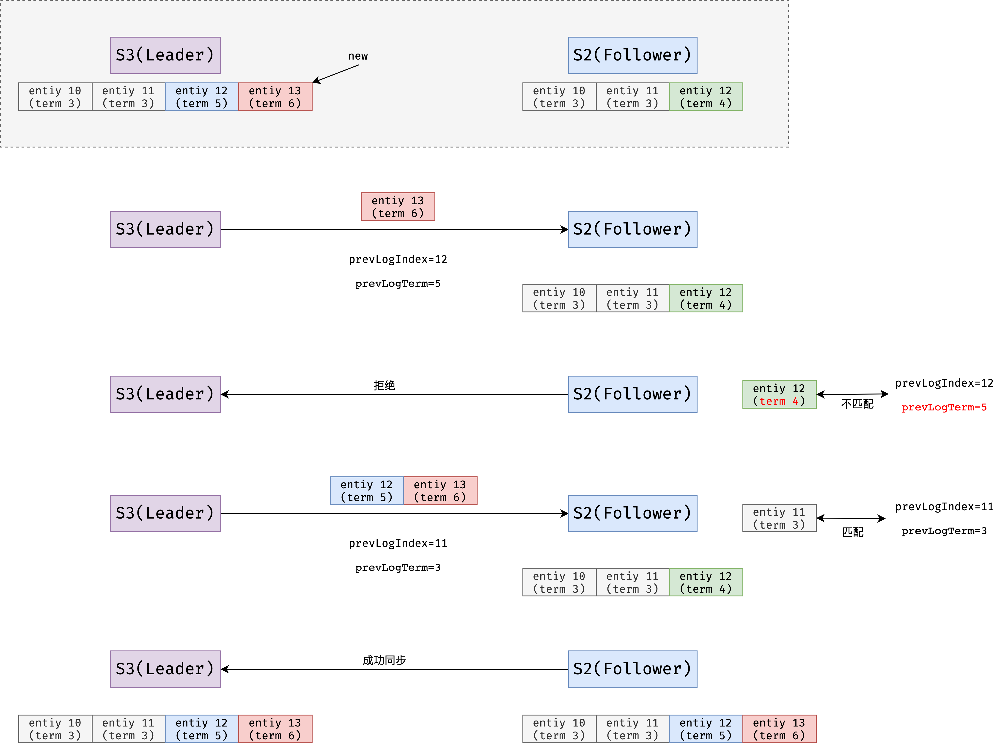
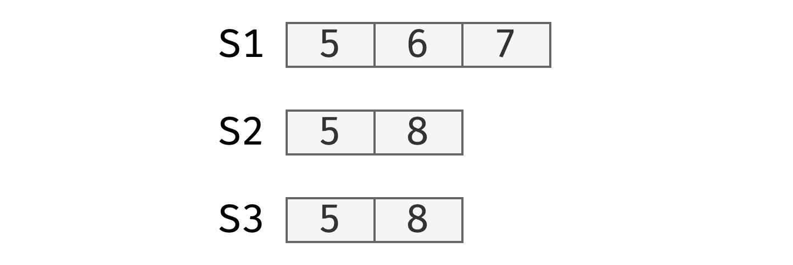
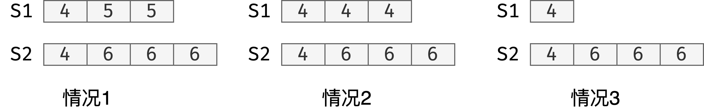

# Fault Tolerance - Raft 2

## 崩溃后数据不一致

情况1: `leader`崩溃前将`AppendEntries`发送给所有节点

情况2: 在同一个位置出现不同的`log`(**一种较坏的情况**)

`Raft`将会强行使`followers`与`leader`同步，`S3`向`S2`同步过程如下所示

1、`S3` 被选做新的`leader`，`term`为`6`

2、`S3`发送一个`AppendEntries`在`log entiy 13`上，同时带上上一个`log`的信息：`prevLogIndex=12` 、`prevLogTerm=5`

3、`S2`回复拒绝

4、将`nextIndex[S2]` 减`1`为`12`

5、`S3` 发送一个`AppendEntries`在`log entiy 12 + 13`上，同时带上上一个`log`的信息：`prevLogIndex=11` 、`prevLogTerm=2`

6、`S2`删除自己的`log entry 12`并保持与`S3`一致

`S1`的同步的过程与之类似

## Leader的选择

为什么不选择`log`最长的机器作为`Leader`?

虽然`S1`的`log`记录最长，但是`6`和`7`的两次提交均未提交，而`S2`的`8`已提交

### 选举限制

`RequestVote`处理程序仅对`“at least as up to date”`的候选人投票：

1、候选人在上一条日志中具有较高的`term`

2、候选人的具有相同的`term`，时长相同或更长`log`

> 所以上述案例，S2 和S3不会投票给S1，S2与S3会互相投票

## Fast Backup（快速备份）

`S2`作为`leader`其`term`为`6`，`S1`刚从崩溃中恢复过来，`S2`向`S1`发送一次`AE`。

从`S1`返回的信息还包括以下：

`XTerm`：发生冲突的`term`

`XIndex`：发送冲突的`term`对应的第一个`index`

`XLen`：log的长度

`Case 1`：`nextIndex` = `XIndex`  **（S2中有Xterm）**

`Case 2`：`nextIndex` = `S2`的最后一次`XTerm`提交 **（S2中没有Xterm）**

`Case 3`：`nextIndex` = `XLen`  **(S1的log长度)**

## 持久化

有哪些变量是需要持久化的：

`Log[]`,`CurrentTerm`,`votedFor`

类似与`GFS`中的`SnopShot`

## 线性一致性

# 参考文档

[https://youjiali1995.github.io/raft/etcd-raft-client-interaction/](https://youjiali1995.github.io/raft/etcd-raft-client-interaction/)

[https://pingcap.com/blog-cn/linearizability-and-raft/](https://pingcap.com/blog-cn/linearizability-and-raft/)

[https://zhuanlan.zhihu.com/p/42239873](https://zhuanlan.zhihu.com/p/42239873)

[http://kaiyuan.me/2018/04/21/consistency-concept/](http://kaiyuan.me/2018/04/21/consistency-concept/)