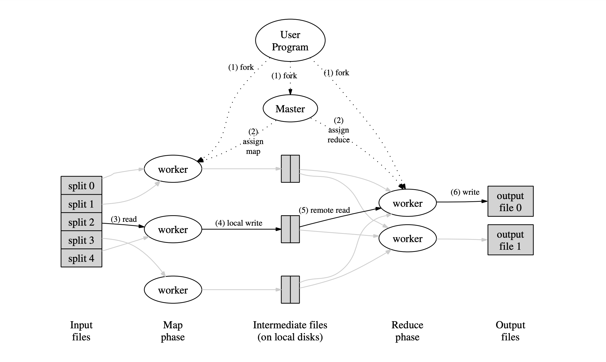
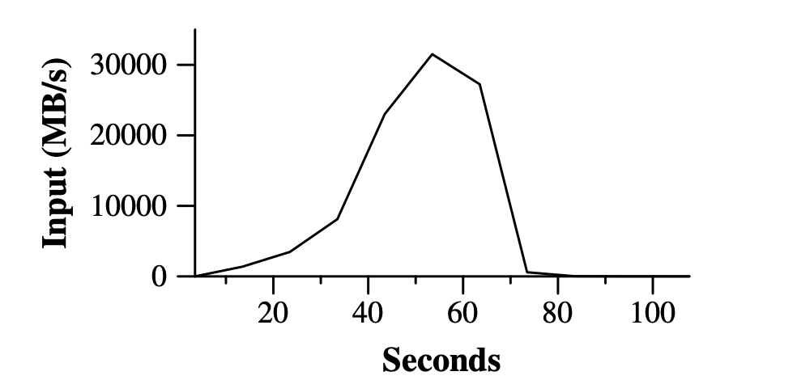
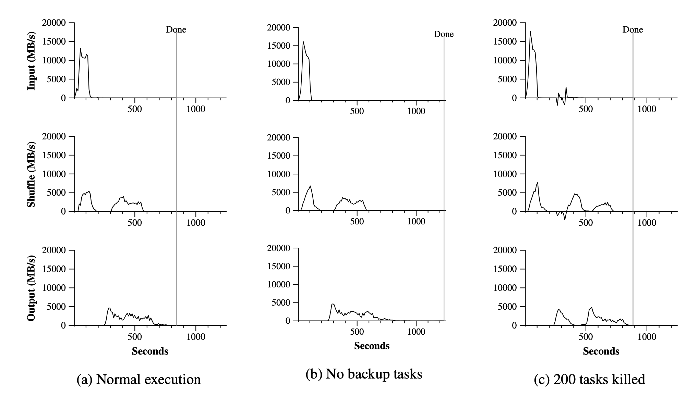
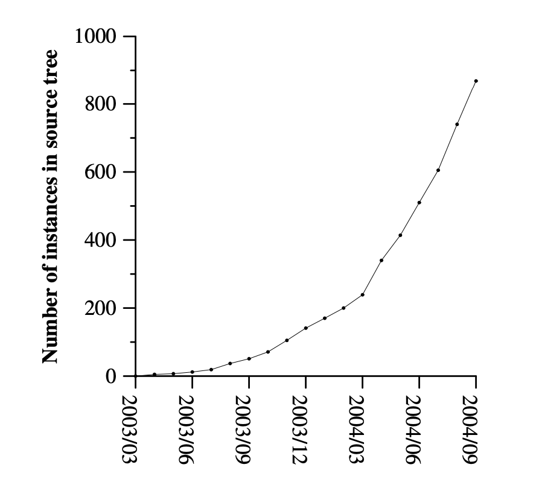
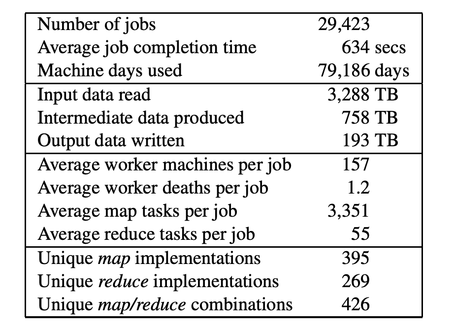

# MapReduce：在大型集群上简化数据处理

## 概要

MapReduce是一种编程模型，它是一种用于处理和生成大型数据集的实现。用户通过指定一个用来处理键值对(Key/Value)的map函数来生成一个中间键值对集合。然后，再指定一个reduce函数， 它用来合并所有的具有相同中间key的中间value 。现实生活中有许多任务可以通过该模型进行表达，具体案例会在论文中展现出来。

以这种函数式风格编写的程序能够在一个大型商用机器集群上自动并行执行。这个系统在运行时只关心：如何分割输入数据，在大量计算机所组成的集群上的调度问题，集群中计算机的故障处理，管理集群中计算机之间的必要通信。使用MapReduce编程模型可以让那些没有并行计算和分布式系统开发经验的程序员有效的使用分布式系统的资源。

我们实现的MapReduce可以在一个大型的商用计算机集群上运行，并且具备高度扩展性：一个标准的MapReduce计算可以在数千台机器上处理TB级的数据。程序员会觉得该系统易于使用。目前在谷歌已经实现了数以百计的MapReduce程序，在谷歌的集群上，每天都有1000多个MapReduce的工作在执行。

## 1 简介

在过去五年里，作者以及许多其他在谷歌工作的人已经实现了数百种用于特殊目的的计算。它们可以用来处理大量原始数据，例如：爬取的文档，网页请求日志等等。并以此来计算出各种衍生数据，例如：倒排索引，Web文档的各种图表示，每台主机所抓取页面数的摘要，以及特定某天中最频繁的查询集等等。大部分这种计算从概念上来讲都很简单。但是，输入的数据量通常非常巨大，并且为了能在一个合理的时间内完成，计算任务也不得不分配给成百上千台机器去执行。如何并行化计算，分配数据以及处理故障的问题，所有的问题都纠缠在一起，这就需要大量的代码来对它们进行处理。因此，这也使得原本简单的计算变得极为复杂，而且难以处理。

为了应对这种复杂性，我们设计了一种新的抽象，它可以让我们表达我们所试图执行的简单计算，但该库中隐藏了并行化，容错，数据分发以及负载均衡这些混乱的细节。我们这种抽象的设计灵感来源于Lisp和许多其他函数式语言中存在的map和reduce原语。我们意识到，大多数计算都涉及到对输入中的每个逻辑记录进行*map*操作，以便于计算出一个中间键值对的集合。然后，为了恰当的整合衍生数据，我们对共用相同键的所有值进行*reduce*操作。通过使用具备用户所指定的*map*和*reduce*操作的函数式模型，这使得我们能够轻松并行化大型计算，并且使用重新执行的结果作为容错的主要机制。

这项工作的主要贡献在于提供了一个简单而强大的接口，该接口可实现大规模计算的自动并行化和分布式执行。通过使用该接口的实现，从而在大型商用计算机集群上获得了高性能。

本文的第2章节描述了该基础编程模型并给出了一些案例。第3章节则是关于我们针对集群的计算环境所量身定制的MapReduce接口的实现。第4章节介绍了我们所找到的对于该编程模型的一些有用改进。第5章节则是关于我们通过一系列任务对我们所实现的MapReduce进行的性能测试。第6章节则探索了MapReduce在谷歌中的一些应用，这其中包括了我们使用它来重写我们的索引系统的一些经验。第7章节讨论了一些相关以及日后要做的工作。

## 2 编程模型

该计算任务将一个键值对集合作为输入，并生成一个键值对集合作为输出。MapReduce这个库的用户将这种计算任务以两个函数进行表达，即**Map**和**Reduce**。

由用户所编写的**Map**函数接收输入，并生成一个中间键值对集合。MapReduce这个库会将所有共用一个键的值组合在一起，并将它们传递给**Reduce**函数。

**Reduce**函数也是由用户所编写。它接受一个中间键以及该键的值的集合作为输入。它会将这些值合并在一起，以此来生成一组更小的值的集合。通常每次调用**Reduce**函数所产生的值的结果只有0个或者1个。中间值通过一个迭代器来传递给用户所编写的**Reduce**函数。这使我们可以处理这些因为数据量太大而无法存放在内存中的存储值的list列表了。

### 2.1 案例

我们可以思考下这样一个场景，我们要从大量的文档中计算出每个单词的出现次数。用户将会编写出类似于下方伪代码的代码：

```c
map(String key, String value):
    // key: document name
    // value: document contents
    for each word w in value:
        EmitIntermediate(w,"1");
reduce(String key, Iterator values):
    // key: a word
    // values: a list of counts
    int result = 0;
    for each v in values:
        result += ParseInt(v);
    Emit(AsString(result));
```

map函数会返回一个单词加上它出现的次数的键值对（在这个例子中，返回的出现次数就是1）。reduce函数会将该单词的出现次数统计在一起。

此外，用户通过编写代码，传入输入和输出文件的名字，以及可选的调节参数来创建一个符合MapReduce模型规范的对象。接着，用户调用***MapReduce\***函数，并将这个对象传入该函数。用户的代码和MapReduce库（该库是由C++实现的）链接在一起，附录A中会提供该案例的完整代码。

### 2.2 类型

尽管在前面的伪代码中的输入和输出的类型都是String，但是从概念上来说，用户所提供的map和reduce函数都有相关联的类型。

map (k1,v1) --> list(k2,v2)
reduce (k2,list(v2)) --> list (v2)

例如，输入的键和值与输出的键和值来自于不同的地方。此外，中间的键和值与输出的键和值在类型上相同。

在我们的C++实现中，我们使用String类型作为用户所定义的函数的输入和输出的类型，用户在自己的代码中对字符串进行适当的类型转换。

### 2.3 更多案例

此处有一些可以很容易使用MapReduce模型来表示的简单例子：

**分布式Grep**：Map函数会输出匹配某个规则的一行。Reduce函数是一个恒等函数，即把中间数据复制到输出。（注：恒等函数是数学中是一种没有任何作用的函数，它的输入等于输出，即f(x)=x）。

**计算URL的访问频率**：map函数用来处理网页请求的日志，并输出(URL,1)。reduce函数则用于将相同URL的值全部加起来，并输出(URL, 访问总次数)这样的键值对结果。

**倒转网络链接图**：map函数会在源页面中找到所有的目标URL，并输出<target, source>这样的键值对。reduce函数会将给定的目标URL的所有链接组合成一个列表，输出<target, list(source)>这样的键值对。

**每台主机上的检索词频率**：term（term其实指搜索系统里某一项东西，这里指检索词）vector（就是一个数组）将一个文档或者是一组文档中出现的最重要的单词概括为 **<单词，频率>** 这样的键值对列表，对于每个输入文档，map函数会输出这样一对键值对 **<hostname, term vector>**（其中hostname是从文档中的URL里提取出来的）。Reduce函数接收给定注定的所有文档的检索词vector。它会将这些检索词vector加在一起，并去除频率较低的检索词，然后输出一个最终键值对 **<hostname, term vector>**。

**倒排索引**：map函数会对每个文档进行解析，并输出<word, 文档ID>这样的键值对序列。reduce函数所接受的输入是一个给定词的所有键值对，接着它会对所有文档ID进行排序，然后输出<word, list(文档ID)>。所有输出键值对的集合可以形成一个简单的倒排索引。我们能简单的计算出每个单词在文档中的位置。

**分布式排序**：map函数会从每条记录中提取出一个key，然后输出<key, record>这样的键值对。reduce函数对这些键值对不做任何修改，直接输出。这种计算任务依赖分区机制（详见章节4.1）以及排序属性（详见章节4.2）。

## 3 实现

MapReduce模型可以有多种不同的实现方式。如何正确选择取决于具体环境。例如某种实现可能适用于一台小型共享内存型机器，另一种实现方式则适用于大型NUMA架构的多核处理器机器上。然而，有的实现方式可能更适合大型的基于网络的机器集群。

本节所介绍的是一个针对在谷歌内部所广泛使用的计算环境下使用的实现：通过以太网交换机连接，并由商用服务器所组成的大型集群。我们的环境配置如下：

1. x86架构，Linux系统，双处理器，每台机器的内存为2-4GB
2. 商用网络硬件——通常它们的网速为100Mbit/s或者是1000Mbit/s, 但是远小于网络的平均带宽的一半。
3. 集群由成百上千台机器所组成，因此，机器故障是常有的事情。
4. 存储设备则是廉价的IDE硬盘。通过一个内部的分布式文件管理系统来管理这些硬盘上的数据。该文件系统通过使用数据复制来在不可靠的硬件上保证数据的可用性和有效性。
5. 用户提交工作给调度系统。每项工作包含了一系列任务，调度系统将这些任务调度到集群中多台可用的机器上来进行。

### 3.1 执行概述

通过将传入Map函数的输入数据自动切分为M个数据片段的集合，这样就能将Map操作分布到多台机器上运行。输入数据的片段可以在不同的机器上进行并行处理。使用分区函数将Map函数所生成的中间key值分成R个不同分区（例如，**hash(key) mod R**），这样就可以将Reduce操作也分布到多台机器上并行处理。分区数量R和分区函数则是由用户指定。





figure1

Figure 1展示了我们所实现的MapReduce操作的整体工作流程。当用户程序调用MapReduce函数时，将会发生下面一系列的动作（下面的序号与图中的序号一一对应）。

1. 用户程序中的MapReduce库会先将输入文件切分为M个片段，通常每个片段的大小在16MB到64MB之间（具体大小可以由用户通过可选参数来进行指定）。接着，它会在集群中启动许多个程序副本。
2. 有一个程序副本是比较特殊的，那就是master。剩下的副本都是worker，master会对这些worker进行任务分配。这里有M个Map任务以及R个Reduce任务要进行分配。master会给每个空闲的worker分配一个map任务或者一个reduce任务。
3. 被分配了map任务的worker会读取相关的输入数据片段。它会从输入数据中解析出键值对，并将它们传入用户定义的Map函数中。Map函数所生成的中间键值对会被缓存在内存中（知秋注：用户自定义的map函数只是中间的一环而已，我们其实可以将这个map看作map(K,V,BiFunction>) K是文件名，V是文件内容，BiFunction就是我们自己定义的map规则）。
4. 每隔一段时间，被缓存的键值对会被写入到本地硬盘，并通过分区函数分到R个区域内。这些被缓存的键值对在本地磁盘的位置会被传回master。master负责将这些位置转发给执行reduce操作的worker。
5. 当master将这些位置告诉了某个执行reduce的worker，该worker就会使用RPC的方式去从保存了这些缓存数据的map worker的本地磁盘中读取数据。当一个reduce worker读取完了所有的中间数据后，它就会根据中间键进行排序，这样使得具有相同键值的数据可以聚合在一起。之所以需要排序是因为通常许多不同的key会映射到同一个reduce任务中。如果中间数据的数量太过庞大而无法放在内存中，那就需要使用外部排序。
6. reduce worker会对排序后的中间数据进行遍历。然后，对于遇到的每个唯一的中间键，reduce worker会将该key和对应的中间value的集合传入用户所提供的Reduce函数中。Reduce函数生成的输出会被追加到这个reduce分区的输出文件中。
7. 当所有的map任务和reduce任务完成后，master会唤醒用户程序。此时，用户程序会结束对MapReduce的调用。

在成功完成任务后，MapReduce的输出结果会存放在R个输出文件中（每个reduce任务都会生成对应的文件，文件名由用户指定）。一般情况下，用户无需将这些文件合并为一个文件。他们通常会将这些文件作为输入传入另一个MapReduce调用中。或者在另一个可以处理这些多个分割文件的分布式应用中使用。

### 3.2 Master的数据结构

在Master中包含了一些数据结构。它保存了每个Map任务和每个Reduce任务的状态（闲置，正在运行，以及完成），以及非空闲任务的worker机器的ID。

master就像是一个喷泉（知秋注：管理了一堆喷口，数据准备好就喷到需要接收的地方），它将map任务所生成的中间文件区域的位置传播给reduce任务。故，对于每个完成的map任务，master会保存由map任务所生成的R个中间文件区域的位置和大小。当map任务完成后，会对该位置和数据大小信息进行更新。这些信息会被逐渐递增地推送给那些正在运行的Reduce工作。

### 3.3 容错

因为MapReduce库的设计旨在使用成百上千台机器来处理海量的数据，所以该库必须能很好地处理机器故障。

### Worker故障

master会周期性ping下每个worker。如果在一定时间内无法收到来自某个worker的响应，那么master就会将该worker标记为failed。所有由该worker完成的Map任务都会被重设为初始的空闲（idle）状态。因此，之后这些任务就可以安排给其他的worker去完成。类似的，在一台故障的worker上正在执行的任何Map任务或者Reduce任务也会被设置为空闲状态，并等待重新调度。

当worker故障时，由于已经完成的Map任务的输出结果已经保存在该worker的硬盘中了，并且该worker已经无法访问，所以该输出也无法访问。因此，该任务必须重新执行。然而，已经完成的Reduce任务则无需再执行，因为它们的输出结果已经存储在全局文件系统中了。

当一个Map任务由worker A先执行，但因为worker A故障了，之后交由worker B来执行。所有执行Reduce任务的woker就会接受到这个重新执行的通知。任何还没有从worker A中读取数据的Reduce任务将从worker B中读取数据。

MapReduce能够处理大规模worker故障。例如，在一次MapReduce操作期间，在某个正在运行的集群上进行网络维护会导致80台机器在几分钟中无法访问。MapReduce的master只需要简单地将这些由不可访问的worker机器所完成的任务重新执行一遍即可。之后继续执行未完成的任务，直到最后完成这个MapReduce操作，

### Master故障

一个简单的解决好办法就是让master周期性的将上文所描述的数据结构写入磁盘，即checkpoint。如果这个master挂掉了，那么就可以从最新的checkpoint创建出一个新的备份，并启动master进程。然而，因为只有一个master，所以我们并不希望它发生故障。因此如果master故障了，我们目前的实现会中断MapReduce计算。客户端可以检查该master的状态，并且根据需要可以重新执行MapReduce操作。

### 出现故障时的语义（semantics in the presence of failures）

当用户提供的map和reduce运算符是确定性函数时，我们所实现的分布式系统在任何情况下的输出都和所有程序在没有任何错误、并且按照顺序生成的输出是一样的。

我们依赖于map任务和 reduce任务输出的原子性提交来实现这个特性。每个正在执行的任务会将它的输出写入到私有的临时文件中去。每个Reduce任务会生成这样一个文件，每个Map任务则会生成R个这样的文件（一个Reduce任务对应一个文件）。当一个map任务完成时，该map任务对应的worker会向master发送信息，该信息中包含了R个临时文件的名字。如果master从一个已经完成的map工作的worker处又收到这个完成信息，master就会将该信息忽略。否则，它会将这R个文件名记录在master的数据结构中。

当Reduce任务完成时，reduce worker会以原子的方式将临时输出文件重命名为最终输出文件。如果多台机器执行同一个reduce任务，那么对同一个输出文件会进行多次重命名。我们依赖于底层文件系统所提供的原子性重命名操作来保证最终的文件系统状态仅包含一个Reduce任务所产生的数据。

我们的map和reduce运算符绝大多数情况下是确定性的，在这种情况下我们的语义就代表了程序的执行顺序，这使得能够轻易地理解其程序的行为。当map 和reduce运算都是非确定性的情况下，我们会提供一种稍弱但依旧合理的语义。当在进行一个非确定性操作时，Reduce任务R1的输出等同于一个非确定性程序按顺序执行产生的输出。但是另一个Reduce任务R2的输出可能符合一个不同的非确定顺序程序执行产生的R2的输出。(**知秋注**：输出的结果可以由A来处理，也可以由B来处理，比如A处理{a,b,c}，B处理{a，d，e}，现在map下发了一个a，那这个a既可以交由A，也可以交由B进行处理，又好比编译原理中的词法分析，if可以被identify处理，也可以被keywords处理，只不过我们在其中设定了优先级，那弱语义就变为了强语义)

考虑下这种情况，我们有一个Map任务M，两个Reduce任务，R1和R2。假设e(Ri)是Ri已经提交的执行过程（此处的e代表execution）（有且只有这样一次的提交）。当e(R1)已经读取了由M产生的一次输出，并且e(R2)读取了由M产生的另一次输出，这就会导致较弱语义的发生(**知秋注**:结合上一个注，如果map下发了两次a，第一次A处理了，第二次B处理了，这就是所谓的较弱语义的发生)。

### 3.4 地区性

在我们的计算环境中，网络带宽是一个相当稀缺的资源。我们尽量将输入数据（由GFS系统管理）存储在集群中机器的本地硬盘上，以此来节省网络带宽。GFS将每个文件分割为许多64MB大小的区块（Block），并且会对每个区块保存多个副本（分散在不同的机器上，通常是3个副本）。MapReduce的master在调度Map任务时会考虑输入数据文件的位置信息。尽量在包含该相关输入数据的拷贝的机器上执行Map任务。如果任务失败，master会尝试在保存输入数据副本的邻近机器上执行Map任务（例如，将任务交由与包含数据的机器在同一网络交换机下的woker机器去执行）。当一个集群中大部分worker机器都在执行MapReduce操作时，大部分输入数据会在本地进行读取，这样就不会消耗网络带宽。

### 3.5 任务粒度

如上所述，我们将map任务拆分成M个子任务来做，并且将reduce任务也拆分成R个子任务来做。理想情况下，M和R应该远大于worker机器的数量。每个worker都会执行许多不同的任务，以此来提升动态负载均衡的能力。并且，当一个worker故障了，这也能加速恢复的进度：即当机器故障时，许多由该故障机器所完成的任务可以快速分发到其他正常的worker上去执行。）

在我们的实现中，我们对M和R的值也做出了一定的限制。如上所述，因为master必须执行O(M+R)次调度，并且在内存中保存O(M*R)个状态（这对于内存的使用率来说影响还是比较小的，在O(M*R)个状态中，每个状态保存的每对Map任务/Reduce任务的数据大小为1 byte）。

此外，R的大小通常由用户所指定。因为每个reduce任务完成后，它的输出会保存在一个独立的输出文件中。在实际场景中，我们也会使用合适的M值，这样可以让每个map任务中的输入数据大小在16MB到64MB之间（这样对于上文所述的地区性优化而言，也是最为有效的）。我们将R设置为我们想要使用的worker机器数量的倍数。在MapReduce计算中，我们常用的M大小为200000，R为5000，用到的worker机器数量为2000。

### 3.6 备用任务

让MapReduce任务执行的总时间变长的一个常见原因就是落伍者的出现，即在MapReduce计算中，一台机器花费了异常长的时间去完成最后几个Map或者Reduce任务，这样导致整个计算时间延长。导致落伍者出现的情况有很多。例如，某台机器上的硬盘出现了问题，在读取的时候经常要对数据进行纠错，这就导致硬盘的读取性能从30MB/s降低为1MB/s。如果集群中的调度系统在这台机器上又分派了其他任务，由于CPU、内存，本地硬盘和网络带宽等竞争因素的存在，这会导致正在执行的MapReduce代码的执行速度更加缓慢。我们最近所遇到的一个问题是在机器初始化代码中的一个bug，它导致了处理器的缓存被禁用。在这种机器上运行MapReduce计算的效率要比正常机器低百倍。

我们有一个通用机制来降低落伍者导致的这种问题所带来的影响。当一个MapReduce计算接近完成时，master会调度一个备用（backup）任务来执行剩下的处于正在执行中（in-progress）的任务。无论是这个主任务还是这个备用任务完成了，我们都会将这个任务标记为完成。我们对这个机制进行了调优。通常情况下，它只会比正常操作多占几个百分点的计算资源。我们发现这样做能够显著减少运行大型MapReduce计算时所要花费的时间。例如，在章节5.3中的排序案例所述，如果这种备用机制被禁用，那我们将多花44%的时间来完成排序任务。

## 4 改进

虽然简单的Map和Reduce函数所提供的基本功能已经足以满足大部分的计算需要，但我们还是发现了一些有价值的扩展功能。本节将会对此进行介绍。

### 4.1 分区函数

MapReduce的使用者通常会指定Reduce任务和Reduce输出文件的数量为R。在这些中间键上我们会使用一个分区函数来将这些数据进行分区。默认情况下，分区函数使用的是哈希进行取模（例如：hash(key) mod R）进行分区。这样能够生成非常均匀的数据分区。但是在某些情况下，通过向其他的一些分区函数传入key来进行分区会非常有用。比如，有时候输出的key为URL，我们希望每个主机的所有条目存放在同一个输出文件中。为了支持类似的情况，使用MapReduce库的用户可以提供一个特殊函数。例如，使用 **“hash(Hostname(key)) mod R”**作为分区函数，就可以把所有来自同一个主机的URL保存在同一个输出文件中。

### 4.2 顺序保证

在给定的分区中，我们保证中间键值对的处理顺序是根据key的大小进行升序排列。这种顺序保证在每个分区生成一个有序的输出文件。当输出文件格式需要支持根据key来进行有效的随机访问时，这种就很有用，或者当用户要对输出数据进行排序时，这也会很方便。

### 4.3 Combiner函数

在某些情况下，在每个map任务所生成的中间key中会存在明显的重复数据，并且由用户提供的Reduce函数具备结合性以及交换性。在章节2.1处的字数统计程序就是一个很好的例子。由于单词的出现频率会趋向于一个Zipf分布（齐夫分布）。每个map任务会生成成百上千条 **<the, 1>**这样的形式的记录。所有这些记录会通过网络发送到一个reduce任务中，通过一个Reduce函数将它们加起来，并生成一个数字。我们允许用户提供一个可选的Combiner函数，在数据通过网络发送之前，可以通过该函数将数据进行部分合并。

Combiner函数会在每台执行Map任务的机器上执行一次。通常情况下，Combiner函数和Reduce函数的实现代码是一样的。Reduce函数和Combiner函数唯一的区别在于MapReduce库处理函数输出上面会有所不同。Reduce函数的输出会被写入一个最终输出文件中，而Combiner函数的输出会被写入一个要发送给reduce任务的中间文件中。

部分合并会明显提升某类MapReduce操作的速度。附录A中包含了使用combiner的一个例子。

### 4.4 输入和输出类型

MapReduce库支持多种不同格式的输入数据。例如，在文本模式下，每行的输入会被当做一个key/value对进行处理。它将该文件中的偏移量作为key，该行的内容作为value。另一种常见格式是以key来进行排序，以此来存储一系列key/value对的序列。每种输入类型实现只知道如何将自身拆分为有意义的范围，并以此作为独立的Map任务进行处理（例如，文本模式下的范围拆分必须在每行的边界处进行）。虽然大部分用户仅会去使用那些已经预先定义好的输入类型中的某一种，但是用户依然可以通过提供一个简单的reader接口的实现来对一种新的输入类型进行支持。

reader并非一定要从文件中读取数据。例如，我们可以简单的定义一个reader，让它从一个数据库或者映射在内存中的数据结构中读取数据。

类似的，我们也支持一组输出类型，以便生成不同格式的数据。并且在用户代码中添加对新输出格式的支持是很容易的。

### 4.5 副作用

在某些情况下，MapReduce的使用者发现通过他们的Map和Reduce操作额外生成的辅助文件能给他们带来一些便利。我们需要应用程序开发人员自己去实现一些功能来避免这种便利所带来副作用，即保证原子性和幂等性。通常情况下，应用程序会对一个临时文件进行写入，一旦该文件完全生成完毕，就会以原子的方式对该文件重命名。

对于一个任务产生了多个输出文件的这种情况，我们并没有为两段提交提供原子性的支持。因此，生成多个输出文件并且具有跨文件一致性需求的任务应当具有确定性。在实际使用过程中，目前这个限制还没有给我们带来任何问题。

### 4.6 跳过损坏的记录

有时在用户代码中存在了会引起Map或Reduce函数在处理某些特定记录时崩溃的bug。这种bug会妨碍MapReduce操作的完成。通常的做法就是修复bug，但有时这种方式并不可取。可能，这些bug是由第三方库所引起的，并且无法看到它们的源码。当然，有时忽略部分记录也是可以接受的。例如，在处理大型数据集的时候。我们提供了一种可选的执行模式，当MapReduce库检测到某些记录绝对会引起崩溃的时候，它就会跳过这些记录，以此来保证计算进度的推进。

每个worker进程都会通过一个handler来捕获内存段异常（segmentation violation）和总线错误（bus error）。在调用用户的Map或Reduce操作前，MapReduce库会用一个全局变量来保存参数序号。如果用户代码产生了一个signal，singnal handler就会在发送最后一个UDP包时，在该UDP包中放入该序号并发送给MapReduce master的序号。当master检测到在某条记录上有多次故障的时候，当它发出相应的Map或者Reduce任务重新执行时，它就表示应该跳过这条记录。

### 4.7 本地执行

对Map和Reduce函数中的bug进行调试是非常棘手的，因为实际计算是在一个分布式系统中进行的。通常需要在几千台机器上进行计算，并且任务是由master进行动态分配的。为了方便测试，分析，以及进行小规模测试，我们又开发了一版MapReduce库的实现。该库可以在本地计算机上顺序执行MapReduce操作的所有工作。用户可以控制MapReduce操作的执行，这样就可以将计算限制为特定的map任务。用户在调用他们的程序时设定特殊的标记，这样就能简单的使用他们觉得有用的debug工具或者测试工具（例如，gdb）。

### 4.8 状态信息

在master中，有一个内置的HTTP服务器，它可以用来展示一组状态信息页面。状态页面会显示计算进度，例如：已经完成的任务数量、正在执行的任务数量、输入的字节数、中间数据的字节数、输出的字节数、处理率等等。这些页面也包含了指向每个任务的标准差以及生成的标准输出文件的链接。用户可以使用这些数据来预测计算需要多久才能完成，是否需要往该计算中增加更多资源。当计算消耗的时间比预期时间更长的时候，这些页面也可以用来找出为什么执行速度很慢的原因。

此外，顶层的状态页面会显示那些故障的worker，以及它们故障时正在运行的Map和Reduce任务。这些信息对于调试用户代码中的bug很有帮助。

### 4.9 计数器

MapReduce库提供了计数器机制，它能用来统计不同活动的发生次数。例如，统计已经处理过的单词个数或者引用的德语文档的数量，等等。

为了使用这种机制，用户需要创建一个名为Counter的对象，然后在Map和Reduce函数中以正确的方式增加counter的数字。例如：

```c
Count* uppercase;
uppercase = GetCounter("uppercase");

map(String name, String contents) :
    for each word w in contents:
        if(isCapitalized(w)):
            uppercase->Increment();
        EmitIntermediate(w,"1");
```

每隔一段时间，这些counter值会从每个worker机器传递给master（附加在ping的应答包中进行传递）。当MapReduce操作完成时，master会将这些已经成功完成的map和reduce任务中返回的counter的值聚合在一起，并将它们返回给用户代码。当前的counter值会显示在master的状态页面中。这样，人们就可以看到当前计算的进度。当聚合这些counter的值时，master会去掉那些重复执行的相同map或者reduce操作的次数，以此避免重复计数（之前提到的备用任务和故障后重新执行任务，这两种情况会导致相同的任务被多次执行）。

有些counter值是由MapReduce库自动维护的，例如已经处理过的输入键值对的数量以及生成的输出键值对的数量。

用户发现，计数器机制对于MapReduce操作行为的健壮性检查非常有用。例如，在某些MapReduce操作中，用户代码想确保输出的pair数量准确地等于已经处理过的pair数量，或者确保处理的德语文档数量在处理的整个文档数量的合理范围内。

## 5 性能

在本节中，我们将通过在大型计算机集群上运行的两个计算来测试MapReduce的性能。其中一个计算任务是在1TB的数据中查找某个特定的东西。另一个计算任务则是对1TB左右大小的数据进行排序。

这两个程序能代表了MapReduce的用户编写的程序的很大一部分用途。其中一类是将数据从一种表示变为另一种表示。另一类则是从一个大型数据集中提取出小部分人们所感兴趣的数据。

### 5.1 集群配置

所有的程序都会在一个包含了大约1800台机器的集群中执行。每台机器都有两颗允许超线程技术的2GHz的Intel至强处理器，4GB内存，两块160GB大小的IDE硬盘，以及1Gbit速度的以太网络连接。这些机器被安排在两层树形交换网络中，根节点处可提供大约100-200Gbps的总带宽。所有机器都存放在同一托管机房中，因此，任意一对机器间的往返时间都小于1毫秒。

在4GB的内存中，大约有1-1.5GB左右的空间被运行在该集群中的其他任务所占用。这些程序会在周末下午执行，因为那时的CPU，磁盘以及网络大部分都处于空闲状态。

### 5.2 Grep

grep 程序可以从10^10条大小为100byte的数据中找到一条相对少见的数据（该数据在这个数据集中出现了92337次）。该输入数据被拆分为大约64MB大小的片段（总共有15000个这样的片段），并且整个输出结果会放在一个文件中。





Data transfer rate over time

Figure 2中所展示的是在一段时间内的计算进展。Y轴所表示的是扫描输入数据的速率。随着分配给用于MapReduce计算的机器数量的增加，速率也随之逐渐提高。并且当分配了1764台机器时，峰值速率超过了30GB/s。当map任务结束后，速率开始下掉，在大约80秒处，速率变为0。整个计算过程从开始到结束花了大约150秒左右。这其中包含了一分钟左右的启动开销。这种开销是由于需要将程序分发到所有测试机器上，以及与GFS进行交互以打开1000个输入文件的集合，并获取进行位置优化所需的信息而导致的延迟。

### 5.3 Sort

sort程序是用来对10^10条大小为100byte（大约为1TB大小的数据）的记录进行排序处理。该程序是以TeraSort基准为模型。

该排序程序所包含的代码行数少于50行。一个三行的Map函数能从一行文本中提取10byte大小的排序键，并将该键和该原始文本作为中间键值对。我们使用一个内置的Identity函数当作Reduce操作符来执行。该函数对传入的中间键值对不做改变，直接作为输出键值对输出。最终排序后的输出结果会被写入一组双向备份的GFS文件中（例如，要向文件中写入2TB大小的输出数据）。

和之前一样，输入数据会被拆分为15000个大小为64MB左右的数据块。我们将排序后的输出数据放入4000个文件中。分区函数会使用key中的初始字节，将它分为4000份。

我们针对该基准的分区函数是建立在key分配的相关知识之上。在一个普通的排序程序中，我们会在里面添加一个预传递的MapReduce操作，该操作用来收集样本键，并使用所采样的样本键的分布情况来计算出最终排序过程中的分割点。





figure3 Data transfer rates over time for different executions of the sort program

Figure 3(a)中向我们展示了该排序程序的一次正常执行过程。左上方的图表示的是输入文件读取的速率。这张图上的峰值速率大约为13GB/s，由于所有的Map任务都在200秒前完成，所以它的速度很快就降了下来，变成了0。注意，此处读取输入文件的速率要小于grep中的速率。这是因为排序Map任务花费了大约一半的时间和I/O带宽将中间输出写入它们的本地硬盘中。grep所对应的中间数据的大小可以忽略不计。

中间左边的图像展示的是map任务所产生的数据通过网络传送给reduce任务时的速率。一旦第一个map任务完成后，shuffle就会开始。图中第一个驼峰处代表的是第一批大概1700个Reduce任务（整个MapReduce计算会被分配给1700机器，每台机器最多一次只会执行一个reduce任务）。大概执行计算300秒后，第一批reduce任务中的部分任务会完成，接着，我们对剩下的reduce任务进行shuffle。shuffle总共花了600秒完成。

左下方的图像表示的是Reduce任务将排序后的数据写入到最终的输入文件时的速度。在第一次shuffle阶段结束后和写入阶段开始前，它们之间存在了延迟。因为机器会忙于对中间数据进行排序。硬盘的写入速度会处于2-4GB/s，并且这个速度会持续一段时间。所有的写入需要花费850秒才能完成。包括启动开销，整个计算过程花费了891秒。这个速度和TeraSort benchmark中的当前最佳纪录差不多。

还有一些事情值得注意。输入速度要比shuffle速度和输出速度高得多，这是要归功于我们的地区性优化。大部分数据都是从本地硬盘中读取，这样就避开了通过受限的网络进行数据传输了。shuffle速度要比输出速度高不少。原因是因为输出阶段要输出排序后数据的两份备份（为了保证可靠性和可用性，我们要有两份输出备份）。我们要写入两个备份的原因是，我们的底层文件系统提供了可靠性和可用性的机制。如果底层文件系统使用类似容错编码的方式而不是复制的方式来保证数据的可靠性和可用性，那么在输出数据写入硬盘的时候，就可以降低网络带宽的使用。

### 5.4 高效的Backup任务

在Figure 3 (b)中，我们展示了一个禁用备用任务的排序任务的执行过程。该执行过程和Figure 3(a)中所示的类似，除了最后这段时间的尾巴很长，几乎没有任何写入活动发生。在960秒后，除了最后5个reduce任务以外，其他任务全部完成了。然而，这些最后几个拖后腿的任务花了300秒才完成。整个计算过程花了1283秒，多了44%的执行时间。

### 5.5 机器故障

在Figure 3(c)中演示的排序程序里，我们在程序开始后的几分钟内故意砍掉了1746个worker中的200个worker。底层集群调度器会立即在这些机器上重启新的worker进程（这些机器依然能够正常运行，只是worker进行被关闭）。

worker进程的关闭会在图中显示一个负的输入速度，这是因为之前一些已经完成的map任务丢失所导致的，这些丢失的map任务需要被再次执行。重新执行这种Map任务的速度会相对较快。整个计算任务包括启动开销在内，花了933秒完成（只比正常执行时间多用了5%的时间）。

## 6 经验

我们在2003年2月完成了MapReduce库的第一个版本，并且在2003年8月份我们对它进行了显著的优化，这其中包括了地区性优化，worker机器之间任务执行的动态负载均衡等等。从那时起我们发现，MapReduce库能广泛地应用于我们所遇见的各种问题。谷歌已经将其应用于非常多的领域之上：

- 大规模机器学习问题
- 谷歌新闻以及Froogle产品的集群问题
- 提取用于生成流行查询报告的数据（例如，谷歌的Zeitgeis）
- 从新实验和产品的网页中提取相关属性（例如从本地化搜索的语料库中提取位置信息）
- 以及大规模图计算问题



figure4 MapReduce instances over time



Table 1: MapReduce jobs run in August 2004

Figure 4 显示了在我们的主要源代码管理系统中，随着时间的推移，MapReduce程序在数量上显著的增长。从2003年一开始的0个MapReduce程序，到2004年9月已经有了差不多900个不同的MapReduce程序实例。MapReduce是如此的成果，因为它使得编写一个简单的程序并在半小时内在一千台计算机上高效运行它成为可能，从而极大地加快了开发和原型开发周期。此外，它允许没有分布式或者并行系统经验的程序员轻松地去利用这些资源。

在每项job完成后，MapReduce库会以日志的方式记录下该job所利用的计算资源的数据。在Table 1中，我们展示了谷歌在2004年8月所运行的MapReduce job中某个子集的运行数据。

### 6.1 大规模索引

到目前为止，MapReduce最成功的应用那就是重写了谷歌网络搜索服务所使用到的用来生成数据结构的索引系统。索引系统会将我们抓取系统所检索到的大量文档作为输入，并保存到一组GFS文件中。这些文档的原始内容的数据大小超过20TB。在索引过程中，通常会运行5-10次MapReduce操作。使用MapReduce已经为我们提供了以下便利（与之前版本中所使用的分布式索引系统相比）：

- 索引相关的代码会更加简单，小巧并且易于理解。因为那些用于处理容错，分布式以及并行的代码已经隐藏在MapReduce库中，所以无需去担心这些。例如，使用MapReduce库，处理计算相关的C++代码从原来的3800行减少到了大概700行代码。
- MapReduce库的性能已经足够好了，这样我们可以将概念上无关的计算分离，而不是将它们全混在一起，来避免对数据的额外传递。这使得我们容易去改变索引处理过程。例如，原本在我们旧的索引系统中要去做一处修改需要花数月才能完成，但在新系统中只需花几天就能实现。
- 索引处理过程执行起来变得更加容易，因为大部分由机器故障，机器缓慢，网络瞬间阻塞所引发的问题已经自动被MapReduce库所解决了，这也不需要操作人员的介入了。此外，通过在索引集群中增加新的机器，这可以很容易的提升索引过程的性能。

## 7 相关工作

知秋注：也就是在讲MapReduce工作原理与其他相关库大家对应的工作的异同以及从中可以学习借鉴

许多系统都提供了受限制的编程模型，通过使用这些限制来让计算自动并行化执行。例如，一个函数可以把它的所有前缀放入一个长度为N的数组内，使用并行前缀计算，将它分布在N个处理器上，在log N时间内完成计算。MapReduce可以看做是根据我们在现实世界中大型计算的相关经验所得到的模型，对这些模型进行简化和精炼的成果。更重要的是，我们提供了可扩展到数千个处理器的容错实现。相比之下，大部分并行处理系统的实现只适用于小规模场景使用，并且它们将处理机器故障的细节交由程序员处理。

Bulk同步编程以及一些MPI（消息传递接口）原语提供了更高级的抽象，这使得程序员能更容易得写出并行程序。这些系统和MapReduce之间的主要区别在于MapReduce利用受限制的编程模型来自动并行化用户程序，并且还提供了透明的容错能力。

我们的备用任务机制和Charlotte系统中提供的eager调度机制相似。Eager调度机制的一个缺点就是，如果一个任务反复失败，那么整个计算任务就无法完成。在我们的机制中，通过跳过有问题的记录，以此在某种程度上修复这种问题。

MapReduce的实现依赖于内部的集群管理系统。该系统负责在一个超大的共享机器的集群中分发和运行用户任务。虽然这并不是本文的重点，但是本质上来讲，该系统和Condor等其他系统类似。

排序机制是MapReduce库中的一部分，它和NOW-Sort中的操作类似。源机器（也就是map worker）将要排序的数据进行分区，然后将这些输入发送给R个reduce worker中的一个去处理。每个reduce worker会在本地将数据进行排序。当然，NOW-Sort并没有用户所定义的Map和Reduce函数，这也使得我们的库运用范围更加广泛。

River提供了一种编程模型，在该模型中，进程通过在分布式队列上发送数据来相互通信。和MapReduce类似，即使存在硬件故障或者系统问题，River系统也能提供良好的平均性能。River通过对磁盘和网络通讯进行仔细的调度，以此来平衡任务的完成时间。MapReduce则采用了不同的方法。通过限制编程模型，MapReduce框架能够将一个问题拆分成很多粒度良好的任务。这些任务会动态调度给可用的worker，这样执行速度快的worker就能处理更多的工作（能者多劳）。这种受限制的编程模型也允许我们在任务快要结束时安排备用任务，这大大减少了在配置不均衡的情况下（例如，又卡又慢的机器拖累整个进度）的任务完成时间。

BAD-FS则有一个和MapReduce非常不同的编程模型。与MapReduce不同，它是针对面向广域网的任务执行。但是，它们有两个基本相似点。(1)它们都使用冗余执行来恢复因为数据丢失而导致的任务失败。(2)它们都是用了数据本地化调度策略，减少通过拥堵的网络发生的数据量。

TACC是一个用于简化构建高可用网络服务的系统。和MapReduce一样，它也依靠重新执行机制来实现容错处理。

## 8 总结

谷歌已经将MapReduce编程模型成功应用于许多不同的场景。我们将此成功归因于许多原因。首先，该模型易于使用，即便是没有并行和分布式系统经验的程序员也可以轻松使用。因为它隐藏了并行，容错，局部优化，负载均衡这些细节。其次，很大一部分问题都能以MapReduce计算进行表达。例如，在谷歌的许多产品中（例如，网页搜索服务、排序、数据挖掘、机器学习以及其他系统），MapReduce被用于生成数据。第三点则是我们已经开发了一种MapReduce的实现。该实现可以扩展应用到一个包含数千台机器的集群之上。该实现可以有效使用这些机器资源。因此，它适用于谷歌所遇到的许多大型计算问题。

从这项工作中我们学到了以下几点。首先，通过限制编程模型可以很容易进行并行和分布式计算，这样可以使这种计算具备容错性。其次，网络带宽是一种稀缺资源。因此，在我们的系统中存在着许多优化。主要针对于减少通过网络发送的数据量：其中，位置优化可以让我们能够从本地磁盘中读取数据，并且在本地磁盘中写入一份中间数据的副本，以此来节省网络带宽。第三，可以使用冗余执行来减少速度比较慢的机器所带来的影响，并且可以处理计算机故障和数据丢失。

## 字数频率统计

本节包含一个完整程序，该程序对在命令行上指定的一组输入文件中每个唯一单词的出现次数进行计数

```c
#include "mapreduce/mapreduce.h"
// User’s map function 
class WordCounter : public Mapper { 
    public: virtual void Map(const MapInput& input) { 
        const string& text = input.value(); const int n = text.size(); for (int i = 0; i < n; ) { 
            // Skip past leading whitespace 
            while ((i < n) && isspace(text[i])) 
               i++;
            // Find word end 
            int start = i; 
            while ((i < n) && !isspace(text[i]))
               i++;
            if (start < i) 
               Emit(text.substr(start,i-start),"1");
        }
    }
};   


REGISTER_MAPPER(WordCounter);
// User’s reduce function 
class Adder : public Reducer { 
    virtual void Reduce(ReduceInput* input) { 
        // Iterate over all entries with the 
        // same key and add the values 
        int64 value = 0; 
        while (!input->done()) { 
            value += StringToInt(input->value()); 
            input->NextValue();
        }
        // Emit sum for input->key() 
        Emit(IntToString(value));
    }
};

REGISTER_REDUCER(Adder);
int main(int argc, char** argv) { 
    ParseCommandLineFlags(argc, argv);
    MapReduceSpecification spec;
    // Store list of input files into "spec" 
    for (int i = 1; i < argc; i++) { 
        MapReduceInput* input = spec.add_input(); 
        input->set_format("text"); 
        input->set_filepattern(argv[i]); 
        input->set_mapper_class("WordCounter");
    }
    // Specify the output files: 
    // /gfs/test/freq-00000-of-00100 
    // /gfs/test/freq-00001-of-00100 
    // ... 
    MapReduceOutput* out = spec.output();
    out->set_filebase("/gfs/test/freq"); 
    out->set_num_tasks(100); 
    out->set_format("text"); 
    out->set_reducer_class("Adder");
    // Optional: do partial sums within map 
    // tasks to save network bandwidth 
    out->set_combiner_class("Adder");


    // Tuning parameters: use at most 2000 
    // machines and 100 MB of memory per task 

    spec.set_machines(2000); 
    spec.set_map_megabytes(100); 
    spec.set_reduce_megabytes(100);

    // Now run it 
    MapReduceResult result; 
    if (!MapReduce(spec, &result)) abort();

    // Done: ’result’ structure contains info
    // about counters, time taken, number of 
    // machines used, etc.
    return 0;
}
```
