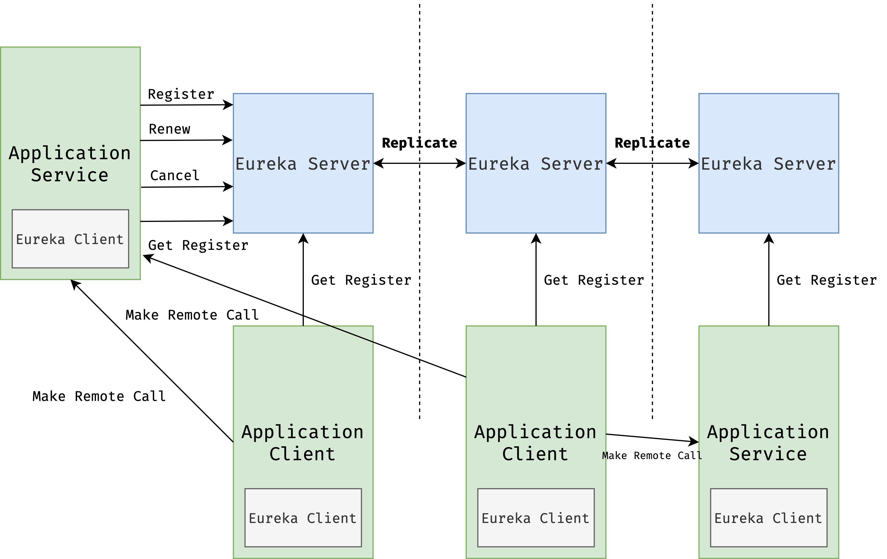
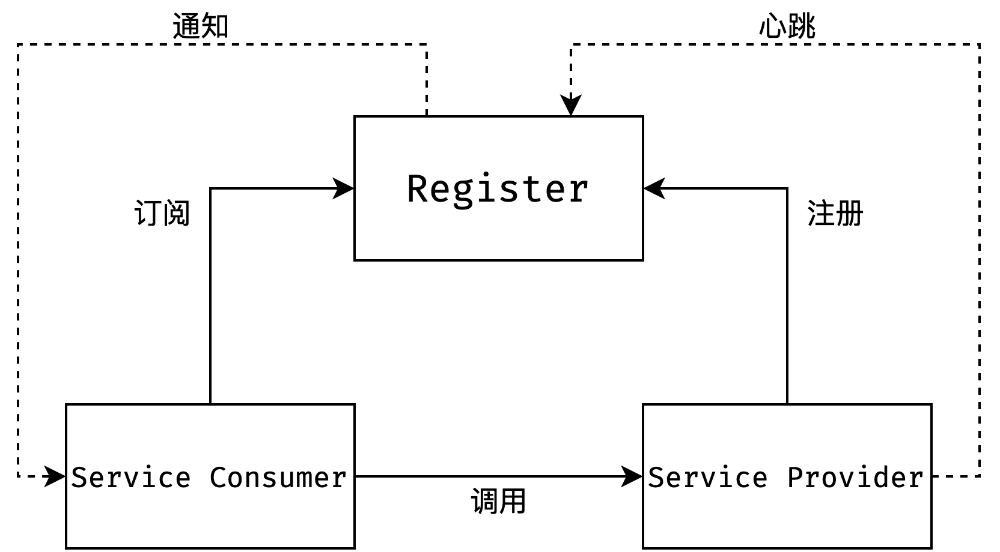
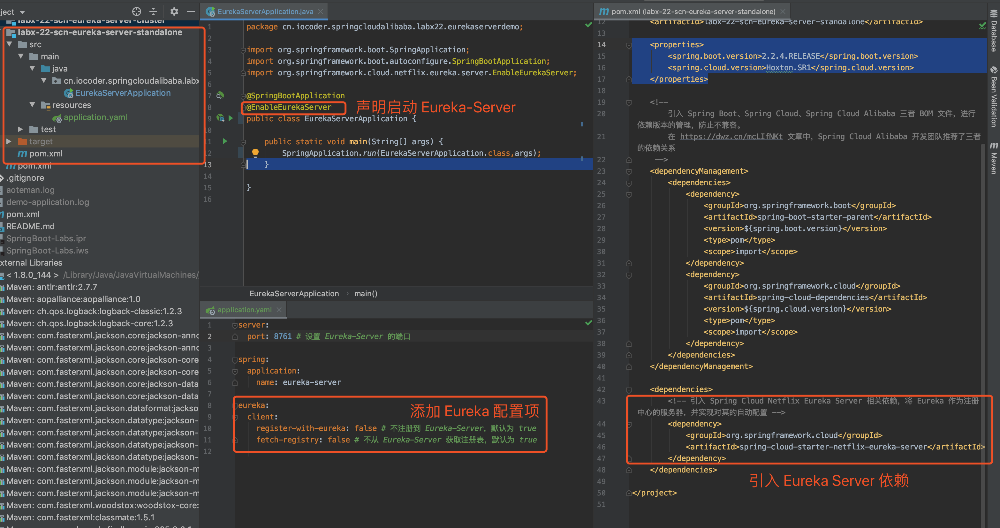
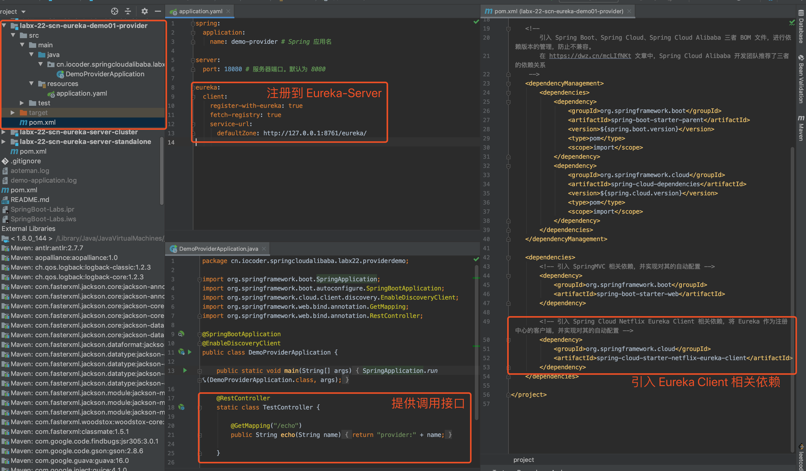

# Spring Cloud Netflix 注册中心 Eureka 入门

## 概述

本文我们来学习 [Spring Cloud Netflix](https://github.com/spring-cloud/spring-cloud-netflix) 提供的 [`spring-cloud-netflix-eureka-server`](https://github.com/spring-cloud/spring-cloud-netflix/blob/2.2.x/spring-cloud-netflix-eureka-server/) 和 [`spring-cloud-netflix-eureka-server`](https://github.com/spring-cloud/spring-cloud-netflix/blob/2.2.x/spring-cloud-netflix-eureka-client/) 组件，基于 Spring Cloud 的编程模型，接入 [Eureka](https://github.com/Netflix/eureka) 作为注册中心，实现服务的注册与发现。

> 旁白君：下面我们先来科普 Eureka 和注册中心的概念，保持耐心，嘿嘿~

##  Eureka 简介

Eureka 是 Netflix 开源的**注册中心**组件，分成 Eureka **Client** 和 Eureka **Server** 两个角色。整体架构如下图所示：



- **Eureka-Server** ：通过 REST 协议暴露服务，提供应用服务的注册和发现的功能。
- **Application Server** ：应用服务**提供者**，内嵌 **Eureka-Client** ，通过它向**Eureka-Server** 注册自身服务。
- **Application Client** ：应用服务**消费者**，内嵌 **Eureka-Client** ，通过它从 **Eureka-Server** 获取服务列表。

> 友情提示：请注意下，**Application Server** 和 **Application Client** 强调扮演的角色，实际可以在同一 JVM 进程，即是服务的提供者，又是服务的消费者。

🔥 我们先来看看服务和 Eureka 之间的交互行为：

**① Register（注册）**

服务**提供方**使用 **Eureka-Client** 注册自己到 **Eureka-Server** 上，添加到注册表，成为**服务**的一个**实例**。


服务**提供方**使用 **Eureka-Client** 每 30 秒向 **Eureka-Server** 发起一次心跳，告诉 **Eureka-Server** 当前服务**实例**还**存活**。

如果 **Eureka-Server** 90 秒没有收到 **Eureka-Client** 的心跳，会认为它已经**下线**，将该服务**实例**从注册表移除。

**为什么**需要心跳？Eureka 采用 REST **短**连接，而非 TCP **长**连接，所以需要通过心跳机制来确认**是否存活**。

**③ Get Registry（获取注册信息）**

服务**消费者**使用 **Eureka-Client** 从 **Eureka-Server** 获取**全量**注册表，并缓存在**本地内存**。之后，服务**消费者**要远程调用服务**提供者**时，只需要从本地缓存的注册表查找对应的服务即可。

考虑到 **Eureka-Server** 的注册表是不断变化的，服务**消费者**每 30 秒使用 **Eureka-Client** 从 **Eureka-Server** 获取**增量**变化的部分，**合并**更新到本地缓存的注册表。

**④ Cancel（下线）**

服务**提供者**准备下线时，使用 **Eureka-Client** 向 **Eureka-Server** 发起取消注册请求，从而从注册表中移除，避免后续服务**消费者**请求当前实例。

一般来说，我们把这种方式称为“正常下线”。与之相对的，就是心跳超时导致的“异常下线”。

🔥 我们先来看看 Eureka-Server 之间的交互行为：

Eureka-Server 在 [CAP 定理](https://zh.wikipedia.org/wiki/CAP定理) 中，选择了 **AP** 来实现：

- 一致性（Consistency）：等同于所有节点访问同一份最新的数据副本。
- 可用性（Availability）：每次请求都能获取到**非错**的响应，但是**不**保证获取的数据为**最新**数据。

## 注册中心原理

本小节，我们再来啰嗦下通用的注册中心原理。

在使用注册中心时，一共有三种角色：服务提供者（Service Provider）、服务消费者（Service Consumer）、注册中心（Registry）。

> 在一些文章中，服务提供者被称为 Server，服务消费者被称为 Client。胖友们知道即可。

三个角色交互如下图所示：



① Provider：

- 启动时，向 Registry **注册**自己为一个服务（Service）的实例（Instance）。
- 同时，定期向 Registry 发送**心跳**，告诉自己还存活。
- 关闭时，向 Registry **取消注册**。

② Consumer：

- 启动时，向 Registry **订阅**使用到的服务，并缓存服务的实例列表在内存中。
- 后续，Consumer 向对应服务的 Provider 发起**调用**时，从内存中的该服务的实例列表选择一个，进行远程调用。
- 关闭时，向 Registry **取消订阅**。

③ Registry：

- Provider 超过一定时间未**心跳**时，从服务的实例列表移除。
- 服务的实例列表发生变化（新增或者移除）时，通知订阅该服务的 Consumer，从而让 Consumer 能够刷新本地缓存。

当然，不同的注册中心可能在实现原理上会略有差异。例如说，[Eureka](https://github.com/Netflix/eureka/) 注册中心，并不提供通知功能，而是 Eureka Client 自己定期轮询，实现本地缓存的更新。

另外，Provider 和 Consumer 是角色上的定义，一个服务**同时**即可以是 Provider 也可以作为 Consumer。例如说，优惠劵服务可以给订单服务提供接口，同时又调用用户服务提供的接口。

## 快速入门

本小节，我们来搭建一个 Eureka 组件的快速入门示例。步骤如下：

- 首先，使用 `spring-cloud-netflix-eureka-server` 依赖，来搭建一个 Eureka **注册中心**。
- 然后，搭建一个**服务提供者** `demo-provider`，注册服务到 Eureka 中。
- 最后，搭建一个**服务消费者** `demo-consumer`，从 Eureka 获取到 `demo-provider` 服务的实例列表，选择其中一个示例，进行 HTTP 远程调用。

### 搭建 Eureka 注册中心

创建 [`labx-22-scn-eureka-server-standalone`](https://github.com/YunaiV/SpringBoot-Labs/tree/master/labx-22/labx-22-scn-eureka-server-standalone) 项目，作为 Eureka 注册中心。最终项目代码如下图所示：



#### 引入依赖

创建 `pom.xml` 文件，主要引入 **Spring Cloud Netflix Eureka Server** 相关依赖。代码如下：

```xml
<dependency>
    <groupId>org.springframework.cloud</groupId>
    <artifactId>spring-cloud-starter-netflix-eureka-server</artifactId>
    <version>2.2.0.RELEASE</version>
</dependency>
```

通过 `spring-cloud-starter-netflix-eureka-server`包，引入 Spring Cloud Netflix Eureka Server 相关依赖，将 Eureka 作为注册中心的服务器，并实现对其的自动配置。

#### 配置文件

创建 `application.yaml` 配置文件，主要添加 Eureka 相关配置项。配置如下：

```yaml
server:
  port: 8761 # 设置 Eureka-Server 的端口

spring:
  application:
    name: eureka-server

eureka:
  client:
    register-with-eureka: false # 不注册到 Eureka-Server，默认为 true
    fetch-registry: false # 不从 Eureka-Server 获取注册表，默认为 true
```

① `server.port` 配置项，设置启动的 Eureka-Server 的端口。

② `eureka.client` 配置项，设置 Eureka-Client 配置项，对应 `EurekaClientConfigBean`配置类。

Eureka-Server 会启动一个 Eureka-Client 客户端，用于 Eureka-Server **集群**之间的请求交互，因为这里我们仅仅搭建 Eureka-Server **单节点**，所以设置 `register-with-eureka` 和 `fetch-registry` 配置项为 `false`，无需相互注册。

#### EurekaServerApplication

创建 `EurekaServerApplication`类，Eureka 注册中心的启动类。代码如下：

```java
@SpringBootApplication
@EnableEurekaServer
public class EurekaServerApplication {

    public static void main(String[] args) {
        SpringApplication.run(EurekaServerApplication.class,args);
    }

}
```

在类上添加 `@EnableEurekaServer`注解，声明启动 Eureka-Server 服务。

### 搭建服务提供者



创建一个新项目，作为服务提供者 `demo-provider`。最终项目代码如下图所示：

#### 引入依赖

创建 `pom.xml` 文件，主要引入 **Spring Cloud Netflix Eureka Client** 相关依赖。代码如下：

```xml
<dependencies>
    <!-- https://mvnrepository.com/artifact/org.springframework.cloud/spring-cloud-starter-netflix-eureka-client -->
    <dependency>
        <groupId>org.springframework.cloud</groupId>
        <artifactId>spring-cloud-starter-netflix-eureka-client</artifactId>
        <version>2.2.4.RELEASE</version>
    </dependency>
</dependencies>
```

#### 配置文件

创建 `application.yaml`配置文件，主要添加 Eureka 相关配置项。配置如下：

```java
spring:
  application:
    name: demo-provider # Spring 应用名

server:
  port: 18080 # 服务器端口。默认为 8080

eureka:
  client:
    register-with-eureka: true # 注册到 Eureka-Server，默认为 true
    fetch-registry: true # 从 Eureka-Server 获取注册表，默认为 true
    service-url:
      defaultZone: http://127.0.0.1:8761/eureka/ # Eureka-Server 地址
```

① 设置 `eureka.client.register-with-eureka` 为 `true`，注册当前服务到 Eureka-Server 注册中心中。

② 设置 `eureka.client.fetch-registry` 为 `true`，从 Eureka-Server 注册中心拉取注册表。实际上，这里可以设置 `false`，因为在实例中仅仅扮演服务**提供者**的角色。

③ `eureka.client.service-url` 配置项，设置连接的 Eureka-Server 地址。Eureka 是有多 Zone 区域的概念，不过一般用不到，因此这里我们配置 `defaultZone` 默认区域为 Eureka-Server 地址 http://127.0.0.1:8761/eureka/ 即可，即我们在上一小节搭建的 Eureka-Server 的地址。

#### DemoProviderApplication

创建 `DemoProviderApplication` 类，创建应用启动类，并提供 HTTP 接口。代码如下：

```java
@SpringBootApplication
@EnableEurekaClient
public class DemoProviderApplication {

    public static void main(String[] args) {
        SpringApplication.run(Application.class);
    }

}
```

