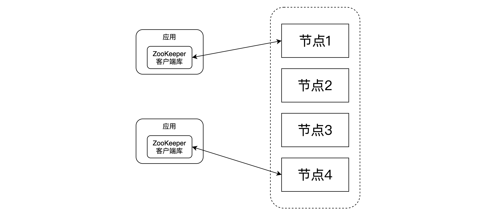

# 基础篇

## 什么是ZooKeeper

ZooKeeper 是一个分布式的，开放源码的分布式应用程序协同服务。ZooKeeper 的设计目标是将那些复杂且容易出错的分布式一致性服务封装起来，构成一个高效可靠的原语集，并以一系列简单易用的接口提供给用户使用。

## ZooKeeper发展历史

ZooKeeper 最早起源于雅虎研究院的一个研究小组。在当时，研究人员发现，在雅虎内部很多大型系统基本都需要依赖一个类似的系统来进行分布式协同，但是这些系统往往都存在分布式单点问题。
所以，雅虎的开发人员就开发了一个通用的无单点问题的分布式协调框架， 这就是ZooKeeper。 ZooKeeper 之后在开源界被大量使用， 下面列出了 3 个著名开源项目是如何使用 ZooKeeper：

- Hadoop： 使用 ZooKeeper 做Namenode的高可用
- HBase： 保证集群中只有一个 master， 保存 hbase:meta表的位置， 保存集群中的RegionServer 列表
- Kafka： 集群成员管理， controller 节点选举

## ZooKeeper应用场景

典型应用场景：

- 配置管理（configurationmanagement）
- DNS服务
- 组成员管理（groupmembership）
- 各种分布式锁

ZooKeeper 适用于存储和协同相关的关键数据， 不适合用于大数据量存储。

## ZooKeeper服务的使用

应用使用 ZooKeeper 客户端库使用 ZooKeeper 服务。

ZooKeeper 客户端负责和 ZooKeeper 集群的交互。

## ZooKeeper数据模型

ZooKeeper 的数据模型是层次模型（Google Chubby也是这么做的）。 层次模型常见于文件系统。 层次模型和 key-value模型是两种主流的数据模型。 ZooKeeper 使用文件系统模型主要基于以下两点考虑：

- 文件系统的树形结构便于表达数据之间的层次关系。
- 文件系统的树形结构便于为不同的应用分配独立的命名空间（namespace）。

ZooKeeper 的层次模型称作 data tree。 Datatree的每个节点叫作 znode。 不同于文件系统， 每个节点都可以保存数据。 每个节点都有一个版本(version)。 版本从 0 开始计数。

## data tree接口

ZooKeeper 对外提供一个用来访问 data tree的简化文件系统 API：

- 使用 UNIX 风格的路径名来定位 znode,例如 /A/X 表示 znode A的子节点 X。 
- znode的数据只支持全量写入和读取， 没有像通用文件系统那样支持部分写入和读取。
- data tree的所有 API 都是 wait-free的， 正在执行中的 API 调用不会影响其他 API 的完成。
- data tree的 API 都是对文件系统的 wait-free操作， 不直接提供锁这样的分布式协同机制。 但是 data tree的 API 非常强大， 可以用来实现多种分布式协同机制。

## znode

一个 znode 可以使持久性的， 也可以是临时性的：

1、持久性的 znode (PERSISTENT): ZooKeeper 宕机，或者 client 宕机，这个 znode一旦创建就不会丢失。

2、临时性的 znode (EPHEMERAL): ZooKeeper 宕机了，或者 client 在指定的 timeout 时间内没有连接
server ，都会被认为丢失。

znode节点也可以是顺序性的。 每一个顺序性的 znode 关联一个唯一的单调递增整数。 这个单调递增整
数是 znode 名字的后缀。 如果上面两种 znode 如果具备顺序性， 又有以下两种 znode：

3、持久顺序性的 znode(PERSISTENT_SEQUENTIAL): znode 除了具备持久性 znode 的特点之外， znode 的
名字具备顺序性。

4、临时顺序性的 znode(EPHEMERAL_SEQUENTIAL): znode 除了具备临时性 znode 的特点之外， znode
的名字具备顺序性。

ZooKeeper 主要有以上 4 种 znode。

## 实现一个锁

## ZooKeeper架构

应用使用 ZooKeeper 客户端库使用 ZooKeeper 服务。 ZooKeeper 客户端负责和 ZooKeeper集群的交互。 ZooKeeper 集群可以有两种模式： standalone 模式和 quorum模式。 处于standalone 模式的ZooKeeper 集群还有一个独立运行的 ZooKeeper 节点。 处于 quorum模式的 ZooKeeper 集群包换多个 ZooKeeper 节点。

### Session

ZooKeeper 客户端库和 ZooKeeper 集群中的节点创建一个 session。 客户端可以主动关闭 session。 另外如果ZooKeeper节点没有在 session关联的 timeout 时间内收到客户端的数据的话， ZooKeeper 节点也会关闭session。 另外ZooKeeper客户端库如果发现连接的 ZooKeeper 出错， 会自动的和其他 ZooKeeper 节点建立连接。

### Quorum模式

处于 Quorum模式的 ZooKeeper 集群包含多个 ZooKeeper 节点。 leader 节点可以处理读写请求， follower 只可以处理读请求。 follower 在接到写请求时会把写请求转发给leader来处理。

### 数据一致性

- 线性一致性（Linearizable）写入： 先到达 leader 的写请求会被先处理， leader 决定写请求的执行顺序。
- 客户端 FIFO顺序：来自给定客户端的请求按照发送顺序执行。