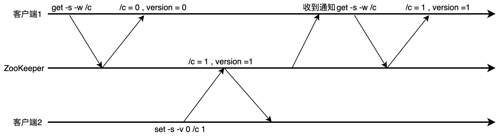
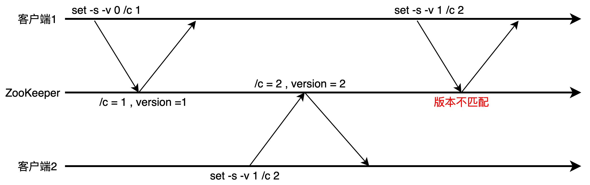
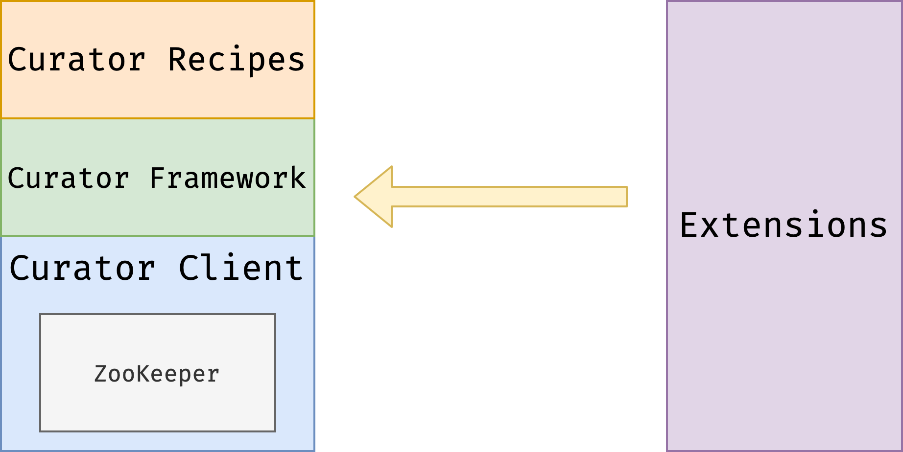

# 开发篇

## ZooKeeper类

ZooKeeper Java 代码主要使用 org.apache.zookeeper.ZooKeeper 这个类使用 ZooKeeper 服务。

```java
ZooKeeper(connectString, sessionTimeout, watcher)
```

- connectString：使用逗号分隔的列表，每个 ZooKeeper 节点是一个 host:port 对，host 是机器名或者 IP
  地址，port 是 ZooKeeper 节点使用的端口号。 会任意选取 connectString 中的一个节点建立连接。
- sessionTimeout：session timeout 时间。
- watcher: 用于接收到来自 ZooKeeper 集群的所有事件

### ZooKeeper的主要方法

- create(path, data, flags): 创建一个给定路径的 znode，并在 znode 保存 data[]的
  数据，flags 指定 znode 的类型。
- delete(path, version):如果给定 path 上的 znode 的版本和给定的 version 匹配，
  删除 znode。
- exists(path, watch):判断给定 path 上的 znode 是否存在，并在 znode 设置一个
  watch。
- getData(path, watch):返回给定 path 上的 znode 数据，并在 znode 设置一个 watch。
- setData(path, data, version):如果给定 path 上的 znode 的版本和给定的 version
  匹配，设置 znode 数据。
- getChildren(path, watch):返回给定 path 上的 znode 的孩子 znode 名字，并在
  znode 设置一个 watch。
- sync(path):把客户端 session 连接节点和 leader 节点进行同步。

### 方法说明

- 所有获取 znode 数据的 API 都可以设置一个 watch 用来监控 znode 的变化。
- 所有更新 znode 数据的 API 都有两个版本: 无条件更新版本和条件更新版本。如果 version
  为 -1，更新为条件更新。否则只有给定的 version 和 znode 当前的 version 一样，才会
  进行更新，这样的更新是条件更新。
- 所有的方法都有同步和异步两个版本。同步版本的方法发送请求给 ZooKeeper 并等待服务器的响
  应。异步版本把请求放入客户端的请求队列，然后马上返回。异步版本通过 callback 来接受来
  自服务端的响应。

### ZooKeeper 代码异常处理

所有同步执行的 API 方法都有可能抛出以下两个异常：

- KeeperException: 表示 ZooKeeper 服务端出错。 KeeperException 的子类
  ConnectionLossException 表示客户端和当前连接的 ZooKeeper 节点断开了连接。网络分区
  和 ZooKeeper 节点失败都会导致这个异常出现。发生此异常的时机可能是在 ZooKeeper 节点处
  理客户端请求之前，也可能是在 ZooKeeper 节点处理客户端请求之后。出现
  ConnectionLossException 异常之后，客户端会进行自动重新连接，但是我们必须要检查我们
  以前的客户端请求是否被成功执行。
- InterruptedException：表示方法被中断了。我们可以使用 Thread.interrupt() 来中断
  API 的执行。

### getData

有以下三个获取 znode 数据的方法：

1、byte[] getData(String path, boolean watch, Stat stat)

同步方法。如果 watch 为 true，该 znode 的状态变化会发送给构建 ZooKeeper 是指定的
watcher。

2、void getData(String path, boolean watch, DataCallback cb, Object ctx)

异步方法。cb 是一个 callback，用来接收服务端的响应。ctx 是提供给 cb 的 context。
watch 参数的含义和方法 1 相同。

3、void getData(String path, Watcher watcher, DataCallback cb, Object ctx)

异步方法。 watcher 用来接收该 znode 的状态变化。

### setData

1、Stat setData(String path, byte[] data, int version)

同步版本。如果 version 是 -1，做无条件更新。如果 version 是非 0 整数，做条件更新。

2、void setData(String path,byte[] data,int version,StatCallback cb,Object ctx)

### watch

watch 提供一个让客户端获取最新数据的机制。如果没有 watch 机制，客户端需要不断的轮询ZooKeeper 来查看是否有数据更新，这在分布式环境中是非常耗时的。客户端可以在读取数据的时候设置一个 watcher，这样在数据更新时，客户端就会收到通知。



### 条件更新

设想用 znode /c 实现一个 counter，使用 set 命令来实现自增 1 操作。条件更新场景：

1、客户端 1 把 /c 更新到版本 1，实现 /c 的自增 1 。

2、客户端 2 把 /c 更新到版本 2，实现 /c 的自增 1 。

3、客户端 1 不知道 /c 已经被客户端 2 更新过了，还用过时的版本 1 是去更新 /c，更新失败。如果客户端
1 使用的是无条件更新，/c 就会更新为 2，没有实现自增 1 。

使用条件更新可以避免对数据基于过期的数据进行数据更新操作。



## 分布式队列

为了在Zookeeper中实现分布式队列，首先需要设计一个znode来存放数据，这个节点叫做队列节点，我们的例子中这个节点是`/zookeeper/queue`。
 生产者向队列中存放数据，每一个消息都是队列节点下的一个新节点，叫做消息节点。消息节点的命名规则为：queue-xxx，xxx是一个单调
 递增的序列，我们可以在创建节点时指定创建模式为PERSISTENT_SEQUENTIAL来实现。这样，生产者不断的向队列节点中发送消息，消息为queue-xxx，
 队列中，生产者这一端就解决了，我们具体看一下代码：

### Producer（生产者）

```java
public class Producer implements Runnable,Watcher {

    private ZooKeeper zk;

    public Producer(String address){
        try {
            this.zk = new ZooKeeper(address,3000,this);
        } catch (IOException e) {
            e.printStackTrace();
        }
    }

    @Override
    public void run() {
        int i = 0;
        //每隔10s向队列中放入数据
        while (true){
            try {
                zk.create("/zookeeper/queue/queue-",(Thread.currentThread().getName()+"-"+i).getBytes(),
                        ZooDefs.Ids.OPEN_ACL_UNSAFE,CreateMode.PERSISTENT_SEQUENTIAL);
                Thread.sleep(10000);
                i++;
            } catch (KeeperException e) {
                e.printStackTrace();
            } catch (InterruptedException e) {
                e.printStackTrace();
            }
        }
    }

    @Override
    public void process(WatchedEvent event) {
    }
}
```

生产者每隔10s向队列中存放消息，消息节点的类型为PERSISTENT_SEQUENTIAL，消息节点中的数据为Thread.currentThread().getName()+"-"+i。

### 消费者

消费者从队列节点中获取消息，我们使用getChildren()方法获取到队列节点中的所有消息，然后获取消息节点数据，消费消息，并删除消息节点。
 如果getChildren()没有获取到数据，说明队列是空的，则消费者等待，然后再调用getChildren()方法设置观察者监听队列节点，队列节点发生变化后
 （子节点改变），触发监听事件，唤起消费者。消费者实现如下：

```java
public class Consumer implements Runnable,Watcher {
    private ZooKeeper zk;
    private List<String> children;

    public Consumer(String address){
        try {
            this.zk = new ZooKeeper(address,3000,this);
        } catch (IOException e) {
            e.printStackTrace();
        }
    }

    @Override
    public void run() {
        int i = 1;
        while (true){
            try {
                //获取所有子节点
                children = zk.getChildren("/zookeeper/queue", false);
                int size = CollectionUtils.isEmpty(children) ? 0 : children.size();
                System.out.println("第"+i+"次获取数据"+size+"条");

                //队列中没有数据，设置观察器并等待
                if (CollectionUtils.isEmpty(children)){
                    System.out.println("队列为空，消费者等待");
                    zk.getChildren("/zookeeper/queue", true);
                    synchronized (this){
                        wait();
                    }
                }else {
                    //循环获取队列中消息，进行业务处理，并从结果集合中删除
                    Iterator<String> iterator = children.iterator();
                    while (iterator.hasNext()){
                        String childNode = iterator.next();
                        handleBusiness(childNode);
                        iterator.remove();
                    }
                }
            } catch (KeeperException e) {
                e.printStackTrace();
            } catch (InterruptedException e) {
                e.printStackTrace();
            }
            i++;
        }
    }

    /**
     * 从节点获取数据，执行业务，并删除节点
     * @param childNode
     */
    private void handleBusiness(String childNode) {
        try {
            Stat stat = new Stat();
            byte[] data = zk.getData("/zookeeper/queue/"+childNode, false, stat);
            String str = new String(data);
            System.out.println("获取节点数据："+str);
            zk.delete("/zookeeper/queue/"+childNode,-1);
        } catch (KeeperException e) {
            e.printStackTrace();
        } catch (InterruptedException e) {
            e.printStackTrace();
        }


    }

    /**
     * 子节点发生变化，且取得结果为空时，说明消费者等待，唤起消费者
     * @param event
     */
    @Override
    public void process(WatchedEvent event) {
        if (event.getType().equals(Event.EventType.NodeChildrenChanged)){
            synchronized (this){
                notify();
            }
        }
    }
}
```

上面的例子中有一个局限性，就是 **消费者只能有一个** 。队列的用户有两个：广播和队列。

- 广播是所有消费者都拿到消息并消费，我们的例子在删除消息节点时，不能保证其他消费者都拿到了这个消息。
- 队列是一个消息只能被一个消费者消费，我们的例子中，消费者获取消息时，并没有加锁。

所以我们只启动一个消费者来演示，主函数如下：

```java
public class Application {

    private static final String ADDRESS = "149.28.37.147:2181";

    public static void main(String[] args) {
        //设置日志级别
        setLog();

        //启动一个消费者
        new Thread(new Consumer(ADDRESS)).start();

        //启动4个生产者
        ExecutorService es = Executors.newFixedThreadPool(4);
        for (int i=0;i<4;i++){
            es.execute(new Producer(ADDRESS));
        }
        es.shutdown();

    }

    /**
     * 设置log级别为Error
     */
    public static void setLog(){
        //1.logback
        LoggerContext loggerContext = (LoggerContext) LoggerFactory.getILoggerFactory();
        //获取应用中的所有logger实例
        List<Logger> loggerList = loggerContext.getLoggerList();

        //遍历更改每个logger实例的级别,可以通过http请求传递参数进行动态配置
        for (ch.qos.logback.classic.Logger logger:loggerList){
            logger.setLevel(Level.toLevel("ERROR"));
        }
    }
}
```

后台打印结果如下：

```undefined
第1次获取数据2条
获取节点数据：pool-1-thread-4-118
获取节点数据：pool-1-thread-1-0
第2次获取数据3条
获取节点数据：pool-1-thread-4-0
获取节点数据：pool-1-thread-2-0
获取节点数据：pool-1-thread-3-0
第3次获取数据0条
队列为空，消费者等待
第4次获取数据4条
获取节点数据：pool-1-thread-3-1
获取节点数据：pool-1-thread-1-1
获取节点数据：pool-1-thread-4-1
获取节点数据：pool-1-thread-2-1
```

## 分布式锁


## 选举


## curator

### 概述

Apache Curator 是 Apache ZooKeeper 的 Java 客户端库。Curator 项目的目标是简化ZooKeeper 客户端的使用。例如，在以前的代码展示中，我们都要自己处理ConnectionLossException 。另外 Curator 为常见的分布式协同服务提供了高质量的实现。
Apache Curator 最初是 Netflix 研发的，后来捐献给了 Apache 基金会，目前是 Apache 的顶级项目。

### Curator 技术栈

- Client：封装了 ZooKeeper 类，管理和ZooKeeper 集群的连接，并提供了重建
  连接机制。
-  Framework：为所有的 ZooKeeper 操作提供了重试机制，对外提供了一个Fluent 风格的 API 。
- Recipes：使用 framework 实现了大量的 ZooKeeper 协同服务。
- Extensions：扩展模块。



### Client

初始化一个 client 分成两个步骤：1.创建 client 。2.启动 client 。

以下是两种创建 client 的方法：

```java
RetryPolicy retryPolicy = new ExponentialBackoffRetry(1000, 3);
// 使用Factory方法
CuratorFramework zkc = CuratorFrameworkFactory.newClient(connectString, retryPolicy);
// Fluent风格
CuratorFramework zkc = CuratorFrameworkFactory.buidler()
.connectString(connectString)
.retryPolicy(retryPolicy)
.build()
```

启动 client：

zkc.start();

### Fluent 风格 API

// 同步版本

`client.create().withMode(CreateMode.PERSISTENT).forPath(path, data);`

// 异步版本

`client.create().withMode(CreateMode.PERSISTENT).inBackground().forPath(path, data);`

// 使用watch

`client.getData().watched().forPath(path);`

