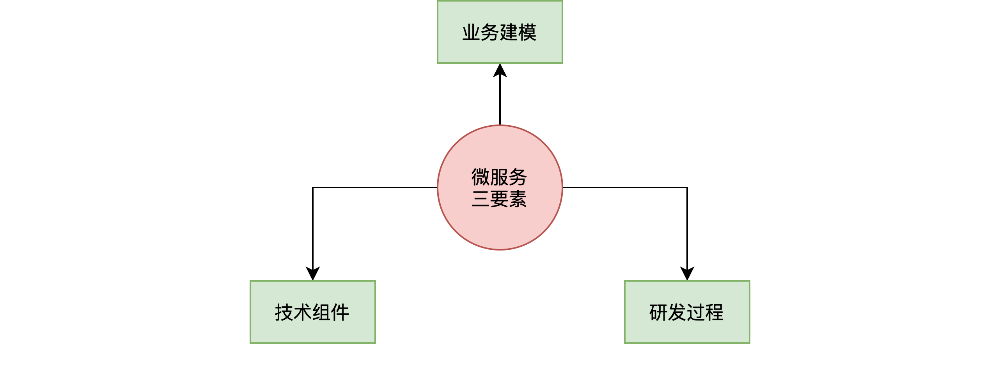
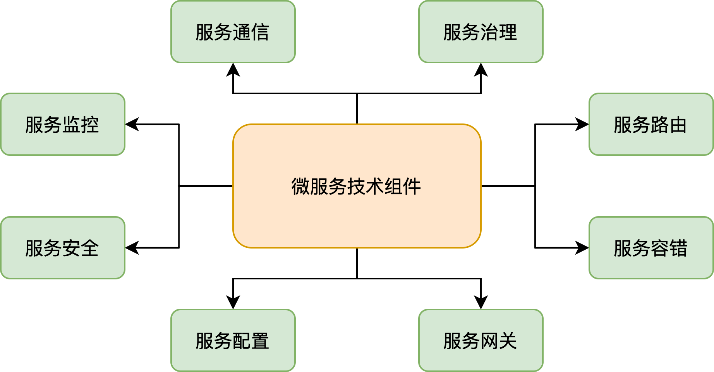
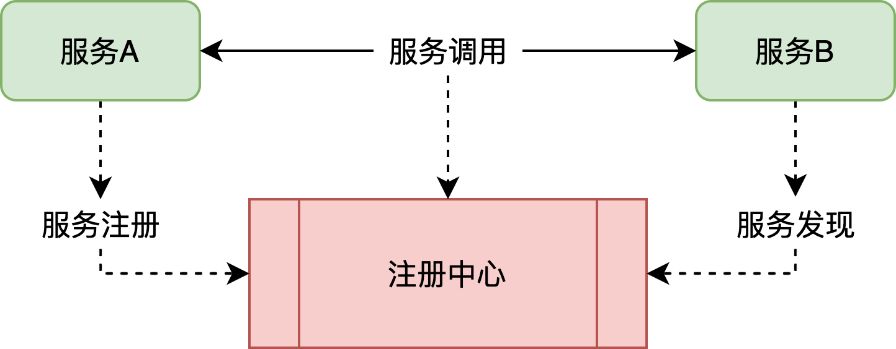
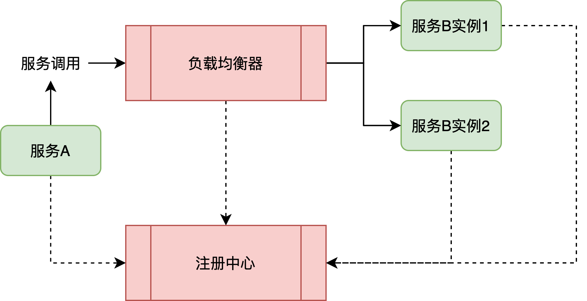
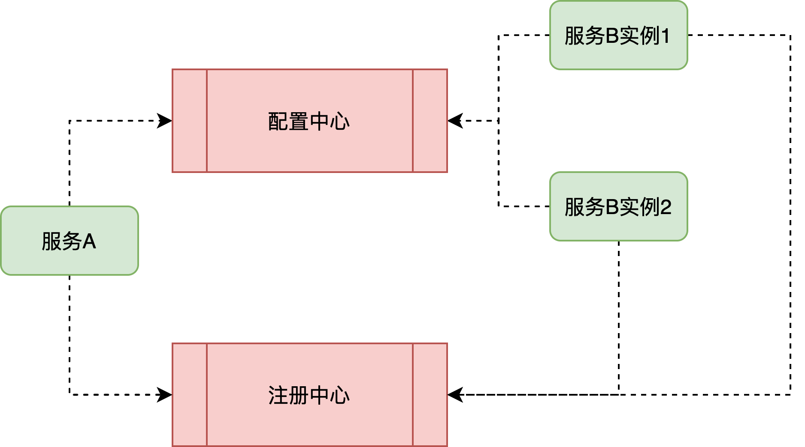
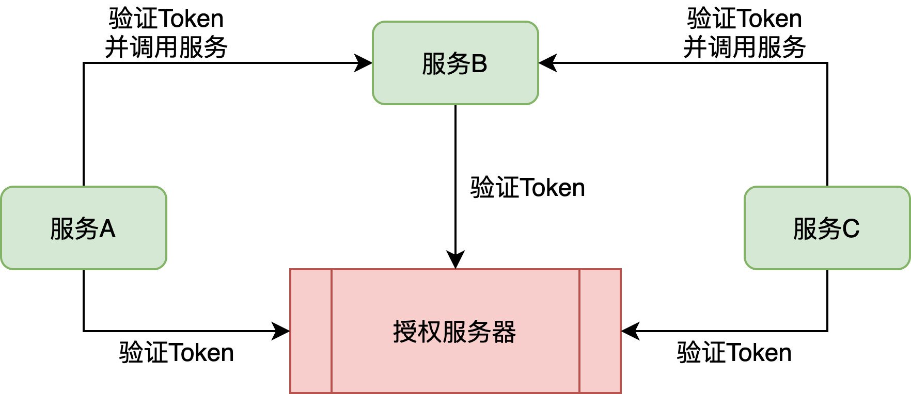

# 基础篇

## 追本溯源：究竟什么样的架构才是微服务架构？

微服务架构是一种架构模式，区别于其他系统架构的构建方式和技术方案，微服务架构具有其固有特点。微服务架构的提出者 Martin Fowler 在其文章Microservices中定义了包括服务组件化、去中心化、基础设施自动化在内的多个微服务架构特点。正是这些特点，为我们在使用微服务架构进行系统设计的过程，提供了主要的切入点。在本课程中，我基于这些特点提炼出构建微服务架构三大要素，即如下图所示的业务建模、技术体系和研发过程。

### 微服务架构的第一要素：业务建模

微服务架构设计首要的切入点为服务建模。为什么我们首先需要考虑的是这个要素呢？因为微服务架构与传统 SOA 等技术体系有本质区别，就是其服务的粒度和服务本身的面向业务和组件化特性。针对服务建模，我们首先需要明确服务的类别，以及服务与业务之间的关系，尽可能明确领域的边界。

那么如何开展开发服务建模工作呢？针对服务建模，推荐使用领域驱动设计（Domain Driven Design，DDD）方法，通过识别领域中的各个子域、判断这些子域是否独立、考虑子域与子域的交互关系，从而明确各个界限上下文（Boundary Context）之间的边界。

对于领域的划分，业界主流的分类方法认为，系统中的各个子域可以分成核心子域、支撑子域和通用子域三种类型，其中系统中的核心业务属于核心子域，专注于业务某一方面的子域称为支撑子域，可以作为某种基础设施的功能可以归到通用子域。

### 微服务架构的第二要素：技术体系

微服务架构的第二大块内容就是它的技术体系，这也是我们学习微服务架构的主体内容。同样，不同的开发技术和框架都会基于自身的设计理念，给出各自的技术体系类型及其实现方式。

微服务架构相关的技术体系比较繁杂，在对其进行学习的过程中，你需要抓住重点。在本课程中，我也基于目前业界主流的微服务实现技术提炼了八大技术体系，包括服务通信、服务治理、服务路由、服务容错、服务网关、服务配置、服务安全和服务监控，如下图所示：

上图中的每个技术体系都非常重要，下面来对它们分别展开介绍。

#### 1、服务通信

网络通信是任何分布式系统的基础组件。网络通信本身涉及面很广，对于微服务架构而言，我们关注的是**网络连接模式**、**I/O 模型**和**服务调用方式**。

我们知道基于TCP 协议的网络连接有两种基本方式，也就是通常所说的**长连接**和**短连接**。长连接和短连接的产生在于客户端和服务器端采取的关闭策略，具体的应用场景采用具体的策略。例如 Dubbo 框架就采用的是长连接，而本课程中要介绍的 Spring Cloud 则采用了短连接。不过鉴于篇幅关系，关于长连接、短连接的适用场景我就不展开介绍了，感兴趣的同学可以课下多去搜索了解下相关资料。

服务之间通信的另一个关注点是 I/O 模型。I/O 模型也有**阻塞式 I/O** 和**非阻塞式 I/O** 等多种实现方式。阻塞式 I/O 实现简单，而非阻塞式 I/O 的性能更好。在微服务架构中，以服务网关而言，像Netflix 的 Zuul就是阻塞式 I/O，而Spring 自研的 Spring Cloud Gateway则采用的是非阻塞式 I/O。

服务通信的另一个主题是调用方式，这方面同样存在同步调用和异步调用两大类实现机制，这两大类机制对于开发人员使用开发框架的方式有很大影响。为了简化开发人员的使用过程，通常都会采用异步转同步的实现机制，也就是说开发人员使用同步的方式进行方法调用，而框架本身会基于 Future 等机制实现异步的远程处理。

#### 2、服务治理

在微服务架构中，服务治理可以说是最为关键的一个技术组件，因为各个微服务需要通过服务治理实现自动化的注册和发现。

你可以想象一下，如果系统中服务数量不是很多，那么我们有很多办法可以获取这些服务的 IP 地址、端口等信息，管理起来也不是很复杂。但当服务数量达到一定量级时，可能连开发人员自己都不知道系统中到底存在多少个服务，也不知道系统中当前到底哪些服务已经变得不可用。这时候，我们就需要引入独立的媒介来管理服务的实例，这个媒介一般被称为服务注册中心。

服务注册中心是保存服务调用所需的路由信息的存储仓库，也是服务提供者和服务消费者进行交互的媒介，充当着服务注册和发现服务器的作用。诸如 Dubbo、Spring Cloud 等主流的微服务框架都基于 Zookeeper、Eureka 等分布式系统协调工具构建了服务注册中心。

#### 3、服务路由

我们现在已经通过注册中心构建了一个多服务的集群化环境中，当客户端请求到达集群，如何确定由哪一台服务器进行请求响应呢？这就是服务路由问题。可以认为负载均衡是最常见的一种路由方案，常见的客户端/服务器端负载均衡技术都可以完成服务路由。Spring Cloud 等主流的微服务框架也都内置了 Ribbon 等客户端负载均衡组件。

另一方面，负载均衡的出发点更多的是提供服务分发而不是解决路由问题，常见的静态、动态负载均衡算法也无法实现精细化的路由管理。这时候我们就可以采用路由规则。路由规则常见的实现方案是白名单或黑名单，即把需要路由的服务地址信息（如服务 IP）放入可以控制是否可见的路由池中进行路由。同样，路由规则也是微服务开发框架的一项常见功能。

#### 4、服务容错

对于分布式环境中的服务而言，服务在自身失败引发生错误的同时，还会因为依赖其他服务而导致失败。除了比较容易想到和实现的超时、重试和异步解耦等手段之外，我们需要考虑针对各种场景的容错机制。

- 集群容错策略
- 服务隔离机制
- 服务限流机制
- 服务熔断机制

业界存在一批与服务容错相关的技术组件，包括以失效转移 Failover 为代表的集群容错策略，以线程隔离、进程隔离为代表的服务隔离机制，以滑动窗口、令牌桶算法为代表的服务限流机制，以及服务熔断机制。而从技术实现方式上看，在 Spring Cloud 中，这些机制部分包含在下面要介绍的服务网关中，而另一部分则被提炼成单独的开发框架，例如专门用于实现服务熔断的 Spring Cloud Circuit Breaker 组件。

#### 5、服务网关

服务网关也叫 API 网关，封装了系统内部架构，为每个客户端提供一个定制的 API。在微服务架构中，服务网关的核心要点是，所有的客户端和消费端都通过统一的网关接入微服务，在网关层处理所有的非业务功能。

在功能设计上，服务网关在完成客户端与服务器端报文格式转换的同时，它可能还具有身份验证、监控、缓存、请求管理、静态响应处理等功能。另一方面，也可以在网关层制定灵活的路由策略。针对一些特定的 API，我们需要设置白名单、路由规则等各类限制。在本课程中，我们会基于 Netflix Zuul 和 Spring Cloud Gateway 这两种网关对这些功能分别展开介绍。

#### 6、服务配置

在微服务架构中，考虑到服务数量和配置信息的分散性，一般都需要引入配置中心的设计思想和相关工具。与注册中心一样，配置中心也是微服务架构中的基础组件，其目的也是对服务进行统一管理，区别在于配置中心管理的对象是配置信息而不是服务的实例信息。

为了满足以上要求，配置中心通常需要依赖分布式协调机制，即通过一定的方法确保配置信息在分布式环境中的各个服务中能得到实时、一致的管理。可以采用诸如 Zookeeper 等主流的开源分布式协调框架来构建配置中心。当然，像 Spring Cloud 也提供了专门的配置中心实现工具 Spring Cloud Config。

#### 7、服务安全

在对微服务架构的学习过程中，服务安全是一块非常重要但又容易被忽视的内容。一般意义上的访问安全性，都是围绕认证和授权这两个核心概念来展开的。也就是说我们首先需要确定用户身份，然后再确定这个用户是否有访问指定资源的权限。站在单个微服务的角度讲，我们系统每次服务访问都能与授权服务器进行集成以便获取访问 Token。站在多个服务交互的角度讲，我们需要确保 Token 在各个微服务之间的有效传播。另一方面，服务内部，我们可以使用不同的访问策略限制服务资源的访问。

在实现微服务安全访问上，我们通常使用 OAuth2 协议来实现对服务访问的授权机制，使用 JWT 技术来构建轻量级的认证体系。Spring 家族也提供了 Spring Security 和 Spring Cloud Security 框架来完整这些组件的构建。

#### 8、服务监控

在微服务架构中，当服务数量达到一定量级时，我们难免会遇到两个核心问题。一个是如何管理服务之间的调用关系？另一个是如何跟踪业务流的处理过程和结果？这就需要构建分布式服务跟踪机制。

分布式服务跟踪机制的建立需要完成调用链数据的生成、采集、存储及查询，同时也需要对这些调用链数据进行运算和可视化管理。这些工作不是简单一个工具和框架能全部完成，因此，在开发微服务系统时，我们通常会整合多个开发框架进行链路跟踪。例如，在 Spring Cloud 中，就提供了 Spring Cloud Sleuth 与 Zipkin 的集成方案。

### 微服务架构的第三要素：研发过程

微服务架构的第三个要素是研发过程，这点怎么理解？实际上，过程转变与技术体系建设有密切关联，所以对于微服务架构而言，最后一个要素就是研发过程。Martin Fowler 在介绍微服务架构时，同样也提出了围绕“业务功能”组织团队的研发管理理念。

当寻找把一个大的应用程序进行拆分的方法时，研发过程通常都会围绕产品团队、项目管理、大前端和服务器端团队而展开，这些团队也就是通常所说的职能团队。任何一个需求，无论大小，都将导致跨团队协作，从而增加沟通和协作成本。而微服务架构则倾向围绕业务功能的组织来分割服务，而不是面向某项技术能力。因此，团队是跨职能的特征团队，每个服务都围绕着业务进行构建，并且能够被独立部署到生产环境。

