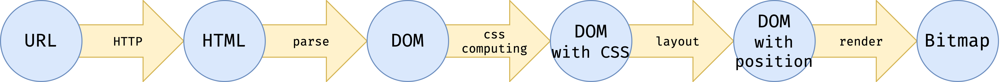

# JavaScript Browser

## 浏览器工作原理



## HTML的解析

1. **拆分文件**
  
  为了方便文件管理，我们把parser单独拆到文件中。parser接受HTML文本作为参数，返回一颗DOM树。

2. **创建状态机**

3. **解析标签**

  主要的标签有：开始标签，结束标签和自封闭标签。在这一步我们暂时忽略属性。

4. **创建元素**
  
  在状态机中，除了状态迁移，我们还会要加入业务逻辑。我们在标签结束状态提交标签token。

5. **处理属性**

  属性值分为单引号、双引号、无引号三种写法，因此需要较多状态处理。处理属性的方式跟标签类似。属性结束时，我们把属性加到标签Token上。

6. **构建DOM树**

  从标签构建DOM树的基本技巧是使用栈。遇到开始标签时创建元素并入栈，遇到结束标签时出栈。自封闭节点可视为入栈后立刻出栈。任何元素的父元素是它入栈前的栈顶。

7. **文本节点**

  文本节点与自封闭标签处理类似。多个文本节点需要合并。

## 添加css样式

[https://www.npmjs.com/package/css](https://www.npmjs.com/package/css)

```bash
npm install css
```

1. **收集CSS规则**

  遇到style标签时，我们把CSS规则保存起来。这里我们调用CSS Parser来分析CSS规则。这里我们必须要仔细研究此库分析CSS规则的格式。

2. **添加调用**

  当我们创建一个元素后，立即计算CSS。理论上，当我们分析一个元素时，所有CSS规则已经收集完毕。在真实浏览器中，可能遇到写在body的style标签，需要重新CSS计算的情况，这里我们忽略。

3. **获取父元素序列**

  在computeCSS函数中，我们必须知道元素的所有父元素才能判断元素与规则是否匹配。我们从上一步骤的stack，可以获取本元素所有的父元素。因为我们首先获取的是“当前元素”，所以我们获得和计算父元素匹配的顺序是从内向外。

4. **拆分选择器**

  选择器也要从当前元素向外排列。复杂选择器拆成针对单个元素的选择器，用循环匹配父元素队列。

5. **计算选择器与元素匹配**

  根据选择器的类型和元素属性，计算是否与当前元素匹配。这里仅仅实现了三种基本选择器，实际的浏览器中要处理复合选择器。

6. **生成computed属性**

   一旦选择匹配， 就应用选择器到元素上， 形成computedStyle。

7. **确定规则覆盖关系**

  CSS规则根据specificity和后来优先规则覆盖。specificity是个四元组，越左边权重越高。一个CSS规则的specificity根据包含的简单选择器相加而成。
