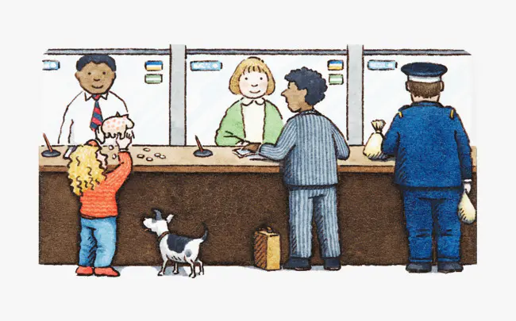

# JavaScript Structure

首先，JavaScript是一个单线程的脚本语言。

所以就是说在一行代码执行的过程中，必然不会存在同时执行的另一行代码，就像使用`alert()`以后进行疯狂`console.log`，如果没有关闭弹框，控制台是不会显示出一条`log`信息的。

亦或者有些代码执行了大量计算，比方说在前端暴力破解密码之类的鬼操作，这就会导致后续代码一直在等待，页面处于假死状态，因为前边的代码并没有执行完。

所以如果全部代码都是同步执行的，这会引发很严重的问题，比方说我们要从远端获取一些数据，难道要一直循环代码去判断是否拿到了返回结果么？就像去饭店点餐，肯定不能说点完了以后就去后厨催着人炒菜的，会被揍的。

于是就有了异步事件的概念，注册一个回调函数，比如说发一个网络请求，我们告诉主程序等到接收到数据后通知我，然后我们就可以去做其他的事情了。

然后在异步完成后，会通知到我们，但是此时可能程序正在做其他的事情，所以即使异步完成了也需要在一旁等待，等到程序空闲下来才有时间去看哪些异步已经完成了，可以去执行。

比如说打了个车，如果司机先到了，但是你手头还有点儿事情要处理，这时司机是不可能自己先开着车走的，一定要等到你处理完事情上了车才能走。



## 微任务与宏任务的区别

这个就像去银行办业务一样，先要取号进行排号。

一般上边都会印着类似：“您的号码为XX，前边还有XX人。”之类的字样。

因为柜员同时职能处理一个来办理业务的客户，这时每一个来办理业务的人就可以认为是银行柜员的一个宏任务来存在的，当柜员处理完当前客户的问题以后，选择接待下一位，广播报号，也就是下一个宏任务的开始。

所以多个宏任务合在一起就可以认为说有一个任务队列在这，里边是当前银行中所有排号的客户。

**任务队列中的都是已经完成的异步操作，而不是说注册一个异步任务就会被放在这个任务队列中，就像在银行中排号，如果叫到你的时候你不在，那么你当前的号牌就作废了，柜员会选择直接跳过进行下一个客户的业务处理，等你回来以后还需要重新取号.**

而且一个宏任务在执行的过程中，是可以添加一些微任务的，就像在柜台办理业务，你前边的一位老大爷可能在存款，在存款这个业务办理完以后，柜员会问老大爷还有没有其他需要办理的业务，这时老大爷想了一下：“最近P2P爆雷有点儿多，是不是要选择稳一些的理财呢”，然后告诉柜员说，要办一些理财的业务，这时候柜员肯定不能告诉老大爷说：“您再上后边取个号去，重新排队”。

所以本来快轮到你来办理业务，会因为老大爷临时添加的“理财业务”而往后推。

也许老大爷在办完理财以后还想 再办一个信用卡？或者 再买点儿纪念币？

无论是什么需求，只要是柜员能够帮她办理的，都会在处理你的业务之前来做这些事情，这些都可以认为是微任务。

这就说明：~~你大爷永远是你大爷~~

在当前的微任务没有执行完成时，是不会执行下一个宏任务的。

所以就有了那个经常在面试题、各种博客中的代码片段：

```javascript
setTimeout(_ => console.log(4))

new Promise(resolve => {
  resolve()
  console.log(1)
}).then(_ => {
  console.log(3)
})

console.log(2)
```

`setTimeout`就是作为宏任务来存在的，而`Promise.then`则是具有代表性的微任务，上述代码的执行顺序就是按照序号来输出的。

所有会进入的异步都是指的事件回调中的那部分代码

也就是说`new Promise`在实例化的过程中所执行的代码都是同步进行的，而`then`中注册的回调才是异步执行的。

在同步代码执行完成后才回去检查是否有异步任务完成，并执行对应的回调，而微任务又会在宏任务之前执行。

所以就得到了上述的输出结论`1、2、3、4`。

本来`setTimeout`已经先设置了定时器（相当于取号），然后在当前进程中又添加了一些`Promise`的处理（临时添加业务）。

所以进阶的，即便我们继续在`Promise`中实例化`Promise`，其输出依然会早于`setTimeout`的宏任务：

```javascript
setTimeout(_ => console.log(4))

new Promise(resolve => {
  resolve()
  console.log(1)
}).then(_ => {
  console.log(3)
  Promise.resolve().then(_ => {
    console.log('before timeout')
  }).then(_ => {
    Promise.resolve().then(_ => {
      console.log('also before timeout')
    })
  })
})

console.log(2)
```

当然了，实际情况下很少会有简单的这么调用`Promise`的，一般都会在里边有其他的异步操作，比如`fetch`、`fs.readFile`之类的操作。

而这些其实就相当于注册了一个宏任务，而非是微任务。

所以，明白哪些操作是宏任务、哪些是微任务就变得很关键，这是目前业界比较流行的说法：

| #                       | 浏览器 | Node |
| ----------------------- | ------ | ---- |
| `I/O`                   | ✅      | ✅    |
| `setTimeout`            | ✅      | ✅    |
| `setInterval`           | ✅      | ✅    |
| `setImmediate`          | ❌      | ✅    |
| `requestAnimationFrame` | ✅      | ❌    |

有些地方会列出来`UI Rendering`，说这个也是宏任务，可是在读了HTML规范文档以后，发现这很显然是和微任务平行的一个操作步骤`requestAnimationFrame`姑且也算是宏任务吧，`requestAnimationFrame`在`MDN`的定义为，下次页面重绘前所执行的操作，而重绘也是作为宏任务的一个步骤来存在的，且该步骤晚于微任务的执行。

| #                            | 浏览器 | Node |
| ---------------------------- | ------ | ---- |
| `process.nextTick`           | ❌      | ✅    |
| `MutationObserver`           | ✅      | ❌    |
| `Promise.then catch finally` | ✅      | ✅    |

## Event-Loop是个啥

上边一直在讨论 宏任务、微任务，各种任务的执行。

但是回到现实，`JavaScript`是一个单进程的语言，同一时间不能处理多个任务，所以何时执行宏任务，何时执行微任务？我们需要有这样的一个判断逻辑存在。

每办理完一个业务，柜员就会问当前的客户，是否还有其他需要办理的业务。（**检查还有没有微任务需要处理**）

而客户明确告知说没有事情以后，柜员就去查看后边还有没有等着办理业务的人。（**结束本次宏任务、检查还有没有宏任务需要处理**）

这个检查的过程是持续进行的，每完成一个任务都会进行一次，而这样的操作就被称为`Event Loop`。(**这是个非常简易的描述了，实际上会复杂很多**)

而且就如同上边所说的，一个柜员同一时间只能处理一件事情，即便这些事情是一个客户所提出的，所以可以认为微任务也存在一个队列，大致是这样的一个逻辑：

```javascript
const macroTaskList = [
  ['task1'],
  ['task2', 'task3'],
  ['task4'],
]

for (let macroIndex = 0; macroIndex < macroTaskList.length; macroIndex++) {
  const microTaskList = macroTaskList[macroIndex]
  
  for (let microIndex = 0; microIndex < microTaskList.length; microIndex++) {
    const microTask = microTaskList[microIndex]

    // 添加一个微任务
    if (microIndex === 1) microTaskList.push('special micro task')
    
    // 执行任务
    console.log(microTask)
  }

  // 添加一个宏任务
  if (macroIndex === 2) macroTaskList.push(['special macro task'])
}

// > task1
// > task2
// > task3
// > special micro task
// > task4
// > special macro task
```
之所以使用两个`for`循环来表示，是因为在循环内部可以很方便的进行`push`之类的操作（添加一些任务），从而使迭代的次数动态的增加。

以及还要明确的是，`Event Loop`只是负责告诉你该执行那些任务，或者说哪些回调被触发了，真正的逻辑还是在进程中执行的。

## 在浏览器中的表现

在上边简单的说明了两种任务的差别，以及`Event Loop`的作用，那么在真实的浏览器中是什么表现呢？

首先要明确的一点是，宏任务必然是在微任务之后才执行的（因为微任务实际上是宏任务的其中一个步骤）

`I/O`这一项感觉有点儿笼统，有太多的东西都可以称之为`I/O`，点击一次`button`，上传一个文件，与程序产生交互的这些都可以称之为`I/O`。
假设有这样的一些`DOM`结构：

```html
<style>
  #outer {
    padding: 20px;
    background: #616161;
  }

  #inner {
    width: 100px;
    height: 100px;
    background: #757575;
  }
</style>
<div id="outer">
  <div id="inner"></div>
</div>
```

```javascript
const $inner = document.querySelector('#inner')
const $outer = document.querySelector('#outer')

function handler () {
  console.log('click') // 直接输出

  Promise.resolve().then(_ => console.log('promise')) // 注册微任务

  setTimeout(_ => console.log('timeout')) // 注册宏任务

  requestAnimationFrame(_ => console.log('animationFrame')) // 注册宏任务

  $outer.setAttribute('data-random', Math.random()) // DOM属性修改，触发微任务
}

new MutationObserver(_ => {
  console.log('observer')
}).observe($outer, {
  attributes: true
})

$inner.addEventListener('click', handler)
$outer.addEventListener('click', handler)
```

如果点击`#inner`，其执行顺序一定是：`click` -> `promise` -> `observer` -> `click` -> `promise` -> `observer `-> `animationFrame` -> `animationFrame` -> `timeout` -> `timeout`。

因为一次I/O创建了一个宏任务，也就是说在这次任务中会去触发`handler`。

按照代码中的注释，在同步的代码已经执行完以后，这时就会去查看是否有微任务可以执行，然后发现了`Promise`和`MutationObserver`两个微任务，遂执行之。

因为`click`事件会冒泡，所以对应的这次`I/O`会触发两次`handler`函数(一次在`inner`、一次在`outer`)，所以会优先执行冒泡的事件(早于其他的宏任务)，也就是说会重复上述的逻辑。

在执行完同步代码与微任务以后，这时继续向后查找有木有宏任务。

需要注意的一点是，因为我们触发了`setAttribute`，实际上修改了`DOM`的属性，这会导致页面的重绘，而这个`set`的操作是同步执行的，也就是说`requestAnimationFrame`的回调会早于`setTimeout`所执行。