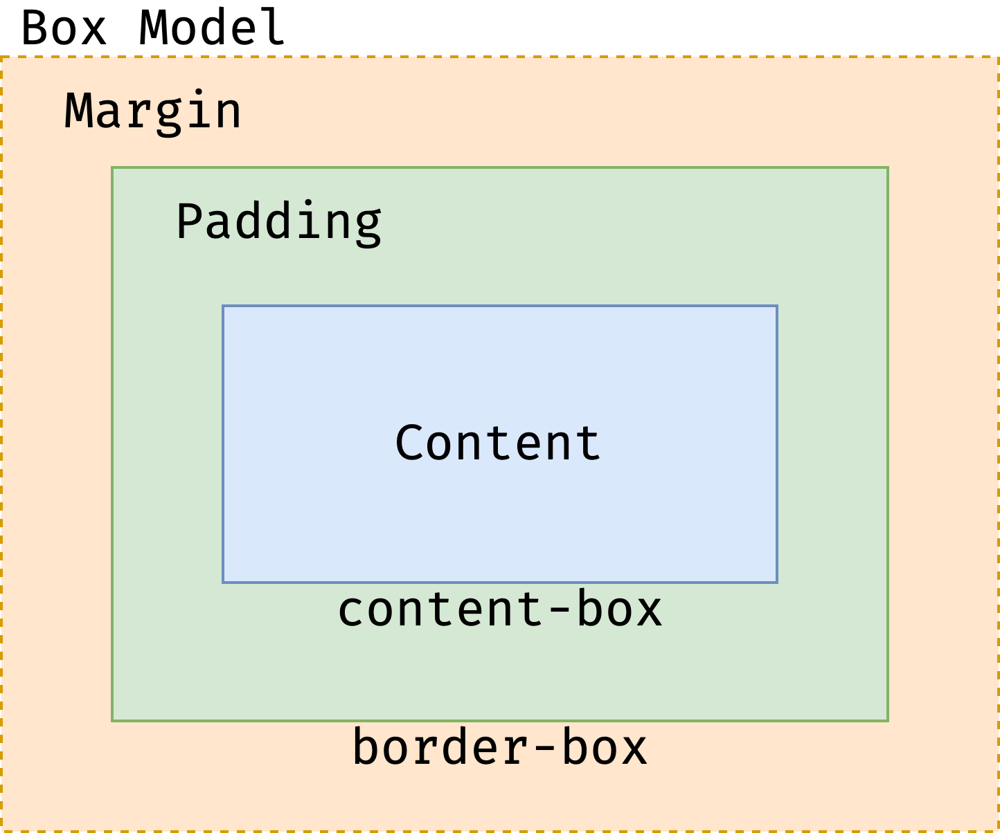
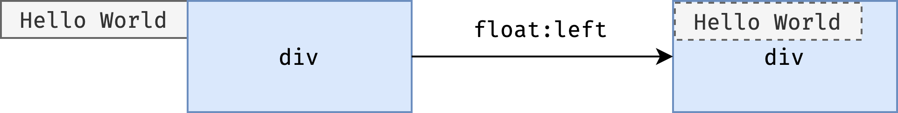
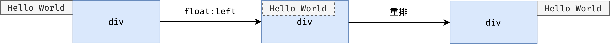
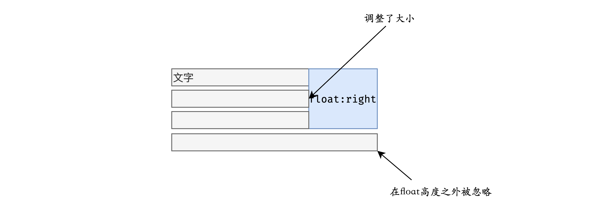
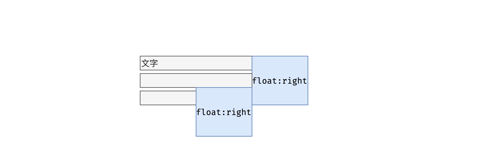
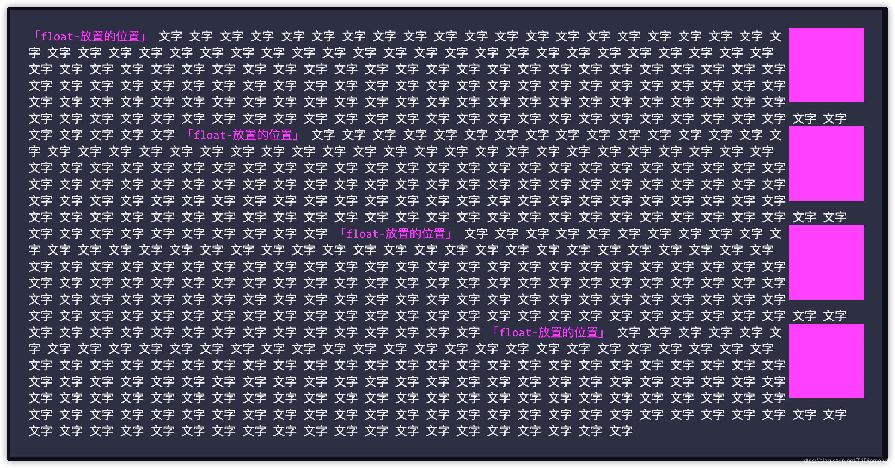
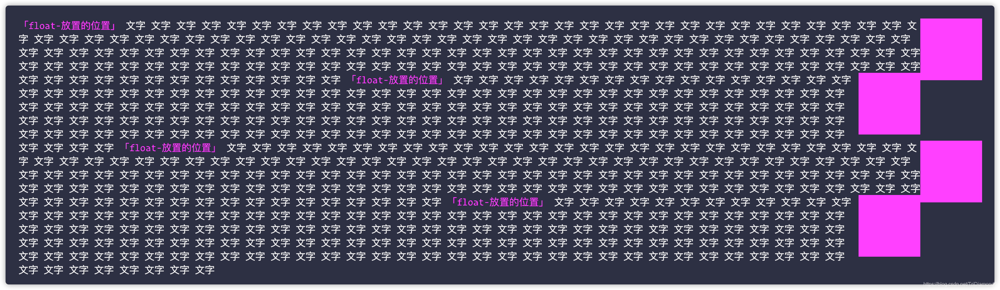
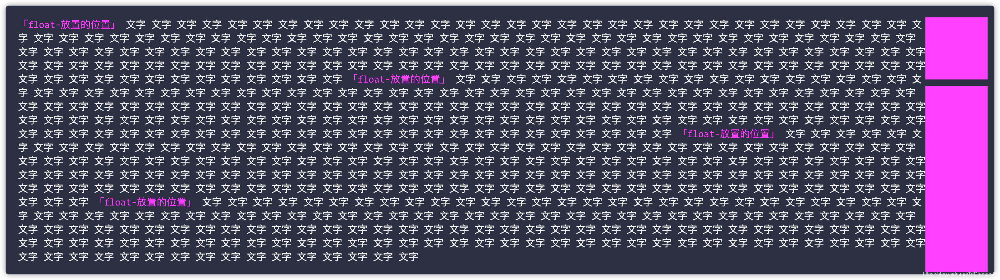
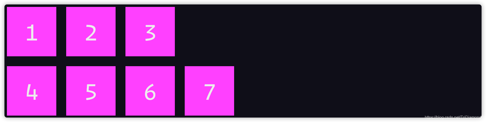

# 排版

## 盒(Box)

讲到排版，我们需要引入的第一个概念就是 “`盒`”。

而我们真正去讲到排版的时候，我们需要用到的单位一定就是 “`盒`”。

在真正进入详细了解 “盒” 的概念之前，我们先来做认识一下 3 个比较容易混交的概念。

1. 标签 ( Tag ) —— 源代码
2. 元素 (Element) —— 语义
3. 盒 ( Box ) —— 表现

> HTML 代码中可以书写开始`标签`，结束`标签`，和自封闭`标签`。

标签是一个源代码的概念，所以方式我们提到在 HTML 代码中写的肯定都是标签。

> 一对起止`标签`，表示一个`元素`。

元素是存在我们脑子里的一个概念，它是语义领域的一个概念，所以一对起止标签它一定是表示一个我们脑子里面的概念。


> DOM 树中存储的是`元素`和其他类型的节点 ( Node )。

DOM 树中存储的不全是元素，因为DOM 树中存储的东西叫节点 `Node`，所以元素只是是节点的一种。

比如说我们的文本节点也是节点，但他并不是元素。再比如我们的注释节点，它也是节点但是它也不是元素。当然还有 CDATA 节点，还有 processing-instruction，DTD等这些都是会存入 DOM 树的，当时它们都并不是元素。

很多同学的理解，DOM 树中存储的都是元素，不过这样也没有错。因为其他的节点相对来说都没有那么重要。

> CSS 选择器中的是`元素`。

其实这里还可以加一个 “或”，CSS 选择器选中的是`元素`或者是`伪元素`。

> CSS 选择器中的`元素`，在排版时可能产生多个`盒`。

这个地方是大家需要注意到的一个概念，**CSS 选择器选中的元素，它不一定和盒是一一对应的关系**。它有可能是一对多的关系的。**但是有盒一般来说必定是有对应的元素的**。我们不可能无中生有产生一个元素，即使是号称是无中生有的伪元素也是依附于一个选中的元素产生的。

> 排版和渲染的基本单位是`盒`

比如说 `inline` 元素就会因为分行而产生多个盒。又比如说带有伪元素，被伪元素选择器选中的元素也会生成多个盒。**所以我们排版盒渲染的基本单位都是盒**。

## 盒模型

既然我们讲到盒，我们都会讲到大名鼎鼎的 “`盒模型`”。我相信很多同学都知道盒模型，并且也学习过盒模型。但是也有很多同学可能没有理清楚摸透这个概念，所以就会导致不知道什么是盒模型，更不知道"`盒`"这个概念是从何而来。

上面我们已经讲清楚了盒是从，标签到元素，到 CSS 选择器到如何产生了盒。所以对盒的来龙去脉我们都很清楚了，所以这里我们就可以开始详细的去了解盒模型的概念。

> 盒模型是我们排版的时候所用的一种基本单位。

盒模型中的"盒"，不光是有一个宽和一个高。盒模型是一个多层的结构，从里面到外面分为：

1. 最里面就是`content`，也就是我们的内容
2. `content` 到 `border` 之间有一个圈空白，这个圈叫做 `padding`，也就是内边距
3. `Border` 的外面又有一个圈空白叫 `margin`，也就是外边距



- padding 主要影响的是盒内的空间 —— 主要决定盒内的空间排布，也就是 content 区域的大小
- margin 主要影响的是盒外的空间 —— 决定了盒周围空白区域的大小

盒模型里面的 宽 (width) 是有讲究的，盒子的宽度是有可能被 `box-sizing` 属性所影响的。最常见的两个值就是：

**content-box**

设置的 `width` 属性只包含 `content` 的内容的空间。也就是说：

`盒子占用的空间` = `content 的大小` + `padding 的大小` + `border 的大小` + `margin 的大小`

> 其实更接近人类的理解就是，我们在 CSS 中设置的 `width`属性只对最里面的 `content`的空间有效。其余的 `padding`，`border`和`margin` 都会叠加到盒子的占用空间。

那这个为什么程序员都说这种盒子是 “反人类” 的呢？如果很早起就接触到 HTML 和 CSS 的同学应该都知道这么一个让人痛不欲生的场景：

> 在排版时候我们明明设置好这个盒子的宽度，但是最后加了 border 和 padding 就让盒子 “变大” 了。所以最后我们要反过来重新计算 width 属性来保证这个盒子是我们想要的宽度。

对！可能很多用习惯 `box-sizing: border-box` 的同学，早就忘记了这些痛苦的日子了。但是事实上这个设计理念就是有点反人类的。所以后面就打了一个补丁来拯救我们程序员，加入了 `border-box`。从此之后程序员就又可以开心的敲代码了。

**border-box**

使用`border-box`，我们的 `width` 就包含了 `padding` 和 `border` 的尺寸了。

这样当我们给一个盒，`padding` 和 `border` 的时候，就不会影响我们给予盒子的 `width`。这样我们就可以保证我们盒子在没有 `margin` 的时候它所占据的空间就是与我们 `width` 一致的。

呈现出来的效果就是 padding 和 border 都会往内挤压空间，而不会影响盒子的宽度。

> 这里我们就讲完盒模型了，我们就发现它所影响的属性就是 `margin`，`padding`，`border`，`box-sizing`这几个属性。这些都是影响我们盒模型的总体尺寸，在排版中会影响着这个盒模型所占据的范围。

## 正常流

CSS 的排版其实是有三代的排版技术的：

- 第一代就是`正常流`
- 第二代就是基于 `Flex` 的排版
- 第三代就是基于 `Grid` 的排版
- 结合最近推出的 `CSS Houdini`，可能更接近的是 3.5 代，它是一种完全自由的，允许使用 JavaScript 干预的排版

目前主流都是在使用 `flex` 布局。相比 `flex`，其实正常流并没有变得更简单，反而是更复杂了。

### 块级排布

接下来我们来一起了解一下，正常流的块级排布。我们在上一部分已经了解了块级排布了。接下来我们一起来了解行级与块级的盒之间是如何排布的。

之前讲到的 BFC 和 IFC 的基本定义的时候，我们对块级排布已经有一个基础的认识了。但是呢正常流当中还有两个非常复杂的机制，我们需要先了解一下。

### Float 和 Clear

Float 和 Clear 也称为 `浮动` 与 `清除浮动`。首先浮动元素严格来说已经脱离了正常流，当时他又依附于正常流去定义的一类排布方式。

首先我们先来讲一下 `float` 的基本规则。根据 `W3C` 的标准，`float` 可对它有一下定义：

> float 元素可以先排到页面的某一个特定的位置，同时可以当它是正常流里的元素。然后如果它的属性中有 `float` 的时候，这个元素就会朝着 `float` 属性定义的方向去挤。

假设元素加入一个 `float: left` 属性，这个时候，这个元素就会往左边去挤，如下图：



原来已经存在的文字位置就被浮动了的元素所 “盖住” 了。所以呢这个时候就会根据 float 所占据的区域去调整行盒的位置。因为计算位置的时候我们还没有去计算每一个文字具体的位置，所以说理论上来讲这个地方的文字是没有重排的。

> 所以当一个元素变成了浮动时，它所占据的位置的原本内容，就会根据 float 之后占据的宽度来进行调整。而 float 显著的特征就是，它会影响我们生成这些行盒的尺寸。

所以在文字调整了之后我们最终看到浏览器呈现的效果是这样的：



float 不止会影响自己所在的行，凡是它的高度所占据的范围内的所有行盒都会根据 float 元素的尺寸调整自己的大小。如果超出了这个 float 范围的就不考虑了。



如果我们有两个 float 元素的时候，还会出现一种情况。假设我们现在有两个 float 元素，一个是 float: right 在右边，然后再后面又加入了一个 float 元素，而这个新的 float 元素一样也是向右浮动的。

这个时候我们会发现这个新的 float 元素也会受到上一个 float 元素影响，新的 float 元素是无法占据上一个 float 元素的位置。这时候的这个现象就是 **float 元素相堆叠的效果**。



> 当让如果我们继续添加 `float` 元素，并且也是浮动一样的方向的时候，都会受到上面多个 `float` 元素的影响并且继续堆叠。

接下来我们来看看一段实例代码：

```html
<style>
  .float-box {
    float: right;
    width: 100px;
    height: 100px;
    background-color: fuchsia;
    color: #ededed;
  }
  .wrapper {
    padding: 1.5rem;
    background: #2d2f42;
    color: #ededed;
  }
  .purple {
    color: fuchsia;
  }
</style>

<div class="wrapper">
  <span class="purple">「float-放置的位置」</span>
  <div class="float-box"></div>
  文字 文字 文字 文字 文字 文字 文字 文字 文字 文字 文字 文字 文字 文字 文字 文字 文字 文字 文字
  文字 文字 文字 文字 文字 文字 文字 文字 文字 文字 文字 文字 文字 文字 文字 文字 文字 文字 文字
  文字 文字 文字 文字 文字 文字 文字 文字 文字 文字 文字 文字 文字 文字 文字 文字 文字 文字 文字
  文字 文字 文字 文字 文字 文字 文字 文字 文字 文字 文字 文字 文字 文字 文字 文字 文字 文字 文字
  文字 文字 文字 文字 文字 文字 文字 文字 文字 文字 文字 文字 文字 文字 文字 文字 文字 文字 文字
  文字 文字 文字 文字 文字 文字 文字 文字 文字 文字 文字 文字 文字 文字 文字 文字 文字 文字 文字
  文字 文字 文字 文字 文字 文字 文字 文字 文字 文字 文字 文字 文字 文字 文字 文字 文字 文字 文字
  文字 文字 文字 文字 文字 文字 文字 文字 文字 文字 文字 文字 文字 文字 文字 文字 文字 文字 文字
  <span class="purple">「float-放置的位置」</span>
  <div class="float-box"></div>
  文字 文字 文字 文字 文字 文字 文字 文字 文字 文字 文字 文字 文字 文字 文字 文字 文字 文字 文字
  文字 文字 文字 文字 文字 文字 文字 文字 文字 文字 文字 文字 文字 文字 文字 文字 文字 文字 文字
  文字 文字 文字 文字 文字 文字 文字 文字 文字 文字 文字 文字 文字 文字 文字 文字 文字 文字 文字
  文字 文字 文字 文字 文字 文字 文字 文字 文字 文字 文字 文字 文字 文字 文字 文字 文字 文字 文字
  文字 文字 文字 文字 文字 文字 文字 文字 文字 文字 文字 文字 文字 文字 文字 文字 文字 文字 文字
  文字 文字 文字 文字 文字 文字 文字 文字 文字 文字 文字 文字 文字 文字 文字 文字 文字 文字 文字
  文字 文字 文字 文字 文字 文字 文字 文字 文字 文字 文字 文字 文字 文字 文字 文字 文字 文字 文字
  文字 文字 文字 文字 文字 文字 文字 文字 文字 文字 文字 文字 文字 文字 文字 文字 文字 文字 文字
  <span class="purple">「float-放置的位置」</span>
  <div class="float-box"></div>
  文字 文字 文字 文字 文字 文字 文字 文字 文字 文字 文字 文字 文字 文字 文字 文字 文字 文字 文字
  文字 文字 文字 文字 文字 文字 文字 文字 文字 文字 文字 文字 文字 文字 文字 文字 文字 文字 文字
  文字 文字 文字 文字 文字 文字 文字 文字 文字 文字 文字 文字 文字 文字 文字 文字 文字 文字 文字
  文字 文字 文字 文字 文字 文字 文字 文字 文字 文字 文字 文字 文字 文字 文字 文字 文字 文字 文字
  文字 文字 文字 文字 文字 文字 文字 文字 文字 文字 文字 文字 文字 文字 文字 文字 文字 文字 文字
  文字 文字 文字 文字 文字 文字 文字 文字 文字 文字 文字 文字 文字 文字 文字 文字 文字 文字 文字
  文字 文字 文字 文字 文字 文字 文字 文字 文字 文字 文字 文字 文字 文字 文字 文字 文字 文字 文字
  文字 文字 文字 文字 文字 文字 文字 文字 文字 文字 文字 文字 文字 文字 文字 文字 文字 文字 文字
  <span class="purple">「float-放置的位置」</span>
  <div class="float-box"></div>
  文字 文字 文字 文字 文字 文字 文字 文字 文字 文字 文字 文字 文字 文字 文字 文字 文字 文字 文字
  文字 文字 文字 文字 文字 文字 文字 文字 文字 文字 文字 文字 文字 文字 文字 文字 文字 文字 文字
  文字 文字 文字 文字 文字 文字 文字 文字 文字 文字 文字 文字 文字 文字 文字 文字 文字 文字 文字
  文字 文字 文字 文字 文字 文字 文字 文字 文字 文字 文字 文字 文字 文字 文字 文字 文字 文字 文字
  文字 文字 文字 文字 文字 文字 文字 文字 文字 文字 文字 文字 文字 文字 文字 文字 文字 文字 文字
  文字 文字 文字 文字 文字 文字 文字 文字 文字 文字 文字 文字 文字 文字 文字 文字 文字 文字 文字
  文字 文字 文字 文字 文字 文字 文字 文字 文字 文字 文字 文字 文字 文字 文字 文字 文字 文字 文字
  文字 文字 文字 文字 文字 文字 文字 文字 文字 文字 文字 文字 文字 文字 文字 文字 文字 文字 文字
</div>
```



这里面 `「float-放置的位置」`就是原本这个 float 元素的代码所放置的位置。但是经过了 float 之后，所有的 float 元素都会被挤到最右边的位置。最后所有行盒的生成都会围绕着所有的 float 元素，同时它们都不会占据 float 元素的空间。

这个时候当我们把外框的宽度增加的时候，就会发现这些 float 元素就会出现堆叠的现象。



> 看到这里肯定很多同学说觉得 “这样排版不行呀，老板肯定不收货呀”，“UI 设计师肯定要吊打我们啦”。是的这样的排版确实是不正常的，而且一般来说也没有这么排版的需求呢。

所以这里我们可以给 float 加一个 clear 属性，这样我们就可以让它们强制换行了。


```html
<style>
  .float-box {
    float: right;
    width: 100px;
    height: 100px;
    background-color: fuchsia;
    color: #ededed;
  }
  .wrapper {
    padding: 1.5rem;
    background: #2d2f42;
    color: #ededed;
  }
  .purple {
    color: fuchsia;
  }
</style>

<div class="wrapper">
  <span class="purple">「float-放置的位置」</span>
  <div class="float-box"></div>
  文字 文字 文字 文字 文字 文字 文字 文字 文字 文字 文字 文字 文字 文字 文字 文字 文字 文字 文字
  文字 文字 文字 文字 文字 文字 文字 文字 文字 文字 文字 文字 文字 文字 文字 文字 文字 文字 文字
  文字 文字 文字 文字 文字 文字 文字 文字 文字 文字 文字 文字 文字 文字 文字 文字 文字 文字 文字
  文字 文字 文字 文字 文字 文字 文字 文字 文字 文字 文字 文字 文字 文字 文字 文字 文字 文字 文字
  文字 文字 文字 文字 文字 文字 文字 文字 文字 文字 文字 文字 文字 文字 文字 文字 文字 文字 文字
  文字 文字 文字 文字 文字 文字 文字 文字 文字 文字 文字 文字 文字 文字 文字 文字 文字 文字 文字
  文字 文字 文字 文字 文字 文字 文字 文字 文字 文字 文字 文字 文字 文字 文字 文字 文字 文字 文字
  文字 文字 文字 文字 文字 文字 文字 文字 文字 文字 文字 文字 文字 文字 文字 文字 文字 文字 文字
  <span class="purple">「float-放置的位置」</span>
  <div class="float-box" style="clear:right"></div>
  文字 文字 文字 文字 文字 文字 文字 文字 文字 文字 文字 文字 文字 文字 文字 文字 文字 文字 文字
  文字 文字 文字 文字 文字 文字 文字 文字 文字 文字 文字 文字 文字 文字 文字 文字 文字 文字 文字
  文字 文字 文字 文字 文字 文字 文字 文字 文字 文字 文字 文字 文字 文字 文字 文字 文字 文字 文字
  文字 文字 文字 文字 文字 文字 文字 文字 文字 文字 文字 文字 文字 文字 文字 文字 文字 文字 文字
  文字 文字 文字 文字 文字 文字 文字 文字 文字 文字 文字 文字 文字 文字 文字 文字 文字 文字 文字
  文字 文字 文字 文字 文字 文字 文字 文字 文字 文字 文字 文字 文字 文字 文字 文字 文字 文字 文字
  文字 文字 文字 文字 文字 文字 文字 文字 文字 文字 文字 文字 文字 文字 文字 文字 文字 文字 文字
  文字 文字 文字 文字 文字 文字 文字 文字 文字 文字 文字 文字 文字 文字 文字 文字 文字 文字 文字
  <span class="purple">「float-放置的位置」</span>
  <div class="float-box" style="clear:right"></div>
  文字 文字 文字 文字 文字 文字 文字 文字 文字 文字 文字 文字 文字 文字 文字 文字 文字 文字 文字
  文字 文字 文字 文字 文字 文字 文字 文字 文字 文字 文字 文字 文字 文字 文字 文字 文字 文字 文字
  文字 文字 文字 文字 文字 文字 文字 文字 文字 文字 文字 文字 文字 文字 文字 文字 文字 文字 文字
  文字 文字 文字 文字 文字 文字 文字 文字 文字 文字 文字 文字 文字 文字 文字 文字 文字 文字 文字
  文字 文字 文字 文字 文字 文字 文字 文字 文字 文字 文字 文字 文字 文字 文字 文字 文字 文字 文字
  文字 文字 文字 文字 文字 文字 文字 文字 文字 文字 文字 文字 文字 文字 文字 文字 文字 文字 文字
  文字 文字 文字 文字 文字 文字 文字 文字 文字 文字 文字 文字 文字 文字 文字 文字 文字 文字 文字
  文字 文字 文字 文字 文字 文字 文字 文字 文字 文字 文字 文字 文字 文字 文字 文字 文字 文字 文字
  <span class="purple">「float-放置的位置」</span>
  <div class="float-box"  style="clear:right"></div>
  文字 文字 文字 文字 文字 文字 文字 文字 文字 文字 文字 文字 文字 文字 文字 文字 文字 文字 文字
  文字 文字 文字 文字 文字 文字 文字 文字 文字 文字 文字 文字 文字 文字 文字 文字 文字 文字 文字
  文字 文字 文字 文字 文字 文字 文字 文字 文字 文字 文字 文字 文字 文字 文字 文字 文字 文字 文字
  文字 文字 文字 文字 文字 文字 文字 文字 文字 文字 文字 文字 文字 文字 文字 文字 文字 文字 文字
  文字 文字 文字 文字 文字 文字 文字 文字 文字 文字 文字 文字 文字 文字 文字 文字 文字 文字 文字
  文字 文字 文字 文字 文字 文字 文字 文字 文字 文字 文字 文字 文字 文字 文字 文字 文字 文字 文字
  文字 文字 文字 文字 文字 文字 文字 文字 文字 文字 文字 文字 文字 文字 文字 文字 文字 文字 文字
  文字 文字 文字 文字 文字 文字 文字 文字 文字 文字 文字 文字 文字 文字 文字 文字 文字 文字 文字
</div>
```



所谓的 `clear` 有的翻译成 “清除浮动”，但是我觉得它不是清除浮动的意思。理论上来说它是 “找一个干净的空间来执行浮动” 的意思。

比如说 `clear: right`，就是要在右边找到一个干净的空间来执行这个浮动的操作。

所以看到上图的效果，当我们加入了 `clear: right` 之后，第一个后面的元素都不受第一个 `float` 元素的影响，各自找到一个干净的空间进行浮动。所以 `clear` 是有分 `left` 和 `right`，指的是向左或者右找干净的空间进行浮动。

虽然说 `float` 这种浮动布局给我们带来了不少的麻烦，但是 `float` 的堆叠、自动换行（或者使用 `clear` 去换行）的行为是可以帮助我们去进行一些有用的布局的。因为我们的正常流的布局在早年没有 `flex`的情况下，正常流的布局下完成一些著名的 CSS 布局需求的时候是非常的困难的。

**所以大家都产生这种使用 float 来代替正常流的 inline-block 来进行布局的技术。**

接下来我们看看下一段代码实例：

这里我们给每一个元素都加上一个 `float`，这时候元素跟元素之间的表现就很像一个正常流了。因为 `float` 元素它占满了之后还是会换行的。那么我们来看一下代码：

```html
<style>
  .float-box {
    margin: 10px;
    float: left;
    width: 100px;
    height: 100px;
    background-color: fuchsia;
    color: #ededed;
    text-align: center;
    line-height: 100px;
    font-size: 50px;
  }
</style>

<div class="float-box">1</div>
<div class="float-box">2</div>
<div class="float-box">3</div>
<div class="float-box">4</div>
<div class="float-box">5</div>
<div class="float-box">6</div>
<div class="float-box">7</div>
```


这里我们可以看到，float 是完全可以变成和正常流一样排成一行的，当我们缩小宽度的时候，不够位置的元素就会自动换到下一行。

这个时候如果我们想执行一个强制换行怎么办呢？这个时候我们就可以拿出我们的 `clear`。比如说我们想在 `3` 后面开始强制换行，我们就可以在 `4` 的浮动元素上加入 `clear: left` 即可。

> 这里要注意的是，float 它是不认 \<br/\> 的，如果我们在一个 float 元素的后面加入 \<br\> 是无法让他强制换行的。因为 br 是正常流的换行，对 float 是没有效的。

```html
<style>
  .float-box {
    margin: 10px;
    float: left;
    width: 100px;
    height: 100px;
    background-color: fuchsia;
    color: #ededed;
    text-align: center;
    line-height: 100px;
    font-size: 50px;
  }
</style>

<div class="float-box">1</div>
<div class="float-box">2</div>
<div class="float-box">3</div>
<div class="float-box" style="clear: left">4</div>
<div class="float-box">5</div>
<div class="float-box">6</div>
<div class="float-box">7</div>
```



我们平时做布局的时候，基本上我们都会使用盒而不是文字。我们很少有真正意义上需要像原始的 float 设计一样用图文混排的设计（就是向我们看的图书一样的布局方式）。在网页上布局，一般来说我们都是针对同一个级别，我们都是几个盒子排成正确的形状来完成页面上的布局。

所以说 float 这种布局的技术，在比较早期的时代是非常流行的。不过到了现在的前端技术时代，float 的布局方式已经完全被 `Flexbox` 技术所替代了。这里只是让大家知道一下，布局的历史里面有这么一个用法。

如果有同学遇到了一些需要维护非常古老的代码，就有可能看到这个技术。但是我不推荐大家当今还去使用这项技术。

### Margin 折叠

接下来我们来讲讲正常流里面的一种现象，叫做 `margin 折叠`。在 BFC 里我们的元素是顺次从上往下排的，但是顺次从上往下排的时候还是会受它的盒模型影响的。

就是有这么一个现象，在一个从上往下排布的 BFC 里面，有一个元素它有 margin，接着还有一个元素，它也有 margin。那么这个时候第二个元素它应该怎么排呢？

直接告诉我们应该是两个元素的 `margin` 是应该会叠加，如果第一个的 margin 是 10，第二个是 15，那么两个元素中间就是 `10 + 15 = 25`。对吧？不是的。

> 它们并不是把两个 margin 的空白都留出来。而是会让他们两个发生一个堆叠的这样的现象。最后叠出来的高度是跟最大的 margin 的高度相等的。如果一个是 10px，一个是 15px 的 margin，最后两个元素之间的空间就是 15px（使用了两个 margin 的最大值）。这个现象就是 `Margin Collapse (留白折叠/边距折叠)`。

有些同学觉得真的是匪夷所思，根本不符合常理。但是其实这个是一个排版里面的要求，因为在我们的排版当中，任何一个元素，它的盒模型里面所谓的 margin “**只是要求周围有这么多的空间是留白的，而不会说要求元素与元素之间的边距格子都有相对应的空白**”。所以只要元素的周围的留白的空间够了，自然就是一个合理的排版方式。

这个可以说也是继承了印刷行业，古老的印刷行业的排版体系中，这种 `Margin Collapse` 是一个非常自然的现象和思路。

> 我们要注意，这种 `Margin Collapse` 只会发生在 BFC 里面。它不会发生在 IFC 或者其他的排版方式里面，比如说 flex、grid 等都不会有 `Margin Collapse` 的。所以只有正常流中的 BFC 会发生边距折叠！ 

> 其实我们单看 float和单看边距折叠，它们都不太难，我们但看 BFC 也不太难。但是如果我们三个现象叠加在一起，基本上就是我们古代前端最大的难题了。也就是说大家平时会看到一些资料里面讲，面试的时候遇到的 BFC 问题就都在这个三个现象相叠加的。

### BFC 合并

接下来我们来认识一下正常流最困难的一部分，"`BFC 合并`"。在讲到具体的知识之前我们先来了解一下几个概念。

> BFC 代表的是 `Block Formatting Context (块级格式化上下文)`。

**Block (块)**

我们先大致了解一下 `Block` 里面有哪些：

- Block Container —— 是在 CSS2.1 标准里面定义的

  - 里面能装 BFC 的盒
  - 能容纳正常流的盒，里面就有 BFC

- Block-level Box

  - 外面有 BFC 的盒
  - 也就是说它能够被放入 BFC 的这种盒子里

- Block Box = Block Container + Block-level Box

  - 就是上面两个之和
  - 里外都有 BFC 的盒

## Flex 排版

**Flex 的排版逻辑还是分为三步：**

- 收集`盒`进行
- 计算`盒`在主轴方向的排布
- 计算`盒`在交叉轴方向的排布

> 对 flex 排版来说，是没有文字的，所以说 flex 排版我们是收集所有的盒进行。因为 flex 它是可以调整排布的方向的，所以我们不会用正常的 `top`、`left`、`bottom`、`right` 的体系去描述。而是用主轴和交叉轴去描述的。

### 分行

- 根据主轴尺寸，把元素分进行。
- 每加入一个元素到当前行，我们就会让它与行剩余的空间去做比较。
- 如果当前行已经满了，就创建一个新行，把新元素放到下一行。
- 若设置了 `no-wrap`，则强制分配进入第一行。（到计算主轴的时候，我们再去处理这些溢出的部分）

### 计算主轴方向

- 找出所有 Flex 元素
- 把主轴方向的剩余尺寸按比例分配给这些元素
- 若剩余空间为负数，所有 flex 元素为 0，等比压缩剩余元素

> Flex 里面有一个 Flex 属性的，Flex 为 1 就分一份，Flex 为 2 就分两份，如果我们这一行剩余空间是 300px，那么分一份的会分到 100px，而分两份的就会得到 200px。

> 如果剩余空间为负数，所有带 flex 属性的元素都会被置为 0。然后把剩余的那些元素做等比压缩。

### 计算交叉轴方向

- 根据每一个行最大元素尺寸计算行高
- 根据行高 `flex-align` 和 `item-align` ，确定元素具体位置