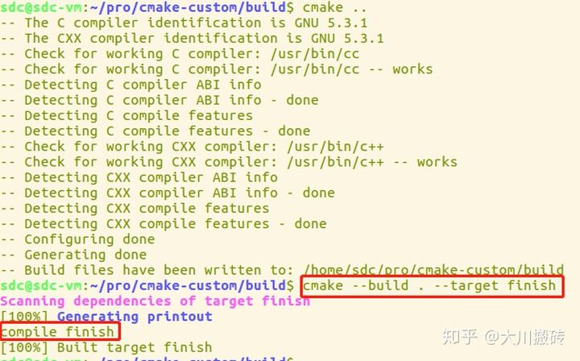
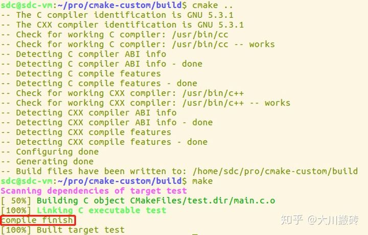
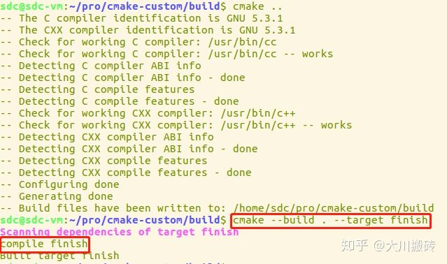

# CMake 

**CMake** 是一个跨平台的、开源的构建工具。`cmake` 是 `makefile` 的上层工具，它们的目的正是为了产生可移植的makefile，并简化自己动手写makefile时的巨大工作量。

目前很多开源的项目都可以通过CMake工具来轻松构建工程。

## 入门案例

### 项目部署


> c/c++ 项目工程部署如上:

- `src` : 源码工程目录
- `ext` : 第三方依赖库文件与头文件
- `CMakeLists.txt` : cmake 构建配置文件

### 简单案例

源文件编写 : `src/main.cc`

```cpp
#include <iostream>

int main() {
    std::cout << "Hello, World!" << std::endl;
    return 0;
}
```

编写CMAKE 配置文件 `CMakeLists.txt`

```txt
# cmake 最低版本需求
cmake_minimum_required(VERSION 3.13)

# 工程名称
project(cmake_study)

# 设置
set(CMAKE_CXX_STANDARD 11)

# 编译源码生成目标
add_executable(cmake_study src/main.cc)
```
cmake 命令便按照 `CMakeLists` 配置文件运行构建`Makefile`文件

```bash
$ mkdir build
$ cd build/
$ cmake ..
```

为了不让编译产生的中间文件污染我们的工程，我们可以创建一个 `build` 目录进入执行 `cmake` 构建工具. 如果没有错误， 执行成功后会在 `build` 目录下产生 `Makefile` 文件。

然后我们执行 `make` 命令就可以编译我们的项目了。

```bash
-rw-r--r--  1 root root 13591 Jul 20 12:09 CMakeCache.txt
drwxr-xr-x 14 root root   448 Jul 20 12:09 CMakeFiles
-rw-r--r--  1 root root  5034 Jul 20 12:09 Makefile
-rw-r--r--  1 root root  1508 Jul 20 12:09 cmake_install.cmake
-rwxr-xr-x  1 root root  9104 Jul 20 12:09 cmake_study
$ ./cmake_study
Hello, World!
```

以上就是大致的 cmake 构建运行过程。

**从上面的过程可以看出，cmake 的重点在配置 CMakeLists.txt 文件。**

## CMakeLists 详解

### CMakeLists 变量篇

关于CMake中不同变量的用法与总结

CMake中的变量

CMake中变量的类型有多种：通过set设置的普通变量和缓存变量、环境变量、数组变量等等，由于CMake在生成的过程中会加载缓存的关系，因此用法不一样。

常用的变量设置语法：

```txt
set(<variable> <value>
    [[CACHE <type> <docstring> [FORCE]] | PARENT_SCOPE])
```

#### 普通变量

普通变量（normal variable）相当于编程中脚本内部变量，类似于脚本文件的局部变量，这种变量不能跨越CMakeLists.txt文档。普通变量定义方式如下：

```txt
set(var "value")
```

设置一个普通变量var，值为value。

和编程语言中局部变量的用法类似，这个变量会屏蔽CMake缓存中的同名变量，（类似局部变量屏蔽全局变量）。但是这条语句不会改变缓存中的var变量。

#### 缓存变量

cache variable用于缓存变量，定义如下：

```txt
set(var "value" CACHE STRING "" FORCE)
```

这条语句设置了一个CACHE语句，类型是STRING，说明信息为空字符串，上述都不能省略。

**还有一种方法能够设置CACHE变量，就是通过cmake命令的-D选项，可以添加一个CACHE变量。**

CACHE作用如下：

- 如果缓存中存在同名的变量，根据FORCE来决定是否写入缓存：如果没有FORCE，这条语句不起作用，使用缓存中的变量；如果有FORCE，使用当前设置的值。

    - 注意，如果是FORCE，也能修改-D选项设置的CACHE变量，所以有可能传入的生成命令选项是无效的。

- 如果缓存中不存在同名的变量，则将这个变量写入缓存并使用。

缓存变量也可以设置只在本文件内生效，将STRING类型改为INTERNAL即可。

#### 环境变量

读取环境变量：`$ENV{...}`

设置环境变量：`set(ENV{...} ...)`

#### option变量

主要是缓存的字符串，只能是ON或OFF，他们允许一些特殊的处理，如依赖，这个变量可以跨文本。

不要将其option与set命令搞错。给定的值option实际上只是“初始值”（在第一个配置步骤中一次传送到缓存），之后将由用户通过CMake的GUI或者命令行进行更改

#### 常用变量

|                          环境变量名                          |                             描述                             |
| :----------------------------------------------------------: | :----------------------------------------------------------: |
| CMAKE_BINARY_DIR, PROJECT_BINARY_DIR, `<projectname>`_BINARY_DIR | 如果是 `in source` 编译,指得就是工程顶层目录,如果是 `out-of-source` 编译,指的是工程编译发生的目录。PROJECT_BINARY_DIR 跟其他指令稍有区别,现在,你可以理解为他们是一致的。 |
| CMAKE_SOURCE_DIR, PROJECT_SOURCE_DIR, `<projectname>`_SOURCE_DIR |                        工程顶层目录。                        |
|                   CMAKE_CURRENT_SOURCE_DIR                   | 当前处理的 CMakeLists.txt 所在的路径,比如上面我们提到的 src 子目录。 |
|                  CMAKE_CURRRENT_BINARY_DIR                   | 如果是 `in-source` 编译,它跟 CMAKE_CURRENT_SOURCE_DIR 一致,如果是 `out-of-source` 编译,他指的是 target 编译目录。 |
|         EXECUTABLE_OUTPUT_PATH , LIBRARY_OUTPUT_PATH         |                   最终目标文件存放的路径。                   |
|                         PROJECT_NAME                         |              通过 PROJECT 指令定义的项目名称。               |

#### 环境变量

|     系统信息变量名     |                      描述                       |
| :--------------------: | :---------------------------------------------: |
|  CMAKE_MAJOR_VERSION   |        CMAKE 主版本号,比如 2.4.6 中的 2         |
|  CMAKE_MINOR_VERSION   |        CMAKE 次版本号,比如 2.4.6 中的 4         |
|  CMAKE_PATCH_VERSION   |        CMAKE 补丁等级,比如 2.4.6 中的 6         |
|      CMAKE_SYSTEM      |           系统名称,比如 Linux-2.6.22            |
|   CMAKE_SYSTEM_NAME    |          不包含版本的系统名,比如 Linux          |
|  CMAKE_SYSTEM_VERSION  |              系统版本,比如 2.6.22               |
| CMAKE_SYSTEM_PROCESSOR |              处理器名称,比如 i686.              |
|          UNIX          | 在所有的类 UNIX 平台为 TRUE,包括 OS X 和 cygwin |
|         WIN32          |     在所有的 win32 平台为 TRUE,包括 cygwin      |

#### 编译选项

|  编译控制开关名   |                          描述                           |
| :---------------: | :-----------------------------------------------------: |
| BUILD_SHARED_LIBS |             使用 `ADD_LIBRARY` 时生成动态库             |
| BUILD_STATIC_LIBS |             使用 `ADD_LIBRARY` 时生成静态库             |
|   CMAKE_C_FLAGS   | 设置 C 编译选项,也可以通过指令 ADD_DEFINITIONS()添加。  |
|  CMAKE_CXX_FLAGS  | 设置 C++编译选项,也可以通过指令 ADD_DEFINITIONS()添加。 |

#### 总结

正常使用的时候，如果有多层CMakeLists.txt，需要跨文本的变量，应该使用CACHE类型，如果只是当前文本的变量，则不需要使用CACHE，更重要的是，应该避免使用同名的普通和缓存变量。另外，由于CMake没有有效的清除缓存的方法，如果要彻底清除缓存，需要删除build或者release文件夹的所有文件。

### CMake 常用指令

#### ADD_DEFINITIONS

语法 : `ADD_DEFINITIONS(-DENABLE_DEBUG -DABC)`

向 C/C++编译器添加 `-D` 定义. 如果你的代码中定义了`#ifdef ENABLE_DEBUG #endif`,这个代码块就会生效。

#### ADD_DEPENDENCIES

语法: `ADD_DEPENDENCIES(target-name depend-target1 depend-target2 ...)`

定义 target 依赖的其他 target, 确保在编译本 target 之前,其他的 target 已经被构建。

#### AUX_SOURCE_DIRECTORY

语法 : `AUX_SOURCE_DIRECTORY(dir VARIABLE)`

作用是发现一个目录下所有的源代码文件并将列表存储在一个变量中,这个指令临时被用来自动构建源文件列表。因为目前 cmake 还不能自动发现新添加的源文件。

比如 :

```
AUX_SOURCE_DIRECTORY(. SRC_LIST)
ADD_EXECUTABLE(main ${SRC_LIST})
```

#### ADD_SUBDIRECTORY

语法 : `ADD_SUBDIRECTORY(NAME)` 添加一个文件夹进行编译，该文件夹下的 CMakeLists.txt 负责编译该文件夹下的源码. NAME是想对于调用add_subdirectory的CMakeListst.txt的相对路径．

#### find_package

语法 : `find_package(<PackageName> [version] [EXACT] [QUIET] [MODULE] [REQUIRED] [[COMPONENTS] [components...]] [OPTIONAL_COMPONENTS components...] [NO_POLICY_SCOPE])`

查找并从外部项目加载设置。 `<PackageName>_FOUND` 将设置为指示是否找到该软件包。 找到软件包后，将通过软件包本身记录的变量和“导入的目标”提供特定于软件包的信息。 该`QUIET`选项禁用信息性消息，包括那些如果未找到则表示无法找到软件包的消息`REQUIRED``。REQUIRED`如果找不到软件包，该选项将停止处理并显示一条错误消息。

`COMPONENTS`选件后（或`REQUIRED`选件后，如果有的话）可能会列出所需组件的特定于包装的列表 。后面可能会列出其他可选组件`OPTIONAL_COMPONENTS`。可用组件及其对是否认为找到包的影响由目标包定义。

#### include_directories

语法 : `include_directories([AFTER|BEFORE] [SYSTEM] dir1 [dir2 ...])`

将给定目录添加到编译器用来搜索包含文件的目录中。相对路径被解释为相对于当前源目录。

包含目录添加到 `INCLUDE_DIRECTORIES` 当前`CMakeLists`文件的目录属性。它们也被添加到`INCLUDE_DIRECTORIES`当前`CMakeLists`文件中每个目标的target属性。目标属性值是生成器使用的属性值。

#### link_libraries

语法 : `link_libraries([item1 [item2 [...]]] [[debug|optimized|general] <item>] ...)`

将库链接到以后添加的所有目标。

#### ADD_EXECUTABLE

语法 : `ADD_EXECUTABLE(<name> [source1] [source2 ...])`

利用源码文件生成目标可执行程序。

#### ADD_LIBRARY

语法 : `ADD_LIBRARY(<name> [STATIC | SHARED | MODULE] [source1] [source2 ...])`

根据源码文件生成目标库。

`STATIC`,`SHARED` 或者 `MODULE` 可以指定要创建的库的类型。 STATIC库是链接其他目标时使用的目标文件的存档。 SHARED库是动态链接的，并在运行时加载

#### ENABLE_TESTING

语法: `ENABLE_TESTING()`.

控制 Makefile 是否构建 test 目标,涉及工程所有目录。 一般情况这个指令放在工程的主CMakeLists.txt 中.

#### ADD_TEST

语法 : `ADD_TEST(testname Exename arg1 arg2 ...)`

`testname` 是自定义的 test 名称,`Exename` 可以是构建的目标文件也可以是外部脚本等等。 后面连接传递给可执行文件的参数。 如果没有在同一个 CMakeLists.txt 中打开`ENABLE_TESTING()`指令, 任何 `ADD_TEST` 都是无效的。

#### CMAKE_MINIMUM_REQUIRED

语法 : `CMAKE_MINIMUM_REQUIRED` 定义 cmake 的最低兼容版本 比如 `CMAKE_MINIMUM_REQUIRED(VERSION 2.5 FATAL_ERROR)` 如果 cmake 版本小与 2.5,则出现严重错误,整个过程中止。

#### EXEC_PROGRAM

在 CMakeLists.txt 处理过程中执行命令,并不会在生成的 Makefile 中执行。 具体语法为:

```
EXEC_PROGRAM(Executable [directory in which to run]
                [ARGS <arguments to executable>]
                [OUTPUT_VARIABLE <var>]
                [RETURN_VALUE <var>])
```

用于在指定的目录运行某个程序,通过 ARGS 添加参数,如果要获取输出和返回值,可通过OUTPUT_VARIABLE 和 RETURN_VALUE 分别定义两个变量.

这个指令可以帮助你在 CMakeLists.txt 处理过程中支持任何命令,比如根据系统情况去修改代码文件等等。

#### FILE

文件操作指令

语法:

```
 FILE(WRITE filename "message to write"... )
 FILE(APPEND filename "message to write"... )
 FILE(READ filename variable)
 FILE(GLOB variable [RELATIVE path] [globbing expression_r_rs]...)
 FILE(GLOB_RECURSE variable [RELATIVE path] [globbing expression_r_rs]...)
 FILE(REMOVE [directory]...)
 FILE(REMOVE_RECURSE [directory]...)
 FILE(MAKE_DIRECTORY [directory]...)
 FILE(RELATIVE_PATH variable directory file)
 FILE(TO_CMAKE_PATH path result)
 FILE(TO_NATIVE_PATH path result)
```

#### MESSAGE

```txt
 message( [STATUS|WARNING|AUTHOR_WARNING|FATAL_ERROR|SEND_ERROR]
  "message to display" ...)
```

可以用下述可选的关键字指定消息的类型：

```txt
(无) = 重要消息；
STATUS = 非重要消息；
WARNING = CMake 警告, 会继续执行；
AUTHOR_WARNING = CMake 警告 (dev), 会继续执行；
SEND_ERROR = CMake 错误, 继续执行，但是会跳过生成的步骤；
FATAL_ERROR = CMake 错误, 终止所有处理过程；
```

CMake 的命令行工具会在 stdout 上显示 STATUS 消息，在 stderr 上显示其他所有消息。

CMake 的 GUI 会在它的 log 区域显示所有消息。交互式的对话框（ccmake 和 CMakeSetup）将会在状态行上一次显示一条 STATUS 消息，而其他格式的消息会出现在交互式的弹出式对话框中。

CMake 警告和错误消息的文本显示使用的是一种简单的标记语言。文本没有缩进，超过长度的行会回卷，段落之间以新行做为分隔符。

#### INCLUDE

include指令一般用于语句的复用，也就是说，如果有一些语句需要在很多CMakeLists.txt文件中使用，为避免重复编写，可以将其写在.cmake文件中，然后在需要的CMakeLists.txt文件中进行include操作就行了。

include指令的结构为：

```txt
include(<file|module> [OPTIONAL] [RESULT_VARIABLE <var>]
                      [NO_POLICY_SCOPE])
```

虽然，有不少的可选参数，但是一般情况下，都是直接写：

```txt
include(file|module)
```

注意，为了使`CMakeLists.txt`能够找到该文件，需要指定文件完整路径(绝对路径或相对路径)，当然如果指定了`CMAKE_MODULE_PATH`，就可以直接`include`该目录下的`.cmake`文件了。

`.cmake`文件里面通常是什么信息呢？

`.cmake`文件里包含了一些cmake命令和一些宏/函数，当`CMakeLists.txt`包含该`.cmake`文件时，当编译运行时，该`.cmake`里的一些命令就会在该包含处得到执行，并且在包含以后的地方能够调用该`.cmake`里的一些宏和函数。

#### add_custom_command

该指令用于添加自定义命令，实现某些操作。比如，编译之前进行一些文件拷贝操作等。

该命令有两种使用方式：

1. 配合 `add_custom_target` 使用，该命令生成 `add_custom_target` 的依赖；

```txt
add_custom_command(OUTPUT output1 [output2 ...]
                    COMMAND command1 [ARGS] [args1...]
                    [COMMAND command2 [ARGS] [args2...] ...]
                    [MAIN_DEPENDENCY depend]
                    [DEPENDS [depends...]]
                    [BYPRODUCTS [files...]]
                    [IMPLICIT_DEPENDS <lang1> depend1
                                     [<lang2> depend2] ...]
                    [WORKING_DIRECTORY dir]
                    [COMMENT comment]
                    [DEPFILE depfile]
                    [JOB_POOL job_pool]
                    [VERBATIM] [APPEND] [USES_TERMINAL]
                    [COMMAND_EXPAND_LISTS])
```

- `OUTPUT`：目标文件名称，代表下方的命令；

- `COMMAND`：需要执行的命令；

- `DEPENDS`：执行命令时需要的依赖；

**例子：**

```txt
cmake_minimum_required(VERSION 3.5)
​
project(test)
​
add_executable(${PROJECT_NAME} main.c)
​
add_custom_command(OUTPUT printout 
                  COMMAND ${CMAKE_COMMAND} -E echo compile finish
                  VERBATIM
                  )
​
add_custom_target(finish
                  DEPENDS printout
                  )
```

第 7 行的`add_custom_command`生成一个名叫 `printout` 的“文件”（该文件不可见），其代表下方的 `COMMAND` 命令；

第 12 行的`add_custom_target`"生成"目标文件 `finish` ，其依赖上方的 `printout`。

执行结果如图所示：（注意目标文件 `finish` 的使用方式）



2. 单独使用。在生成目标文件（使用 `add_executable()` 或 `add_library()` 命令生成的文件）时自动执行 `add_custom_command` 指定的命令。

```txt
add_custom_command(TARGET <target>
                  PRE_BUILD | PRE_LINK | POST_BUILD
                  COMMAND command1 [ARGS] [args1...]
                  [COMMAND command2 [ARGS] [args2...] ...]
                  [BYPRODUCTS [files...]]
                  [WORKING_DIRECTORY dir]
                  [COMMENT comment]
                  [VERBATIM] [USES_TERMINAL]
                  [COMMAND_EXPAND_LISTS])
```

- `TARGET`：由 add_executable 或 add_library 生成的目标文件名称；

- `PRE_BUILD | PRE_LINK | POST_BUILD`：分别表示编译之前执行命令，链接之前执行命令，生成目标文件后执行命令；

- `COMMAND`：需要执行的命令；

**例子：**

```txt
cmake_minimum_required(VERSION 3.5)
​
project(test)
​
add_executable(${PROJECT_NAME} main.c)
​
add_custom_command(TARGET ${PROJECT_NAME} 
                  POST_BUILD 
                  COMMAND ${CMAKE_COMMAND} -E echo compile finish
                  VERBATIM
                  )
```

该工程会生成可执行程序：`test`。生成 `test` 后，会在终端输出 `compile finish`。如图：



#### add_custom_target

`cmake` 本身支持两种目标文件：可执行程序（由 `add_executable()` 生成）和库文件（由 `add_library()` 生成）。使用 `add_custom_target` 可添加自定义目标文件，用于执行某些指令。

```txt
add_custom_target(Name [ALL] [command1 [args1...]]
                  [COMMAND command2 [args2...] ...]
                  [DEPENDS depend depend depend ... ]
                  [BYPRODUCTS [files...]]
                  [WORKING_DIRECTORY dir]
                  [COMMENT comment]
                  [JOB_POOL job_pool]
                  [VERBATIM] [USES_TERMINAL]
                  [COMMAND_EXPAND_LISTS]
                  [SOURCES src1 [src2...]])
```

- `Name`：目标文件名称；

- `ALL`：在使用 add_executable 或 add_library 生成目标文件时，默认不会“生成”该命令的目标文件，需要使用命令 cmake --target <Name> “生成”。但是如果指定了该参数，那么在生成上述目标文件时也会“生成”add_custom_target指定的目标文件；

- `COMMAND`：需要执行的命令；

- `DEPENDS`：执行命令时需要的依赖；

**例子：**

```txt
cmake_minimum_required(VERSION 3.5)
​
project(test)
​
add_executable(${PROJECT_NAME} main.c)
​
add_custom_target(finish 
                  COMMAND ${CMAKE_COMMAND} -E echo compile finish
                  )
```

结果：



注意：

1.该命令可单独使用，也可与 `add_custom_command` 一起使用；

2.该命令生成的目标文件不同于 `cmake` 本身生成的目标文件。该命令生成的目标文件是**不可见**的，也就是说在执行完编译命令后，在编译目录中并不能看到该命令生成的目标文件。实际上，该目标文件是一个代号，代表某些（个）命令。在“生成”该目标文件时，只是执行了其代表的命令。

#### macro 和 function

**macro宏定义与function函数的相同点**

macro形式如下：

```txt
macro(<name> [arg1 [arg2 [arg3 ...]]])
  COMMAND1(ARGS ...)
  COMMAND2(ARGS ...)
  ...
endmacro(<name>)
```

function形式如下：

```txt
function(<name> [arg1 [arg2 [arg3 ...]]])
  COMMAND1(ARGS ...)
  COMMAND2(ARGS ...)
  ...
function(<name>)
```

定义一个名称为name的宏（函数），arg1...是传入的参数。我们除了可以用${arg1}来引用变量以外，系统为我们提供了一些特殊的变量：

| 变量  | 说明                                                         |
| ----- | ------------------------------------------------------------ |
| ARGV# | #是一个下标，0指向第一个参数，累加                           |
| ARGV  | 所有的定义时要求传入的参数                                   |
| ARGN  | 定义时要求传入的参数以外的参数，比如定义宏（函数）时，要求输入1个，书记输入了3个，则剩下的两个会以数组形式存储在ARGN中 |
| ARGC  | 传入的实际参数的个数，也就是调用函数是传入的参数个数         |

**macro宏定义与function函数的不同点**

宏的ARGN、ARGV等参数不是通常CMake意义上的变量。 它们是字符串替换，很像C预处理器对宏的处理。 因此，如下命令是错误的：

```txt
if(ARGV1) # ARGV1 is not a variable 
if(DEFINED ARGV2) # ARGV2 is not a variable
if(ARGC GREATER 2) # ARGC is not a variable
foreach(loop_var IN LISTS ARGN) # ARGN is not a variable
```

正确写法如下：

```txt
if(${ARGV1})
if(DEFINED ${ARGV2})
if(${ARGC} GREATER 2)
foreach(loop_var IN LISTS ${ARGN})
or
set(list_var "${ARGN}")
foreach(loop_var IN LISTS list_var)
```

一个简单的例子

```txt
macro(FOO arg1 arg2 arg3)
    message(STATUS "this is arg1:${arg1},ARGV0=${ARGV0}")
    message(STATUS "this is arg2:${arg2},ARGV1=${ARGV1}")
    message(STATUS "this is arg3:${arg3},ARGV2=${ARGV2}")
    message(STATUS "this is argc:${ARGC}")
    message(STATUS "this is args:${ARGV},ARGN=${ARGN}")
    if(arg1 STREQUAL one)
        message(STATUS "this is arg1")
    endif()
    if(ARGV2 STREQUAL "two")
        message(STATUS "this is arg2")
    endif()
    set(${arg1} nine)
    message(STATUS "after set arg1=${${arg1}}")
endmacro(FOO)

function(BAR arg1)
    message(STATUS "this is arg1:${arg1},ARGV0=${ARGV0}")
    message(STATUS "this is argn:${ARGN}")
    if(arg1 STREQUAL first)
        message(STATUS "this is first")
    endif()
    set(arg1 ten)
    message(STATUS "after set arg1=${arg1}")
endfunction(BAR arg1)

set(p1 one)
set(p2 two)
set(p3 three)
set(p4 four)
set(p5 five)
set(p6 first)
set(p7 second)

FOO(${p1} ${p2} ${p3} ${p4} ${p5})
BAR(${p6} ${p7})
message(STATUS "after bar p6=${p6}")
```

输出结果如下:

```txt
-- this is arg1:one,ARGV0=one
-- this is arg2:two,ARGV1=two
-- this is arg3:three,ARGV2=three
-- this is argc:5
-- this is args:one;two;three;four;five,ARGN=four;five
-- after set arg1=nine
-- this is arg1:first,ARGV0=first
-- this is argn:second
-- this is first
-- after set arg1=ten
-- after bar p6=first
```

接下来看一个让我们蛋都能疼碎了的例子，简直不想用cmake：

```txt
macro(_bar)
  foreach(arg IN LISTS ARGN)
    message(STATUS "this is in macro ${arg}")
  endforeach()
endmacro()

function(_foo)
    foreach(arg IN LISTS ARGN)
        message(STATUS "this in function is ${arg}")
    endforeach()
  _bar(x y z)
endfunction()

_foo(a b c)
```

看一下输出:

```
-- this in function is a
-- this in function is b
-- this in function is c
-- this is in macro a
-- this is in macro b
-- this is in macro c
```

就是这么蛋疼，我们传给了`_bar(x y z)`,结果打印出来的是`a b c`,那我们把第二行的`foreach`改成`foreach(arg IN LISTS ${ARGN})`， 看一下结果：

```txt
-- this in function is a
-- this in function is b
-- this in function is c
```

没有输出_bar中的信息。为啥？因为这个ARGN的作用域是在function中的，也就是_foo函数中的那个ARGN。有兴趣的话可以试试在macro中调用function。

#### install

将项目生成的库文件、头文件、可执行文件或相关文件等安装到指定位置（系统目录，或发行包目录）。在`cmake`中，这主要是通过`install`方法在`CMakeLists.txt`中配置，`make install`命令安装相关文件来实现的。

**编写一个简单的库**

编写一个计算整数和浮点数之和的库函数mymath

mymath.h

```cpp
#ifndef MYMATH_H
#define MYMATH_H

int add(int, int);
double add(double, double);
#endif
```

mymath.cc

```cpp
#include "mymath.h"

int add(int a, int b){
    return a+b;
}

double add(double a, double b){
    return a+b;
}
```

可执行程序mymathApp.cc

```cpp
#include <iostream>
#include "mymath.h"

using namespace std;

int main(int argc, char const *argv[])
{
    double a = add(1.1, 1.1);
    int b = add(1, 1);
    cout << "1.1加1.1等于" << a <<endl;
    cout << "1加1等于" << b <<endl;
    return 0;
}
```

在CMakeLists中添加配置

```txt
cmake_minimum_required(VERSION 3.0)
project(Installation VERSION 1.0)

# 如果想生成静态库，使用下面的语句
# add_library(mymath mymath.cc)
# target_include_directories(mymath PUBLIC ${CMAKE_SOURCE_DIR}/include)

# 如果想生成动态库，使用下面的语句
add_library(mymath SHARED mymath.cc)
target_include_directories(mymath PRIVATE  ${CMAKE_SOURCE_DIR}/include)
set_target_properties(mymath PROPERTIES PUBLIC_HEADER ${CMAKE_SOURCE_DIR}/include/mymath.h)

# 生成可执行文件
add_executable(mymathapp mymathApp.cc)
target_link_libraries(mymathapp mymath)
target_include_directories(mymathapp PRIVATE ${CMAKE_SOURCE_DIR}/include)
```

接下来我们为生成的target配置安装目录。install方法的基础用法如下

```txt
install(TARGETS MyLib
        EXPORT MyLibTargets 
        LIBRARY DESTINATION lib  # 动态库安装路径
        ARCHIVE DESTINATION lib  # 静态库安装路径
        RUNTIME DESTINATION bin  # 可执行文件安装路径
        PUBLIC_HEADER DESTINATION include  # 头文件安装路径
        )
```

LIBRARY, ARCHIVE, RUNTIME, PUBLIC_HEADER是可选的，可以根据需要进行选择。 DESTINATION后面的路径可以自行制定，根目录默认为`CMAKE_INSTALL_PREFIX`,可以试用`set`方法进行指定，如果使用默认值的话，Unix系统的默认值为 `/usr/local`, Windows的默认值为 `c:/Program Files/${PROJECT_NAME}`。比如字linux系统下若LIBRARY的安装路径指定为lib,即为`/usr/local/lib`。所以要安装mymath mymathapp我们可以这样写

```txt
# 将库文件，可执行文件，头文件安装到指定目录
install(TARGETS mymath mymathapp
        EXPORT MyMathTargets
        LIBRARY DESTINATION lib
        ARCHIVE DESTINATION lib
        RUNTIME DESTINATION bin
        PUBLIC_HEADER DESTINATION include
        )
```

他人如果使用我们编写的函数库，安装完成后，希望可以通过find_package方法进行引用，这时我们需要怎么做呢。

首先我们需要生成一个`MyMathConfigVersion.cmake`的文件来声明版本信息

```txt
# 写入库的版本信息
include(CMakePackageConfigHelpers)
write_basic_package_version_file(
        MyMathConfigVersion.cmake
        VERSION ${PACKAGE_VERSION}
        COMPATIBILITY AnyNewerVersion  # 表示该函数库向下兼容
        )
```

其中`PACKAGE_VERSION`便是我们在`CMakeLists.txt`开头`project(Installation VERSION 1.0)`中声明的版本号

第二步我们将前面`EXPORT MyMathTargets`的信息写入到`MyLibTargets.cmake`文件中, 该文件存放目录为`${CMAKE_INSTALL_PREFIX}/lib/cmake/MyMath`

```txt
install(EXPORT MyMathTargets
        FILE MyLibTargets.cmake
        NAMESPACE MyMath::
        DESTINATION lib/cmake/MyLib
        )
```

最后我们在源代码目录新建一个`MyMathConfig.cmake.in`文件,用于获取配置过程中的变量，并寻找项目依赖包。如果不一来外部项目的话，可以直接include `MyMathTargets.cmake`文件

```txt
include(CMakeFindDependencyMacro)

# 如果想要获取Config阶段的变量，可以使用这个
# set(my-config-var @my-config-var@)

# 如果你的项目需要依赖其他的库，可以使用下面语句，用法与find_package相同
# find_dependency(MYDEP REQUIRED)

# Any extra setup

# Add the targets file
include("${CMAKE_CURRENT_LIST_DIR}/MyMathTargets.cmake")
```

最后在CMakeLists.txt文件中，配置生成`MyMathTargets.cmake`文件，并一同安装到`${CMAKE_INSTALL_PREFIX}/lib/cmake/MyMath`目录中。

```txt
configure_file(MyMathConfig.cmake.in MyMathConfig.cmake @ONLY)
install(FILES "${CMAKE_CURRENT_BINARY_DIR}/MyMathConfig.cmake"
                "${CMAKE_CURRENT_BINARY_DIR}/MyMathConfigVersion.cmake"
        DESTINATION lib/cmake/MyMath
        )
```

最后我们在其他项目中，就可以使用

```txt
find_package(MyMath 1.0)
target_linked_library(otherapp MyMath::mymath)
```

来引用我们的函数库了。

### CMake 控制指令

- **IF 指令**

```
if(<condition>)
  <commands>
elseif(<condition>) # optional block, can be repeated
  <commands>
else()              # optional block
  <commands>
endif()

#####

IF(var),如果变量不是:空,0,N, NO, OFF, FALSE, NOTFOUND 或<var>_NOTFOUND 时,表达式为真。
IF(NOT var ),与上述条件相反。
IF(var1 AND var2),当两个变量都为真是为真。
IF(var1 OR var2),当两个变量其中一个为真时为真。
IF(COMMAND cmd),当给定的 cmd 确实是命令并可以调用是为真。
IF(EXISTS dir)或者 IF(EXISTS file),当目录名或者文件名存在时为真。
IF(file1 IS_NEWER_THAN file2),当 file1 比 file2 新,或者 file1/file2 其中有一个不存在时为真,文件名请使用完整路径。
IF(IS_DIRECTORY dirname),当 dirname 是目录时,为真。
IF(variable MATCHES regex)
IF(string MATCHES regex)
```

- **FOREACH 指令**

语法:

```
foreach(<loop_var> <items>)
  <commands>
endforeach()
```

其中`<items>`是以分号或空格分隔的项目列表。记录foreach匹配和匹配之间的所有命令endforeach而不调用。 一旦endforeach评估，命令的记录列表中的每个项目调用一次`<items>`。在每次迭代开始时，变量loop_var将设置为当前项的值。

- **WHILE 指令**

语法:

```
while(<condition>)
  <commands>
endwhile()
```

while和匹配之间的所有命令 endwhile()被记录而不被调用。 一旦endwhile()如果被评估，则只要为`<condition>`真，就会调用记录的命令列表。

## 实战

### 多个目录，多个源文件

- 文件部署:

```
./Demo3
    |
    +--- main.cc
    |
    +--- math/
          |
          +--- MathFunctions.cc
          |
          +--- MathFunctions.h
```

- 顶层的 `CMakeLists.txt`

```
# CMake 最低版本号要求
cmake_minimum_required (VERSION 2.8)
# 项目信息
project (Demo3)
# 查找当前目录下的所有源文件
# 并将名称保存到 DIR_SRCS 变量
aux_source_directory(. DIR_SRCS)
# 添加 math 子目录
add_subdirectory(math)
# 指定生成目标 
add_executable(Demo main.cc)
# 添加链接库
target_link_libraries(Demo MathFunctions)
```

- math 中使用`CMakeLists.txt` 生成静态库文件:

```
# 查找当前目录下的所有源文件
# 并将名称保存到 DIR_LIB_SRCS 变量
aux_source_directory(. DIR_LIB_SRCS)
# 生成链接库
add_library (MathFunctions ${DIR_LIB_SRCS})
```

### 添加第三方依赖库

现在工程需要第三方依赖库 `jsoncpp` :

```
./cmake-start
  | 
  +---src/main.cc
  +---ext/jsoncpp/
           |
           + ---include/
           + ---lib/
  +---CMakeLists.txt
```

CMakeLists ：

```
cmake_minimum_required (VERSION 2.8)

project(cmake)

add_definitions(-std=gnu++11)

set(EXECUTABLE_OUTPUT_PATH ${PROJECT_BINARY_DIR}/bin)

include_directories(${CMAKE_SOURCE_DIR}/ext/jsoncpp/include)
link_directories(${CMAKE_SOURCE_DIR}/ext/jsoncpp/lib)

aux_source_directory(src SRC)

add_executable(demon ${SRC})

target_link_libraries(demon kmsjsoncpp)
```

### 自定义编译选项

CMake 允许为项目增加编译选项，从而可以根据用户的环境和需求选择最合适的编译方案。

例如，可以将 MathFunctions 库设为一个可选的库，如果该选项为 `ON` ，就使用该库定义的数学函数来进行运算。否则就调用标准库中的数学函数库。

**修改 CMakeLists 文件** 我们要做的第一步是在顶层的 CMakeLists.txt 文件中添加该选项:

```
# CMake 最低版本号要求
cmake_minimum_required (VERSION 2.8)
# 项目信息
project (Demo4)
# 加入一个配置头文件，用于处理 CMake 对源码的设置
configure_file (
  "${PROJECT_SOURCE_DIR}/config.h.in"
  "${PROJECT_BINARY_DIR}/config.h"
  )
# 是否使用自己的 MathFunctions 库
option (USE_MYMATH
       "Use provided math implementation" ON)
# 是否加入 MathFunctions 库
if (USE_MYMATH)
  include_directories ("${PROJECT_SOURCE_DIR}/math")
  add_subdirectory (math)  
  set (EXTRA_LIBS ${EXTRA_LIBS} MathFunctions)
endif (USE_MYMATH)
# 查找当前目录下的所有源文件
# 并将名称保存到 DIR_SRCS 变量
aux_source_directory(. DIR_SRCS)
# 指定生成目标
add_executable(Demo ${DIR_SRCS})
target_link_libraries (Demo  ${EXTRA_LIBS})
```

## 使用细节

### include(GNUInstallDirs)

`GNUInstallDirs`也是对应到CMake安装包提供的`GNUInstallDirs.cmake`文件。

根据[GNUInstallDirs](https://cmake.org/cmake/help/v3.0/module/GNUInstallDirs.html)的CMake手册:

> 提供为GNU软件定义的安装目录变量...
> 
> ```
> ...
> INCLUDEDIR       - C header files (include)
> OLDINCLUDEDIR    - C header files for non-gcc (/usr/include)
> ...
>

### include(CMakePackageConfigHelpers)

Helper函数用于创建配置文件,这些文件可以被其他项目所包含,以便查找和使用一个包。

添加 `configure_package_config_file()` 和 `write_basic_package_version_file()` 命令。

- **configure_package_config_file**

为一个项目创建一个配置文件。

```txt
configure_package_config_file(<input> <output>
  INSTALL_DESTINATION <path>
  [PATH_VARS <var1> <var2> ... <varN>]
  [NO_SET_AND_CHECK_MACRO]
  [NO_CHECK_REQUIRED_COMPONENTS_MACRO]
  [INSTALL_PREFIX <path>]
  )
```

`configure_package_config_file()` 创建用于安装项目或库的 `<PackageName>Config.cmake` 或 `<PackageName>-config.cmake` 文件时，应使用`configure_package_config_file（）`而不是普通的 `configure_file()` 命令。通过避免已安装的 `Config.cmake` 文件中的硬编码路径，它有助于使结果包可重定位。

在 `FooConfig.cmake` 文件中，可能会有类似的代码，以使使用项目知道安装目标：

```txt
set(FOO_INCLUDE_DIR   "@CMAKE_INSTALL_FULL_INCLUDEDIR@" )
set(FOO_DATA_DIR   "@CMAKE_INSTALL_PREFIX@/@RELATIVE_DATA_INSTALL_DIR@" )
set(FOO_ICONS_DIR   "@CMAKE_INSTALL_PREFIX@/share/icons" )
＃...从自己的位置确定installPrefix的逻辑...
set(FOO_CONFIG_DIR  "${installedPrefix}/@CONFIG_INSTALL_DIR@" )
```

上面显示的所有4个选项都不足够，因为前3个硬编码绝对目录位置，并且第4种情况仅在确定 `installedPrefix` 的逻辑正确且 `CONFIG_INSTALL_DIR` 包含相对路径的情况下才有效，这通常不能保证。这样做的结果是，生成的 `FooConfig.cmake` 文件在Windows和OSX下无法正常工作，在Windows和OSX上，用户习惯于在安装时选择二进制程序包的安装位置，而与在构建/cmake时设置 `CMAKE_INSTALL_PREFIX` 的方式无关。

使用 `configure_package_config_file` 会有所帮助。如果使用正确，它将使所生成的 `FooConfig.cmake` 文件可重定位。用法：

1. `FooConfig.cmake.in` 写一个`FooConfig.cmake.in`文件

2. 插入仅包含字符串 `@PACKAGE_INIT@`

3. 代替 `set(FOO_DIR "@SOME_INSTALL_DIR@")` ，使用 `set(FOO_DIR "@PACKAGE_SOME_INSTALL_DIR@")` （必须在 `@PACKAGE_INIT@` 行之后）

4. 而不是使用常规的 `configure_file()` ，而是使用 `configure_package_config_file()`

