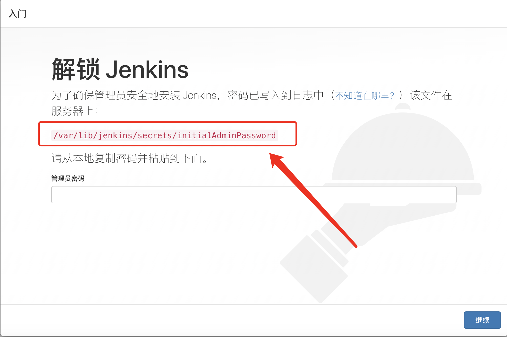
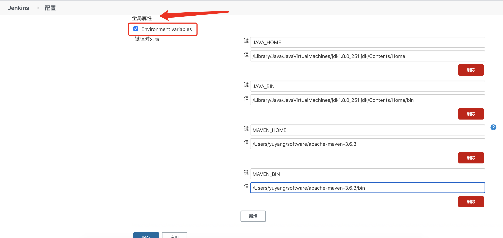

# Jenkins基础使用

## Jenkins官网

[https://www.jenkins.io/zh/](https://www.jenkins.io/zh/)

## Jenkins安装

**安装Jenkins前需提前安装好Java 8+**

### Mac OS

Jenkins可以直接下载pkg包进行安装：[http://mirrors.jenkins-ci.org/osx-stable/jenkins-2.235.2.pkg](http://mirrors.jenkins-ci.org/osx-stable/jenkins-2.235.2.pkg)

Jenkins也可以使用`brew`以下方式安装：

- 安装最新版本

  ```bash
  brew install jenkins
  ```

- 安装 LTS 版本

  ```shell
  brew install jenkins-lts
  ```

### Ubuntu

#### 使用apt-get安装 

请首先将密钥添加到系统中：

```bash
wget -q -O - https://pkg.jenkins.io/debian-stable/jenkins.io.key | sudo apt-key add -
```

然后在/etc/apt/sources.list中添加以下条目：

```bash
deb https://pkg.jenkins.io/debian-stable binary/
```

更新您的本地软件包索引，然后最终安装Jenkins：

```bash
sudo apt-get update
sudo apt-get install jenkins
```

#### 使用离线安装包安装

在官方地址下载对应的deb包：[https://pkg.jenkins.io/debian-stable/](https://pkg.jenkins.io/debian-stable/)

安装：

```bash
dpkg -i package.deb
```

### Centos

#### 使用yum安装

添加对应仓库：

```bash
sudo wget -O /etc/yum.repos.d/jenkins.repo https://pkg.jenkins.io/redhat-stable/jenkins.repo
sudo rpm --import https://pkg.jenkins.io/redhat-stable/jenkins.io.key
```

安装：

```bash
yum install jenkins
```

#### 使用离线安装包安装

在官方地址下载对应的rpm包：[https://pkg.jenkins.io/debian-stable/](https://pkg.jenkins.io/debian-stable/)

安装：

```bash
rpm -i package.rpm
```

## 初始化

启动Jenkins

```
sudo service jenkins start
```

而后Jenkins会运行在本地8080端口，可以使用浏览器访问：[http://localhost:8080/](http://localhost:8080/)或 [http://127.0.0.1:8080/](http://127.0.0.1:8080/)


在初始化的界面可能会停留几分钟，请耐心等待。待出现以下界面，根据页面上展示的信息，获取`admin`的密码：



而后系统提醒你是否需要安装插件，这个时候点右上角的叉就行。此时没有配置国内镜像源，下载插件较慢。


## 插件安装

在`Manage Jenkins`下的`pluginManager`：


### 手动上传

在`Advanced`下有个`Upload Plugin`即可选择打包好的`xx.hpi`文件上传。


### 插件中心安装

在`Available`下，使用搜索框即可搜索所需插件，勾选对应插件即可安装。


#### 配置国内源

1、采用上述插件中心安装的方式，安装`Localization: Chinese (Simplified)`插件。

2、修改 系统管理 >> 管理插件 >> 高级
将 [升级站点] 更换为
https://mirrors.tuna.tsinghua.edu.cn/jenkins/updates/current/update-center.json

#### 用户管理插件

安装插件：`Role-based Authorization Strategy`

可以实现对用户权限更精细化的管理，详情：[https://blog.51cto.com/zengestudy/1782494](https://blog.51cto.com/zengestudy/1782494)

#### Git

为使用`jenkins`从`gitlab`上拉取代码，需要安装git相关插件。如你采用的代码托管平台为`gitlab`，则需要安装`git`与`gitlab`两个插件。

## 环境配置

配置我们需要用到的`JDK`、`Maven`等环境。

### Global Tool Configuration

需配置meavn与jdk对应环境变量。如图所示，无需到bin目录。


### Configure System



## 创建项目

创建项目，点击左侧的`New Item`即`新建Item`。默认情况下只有Freestyle风格的项目，用户可根据自己的需求安装相关插件。接下来介绍

### Freestyle风格

创建好项目后，主要有以下5点可以配置：

\- General
　　项目基本配置
　　项目名字,描述,参数,禁用项目,并发构建,限制构建默认node等
\- Source code managemet(源码管理)
　　代码库信息,支持Git,Subversion等
\- Build Triggers(构建触发器)
　　构建触发方式
　　周期性构建,poll scm,远程脚本触发构建,其他项目构建结束后触发等
\- Build(构建)
　　项目构建任务
　　添加1个或者多个构建步骤
\- Post-build Actions(构建后操作)
　　构建后行为
　　Artifact归档,邮件通知,发布单元测试报告,触发下游项目等

####  Source code managemet(源码管理)

可以配置项目远程仓库的地址，Jenkins将从你提供的地址，获取项目源码。


####  Build Triggers(构建触发器)

触发器的可以使开发人员不用手动的去点击`“Build Now”`构建项目，而是在某一条件下自动被触发。

详情可参考：[https://www.cnblogs.com/caoj/p/7815820.html](https://www.cnblogs.com/caoj/p/7815820.html)

#### Build(构建)

在这里可以借助各类插件以及`shell`命令实现构建项目的功能，如`mvn packages`以及`Anchore Build`插件。

### Pipeline风格

除了Freestyle风格，较常用的项目构建风格还有Piepline。

官方教程：[https://www.jenkins.io/zh/doc/pipeline/tour/hello-world/](https://www.jenkins.io/zh/doc/pipeline/tour/hello-world/)

官方介绍：[https://www.jenkins.io/zh/doc/book/pipeline/](https://www.jenkins.io/zh/doc/book/pipeline/)

在创建项目之前，需要先安装`Piepline`的插件。安装好插件后，在新建项目的时候便可以在新建项目的时候勾选“流水线工程”。创建好工程后，便可以借助代码片段生成器撰写我们的流水线构建代码。


#### Jenkinsfile

除了上述直接在网页中添加我们的脚本，这样的做法可能存在一点隐患，就是当Jenkins服务器崩溃后，你无法再获取到原脚本。且无法同时为多个Jenkins服务器配置。于是，我们可以将编写好的文件(Jenkinsfile)放入工程项目中，而后使用jenkins服务器远程获取。


