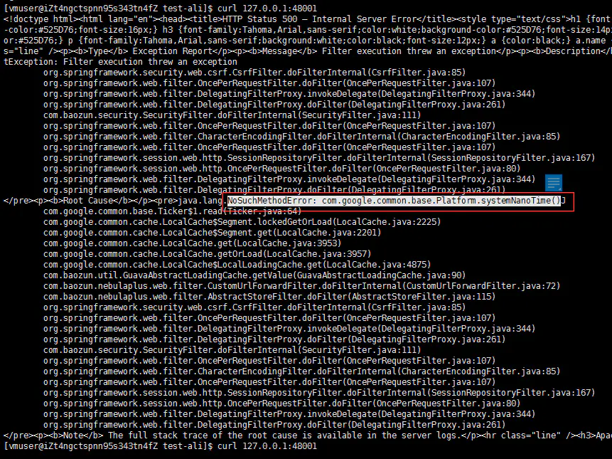
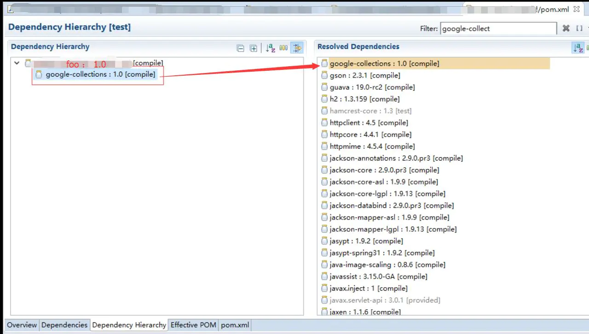

# Maven依赖管理

本文从实际工作中的一个bug出发，讲解了业务的背景、分析了问题产生的原因、介绍了解决问题的思路，同时介绍了Maven的依赖机制。

## 业务场景

最近在工作中，使用Dubbo调用远程服务，需要依赖被调用方(dubbo service provider)提供的一些jar包。

下面是maven和dubbo的相关配置。

- pom.xml

```xml
<!-- 远程dubbo服务 -->
<dependency>
    <groupId>com.dubbo.service.provider</groupId>
    <artifactId>foo-api</artifactId>
    <version>1.0</version>
</dependency>
```

- dubbo-serivce-provider.xml

```xml
 <dubbo:reference id="fooService" interface="com.dubbo.service.provider.FooService" check="false" url="${dubbo.foo.server.address}"/>
```

## 发现问题

项目启动后，出现如下异常

```java
java.lang.NoSuchMethodError: com.google.common.base.Platform.systemNanoTime()
```





## 问题原因

通过Eclipse查看依赖树发现，foo-api所依赖的jar与项目中的jar发生了冲突。





可以将如上场景抽象为下面的逻辑：

```
  A依赖
      -> B

  D依赖
      -> A
      -> B

```

因为Maven拥有传递依赖的特性，因此真实的依赖树是：

```
  A依赖
      -> B

  D依赖
      -> A
          -> B
      -> B

```

因此D项目发生了依赖冲突。

## 相关知识：依赖传递(Transitive Dependencies)

依赖传递(Transitive Dependencies)是Maven 2.0开始的提供的特性，依赖传递的好处是不言而喻的，可以让我们不需要去寻找和发现所必须依赖的库，而是将会自动将需要依赖的库帮我们加进来。

例如A依赖了B，B依赖了C和D，那么你就可以在A中，像主动依赖了C和D一样使用它们。并且传递的依赖是没有数量和层级的限制的，非常方便。

但依赖传递也不可避免的会带来一些问题，例如：

- 当依赖层级很深的时候，可能造成循环依赖(cyclic dependency)
- 当依赖的数量很多的时候，依赖树会非常大

针对这些问题，Maven提供了很多管理依赖的特性：

### 依赖调节(Dependency mediation)

依赖调节是为了解决版本不一致的问题(multiple versions),并采取就近原则(nearest definition)。

举例来说，A项目通过依赖传递依赖了两个版本的D：

A -> B -> C -> ( D 2.0) ,  A -> E -> (D 1.0),

那么最终A依赖的D的version将会是1.0，因为1.0对应的层级更少，也就是更近。

### 依赖管理(Dependency management)

通过声明Dependency management，可以大大简化子POM的依赖声明。

举例来说项目A,B,C,D都有共同的Parent，并有类似的依赖声明如下：

- A、B、C、D/pom.xml

```xml
    <dependencies>
        <dependency>
          <groupId>group-a</groupId>
          <artifactId>artifact-a</artifactId>
          <version>1.0</version>
          <exclusions>
            <exclusion>
              <groupId>group-c</groupId>
              <artifactId>excluded-artifact</artifactId>
            </exclusion>
          </exclusions>
        </dependency>
        <dependency>
          <groupId>group-a</groupId>
          <artifactId>artifact-b</artifactId>
          <version>1.0</version>
          <type>bar</type>
          <scope>runtime</scope>
        </dependency>
      </dependencies>
```

如果父pom声明了如下的Dependency management:

- Parent/pom.xml

```xml
     <dependencyManagement>
        <dependencies>
          <dependency>
            <groupId>group-a</groupId>
            <artifactId>artifact-a</artifactId>
            <version>1.0</version>

            <exclusions>
              <exclusion>
                <groupId>group-c</groupId>
                <artifactId>excluded-artifact</artifactId>
              </exclusion>
            </exclusions>

          </dependency>

          <dependency>
            <groupId>group-c</groupId>
            <artifactId>artifact-b</artifactId>
            <version>1.0</version>
            <type>war</type>
            <scope>runtime</scope>
          </dependency>

          <dependency>
            <groupId>group-a</groupId>
            <artifactId>artifact-b</artifactId>
            <version>1.0</version>
            <type>bar</type>
            <scope>runtime</scope>
          </dependency>
        </dependencies>
      </dependencyManagement>
```

那么子项目的依赖声明会非常简单：

- A、B、C、D/pom.xml

```xml
      <dependencies>
        <dependency>
          <groupId>group-a</groupId>
          <artifactId>artifact-a</artifactId>
        </dependency>

        <dependency>
          <groupId>group-a</groupId>
          <artifactId>artifact-b</artifactId>
          <!-- 依赖的类型，对应于项目坐标定义的packaging。大部分情况下，该元素不必声明，其默认值是jar.-->
          <type>bar</type>
        </dependency>
      </dependencies>
```

### 依赖范围(Dependency scope)

Maven在编译主代码的时候需要使用一套classpath，在编译和执行测试的时候会使用另一套classpath,实际运行项目的时候，又会使用一套classpath。

依赖范围就是用来控制依赖与这三种classpath(编译classpath、测试classpath、运行classpath)的关系的，Maven有以下几种依赖范围：

- compile: 编译依赖范围。

如果没有指定，就会默认使用该依赖范围。

使用此依赖范围的Maven依赖，对于编译、测试、运行三种classpath都有效。

- test: 测试依赖范围。

使用此依赖范围的Maven依赖，只对于测试classpath有效，在编译主代码或者运行项目的使用时将无法使用此类依赖。

典型例子是JUnit，它只有在编译测试代码及运行测试的时候才需要。

- provided: 已提供依赖范围。

使用此依赖范围的Maven依赖，对于编译和测试classpath有效，但在运行时无效。

典型例子是servlet-api，编译和测试项目的时候需要该依赖，但在运行项目的时候，由于容器已经提供，就不需要Maven重复地引入一遍。

- runtime: 运行时依赖范围。

使用此依赖范围的Maven依赖，对于测试和运行classpath有效，但在编译主代码时无效。

典型例子是JDBC驱动实现，项目主代码的编译只需要JDK提供的JDBC接口，只有在执行测试或者运行项目的时候才需要实现上述接口的具体JDBC驱动。

- system: 系统依赖范围。

该依赖与三种classpath的关系，和provided依赖范围完全一致。但使用system范围依赖时必须通过systemPath元素显式地指定依赖文件的路径。由于此类依赖不是通过Maven仓库解析的，而且往往与本机系统绑定，可能造成构建的不可移植，因此应该谨慎使用。

systemPath元素可以引用环境变量：

```xml
  <dependency>
      <groupId>com.system</groupId>
      <artifactId>foo</artifactId>
      <version>1.0</version>
      <scope>system</scope>
      <systemPath>${maven.home}/lib/foo.jar</systemPath>
  </dependency>

```

- import(Maven 2.0.9及以上): 导入依赖范围。

我们知道，maven的继承和java是一样的，只能单继承。因此，父pom可能非常庞大，如果你想把依赖分类清晰的进行管理，就更不可能了。

import scope依赖能解决这个问题。你可以把Dependency Management放到单独用来管理依赖的pom中，然后在需要使用依赖的模块中通过import scope依赖，就可以引入dependencyManagement。

例如，父pom.xml：

```xml
  <project>
      <modelVersion>4.0.0</modelVersion>
      <groupId>com.test.sample</groupId>
      <artifactId>base-parent1</artifactId>
      <packaging>pom</packaging>
      <version>1.0.0-SNAPSHOT</version>
      <dependencyManagement>
          <dependencies>
              <dependency>
                  <groupId>junit</groupId>
                  <artifactid>junit</artifactId>
                  <version>4.8.2</version>
              </dependency>
              <dependency>
                  <groupId>log4j</groupId>
                  <artifactid>log4j</artifactId>
                  <version>1.2.16</version>
              </dependency>
          </dependencies>
      </dependencyManagement>
  </project>
```

通过非继承的方式来引入这段依赖管理配置：

```xml
  <dependencyManagement>
      <dependencies>
          <dependency>
              <groupId>com.test.sample</groupId>
              <artifactid>base-parent1</artifactId>
              <version>1.0.0-SNAPSHOT</version>
              <type>pom</type>
              <scope>import</scope>
          </dependency>
      </dependencies>
  </dependencyManagement>

  <dependency>
      <groupId>junit</groupId>
      <artifactid>junit</artifactId>
  </dependency>
  <dependency>
      <groupId>log4j</groupId>
      <artifactid>log4j</artifactId>
  </dependency>
```

注意：import scope只能用在dependencyManagement里面

### 排除依赖(Excluded dependencies)

排除不需要从所依赖的项目中传递过来的依赖，好比你买车的时候，主动跟卖车的说明不需要买车附加的保险业务。下面在解决思路中会举例说明。

### 可选依赖(Optional dependencies)

被依赖的项目主动不把可以传递的依赖传递下去，好比卖车的主动声明自己不会让买车的人买这辆车附加的保险业务。下面在解决思路中会举例说明。

## 解决思路

有了上面的知识背景，考虑使用Maven提供的Optional和Exclusions来控制依赖的传递。

```
A
  -> B
D
  -> A
  -> B
```

**Optional** 定义后，该依赖只能在本项目中传递，不会传递到引用该项目的父项目中，父项目需要主动引用该依赖才行。

- A/pom.xml

```xml
<dependency>
    <groupId>com.bar</groupId>
    <artifactId>B</artifactId>
    <version>1.0</version>
    <optional>true</optional>
</dependency>
```

这种情况下，A对B的依赖将不会传递给D.

**Exclusions** 则是主动排除子项目传递过来的依赖。

- D/pom.xml

```xml
<dependency>
    <groupId>com.bar</groupId>
    <artifactId>A</artifactId>
    <version>1.0</version>
    <exclusions>
        <exclusion>
            <groupId>com.bar</groupId>
            <artifactId>B</artifactId>
        </exclusion>
    </exclusions>
</dependency>
```

这种情况下，D对A的依赖将不会包含B.

开始提到的问题就是通过exclusion的方式解决的。

## 总结

Maven的依赖机制(Dependency Mechanism)是Maven最著名的特性，并且是Maven在依赖管理领域中最令人称道的。因此，对Maven的依赖机制有深入的理解，对使用Maven非常必要。
